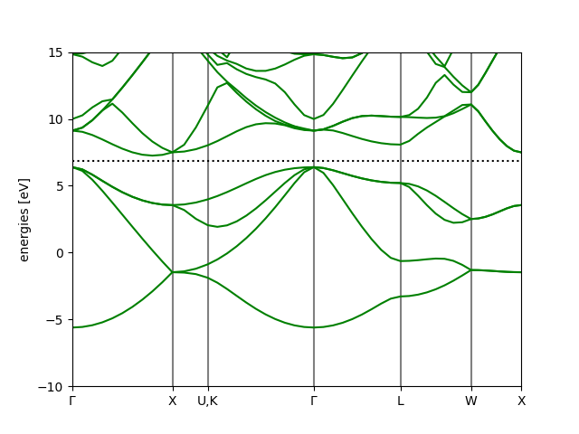
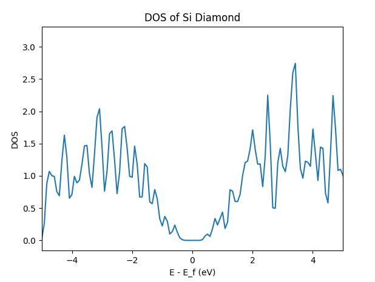
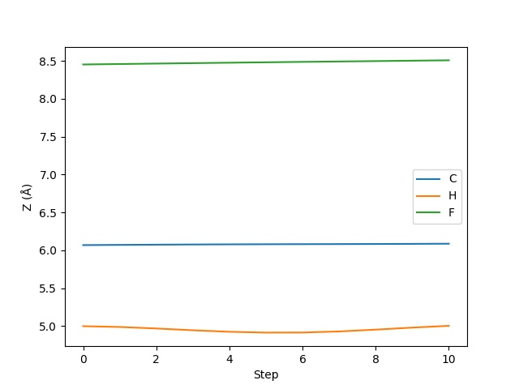
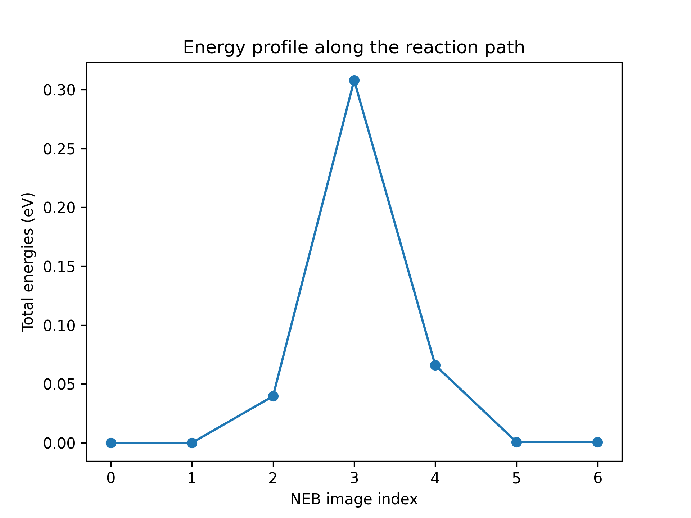

# abacuslite 使用教程：API

**作者：黄一珂，邮箱：huangyike@ime.ac.cn**

**审核：陈默涵，邮箱：mohanchen@pku.edu.cn**

> 💡
> 写在开头：以下内容需要阅读者具有 Python 编程基础，了解 numpy 的基本使用方法

> 🐍
> abacuslite 是一个 Python 程序包，旨在利用

- （基于 ABACUS 主程序 3.9.0.25 之后）最简便的安装
- 最轻量化的依赖
  使得用户
- 在 Python 编程中，将 ABACUS 作为能量/受力/应力和电子结构的计算器，进行工作流的灵活搭建
- 借助 ASE（Atomic Simulation Environment）中已有的功能实现，高度敏捷地将 ABACUS 应用在各种场景中，将 ABACUS 的效率-精度平衡特点以最快速度在最大广度得到发挥
  也可以帮助 ABACUS 开发者进行
- 从“算法 POC Python 端快捷实现”到“在 ABACUS 主代码中进行高性能实现”的开发流程

> 📖
> 本教程基于 python/ase-plugin/examples 目录下的各算例进行讲解，具体介绍如何利用 abacuslite 进行
>
> - 自洽场计算（scf.py）
> - 结构优化（relax.py）
> - 晶胞优化（cellrelax.py）
> - 能带计算（bandstructure.py）
> - 态密度计算（dos.py）
> - 分子动力学模拟（md.py）
> - 限制性分子动力学模拟（constraintmd.py）
> - 元动力学（metadynamics.py）
> - 弹性带搜索过渡态（neb.py）
>   **注意：**以上案例不会重复对某一技术细节的介绍和解释。从“自洽场计算”案例开始，后续的案例将建立在前序案例中已经介绍过的技术细节基础上进行内容组织。

# 环境配置与安装

## conda 环境创建

推荐使用 conda 环境，如果当前电脑上没有配置 conda，请下载 minionda 或者 anaconda：

[https://www.anaconda.com/docs/getting-started/miniconda/install](https://www.anaconda.com/docs/getting-started/miniconda/install)

。确保 conda 已经正确配置后，创建例如名为 abacus 的 conda 环境：

```
conda create -n abacus python=3.10
```

在命令行中执行上述命令，将创建名为 abacus，python 版本为 3.10 的 conda 环境。创建完成后，执行

```bash
conda activate abacus
```

激活 conda 环境。

## 安装 abacuslite

abacuslite 需要的基本依赖非常少。对于不需要进行 metadynamics 的计算，可以仅 check-in 到 interfaces/ASE_interface 目录下，执行

```bash
pip install .
```

进行安装。pip 将自动解析当前环境，安装包括 ase, seekpath, numpy, scipy, matplotlib 等基本依赖。注意：区别于原先的 ase-abacus，我们不再强制用户从何处拉取某一特定版本的 ase，从而使得用户能够尽可能地获得包含 ase 在内的各种功能的最新更新。

对于需要 metadynamic 的使用情况，需要安装正确版本的 plumed，这里推荐按照如下方式进行安装（和 abacuslite 的安装没有先后顺序依赖）：

```bash
conda install -c conda-forge plumed=2.8.2=mpi_openmpi_hb0545ae_0
conda install -c conda-forge py-plumed
```

# 案例一：硅晶体的能量计算

该案例位于 python/ase-plugin/examples/scf.py。

## 用 ASE 作为平台及进行计算：Calculator 的概念与设置

我们在本案例开始之前，首先简单进行 ASE 最常见使用方法介绍。

第一步是通常是进行结构的创建，既可以通过 ASE 所支持的各种建模工具函数进行创建

```python
# create a structure, Si diamond, with lattice consitant 5.43 Angstrom
from ase.build import bulk
silicon = bulk('Si', 'diamond', a=5.43)
```

，也可以从外部文件直接导入（支持大部分的通用结构文件格式）

```python
# or import structure from an external file
from ase.io import read
silicon = read('Si_mp-149_primitive.cif')
```

。他们都会属于 ase.atoms.Atoms 类型（以下简称 Atoms 类型）的对象

```python
# the silicon is actually an instance of ase.atoms.Atoms
from ase.atoms import Atoms
assert isinstance(silicon, Atoms)
```

。注意，ASE 还支持更高级的建模功能，如切晶面、团簇构建等，详情参见 ASE 的线上文档：

- [https://ase-lib.org/ase/build/build.html](https://ase-lib.org/ase/build/build.html)
- [https://ase-lib.org/ase/lattice.html#general-crystal-structures-and-surfaces](https://ase-lib.org/ase/lattice.html#general-crystal-structures-and-surfaces)
- [https://ase-lib.org/ase/cluster/cluster.html#creating-a-nanoparticle](https://ase-lib.org/ase/cluster/cluster.html#creating-a-nanoparticle)

为了进行当前结构的计算（能量、原子受力、晶格应力等），需要导入 ase.calculators.Calculator（以下简称 Calculator）。在 ase 中，直接可用的 Calculator 有 EMT, LJ 等。例如我们导入 EMT 计算器，并创建对象：

```python
from ase.calculators.emt import EMT
mycalc = EMT()
```

接下来将 Calculator 和 Atoms 对象进行绑定，使得当前 Atoms 对象拥有一个可以用来计算自己能量、原子受力等性质的计算器：

```python
silicon.calc = mycalc
```

因此我们就可以通过调用当前 Atoms 对象的 get_potential_energy()成员函数，来进行能量计算了：

```python
print(silicon.get_potential_energy())
```

这个函数会调用刚刚绑定到 silicon 的 mycalc 来进行具体的计算。

## Profile 的概念与设置：AbacusProfile

对于实际的 DFT 软件来说，有两个方面需要考虑：

1. 是否需要对外界文件的依赖，如赝势、轨道等？
2. 是否支持在 DFT 软件运行中途和 ASE 进行数据交换？

profile 被设计用来作为 calculator 和文件系统和运行环境（如 MPI、OMP 等）进行交互的场所，由 profile 来控制 DFT 软件以命令行的方式在后台调用。Quantum ESPRESSO、ABACUS 和 ORCA 同样使用 profile 的方式。作为反例，CP2K 支持以 cp2k_shell 的方式持续挂起，可以通过管道的方式连续进行计算任务的设置和计算，之后通过管道方式进行结果返回，因此这类软件不需要 profile 的实现。值得一提的是，目前 ABACUS 在开发 pyabacus package，预期在完成之后可以实现类似的效果，届时 AbacusProfile 将仅作为可选设置项出现。

在当前版本中，一个合适的 AbacusProfile 对象的设置方式如下所述。首先我们进行必要的库的 import：

```python
from pathlib import Path # a more Pythonic alternative to the os.path
here = Path(__file__).parent
# to the directory where the pseudopotential and orbital files are stored
# In your case you change to the appropriate one
pporb = here.parent.parent.parent / 'tests' / 'PP_ORB'
```

我们利用了 ABACUS 代码中自带的部分赝势和轨道文件（位于 tests/PP_ORB），在其他例子中也是如此，因此不再在后文中赘述。

```python
from abacuslite import AbacusProfile
aprof = AbacusProfile(
    command='mpirun -np 4 abacus',
    pseudo_dir=pporb,
    orbital_dir=pporb,
    omp_num_threads=1,
)
```

我们将 pseudo_dir 和 orbital_dir 都设置为 pporb，即规定了 ase 中以 ABACUS 为核心的 calculator，会始终以

```
...
    pseudo_dir=pporb,
    orbital_dir=pporb,
...
```

的设置和当前运行的计算机的文件系统进行交互（读取赝势和轨道文件）。以

```
command='mpirun -np 4 abacus',
....
    omp_num_threads=1,
```

的方式调用 ABACUS，即每次后台调用 ABACUS 通过命令

```bash
OMP_NUM_THREADS=1 mpirun -np 4 abacus
```

的方式进行。

## ABACUS calculator

之后针对这一结构，我们进行 ABACUS calculator 的设置：

```python
from abacuslite import Abacus
jobdir = here / 'scf'
abacus = Abacus(
    profile=aprof,
    directory=str(jobdir),
    pseudopotentials={'Si': 'Si_ONCV_PBE-1.0.upf'},
    basissets={'Si': 'Si_gga_8au_100Ry_2s2p1d.orb'},
    inp={
        'calculation': 'scf',
        'nspin': 1,
        'basis_type': 'lcao',
        'ks_solver': 'genelpa',
        'ecutwfc': 100,
        'symmetry': 1,
        'kspacing': 0.1
    }
)
```

可以看到，

- 我们将 profile 参数设置为 aprof，即为刚刚创建的 AbacusProfile 对象
- directory 是这个 calculator 进行计算所使用的临时文件夹，所有 ABACUS 进行计算产生的临时文件也存储在这个文件夹中
- pseudopotentials 和 basissets 为每个出现的元素设置赝势和轨道文件。如果说进行 ABACUS PW 计算，则 basissets 参数不用指定
- 通过 inp，设置 ABAUCS 类似于 INPUT 的参数。注意：pseudo_dir 和 orbital_dir 不需要在此处设置。

**PS.: **关于 k 点采样，除了在 INPUT 中指定 kspacing 或者 gamma_only 参数外，也可以通过

```python
abacus = Abacus(
    profile=aprof,
    directory=str(jobdir),
    pseudopotentials={'Si': 'Si_ONCV_PBE-1.0.upf'},
    basissets={'Si': 'Si_gga_8au_100Ry_2s2p1d.orb'},
    inp={
        ....
    },
    kpts={
        'mode': 'mp-sampling',
        'gamma-centered': True,
        'nk': (5, 5, 5),
        'kshift': (0, 0, 0)
    }
)
```

的方法进行设置。

## 最后一步

经过如上所述的设置，创建了叫做 abacus 的 calculator，接下来只需要按照 **ase 一贯的方式**进行使用：

1. 给 Atoms 对象绑定 calculator

```python
silicon.calc = abacus
```

1. 利用 get_potential_energy()函数拉起计算

```python
print(atoms.get_potential_energy())
```

# 案例二：硅晶体的结构优化

该案例位于 python/ase-plugin/examples/relax.py。

注意：我们从本例开始，将不再重复阐述 AbacusProfile 的设计理念，以及 Abacus 的参数设置意义。

## 创建 profile, calculator 对象

```python
from pathlib import Path # a more Pythonic alternative to the os.path
here = Path(__file__).parent
# to the directory where the pseudopotential and orbital files are stored
# In your case you change to the appropriate one
pporb = here.parent.parent.parent / 'tests' / 'PP_ORB'

from abacuslite import Abacus, AbacusProfile

# AbacusProfile: the interface connecting the Abacus calculator instance
# with the file system and the enviroment
aprof = AbacusProfile(
    command='mpirun -np 8 abacus',
    pseudo_dir=pporb,
    orbital_dir=pporb,
    omp_num_threads=1,
)

# Abacus: the calculator instance
jobdir = here / 'relax'
abacus = Abacus(
    profile=aprof,
    directory=str(jobdir),
    pseudopotentials={'Si': 'Si_ONCV_PBE-1.0.upf'},
    basissets={'Si': 'Si_gga_8au_100Ry_2s2p1d.orb'},
    inp={
        'calculation': 'scf',
        'nspin': 1,
        'basis_type': 'lcao',
        'ks_solver': 'genelpa',
        'ecutwfc': 100,
        'symmetry': 1,
        'kspacing': 0.1,
        'cal_force': 1 # let ABACUS calculate the forces
    }
)
```

**注意：**此时我们将 cal_force 这一 ABACUS 参数显式设置为 1，用来让 ABACUS 进行原子受力的计算（这对于几何结构优化任务是必需的）。

## 创建 Atoms 对象并绑定 calculator

```python
atoms = bulk('Si', 'diamond', a=5.43)
```

为了使得几何结构优化任务不在第一步结束，我们对原子结构进行微扰

```python
# displacement the atoms a little bit
atoms.rattle(stdev=0.1)
```

接下来仍然是绑定 ABACUS 到这个对象：

```python
# bind the atoms with the abacus
atoms.calc = abacus
```

## 创建优化器对象并绑定 Atoms 进行优化

```python
from ase.optimize import BFGS
dyn = BFGS(atoms, logfile='-')
```

我们接下来使用 ase 中实现的 BFG 优化器对 atoms 进行结构优化。除了 BFGS，ase.optimize 模块还提供了诸如 BFGSLineSearch, FIRE 等优化器，用户可以根据自身需求进行选择，这里我们使用最常见的 BFGS。

BFGS 对象的创建需要绑定在 atoms 上，构成一个待运行的优化问题。接下来调用 dyn 的 run()方法进行执行：

```python
dyn.run(fmax=0.05)
```

，其他参数请参见 ase 的官方文档（[https://ase-lib.org/ase/optimize.html](https://ase-lib.org/ase/optimize.html)）。结构优化后的原子位置会重新覆盖写入 Atoms 对象中，因此我们只需要

```python
from ase.io import write
write('relaxed.cif', atoms)
```

即可保存优化后结构到文件中。

# 案例三：硅晶体的晶胞优化

该案例位于 python/ase-plugin/examples/cellrelax.py。

在本案例中，我们将简单应用 ase.filters 模块，进行晶胞与原子的联合弛豫。

## 创建 profile, calculator

```python
from pathlib import Path # a more Pythonic alternative to the os.path
here = Path(__file__).parent
# to the directory where the pseudopotential and orbital files are stored
# In your case you change to the appropriate one
pporb = here.parent.parent.parent / 'tests' / 'PP_ORB'
from abacuslite import Abacus, AbacusProfile

# AbacusProfile: the interface connecting the Abacus calculator instance
# with the file system and the enviroment
aprof = AbacusProfile(
    command='mpirun -np 4 abacus',
    pseudo_dir=pporb,
    orbital_dir=pporb,
    omp_num_threads=1,
)

# Abacus: the calculator instance
jobdir = here / 'scf'
abacus = Abacus(
    profile=aprof,
    directory=str(jobdir),
    pseudopotentials={'Si': 'Si_ONCV_PBE-1.0.upf'},
    basissets={'Si': 'Si_gga_8au_100Ry_2s2p1d.orb'},
    inp={
        'calculation': 'scf',
        'nspin': 1,
        'basis_type': 'lcao',
        'ks_solver': 'genelpa',
        'ecutwfc': 100,
        'symmetry': 1,
        'kspacing': 0.1,
        'cal_force': 1, # let ABACUS calculate the forces
        'cal_stress': 1 # let ABACUS calculate the stress
    }
)
```

## 创建 Atoms 对象并绑定 calculator

```python
from ase.build import bulk
atoms = bulk('Si', 'diamond', a=5.43)

# bind the atoms with the abacus
atoms.calc = abacus
```

## 创建优化器对象并绑定到过滤后 Atoms 进行优化

```python
from ase.optimize import BFGS
from ase.filters import FrechetCellFilter
dyn = BFGS(FrechetCellFilter(atoms), logfile='-')
dyn.run(fmax=0.05)
```

注意，这里和之前不同。在案例二中我们看到，如果直接将 atoms 放入 BFGS 的形参表，构成优化任务，则实际上 run()执行的是 atoms 中原子受力的优化。此处将 atoms 使用 FrechetCellFilter 进行过滤，使得应力的 components（共六个，分别控制 a, b, c 三个方向的应变和 ab, bc, ac 三个方向的剪切）连同原子受力进行最小化。如果我们仅仅希望优化应变而不希望优化剪切，即固定晶胞的各角度，那么使用 mask 形参即可：

```python
dyn = BFGS(FrechetCellFilter(
              atoms, 
              mask=[True, True, True, False, False, False]
      ), logfile='-')
```

。当 mask 的值为 True，则优化该 component，否则不优化。

# 案例四：硅晶体的能带计算

该案例位于 python/ase-plugin/examples/bandstructure.py。

注意：并非所有的 DFT 软件都支持以该方式进行能带计算，当前的功能实现参考了 ase 官方文档中所给出的 GPAW 作为 DFT calculator 时的使用方法。

## 基本设置：profile, calculator, Atoms

```python
from pathlib import Path # a more Pythonic alternative to the os.path
here = Path(__file__).parent
# to the directory where the pseudopotential and orbital files are stored
# In your case you change to the appropriate one
pporb = here.parent.parent.parent / 'tests' / 'PP_ORB'
from abacuslite import Abacus, AbacusProfile
from ase.build import bulk

# AbacusProfile: the interface connecting the Abacus calculator instance
# with the file system and the enviroment
aprof = AbacusProfile(
    command='mpirun -np 4 abacus',
    pseudo_dir=pporb,
    orbital_dir=pporb,
    omp_num_threads=1,
)

# Abacus: the calculator instance
jobdir = here / 'bandstructure'
abacus = Abacus(
    profile=aprof,
    directory=str(jobdir),
    pseudopotentials={'Si': 'Si_ONCV_PBE-1.0.upf'},
    basissets={'Si': 'Si_gga_8au_100Ry_2s2p1d.orb'},
    inp={
        'calculation': 'scf',
        'nspin': 1,
        'basis_type': 'lcao',
        'ks_solver': 'genelpa',
        'ecutwfc': 100,
        'symmetry': 1,
        'kspacing': 0.1
    }
)

atoms = bulk('Si', 'diamond', a=5.43)
atoms.calc = abacus
```

## SCF 计算

我们和自洽场计算一样地，使用 get_potential_energy()函数就可以触发 ABACUS 的计算：

```python
_ = atoms.get_potential_energy()
```

## 能带计算与后处理

对于给定晶体的能带，我们利用 seekpath 进行能带路径的自动生成：

```python
from abacuslite.utils.ksampling import kpathgen

kpathstr, kspecial = kpathgen(atoms)
```

之后转化为 ase 接受的 atoms.cell.bandpath 形式：

```python
# instantiate the bandpath
bandpath = atoms.cell.bandpath(path=kpathstr,
                               npoints=50,
                               special_points=kspecial)
```

。基于之前得到的收敛电荷密度，我们基于之前的 SCF calculator，固定电荷密度得到非自洽 calculator（亦即 fixed_density）：

```python
# derive the band structure calculator from SCF calculator
bscalc = atoms.calc.fixed_density(bandpath)
```

。接下来将新的 NSCF calculator 绑定到 Atoms 对象上，之后触发新的计算：

```python
atoms.calc = bscalc
_ = atoms.get_potential_energy() # NSCF calculation will be performed
```

。我们得到了计算结果，接下来使用自带的能带处理工具进行绘图和信息导出：

```python
bs = bscalc.band_structure()
bs.write('bandstructure.json')
# you can use the ase-cli to plot the JSON file later by:
# ```
# ase band-structure bandstructure.json -r -10 15
# ```
```

上述代码将能带读取到了 bs 对象中，之后将数据写入 bandstructure.json，此文件可以使用命令

```bash
ase band-structure bandstructure.json -r -10 15
```

这一 ase 自带的命令进行绘图，-r 指定了能量范围，即为费米面下 15 eV 到费米面上 15 eV。

也可以利用 bs.plot 来进行在线的绘制和图片生成：

```python
bs.plot(emin=-10, emax=15, filename='bandstructure.png')
```

得到结果：



# 案例五：硅晶体的态密度计算

该案例位于 python/ase-plugin/examples/dos.py。

## 基本设置：profile, calculator, Atoms

```python
from pathlib import Path # a more Pythonic alternative to the os.path
here = Path(__file__).parent
# to the directory where the pseudopotential and orbital files are stored
# In your case you change to the appropriate one
pporb = here.parent.parent.parent / 'tests' / 'PP_ORB'
from ase.build import bulk
from abacuslite import Abacus, AbacusProfile

aprof = AbacusProfile(
    command='mpirun -np 4 abacus',
    pseudo_dir=pporb,
    orbital_dir=pporb,
    omp_num_threads=1,
)

jobdir = here / 'scf'
abacus = Abacus(
    profile=aprof,
    directory=str(jobdir),
    pseudopotentials={'Si': 'Si_ONCV_PBE-1.0.upf'},
    basissets={'Si': 'Si_gga_8au_100Ry_2s2p1d.orb'},
    inp={
        'calculation': 'scf',
        'nspin': 1,
        'basis_type': 'lcao',
        'ks_solver': 'genelpa',
        'ecutwfc': 100,
        'symmetry': 1,
        'kspacing': 0.1
    }
)

# get the structure, can also from the 
# ```
# from ase.io import read
# atoms = read(...)
# ```
atoms = bulk('Si', 'diamond', a=5.43)

# bind the atoms with the abacus
atoms.calc = abacus
```

## SCF 计算

```python
# calculate!
print(atoms.get_potential_energy())
```

## 利用 ase.dft 模块进行 DOS 快速计算

ase.dft 模块提供了 DOS 的后处理工具。使用这一工具的核心是 Calculator 对电子结构信息进行了记录，具体包括：

- 能级
- 占据数
- k 点以及权重

通过设置峰展宽，并从 calculator 中读取以上信息，可以得到给定展宽下的 DOS 和对应 x 轴，即能量格点数据：

```python
from ase.dft import DOS

doscalc = DOS(atoms.calc, width=0.1)
e, dos = doscalc.get_energies(), doscalc.get_dos()
```

使用 matplotlib 可以非常方便进行绘图：

```python
import matplotlib.pyplot as plt

plt.plot(e, dos)
plt.xlim(-5,  5)
plt.xlabel('E - E_f (eV)')
plt.ylabel('DOS')
plt.title('DOS of Si Diamond')
plt.show()
```

得到结果：



# 案例六：硅晶体的分子动力学模拟

该案例位于 python/ase-plugin/examples/md.py。

ASE 中支持了多种恒温器即动力学演化方式，包括 Langevin, Nose-Hoover, Berendsen, Anderson, CSVR（Bussi）等（[https://ase-lib.org/ase/md.html#constant-nvt-simulations-the-canonical-ensemble](https://ase-lib.org/ase/md.html#constant-nvt-simulations-the-canonical-ensemble)）。本案例展示如何使用 ASE 中的 CSVR 恒温器实现，进行联合 ABACUS 作为力与能量的计算器的 NVT MD 任务。

## 基本设置：profile, calculator, Atoms

```python
from pathlib import Path # a more Pythonic alternative to the os.path
here = Path(__file__).parent
# to the directory where the pseudopotential and orbital files are stored
# In your case you change to the appropriate one
pporb = here.parent.parent.parent / 'tests' / 'PP_ORB'

import numpy as np
from ase.atoms import Atoms
from abacuslite import Abacus, AbacusProfile

cell = np.eye(3) * 5.43090251
taud = [
    [0.00000000, 0.00000000, 0.00000000],
    [0.00000000, 0.50000000, 0.50000000],
    [0.50000000, 0.00000000, 0.50000000],
    [0.50000000, 0.50000000, 0.00000000],
    [0.25000000, 0.25000000, 0.25000000],
    [0.25000000, 0.75000000, 0.75000000],
    [0.75000000, 0.25000000, 0.75000000],
    [0.75000000, 0.75000000, 0.25000000],
]
atoms = Atoms(symbols=['Si' for _ in range(8)],
              scaled_positions=taud,
              cell=cell,
              pbc=True)

aprof = AbacusProfile(
    command='mpirun -np 4 abacus',
    pseudo_dir=pporb,
    orbital_dir=pporb,
    omp_num_threads=1,
)

jobdir = here / 'md'
abacus = Abacus(
    profile=aprof,
    directory=str(jobdir),
    pseudopotentials={'Si': 'Si_ONCV_PBE-1.0.upf'},
    basissets={'Si': 'Si_gga_8au_100Ry_2s2p1d.orb'},
    inp={
        'calculation': 'scf', # still use SCF here because the MD is driven by ASE
        'nspin': 1,
        'basis_type': 'lcao',
        'ks_solver': 'genelpa',
        'ecutwfc': 100,
        'symmetry': 1,
        'kspacing': 0.25 # highly unconverged, just for demo
    }
)

atoms.calc = abacus
```

## 原子速度初始化

CSVR 恒温器要求原子的速度必须进行初始化。根据物理化学的基本知识，我们可以使用 Maxwell-Boltzmann 分布对原子的速度进行初始化。

```python
from ase.md.velocitydistribution import MaxwellBoltzmannDistribution

# initialize the velocities, necessary for CSVR
MaxwellBoltzmannDistribution(atoms, temperature_K=300)
```

## 恒温器的选择与 MD 模拟

接下来进行 MD 的相关设置，在这里需要格外注意 ASE 的单位。ASE 并非默认 timestep 的单位是 fs，因此需要额外从 ase.units 的模块中 import 单位 fs，之后设置 timestep 为 1 * fs。

```python
from ase.md import Bussi
from ase.units import fs

dyn = Bussi(atoms, 
            timestep=1*fs, 
            temperature_K=300, 
            taut=10*fs,
            logfile='-') # let's see the trajectory
dyn.run(2)
```

关于 taut，即恒温器的耦合时间常数的选择，通常在 1000 倍的 timestep 作为 production 推荐参数，使用 50-1000 倍的数值作为 equilibrium 推荐参数。这里我们在 300 K，进行 timestep 1 fs, 总步数为 2 步的 NVT 系综 MD。

# 案例七：自由基机理 SN2 反应的限制性分子动力学模拟

该案例位于 python/ase-plugin/examples/constraintmd.py。

本案例作为“案例八”的一部分，展示无偏置情况下

$$
\mathrm{CH}_4+\mathrm{F}\cdot\rightarrow\mathrm{CH}_3\mathrm{F}+\mathrm{H}\cdot
$$

这一包含了 Walden 伞翻转的自由基机理 SN2（双分子取代）反应的分子动力学模拟，并通过固定 H-C...F 三个原子在同一轴上运动，最大程度简化体系的自由度，展示了如何对原子的坐标利用 ase.constraints 模块中 FixCartesian 进行坐标的约束。关于更多的约束方式，见 ase 线上文档：[https://ase-lib.org/ase/constraints.html](https://ase-lib.org/ase/constraints.html)。

从 metadynamics 的技术上讲，在无偏置情况下的集合变量（Collective variable, CV）涨落，对于设置高斯型偏置势能的展宽参数具有重要参考价值。在当前反应中，我们使用“H 到 C 之间的距离”与“C 到 F 之间的距离”的差值作为 CV。该 CV 从负值到正值的变换，可以明确标定反应从左到右的过程。

## 基本设置：profile, calculator, Atoms

```python
import tempfile
from pathlib import Path # a more Pythonic alternative to the os.path
here = Path(__file__).parent
# to the directory where the pseudopotential and orbital files are stored
# In your case you change to the appropriate one
pporb = here.parent.parent.parent / 'tests' / 'PP_ORB'

import numpy as np
import matplotlib.pyplot as plt
from abacuslite import AbacusProfile, Abacus

aprof = AbacusProfile(
    command='mpirun -np 16 abacus',
    pseudo_dir=pporb,
    orbital_dir=pporb,
    omp_num_threads=1,
)
jobdir = here / 'constraintmd'
abacus = Abacus(
    profile=aprof,
    directory=str(jobdir),
    pseudopotentials={
        'C': 'C_ONCV_PBE-1.0.upf',
        'H': 'H_ONCV_PBE-1.0.upf',
        'F': 'F_ONCV_PBE-1.0.upf',
    },
    basissets={
        'C': 'C_gga_8au_100Ry_2s2p1d.orb',
        'H': 'H_gga_8au_100Ry_2s1p.orb',
        'F': 'F_gga_7au_100Ry_2s2p1d.orb',
    },
    inp={
        'calculation': 'scf',
        'nspin': 2,
        'basis_type': 'lcao',
        'ks_solver': 'genelpa',
        'ecutwfc': 40,
        'scf_thr': 1e-6,
        'symmetry': 1,
        'gamma_only': True,
        'init_chg': 'auto' # small trick, use the previous charge density
    }
)

mol = ''' 6
CH4-F
 C                 -0.00000000   -0.00000000   -1.50074532
 H                  0.00000000   -1.01539888   -1.16330635
 H                 -0.87936122    0.50769944   -1.16330635
 H                  0.87936122    0.50769944   -1.16330635
 H                 -0.00000000   -0.00000000   -2.57055225
 F                  0.00000000   -0.00000000    0.88279136
'''
with tempfile.NamedTemporaryFile(mode='w', suffix='.xyz') as f:
    f.write(mol)
    f.flush()
    atoms = read(f.name)

atoms.center(vacuum=5.0) # to reduce the computational cost
# view(atoms)
```

## 约束设置

```python
from ase.constraints import FixCartesian

# constraint the No.1, 5, 6 atoms' X and Y coordiantes so that
# they can only move along the z-axis
constraint = FixCartesian(a=[0, 4, 5], mask=(True, True, False))
# apply
atoms.set_constraint(constraint)
```

这里我们选择固定第 1，5，6 个原子的 X 和 Y 坐标，放开 Z 坐标。实际上我们也可以固定 C 原子的所有坐标，之后固定 H 和 F 原子的 X 和 Y 坐标。如此做需要组合使用两种 constraint：

```python
from ase.constraints import FixCartesian
atoms.set_constraint([FixCartesian(a=[4, 5], mask=(True, True, False)), 
                      FixCartesian(a=[0], mask=(True, True, True))])
```

这里也推荐读者从 ASE 官方线上文档阅读关于 FixAtoms 这种约束方式如何使用。

## Langevin 分子动力学模拟与后处理

```python
from ase.io import read, Trajectory
from ase.md import Langevin
from ase.md.velocitydistribution import MaxwellBoltzmannDistribution
from ase.units import fs

MaxwellBoltzmannDistribution(atoms, temperature_K=300)

atoms.calc = abacus
dyn = Langevin(atoms, 
               timestep=1.0 * fs, 
               temperature_K=300, 
               friction=0.004,
               logfile='-',
               trajectory='constraintmd.traj')
dyn.run(10)
```

以上我们进行了 10 步 Langevin 动力学，并且将轨迹存储在 constraintmd.traj 文件中。接下来我们简单确认其中固定过的原子是否 Z 坐标没有发生变化：

```python
# let's see if the X, Y coordinates of No.1, 5, and 6 atoms are really
# fixed
with Trajectory('constraintmd.traj') as traj:
    traj = np.array([atoms.get_positions() for atoms in traj])

# transpose from (nframe, natom, 3) to (natom, nframe, 3)
traj = traj.transpose(1, 0, 2)

# plot the trajectory of No.1, 5, and 6 atoms
plt.plot(traj[0, :, 2], label='C')
plt.plot(traj[4, :, 2], label='H')
plt.plot(traj[5, :, 2], label='F')
plt.xlabel('Step')
plt.ylabel('Z (Å)')
plt.legend()
plt.show()
```



# 案例八：自由基机理 SN2 反应的元动力学模拟

该案例位于 python/ase-plugin/examples/metadynamics.py。metadynamics 是一种增强采样技术，通过对势能面进行广泛的采样，借由统计力学的基本原理，可以直接重建感兴趣过程的自由能轮廓的技术。更多关于 metadynamics 的原理和概念，可以阅读 M. Tuckermann 的统计力学，或者以该知乎文章（[https://zhuanlan.zhihu.com/p/402256893](https://zhuanlan.zhihu.com/p/402256893)）进行简单的了解。

当前我们使用 ase 和 Plumed 的接口实现“案例七”体系的 metadynamics 模拟。Plumed 是一款著名的 metadynamics 开源插件，有关 Plumed 软件的详细信息，请参考 Plumed 官方手册：[https://www.plumed.org/doc-v2.9/user-doc/html/index.html](https://www.plumed.org/doc-v2.9/user-doc/html/index.html)。

## 基本设置：profile, calculator, Atoms, constraint

```python
import tempfile
from pathlib import Path # a more Pythonic alternative to the os.path
here = Path(__file__).parent
# to the directory where the pseudopotential and orbital files are stored
# In your case you change to the appropriate one
pporb = here.parent.parent.parent / 'tests' / 'PP_ORB'

from ase.io import read
from ase.constraints import FixCartesian
from abacuslite import AbacusProfile, Abacus

aprof = AbacusProfile(
    command='mpirun -np 16 abacus',
    pseudo_dir=pporb,
    orbital_dir=pporb,
    omp_num_threads=1,
)
jobdir = here / 'constraintmd'
abacus = Abacus(
    profile=aprof,
    directory=str(jobdir),
    pseudopotentials={
        'C': 'C_ONCV_PBE-1.0.upf',
        'H': 'H_ONCV_PBE-1.0.upf',
        'F': 'F_ONCV_PBE-1.0.upf',
    },
    basissets={
        'C': 'C_gga_8au_100Ry_2s2p1d.orb',
        'H': 'H_gga_8au_100Ry_2s1p.orb',
        'F': 'F_gga_7au_100Ry_2s2p1d.orb',
    },
    inp={
        'calculation': 'scf',
        'nspin': 2,
        'basis_type': 'lcao',
        'ks_solver': 'genelpa',
        'ecutwfc': 40,
        'scf_thr': 1e-6,
        'symmetry': 1,
        'gamma_only': True,
        'init_chg': 'auto' # small trick, use the previous charge density
    }
)

ch4f = ''' 6
ABACUS ASE Plugin Metadynamics example structure
 C                 -0.00000000   -0.00000000   -1.50074532
 F                  0.00000000   -0.00000000    0.88279136
 H                  0.00000000   -1.01539888   -1.16330635
 H                 -0.87936122    0.50769944   -1.16330635
 H                  0.87936122    0.50769944   -1.16330635
 H                 -0.00000000   -0.00000000   -2.57055225
'''
with tempfile.NamedTemporaryFile(mode='w', suffix='.xyz') as f:
    f.write(ch4f)
    f.flush()
    atoms = read(f.name)

atoms.center(vacuum=5.0) # to reduce the computational cost

# constraint the No.5, 6 atoms' X and Y coordiantes so that
# they can only move along the z-axis, also fix the atom C's
# all components
atoms.set_constraint([FixCartesian(a=[4, 5], mask=(True, True, False)), 
                      FixCartesian(a=[0])])
```

## Plumed 参数设置简介

```python
from ase import units
ps = 1000 * units.fs
setup = [# define the unit within the PLUMED runtime
         f'UNITS LENGTH=A TIME={1/ps} ENERGY={units.mol/units.kJ}',
         # define the two bond lengths
         'd1: DISTANCE ATOMS=1,5',
         'd2: DISTANCE ATOMS=1,6',
         # define the CV as the difference between the two bond lengths
         'c1: MATHEVAL ARG=d1,d2 VAR=a,b FUNC=a-b PERIODIC=NO',
         # add walls to confine the position of H and F atoms
         # such that the C-H bond will have length between 0.5 and 2.0,
         # and the C-F bond will have length between 1.0 and 3.0
         'lwall: LOWER_WALLS ARG=d1,d2 AT=0.5,1.0 KAPPA=150.0,150.0 EXP=2,2',
         'uwall: UPPER_WALLS ARG=d1,d2 AT=2.0,3.0 KAPPA=150.0,150.0 EXP=2,2',
         # setup the metadynamics simulation
         'metad: METAD ARG=c1 PACE=5 HEIGHT=0.2 SIGMA=0.05 FILE=HILLS TEMP=300',
         'PRINT STRIDE=1 ARG=d1,d2,c1 FILE=COLVAR']
```

Plumed 接受一个 list of string，每个 string 代表了 Plumed 输入文件中的一行。因此从上到下，在各行中我们分别：

- **定义了 Plumed 运行时的各物理量单位，此处的设置是为了和 ASE 的内置单位保持一致**
- 定义了名为 d1 和 d2 的两个变量，属性为 distance，分别是 1 和 5 号原子，1 和 6 号原子之间的距离
- 定义了名为 c1 的复合变量，该复合变量使用 MATHEVAL 函数实现，公式共包含 a, b 两个变量，公式为 a - b，将 d1 和 d2 分别代入 a 和 b 的位置，不需要周期性
- 定义了名为 lwall 和 uwall 的两堵墙，用于控制 d1 和 d2 两个量的变化分别不超过 0.5 和 1.0，也不大于 2.0 和 3.0。对于超出范围的情况，使用弹簧（2 阶）将其拉回到区间内，弹簧的劲度系数设置为 150
- 定义了名为 metad 的偏置变量，其施加偏置在 c1 上，以 5 个 MD 步作为周期插入偏置势能，推离系统到其他状态。偏置势能的高度为 0.2 eV, 展宽 sigma 参数为 0.05 Angstrom。将文件存储在 HILLS，温度设置为 300 K，打印频率设置为 1，打印 d1, d2, c1 三个变量，将打印重定向到名为 COLVAR 的文件中。

更多的参数设置，请参考 Plumed 官方文档：[https://www.plumed.org/doc-v2.9/user-doc/html/index.html](https://www.plumed.org/doc-v2.9/user-doc/html/index.html)

## 运行 metadynamics

回忆在晶胞优化任务中，我们使用 filter 对 Atoms 进行了过滤，从而实现了原子位置和晶格参数的共同优化。此处我们将再次使用 filter 的设计，利用 Plumed 作为 Calculator 的 filter 来进行偏置 MD 的执行，Plumed 会根据 metadynamics 的偏置势能插入情况，来修改 Calculator 计算出的原子受力结果。

```python
from ase.md import Bussi
from ase.md.velocitydistribution import MaxwellBoltzmannDistribution
from ase.units import fs
from ase.calculators.plumed import Plumed

MaxwellBoltzmannDistribution(atoms, temperature_K=300)

atoms.calc = Plumed(calc=abacus,
                    input=setup,
                    timestep=1.0 * fs, 
                    atoms=atoms,
                    kT=0.1)

dyn = Bussi(atoms, 
            timestep=1.0 * fs, 
            temperature_K=300, 
            taut=10.0 * fs,
            trajectory='metadynamics.traj',
            logfile='-')

dyn.run(20)
```

关于如何进行生成的文件的后处理，请参考 Plumed 官方手册：[https://www.plumed.org/doc-v2.9/user-doc/html/sum_hills.html](https://www.plumed.org/doc-v2.9/user-doc/html/sum_hills.html)

# 案例九：使用弹性带方法计算钛酸铅的极化翻转能垒

该案例位于 python/ase-plugin/examples/neb.py。在本例中，我们将考察常见的位移型（displacive）钙钛矿铁电材料 PbTiO3（PTO）的极化翻转能垒。PTO 发生自发极化（spontaneous polarisation）来源是 A 位（Ti）的原子不处于立方体的中心，因此正负电荷中心不重合，导致出现了偶极矩。这一偶极矩在一定的电场强度下会发生翻转，具体表现为 A 位原子的移动（有 O 原子的配合）。评估极化翻转能垒，对于估计材料的矫顽场强度（即电滞回线中使得材料整体的极化强度为 0 的电场强度）、剩余极化强度（0 电场强度下的自发极化强度）具有重要意义。

## 基本设置：profile, calculator, Atoms

```python
from pathlib import Path
here = Path(__file__).parent

import numpy as np
from ase.atoms import Atoms
from abacuslite import Abacus, AbacusProfile

pporb = here.parent.parent.parent / 'tests' / 'PP_ORB'

elem = ['Ti', 'Pb', 'O', 'O', 'O']
taud = np.array([
    [0.5, 0.5, 0.5948316037314115],
    [0.0, 0.0, 0.1235879499999999],
    [0.0, 0.5, 0.5094847864489368],
    [0.5, 0.0, 0.5094847864489368],
    [0.5, 0.5, 0.0088672395150394],
])
cell = np.array([
   [3.8795519, 0.0000000, 0.00000000],
   [0.0000000, 3.8795519, 0.00000000],
   [0.0000000, 0.0000000, 4.28588762],
])

# we have relaxed with the parameters above :)
up = Atoms(elem, cell=cell, scaled_positions=taud)

# get the polarisation inversed by inversing the Ti atoms
taud = np.array([
    [0.5, 0.5, 0.6508136593687969],
    [0.0, 0.0, 0.1235879499999999],
    [0.0, 0.5, 0.7348401327639794],
    [0.5, 0.0, 0.7348401327639794],
    [0.5, 0.5, 0.2364165087650052],
])
dw = Atoms(elem, cell=cell, scaled_positions=taud)

aprof = AbacusProfile(
    command='mpirun -np 8 abacus_2p',
    pseudo_dir=pporb,
    orbital_dir=pporb,
    omp_num_threads=1
)
pseudopotentials = {
    'Ti': 'Ti_ONCV_PBE-1.0.upf',
    'Pb': 'Pb_ONCV_PBE-1.0.upf',
    'O' : 'O_ONCV_PBE-1.0.upf',
}
basissets = {
    'Ti': 'Ti_gga_8au_100Ry_4s2p2d1f.orb',
    'Pb': 'Pb_gga_7au_100Ry_2s2p2d1f.orb',
    'O' : 'O_gga_7au_100Ry_2s2p1d.orb',
}
inp = {
    'profile': aprof,
    'pseudopotentials': pseudopotentials,
    'basissets': basissets,
    'inp': {
        'basis_type': 'lcao',
        'symmetry': 1,
        'kspacing': 0.25, # Oops!
        'init_chg': 'auto',
        'cal_force': 1,
    }
}
```

## NEB 插值：idpp

根据 NEB 算法的使用经验，我们将总共的 NEB image 数量设置为 7，即包含始末状态，共使用 7 个点对反应路径进行连接。因为在 NEB 的计算过程中，我们需要对其中每个 image 进行结构的迭代优化，因此需要给每个 image 配备单独的 Calculator，之后将所有的 image 收集在一个列表中，用于创建 NEB 对象。

```python
from ase.mep import NEB

n_replica = 7 # the ini and fin images included. 7 is acceptable for production
replica = []
for irep in range(n_replica):
    image = up.copy() if irep <= (n_replica // 2) else dw.copy()
    # attach the calculator to each image, so that we can run the optimization
    image.calc = Abacus(**inp, directory=here / f'neb-{irep}')
    replica.append(image)

neb = NEB(replica, 
          k=0.05, # too high value is hard to converge
          climb=False, # use True in production run, though CI-NEB is harder to converge
          parallel=True)
```

**注意：**这里默认始末态已经分别处于能量最低点，因此实际计算中，只会有中间的 5 个 image 不断进行结构的迭代。设置 parallel 参数为 True 时，可以并行计算 5 个 image。这里请参考实际可使用的 CPU 资源进行设置。

ASE 给 NEB 提供了似乎更加高效的 NEB image 插值算法 idpp，这里我们直接使用：

```python
neb.interpolate('idpp')
```

## NEB 运行与后处理

我们仿照 ASE 的官方教程，使用 FIRE 优化器对 NEB 进行优化。我们将 NEB 的优化轨迹存储在 neb.traj 文件当中。NEB 的收敛阈值设置为在非反应路径方向，有最大受力小于等于 0.05 eV/Angstrom。

```python
from ase.optimize import FIRE

qn = FIRE(neb, trajectory=here / 'neb.traj')
qn.run(fmax=0.05)
```

待上述步骤执行完成后，我们进行反应能量曲线的绘制。

```python
from ase.io import Trajectory
import matplotlib.pyplot as plt

energies = []
# get the energy profile along the reaction path
with Trajectory(here / 'neb.traj') as traj:
    replica = traj[-7:] # the last NEB frames
    for i, rep in enumerate(replica):
        rep: Atoms # type hint
        # the energies of the initial and the final state
        # are not calculated, here we calculate them
        rep.calc = Abacus(**inp, directory=here / f'neb-{i}')
        energies.append(rep.get_potential_energy())

energies = np.array(energies)
# plot the energy profile
plt.plot(energies - energies[0], 'o-')
plt.xlabel('NEB image index')
plt.ylabel('Total energies (eV)')
plt.title('Energy profile along the reaction path')
plt.savefig(here / 'energy_profile.png', dpi=300)
plt.close()
```

得到结果：



，即能垒高度约为 0.30 eV。
