# ABACUS+Bader charge 分析教程

<strong>作者：黄一珂，邮箱：huangyk@aisi.ac.cn</strong>

<strong>最后更新时间：2024 年 7 月 13 日</strong>

# 前言

我们在软件开发时不可避免遇到化学相关应用场景的需求，其中一个可能重点关注的信息便是“价态”。尽管从原理上考虑，“价态”这个量的定义并不明确，但化学场景的使用者总希望找到各式各样的方法来契合他们的“化学直觉”，便诞生了各种布居分析（Population Analysis）方法：如 Mulliken、Hirshfeld、Hirshfeld-Iterative (Hirshfeld-I)、ADCH、DDEC6、CM5、Mayer、Bader 等，以及各种电子的定域化分析方法，如 Wannier、ELF 等。尽管他们各自存在或致命或物理上定义不明的问题，如 Mulliken 电荷具有非常显著的基组相关效应，Hirshfeld 电荷经常对过渡元素计算出携带负电，Bader 对于电荷分布极其不均匀的体系会得出异常结果等，但仍然有足够普遍的受众群体。

Bader charge 是将电子密度进行类似于 Voronoi tesellation 的剖分，在原子间以电荷密度的梯度为 0 处创建截面，然后将原子周围所有截面包络出的 cell 进行实空间积分，即为 Bader charge。考虑实际计算，我们总能对价电子的密度进行切分，但对近核电子的处理则有所差别：CP2K 支持构造出核电荷分布，VASP 支持从 PAW 势中重建核电荷分布，而 QE 和 ABACUS 则不支持以上处理方式。

# Bader 分析软件部署

网站：[https://theory.cm.utexas.edu/henkelman/code/bader/](https://theory.cm.utexas.edu/henkelman/code/bader/)

我们可以直接运行 linux 命令以下载 Bader 电荷分析软件的可执行文件版本，也可以选择下载源码然后手动编译：

```bash
wget https://theory.cm.utexas.edu/henkelman/code/bader/download/bader_lnx_64.tar.gz
tar -zxvf bader_lnx_64.tar.gz
chmod +x bader
```

下载源码：

```bash
wget https://theory.cm.utexas.edu/henkelman/code/bader/download/bader.tar.gz
tar -zxvf bader.tar.gz
cd bader
make
chmod +x bader
```

# 使用示例

在了解 bader charge 的原理后，我们首先从 nspin 1（only one spin channel）开始讲解具体使用。

## nspin 1 case

### 生成所需 cube 文件

bader 程序需要读取以 cube 方式，或者 CHGCAR 格式存储的实空间电荷密度，因此运行 ABACUS 时，只需要添加

```python
out_chg 1
```

即可输出电荷密度。

### 运行 bader 电荷分析

只需要以

```python
/path/to/bader Si2-ELECTRON_DENSITY.cube
```

即可，屏幕会有如下输出：

```bash
GRID BASED BADER ANALYSIS  (Version 1.05 08/19/23)

  OPEN ... Si2-ELECTRO
  GAUSSIAN-STYLE INPUT FILE
  DENSITY-GRID:   60 x  60 x  60
  CLOSE ... Si2-Si2.cube-ELECTRO
  RUN TIME:    0.02 SECONDS

  CALCULATING BADER CHARGE DISTRIBUTION
                 0  10  25  50  75  100
  PERCENT DONE:  **********************

  REFINING AUTOMATICALLY
  ITERATION: 1
  EDGE POINTS:         97653
  REASSIGNED POINTS:    7908

  RUN TIME:       0.23 SECONDS

  CALCULATING MINIMUM DISTANCES TO ATOMS
                 0  10  25  50  75  100
  PERCENT DONE:  **********************
  RUN TIME:    0.02 SECONDS

  WRITING BADER ATOMIC CHARGES TO ACF.dat
  WRITING BADER VOLUME CHARGES TO BCF.dat

  NUMBER OF BADER MAXIMA FOUND:              8
      SIGNIFICANT MAXIMA FOUND:              8
                 VACUUM CHARGE:         0.0000
           NUMBER OF ELECTRONS:        8.00001
```

同时生成了 ACF.dat，AVF.dat 和 BCF.dat 文件，ACF.dat 中即是 bader 切分该电荷密度后在“Voronoi cell”切分的结果：

```bash
#         X           Y           Z       CHARGE      MIN DIST   ATOMIC VOL
 --------------------------------------------------------------------------------
    1    3.653762    2.109500    1.491642    3.999891     1.952476   137.965434
    2    0.000000    0.000000    0.000000    4.000124     1.952474   137.962879
 --------------------------------------------------------------------------------
    VACUUM CHARGE:               0.0000
    VACUUM VOLUME:               0.0000
    NUMBER OF ELECTRONS:         8.0000
```

我们将“CHARGE”列数据和赝势中 `PP_HEADER` 部分的 `z_valence` 值相减，即可得到该原子所携带电荷量。

## nspin 2 case

ABACUS 目前分 spin channel 进行电荷密度的输出，若 nspin 2，则会在目录下输出 SPIN1_CHG.cube 和 SPIN2_CHG.cube。然而，<strong>直接对每一个 spin channel 进行体积剖分，然后按照原子序号相加的结果可能是错误的</strong>，因为两个 spin channel 中不一定每个原子均具有位置相同的“0 梯度面”。因此对同一原子，可能在两个 spin channel 中具有不同大小的 cell。为了避免这种情况，可以首先将两 cube 文件进行加和，之后再调用 bader.x。

### Cube manipulator

Cube manipulator 是处理 Gaussian cube 格式 3D 实空间格点数据的小工具，可以在 ABACUS 代码包 tools 文件夹下找到（[https://github.com/deepmodeling/abacus-develop/blob/develop/tools/plot-tools/cube_manipulator.py](https://github.com/deepmodeling/abacus-develop/blob/develop/tools/plot-tools/cube_manipulator.py)）。

通过 `--help` 可以查看可用选项：

```bash
myaccount@mycomputer:~/abacus-develop/examples/spin_polarized/AFM/OUT.ABACUS# python3 cube_manipulator.py --help
usage: cube_manipulator.py [-h] [-i INP] [-o OUT] [-s SCALE] [--p1d P1D] [--s2d S2D] [-p PLUS] [-m MINUS]

manipulate the Gaussian cube format volumetric data.

options:
  -h, --help            show this help message and exit
  -i INP, --inp INP     the input Gaussian cube file.
  -o OUT, --out OUT     the output file.
  -s SCALE, --scale SCALE
                        scale the Gaussian cube file by a factor.
  --p1d P1D             integrate the Gaussian cube file in 2D, followed by the axis: 'x', ...
  --s2d S2D             slice the Gaussian cube file along one axis, followed by string like 'x=0.0', 'y=0.0', 'z=0.0'. Note: should be fractional coodinate.
  -p PLUS, --plus PLUS  plus the two Gaussian cube files.
  -m MINUS, --minus MINUS
                        minus the two Gaussian cube files.

Once meet any problem, please submit an issue at: https://github.com/deepmodeling/abacus-develop/issues
```

### 生成所需 cube 文件

我们选择 `abacus-develop/examples/spin_polarized/AFM` 算例，将 INPUT 文件中 `out_chg` flag 修改为 1，得到两个 cube 文件分别对应于两个 spin channel。此时我们只需要将两个 SPIN*_CHG.cube 相加即可：

```bash
python3 cube_manipulator.py -i SPIN1_CHG.cube -p SPIN2_CHG.cube -o ELECTRONIC_DENSITY.cube
```

### 运行 bader 电荷分析

对文件 `ELECTRONIC_DENSITY.cube` 使用 bader.x，得到：

```sql
GRID BASED BADER ANALYSIS  (Version 1.05 08/19/23)

  OPEN ... ELECTRONIC_DENSITY.c
  GAUSSIAN-STYLE INPUT FILE
  DENSITY-GRID:   36 x  36 x  36
  CLOSE ... ELECTRONIC_DENSITY.c
  RUN TIME:    0.00 SECONDS

  CALCULATING BADER CHARGE DISTRIBUTION
                 0  10  25  50  75  100
  PERCENT DONE:  ********************** 

  REFINING AUTOMATICALLY
  ITERATION: 1
  EDGE POINTS:         39985
  REASSIGNED POINTS:    6753

  RUN TIME:       0.07 SECONDS

  CALCULATING MINIMUM DISTANCES TO ATOMS
                 0  10  25  50  75  100
  PERCENT DONE:  **********************
  RUN TIME:    0.00 SECONDS

  WRITING BADER ATOMIC CHARGES TO ACF.dat
  WRITING BADER VOLUME CHARGES TO BCF.dat

  NUMBER OF BADER MAXIMA FOUND:            108
      SIGNIFICANT MAXIMA FOUND:            108
                 VACUUM CHARGE:         0.0000
           NUMBER OF ELECTRONS:       31.99909
```

该例为，呈反铁磁态，每个 Fe 原子有 16 个价电子，最终积分得到电子数量为 31.99909，因此符合预期。同样查看 ACF.dat 文件：

```sql
#         X           Y           Z       CHARGE      MIN DIST   ATOMIC VOL
 --------------------------------------------------------------------------------
    1    0.000000    0.000000    0.000000   15.999544     2.060461    76.704205
    2    2.676622    2.676622    2.676622   15.999544     2.060459    76.704205
 --------------------------------------------------------------------------------
    VACUUM CHARGE:               0.0000
    VACUUM VOLUME:               0.0000
    NUMBER OF ELECTRONS:        31.9991
```

发现两 Fe 原子均为电中性，同样符合预期。

# 附录：cube manipulator 更多的使用方法

Cube manipulator 还有除了加法之外的更多功能，例如两 cube 文件进行减法、一个 cube 文件进行乘法等，以及还有面向更实际的应用场景，2D 平面积分与 cube 3D 内容切片。

## AXPY 类操作

AXPY 是 BLAS 中函数，代表了诸如：

$$
y=\alpha x+\beta y
$$

的操作。因此-p flag 即为$\alpha=1, \beta=1$，-m flag 即为$\alpha=1,\beta=-1$，-s 为$\alpha=?, \beta=0$。

例如将 SPIN1_CHG.cube 和 SPIN2_CHG.cube 相减可以获得自旋密度：

```bash
python3 cube_manipulator.py -i SPIN1_CHG.cube -m SPIN2_CHG.cube -o SPIN_DENSITY.cube
```

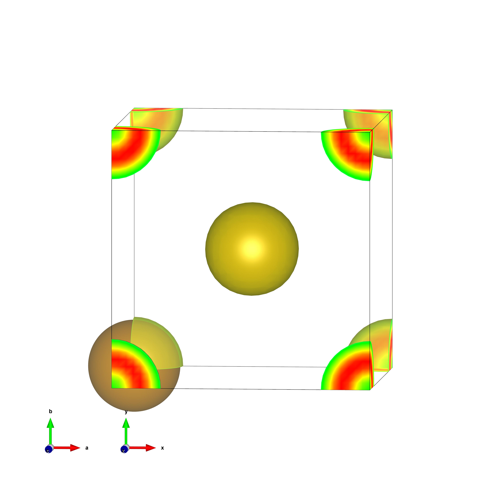

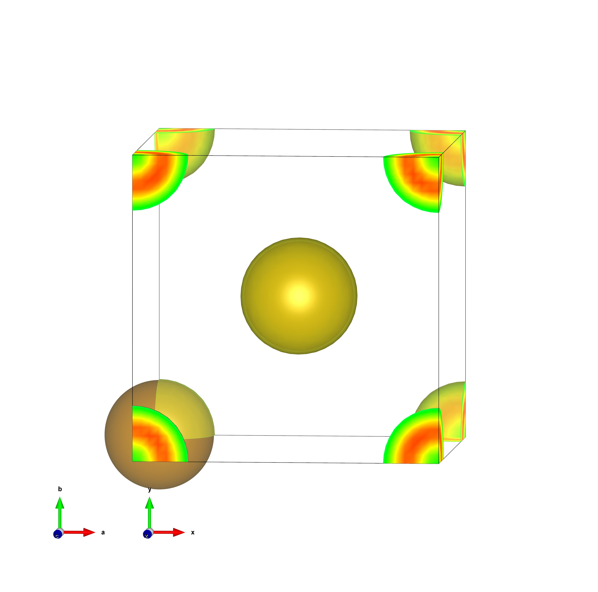

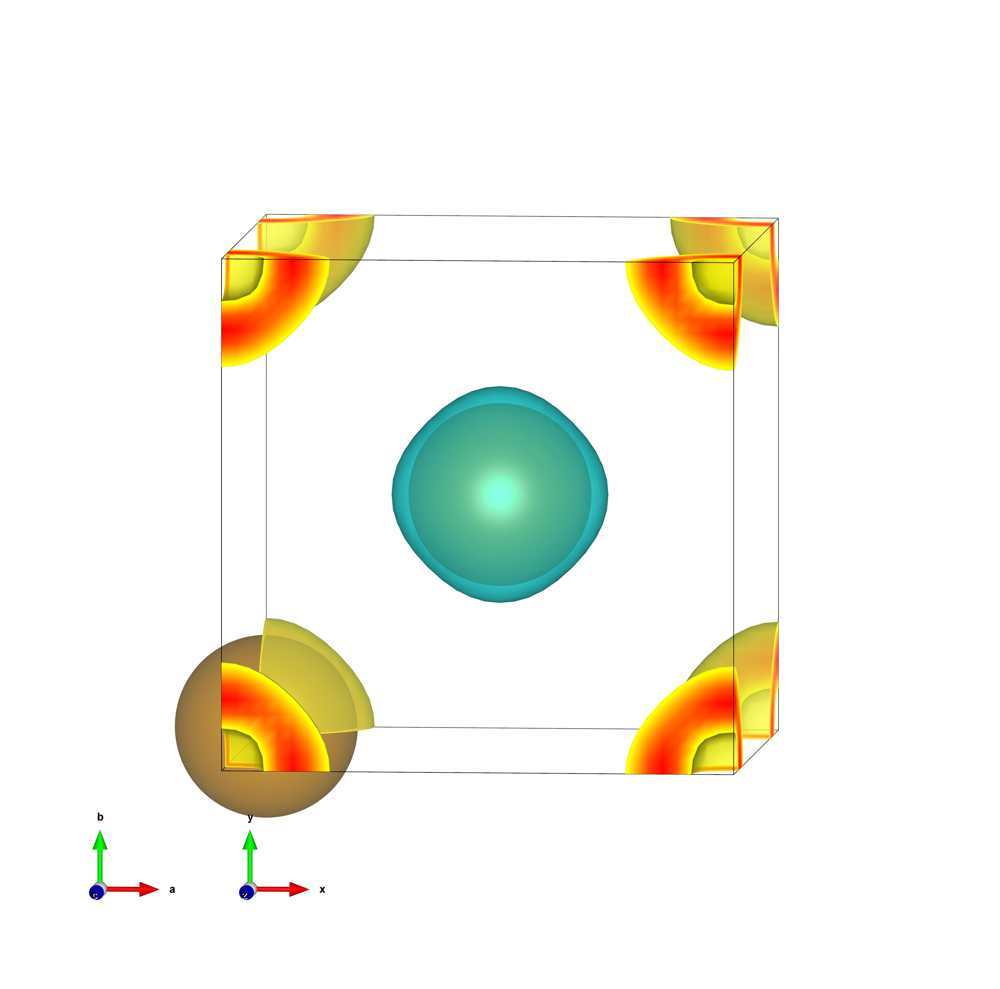

## Profile1d 操作

在进行表面模型的功函数计算时，需要对 Hartree 势进行面积分，得到沿某个轴的 1 维曲线。我们分别使用 ELECTRON_DENSITY.cube 和 SPIN_DENSITY.cube 对该功能进行演示：

```bash
python3 cube_manipulator.py -i ELECTRON_DENSITY.cube --p1d x -o charge1d.dat
python3 cube_manipulator.py -i SPIN_DENSITY.cube --p1d x -o spin1d.dat
```

即对 yz 平面进行积分，进行简单的绘图：

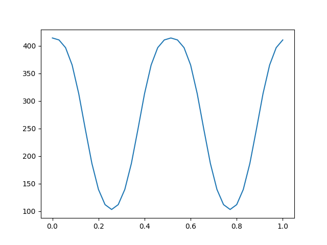

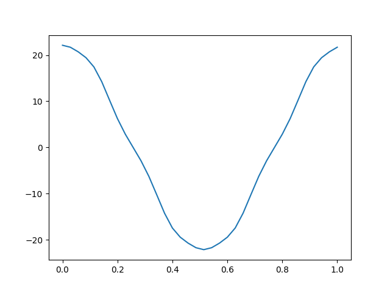

## Slice2d 操作

有时我们会考察某个截面的电子密度，对原子周围电子的局域化程度进行分析。我们仍然分别使用 ELECTRON_DENSITY.cube 和 SPIN_DENSITY.cube 对该功能进行演示：

```bash
python3 cube_manipulator.py -i ELECTRON_DENSITY.cube --s2d x=0 -o charge2d_000.dat
python3 cube_manipulator.py -i ELECTRON_DENSITY.cube --s2d x=0.25 -o charge2d_025.dat
python3 cube_manipulator.py -i ELECTRON_DENSITY.cube --s2d x=0.5 -o charge2d_050.dat

python3 cube_manipulator.py -i SPIN_DENSITY.cube --s2d x=0 -o spin2d_000.dat
python3 cube_manipulator.py -i SPIN_DENSITY.cube --s2d x=0.25 -o spin2d_025.dat
python3 cube_manipulator.py -i SPIN_DENSITY.cube --s2d x=0.5 -o spin2d_050.dat
```

进行简单绘图，电荷密度：

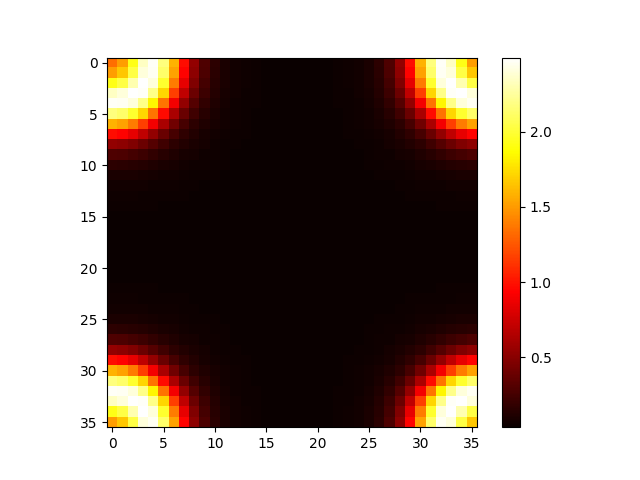

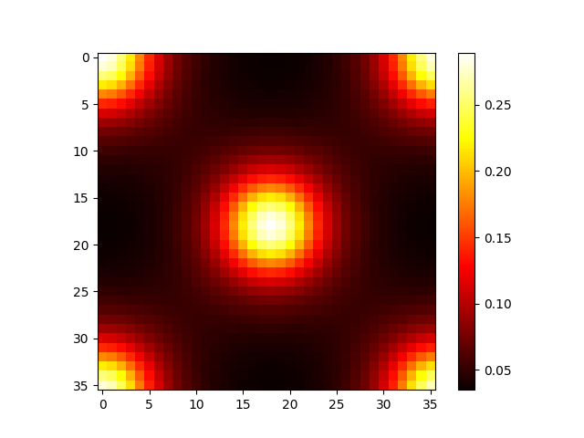

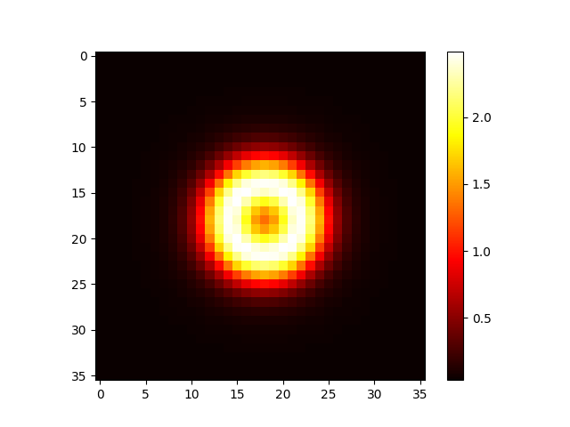

自旋密度：

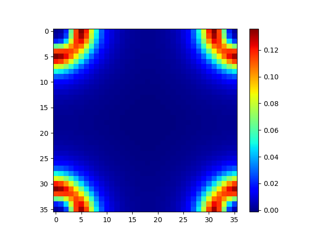

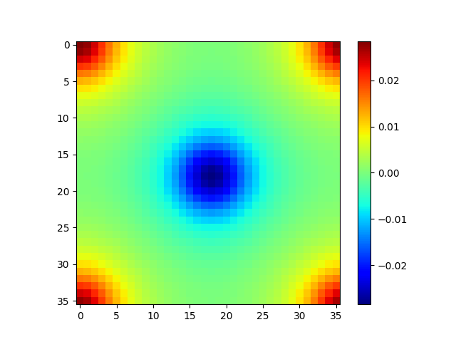

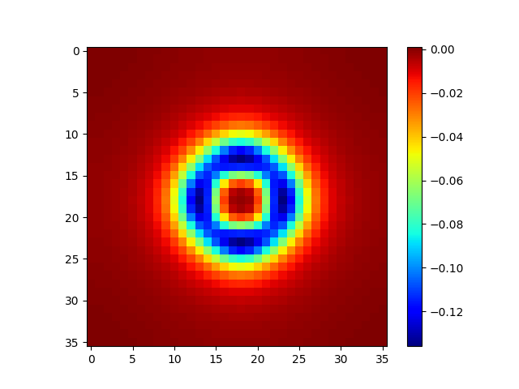

# Have a question? Submit issue!

如果在使用 ABACUS+Bader Analysis 过程中发现了 bug 或者运行结果不达预期，可以在 deepmodeling/abacus-develop 仓库下提交 issue。
