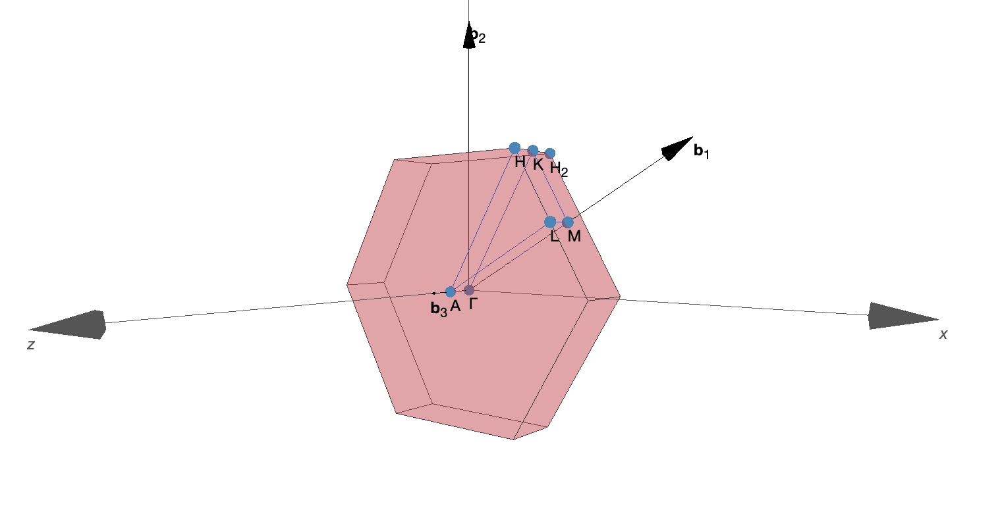
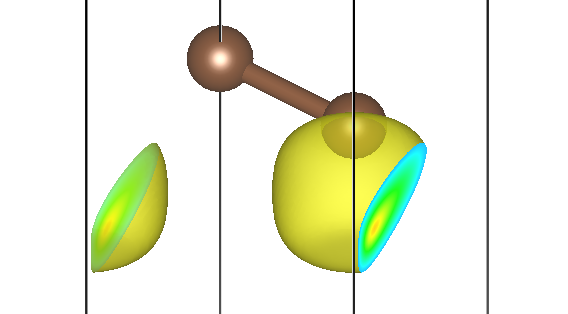
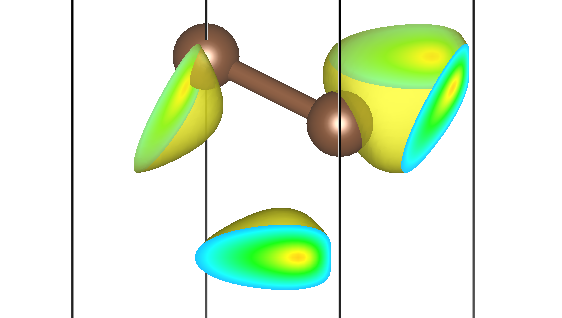

# ABACUS 输出部分的电荷密度和波函数及可视化教程

<strong>作者：包涛尼，邮箱：baotaoni@pku.edu.cn</strong>

<strong>审核：陈默涵，邮箱：mohanchen@pku.edu.cn</strong>

<strong>最后更新时间：2024年10月10日，2026年1月20日</strong>

# 一、引言

在第一性原理计算中，电荷密度和波函数的计算及其可视化是理解材料性质的关键步骤之一。电荷密度描述了电子在实空间中的分布情况，直接反映了材料中的电子结构和化学键信息。通过电荷密度或者波函数的可视化，我们可以直观地观察到材料内部的电荷转移、价键的形成及其强弱，以及可能存在的空穴或电荷积累区域，这对于分析材料的导电性、磁性、化学反应活性等各种性质至关重要。

ABACUS 作为第一性原理计算软件，支持两种不同的基组：平面波基组（Plane Wave，PW）和数值原子轨道基组（Linear Combination of Atomic Orbitals，LCAO），两种基组下都支持输出实空间下电荷密度和波函数的信息，并且可以方便地使用其他软件/工具包进行可视化。

电荷密度既可以输出总的，也可以按照不同能带、不同 k 点、不同自旋分开输出（能带分解电荷密度）。但是它们的操作逻辑可能会略有不同，例如在 LCAO 下，能带分解电荷密度的输出需要在 SCF 结束后单独再开一次计算，读入上一步 SCF 的结果才可以进行后处理；但是输出总的电荷密度则可以直接在 SCF 时附带目标参数 `out_chg=1` 即可。

波函数作为复数，既可以输出其模（envelope function），也可以选择实部和虚部分开输出。在 ABACUS 里需要特定的参数组合进行控制，包括 `if_separate_k`、`bands_to_print`、`out_wfc_norm` 等参数。

这篇文档归类汇总了这类相关信息。

# 二<strong>、基本概念与公式</strong>

下面以较为复杂的 LCAO 为例，说明一下基本概念与公式。我们知道，LCAO 中的波函数由如下公式描述：

其中$$n$$是能带指标，$$\mathbf{k}$$是 Brillouin 区点的指标。$$\phi_{\mu}(\mathbf{r}-\mathbf{\tau}_{\alpha i}-\mathbf{R})$$是位于布拉维格矢$$\mathbf{R}$$处的原胞中的种类为$$\alpha$$的第$$i$$个原子的原子轨道，复合指标$$\mu=\{\alpha,i,l,m,\zeta\}$$用于标记原子轨道，$$N$$是 Born-von Karman 周期性边界条件下超胞中所含原胞的个数，$$c_{n\mu,\mathbf{k}}$$是原子轨道基组的叠加系数。

那么，电荷（在实空间的）密度就可以计算如下：

其中，$$N_k$$是 Brillouin 区中采样的 k 点个数，$$f_{n\mathbf{k}}$$是 Fermi 占据因子。可以看到，在多 k 点的情况下，存在因子$$\mathrm{e}^{-\mathrm{i}\mathbf{k}\cdot\mathbf{R}}$$，因此多 k 点情况下主要还要对各个 k 点的因子$$\mathrm{e}^{-\mathrm{i}\mathbf{k}\cdot\mathbf{R}}$$进行求和。这样实空间电荷密度$$\rho(\mathbf{r})$$就和密度矩阵$$\rho_{\mu\nu}(\mathbf{R})$$（`DMR`）联系起来：

$$
\rho_{\mu\nu}(\mathbf{R})=\frac{1}{N_{k}}\sum_{n\mathbf{k}}f_{n\mathbf{k}}c_{n\mu,\mathbf{k}}^*c_{n\nu,\mathbf{k}}\mathrm{e}^{-\mathrm{i}\mathbf{k}\cdot\mathbf{R}}
$$

然而，能带分解电荷密度（band-decomposed charge density，有时又称为 partial charge density）则是不论某能带$$n$$是否占据，都把该能带单独拿出来，计算相应的电荷密度，并且不同自旋、不同 k 点都要求可以单独计算和绘制，也就是这样一个$$\rho_{n\mathbf{k}}^{\sigma}(\mathbf{r})$$：

$$
\begin{aligned}
        \rho_{n\mathbf{k}}^{\sigma}(\mathbf{r})&=\psi^{\sigma*}_{n\mathbf{k}}(\mathbf{r})\psi^{\sigma}_{n\mathbf{k}}(\mathbf{r}) \\
&=\sum_{\mathbf{R}}\sum_{\mu\nu}\underbrace{c^{\sigma *}_{n\mu,\mathbf{k}}c^{\sigma}_{n\nu,\mathbf{k}}}_{\rho^{\sigma}_{\mu\nu,n}(\mathbf{k})}\mathrm{e}^{-\mathrm{i}\mathbf{k}\cdot\mathbf{R}}\phi^*_{\mu}(\mathbf{r}-\mathbf{\tau}_{\alpha i}-\mathbf{R})\phi_{\nu}(\mathbf{r}-\mathbf{\tau}_{\beta j}) \\
&=\sum_{\mathbf{R}}\sum_{\mu\nu}\underbrace{\rho^{\sigma}_{\mu\nu,n}(\mathbf{k})\mathrm{e}^{-\mathrm{i}\mathbf{k}\cdot\mathbf{R}}}_{\rho^{\sigma}_{\mu\nu,n\mathbf{k}}(\mathbf{R})}\phi_{\mu}(\mathbf{r}-\mathbf{\tau}_{\alpha i}-\mathbf{R})\phi_{\nu}(\mathbf{r}-\mathbf{\tau}_{\beta j}) \\
&=\sum_{\mathbf{R}}\sum_{\mu\nu}\rho^{\sigma}_{\mu\nu,n\mathbf{k}}(\mathbf{R})\phi_{\mu}(\mathbf{r}-\mathbf{\tau}_{\alpha i}-\mathbf{R})\phi_{\nu}(\mathbf{r}-\mathbf{\tau}_{\beta j})
    \end{aligned}
$$

能带分解电荷密度可以用来分析不同轨道（或能量范围）对实空间中特定区域的贡献，有助于深入了解和可视化电子、磁性或输运性质，特别是在模拟扫描隧道显微镜（STM）图像时尤为重要。

# 三、输入输出概述

ABACUS 软件在平面波基组（Plane Wave，PW）和数值原子轨道基组（Linear Combination of Atomic Orbitals，LCAO）下均支持计算基于能带分解或 k 点分解的<strong>电荷密度</strong>和<strong>波函数</strong>。由于这两种基组在程序内部实现逻辑上有所不同，因此输入文件的编写和读取上也略有不同，在下面的部分中将会分开详细介绍。这一部分中，我们以电荷密度的计算为例，对一些共性的内容进行说明。

## 1. 输出文件类型：cube 文件

最终的输出文件类型为 `.cube`，这是一种用于存储三维网格数据的文件格式，主要用于描述电荷密度、波函数等在实空间中的信息。由于该文件格式最初是为 Gaussian 软件包设计的，因此通常也被称为 Gaussian CUBE file，但被其他第一性原理计算软件所广泛使用。cube 文件可以在免费软件 VESTA（Visualization for Electronic and STructural Analysis）中方便地进行可视化，因此后面的可视化步骤也均由 VESTA 进行。

一个典型的 cube 文件通常形如：

```bash
Cubefile created from ABACUS. Inner loop is z, followed by y and x
1 (nspin) -0.094637 (fermi energy, in Ry)
2 0.0 0.0 0.0 
45 0.103305 0.000000 0.000000
45 -0.051653 0.089465 0.000000
180 0.000000 0.000000 0.104985
 6 4 0.000000 0.000000 9.448630
 6 4 -0.000000 2.683943 9.448630
 7.033e-08 7.920e-08 1.024e-07 1.236e-07 1.439e-07 1.765e-07
 2.130e-07 2.281e-07 2.298e-07 2.592e-07 2.988e-07 2.991e-07
（下面还有很多其他数据……）
```

`cube` 文件的前两行不会被 VESTA 读取，因此可以填写任意信息，ABACUS 在第二行输出了自旋数 `nspin` 和 Fermi 能级 `fermi energy`，以支持 NSCF（non self-consistent field，非自洽） 计算。其他信息的含义如下，供参考：

```bash
Cubefile created from ABACUS. Inner loop is z, followed by y and x
1 (nspin) -0.094637 (fermi energy, in Ry)
2 (总原子数)  0.0 0.0 0.0 (格点数据原点的x,y,z坐标)
45  (FFT nx)   0.103305 0.000000 0.000000 (LATTICE_CONSTANT*a1/nx，单位Bohr)
45  (FFT ny)  -0.051653 0.089465 0.000000 (LATTICE_CONSTANT*a2/nx，单位Bohr)
180 (FFT nz)   0.000000 0.000000 0.104985 (LATTICE_CONSTANT*a3/nx，单位Bohr)
 6 (第1个原子的原子序数)  4 (价电子数)  0.000000 0.000000 9.448630 (该原子位置的笛卡尔坐标，单位Bohr)
 6 (第2个原子的原子序数)  4 (价电子数) -0.000000 2.683943 9.448630 (该原子位置的笛卡尔坐标，单位Bohr)
 (下面开始是FFT格点上的数据，z坐标变化最快，接下来依次是y和x，一般为6个数据一行，每走完z的一次循环换一行)
 7.033e-08 7.920e-08 1.024e-07 1.236e-07 1.439e-07 1.765e-07
 2.130e-07 2.281e-07 2.298e-07 2.592e-07 2.988e-07 2.991e-07
（下面还有很多其他数据……）
```

因此，对于电荷密度输出的 `cube` 格式文件，其 FFT 格点上数值的单位为 1/Bohr³。值得注意的是，电荷密度积分后的电子数目应该是守恒的，即在晶胞内对电子密度积分应等于该能带上占据的电子数目：


这可以作为检查输出正确性的依据（sanity check）。例如，对于 `nspin=1` 的情况，电子成对占据能带$$n$$，那么积分后的结果应该是 2；对于 `nspin=2` 的情况，自旋向上和向下是分开考虑的，因此积分结果就应该是 1。在 ABACUS 的能带分解电荷密度计算中，对于空带采取的约定是占据数与 HOMO 的占据数一致。

## 2. 输出文件命名规则

对于多能带、多 k 点、多自旋的计算，电荷密度输出文件名形如 `pchgi*s#k$.cube`，`*` 是相应的编号。这些编号都是从 1 开始的（如果发现有从 0 或者非 1 开始命名的编号，请在 [ABACUS GitHub issue](https://github.com/deepmodeling/abacus-develop/issues) 中向我们反馈）。波函数的命名规则是类似的。

- 能带（BAND）编号与 SCF 计算中生成的 `istate.info` 文件中的约定一致。
- 自旋（SPIN）编号在 `nspin=1` 时只有为 1 的编号；`nspin=2` 时编号为 1 表示自旋向上的分量，编号为 2 表示自旋向下的分量；目前 ABACUS 还不支持对 `nspin=4`（非共线磁矩）的能带分解电荷密度的计算。
- k 点（K）编号顺序与输出的 `kpoints` 文件中的约定一致。

## 3. 其他参数与注意事项

关于多 k 点的计算，可以选择是否启用输入参数 `if_separate_k`。默认情况下，该参数设置为 `false`，此时所有 k 点的贡献都会被计入，从而算得的电荷密度实际上是

$$
\rho_{n}^{\sigma}(\mathbf{r})=\sum_{\mathbf{k}}\rho_{n\mathbf{k}}^{\sigma}(\mathbf{r})
$$

输出文件名形如 `pchgi1s1.cube`。当 `if_separate_k` 设置为 `true` 时，程序会分别计算不同 k 点的贡献并输出，输出文件名形如 `pchgi1s1k1.cube`。

有时候对称性分析会约化一些 k 点，并且相应地，k 点权重会发生改变。例如当 `symmetry=1`（开启晶格对称性分析）时，对于一个 2×2×2 的 k 点采样，下面是一个可能的 `kpoints` 文件：

```bash
nkstot now = 4
K-POINTS DIRECT COORDINATES
 KPOINTS    DIRECT_X    DIRECT_Y    DIRECT_Z  WEIGHT
       1  0.00000000  0.00000000  0.00000000  0.1250
       2  0.50000000  0.50000000  0.00000000  0.3750
       3  0.00000000  0.00000000  0.50000000  0.1250
       4  0.50000000  0.50000000  0.50000000  0.3750

nkstot = 8                                       ibzkpt
K-POINTS REDUCTION ACCORDING TO SYMMETRY
     KPT    DIRECT_X    DIRECT_Y    DIRECT_Z     IBZ    DIRECT_X    DIRECT_Y    DIRECT_Z
       1  0.00000000  0.00000000  0.00000000       1  0.00000000  0.00000000  0.00000000
       2  0.50000000  0.00000000  0.00000000       2  0.50000000  0.50000000  0.00000000
       3  0.00000000  0.50000000  0.00000000       2  0.50000000  0.50000000  0.00000000
       4  0.50000000  0.50000000  0.00000000       2  0.50000000  0.50000000  0.00000000
       5  0.00000000  0.00000000  0.50000000       3  0.00000000  0.00000000  0.50000000
       6  0.50000000  0.00000000  0.50000000       4  0.50000000  0.50000000  0.50000000
       7  0.00000000  0.50000000  0.50000000       4  0.50000000  0.50000000  0.50000000
       8  0.50000000  0.50000000  0.50000000       4  0.50000000  0.50000000  0.50000000
```

可以看到一些 k 点在计算中被约化，从而拥有了更高的 `WEIGHT`。

虽然我们已经做了很多代码分析、测试与 benchmark，以保证结果的正确性，但是在打开对称性时仍不排除可能会因为 k 点约化与权重改变而产生<em>不可预料的后果</em>（例如电荷密度要根据对称性进行对称化；未来可能还要加入参数来控制纳入哪些用户选择的 k 点的贡献，此时打开对称性后用户操作得到的结果的正确性是不可控的：例如上述情况中纳入编号为 1 和 2 的 k 点，实际上是有 4 个 k 点的贡献，并且电荷密度没有经过对称性操作在实空间还原，因此会得到错误的结果）。因此，如果可能的话，我们强烈建议在完全关闭对称性（`symmetry=-1`）或者只启用时间反演对称性（`symmetry=0`）的情况下进行多 k 点 SCF 和能带分解电荷密度的计算。

# 四、在平面波基组下进行计算

## 1. 电荷密度

平面波基组下，能带分解电荷密度的计算是较为简单的，因为实现逻辑中该功能被归类为 SCF 的附带后处理，因此只需要在 SCF 时附带输入参数 `bands_to_print` 即可。一个可能的 INPUT 文件如下：

```bash
INPUT_PARAMETERS
nbands                      20
stru_file                   STRU
kpoint_file                 KPT
pseudo_dir                  path/to/your/pseudo_potential/folder

ecutwfc                     100.0   # Rydberg

basis_type                  pw

calculation                 scf
gamma_only                  0
symmetry                    -1      # Turn off symmetry

bands_to_print              2*1 2*0 1
if_separate_k               false

nspin                       1
```

参数 `bands_to_print` 的具体含义可以在输入参数文档 [https://abacus.deepmodeling.com/en/latest/advanced/input_files/input-main.html#bands-to-print](https://abacus.deepmodeling.com/en/latest/advanced/input_files/input-main.html#bands-to-print) 中进行查看。简单来说，上面 `bands_to_print` 被指定为 `2*1 2*0 1`，`2*1` 意味着前 2 个（第 1 个、第 2 个）能带会被计算，`2*0` 意味着紧接着的 2 个（第 3 个、第 4 个）能带会被跳过，最后一个 `1` 意味着紧接着的 1 个（第 5 个）能带会被计算；因此，最终会在 `OUT.ABACUS` 文件夹下得到第 1、2、5 个能带的分解电荷密度。

参数 `if_separate_k` 则控制是否将每个 k 点对电荷密度的贡献分开输出，`false` 表示不分开，因此在多 k 点的情形下，输出文件的电荷密度是各个 k 点贡献之和。

如果想要输出包含了所有 k 点、所有占据能带的贡献的电荷密度，可以加上

```bash
out_chg                     1
```

## 2. 波函数

只需在 `INPUT` 文件中再添加

```bash
out_wfc_norm                   1
```

便可以在 `OUT.ABACUS` 文件夹下得到文件夹 `wfc_realspace`，里面存放了不同能带、不同 k 点、不同自旋的波函数的模。

当前版本中，平面波基组下的波函数不支持实部、虚部分开的输出方式。

# 五、在数值原子轨道基组下进行计算

## 1. 电荷密度

在数值原子轨道基组下，能带分解电荷密度的计算比平面波稍微复杂一些，我们需要两次计算：一次计算先得到 LCAO 的轨道叠加系数文件，一次计算再根据这些系数文件计算得到分解电荷密度。

### 1.1 在 SCF 时计算并输出波函数系数文件

一个可能的 INPUT 文件如下：

```bash
INPUT_PARAMETERS
nbands                      20
stru_file                   STRU
kpoint_file                 KPT
pseudo_dir                  path/to/your/pseudo_potential/folder
orbital_dir                 path/to/your/orbital/folder

ecutwfc                     100.0   # Rydberg

basis_type                  lcao

calculation                 scf
gamma_only                  0
symmetry                    -1      # Turn off symmetry

nspin                       1

out_wfc_lcao                1
out_chg                     1
```

这里，重要的是需要设置参数 `out_wfc_lcao`，此时你将在 `OUT.ABACUS` 文件夹下得到各个 k 点的波函数系数文件，名称形如 `wfs#k$_nao.txt`，这些文件将在下一步计算中被读取，并计算能带分解电荷密度。

这里的 `out_chg` 控制的是是否输出体系真实的总电荷密度，包含了所有 k 点、所有占据能带的贡献。因此如果你不需要总电荷密度，大可将 `out_chg` 设为 `0`。

### 1.2 计算并输出能带分解电荷密度

此时，我们最好再单独开一个文件夹，用来计算能带分解电荷密度。`KPT` 和 `STRU` 和第 1 步保持一致，但是 `INPUT` 文件需要将计算类型 `calculation` 从 `scf` 更改为 `get_pchg`。一个可能的 `INPUT` 文件如下：

```bash
INPUT_PARAMETERS
nbands                      20
stru_file                   STRU
kpoint_file                 KPT
pseudo_dir                  path/to/your/pseudo_potential/folder
orbital_dir                 path/to/your/orbital/folder

ecutwfc                     100.0   # Rydberg

basis_type                  lcao

calculation                 get_pchg
gamma_only                  0
symmetry                    -1      # Turn off symmetry
read_file_dir               ./

# nbands_istate               2       # pchg above/below Fermi band
bands_to_print              2*1 2*0 1
if_separate_k               true

nspin                       1
```

我们还要将上一步得到的波函数系数文件复制到该文件夹中，推荐使用 `ln -s` 命令进行软链接。

其他参数和平面波时基本一致，仍然可以使用 `bands_to_print` 指定需要计算的能带（见平面波计算部分）。不过在 LCAO 情况下，你也可以选择使用参数 `nbands_istate`，它会选择计算 Fermi 面上下 `nbands_istate` 条能带的分解电荷密度。当已经设置了 `bands_to_print` 的情况下，`nbands_istate` 的效果将会被覆盖。

这里选择将 `if_separate_k` 设置为 `true`，表明将不同 k 点的贡献分开输出。

## 2. 波函数

波函数的计算流程和电荷密度并无二异，同理第一步仍然是 SCF 计算，从而得到各个 k 点的波函数系数文件。

第二步中，我们仅需将之前的计算类型 `calculation` 参数从 `get_pchg` 相应地改为 `get_wf`。这样，你就可以在 `OUT.ABACUS` 下得到波函数的模文件。如果此时你还打开了 `out_wfc_norm=1`，还可以在 `OUT.ABACUS` 下看到文件夹 `wfc_realspace`，里面存放了（不同能带、不同 k 点、不同自旋的）波函数的实部文件和虚部文件。

# 五、示例：对电荷密度进行可视化

以单层石墨烯为例，其原胞的 `STRU` 文件如下：

```bash
ATOMIC_SPECIES
C   12.011        C_ONCV_PBE-1.0.upf

NUMERICAL_ORBITAL
6_C_TZDP/C_gga_10au_100Ry_3s3p2d.orb

LATTICE_CONSTANT
1.889726

LATTICE_VECTORS
2.4600000000      0.0000000000      0.0000000000      
-1.230000000      2.1304220000      0.0000000000      
0.0000000000      0.0000000000      10.0000000000      

ATOMIC_POSITIONS
Direct

C
0.0000000000
2
0.0000000000 0.0000000000 0.5000000000 0 0 0 mag 0.0 
0.3333333333 0.6666666666 0.5000000000 0 0 0 mag 0.0
```

我们选择围绕 <em>Γ</em> 点 2×2×1 的 k 点采样（仅作演示用，并不是对该体系收敛的最优采法），`KPT` 文件如下：

```bash
K_POINTS
0
Gamma
2 2 1 0 0 0
```

SCF 计算中可以得到输出的 `kpoints` 文件，指示了我们输出文件中 k 点编号和倒空间（分数）坐标的对应关系：

```bash
nkstot now = 4
K-POINTS DIRECT COORDINATES
 KPOINTS    DIRECT_X    DIRECT_Y    DIRECT_Z  WEIGHT
       1  0.00000000  0.00000000  0.00000000  0.2500
       2  0.50000000  0.00000000  0.00000000  0.2500
       3  0.00000000  0.50000000  0.00000000  0.2500
       4  0.50000000  0.50000000  0.00000000  0.2500
```

倒空间基矢的选择可以在输出日志 `running_scf.log` 中看到，形如：

```bash
Reciprocal vectors: (Cartesian coordinate: in unit of 2 pi/a_0)
            +0.406504           +0.234695                  -0
                   -0           +0.469391                  -0
                   +0                  -0                +0.1
```

采用 [SeeK-path](https://www.materialscloud.org/work/tools/seekpath) 工具中可以看到 Brillouin 区的样子：



这里 SeeK-path 是一个能够自动生成标准化的 k 点路径的工具，方便用于各种电子结构计算，可通过网址 [https://www.materialscloud.org/work/tools/seekpath](https://www.materialscloud.org/work/tools/seekpath) 访问。

不难发现，实际上 2×2×1 的 Brillouin 区采样只能采到<em>Γ</em>点和<em>M</em>点（编号 2、3、4 的 k 点都等价为<em>M</em>点，在 `symmetry=1` 时会显式约化）。可以预想到，K2、K3、K4 在实空间中的分布形状应该是一致的，它们只相差相应的晶格对称性操作。

以 LCAO 为例，开启共线磁矩 `nspin=2`（仅作为演示，没有磁性的石墨烯自旋上下结果应该完全一致），在第一步 SCF 后可以在 `OUT.ABACUS` 文件夹下得到如下波函数系数文件：`wfs1k1_nao.txt`、 `wfs2k1_nao.txt` 、……、`wfs1k4_nao.txt`、`wfs2k4_nao.txt`。这里 K1 到 K8 代表 8 个 k 点，k 点编号比实际设置时多了一倍是因为其中编号 1～4 是代表自旋向上的波函数文件，而编号 5～8 是代表自旋向下的波函数文件。

SCF 计算结束后，将得到的这些系数文件复制/链接到另一个我们自己创建的新文件夹下，根据上面的教程设置控制文件，开启计算类型 `calculation=get_pchg` 的新计算，就可以在 `OUT.ABACUS` 文件夹下得到如下的电荷密度文件。若选择 `if_separate_k=true`，输出文件将形如：

```bash
BAND1_K1_SPIN1_CHG.cube
BAND1_K1_SPIN2_CHG.cube
BAND1_K2_SPIN1_CHG.cube
BAND1_K2_SPIN2_CHG.cube
......
```

若选择 `if_separate_k=false`，则输出文件名中不会带有 k 点信息。这些 `cube` 格式文件可以直接在 `VESTA` 软件中打开并可视化。

例如，第一条能带 <em>Γ</em> 点自旋向上的贡献存储在 `pchgi1s1k1.cube` 文件里，可视化效果为：


第二条能带三个不同 <em>M</em> 点的贡献为 `pchgi2s1k2.cube`、`pchgi2s1k3.cube`、`pchgi2s1k4.cube`：






可以发现，它们确实形状一致，但是在实空间被旋转了不同的角度，符合预期。

# 六、结语

以上就是本教程的内容，希望对读者有所帮助。若有问题，请在 [ABACUS GitHub issue](https://github.com/deepmodeling/abacus-develop/issues) 中向我们反馈，或者发送邮件联系本教程作者。感谢大家对 ABACUS 软件的支持。