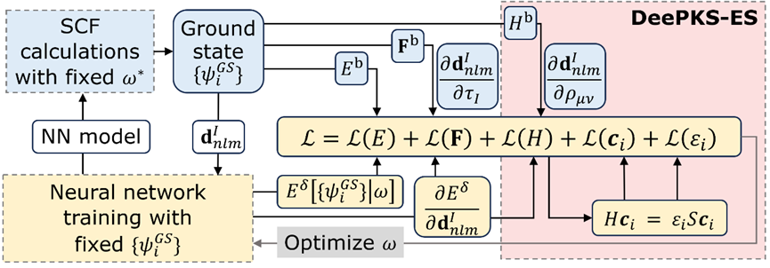
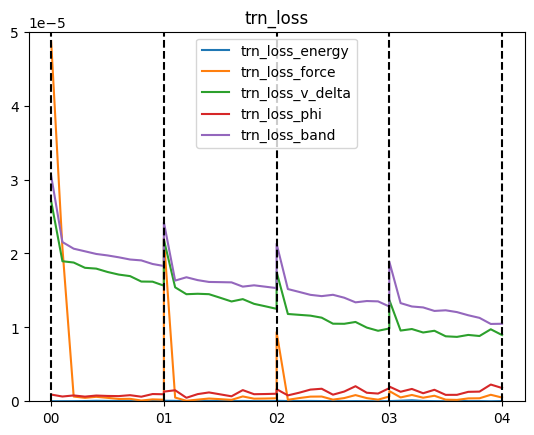
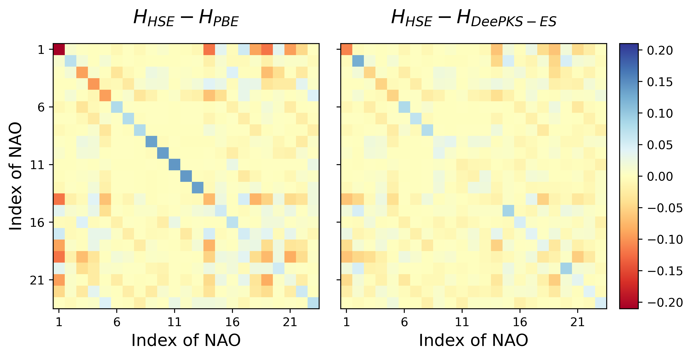

# DeePKS-ES 介绍及使用教程

**作者：梁馨元，邮箱：2201111875@stu.pku.edu.cn**

**最后更新时间：2025/08/04**

写在最前面：目前 DeePKS-ES 方法仅适用于 Gamma-only 的情况，多 k 点版本正在开发中，敬请期待！

# 一、DeePKS 介绍

## 方法简介

DeePKS（Deep Kohn-Sham）是一种机器学习交换关联泛函方法。它将机器学习与密度泛函理论（DFT）相结合，力图解决 DFT 计算中交换关联泛函的计算精度与计算效率的矛盾。它以低级别交换关联泛函（如广义梯度近似 PBE）的结果为基础，通过神经网络学习高级别交换关联泛函（如杂化泛函 HSE06）的校正信息，在保持计算高效性的同时，提升性质预测的精度。该方法适用于分子、液态水等多种体系，可准确预测总能量、原子力等性质，为大规模系统模拟提供了可行途径。

## 性质修正

DeePKS 通过神经网络对低级别方法的哈密顿量进行修正。在数值原子轨道（LCAO）基组下，DeePKS 的总哈密顿量$$H^d$$由基础哈密顿量$$H^{\text b}$$（低级别方法计算结果）与校正项$$V^{\delta}$$组成：$$H^{\text d} = H^{\text b} + V^{\delta}$$。$$V^{\delta}$$对应的能量修正项为$$E^{\delta}$$，其定义为各原子贡献的总和：
$$E^\delta=\sum_{I}F_{\mathrm{NN}}(\mathbf{d}^I)$$
式中，$$F_{\mathrm{NN}}$$是神经网络，$$\mathbf{d}^I$$是原子$$I$$的电子结构描述符（保证旋转、平移和置换不变性）。其他修正项可以通过对能量修正项的求导实现，比如受力修正项为 $$\mathbf{F}^{\delta}_{I}=-\frac{\partial E^{\delta}}{\partial\tau_I}$$，其中$$\tau_I$$是原子$$I$$的位置。在 DeePKS 模型完成训练后，可以进行自洽迭代收敛（SCF）计算，如下图所示：


## 迭代训练

DeePKS 模型的训练需要通过迭代训练进行，核心流程包括以下两步循环，直至收敛：

在以上第二步中，损失函数中一般包含能量、原子受力等项。为了在训练步中能够计算原子受力，需要在 SCF 中输出相应的系数，即通过链式法则，将受力修正项写为

$$\mathbf{F}^{\delta}_{I}=-\frac{\partial E^{\delta}}{\partial\tau_I}
=-\sum_{Inlm}\frac{\partial E^{\delta}}{\partial\mathbf{d}^I_{nlm}}\frac{\partial\mathbf{d}^I_{nlm}}{\partial\tau_I}$$

其中$$\mathbf{d}^I_{nlm}$$是描述符$$\mathbf{d}^I$$的具体分量。$$\frac{\partial E^{\delta}}{\partial\mathbf{d}^I_{nlm}}$$项由DeePKS-kit经过反向传播计算，$$\frac{\partial\mathbf{d}^I_{nlm}}{\partial\tau_I}$$ 系数项则由 ABACUS 输出。

# 二、DeePKS-ES 介绍

## 方法简介

DeePKS-ES（Electronic Structure）是对原始 DeePKS 方法的改进，重点提升电子结构性质（如哈密顿矩阵、波函数系数、能级等）的预测精度。DeePKS 虽能优化总能量和原子受力，但对电子结构性质的预测不足。DeePKS-ES 通过将重要电子结构性质哈密顿量矩阵，及其特征值、特征向量纳入损失函数，在保持对总能量和原子受力预测精度的同时，提升电子结构的预测准确程度。

关于 DeePKS-ES 方法的详细介绍及效果展示，请参见 [A Deep Learning Framework for the Electronic Structure of Water: Toward a Universal Model](https://pubs.acs.org/doi/10.1021/acs.jctc.5c00496)。以下仅针对方法本身进行简单介绍。

## 哈密顿量及相关电子结构性质的计算

前面说过，DeePKS 的总哈密顿量$$H^{\text d}$$由基础哈密顿量 $$H^{\text b}$$（低级别方法计算结果）与校正项$$V^{\delta}$$组成：$$H^{\text d} = H^{\text b} + V^{\delta}$$。为了在 DeePKS-kit 中计算修正项$$V^{\delta}$$，从而在损失函数中加入哈密顿量的损失，将$$V^{\delta}$$通过链式法则拆分为 $$V^\delta_{\mu\nu}=\frac{\partial E^{\delta}}{\partial\rho_{\mu\nu}}=\sum_{Inlm}\frac{\partial E^{\delta}}{\partial\mathbf{d}^I_{nlm}}\frac{\partial\mathbf{d}^I_{nlm}}{\partial\rho_{\mu\nu}}$$，其中$\mu$和$\nu$ 是 LCAO 基组的下标。

如同原子受力等项，$$\frac{\partial E^{\delta}}{\partial\mathbf{d}^I_{nlm}}$$项由 DeePKS-kit 经过反向传播计算，而$$\frac{\partial\mathbf{d}^I_{nlm}}{\partial\rho_{\mu\nu}}$$系数项则由 ABACUS 输出。该系数项可以直接输出，但是为了节省内存，也可以将其拆分为

$$

\frac{\partial \mathbf{d}^I_{nlm}}{\partial\rho_{\mu\nu}}=\sum_{m^{\prime}m^{\prime\prime}}\frac{\partial \mathbf{d}^I_{nlm}}{\partial D^I_{nlm^{\prime}m^{\prime\prime}}}\frac{\partial D^I_{nlm^{\prime}m^{\prime\prime}}}{\partial \rho_{\mu\nu}}\\=\sum_{m^{\prime}m^{\prime\prime}} \frac{\partial \mathbf{d}^I_{nlm}}{\partial D^I_{nlm^{\prime}m^{\prime\prime}}}\langle\phi_\mu\vert\alpha^I_{nlm^{\prime}}\rangle\langle\alpha^I_{nlm^{\prime\prime}}\vert\phi_\nu\rangle

$$

并分别输出$$\frac{\partial \mathbf{d}^I_{nlm}}{\partial D^I_{nlm^{\prime}m^{\prime\prime}}}$$和$$\langle\phi_\mu\vert\alpha^I_{nlm^{\prime}}\rangle（\langle\alpha^I_{nlm^{\prime\prime}}\vert\phi_\nu\rangle$$与该项一致）。其中投影密度矩阵是构建描述符的关键中间量。

在获得$$V^{\delta}$$项后，将其与基础泛函的哈密顿量矩阵$$H^{\text b}$$叠加，即得到 DeePKS-ES 预测的哈密顿量矩阵$$H^{\text d}$$。通过广义特征值求解$$H\mathbf{c}_{i}=\varepsilon_{i}S\mathbf{c}_{i}$$，可以获得体系的能级$$\varepsilon_{i}$$和波函数组合系数$$\mathbf{c}_{i}$$，它们同样作为重要的电子结构性质，同样可纳入损失函数参与模型训练。

## 损失函数

DeePKS-ES 的损失函数涵盖总能量、原子力、哈密顿矩阵、波函数系数和能级，即


其中包含五项，表达式$$\Vert x\Vert^2$$表示$$x$$的每个元素的平方和。参数$$\lambda_{\rm E}, \lambda_{\rm F}, \lambda_{\rm H}, \lambda_{\rm \psi}, \lambda_{\rm b}$$分别是能量、原子力、哈密顿矩阵、波函数系数和能级的权重因子。上标$$t$$和$$d$$分别代表目标泛函和 DeePKS-ES 模型的结果。第一项是能量项，定义为每个原子的平均能量与目标能量的差值，其中$N_a$是系统中的原子数。第二项涉及原子受力，计算每个原子在三个方向上的力差值。

此外，损失函数中还加入了 LCAO 基组下的哈密顿矩阵及其特征向量和特征值，分别为第三、第四和第五项。在哈密顿项中，计算目标哈密顿矩阵$H^{\text t}$与 DeePKS-ES 模型得到的哈密顿矩阵$$H^{\text d}$$之间的差值。需要注意的是，哈密顿矩阵的大小为$$N_{l} \times N_{l}$$，其中$$N_{l}$$表示基组的数量，然而，每个原子的近邻数量不会随系统尺寸增加而增加，这意味着随着系统尺寸增大，哈密顿矩阵中非零元素的数量与$N_{l}$仅成正比例增长（即$$O(N_{l})$$而非$$O(N_{l}^2)$$）。因此，我们用$$N_{l}$$而非$$N_{l}^2$$对矩阵元的差别平方和进行归一化。对于波函数组合系数与能级，可以用$$N_{\psi}$$和$$N_{\text b}$$这两个参数，分别指定损失函数中需要包含的特征向量$$\mathbf{c}_{i}$$和特征值$$\varepsilon_{i}$$的数量。对于 gamma only 情形，波函数存在 +1 和-1 的自由度，即仅相差正负符号的波函数视为同样的波函数，这种情况已在程序中考虑。

## DeePKS-ES 的计算流程图

DeePKS-ES 的计算流程图如下所示，其中蓝色、黄色背景的内容分别表示迭代训练中的 SCF 和训练步骤。红色方框表示 DeePKS-ES 与 DeePKS 的区别。



# 三、DeePKS-ES 上手教程

## 软件准备

- ABACUS

  - 版本要求：使用 DeePKS-ES 需要使用版本在 v 3.7.2 之后，使用以下打标签功能需要在 v 3.9.0.3 之后
  - 编译要求：打开编译选项 ENABLE_MLALGO，同时加入 LibTorch 和 Libnpy 一起编译，详见 [Advanced Installation Options](https://abacus.deepmodeling.com/en/latest/advanced/install.html#build-with-ml-algo)
  - 本例子中使用的版本为 3.9.0.10
- DeePKS-kit

  - 请务必使用仓库 [https://github.com/MCresearch/DeePKS-L/](https://github.com/MCresearch/DeePKS-L/)的 **develop** 分支
  - 本例子中使用的版本为 commit #4229fc3 版本
  - 注意：由于 ABACUS 与 DeePKS-kit 间存在大量输出交互，两个软件之间需要保持版本对齐，比如 DeePKS-kit commit #e5e0644 之前的版本则需要使用 ABACUS v3.9.0.9 之前的版本。

## 算例说明

本教程在 Gitee 上准备了一个 DeePKS-ES 的训练全流程样例（[Github 的下载链接](https://github.com/MCresearch/abacus-user-guide/tree/master/examples/deepks-es)），包括标签准备、模型训练以及模型测试三个步骤。

该算例使用 2 帧水分子单体及 2 帧水分子二聚体构型作为训练数据集。PBE 作为基础泛函，HSE 作为目标泛函。

## 标签准备

在 ABACUS 的 3.9.0.3 版本中，支持了直接使用 ABACUS 软件进行 DeePKS 软件标签准备的功能，减少了用户打标签的困难。使用时只需要使用目标泛函计算，打开需要打标签的性质的计算参数，并设置参数 `deepks_out_labels`=2 即可。

### A. SCF 计算

在样例的 01_make_label 文件夹中，group.00/group.01 分别对应水分子单体/水分子二聚体。以水分子单体为例，`group.00/ABACUS/0/INPUT` 文件内容如下，高亮部分为需要关注的参数。

```
INPUT_PARAMETERS
calculation scf
ecutwfc 100.000000
scf_thr 1.000000e-06
scf_nmax 100
basis_type lcao
dft_functional hse
gamma_only 1
mixing_type broyden
mixing_beta 0.400000
symmetry 0
nspin 1
smearing_method fixed
smearing_sigma 0.001000
cal_force 1
cal_stress 0
out_dos 0
deepks_out_labels 2
deepks_scf 0
deepks_bandgap 0
deepks_v_delta 1
out_wfc_lcao 0
```

从 INPUT 文件可以看到，设置的计算泛函为 hse，设置 `deepks_out_labels`=2 支持 DeePKS 标签输出。默认会输出构型相关标签、能量标签。另外需要受力标签，即设置 `cal_force`=1，并需要哈密顿量标签，设置 `deepks_v_delta`=1/2（对于打标签功能来说，该参数只要大于 0 即可）。其他电子结构性质标签，如能级与波函数组合系数标签，由 DeePKS-kit 计算完成，不需要输出。

执行 `01_make_label/run_scf.sh` 文件（必要时修改文件中的 abacus 执行路径）后，可以看到在具体构型的 OUT.ABACUS 文件夹下，有如下关键文件：

```
#路径：01_make_label/group.0*/ABACUS/*/OUT.ABACUS/
deepks_atom.npy
deepks_box.npy
deepks_energy.npy
deepks_force.npy
deeepks_hamiltonian.npy
deepks_overlap.npy
```

分别表示训练需要的原子位置、晶胞、总能量、原子受力、哈密顿量以及重叠矩阵文件。它们与真实训练需要的文件对比，在名字上只多了开头的“deepks_"，在数据维度上只少了第一个 nframes 维度（表示组内包含的构型个数）。

### B. 堆叠标签数据

执行 `01_make_label/stack_label.py` 文件，可以对同一个 group 内的数据进行堆叠（对应于 python 中的 stack 操作），增加训练所需的第一个 nframes 维度，并重命名后保存在对应的 group 内。由于 DeePKS 训练时要求同一个 group 内原子数相同，故所有操作均分组进行。

`01_make_label/stack_label.py` 的输出展示了堆叠效果。以 group.00 的 atom 为例，以下输出说明在 group.00 中，找到了两个构型对应的 deepks_atom.npy 文件，每个文件的维度为（3，4），表示 3 个原子的 3 维位置及核电荷数信息。将它们堆叠起来得到完整标签文件，维度为（2，3，4），并保存在 01_make_label 下的 group.00/atom.npy 文件中备用。

```
--- Processing: group.00 ---
Found 2 'deepks_atom.npy' files, preparing to stack...
Successfully stackd and saved to: group.00/atom.npy
  - Number of input files: 2
  - Shape of input data: (3, 4)
  - Shape of output array: (2, 3, 4)
```

## DeePKS-ES 模型训练

将标签准备步骤中获得的 `01_make_label/group.0*/*.npy` 标签文件复制到 `02_train/systems` 对应的 group.0*文件夹下，即可开始准备训练。`02_train/systems` 文件夹中也包含了标签文件，供直接尝试训练使用。以下介绍一些关键的 `02_train/iter` 中的参数。

### A. params.yaml 设置

`02_train/iter/params.yaml/train_input` 设置了迭代训练中的模型训练步骤的参数。以下仅解释高亮部分，即 DeePKS-ES 相比于 DeePKS 新增的参数，其他参数请看 [Input files preperation](https://deepks-kit.readthedocs.io/en/latest/inputs-preperation.html)。

```yaml
# number of iterations to do, can be set to zero for DeePHF training
n_iter: 4
  
# directory setting (these are default choices, can be omitted)
workdir: "."
share_folder: "share" # folder that stores all other settings

# scf settings, set to false when n_iter = 0 to skip checking
scf_input: false

# train settings, set to false when n_iter = 0 to skip checking
train_input:
  # model_args is ignored, since this is used as restart
  data_args: 
    batch_size: 1
    group_batch: 1
    extra_label: true
    conv_filter: true
    conv_name: conv
    read_overlap: true
  preprocess_args:
    preshift: false # restarting model already shifted. Will not recompute shift value
    prescale: false # same as above
    prefit_ridge: 1e1
    prefit_trainable: false
  train_args: 
    decay_rate: 0.8
    decay_steps: 50
    display_epoch: 10
    display_detail_test: true
    display_natom_loss: true 
    energy_per_atom: 2
    force_factor: 1
    v_delta_factor: 0.005
    vd_divide_by_nlocal: true
    phi_factor: 0.1
    phi_occ: { 3: 4, 6: 8 }
    band_factor: 0.01
    band_occ: { 3: 8, 6: 16 }
    # density_m_factor: 0.1
    # density_m_occ: { 3: 4, 6: 8 }
    n_epoch: 100
    start_lr: 0.0002

# init settings, these are for DeePHF task
init_model: false # do not use existing model to restart from

init_scf: True

init_train: # parameters for nn init training
# 以下内容省略
```

- `read_overlap`：是否读入 LCAO 基组的重叠矩阵 overlap.npy。该矩阵在进行广义特征值求解$$H\mathbf{c}_{i}=\varepsilon_{i}S\mathbf{c}_{i}$$，求解波函数组合系数和能级时需要。如果需要针对波函数组合系数和能级进行训练，则设置为 True
- `v_delta_factor/phi_factor/band_factor/density_m_factor`：损失函数中哈密顿量矩阵差别、波函数组合系数差别、能级差别以及密度矩阵差别的占比系数，前三者即二、3.节公式中的$$\lambda_{\rm H}, \lambda_{\rm \psi}, \lambda_{\rm b}$$。密度矩阵差别没有在前述文章中使用，它为多个波函数的平方和，不需要考虑波函数的相位情况，更推荐使用
- `vd_devide_by_nlocal`：是否采用哈密顿量矩阵损失中，对矩阵元的差别平方和用$$N_{l}$$而非$$N_{l}^2$$进行归一化的策略。推荐设置为 True，保证不同大小体系的哈密顿量矩阵损失量级相同。
- `phi_occ/band_occ/density_m_occ`：损失函数中波函数组合系数差别、能级差别以及密度矩阵差别中，考虑几条波函数或能级，前二者即二、3.节公式中$N_{\psi}$和$N_{\text b}$。可以直接设定为一个数值，表示所有体系中均考虑相同个数的波函数或能级。也可以设置为字典，字典的键为体系**原子**数，对应的值为对应考虑的波函数或能级个数。比如上述 `phi_occ` 设置含义为，3 个原子的体系（即水分子单体）考虑 4 条波函数，6 个原子的体系（即水分子二聚体）考虑 8 条波函数，均为对应体系的所有占据态波函数个数。
- `display_detail_test`：是否展示各项详细的损失函数值。不限于 DeePKS-ES 方法中使用，也可以在 `init_train` 中设置。如果设置为 true，则会在 `iter.0*/01.train/log.train` 文件中显示各个损失函数项的具体值，为平方和并乘上占比系数的总效果，否则不会显示。训练集损失和测试集损失分别以 trn_loss 和 tst_loss 开头，后面接具体项名字。可用于调整占比系数，保证各项损失的量级相似。输出显示举例如下：

```
...     trn_loss_energy      trn_loss_force    trn_loss_v_delta        trn_loss_phi       trn_loss_band     tst_loss_energy      tst_loss_force    tst_loss_v_delta        tst_loss_phi       tst_loss_band
...          6.2480e-08          9.3599e-06          1.7510e-05          1.6355e-06          2.1304e-05          2.0050e-09          6.8028e-06          3.3636e-03          6.4059e-06          2.1946e-03
...          3.2499e-08          1.9889e-07          1.1809e-05          7.9781e-07          1.5181e-05          1.0430e-09          6.8222e-09          2.1587e-03          4.7887e-06          1.4340e-03
...          3.6274e-08          4.3259e-07          1.1695e-05          1.1571e-06          1.4795e-05          3.1461e-08          7.2423e-08          2.0995e-03          5.2743e-06          1.4180e-03
```

- `display_natom_loss`：是否展示每个体系各自的损失函数值。不限于 DeePKS-ES 方法中使用，也可以在 `init_train` 中设置。如果设置为 true，则会在 `iter.0*/01.train/log.train` 文件中显示各个体系中的损失函数项的具体值，否则不会显示。输出的列接在 `display_detail_test` 展示的损失函数列后。输出命名规则同上，在损失前会加上一个数字表示体系的原子个数。可用于观察不同体系中的损失量级是否相近。输出显示举例如下：

```
...        3_trn_energy         3_trn_force       3_trn_v_delta           3_trn_phi          3_trn_band        6_trn_energy         6_trn_force       6_trn_v_delta           6_trn_phi          6_trn_band        3_tst_energy         3_tst_force       3_tst_v_delta           3_tst_phi          3_tst_band
...          2.0050e-09          6.8028e-06          1.6818e-05          6.4059e-07          2.1946e-05          1.2296e-07          1.1917e-05          1.8202e-05          2.6303e-06          2.0662e-05          2.0050e-09          6.8028e-06          3.3636e-03          6.4059e-06          2.1946e-03
...          2.0093e-09          1.6720e-08          1.2978e-05          5.7133e-07          1.7218e-05          1.0872e-07          6.5432e-07          8.8857e-06          1.3640e-06          1.0088e-05          1.0430e-09          6.8222e-09          2.1587e-03          4.7887e-06          1.4340e-03
...          4.8817e-08          1.1605e-07          1.1794e-05          5.9654e-07          1.5933e-05          1.9550e-08          8.5464e-07          1.1563e-05          1.9046e-06          1.3278e-05          3.1461e-08          7.2423e-08          2.0995e-03          5.2743e-06          1.4180e-03
...
```

### B. scf_abacus.yaml 设置

`02_train/iter/scf_abacus.yaml` 设置了迭代训练的 scf 步中，ABACUS 的输入参数设置。

使用 DeePKS-ES，只需要在 `scf_abacus` 下设置 `deepks_v_delta`=1/2 即可。设置为 1 即为直接输出$$\frac{\partial\mathbf{d}^I_{nlm}}{\partial\rho_{\mu\nu}}$$系数项，设置为 2 为分别输出$$\frac{\partial \mathbf{d}^I_{nlm}}{\partial D^I_{nlm^{\prime}m^{\prime\prime}}}$$和$$\langle\phi_\mu\vert\alpha^I_{nlm^{\prime}}\rangle$$以节省内存，详见二、2.节。推荐设置为 2。

使用三、3.中的标签准备方式，`lattice_constant` 需要设置为 1，`coord_type` 需要设置为"Cartesian"。

### C. 必须修改的计算设置！

当使用不同计算环境计算时，样例中需要修改的设置如下：

- scf_abacus.yaml 下，scf_abacus 和 init_scf_abacus 两个内容下的 abacus_path
- machines.yaml/machines_bohrium.yaml，进行并行设置，详见 [Input files preperation](https://deepks-kit.readthedocs.io/en/latest/inputs-preperation.html)。

### D. 开始训练

运行 `run.sh` 或 `run_bohrium.sh` 开始进行迭代训练。

调整 `params.yaml` 文件中的 `n_iter`，可调整迭代训练步数。

在当前计算设置下，使用 Intel(R) Xeon(R) Gold 6132 CPU @ 2.60GHz 型号 CPU 进行计算的时间参考为：4 个构型各自使用 12 核并行计算，共需 4 分钟分成 SCF 步骤。训练步骤使用 40 核并行，需 2 分钟完成。

### E. 不收敛怎么办

由于涉及对哈密顿量的修改，DeePKS-ES 的训练相比 DeePKS 更容易遇到 SCF 不收敛的情况，此时建议检查：

- 所有模型训练、SCF 设置参数正确，systems/ABACUS/*/STRU 文件均正确，确实为正确的训练构型，尤其注意检查 lattice_constant 和 coord_type，以及赝势和轨道对应关系。
- 调小 `params.yaml` 里的 `v_delta_factor/phi_factor/band_factor/density_m_factor`，避免训练过于激进。建议使用下一节三、5.A.节中的训练损失绘图方式，观察各项训练损失是否量级大小一致。
- 调小 `params.yaml` 里的学习率设置 `start_lr`

## DeePKS-ES 模型验证

在 `03_evaluate` 文件夹下进行模型验证。由于训练数据个数与训练步骤较少，所以以下结果仅作示例使用。

### A. 损失函数

在 `03_evaluate/01_lossfn` 文件夹下，运行 `show_lossfn.sh` 文件，可得 trn_loss.png 如下：



可以看到哈密顿量矩阵损失、能级损失（trn_loss_v_delta、trn_loss_band）均在缓慢下降，其他项损失保持在较低水平。这里各项损失没有收敛，在实际训练中，应看到各项损失逐渐收敛后停止训练。

### B. 能量与哈密顿量差别

在 `03_evaluate/02_hamiltonian` 文件夹下，使用目标泛函 HSE、基础泛函 PBE、以及 DeePKS-ES 模型，在一个训练集中的水分子单体构型上，分别进行了 SCF 计算，比较性质差别。实际训练中，应该使用不包含在训练集中的数据进行验证。

DeePKS-ES 模型使用的是上述三、4.节中训练的 iter.03 模型，在进行 SCF 计算之前，需要将 model.pth 文件转换为 model.ptg 文件，可使用 `03_evaluate/02_hamiltonian/transform.py` 完成。

进行 SCF 计算后可以发现，PBE 与 HSE 的总能量差别为 0.08 eV，而 DeePKS-ES 与 HSE 的总能量差别下降到了 0.01 eV。对于哈密顿量矩阵差别，可以运行 `03_evaluate/02_hamiltonian/cal_diff_H_total.sh` 文件，得到 diff_H_total.png 如下。左右两图分别表示 HSE 与 PBE/DeePKS-ES 的哈密顿量差别，可以看到 DeePKS-ES 的哈密顿量相比于 PBE 而言有所改进。


