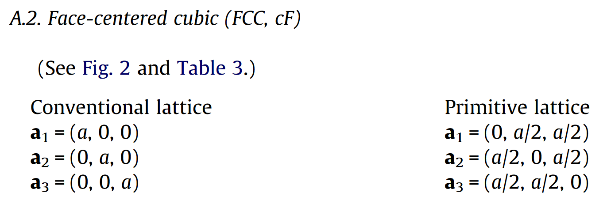
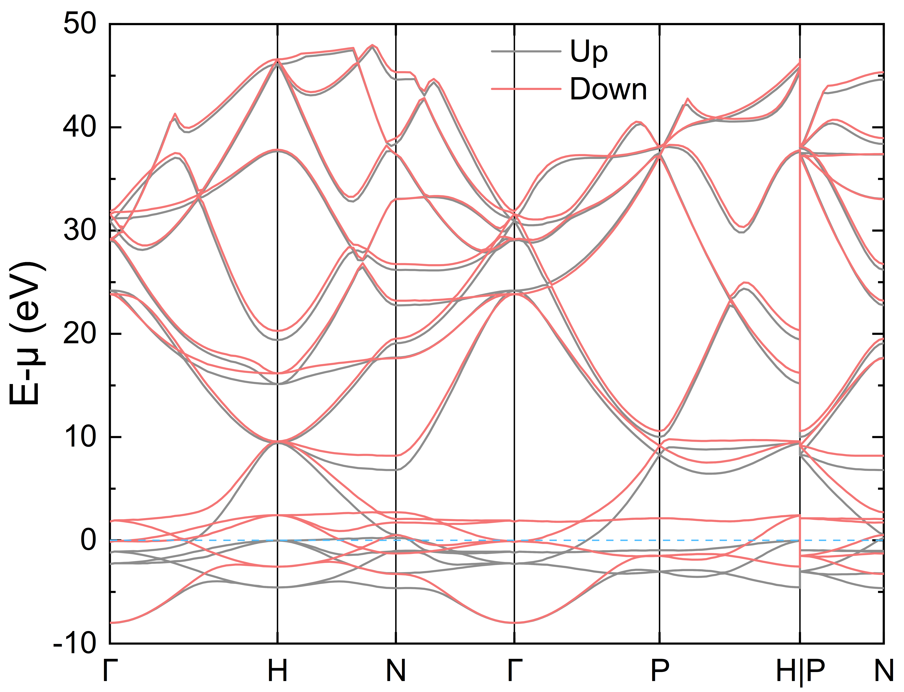

# 结合 ABACUS 和 Atomkit 计算态密度和能带

<strong>作者：陈涛，邮箱：chentao@stu.pku.edu.cn</strong>

<strong>审核：陈默涵，邮箱：mohanchen@pku.edu.cn</strong>

<strong>最后更新时间：2024/04/22</strong>

# 一、介绍

电子的态密度（<strong>Density of States</strong>，简称<strong>DOS</strong>）和电子能带结构（<strong>Electronic band structure</strong>）在凝聚态物理和材料科学中分析物质的光学、磁学等诸多性质都有重要用途，因此学会计算和分析材料的 DOS 和能带结构也是一项重要技能。

电子能带结构描述了材料中电子能量与动量（或波矢<strong>K</strong>）之间的关系。通过电子能带可以揭示材料中电子能级的分布情况，包括能级的高低、能带的宽度、能带之间的间隙（带隙，band gap）等信息。能带结构中的价带和导带之间的能隙大小决定了材料是导体、半导体还是绝缘体。金属没有能隙，半导体有能隙但带隙不大，绝缘体拥有较大的能隙。

DOS 是指在能量为 E 的能量附近可供电子占据的电子状态数目，DOS 是关于能量的函数，通常以每单位能量范围的态数目来表示。DOS 和能带结构紧密相关，通过对能带结构在能量上的积分得到。DOS 的峰值通常对应于能带结构中的范霍夫奇点，这些点是电子浓度变化剧烈的地方，且在费米能级（通常把这个能量设为 0 点，负数代表费米面以下，正数代表费米面以上）附近的行为对材料的电学性质有显著影响。例如，金属的高 DOS 导致高电导率，而半导体和绝缘体在费米能级附近的低 DOS 则导致低电导率。

使用密度泛函理论软件来计算电子态密度和能带一般包括以下两个步骤：第一步，对结构弛豫后的稳定晶体结构（一般来讲是这样操作）做 self-consistent field（简称 scf）自洽计算输出收敛的体系基态电子密度文件；第二步，读入上一步的电子密度，选取想要计算的能级和 K 点，固定电子密度，做一次非自洽（non-self-consistent field，简称 nscf）计算得到态密度以及能带结构。

# 二、准备

## 1. 下载<strong>并</strong>安装 Atomkit

在本教程里会用到 atomkit（并非一定要使用，只是会方便计算流程）来处理 ABACUS 的输入文件。首先推荐大家阅读以下文档并安装好 atomkit：

Atomkit 相关文档：[ATOMKIT Code ‒ VASPKIT 1.5 documentation](https://vaspkit.com/atomkit.html)

Atomkit v0.8.0 下载地址：[Download atomkit.0.8.0.linux.x64.tar.gz (vaspkit)](https://sourceforge.net/projects/vaspkit/files/Binaries/atomkit.0.8.0.linux.x64.tar.gz/download)

```bash
wget https://jaist.dl.sourceforge.net/project/vaspkit/Binaries/atomkit.0.8.0.linux.x64.tar.gz
tar -zxvf atomkit.0.8.0.linux.x64.tar.gz
cd atomkit/
bash setup.sh
# modify ~/.atomkit file based on your machine environment 
source ~/.bashrc
```

## 2. <strong>下载例子</strong>

可以从 Gitee 上[下载](https://gitee.com/mcresearch/abacus-user-guide/tree/master/examples/dos_band)。可以在网页右侧点击克隆/下载-> 下载 ZIP 得到算例，或者在 linux 终端执行如下命令得到算例：

```bash
git clone https://gitee.com/mcresearch/abacus-user-guide.git
```

下载后解压，之后进入 `abacus-user-guide/examples/dos_band` 文件夹

里面有 `Al` 和 `Fe` 两个文件夹，分别演示铝（nspin=1，适用无磁性体系）和铁（nspin=2，适用有磁性体系）的计算，均使用<strong>平面波基组</strong>

# 三、铝的态密度以及电子能带结构计算

## 1. 自洽计算

首先进入 `Al` 文件夹，铝在常温常压下是面心立方结构（fcc），以下是它经过结构优化（弛豫）后的构型文件：

```bash
ATOMIC_SPECIES
Al 26.982 Al_ONCV_PBE-1.0.upf upf201

LATTICE_CONSTANT
1.88972612546

LATTICE_VECTORS
    4.0450551637     0.0000000000     0.0000000000 #latvec1
    0.0000000000     4.0450551637     0.0000000000 #latvec2
    0.0000000000     0.0000000000     4.0450551637 #latvec3

ATOMIC_POSITIONS
Direct

Al #label
0 #magnetism
4 #number of atoms
    0.0000000000     0.0000000000     0.0000000000 m  0  0  0
    0.5000000000     0.5000000000     0.0000000000 m  0  0  0
    0.5000000000     0.0000000000     0.5000000000 m  0  0  0
    0.0000000000     0.5000000000     0.5000000000 m  0  0  0
```

这是一个标准的 fcc 单胞结构，但是我们做 DOS 和电子能带结构计算时，常用原胞，因此需要做一步结构转换，转换公式如下图所示：



这时也可以使用 Atomkit，执行如下命令，即可得到原胞 `PRIMCELL.STRU`

```bash
echo -e "2\n 202\n 101 STRU\n 101" | atomkit
# 这里为了方便演示，使用了命令行，表示将'2'、'202'、'101 STRU'和'101'依次传入atomkit，实际可以按照atomkit的提示依次输入
# 2代表进行Symmetry Analysis
# 202代表进行Find Primitive Cell
# 101 STRU代表读取ABACUS的STRU文件
# 101代表输出格式为ABACUS
```

接着执行如下命令进行自洽计算，要注意这里 `calculation` 为 scf，且需要设置 `out_chg` 为 <strong>1</strong> 以输出电荷密度文件（`SPIN1_CHG.cube`）。此外，ABACUS 默认读取 `STRU` 文件，这里我们设置 `stru_file` 为 `PRIMCELL.STRU`，读取得到的原胞

```bash
cp INPUT-scf INPUT
cp KPT-scf KPT
mpirun -n 8 abacus
```

## 2. 非自洽计算得到态密度

做态密度计算中的非自洽计算通常情况下需设置更加密的 K 点网格。执行如下命令进行非自洽计算，要注意这里 `calculation` 为 <strong>nscf</strong>，且需要设置 `init_chg` 为 <strong>file</strong> 以读取电荷密度文件（`SPIN1_CHG.cube`），`out_dos` 也需要设置为 <strong>1</strong> 以输出态密度

> 电荷密度文件（`SPIN1_CHG.cube`）默认是放在 `OUT.suffix` 目录下面，非自洽计算会自动去 `OUT.suffix` 目录下面找这个文件，如果找不到就会报错。熟悉 VASP 的用户可能习惯将这个文件移到另一个目录，这样也可以，但是需要在 `INPUT` 里设置 `read_file_dir` 为 `SPIN1_CHG.cube` 所在目录，`read_file_dir` 默认值是 `OUT.suffix`

```bash
cp INPUT-nscf INPUT
cp KPT-nscf KPT
mpirun -n 8 abacus
```

计算得到的态密度存在 `DOS1` 和 `DOS1_smearing.dat` 内，我们常用 `DOS1_smearing.dat` 绘图，第一列是能量（单位为 eV），第二列是态密度，第三列是对态密度的积分

若需要减去费米能，可使用如下命令抓取费米能，然后在绘图时将第一列的数据减去费米能即可

```bash
grep EFERMI OUT.*/running_scf.log
#  EFERMI = 10.963171515 eV
```

下面是使用 Origin 绘制的态密度图，出现很多毛刺的原因是为了减少计算量 K 点取得较少，可以通过展宽方法做得更平滑（`dos_sigma`，默认值为0.07），实际计算也可根据需要增大非自洽计算的 K 点网格


## 2. 非自洽计算得到电子能带

上一步的自洽计算目的是为了得到收敛的电子密度，有了收敛的电子密度，我们就能够快速的得到任意 K 点以及任意多条能带所对应的波函数。根据能带的习惯画法，这一步的 `KPT` 文件需要选取晶胞的布里渊区高对称点和路径，不同晶胞的高对称点和路径可以参考这个[文献](https://www.sciencedirect.com/science/article/pii/S0927025610002697?via%3Dihub) [1]。

这些高对称点能够反映出材料的电子性质，如能隙大小、有效质量、载流子迁移率等。例如，能隙大小直接影响材料是金属、半导体还是绝缘体；有效质量影响载流子的响应速度；而能带的形态和分布则与材料的光学吸收和发射特性密切相关。因此，通过研究布里渊区内的高对称点的能带结构，我们可以预测和解释材料的多种物理性质，这对于材料的设计和应用具有重要意义

对于 fcc 的原胞，它的高对称点和<strong>可选</strong>的路径如下图 [1] 所示：


`KPT` 需要选择<strong>Line</strong>模式（<strong>Line</strong>模式的介绍可以参考这个[链接](https://abacus.deepmodeling.com/en/latest/advanced/input_files/kpt.html#band-structure-calculations)），并且需要设置 `symmetry` 为 <strong>0</strong>（INPUT 文件里若没有设置 `symmetry`，则会默认设置为 <strong>0</strong>）

这里可以使用 Atomkit 软件自动生成 `KPT`，执行如下命令

```bash
echo -e "3\n 301\n 3\n 101 PRIMCELL.STRU\n 0.06" | atomkit
# 这里为了方便演示，使用了命令行，表示将'3'、'301'、'3'、'101 PRIMCELL.STRU'和'0.06'依次传入atomkit，实际可以按照atomkit的提示依次输入
# 3代表进行Generate K-Mesh & K-Path
# 301代表输出K点的格式为ABACUS
# 3代表Kpath for Bulk Structure
# 101 PRIMCELL.STRU代表读取ABACUS的PRIMCELL.STRU文件
# 0.06为kspacing的取值
```

生成的 `KLINES` 即是计算所需的 `KPT` 文件，前三个数是高对称点的分数坐标，第四个数是两个高对称 K 点间采点数，#号后面是该高对称点的名称

```bash
K_POINTS
  8
Line
   0.00000000   0.00000000   0.00000000   25     # GAMMA                         
   0.50000000   0.00000000   0.50000000    9     # X                             
   0.62500000   0.25000000   0.62500000    1     # U                             
   0.37500000   0.37500000   0.75000000   27     # K                             
   0.00000000   0.00000000   0.00000000   22     # GAMMA                         
   0.50000000   0.50000000   0.50000000   18     # L                             
   0.50000000   0.25000000   0.75000000   12     # W                             
   0.50000000   0.00000000   0.50000000    1     # X
```

接着执行如下命令进行非自洽计算，要注意这里 `calculation` 为 <strong>nscf</strong>，同样需要设置 `init_chg` 为 <strong>file</strong> 以读取电荷密度文件（`SPIN1_CHG.cube`），`out_band` 也需要设置为 <strong>1</strong> 以输出电子能带

```bash
cp INPUT-band INPUT
cp KLINES KPT
mpirun -n 8 abacus
```

计算结束之后在 `OUT.*` 目录下面会有 `BANDS_1.dat` 文件，其中第一列为 K 点序号，第二列是 K 点在布里渊区里的间隔（以笛卡尔坐标计算），从第三列往后是每条能带的电子能量，单位为 eV

```bash
1   0.00000000 -92.49968796 -54.00929724 ...
2   0.00988862 -92.49960078 -54.00938081 ...
3   0.01977723 -92.50345008 -54.00963444 ...
......
```

这里，可以使用目录下的 `gene_band_dat.py` 生成绘图所需的能带文件

```bash
# 假设当前目录存在KPT文件存储能带信息，OUT.*目录下有BANDS_*.dat文件
python gene_band_dat.py 10.963171515
# 10.963171515即为费米能数值，也可空缺，则不将能量减去费米能
```

运行完之后会在当前目录生成 `plot_BANDS_1.dat` 文件，即为绘图所需的能带文件，第一行为高对称 K 点的坐标，从第二行开始，第一列为 K 点在布里渊区里的间隔，第二列为每条能带的电子能量，单位为 eV。

```bash
# 0.0 0.24721543 0.32490774 0.47629565 0.73850721 0.95260205 1.12740976 1.25101747
0.000000 -103.462859
0.009889 -103.462772
......
```

下面是绘制的能带图，图中有不够光滑连线的原因是为了减少计算量，K 点取得较少，实际计算可根据需要增多 K 点间采点数目


# 四、铁的态密度以及电子能带结构计算

进入 `Fe` 文件夹，由于铁具有磁性，因此需要在 `INPUT` 中打开自旋极化选项，即增加参数 `nspin` 并设置为 2（默认值为 1），并且将铁的初始磁矩设置为非 0（直接设成 0 得不到铁磁基态）。注意此时再对铁做自洽迭代（相比于 `nspin` 设置为 1 的计算），程序对自旋向上和向下的电子在每一个布里渊区 K 点上都分别进行了 Kohn-Sham 方程的求解，因此计算时间将会几乎翻倍。

计算铁的态密度和电子能带结构的过程与铝几乎相同，但是要注意计算得到的态密度和电子能带结构文件均有两个（分别对应自旋向上和向下），分别为 `DOS1` 和 `DOS2`、`BANDS_1.dat` 和 `BANDS_2.dat`

绘图仍推荐使用 `DOS1_smearing.dat` 和 `DOS2_smearing.dat`，以及 `gene_band_dat.py` 生成的 `plot_BANDS_1.dat` 和 `plot_BANDS_2.dat`，使用绘图软件可得如下 DOS 以及能带图




# 五、参考文献

[1] Wahyu Setyawan and Stefano Curtarolo, High-throughput electronic band structure calculations: Challenges and tools, Comp. Mater. Sci., <strong>49</strong>, 299-312 (2010).
