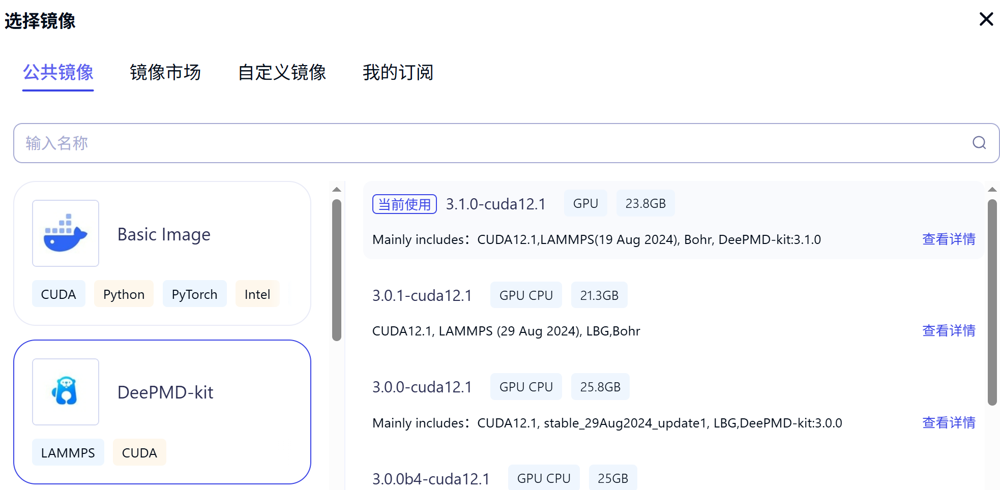

# ABACUS+DPA-3：基于 Bohrium 平台的安装与使用

**作者：赵丹枫，邮箱：daniel4130@stu.pku.edu.cn**

**审核：陈默涵，邮箱：mohanchen@pku.edu.cn**

**最后更新时间：2025/09/26**

# 一、 背景介绍

目前，在计算材料科学领域，机器学习势函数与电子结构计算的协作模式具有明确的单向性——电子结构计算凭借其原子级的精准性，成为机器学习势函数训练的数据 “供给站”，基于第一性原理计算生成的机器学习势函数则以兼具精度贺效率的优势，承担起大规模分子动力学模拟等电子结构计算难以快速覆盖的任务。

然而，机器学习势函数还潜藏着一种尚未被广泛发掘的重要价值：它能反哺电子结构计算的前置流程，充当高效的 “结构预筛选器”。具体而言，可借助具有量子力学精度的机器学习势函数在电子结构软件层面开展快速的结构优化，或通过短时间分子动力学模拟生成大量候选构型；经过这一粗筛环节后，再针对筛选出的关键结构进行高精度电子结构计算，既能大幅减少无效的高精度计算成本，又能保障核心研究对象的计算可靠性。

这一应用模式此前受限于势函数的体系局限性——传统势函数多针对特定元素或体系开发，通用性不足，难以集成为电子结构软件的标准化功能。随着 DPA3 等通用机器学习势函数的精度与稳定性持续完善，这一技术瓶颈得以突破。基于此，ABACUS 电子结构软件即将持续开发，重点攻克该功能的程序易用性优化与运行稳定性保障，推动机器学习势函数与电子结构计算形成 “数据供给-前置筛选-精准计算” 的全新闭环协同生态。

# 二、选择镜像

Bohrium 平台([https://www.bohrium.com/](https://www.bohrium.com/))上准备了丰富的软件镜像，我们可以通过创建容器节点的方式使用 Bohrium 为我们准备好的软件环境。创建了 Bohrium 的账号后，我们需要找到“智算”栏目下的“节点”。


创建容器节点，取一个便于辨认的节点名称。之后，在“镜像”一栏，我们选择 DeePMD-kit 的 3.1.0-cuda12.1 版本。

> 这里选择 DeePMD-kit 镜像而不选择 ABACUS 镜像的原因是：ABACUS 的安装手法相对单一，各种安装方式有较为完备和详细的教程（且适配不同的编译器版本），而 DeePMD-kit 的安装手法众多（可以从源码编译，也可以直接下载离线软件包，不同手法的后续步骤分歧较大），官方文档跳步较为严重，容易在安装过程中产生误会。



# 三、引入 ABACUS 并安装依赖库

ABACUS 的引入通过克隆 GitHub 仓库的方式进行。

由于初始状态的 DeePMD-kit 安装在文件夹 `/opt/` 下，为了便于寻找和管理，我们也将 ABACUS 的仓库克隆至此处。

```bash
cd opt/
# “-b”是版本选项；“LTS”指 ABACUS 的长期支持版本（Long Time Support），版本号记为 3.10.0
git clone https://github.com/deepmodeling/abacus-develop.git -b LTS
```

由于后面我们会使用大量 `sudo` 命令，所以首先我们需要安装 sudo。

```bash
apt update && apt install sudo
sudo --version
```

Bohrium 的环境默认基于 GCC 编译器，所以我们接下来将依照韩昊知的 ABACUS GCC 编译教程进行： [GCC 编译 ABACUS 教程](https://mcresearch.github.io/abacus-user-guide/abacus-gcc.htm)。

过程大致分为两步：

## 检查当前环境

检查操作系统版本， GCC 版本，git 版本等等。

```bash
lsb_release -a
gcc --version
git --version
```

## 安装依赖库

其实编译器也属于依赖库的一部分，但因为容器节点默认含有这些编译器，于是我们不用再次安装。

```bash
sudo apt install -y libopenblas-openmp-dev
sudo apt install -y liblapack-dev 
sudo apt install -y libfftw3-dev
sudo apt install -y libopenmpi-dev
sudo apt install -y libscalapack-mpi-dev
sudo apt install -y libcereal-dev
sudo apt install -y libelpa-dev
```

# 四、联合编译 ABACUS 和 DeePMD-kit

接下来我们进行联合编译，这个过程我们重点参考刘裕的文档： [ABACUS+DeePMD-kit 做机器学习分子动力学](https://mcresearch.github.io/abacus-user-guide/abacus-dpmd.html)。

首先我们明确两个事实：

其次，我们需要获取 DeePMD-kit 文件夹的绝对或相对路径：进入文件夹后，运行下面的命令

```bash
pwd
# 输出示例如下
/opt/deepmd-kit-3.1.0
```

于是，我们按下面的命令进行联合编译

```bash
cmake -B build -DDeePMD_DIR=/opt/deepmd-kit-3.1.0
# 运行下面一行命令之前，需要确认当前环境可供使用的核一共有几个
cmake --build build -j4
cmake --install build
# 此时，我们应当可以触发 abacus 命令
abacus --version
```

# 五、算例测试

ABACUS 提供了大量的测试样例和用户指导，安装后我们可以进行一些简单的测试。

将算例克隆至本地并进入 DPMD 算例的目录：

```shell
git clone https://gitee.com/mcresearch/abacus-user-guide.git
cd abacus-user-guide/examples/md/3_DPMD
# 运行样例
abacus
```

至此，我们成功在 Bohrium 平台上安装并联合编译了 ABACUS 和 DeePMD-kit，并且可以通过 ABACUS 调用 DPA（例如 DPA3）进行结构优化或者分子动力学模拟。DPA3 预训练模型可以在科学智能广场的“模型”一栏找到：[DPA-3.1-3M](https://www.aissquare.com/models/detail?pageType=models&name=DPA-3.1-3M&id=343)。
