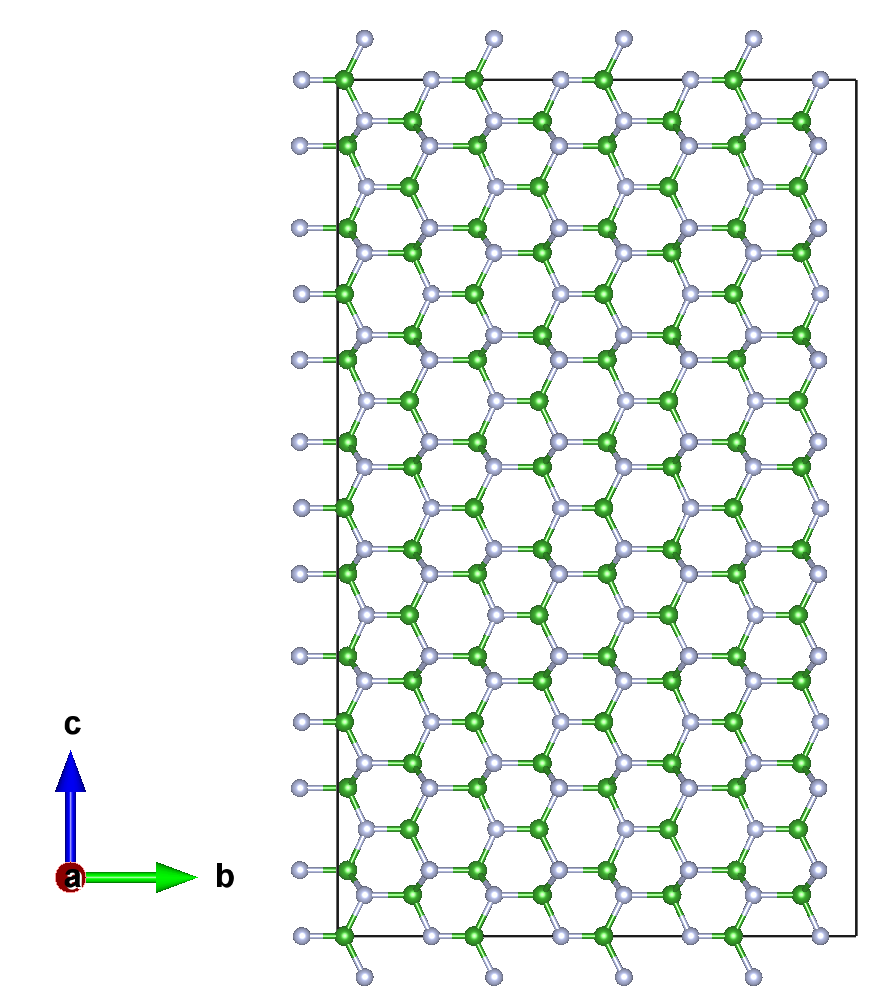
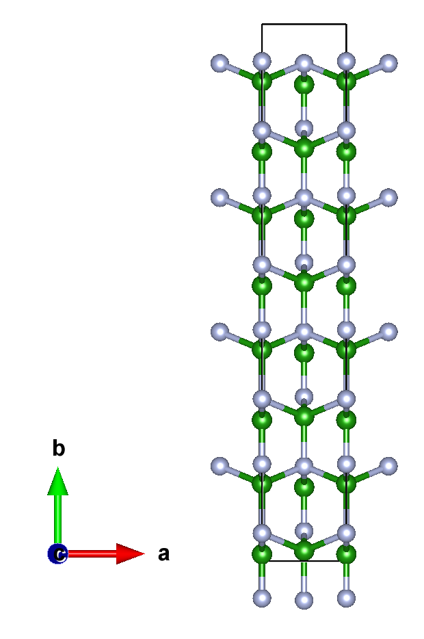

# ABACUS 如何选择晶胞朝向获得最佳并行效率？以二维氮化硼为例

<strong>作者：谢炘玥，邮箱：xyxie@stu.pku.edu.cn</strong>

<strong>审核：陈默涵，邮箱：mohanchen@pku.edu.cn</strong>

<strong>最后更新时间：2025/03/04</strong>

# 一、背景

我们已经测试过了一维材料的长边分别摆放在 XYZ 三个方向时，对计算效率的影响，并通过测试结果给出了建议，参考 [ABACUS 如何选择晶胞朝向获得最佳并行效率?以碳纳米管为例 · GitBook](https://mcresearch.github.io/abacus-user-guide/abacus-eff.html)。现在我们考虑一个二维六方氮化硼体系，即材料在两个方向的长度明显大于第三个方向。

下面我们分别将短边摆放在 X、Y、Z 方向，比较计算结果能量和时间来判断短边摆放方式对计算的影响。

# 二、ABACUS 计算的流程

本文算例的氮化硼在一个方向的长度明显小于另外两个方向，我们采用原子弛豫计算(ABACUS 中设置 `calculation` 为 `relax`，只让原子移动而固定晶格常数)。同样，通过对 `STRU` 和 `KPT` 文件的三列进行轮换改变摆放方式。我们先来看看为 ABACUS 计算准备的 `INPUT` 、`STRU` 和 `KPT` 三个输入文件。

## 1. INPUT 文件

可以注意到，在本次计算中，我们使用了 `kspacing` 这个参数（[Full List of INPUT Keywords — ABACUS  documentation](https://abacus.deepmodeling.com/en/latest/advanced/input_files/input-main.html#kspacing)），可以根据晶胞大小自动生成 `KPT` 文件。因此不再需要我们手动调换 K 点的顺序。

```python
INPUT_PARAMETERS
suffix                  BN
pseudo_dir              ./
orbital_dir             ./
calculation             cell-relax
symmetry                0
basis_type              lcao
ecutwfc                 100
scf_thr                 1e-07
scf_nmax                100
smearing_method         gauss
smearing_sigma          0.002
mixing_type             pulay
mixing_beta             0.3
cal_force               1
cal_stress              1
force_thr_ev            0.01
stress_thr              0.5
relax_nmax              100
out_stru                1
kspacing                0.08
```

## 2. STRU 文件

在本体系中，B 和 N 原子各有 96 个，h-BN 结构图如下。





可以发现，此时短边在晶胞的 X 方向上。

```python
ATOMIC_SPECIES
B   10.81         B_ONCV_PBE-1.0.upf
N   14.007        N_ONCV_PBE-1.0.upf

NUMERICAL_ORBITAL
B_gga_8au_100Ry_2s2p1d.orb
N_gga_8au_100Ry_2s2p1d.orb

LATTICE_CONSTANT
1.8897261258369282

LATTICE_VECTORS
2.6665300000      0.0000000000      0.0000000000
0.0000000000      16.970664000      0.0000000000
0.0000000000      0.0000000000      28.020088000

ATOMIC_POSITIONS
Direct
B
0.0000000000
96
0.0000000000 0.0126740000 0.0000000000 1 1 1 mag 0.0
0.5000000000 0.0189860000 0.0768190000 1 1 1 mag 0.0
0.0000000000 0.1439860000 0.0481810000 1 1 1 mag 0.0
0.5000000000 0.1376740000 0.1250000000 1 1 1 mag 0.0
0.0000000000 0.1439860000 0.2018190000 1 1 1 mag 0.0
0.5000000000 0.0189860000 0.1731810000 1 1 1 mag 0.0
0.0000000000 0.2626740000 0.0000000000 1 1 1 mag 0.0
0.5000000000 0.2689860000 0.0768190000 1 1 1 mag 0.0
0.0000000000 0.3939860000 0.0481810000 1 1 1 mag 0.0
0.5000000000 0.3876740000 0.1250000000 1 1 1 mag 0.0
0.0000000000 0.3939860000 0.2018190000 1 1 1 mag 0.0
0.5000000000 0.2689860000 0.1731810000 1 1 1 mag 0.0
0.0000000000 0.5126740000 0.0000000000 1 1 1 mag 0.0
0.5000000000 0.5189860000 0.0768190000 1 1 1 mag 0.0
0.0000000000 0.6439860000 0.0481810000 1 1 1 mag 0.0
0.5000000000 0.6376740000 0.1250000000 1 1 1 mag 0.0
0.0000000000 0.6439860000 0.2018190000 1 1 1 mag 0.0
0.5000000000 0.5189860000 0.1731810000 1 1 1 mag 0.0
0.0000000000 0.7626740000 0.0000000000 1 1 1 mag 0.0
0.5000000000 0.7689860000 0.0768190000 1 1 1 mag 0.0
0.0000000000 0.8939860000 0.0481810000 1 1 1 mag 0.0
0.5000000000 0.8876740000 0.1250000000 1 1 1 mag 0.0
0.0000000000 0.8939860000 0.2018190000 1 1 1 mag 0.0
0.5000000000 0.7689860000 0.1731810000 1 1 1 mag 0.0
0.0000000000 0.0126740000 0.2500000000 1 1 1 mag 0.0
0.5000000000 0.0189860000 0.3268190000 1 1 1 mag 0.0
0.0000000000 0.1439860000 0.2981810000 1 1 1 mag 0.0
0.5000000000 0.1376740000 0.3750000000 1 1 1 mag 0.0
0.0000000000 0.1439860000 0.4518190000 1 1 1 mag 0.0
0.5000000000 0.0189860000 0.4231810000 1 1 1 mag 0.0
0.0000000000 0.2626740000 0.2500000000 1 1 1 mag 0.0
0.5000000000 0.2689860000 0.3268190000 1 1 1 mag 0.0
0.0000000000 0.3939860000 0.2981810000 1 1 1 mag 0.0
0.5000000000 0.3876740000 0.3750000000 1 1 1 mag 0.0
0.0000000000 0.3939860000 0.4518190000 1 1 1 mag 0.0
0.5000000000 0.2689860000 0.4231810000 1 1 1 mag 0.0
0.0000000000 0.5126740000 0.2500000000 1 1 1 mag 0.0
0.5000000000 0.5189860000 0.3268190000 1 1 1 mag 0.0
0.0000000000 0.6439860000 0.2981810000 1 1 1 mag 0.0
0.5000000000 0.6376740000 0.3750000000 1 1 1 mag 0.0
0.0000000000 0.6439860000 0.4518190000 1 1 1 mag 0.0
0.5000000000 0.5189860000 0.4231810000 1 1 1 mag 0.0
0.0000000000 0.7626740000 0.2500000000 1 1 1 mag 0.0
0.5000000000 0.7689860000 0.3268190000 1 1 1 mag 0.0
0.0000000000 0.8939860000 0.2981810000 1 1 1 mag 0.0
0.5000000000 0.8876740000 0.3750000000 1 1 1 mag 0.0
0.0000000000 0.8939860000 0.4518190000 1 1 1 mag 0.0
0.5000000000 0.7689860000 0.4231810000 1 1 1 mag 0.0
0.0000000000 0.0126740000 0.5000000000 1 1 1 mag 0.0
0.5000000000 0.0189860000 0.5768190000 1 1 1 mag 0.0
0.0000000000 0.1439860000 0.5481810000 1 1 1 mag 0.0
0.5000000000 0.1376740000 0.6250000000 1 1 1 mag 0.0
0.0000000000 0.1439860000 0.7018190000 1 1 1 mag 0.0
0.5000000000 0.0189860000 0.6731810000 1 1 1 mag 0.0
0.0000000000 0.2626740000 0.5000000000 1 1 1 mag 0.0
0.5000000000 0.2689860000 0.5768190000 1 1 1 mag 0.0
0.0000000000 0.3939860000 0.5481810000 1 1 1 mag 0.0
0.5000000000 0.3876740000 0.6250000000 1 1 1 mag 0.0
0.0000000000 0.3939860000 0.7018190000 1 1 1 mag 0.0
0.5000000000 0.2689860000 0.6731810000 1 1 1 mag 0.0
0.0000000000 0.5126740000 0.5000000000 1 1 1 mag 0.0
0.5000000000 0.5189860000 0.5768190000 1 1 1 mag 0.0
0.0000000000 0.6439860000 0.5481810000 1 1 1 mag 0.0
0.5000000000 0.6376740000 0.6250000000 1 1 1 mag 0.0
0.0000000000 0.6439860000 0.7018190000 1 1 1 mag 0.0
0.5000000000 0.5189860000 0.6731810000 1 1 1 mag 0.0
0.0000000000 0.7626740000 0.5000000000 1 1 1 mag 0.0
0.5000000000 0.7689860000 0.5768190000 1 1 1 mag 0.0
0.0000000000 0.8939860000 0.5481810000 1 1 1 mag 0.0
0.5000000000 0.8876740000 0.6250000000 1 1 1 mag 0.0
0.0000000000 0.8939860000 0.7018190000 1 1 1 mag 0.0
0.5000000000 0.7689860000 0.6731810000 1 1 1 mag 0.0
0.0000000000 0.0126740000 0.7500000000 1 1 1 mag 0.0
0.5000000000 0.0189860000 0.8268190000 1 1 1 mag 0.0
0.0000000000 0.1439860000 0.7981810000 1 1 1 mag 0.0
0.5000000000 0.1376740000 0.8750000000 1 1 1 mag 0.0
0.0000000000 0.1439860000 0.9518190000 1 1 1 mag 0.0
0.5000000000 0.0189860000 0.9231810000 1 1 1 mag 0.0
0.0000000000 0.2626740000 0.7500000000 1 1 1 mag 0.0
0.5000000000 0.2689860000 0.8268190000 1 1 1 mag 0.0
0.0000000000 0.3939860000 0.7981810000 1 1 1 mag 0.0
0.5000000000 0.3876740000 0.8750000000 1 1 1 mag 0.0
0.0000000000 0.3939860000 0.9518190000 1 1 1 mag 0.0
0.5000000000 0.2689860000 0.9231810000 1 1 1 mag 0.0
0.0000000000 0.5126740000 0.7500000000 1 1 1 mag 0.0
0.5000000000 0.5189860000 0.8268190000 1 1 1 mag 0.0
0.0000000000 0.6439860000 0.7981810000 1 1 1 mag 0.0
0.5000000000 0.6376740000 0.8750000000 1 1 1 mag 0.0
0.0000000000 0.6439860000 0.9518190000 1 1 1 mag 0.0
0.5000000000 0.5189860000 0.9231810000 1 1 1 mag 0.0
0.0000000000 0.7626740000 0.7500000000 1 1 1 mag 0.0
0.5000000000 0.7689860000 0.8268190000 1 1 1 mag 0.0
0.0000000000 0.8939860000 0.7981810000 1 1 1 mag 0.0
0.5000000000 0.8876740000 0.8750000000 1 1 1 mag 0.0
0.0000000000 0.8939860000 0.9518190000 1 1 1 mag 0.0
0.5000000000 0.7689860000 0.9231810000 1 1 1 mag 0.0

N
0.0000000000
96
0.0000000000 0.0518080000 0.0478800000 1 1 1 mag 0.0
0.5000000000 0.1768080000 0.0771200000 1 1 1 mag 0.0
0.0000000000 0.1807370000 0.0000000000 1 1 1 mag 0.0
0.5000000000 0.1768080000 0.1728800000 1 1 1 mag 0.0
0.0000000000 0.0518080000 0.2021200000 1 1 1 mag 0.0
0.5000000000 0.0557370000 0.1250000000 1 1 1 mag 0.0
0.0000000000 0.3018080000 0.0478800000 1 1 1 mag 0.0
0.5000000000 0.4268080000 0.0771200000 1 1 1 mag 0.0
0.0000000000 0.4307370000 0.0000000000 1 1 1 mag 0.0
0.5000000000 0.4268080000 0.1728800000 1 1 1 mag 0.0
0.0000000000 0.3018080000 0.2021200000 1 1 1 mag 0.0
0.5000000000 0.3057370000 0.1250000000 1 1 1 mag 0.0
0.0000000000 0.5518080000 0.0478800000 1 1 1 mag 0.0
0.5000000000 0.6768080000 0.0771200000 1 1 1 mag 0.0
0.0000000000 0.6807370000 0.0000000000 1 1 1 mag 0.0
0.5000000000 0.6768080000 0.1728800000 1 1 1 mag 0.0
0.0000000000 0.5518080000 0.2021200000 1 1 1 mag 0.0
0.5000000000 0.5557370000 0.1250000000 1 1 1 mag 0.0
0.0000000000 0.8018080000 0.0478800000 1 1 1 mag 0.0
0.5000000000 0.9268080000 0.0771200000 1 1 1 mag 0.0
0.0000000000 0.9307370000 0.0000000000 1 1 1 mag 0.0
0.5000000000 0.9268080000 0.1728800000 1 1 1 mag 0.0
0.0000000000 0.8018080000 0.2021200000 1 1 1 mag 0.0
0.5000000000 0.8057370000 0.1250000000 1 1 1 mag 0.0
0.0000000000 0.0518080000 0.2978800000 1 1 1 mag 0.0
0.5000000000 0.1768080000 0.3271200000 1 1 1 mag 0.0
0.0000000000 0.1807370000 0.2500000000 1 1 1 mag 0.0
0.5000000000 0.1768080000 0.4228800000 1 1 1 mag 0.0
0.0000000000 0.0518080000 0.4521200000 1 1 1 mag 0.0
0.5000000000 0.0557370000 0.3750000000 1 1 1 mag 0.0
0.0000000000 0.3018080000 0.2978800000 1 1 1 mag 0.0
0.5000000000 0.4268080000 0.3271200000 1 1 1 mag 0.0
0.0000000000 0.4307370000 0.2500000000 1 1 1 mag 0.0
0.5000000000 0.4268080000 0.4228800000 1 1 1 mag 0.0
0.0000000000 0.3018080000 0.4521200000 1 1 1 mag 0.0
0.5000000000 0.3057370000 0.3750000000 1 1 1 mag 0.0
0.0000000000 0.5518080000 0.2978800000 1 1 1 mag 0.0
0.5000000000 0.6768080000 0.3271200000 1 1 1 mag 0.0
0.0000000000 0.6807370000 0.2500000000 1 1 1 mag 0.0
0.5000000000 0.6768080000 0.4228800000 1 1 1 mag 0.0
0.0000000000 0.5518080000 0.4521200000 1 1 1 mag 0.0
0.5000000000 0.5557370000 0.3750000000 1 1 1 mag 0.0
0.0000000000 0.8018080000 0.2978800000 1 1 1 mag 0.0
0.5000000000 0.9268080000 0.3271200000 1 1 1 mag 0.0
0.0000000000 0.9307370000 0.2500000000 1 1 1 mag 0.0
0.5000000000 0.9268080000 0.4228800000 1 1 1 mag 0.0
0.0000000000 0.8018080000 0.4521200000 1 1 1 mag 0.0
0.5000000000 0.8057370000 0.3750000000 1 1 1 mag 0.0
0.0000000000 0.0518080000 0.5478800000 1 1 1 mag 0.0
0.5000000000 0.1768080000 0.5771200000 1 1 1 mag 0.0
0.0000000000 0.1807370000 0.5000000000 1 1 1 mag 0.0
0.5000000000 0.1768080000 0.6728800000 1 1 1 mag 0.0
0.0000000000 0.0518080000 0.7021200000 1 1 1 mag 0.0
0.5000000000 0.0557370000 0.6250000000 1 1 1 mag 0.0
0.0000000000 0.3018080000 0.5478800000 1 1 1 mag 0.0
0.5000000000 0.4268080000 0.5771200000 1 1 1 mag 0.0
0.0000000000 0.4307370000 0.5000000000 1 1 1 mag 0.0
0.5000000000 0.4268080000 0.6728800000 1 1 1 mag 0.0
0.0000000000 0.3018080000 0.7021200000 1 1 1 mag 0.0
0.5000000000 0.3057370000 0.6250000000 1 1 1 mag 0.0
0.0000000000 0.5518080000 0.5478800000 1 1 1 mag 0.0
0.5000000000 0.6768080000 0.5771200000 1 1 1 mag 0.0
0.0000000000 0.6807370000 0.5000000000 1 1 1 mag 0.0
0.5000000000 0.6768080000 0.6728800000 1 1 1 mag 0.0
0.0000000000 0.5518080000 0.7021200000 1 1 1 mag 0.0
0.5000000000 0.5557370000 0.6250000000 1 1 1 mag 0.0
0.0000000000 0.8018080000 0.5478800000 1 1 1 mag 0.0
0.5000000000 0.9268080000 0.5771200000 1 1 1 mag 0.0
0.0000000000 0.9307370000 0.5000000000 1 1 1 mag 0.0
0.5000000000 0.9268080000 0.6728800000 1 1 1 mag 0.0
0.0000000000 0.8018080000 0.7021200000 1 1 1 mag 0.0
0.5000000000 0.8057370000 0.6250000000 1 1 1 mag 0.0
0.0000000000 0.0518080000 0.7978800000 1 1 1 mag 0.0
0.5000000000 0.1768080000 0.8271200000 1 1 1 mag 0.0
0.0000000000 0.1807370000 0.7500000000 1 1 1 mag 0.0
0.5000000000 0.1768080000 0.9228800000 1 1 1 mag 0.0
0.0000000000 0.0518080000 0.9521200000 1 1 1 mag 0.0
0.5000000000 0.0557370000 0.8750000000 1 1 1 mag 0.0
0.0000000000 0.3018080000 0.7978800000 1 1 1 mag 0.0
0.5000000000 0.4268080000 0.8271200000 1 1 1 mag 0.0
0.0000000000 0.4307370000 0.7500000000 1 1 1 mag 0.0
0.5000000000 0.4268080000 0.9228800000 1 1 1 mag 0.0
0.0000000000 0.3018080000 0.9521200000 1 1 1 mag 0.0
0.5000000000 0.3057370000 0.8750000000 1 1 1 mag 0.0
0.0000000000 0.5518080000 0.7978800000 1 1 1 mag 0.0
0.5000000000 0.6768080000 0.8271200000 1 1 1 mag 0.0
0.0000000000 0.6807370000 0.7500000000 1 1 1 mag 0.0
0.5000000000 0.6768080000 0.9228800000 1 1 1 mag 0.0
0.0000000000 0.5518080000 0.9521200000 1 1 1 mag 0.0
0.5000000000 0.5557370000 0.8750000000 1 1 1 mag 0.0
0.0000000000 0.8018080000 0.7978800000 1 1 1 mag 0.0
0.5000000000 0.9268080000 0.8271200000 1 1 1 mag 0.0
0.0000000000 0.9307370000 0.7500000000 1 1 1 mag 0.0
0.5000000000 0.9268080000 0.9228800000 1 1 1 mag 0.0
0.0000000000 0.8018080000 0.9521200000 1 1 1 mag 0.0
0.5000000000 0.8057370000 0.8750000000 1 1 1 mag 0.0
```

改变摆放方式时，要同时轮换 `LATTICE_VECTORS` 和 `ATOMIC_POSITIONS` 的顺序。

## 3. KPT 文件

```python
K_POINTS
0
Gamma
16 3 2 0 0 0
```

如前所述，该 `KPT` 文件是由 `INPUT` 文件里的 `kspacing` 参数所生成，因此不需要我们手动轮换，每次计算都会自动根据晶胞大小产生合适的 K 点。

# 三、测试结果

计算采用 `ABAUCS v3.8.0` 版本，选择 64 个型号为 `8426Y+` 的 CPU 用 64 个进程对该二维氮化硼体系进行结构弛豫。下表给出本次测试的结果，将氮化硼的短边分别摆放在 XYZ 三个方向完成结构弛豫的步数都是 9 步。我们通过比较总能量和时间差异来判断摆放方式对计算结果的影响，可以看到系统总能量并不会受到短边取向的影响，但计算时间会受到显著影响。短边摆放在 Z 方向时，即两长边分别放在 X、Y 方向，计算时间明显慢于长边摆放在 Y、Z 和 Z、X 方向，每一电子步大概慢 6 s 左右。（注意：我们进行一维材料计算时，也建议将长边摆放在 Z 方向以提高计算效率）

| h-BN 的两个长边方向 | 系统总能量 (eV)   | 计算总时间 (s) | 计算总弛豫步数 | 运行一电子步的时间 (s) | FFT        | UNIFORMGRID DIM(BIG) |
| ------------------- | ----------------- | -------------- | -------------- | ---------------------- | ---------- | -------------------- |
| XY                  | -33578.4871085887 | 2140           | 9              | 24.8~26.8              | 216\*360\*36 | 54\*72\*18             |
| YZ                  | -33578.4871085889 | 1609           | 9              | 18.7~20.0              | 36\*216\*360 | 9\*54\*120             |
| ZX                  | -33578.4871085888 | 1629           | 9              | 18.9~20.9              | 360\*36\*216 | 72\*9\*54              |

根据以上测试结果，建议读者们在进行二维体系计算时，将短边摆放在 X 或 Y 方向以获得 ABACUS 计算时的最大效率。
