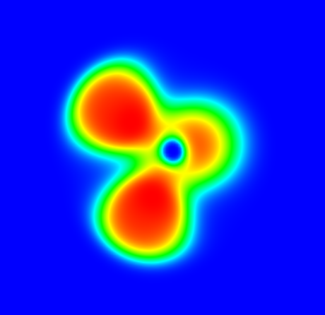

# ABACUS 计算电子局域函数 ELF 使用教程

<strong>作者：孙亮，邮箱：l.sun@pku.edu.cn</strong>

<strong>审核：陈默涵，邮箱：mohanchen@pku.edu.cn</strong>

<strong>最后更新时间：2024/10/10</strong>

# 一、背景

电子局域函数（Electron localization function，ELF）最早在 1990 年由 Becke 和 Edgecombe 提出[1]，它描述电子的局域化程度。根据定义，ELF 是一个 0 到 1 之间的数，越接近 1，表示电子越局域，ELF=1/2 时，对应均匀电子气，越接近 0，表示电子越离域。

目前，ABACUS 支持使用平面波基组、原子轨道基组下的 Kohn-Sham DFT（KSDFT）和无轨道密度泛函理论计算并输出 ELF。

# 二、定义

## 1. 自旋非极化

自旋非极化时，ELF 定义为

$$
{\rm{ELF}} = \frac{1}{1+\chi^2}
$$

其中$$\chi = \frac{\tau_{KS} - \tau_{vW}}{\tau_{TF}}$$，$$\tau_{KS} = \frac{1}{2}\sum_{i}{f_i |\nabla\psi_i|^2}$$为 KSDFT 的正定动能密度，$$\tau_{vW} = \frac{|\nabla\rho|^2}{8\rho}$$为 von Weizsäcker 泛函的正定形式，$$\tau_{TF} = \frac{3}{10}(3\pi^2)^{2/3}\rho^{5/3}$$为 Thomas-Fermi 泛函。

## 2. 自旋极化

自旋极化状态下，我们可以针对一种自旋的电子定义 ELF，即

$$
{\rm{ELF}}_\sigma = \frac{1}{1+\chi_\sigma^2}
$$

其中$$\chi_\sigma = \frac{\tau^{KS}_\sigma - \tau^{vW}_\sigma}{\tau^{TF}_\sigma}$$，$$\tau^{KS}_\sigma = \frac{1}{2}\sum_{i}{f_i |\nabla\psi_{i,\sigma}|^2}$$为自旋为$$\sigma$$的电子对应的正定动能密度。对于动能泛函，根据自旋标度率，有$$T_\sigma = \frac{1}{2}T[2\rho_\sigma]$$，因此，$$\tau^{vW}_\sigma = \frac{|\nabla\rho_\sigma|^2}{8\rho_\sigma}$$，$$\tau^{TF}_\sigma = \frac{1}{2}\frac{3}{10}(3\pi^2)^{2/3}(2\rho_\sigma)^{5/3} = \frac{3}{10}(6\pi^2)^{2/3}\rho_\sigma^{5/3}$$。

> <strong>注：</strong>Becke 和 Edgecombe 对 ELF 的原始定义为
> 
> 由于这里$$\tau_\sigma = \sum_{i}{f_i |\nabla\psi_{i,\sigma}|^2} = 2\tau^{KS}_\sigma$$，因此分子分母同除以 2 后与上述定义相同。

同时，我们也可以定义总的 ELF，即

$$
{\rm{ELF}}_{tot} = \frac{1}{1+\chi_{tot}^2}
$$

其中$$\chi_{tot} = \frac{\tau^{KS}_\alpha + \tau^{KS}_\beta - \tau^{vW}_\alpha - \tau^{vW}_\beta}{\tau^{TF}_\alpha + \tau^{TF}_\beta}$$。

## 3. 稳定性修正

在远离原子核的区域，$$\chi$$的分子和分母均趋于零，但分母更快地趋于零，因此$$\chi$$趋于无穷，最终 ELF 趋于零。

但在 LCAO 基组下，由于基组的不完备性，在远离原子核的某些区域，$$\chi$$的分子可能更快地趋于零，导致$$\chi$$趋于零或得到一个有限的值，最终得到非零的 ELF，即电子出现不物理的“局域化”。在 PW 基组下，则没有上述问题。

为了修正基组带来的不稳定性，我们采用了文献[2]中的建议，在$$\chi$$的分子上增加一个很小的修正值，以保证$$\chi$$在远离原子核的区域正确地趋于零。经测试后，ABACUS 取此修正值为 $$10^{-5}$$，即可以提升稳定性，又不会影响近核区域的结果。

# 三、ABACUS 计算 ELF 具体流程

<strong>相关参数：</strong>`out_elf [int] [int]`：`out_elf` 的第一个值控制是否输出 ELF，设置为 1 则输出，默认值为 0；第二个值控制输出的有效数字位数，默认为 3。

在 INPUT 中设置 `out_elf 1` 并运行 ABACUS 后，ELF 会被存储到 OUT 文件夹下。

自旋非极化情况下（`nspin 1`）ELF 会被存储到 `ELF.cube` 文件中；自旋极化的情况下（`nspin 2`），除了 `ELF.cube` 中存储的总 ELF，自旋为上和自旋为下的 ELF 会分别存储在 `ELF_SPIN1.cube` 和 `ELF_SPIN2.cube` 中。这些 cube 文件都可以直接在 VESTA 中可视化。

下面举两个具体的例子，一个自旋非极化的水分子，另一个是自旋极化的体心立方铁。

## 1. 计算实例：自旋非极化的水分子

### 1.1 平面波基组

算例地址：[https://github.com/MCresearch/abacus-user-guide/tree/master/examples/elf/H20-pw](https://github.com/MCresearch/abacus-user-guide/tree/master/examples/elf/H20-pw)

运行此算例得到的 `ELF.cube` 文件如下，由于此算例中的水分子放置在真空中，远离水分子的区域内 ELF 都为零。

```cpp
STEP: 0  Cubefile created from ABACUS. Inner loop is z, followed by y and x
1 (nspin) 
3 0.0 0.0 0.0 
180 0.155556 0.000000 0.000000
180 0.000000 0.155556 0.000000
180 0.000000 0.000000 0.155556
 1 1.000000 11.967714 18.726812 8.322864
 1 1.000000 14.244302 20.657387 7.503683
 8 6.000000 13.550429 19.681072 9.139011
 0.000e+00 0.000e+00 0.000e+00 0.000e+00 0.000e+00 0.000e+00
 0.000e+00 0.000e+00 0.000e+00 0.000e+00 0.000e+00 0.000e+00
 ......
  0.000e+00 0.000e+00 0.000e+00 0.000e+00 0.000e+00 0.000e+00
```

将此文件在 VEASTA 中可视化，得到下图，其中左图为 ELF 的等高面，右图为在 H-O-H 截面上的切面图。


### 1.2 原子轨道基组

算例地址：[https://github.com/MCresearch/abacus-user-guide/tree/master/examples/elf/H20-lcao](https://github.com/MCresearch/abacus-user-guide/tree/master/examples/elf/H20-lcao)

运行此算例后，可得到与上例格式相同的 `ELF.cube` 文件，用 VESTA 可视化的结果如下图，其中左图为 ELF 的等高面，右图为在 H-O-H 截面上的切面图。。




由于使用的基组不同，得到的 ELF 也略有不同。

## 2. 计算实例：自旋极化的体心立方铁

算例地址：[https://github.com/MCresearch/abacus-user-guide/tree/master/examples/elf/bcc-Fe-pw](https://github.com/MCresearch/abacus-user-guide/tree/master/examples/elf/bcc-Fe-pw)

此算例使用 PW 基组下的 KSDFT。运行此算例后，可以得到 `ELF.cube`，`ELF_SPIN1.cube` 与 `ELF_SPIN2.cube` 三个文件，分别存储总 ELF，自旋为上电子的 ELF 以及自旋为下电子的 ELF，下面为三种不同的 ELF 在(100)晶面上的分布图。


# 四、参考文献

[1] Becke A D, Edgecombe K E. A simple measure of electron localization in atomic and molecular systems[J]. The Journal of chemical physics, 1990, 92(9): 5397-5403.

[2] 卢天, 陈飞武. 电子定域化函数的含义与函数形式[J]. 物理化学学报, 2011, 27(12): 2786-2792.
