# 国产软硬件生态融合3：华为鲲鹏920处理器上ABACUS随机波函数DFT方法测试

**作者：张笑扬，邮箱：zxypku21@stu.pku.edu.cn**

**作者：陈诺，邮箱：chennuo@stu.pku.edu.cn**

**作者：李雨桥，邮箱：yuqiaoli25@stu.pku.edu.cn**

**审核：周徐源，邮箱：xy_z@pku.edu.cn**

**审核：蒋巩明，邮箱：jianggongming@huawei.com**

**审核：陈默涵，邮箱：mohanchen@pku.edu.cn**

**最后更新时间：2026/06/11**

# 一、背景介绍

本测试教程针对ABACUS（原子算筹）软件里基于平面波实现的随机波函数密度泛函理论方法（Stochastic Density Functional Theory，简称SDFT）。ABACUS的SDFT方法基于平面波，由于波函数之间不需要正交化处理，因此具有较好的并行扩展性，详细计算教程可见链接：https://mcresearch.github.io/abacus-user-guide/test-sdft.html

本次测试方式：分别在Intel Xeon Gold 6132工作站与鲲鹏920新型号/专业版上按一定进线程配置运行。所有算例的相对误差都在10e-9以下，总压强（Total Pressure）绝对误差在0.00001 kbar附近。关于ABACUS在华为鲲鹏920处理器上的编译请参见本系列：[国产软硬件生态融合1：ABACUS基于华为鲲鹏920处理器的编译和使用指南](https://mp.weixin.qq.com/s/2qLbWy2XozE_IjijAd6S7w)

# 二、效率测试总结

本次测试环境同本系列前一篇[平面波基组](https://mcresearch.github.io/abacus-user-guide/abacus-kunpeng920-pw.html)[测试](https://mcresearch.github.io/abacus-user-guide/abacus-kunpeng920-pw.html)的环境，具体如下：

1. 使用abacus-develop的release页面的3.9.0.25，编译出名为`abacus_2p`的可执行文件

2. 对比环境：台式机工作站。（Intel Xeon Gold 6132，以下简称6132）

3. 920新型号比较：4进程4线程 / 8进程2线程（部分大算例4*4运行较缓慢）。6132和新型号运行方式示例：

```Bash
export OMP_NUM_THREADS=4
mpirun -np 4 abacus
```

4. 920专业版比较：针对其众核特性，使用单节点满载性能进行比较。

6132：28进程运行；920专业版：取运行速度最快的单节点进程数作为参考。专业版运行方式示例：

```Bash
export KML_FFT_THREAD_TYPE=OMP
export KML_BLAS_THREAD_TYPE=OMP
export OMP_NUM_THREADS=2
mpirun --map-by ppr:4:numa:pe=2 -np 8 abacus
```

算例来自中文文档：https://mcresearch.github.io/abacus-user-guide/test-sdft.html，包括随机波函数密度泛函理论（Stochastic Density Functional Theory, SDFT）和混合随机-确定性 DFT 方法（Mixed stochastic-deterministic DFT, MDFT）两类。

1. 算例 1（C-sdft-8atom-700eV-3.5η）：密度为 12.307 g/cc，700 eV 高温的温稠密碳，随机密度泛函理论算例

2. 算例 2（C-mdft-8atom-172.34eV-4.1η）：密度 14.416 g/cc，172.34 eV 高温的温稠密碳，混合随机-确定性密度泛函理论算例

|算例|C-mdft-8atom-172.34eV-4.1η|C-sdft-8atom-700eV-3.5η|
|---|---|---|
|6132耗时/s|564|214|
|920新型号耗时/s|201|68|
|加速比|2.8|3.1|

|算例|C-mdft-8atom-172.34eV-4.1η|C-sdft-8atom-700eV-3.5η|
|---|---|---|
|6132耗时/s|317|211|
|920专业版耗时/s|52|11|
|加速比|6.1|19.2|

以下前三组测试使用了较小的平面波截断能（ecutwfc）和切比雪夫展开阶数（nche_sto），仅作为正确性测试使用；后四组使用了较大的平面波截断能（ecutwfc）和切比雪夫展开阶数（nche_sto），用于对比效率，展示了真实物理情景下ABACUS软件结合鲲鹏920系列处理器解决极端高温高压问题计算的能力。

## 温稠密碳例子1

该算例计算时间小于10s，采用SDFT算法，8个原子，温度700 eV，3.5倍压缩比。仅作为正确性测试使用（中文文档）。

### 920新型号结果

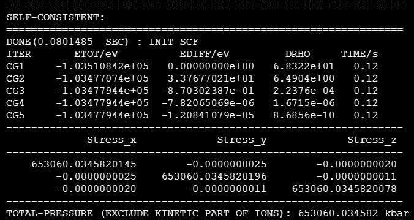

### 对照组结果

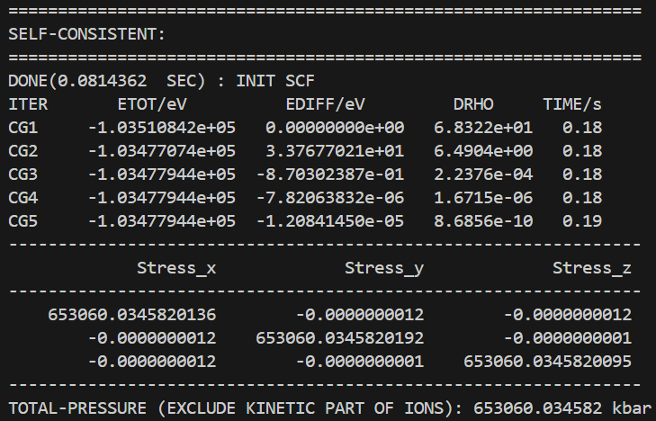

## 温稠密碳例子2

该算例计算时间小于10s，采用MDFT算法，8个原子，172.34 eV，压缩比4.1倍。仅作为正确性测试使用（中文文档）。

### 920新型号结果

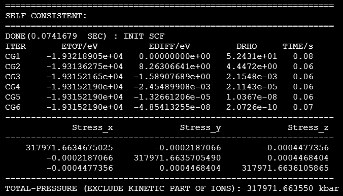

### 对照组结果

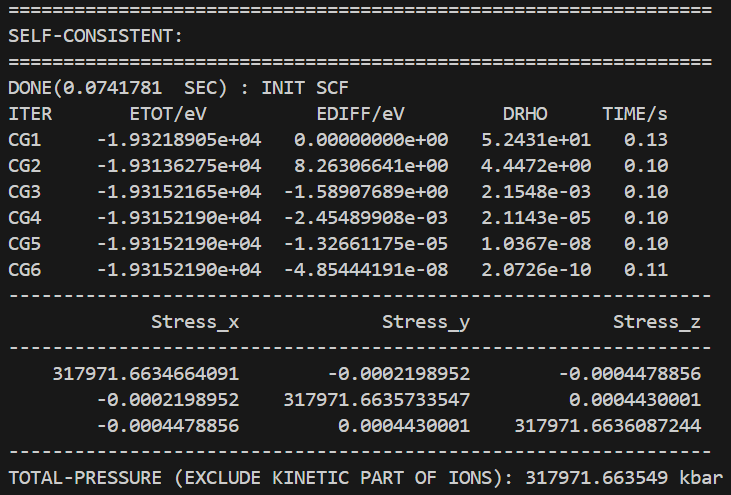

## C-mdft-8atom-172.34eV-4.1η

920新型号测试结果：4进程4线程，加速2.8倍

### 920新型号结果：201 s

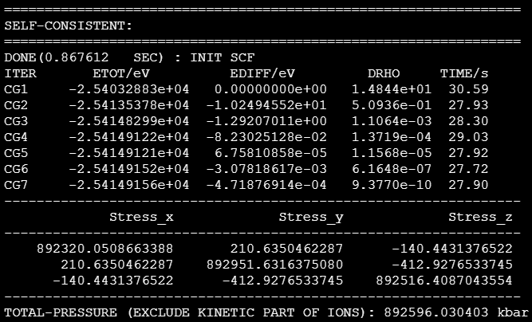

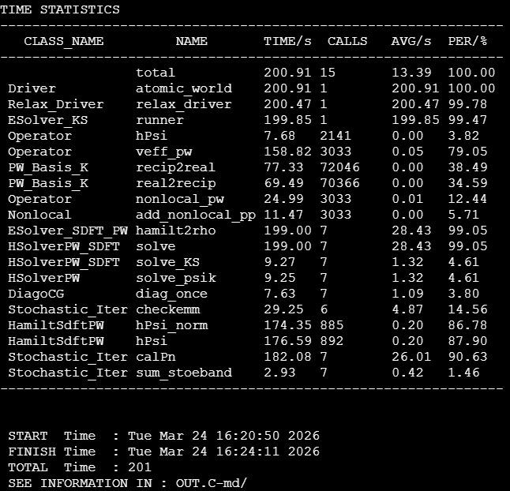

### 对照组结果：564 s

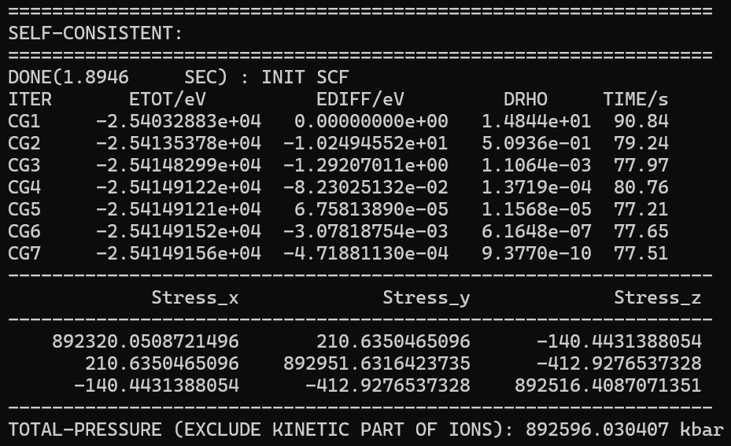

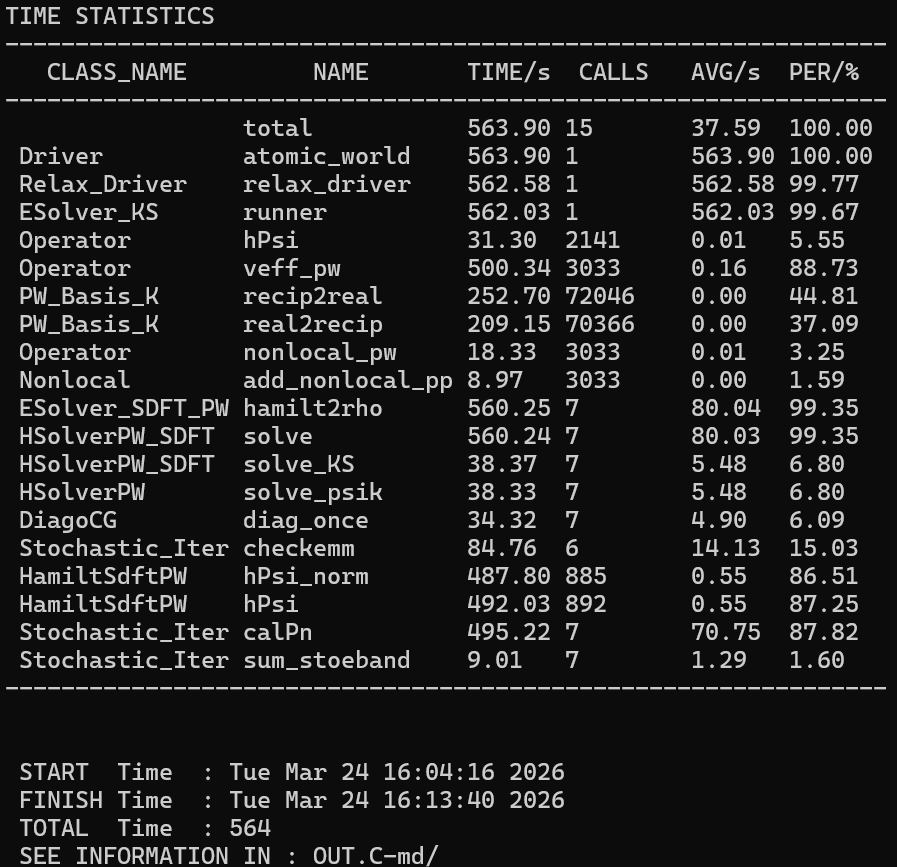

## C-sdft-8atom-700eV-3.5η 

920新型号测试结果：8进程2线程，加速3.1倍

### 920新型号结果：68 s

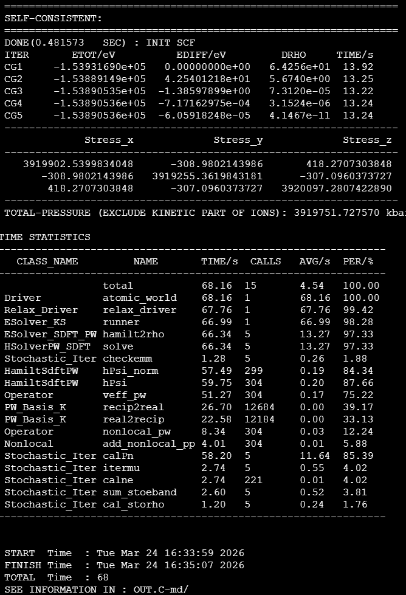

### 对照组结果：214 s

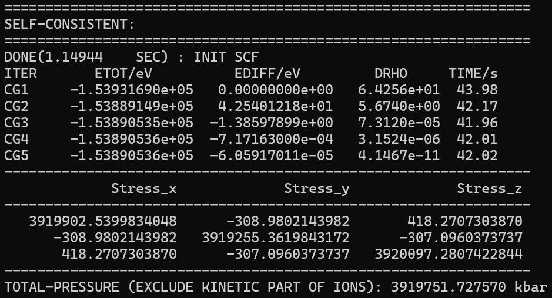

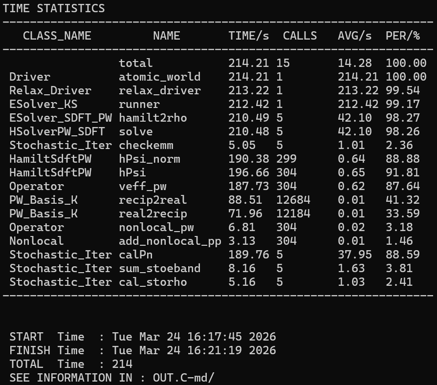

## C-mdft-8atom-172.34eV-4.1η 

920专业版测试：152进程1线程，加速6.1倍

### 920专业版结果：52 s

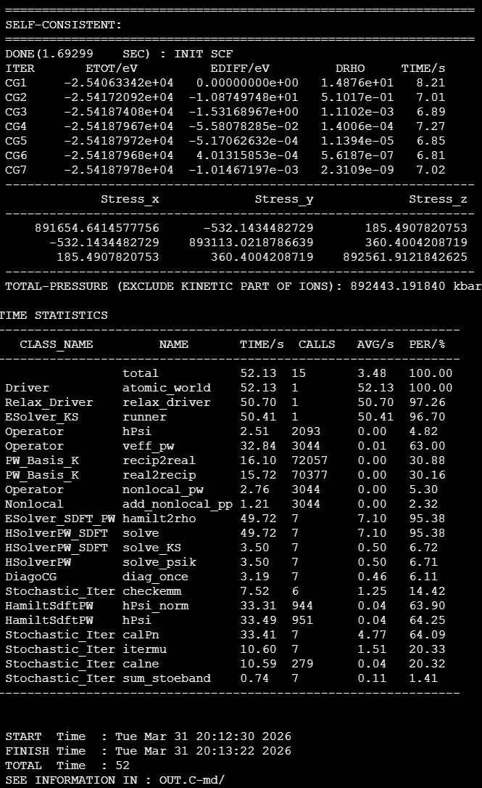

### 对照组结果： 317 s

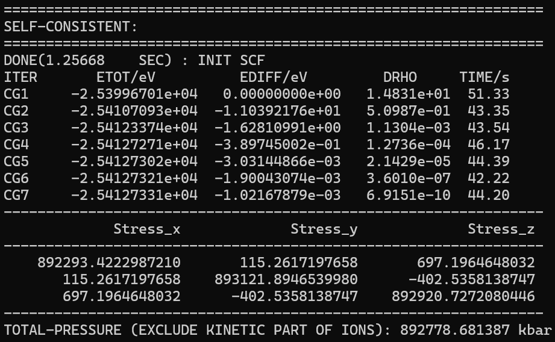

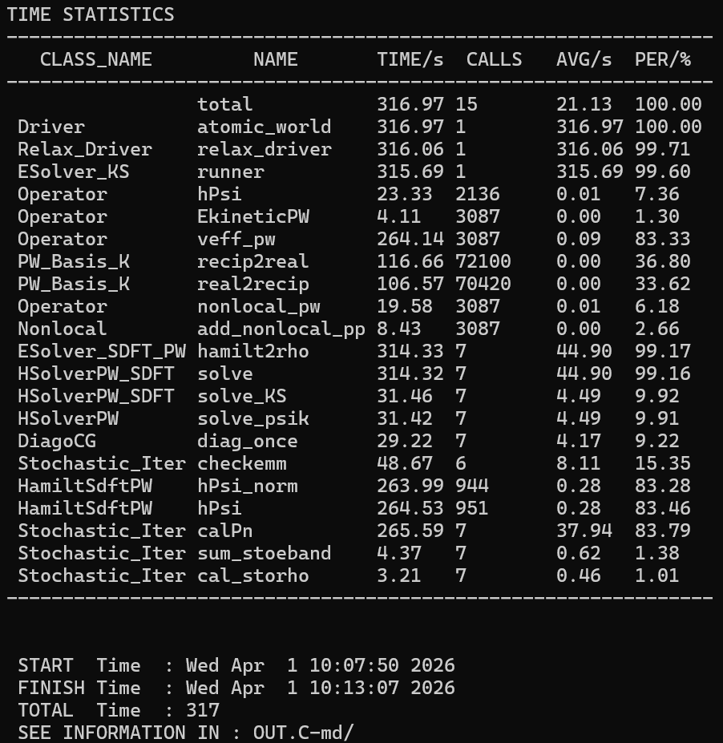

## C-sdft-8atom-700eV-3.5η 

920专业版测试结果：224进程1线程，加速19.2倍 

### 920专业版结果：11s

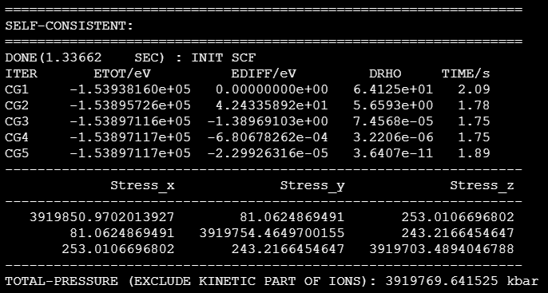

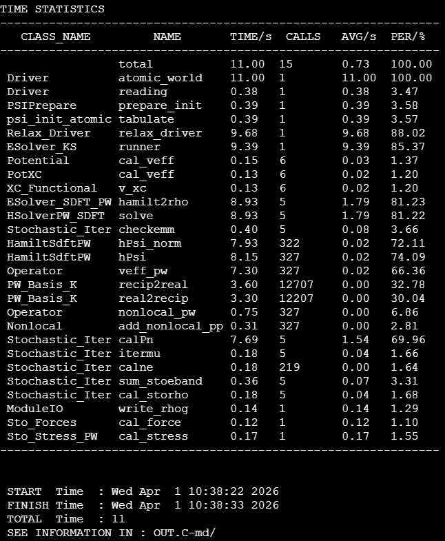

### 对照组结果：211 s

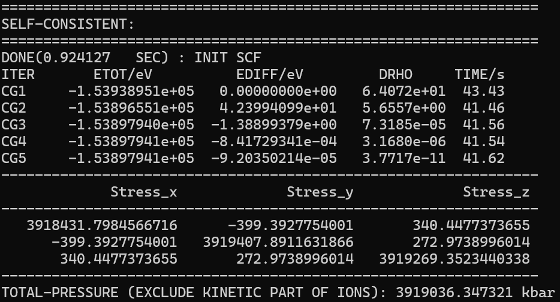

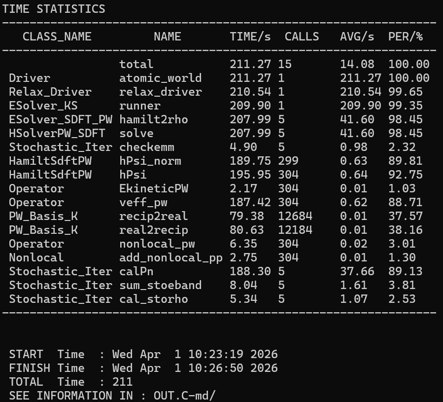


