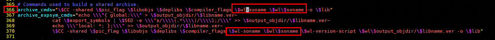
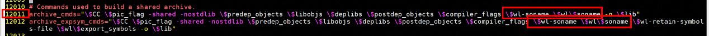
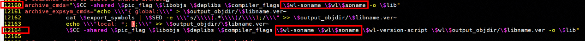
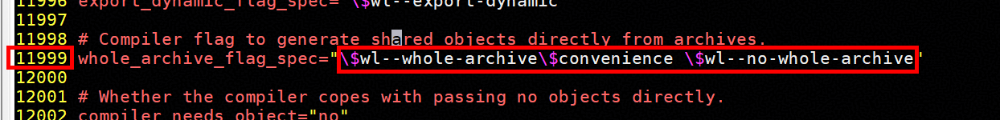

# 国产软硬件生态融合 1：ABACUS 基于华为鲲鹏 920 处理器的编译和使用指南

**作者：张笑扬，邮箱：zxypku21@stu.pku.edu.cn**

**作者：周徐源，邮箱：[xy_z@pku.edu.cn](mailto:xy_z@pku.edu.cn)**

**审核：蒋巩明，邮箱：[jianggongming@huawei.com](mailto:jianggongming@huawei.com)**

**审核：陈默涵，邮箱：[mohanchen@pku.edu.cn](mailto:mohanchen@pku.edu.cn)**

**最后更新时间：2026/05/12**

# 一、背景

在国产算力自主化与科研软件生态国产化的大背景下，国产开源第一性原理计算软件 ABACUS 与华为鲲鹏 920 的深度融合，超越了普通的软件编译与平台迁移，成为国产高端硬件与自研科研软件生态协同共建的关键抓手；鲲鹏 920 作为国产高性能 ARM 架构核心算力底座，支撑着国内高性能计算与科研集群建设，ABACUS 软件可用于材料模拟、凝聚态计算等前沿领域，二者完成编译适配并稳定运行，既能打破国外软硬件生态壁垒，也为国产算力规模化承载自主科研软件、构建完整生态闭环筑牢基础，因此梳理一套可复现、可落地的 ABACUS 鲲鹏 920 编译流程极具现实价值，本文将从环境依赖、工具链配置到源码编译与运行调优进行完整实操讲解，为科研人员和集群运维在国产软硬件平台部署使用 ABACUS 提供标准化参考。

# 二、鲲鹏 920 处理器：为科学计算而生的高性能 ARM 平台

鲲鹏 920（Kunpeng 920）是华为于 2019 年推出的数据中心高性能处理器，基于 ARMv8.2 架构，采用先进的 7nm 工艺制造。作为一款面向服务器和数据中心打造的计算芯片，鲲鹏 920 在高性能计算、大数据分析、分布式存储等场景中展现出卓越的能力。

性能表现上，鲲鹏 920 单处理器整型计算性能 SPECint Benchmark 评分超过 930，超出业界标杆 25%。处理器最高可集成 64 个物理核心，主频达 2.6 GHz，配合 8 通道 DDR4 内存控制器（速率 2933MT/s），内存带宽较上一代提升 60%。同时，处理器原生集成 PCIe 4.0（IO 带宽提升 66%）和 100GE RoCE 网络（带宽提升 4 倍），大幅降低 I/O 延迟，为数据密集型计算任务提供了充沛的吞吐能力。

生态建设上，鲲鹏计算产业经过多年发展已日趋成熟。截至 2025 年，鲲鹏已与超过 7000 家合作伙伴共同孵化 20000 余个解决方案，在中国服务器市场份额突破 22%。操作系统层面，openEuler 开源累计部署超 1260 万套；软件生态层面，主流的编译工具链（GCC/LLVM）、数学库、MPI 通信库等均已完成 ARM 架构适配与深度优化。鲲鹏提出的“一码多芯”开发模式进一步降低了跨架构迁移成本，使得科学计算软件如 ABACUS 能够在该平台上高效运行。

在这样的软硬件背景下，将 ABACUS（原子算筹）第一性原理计算软件移植编译至鲲鹏 920 平台，既能充分发挥 ARM 架构多核并行的计算潜力，又能融入日益完善的国产算力生态。本教程将详细介绍在鲲鹏 920 服务器上编译 ABACUS 的完整流程。

# 三、拉取源码

由于鲲鹏 920 系列机器不是异构平台，因此拉取 ABACUS 开源仓库里的代码，直接编译即可。

```shell
git clone https://github.com/deepmodeling/abacus-develop.git
```

如果出现连接问题，也可以直接下载代码包上传到机器解压。

完成后，进入 abacus-develop 文件夹

```shell
cd abacus-develop
```

# 四、920 标准版/920 新型号编译

使用集群的 Module 工具，加载以下模块。

```shell
module load cmake openmpi-4 scalapack fftw lapack elpa boost cereal openblas-openmp ucx
```

之后在 abacus-develop 目录下使用这个编译指令

```bash
build=build-3.9.0.XX
cmake -B $build

cmake --build $build -j24
```

注：`build=` 后面填写你想放置编译后文件的文件夹的名称

注：有可能出现库找不到的情况，这取决于 Module 是否良好配置了各种数学库的路径。你可以参考官方文档来手动配置数学库的路径（[https://abacus.deepmodeling.com/en/latest/quick_start/easy_install.html](https://abacus.deepmodeling.com/en/latest/quick_start/easy_install.html)）。例如（仅供参考）：

```bash
build=build-3.9.0.XX

export VHPC_ARCH=neon # 标准版
export VHPC_ARCH=sve # 新型号

cmake -B $build \
-DELPA_INCLUDE_DIR=/data/hpc_software/toolchain/gcc/${VHPC_ARCH}/elpa-2024/include/elpa_openmp-2024.05.001/ \
-DELPA_LINK_LIBRARIES=/data/hpc_software/toolchain/gcc/${VHPC_ARCH}/elpa-2024/lib/libelpa_openmp.so.19 \
-DCEREAL_INCLUDE_DIR=/data/hpc_software/toolchain/gcc/${VHPC_ARCH}/cereal-1.3.2/include/ \
-DFFTW3_DIR=/data/hpc_software/toolchain/gcc/${VHPC_ARCH}/fftw-3.3.10/ \
-DSCALAPACK_DIR=/data/hpc_software/toolchain/gcc/${VHPC_ARCH}/scalapack-2.2.2/lib/

cmake --build $build -j24
```

920 标准版与 920 新型号机器开箱即用，性能良好，这样就能完成安装。在 `build` 文件夹下找到 `abacus_xxxx` 可执行文件即可运行，并用于提交任务。

# 五、920 专业版编译

920 专业版使用矩阵计算单元，支持矩阵运算指令集，且可用核数众多，可以用来进行大规模并行从而获得大幅性能提升。

920 专业版需要使用华为研发的 HMPI 与 kblas。这两个替代了原本的 MPI 通信库和 BLAS 线性代数运算库，同时保持了接口一致，是鲲鹏机器生态良好的体现。可选用 GCC 或 BISHENG-CLANG 进行编译。

## A. 基于 GCC 的编译

从 Module 中加载以下数学库

```shell
module use /data/hpc_software/toolchain/common/HPCKit/25.2.0/modulefiles/gcc
module load compiler12.3.1/gccmodule hmpi25.2.0/release kml25.2.0/kblas/multi kml25.2.0/kml cmake elpa
```

如果缺少相关内容，请先检查 Module 内的软件包版本，可能会因为机器进行更新，导致对应库的版本发生了变化。或者联系管理员。

在 abacus-develop 目录下，使用以下指令安装

```bash
build=build-3.9.0.XX
CC=mpicc CXX=mpic++ F7=mpif77 FC=mpif90 cmake -B $build

cmake --build $build -j24
```

同样，如果出现数学库找不到问题，可以进行以下尝试：

1. 按照 920 标准版/新型号安装方式，Module 里加载缺少的数学库（不要加载原来的 MPI 和 OpenBLAS）
2. 手动配置数学库的位置，例如（仅供参考）：

```bash
build=build-3.9.0.XX
CC=mpicc CXX=mpic++ F7=mpif77 FC=mpif90 cmake -B $build \
    -DLAPACK_DIR=/data/hpc_software/toolchain/common/HPCKit/25.2.0/kml/gcc/lib/sve512   \
    -DSCALAPACK_DIR=/data/hpc_software/toolchain/common/HPCKit/25.2.0/kml/gcc/lib/sve512   \
    -DELPA_DIR=$ELPA_ROOT   \
    -DFFTW3_DIR=/data/hpc_software/toolchain/common/HPCKit/25.2.0/kml/gcc/lib/noarch  \
    -DFFTW3_INCLUDE_DIR=/data/hpc_software/toolchain/common/HPCKit/25.2.0/kml/gcc/include  \
    -DCEREAL_INCLUDE_DIR=/data/hpc_software/toolchain/gcc/sme/cereal/include   \
    -DCEREAL_INCLUDE_DIR=/data/hpc_software/toolchain/gcc/sme/cereal-1.3.2/include  \
    -DFFTW3_OMP_LIBRARY=/data/hpc_software/toolchain/common/HPCKit/25.2.0/kml/gcc/lib/noarch/libfftw3f.so \
    -DBLAS_LIBRARIES=/data/hpc_software/toolchain/common/HPCKit/25.2.0/kml/gcc/lib/sme/kblas/multi/libkblas.so \
    -DLAPACK_LIBRARIES=/data/hpc_software/toolchain/common/HPCKit/25.2.0/kml/gcc/lib/sve512/libklapack_full.so \
    -DScaLAPACK_LIBRARY=/data/hpc_software/toolchain/common/HPCKit/25.2.0/kml/gcc/lib/sve512/libkscalapack_full.so

cmake --build $build -j24
```

## B. 基于 BISHENG-CLANG 的编译

需要首先编译 clang 版 ELPA

```bash
git clone https://gitlab.mpcdf.mpg.de/elpa/elpa.git
cd elpa
# 如果是从 git 获取的源码，需要运行 autogen
./autogen.sh

export LD_LIBRARY_PATH=/HPCKit25.2.0/HPCKit/latest/kml/bisheng/lib/sme/kblas/multi/:$LD_LIBRARY_PATH
KML_ROOT=/HPCKit25.2.0/HPCKit/latest/kml/bisheng

export CC=mpicc
export CXX=mpicxx
export FC=mpif90
export CMAKE_C_FLAGS="-O3 -g -mcpu=hip11 -ffast-math -funroll-loops -flto"
export CMAKE_CXX_FLAGS="-O3 -g -mcpu=hip11 -ffast-math -funroll-loops -flto"
export CMAKE_FORTRAN_FLAGS="-O3 -g -mcpu=hip11 -ffast-math -funroll-loops -flto"
export CFLAGS="-O3 -g -mcpu=hip11 -ffast-math -funroll-loops -flto"
export CXXFLAGS="-O3 -g -mcpu=hip11 -ffast-math -funroll-loops -flto"
export FCFLAGS="-O3 -g -mcpu=hip11 -ffast-math -funroll-loops -flto -I${KML_ROOT}/include"
export LDFLAGS="-L${KML_ROOT}/lib/sme/kblas/multi"
export LIBS="-L/HPCKit/25.1.0/kml/bisheng/lib/sme -lkscalapack_full -lklapack_full -L/HPCKit/25.1.0/kml/bisheng/lib/sme/kblas/multi -lkblas -lkservice -lm"

./configure --prefix=/elpa-install --host=aarch64-unknown-linux-gnu --build=aarch64-unknown-linux-gnu --enable-shared --enable-openmp --disable-sse --disable-sse-assembly --disable-avx --disable-avx2 --disable-avx512
```

执行完 configure 后修改 libtool 文件内容（由于不识别 x86 参数，把所有 soname、whole-archive 相关的内容删除）：

```bash
vim libtool
```

删除内容如下：











删除后保存退出.

编译并安装。

```bash
make -j$(nproc)
make install
```

安装完成后，将 ELPA 路径添加到环境变量中

```bash
export ELPA_HOME=/elpa-install
export LD_LIBRARY_PATH=$ELPA_HOME/lib:$LD_LIBRARY_PATH
export PKG_CONFIG_PATH=$ELPA_HOME/lib/pkgconfig:$PKG_CONFIG_PATH
```

安装 ABACUS

```bash
export toolchain_root=/data/hpc_software/toolchain/bisheng/sme
export VHPC_ARCH=sme
module use /data/hpc_software/modulefiles/common
module use /data/hpc_software/modulefiles/bisheng
module use /data/hpc_software/toolchain/common/HPCKit/25.2.0/modulefiles/bisheng

module load compiler5.0.0.2/bishengmodule  hmpi25.2.0/release kml25.2.0/kblas/multi kml25.2.0/kml cmake

export CMAKE_Fortran_FLAGS="${CMAKE_Fortran_FLAGS} -w -O3 -ffast-math -std=legacy -fno-inline-functions -fstrength-reduce -fexpensive-optimizations -fall-intrinsics -flto -foptimize-loops -fveclib=KPL_SVML_SVE -fno-math-errno "
export CMAKE_C_FLAGS="${CMAKE_C_FLAGS} -w -O3 -ffast-math -Wno-implicit-function-declaration -Wno-implicit-int -Wno-return-type -lkml_rt -flto -foptimize-loops -fveclib=KPL_SVML_SVE -fno-math-errno"
export CMAKE_CXX_FLAGS="${CMAKE_C_FLAGS} -w -O3 -ffast-math -Wno-implicit-function-declaration -Wno-implicit-int -Wno-return-type -lkml_rt -flto -foptimize-loops -fveclib=KPL_SVML_SVE -fno-math-errno"
export CMAKE_EXE_LINKER_FLAGS="${CMAKE_EXE_LINKER_FLAGS} -fveclib=KPL_SVML_SVE -fno-math-errno -lm -lksvml"
export LD_LIBRARY_PATH=/data/hpc_software/toolchain/common/HPCKit/25.2.0/kml/bisheng/lib/:$LD_LIBRARY_PATH
export PATH=BiShengCompiler-5.1.0-aarch64-linux/bin/:$PATH
```

编译和安装

```bash
cmake -B build  -DCMAKE_INSTALL_PREFIX=${CWD}/bin     -DENABLE_LCAO=ON \ 
    -DENABLE_FLOAT_FFTW=ON \    
    -DFFTW3_DIR=/data/hpc_software/toolchain/common/HPCKit/25.2.0/kml/bisheng/lib/noarch \      
    -DFFTW3_OMP_LIBRARY=/data/hpc_software/toolchain/common/HPCKit/25.2.0/kml/bisheng/lib/noarch/libfftw3f_omp.so \     
    -DLAPACK_DIR=/data/hpc_software/toolchain/common/HPCKit/25.2.0/kml/bisheng/lib/sve512 \       
    -DSCALAPACK_DIR=/data/hpc_software/toolchain/common/HPCKit/25.2.0/kml/bisheng/lib/sve512 \ 
    -DBLAS_LIBRARIES=/data/hpc_software/toolchain/common/HPCKit/25.2.0/kml/bisheng/lib/sme/kblas/multi/libkblas.so \     
    -DLAPACK_LIBRARIES=/data/hpc_software/toolchain/common/HPCKit/25.2.0/kml/bisheng/lib/sve512/libklapack_full.so \     
    -DScaLAPACK_LIBRARY=/data/hpc_software/toolchain/common/HPCKit/25.2.0/kml/bisheng/lib/sve512/libkscalapack_full.so -DUSE_ELPA=ON \
cmake --build build -j$(nproc)
```

# 六、鲲鹏集群上的作业提交

920 标准版/920 新型号加载相关 Module 后直接运行即可。示例：

```
module load cmake openmpi-4 scalapack fftw lapack elpa boost cereal openblas-openmp ucx

export OMP_NUM_THREADS=4
mpirun -np 4 ~/abacus-develop-3.9.0.25/build-3.9.0.XX/abacus_2p
```

对于使用矩阵运算架构的 920 专业版，提交任务请参考以下模板（以 BISHENG-CLANG 版本为例）：

```bash
source /data/hpc_software/toolchain/setenv.sh

export VHPC_ARCH=sme

module use /data/hpc_software/modulefiles/common
module use /data/hpc_software/modulefiles/bisheng
module use /data/hpc_software/toolchain/common/HPCKit/25.2.0/modulefiles/bisheng
module load compiler5.0.0.2/bishengmodule hmpi25.2.0/release kml25.2.0/kblas/multi kml25.2.0/kml cmake 

# 如果使用GCC
module load elpa 
# 如果使用 BISHENG-CLANG
export ELPA_HOME=/elpa-install && export LD_LIBRARY_PATH=$ELPA_HOME/lib:$LD_LIBRARY_PATH && export PKG_CONFIG_PATH=$ELPA_HOME/lib/pkgconfig:$PKG_CONFIG_PATH

export OMP_NUM_THREADS=1 # 920专业版暂不建议使用OPENMP并行
mpirun --map-by ppr:38:numa:pe=1 --bind-to core -n 38 ../../develop/abacus-develop-3.9.0.25-f/build/abacus_2p
```

920 专业版一定需要绑定核心才能获得最佳速度，若未进行精细的 CPU 核心绑定，MPI 进程会在复杂的 numa 拓扑中随机分布，导致频繁的跨 numa 节点内存访问，延迟和 cache miss 升高。

如果需要跑超过 38 核心，参考以下提交模板

```bash
source /data/hpc_software/toolchain/setenv.sh

export VHPC_ARCH=sme

module use /data/hpc_software/modulefiles/common
module use /data/hpc_software/modulefiles/bisheng
module use /data/hpc_software/toolchain/common/HPCKit/25.2.0/modulefiles/bisheng
module load compiler5.0.0.2/bishengmodule hmpi25.2.0/release kml25.2.0/kblas/multi kml25.2.0/kml cmake

# 如果使用GCC
module load elpa 
# 如果使用 BISHENG-CLANG
export ELPA_HOME=/elpa-install && export LD_LIBRARY_PATH=$ELPA_HOME/lib:$LD_LIBRARY_PATH && export PKG_CONFIG_PATH=$ELPA_HOME/lib/pkgconfig:$PKG_CONFIG_PATH

export OMP_NUM_THREADS=1
mpirun --map-by numa:pe=1 --bind-to core -n 114 ../../develop/abacus-develop-3.9.0.25-f/build/abacus_2p
```

大家若有编译和使用问题，欢迎联系本文作者！

# 附录：ABACUS 相关参考资料

ABACUS 网站访问：[http://abacus.ustc.edu.cn/](http://abacus.ustc.edu.cn/)

GitHub 仓库地址为：[https://github.com/deepmodeling/abacus-develop](https://github.com/deepmodeling/abacus-develop)

Gitee 镜像仓库地址为：[https://gitee.com/deepmodeling/abacus-develop](https://gitee.com/deepmodeling/abacus-develop)

ABACUS 线上文档教程：[https://abacus.deepmodeling.com/en/latest/](https://abacus.deepmodeling.com/en/latest/)

ABACUS 线上中文教程：[https://mcresearch.github.io/abacus-user-guide/](https://mcresearch.github.io/abacus-user-guide/)

Github 仓库 Issues 区：[https://github.com/deepmodeling/abacus-develop/issues](https://github.com/deepmodeling/abacus-develop/issues)

Github 仓库讨论区：[https://github.com/deepmodeling/abacus-develop/discussions](https://github.com/deepmodeling/abacus-develop/discussions)

FAQ：[https://abacus.deepmodeling.com/en/latest/community/faq.html](https://abacus.deepmodeling.com/en/latest/community/faq.html)

ABACUS 上手教程（基于 Bohrium Notebook）：[https://nb.bohrium.dp.tech/detail/5515465115](https://nb.bohrium.dp.tech/detail/5515465115)
