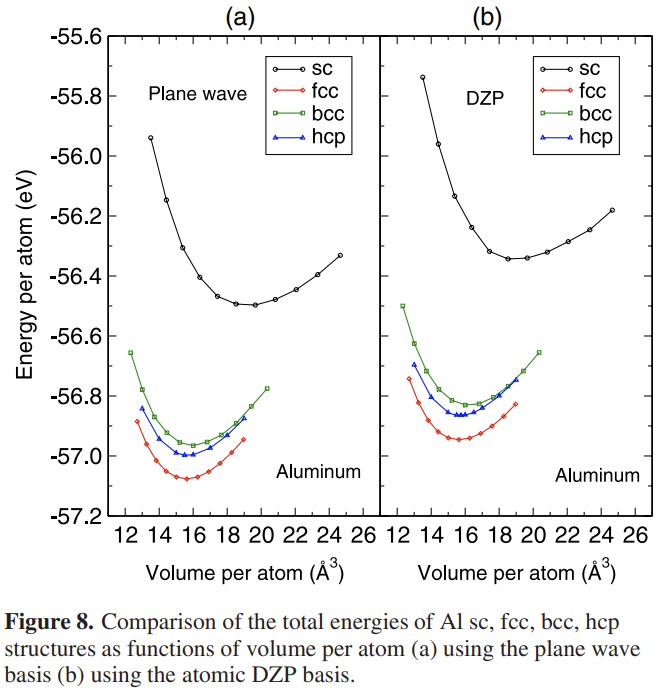

# 数值原子轨道（二）：生成给定模守恒赝势的数值原子轨道

<strong>作者：刘裕，邮箱：liuyu@stu.pku.edu.cn</strong>

<strong>审核：陈默涵，邮箱：mohanchen@pku.edu.cn</strong>

<strong>最后更新时间：2023/06/15</strong>

# 一、ABACUS 中的数值原子轨道背景知识

## 1. 数值原子轨道

- <strong>ABACUS 中的三维数值原子轨道[1]：</strong>可以分解为径向部分与角向球谐函数的乘积，即

$$
\phi_\mu(\mathbf{r})=f_{\mu, l}(\mathbf{r}) Y_{l m}(\hat{r}),$$

其中 $$\mu=\{\alpha,i,\xi,l,m\}$$，$$\alpha$$是原子种类的指标，$$i$$是每个原子种类对应的原子个数的指标，$$\xi$$是角动量$$l$$对应的径向函数的个数，$$m$$是磁量子数。

- <strong>径向部分函数：</strong>第 $$\mu$$个轨道的径向部分函数可以写为球贝塞尔函数的线性组合(可参考文献[1])

$$
f_{\mu l}(\mathbf{r})= \begin{cases}\sum_q c_{\mu q} j_l(q r), & r<r_c \\
0 & r \geqslant r_{\mathrm{c}} \end{cases},
$$

其中 $$j_l(q r)$$是波矢为$$q$$的球贝塞尔函数，$$r_c$$是径向部分的截断半径，满足关系$$j_l(q r_c)=0$$。$$q$$的个数由能量截断值决定（以下会介绍）。在实际计算里，通过用户指定每种元素的数值原子轨道截断半径和能量截断值来确定需要用到多少个球贝塞尔函数。组合系数 $$c_{\mu q}$$是可优化的量，决定了数值原子轨道的形状。

## 2. 参考体系

<strong>参考系统：</strong>在ABACUS中构造某个元素对应的数值原子轨道的最普遍方式是为每个元素选取一组参考体系做平面波计算（可以是单k点也可以是多k点），得到这些参考体系的电子波函数，然后通过最小化自定义的一个溢出函数（下面会介绍）来优化$$c_{\mu q}$$系数。换句话说，我们需要选定一组参考系统，生成数值原子轨道基组，并期望它们有良好的迁移性，以便可以在更一般的情况下使用。

<strong>Dimer（二聚体）：</strong>我们发现二聚体是较为合适的参考系统。具体来说，推荐选择的是若干个不同键长的二聚体（dimer），有时也可选择三聚体（trimer）或四聚体。对同一个元素，我们通常选择几个键长不同的二聚体（例如5-6个），这些键长覆盖二聚体稳定键长附近能量区间，通常可以取与最稳定能量差别为1-2个eV的能量曲线上的点。

<strong>周期性体系：</strong>数值原子轨道还有一些特殊用途，例如能带插值。面对这种场景，可以选择一系列带多个k点的周期性体系，此时参考态中的每个原子构型就对应了不同k点指标和不同能带指标的波函数，这些波函数会被用于最小化溢出函数来生成数值原子轨道，可以参考文献[2]。

## 3. 溢出函数

<strong>溢出函数（英文为spillage）：</strong>由给定参考体系的多个电子波函数与生成的数值原子轨道之间的差别来定义。换个角度理解，溢出函数的大小反映的是由一组“精确”波函数所张成的希尔伯特空间与局域轨道所张成的空间的差别。溢出函数定义如下：

$$
\mathcal{S}=\frac{1}{N_n} \sum_{n=1}^{N_n}\left\langle\Psi_n|1-\hat{P}| \Psi_n\right\rangle,
$$

其中$$\Psi_n$$表示平面波基组下的本征态，$$N_n$$是选定的参考电子态的个数，$$\hat{P}$$是由所有原子轨道张成的投影子

$$
\hat{P}=\sum_{\mu v}\left|\phi_\mu\right\rangle S_{\mu v}^{-1}\left\langle\phi_v\right| \text,
$$

其中$$S_{\mu v}=\left\langle\phi_\mu \mid \phi_v\right\rangle$$是局域轨道$$\phi_\mu$$与$$\phi_v$$之间的重叠矩阵，投影子用到了重叠矩阵的逆。

<strong>轨道正交：</strong>事实上，如果我们有了给定的数值原子轨道，我们可以在此基础上再次定义新的溢出函数来得到一组新的数值原子轨道，这也是为什么该算法可以系统性的增加数值原子轨道的原因。定义的方式也比较直接，可以将$$|\Psi_n\rangle$$和已有原子轨道形成的投影子$$\hat{P}$$正交，公式为

$$
|\Psi_n^{new}\rangle=（1-\hat{P}）|\Psi_n\rangle,
$$

这个公式里，左边的波函数经过正交已经不包含原子轨道的成分，这样可以再次作为新的参考体系波函数生成新的数值原子轨道，以上算法已经被实现在SIAB这个程序里。

<strong>最小化溢出函数：</strong>优化原子轨道时，最终溢出函数值定义为选定的几个二聚体的平均溢出函数值。溢出函数可以用来评估获得的原子轨道基组的质量，溢出函数越小，则原子轨道所张成的空间越接近于参考态波函数。在ABACUS中，通过最小化溢出函数的方式来优化$$c_{\mu q}$$，该系数决定了原子轨道的径向函数的形状。这种方法的好处在于

- <strong>轨道形状可调：</strong>可以由球贝塞尔函数基组的线性组合自动生成，而不需要任何先决条件，因此原则上可获得完全优化的原子轨道。

- <strong>基组数量可调：</strong>可以用统一的方式系统的增加轨道数量，包括增加径向轨道的数量（multi-ζ）和增加更高角动量的轨道（极化轨道）两种方式。为此，我们可以首先生成具有给定角动量的轨道，然后更高级的轨道可以使用相同的程序生成，但是此时只需最小化剩余的希尔伯特空间中的溢出函数，该空间与所有先前生成的原子轨道所张成的空间正交。

- <strong>参考系统可调：</strong>通过选择参考系统及对应能级，可以提高原子轨道基组在不同环境的可迁移性。例如，对于涉及到激发态能级的计算，往往需要在生成数值原子轨道的时候，考虑这组轨道对于非占据态能级的拟合能力，这个时候可以在生成参考体系的时候加入一定数量的非占据能级。

## 4. 模拟退火算法SA（Simulated Annealing）

我们首先介绍模拟退火法Simulated Annealing（SA）来最小化溢出函数[1]，从而优化球贝塞尔函数的系数$$c_{\mu q}$$。在模拟退火算法中我们用的是Metropolis的算法，需要设置一个初始温度，并且指定温度下降的方式。代码部分我们之后会介绍，这里先简要介绍一下算法。

<strong>初始系数：</strong>如果没有特别指定，一开始的系数$$c_{\mu q}$$是随机产生的， 每一步SA会更新其中一个系数，当溢出函数被改变的数值在允许接收的范围内时，参数$$c_{\mu q}$$会被更新。

<strong>优化过程：</strong>当要优化的所有轨道的所有参数$$c_{\mu q}$$都被更新过一次之后，我们称为一步优化。 我们发现大约在每个温度行走500 ~ 1000步就已经足够产生好的原子轨道。最开始的温度我们一般取为1.0e-5，事实上我们发现即便初始温度取得更小，最后的结果也是不错的。 在每一步优化之后，我们将温度乘上一个比率，来达到降温的目的从而得到新的温度，这个参数我们一般取为0.5~0.8，最后的温度一般降到1.0e-9~1.0e-12。接收的概率可以控制在0.2~0.4范围内。

<strong>能量截断值：</strong>这里的能量截断值实际上是能量截断值，我们知道每个平面波 $$e^{i\mathbf{q}\cdot\mathbf{r}}$$都对应一个二阶求导后的动能$$q^2/2$$。同样的，每个球贝塞尔函数 $$j_l(q r)$$也有一个对应的动能是 $$q^2/2$$。在平面波计算里我们通过能量截断值来控制平面波的数量，从而控制计算精度。在生成数值原子轨道的时候，我们也通过能量截断值来控制球贝塞尔函数的个数，从而控制生成的数值原子轨道的精度。

对于ABACUS的平面波计算和产生球贝塞尔函数 $$j_l(q r)$$个数的计算，我们建议采用同样的能量截断值，该截断值取得越高，基矢量个数越多同时基组也越完备。对于采用赝势的平面波计算，15~30个球贝塞尔函数已经足够得到质量比较高的数值原子轨道。

<strong>数值原子轨道的二阶可导：</strong>除了以上操作之外，还有一个需要注意到的地方。为了使数值原子轨道的动能积分是良定义的，需要使原子轨道的二阶导数连续。这可以通过将原子轨道的径向部分乘以一个平滑函数$$g(r)$$来实现

$$
g(r)=1-\exp \left[-\frac{\left(r-r_{\mathrm{c}}\right)^2}{2 \sigma^2}\right],
$$

该径向轨道会在数值原子轨道的截断值以内起作用，使其在截断值处2阶连续，超过阶段半径之后就严格截断。在我们的测试中，我们发现参数$$\sigma$$对轨道的质量影响不大，所以我们一般固定$$\sigma$$为常数0.1。

<strong>数值原子轨道动能和再次使用模拟退火算法：</strong>如果仅仅最小化溢出函数值，原子轨道的径向部分经常会出现震荡，原因是震荡有时候有利于溢出函数的值尽可能的低，但震荡厉害的函数往往动能高，可移植性较差。因此，为了去除这些实际上非物理的震荡，在算法中我们还定义了原子轨道的动能：

$$
T_{\mu}=\sum_{q} c_{\mu q}^{2} q^{2} / 2+\kappa,
$$

并再次通过模拟退火算法最小化原子轨道的动能，其中$$\kappa$$则是模拟退火的一个惩罚函数：

$$
\kappa=\left\{\begin{array}{ll}
0, & \mathcal{S} / \mathcal{S}_{0}-1<\Delta \\
\infty, & \mathcal{S} / \mathcal{S}_{0}-1>\Delta
\end{array}\right.,
$$

这里$$\mathcal{S}\_{0}$$是在优化动能之前所得到的数值原子轨道算出来的溢出函数的值，而$$\mathcal{S}$$则是当前在参数$$c_{\mu q}$$下面的溢出函数的值。我们发现参数取$$\Delta$$=0.002~0.005足够使得原子轨道平滑了。轨道动能也是通过同样的模拟退火算法得到，经过动能优化之后，轨道的形状会变平滑，同时溢出函数的值也会相比没有动能优化的轨道会有一点点增加，但是对精度的影响是很小的。

优化动能用的模拟退火算法几乎和优化溢出函数一样，除了一点点参数的区别。 目标函数选择的是所有轨道中最大的动能，而不是像溢出函数一样取平均值。对于每个轨道来说，温度是不一样的，因为每个轨道会有一个不同的动能，在这步动能优化中，我们发现结果对初始的温度不敏感，但最终达到的温度必须取得足够小。实际中我们发现只需要100~200步，动能就可以下降得很快。 所以一般来说优化动能的步数就取得比优化溢出函数要少。

# 二、ABACUS中产生数值原子轨道的具体流程

注：本文档介绍的是模拟退火算法SA，不适用于基于Pytorch的PyTorch-Gradient方法，关于这两个算法，可以参考本数值原子轨道中文文档系列的第三篇文档。

## 1. 平面波计算

<strong>简化计算量：</strong>前文我们提到的溢出函数公式，如果把投影子$$\hat{P}$$带进公式，则可以发现我们不需要在计算溢出函数的时候显示的包含任何基矢量（例如平面波）的操作。实际上，我们只需要先算好数值原子轨道$$|\phi_\mu\rangle$$和电子波函数$$|\Psi_i\rangle$$的重叠矩阵（Overlap Matrix）$$\langle \Psi_i|\phi_\mu\rangle$$并存下来，以及数值原子轨道之间的重叠矩阵$$\langle \phi_\mu|\phi_\nu\rangle$$存下来就可以算溢出函数了。更进一步，我们意识到数值原子轨道$$|\phi_\mu\rangle$$的径向部分在程序里是写成了球贝塞尔函数的线性组合，根据线性叠加的原理，我们只需要计算球贝塞尔函数和电子波函数的内积，以及球贝塞尔函数之间的内积，并把这些结果存下来，就可以优化系数$$c_{\mu q}$$了！注意这里指标$$i$$遍历体系的所有电子态，包括所有的$$k$$点以及能带对应的电子波函数。

换句话说，只需要存储线性代数里的内积结果而不是每个波函数在基矢量下的展开系数就可以优化我们想要的系数，因此数值原子轨道的优化过程可以极大提速！

<strong>采用ABACUS做平面波计算：</strong>

因此，第一步我们先调用ABACUS主程序，计算出以上overlap矩阵，首先需要准备INPUT文件如下：

```bash
INPUT_PARAMETERS
suffix              H
pseudo_dir          /home/liuyu/github/abacus-develop/tests/PP_ORB
wannier_card        INPUTw
calculation         scf
ks_solver           dav
nspin               1
lmaxmax             1

symmetry            0
nbands              10

ecutwfc             100
scf_thr             1.0e-7
scf_nmax            1000

smearing_method     gauss
smearing_sigma      0.01

mixing_type         pulay
mixing_beta         0.4
mixing_ndim         8
printe              1

bessel_nao_ecut     100    // same as ecutwfc
bessel_nao_rcut     6      // rcut
```
如上所示，该INPUT与平常的平面波计算相比，只有3个参数（已标红）需要注意：

- wannier_card：指定wannier相关参数的输入文件名INPUTw

- bessel_nao_ecut：球贝塞尔函数的截断能，根据公式$$\sqrt{E_{cut}} \times r_{cut} / \pi$$来决定求贝塞尔函数的数量

- bessel_nao_rcut：数值原子轨道的截断半径$$r_{cut}$$

此外，我们还需要准备输入文件 INPUTw 如下（将来计划会把 INPUTw 文件去掉，把参数加入 INPUT 里）：

```bash
WANNIER_PARAMETERS
out_spillage 2           // output overlap
spillage_outdir OUT.H    // could be the same as OUT.${suffix}
```

通过 ABACUS 做平面波基矢量计算可以计算出：

1）电子波函数$$|\Psi_i\rangle$$和球贝塞尔函数 $$j_l(q r)$$之间的 overlap$$\langle \Psi_i|j_l(q r)\rangle$$；

2）球贝塞尔函数之间的 overlap$$\langle j_{l_2}(q_2 r)|j_{l_1}(q_1 r)\rangle$$；

3）电子波函数$$|\Psi_i\rangle$$之间的 overlap$$\langle \Psi_i|\Psi_i\rangle$$。

这些输出将存在文件 `OUT.${suffix}/orb_matrix.0.dat` 中，而这个文件将被读入进行数值原子轨道的生成。

## 2. 编译 SIAB

SIAB 的全称是 Systematically Improvable Atomic orbital Basis generator based on spillage formula，目前是包含在 ABACUS 软件里的一个独立程序，可用来读入以上 ABACUS 产生的数据文件并且生成数值原子轨道，具体编译方法如下：

1. 拉取 deepmodeling/abacus-develop 仓库（github 和 gitee 二选一即可，国内建议用 gitee）

```shell
# github仓库
$ git clone -b develop https://github.com/deepmodeling/abacus-develop.git

# gitee仓库
$ git clone -b develop https://gitee.com/deepmodeling/abacus-develop.git
```

2. 编译 SIAB

模拟退火（SA）方法生成数值原子轨道的代码在 SIAB 文件夹里，采用 C++ 编写，目前 Makefile 仅支持 intel 编译器。

SIAB 程序有串行（make s）和并行（make p）两种版本，一般情况下串行版本即可满足使用需求。

```shell
$ cd abacus-develop/tools/SIAB/SimulatedAnnealing/source
$ make clean
$ make s
```

编译成功后，在目录 `abacus-develop/tools/SIAB/SimulatedAnnealing/source` 下可以看到生成数值原子轨道的可执行程序 `SIA_s.exe`，这里 s 代表编译串行版(serial)。此外，对于并行版本，SIAB 还可以结合 MPI 编译并行版，通过命令 `make p` 指令得到 `SIA_p.exe` 可执行程序，这里 p 代表 parallel，但注意并行版只对某些特定算法进行并行，之后对代码进行一个更好整理之后我们会给出并行版的教程。

## 3. 运行例子

进入 `tests_s` 目录，可以看到 `H-6-0.6.15.dat` 文件，这是用来生成数值原子轨道所需要准备的输入文件，从 ABACUS 的平面波自洽迭代计算后获得，现在该文件已经改名为 `OUT.${suffix}/orb_matrix.0.dat`。

此外，还有一个输入文件 `INPUT` 如下：

```xml
<PW_QS>
1               // bool: calculate the spillage. 1/0
0               // bool: restart or not. 1/0
1               // bool: output the file. 1/0
1               // integer: number of structures.
H-6-0.6.15.dat  // Each structure's file name occupies one line
</PW_QS>

<PARALLEL>
1               // integer: number of k points (for parallel version)
1               // integer: number of pools (for parallel version)
</PARALLEL>

<BLOCK_NE>
15              // can be ignored now
</BLOCK_NE>

<SCHEME_VALUE>
2               // The way to calculate spillage, 2 means averaged spillage 
<SCHEME_VALUE>

<METROPOLIS>
1.0e-8          // real: start temperature for minimizing spillage
0.5             // real: cooling rate for the temperature in minimizing spillage
2               // integer: number of temperatures (spillage)
500             // integer: number of steps per temperature (spillage)

1.0e-2          // real: starting temperature for the kinetic energy
0.8             // real: cooling rate for temperature in minimizing kinetic energy
1               // integer: number of temperatures (kinetic)
100             // integer: number of steps per temperature (kinetic)

0.05            // real: delta kappa for kinetic energy
49              // integer: selectly output information every n steps

100             // integer: change accept rate every n steps, can be ignored now
0.4             // real: acceptance rate (high), can be ignored now
0.2             // real: acceptance rate (low), can be ignored now

50              // real: max allowed kinetic energy (Rydberg)
0.01            // real: 'dr' for the 1d r grid to compute kinetic energy
1               // integer: 1: Kin 2: Ecut, can be ignored now
</METROPOLIS>

<BANDS>
1               // bool: to control the number of bands
1               // int, the start band index(>0).
1               // int, the end band index(<provied bands).
<BANDS>

<OPTIMIZE>
2               // Number of levels.
# label / na / skip / lmax / each L /
01 2 new 1 1 1
01 2 new 1 1 1
01 2 new 1 1 1
</OPTIMIZE>

<PLOT>
0.01    //dr(a.u.) of uniform mesh. Attention!!dr will affect kinetic energy minmized largely.
-6      //xmin
1       //zed, chosen as valence charge.
0.01    //dx
6.0     //xmax
</PLOT>

<CAL_C4>
0       // print out the C4, this section can be ignored now
2
./FILE/Si-S.ORBITAL
0
./FILE/Si-P.ORBITAL
1
</CAL_C4>

<TEST>
0                       // for tests, can be ignored now
14.0                    // rcut, only useful for test program
0.01                    // dr, for simpson integral
2                       // test eigenvalue index
2                       // lmax
</TEST>
```

`C4`：代表 4 个重要参数：$$\alpha,\xi,l,nq$$，$$\alpha$$是原子种类的指标，$$\xi$$是角动量$$l$$对应的径向函数的个数，$$nq$$ 是对应的球贝塞尔函数的个数。

该输入文件包含 SIAB 程序需要读取的一系列参数，基本上重要参数的说明都有列上去，一些可忽略的参数可以先不用设置，之后我们会推出更详细的关于此输入文件的说明文档。

准备好该输入文件后，可以通过如下命令执行 SIAB 程序：

```bash
$ ~/abacus-develop/tools/SIAB/SimulatedAnnealing/source/SIA_s.exe
```

运行完毕后，可以得到一系列输出文件，其中 `ORBITAL_1U.dat` 则是我们需要的数值原子轨道文件。我们可以通过文件的前几行获取关键信息：这是 H 原子的轨道文件，平面波截断能为 100 Ry，截断半径为 6 Bohr，最大角动量为 1，角动量 s 和 p 的径向函数的个数都为 2，即 2 条 s 轨道和 6 条 p 轨道，共 8 条轨道。为了体现这些关键信息，在使用轨道的时候我们建议重命名该文件为 `H_gga_100Ry_6au_2s2p.orb`。

```bash
---------------------------------------------------------------------------
Element                     H
Energy Cutoff(Ry)          100
Radius Cutoff(a.u.)         6
Lmax                        1
Number of Sorbital-->       2
Number of Porbital-->       2
---------------------------------------------------------------------------
SUMMARY  END
```

# 三、ABACUS 中数值原子轨道的生成脚本

我们需要采用平面波计算不同键长的二聚体，并且存在不同层级的轨道，因此也可以通过一个脚本来实现自动化整个流程：`abacus-develop/tools/SIAB/Generate_Orbital_AllInOne.sh`。该脚本需要读入一个输入文件 `ORBITAL_INPUT` 如下：

```bash
#1.exe_dir
#--------------------------------------------------------------------------------
EXE_mpi       mpirun -np 4

EXE_pw        /home/liuyu/github/abacus-develop/build/abacus

EXE_orbital   /home/liuyu/github/abacus-develop/tools/SIAB/SimulatedAnnealing/source/SIA_s.exe

#--------------------------------------------------------------------------------
#( In this part, the direction of the two used exe is provided )

#2.electronic calculatation
#-------------------------------------------------------------------------------- 

targets     14_Si_60   # element
ref_bands   4   6      # reference bands
nbands      8   12     # num of bands for calculate
Ecut        60         # cutoff energy (in Ry)
Rcut        6   7      # cutoff radius (in a.u.)
Pseudo_dir  /home/liuyu/github/abacus-develop/tests/PP_ORB
Pseudo      Si_ONCV_PBE-1.0.upf
smearing_sigma       0.01          # energy range for gauss smearing (in Ry) 
#--------------------------------------------------------------------------------
#( In this part , some parameters of calculating are given )

#3.structure information
#--------------------------------------------------------------------------------
#the Bond Length list for each STRU
BLSTRU1    1.8 2.0
BLSTRU2    2.4
# if skip the orbital optimization for each STRU (1:skip, 0:not skip).
SkipSTRU   0   0
# set the objective structure list to fit for orbital optimization
ListSTRU   dimer    trimer
#-------------------------------------------------------------------------------- 
#(In this part, it gives us the bond length of the reference system(in angstrom) )

#4.orbital calculatation 
#--------------------------------------------------------------------------------

maxL       2     # the max angular momentum
Level      2  3  # num of levels to generate orbitals(<=5)
#(num)  (the max ang) (num of S) (num of P) (num of D) (num of F) (num of G)
level1     1    1    1
level2     2    1    1    1  
level3     2    1    1    1  
#--------------------------------------------------------------------------------
#( In this part, some information of orbital is given )

#5.Metropolis parameters (in most cases do not need to change)
#--------------------------------------------------------------------------------
Start_tem_S  1.0e-3  # start temperature for optimize Spillage (default 1.0e-4)
Start_tem_K  1.0e-1  # start temperature for optimize Kinetic  (default 1.0e-2)
Step_S       20      # num of steps for optimize Spillage (default 20) 
Step_K       10     # num of steps for optimize Kinetic  (default 15)
Delta_kappa  0.01    # delta kappa (default 0.01)
#--------------------------------------------------------------------------------
#( In this part , some parameters of Metropolis is given. In most cases , they
#do not need to be changed , only when you run into a situation , that the
#Kinnetic energy is larger than the  maximum value allowed , you can enlarge 
#the start temperature appropritely , or you can enlarge the delta_kappa, e.g. 
#start_tem_k 1.0e-2 to 5.0e-1, delta_kappa 0.01 to 0.02. more steps can make 
#the orbitals better , too)
```

该输入文件主要分为 5 个部分：

## 1. exe_dir

- EXE_mpi：MPI 并行计算命令，这里我们采用的是 4 核 MPI 并行进行 dimer（或者 trimer）的平面波计算。
- EXE_pw：ABACUS 可执行程序的绝对路径。
- EXE_orbital：数值原子轨道生成程序 SIA_s.exe 的绝对路径。

## 2. electronic calculatation

- targets：可以任取，一般格式是\${原子序数}\_\${元素名}\_\${截断能}。
- ref_bands：参考体系的能带数，取值为电子总数的一半。注意这里有多个取值，原因是我们选择了多组参考构型，既有 dimer，也有 trimer。
- nbands：平面波计算中的实际能带数，必须大于 ref_bands，以保证包含非占据态。同理，由于多组参考构型，nbands 也有多个取值。
- Ecut：平面波截断能，单位为 Ry。
- Rcut：数值原子轨道的截断半径，单位为 Bohr。这里的多个取值表明，采用相同的一套参数，生成多个不同截断半径的数值原子轨道文件，根据第一部分的基础知识，截断半径会极大地影响数值原子轨道的质量，因此该参数可以帮助我们一次性生成多个不同截断半径的数值原子轨道文件。
- Pseudo_dir：平面波计算采用的赝势文件所在文件夹的绝对路径。
- Pseudo：平面波计算采用的赝势文件名。
- smearing_sigma：平面波计算采用 Gaussian smearing 的展宽，单位为 Ry，一般取 0.01 即可。

## 3. structure information

- BLSTRU1：第一组参考构型的键长，单位为埃。如上所示，第一组参考构型包含两个构型，键长分别为 1.8 和 2.0 埃。
- BLSTRU2：第二组参考构型的键长，单位为埃。如上所示，第二组参考构型包含一个构型，键长为 2.4 埃。
- 以此类推，可以存在 BLSTRU3、BLSTRU4 等等。
- SkipSTRU：是否跳过该组参考构型的优化，一般而言，都取为 0 即可。
- ListSTRU：指定 BLSTRU1、BLSTRU2 等等参考体系的具体构型，这里说明 BLSTRU1 是 dimer，BLSTRU2 是 trimer。如果取值缺省（第一个不可缺省），则默认为 dimer。

## 4. orbital calculatation

- maxL：最大角动量。
- Level1：根据上文可知，轨道可以分为多个层级，这里 level1 是 SZ 层级，最大角动量为 1，角动量 s 和 p 的径向函数的个数为 1 和 1，即 1 条 s 轨道和 3 条 p 轨道。
- Level2：同上，这里 level2 的最大角动量为 2，角动量 s，p 和 d 的径向函数的个数为 1，1 和 1，即 1 条 s 轨道，3 条 p 轨道和 5 条 d 轨道。level1 和 level2 合在一起，是 DZP 层级。
- Level3：同 Level2。
- Level：BLSTRU1 和 BLSTRU2 分别负责一部分轨道的生成，Level 的 2 个取值对应的是 BLSTRU1 和 BLSTRU2 的 endlevel，即 BLSTRU1 用于 level1 和 level2 轨道的生成，BLSTRU2 用于 level3 轨道的生成。

## 5. Metropolis parameters

如注释所说，这部分参数实际上大多数情况下不需要改变。

- Start_tem_S：优化 Spillage 的初始温度，更高的初始温度可以搜索更大的温度范围。
- Start_tem_K：优化动能的初始温度，更高的初始温度可以搜索更大的温度范围。
- Step_S：优化 Spillage 的步数。
- Step_K：优化动能的步数。
- Delta_kappa：模拟退火的惩罚函数$$\kappa$$所用的参数$$\Delta$$。

准备好以上输入文件后，通过以下命令即可开始生成轨道：

```bash
$ ~/abacus-develop/tools/SIAB/Generate_Orbital_AllInOne.sh ORBITAL_INPUT
```

# 四、ABACUS 中数值原子轨道的测试流程

在生成轨道之后，为了保证基于数值原子轨道基组的第一性原理计算拥有与平面波基组相当的精度，我们需要针对该元素的一些常见的晶体结构做一些验证性计算。

以 Al 元素为例，我们可以选择 simple cubic（sc），body center cubic（bcc），face center cubic（fcc）和 hexagonal close-packed（hcp）这 4 种常见的晶体结构，采用平面波（Plane wave）基组和数值原子轨道基组计算这些晶体结构的平衡晶格常数、体弹性模量等基态性质，评估两种基组之间的误差随着截断半径、最大角动量以及轨道数量的收敛趋势，选择合适的数值原子轨道文件。例如以下就是用 ABACUS 的平面波和数值原子轨道 DZP 计算的铝的四种体相材料的体积-能量曲线，来自文献[1]。从图中可以看到，DZP 轨道描述不同体相的铝的相对能量还是精度较高的。细心的读者会发现纵坐标给出的是绝对能量，因为两种基矢量采用了相同的赝势，但左图给出的能量更低，这是因为平面波更加完备，所以根据 Honhenberg-Kohn 定理，体系总能量的密度泛函可以在更完备的基矢量下得到更好的收敛，即总能量更低。一般来说，平面波得到的总能量比 DZP 轨道小一些，大概在 0.1-0.2 eV/atom，是比较合理的。如果采用了同样的赝势，但两种基矢量给出的能量差别远远大于这个数值，则要检查一下是不是数值原子轨道产生出了问题。最后，大家有任何问题，欢迎写邮件到文档开头邮箱。



# 五、参考文献

[1]   M. Chen, G.-C. Guo, and L. He, <em>Systematically Improvable Optimized Atomic Basis Sets for </em><em>Ab Initio</em><em> Calculations</em>, J. Phys.: Condens. Matter <strong>22</strong>, 445501 (2010).

[2]   M. Chen, G.-C. Guo, and L. He, <em>Electronic Structure </em><em>Interpolation</em><em> via Atomic Orbitals</em>, J. Phys.: Condens. Matter <strong>23</strong>, 325501 (2011).
