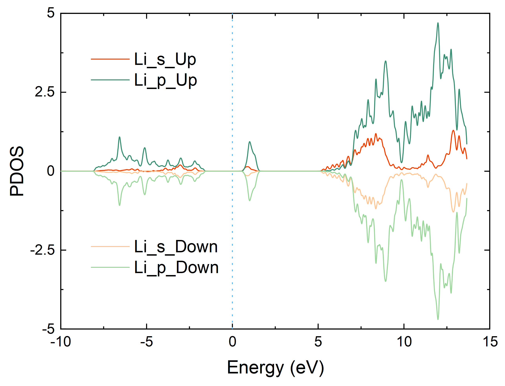
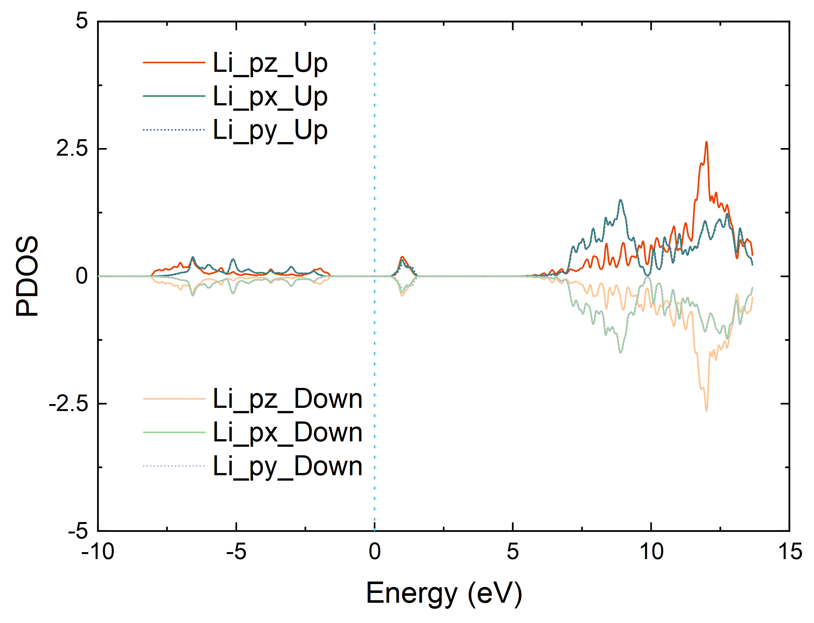

# ABACUS 计算 PDOS

<strong>作者：陈涛，邮箱：chentao@stu.pku.edu.cn</strong>

<strong>审核：陈默涵，邮箱：mohanchen@pku.edu.cn</strong>

<strong>最后更新时间：2024/10/12</strong>

# 一、PDOS 文件分析

ABACUS 使用 LCAO 基组进行自洽迭代场计算（Self-Consistent Field，SCF）或 NSCF（Non-Self-Consistent Field，NSCF）计算时，可以在 `INPUT` 文件里设置 `out_dos` 为 2 在输出 DOS（Density Of States）的同时输出 PDOS（Partial DOS），PDOS 的文件格式是 xml，其文件内容在英文文档里有介绍：[Calculating DOS and PDOS — ABACUS documentation](https://abacus.deepmodeling.com/en/latest/advanced/elec_properties/dos.html#pdos)

下面简单介绍一下 PDOS 文件：

## 1. 能量范围（横坐标）

1. 第一行 `<pdos>` 代表输出为 pdos，PDOS 文件最后一行会有 `</pdos>` 代表 pdos 内容结束
2. 第二行的 `2` 表示自旋极化计算（npsin=2）
3. 第三行表示该 `PDOS` 文件一共有 720 个不同的轨道，不同轨道的内容会在后面介绍
4. 第四行 `<energy_values units="eV">` 到 `</energy_values>` 中的内容代表 pdos 的能量范围，即横坐标值

```xml
<pdos>
<nspin>2</nspin>
<norbitals>720</norbitals>
<energy_values units="eV">
0.00000
0.01000
0.02000
0.03000
0.04000
0.05000
......
24.96000
24.97000
24.98000
24.99000
25.00000
</energy_values>
......
</pdos>
```

## 2. 不同轨道的 DOS

1. `<orbital>` 中 `index="1"` 表示第"1"条轨道，`atom_index="1"` 表示第"1"个原子，`species="Li"` 表示元素为"Li"
2. l="0"，m="0"，z="1"分别代表角量子数为"0"，磁量子数为"0"，每个角量子数上对应的径向轨道为"1"
   例如 Li 在标准原子轨道库里是 DZP，具体轨道为 4s1p，如下表所示共 7 个：4 个 s 轨道（分别对应 z 取 1 到 4；l 取 0；m 取 0 到 2l，即 0），3 个 p 轨道（对应 z 取 1；l 取 1；m 取 0 到 2l，即 0，1，2），更具体的介绍可以参考[数值原子轨道基组的个数](https://mcresearch.github.io/abacus-user-guide/abacus-nac1.html#3-%E6%95%B0%E5%80%BC%E5%8E%9F%E5%AD%90%E8%BD%A8%E9%81%93%E5%9F%BA%E7%BB%84%E7%9A%84%E4%B8%AA%E6%95%B0)
3. `<data>`到`</data>`中的内容代表该轨道的 dos，两列分别对应 spin 为上和下的 dos

| Li | s |   |   |   | p |   |   |
| -- | - | - | - | - | - | - | - |
| l  | 0 | 0 | 0 | 0 | 1 | 1 | 1 |
| m  | 0 | 0 | 0 | 0 | 0 | 1 | 2 |
| z  | 1 | 2 | 3 | 4 | 1 | 1 | 1 |

```xml
<orbital
index="1"
atom_index="1"
species="Li"
l="0"
m="0"
z="1"
>
<data>
0.00000000    0.00000000
0.00000000    0.00000000
0.00000000    0.00000000
0.00000000    0.00000000
0.00000000    0.00000000
......
0.02085550    0.02085546
0.01939430    0.01939436
0.01791958    0.01791972
0.01638296    0.01638315
0.01475548    0.01475571
</data>
</orbital>
```

# 二、绘制 PDOS

有三种方式，分别对应 `species`, `atom_index`, `index`

## 1. `species`

- 提取指定元素的 PDOS，会在 `PDOS_FILE` 下生成 `species-*.dat` 文件，其中 `*` 代表指定的元素，第一列为横坐标能量范围，第二列到最后一列分别为不同 spin 的 pdos

```python
species: [species_1, species_2, species_3, ...]
# eg: 
# species : ["Li", "Co", "O"]
```


- 提取指定元素的不同 l（s:0, p:1, d:2, f:3, ......）的 PDOS，会在 `PDOS_FILE` 下生成 `species-*` 文件夹，每个文件夹下生成 `species-*_l.dat` 文件，其中 `*` 代表指定的元素，第一列为横坐标能量范围，第二列到最后一列分别为不同 spin 的 pdos

```python
species : { species_1: [s, p, d], species_2: [s, p], ... }
# eg: 
# species : {"Li": [0, 1], "Co": [0, 1, 2, 3], "O": [0, 1, 2]}
```



- 提取指定元素的不同 l 和 m（m:0, 1, ..., 2l）的 PDOS，会在 `PDOS_FILE` 下生成 `species-*` 文件夹，每个文件夹下生成 `species-*_l_m.dat` 文件，其中 `*` 代表指定的元素，第一列为横坐标能量范围，第二列到最后一列分别为不同 spin 的 pdos

```python
species : { species_1: { s: [m_0], p: [m_0, m_1] }, species_2: { s: [m_0], p: [m_0, m_1], ... }}
# eg: 
# species : {"Li": { 0: [0],  1: [0, 1, 2] }, "Co": { 0: [0],  1: [0, 1, 2], 2: [0, 1, 2, 3, 4], 3: [0, 1, 2, 3, 4, 5, 6] }, "O": { 0: [0],  1: [0, 1, 2], 2: [0, 1, 2, 3, 4] }}
```



## 2. `atom_index`

- 提取指定原子的 PDOS，会在 `PDOS_FILE` 下生成 `atom_index-*.dat` 文件，其中 `*` 代表指定的原子，第一列为横坐标能量范围，第二列到最后一列分别为不同 spin 的 pdos

```python
atom_index : {atom_index_1, atom_index_2, atom_index_3, ...}
# eg: 
# atom_index : {1, 2, 3, 16, 32}
```

- 提取指定原子的不同 l（s:0, p:1, d:2, f:3, ......）的 PDOS，会在 `PDOS_FILE` 下生成 `atom_index-*` 文件夹，每个文件夹下生成 `atom_index-*_l.dat` 文件，其中 `*` 代表指定的元素，第一列为横坐标能量范围，第二列到最后一列分别为不同 spin 的 pdos

```python
atom_index : { atom_index_1: [s, p, d], atom_index_2: [s, p], ... }
# eg: 
# atom_index : {1: [0, 1], 17: [0, 1, 2, 3], 34: [0, 1, 2]}
```

- 提取指定原子的不同 l 和 m（m:0, 1, ..., 2l）的 PDOS，会在 `PDOS_FILE` 下生成 `atom_index-*` 文件夹，每个文件夹下生成 `atom_index-*_l_m.dat` 文件，其中 `*` 代表指定的元素，第一列为横坐标能量范围，第二列到最后一列分别为不同 spin 的 pdos

```python
atom_index : { atom_index_1: { s: [m_0], p: [m_0, m_1] }, atom_index_2: { s: [m_0], p: [m_0, m_1], ... }}
# eg: 
# atom_index : {1: { 0: [0],  1: [0, 1, 2] }, 17: { 0: [0],  1: [0, 1, 2], 2: [0, 1, 2, 3, 4], 3: [0, 1, 2, 3, 4, 5, 6] }, 34: { 0: [0],  1: [0, 1, 2], 2: [0, 1, 2, 3, 4] }}
```

## 3.  `index`

- 提取指定原子轨道对应的 PDOS，会在 `PDOS_FILE` 下生成 `index-*.dat` 文件，其中 `*` 代表指定的原子，第一列为横坐标能量范围，第二列到最后一列分别为不同 spin 的 pdos

```python
index : {index_1, index_2, index_3, ...}
# eg:
# index : {1, 2, 3, 4}
```

# 三、绘制 PDOS 的流程

[https://github.com/deepmodeling/abacus-develop/tree/develop/tools/plot-tools](https://github.com/deepmodeling/abacus-develop/tree/develop/tools/plot-tools)

使用 abacus-plot 程序可以绘制 PDOS，具体步骤如下：

## 1. 安装 `abacus-plot`

```bash
cd /path_to_abacus/tools/plot-tools
python setup.py install
```

## 2. 准备输入文件 `config.json`

```json
{
    "pdosfile": "PDOS",
    "efermi": 6.585653952007503,
    "species" : ["Li", "Co", "O"]
}
```

- `pdosfile`：实际 `PDOS` 文件的路径（相对路径和绝对路径均可）
- `efermi`：费米能，单位是 eV，可以在输出文件 `running_scf.log` 里得到（关键字：EFERMI）
- `species`：对应第二节介绍的三种输出模式参数

## 3. 运行 `abacus-plot` 输出 PDOS

```bash
abacus-plot -d -o
```