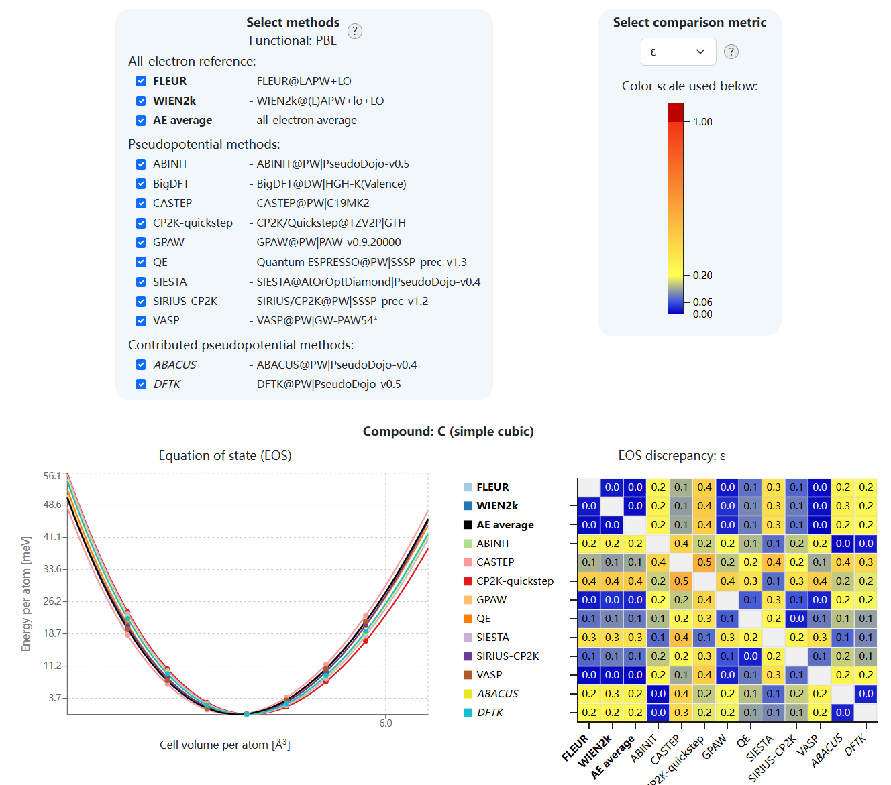
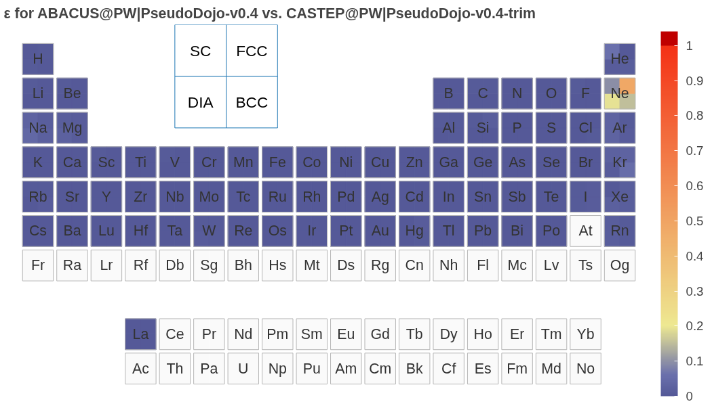
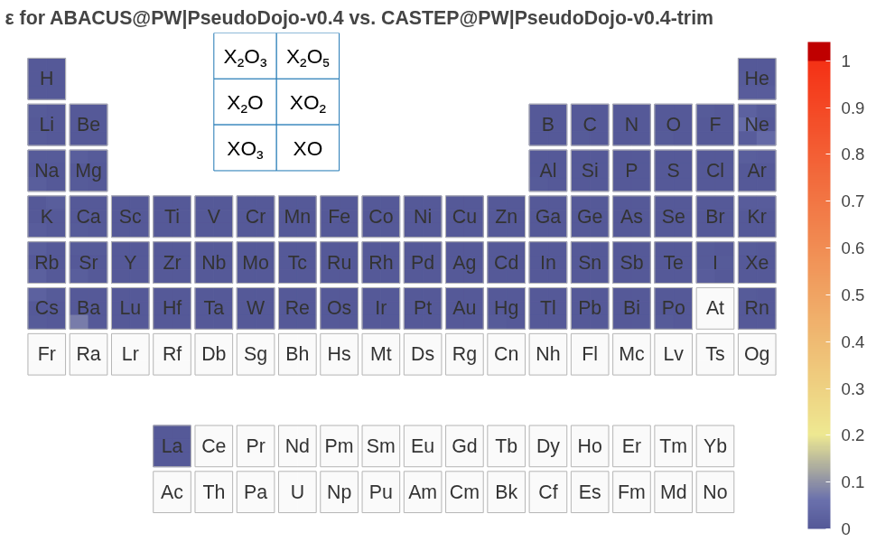
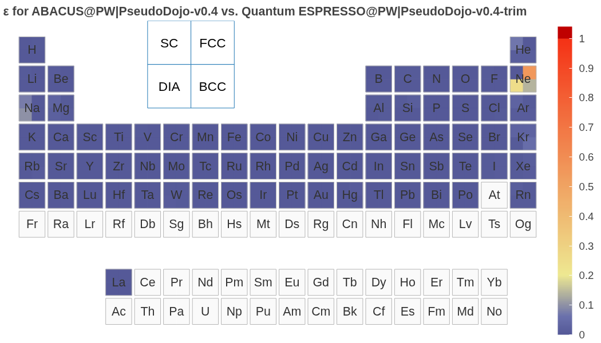
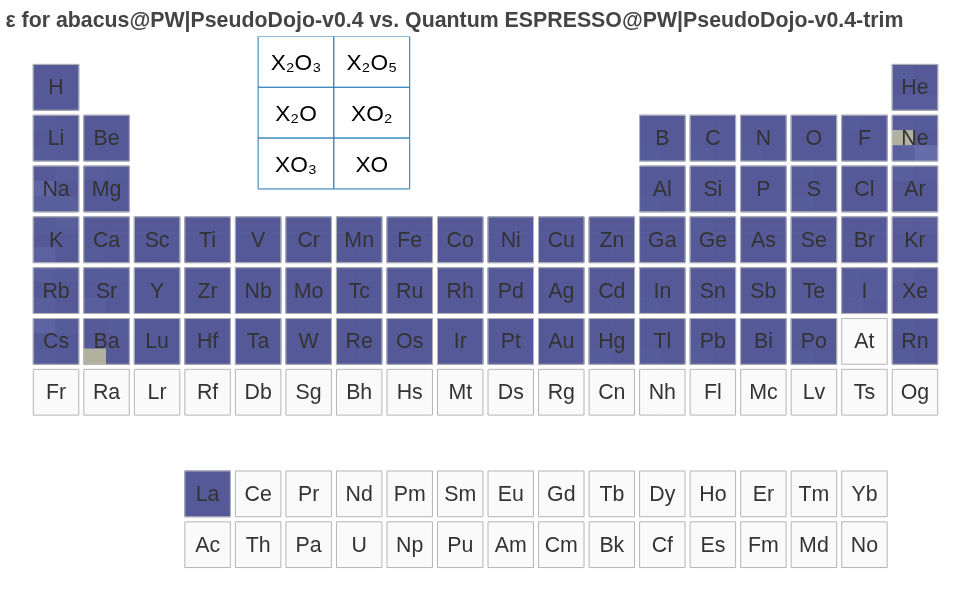
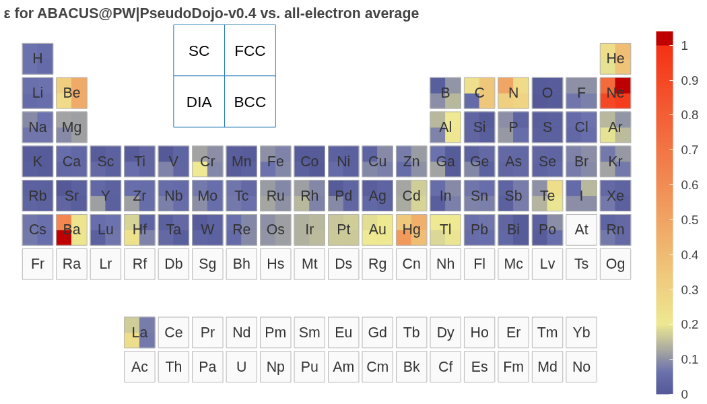
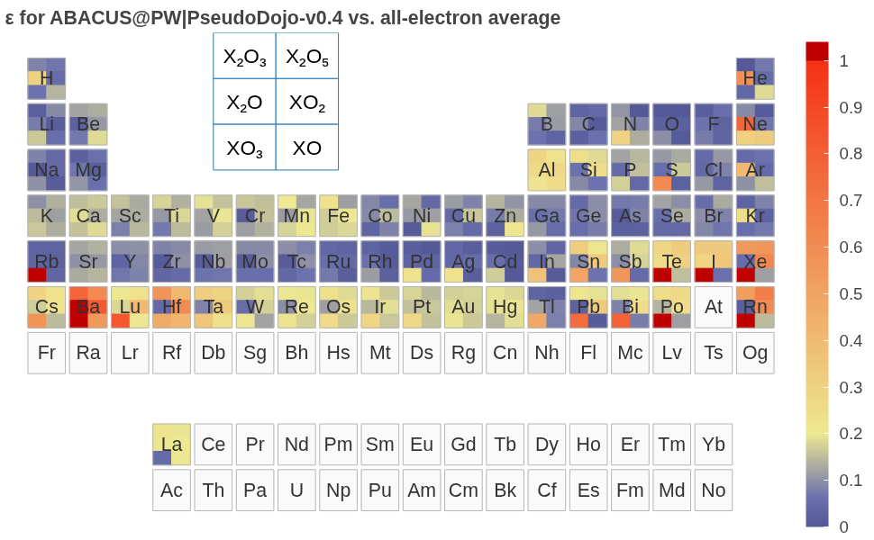
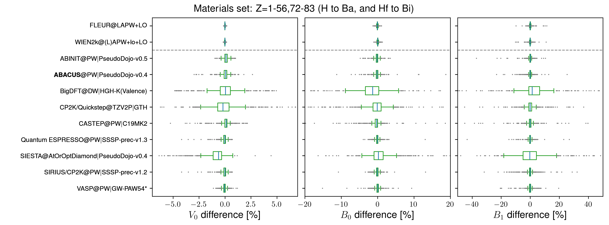

# 国际开放云平台 Materials Cloud 上线 ABACUS 软件精度验证结果

**作者：陈诺，邮箱：chennuo@stu.pku.edu.cn**

**审核：朱博南，邮箱：bzhu@bit.edu.cn**

**审核：陈默涵，邮箱：mohanchen@pku.edu.cn**

**最后更新时间：2026/03/05**

Materials Cloud（[https://www.materialscloud.org/](https://www.materialscloud.org/)）是计算材料科学领域最具影响力的数据共享平台之一，依托瑞士国家科学基金会（SNSF）MARVEL 国家研究能力中心和欧盟 Horizon 2020 MaX 卓越中心建设，自 2015 年逐步成型以来，已成为国际第一性原理计算领域的重要基础设施。Materials Cloud 致力于实现计算材料科学领域资源无缝共享和传播，促进计算数据和工具的共享与可重复性，遵循 FAIR 原则（可查找、可访问、可互操作、可重用），使用户能够全面分享科学成果，包括整个工作流和溯源图，而不仅仅是单独的输入和输出文件，且数据可下载、可浏览、可重新利用。平台设立了密度泛函理论（Density Functional Theory，DFT）实现精度系统性验证项目（[https://acwf-verification.materialscloud.org/](https://acwf-verification.materialscloud.org/)），基于 AiiDA 通用计算工作流（AiiDA Common Workflows, ACWF，[https://aiida-common-workflows.readthedocs.io/en/latest/](https://aiida-common-workflows.readthedocs.io/en/latest/)）框架，旨在为不同 DFT 代码建立一个可复现的对比基准。此前已收集了 CASTEP、SIESTA、Quantum ESPRESSO、VASP、WIEN2k 等国际主流软件的对比数据，但缺少国内软件的身影。

为填补这一空白，ABACUS（Atomic-orbital Based Ab-initio Computation at USTC）开发团队与北京理工大学朱博南老师紧密合作，通过将 ABACUS 集成至 AiiDA 通用计算工作流框架，将 ABACUS 平面波基组下的系统测试数据成功汇入 Materials Cloud 验证平台。此次上线，意味着 ABACUS 能够在完全相同的赝势、计算参数和工作流下，与国际同行代码同台竞技。初步对比结果显示，在相同的赝势、计算参数和工作流下，ABACUS 平面波基组计算结果与 ABINIT、CASTEP、Quantum ESPRESSO 等软件高度一致，有力地证明了 ABACUS 软件实现在平面波框架下的核心计算精度和可靠性，为更广泛的应用提供了坚实的基础。

# 背景

DFT 作为计算材料科学的核心方法，在过去几十年支撑着材料模拟与设计的飞速发展。随着人工智能和数据驱动方法的兴起，DFT 计算的重要性愈发凸显，对计算软件的精度与可靠性提出了更高要求。然而，随着计算软件和方法的多样化，确保不同 DFT 代码之间计算结果的精确性、一致性的验证工作变得愈发重要。

ABACUS 作为国产开源密度泛函理论软件，近年来在算法和功能上持续拓展，凭借其架构灵活性与计算效率，已越来越多地应用于高通量计算、大体系材料模拟、材料数据库构建以及大原子模型的数据生产中。软件的广泛适用性，特别是作为机器学习势函数训练的数据生成引擎，对其计算结果的精确度与可复现性提出了更高要求。然而，在此之前 ABACUS 一直缺乏与国际主流 DFT 软件在统一标准下的系统性基准测试与验证，一定程度上限制其进一步走向国际舞台。

2016 年，Lejaeghere 等人在 Science 发表的开创性研究首次系统评估了 40 种 DFT 方法对不同元素晶体状态方程（Equation of State, EOS）的预测能力[1]，证实了现代 DFT 代码在消除人为偏差后已能达到相互一致的高精度水平。这一工作奠定了"Delta 测试标准"（Delta gauge）——通过比较不同代码计算得到的 EOS，量化两种 DFT 实现带来的偏差。在此基础上，欧盟 Horizon 2020 MaX 卓越中心与瑞士 MARVEL 国家研究能力中心启动了更为全面的系统性验证项目[2]。该项目采用 AiiDA 通用计算工作流 ACWF 框架，将验证范围从 71 种单质晶体扩展至 960 种晶体结构，对比平衡体积、体弹模量及其压力导数及无量纲指标，建立了由 FLEUR 和 WIEN2k 两种全电子代码产生的"黄金标准"参考数据集，为赝势代码提供了可复现的对比基准。

# 验证方法及结果

## 验证框架与数据集

DFT 软件的精度交叉验证采用 E. Bosoni 等人[2]于 2024 年发表在 Nature Reviews Physics 上的标准化验证流程和数据集，基于 AiiDA 通用工作流（ACWF）框架实现全流程自动化。其核心是通过计算状态方程 EOS 曲线来系统评估不同 DFT 代码的精度。

具体验证体系涵盖了原子序数 Z=1 至 96 的几乎所有元素，具体支持的元素种类由赝势库决定。分别构建 4 种单质晶体（FCC, BCC, SC, 金刚石）和 6 种氧化物（对每种元素 X，氧化物为 X₂O、XO、X₂O₃、XO₂、X₂O₅ 和 XO₃），共计 960 种晶体，对每个结构计算 94%~106% 参考中心体积的 7 个等距体积点，使用 Birch-Murnaghan EOS 拟合平衡体积$V_0$、体弹性模量$B_0$及其压力导数$B_1$。本次 ABACUS 验证结果基于 PseudoDojo-v0.4（[https://www.pseudo-dojo.org/index.html](https://www.pseudo-dojo.org/index.html)），涵盖 Z=1-57,71-84,86(H to Ba, La, Lu, Hf to Po, Rn)共 72 种元素。

验证数据主要分为两类：一是由两款全电子软件（FLEUR 和 WIEN2k）生成的参考数据集，并将两种代码生成的结果取平均得到统一的全电子参考数据集（Average all-electron(AE) reference dataset），作为后续赝势方法验证的基准；二是包括 ABACUS 在内的多款赝势代码生成的验证数据集，可进行交叉比较，以及和全电子结果进行对比。所有计算均使用 PBE 泛函进行。

---

为了衡量不同代码计算 EOS 的差异，定义以下指标：

1.delta 值定义为两曲线之间的能量差均方根积分：

$$
\Delta(a,b) = \sqrt{ \frac{1}{V_{\mathrm{M}} - V_{\mathrm{m}}} \int_{V_{\mathrm{m}}}^{V_{\mathrm{M}}} \left[ E_a(V) - E_b(V) \right]^2 \, \mathrm{d}V }
$$

其中$$E_a(V)$$和 $$E_b(V)$$：分别代表通过 a 和 b 计算得到的数据点拟合的 Birch–Murnaghan 曲线；积分范围 $$[V_m, V_M]$$围绕中心体积 $$\widetilde{V}_{0}$$ 的 ±6% ，最小体积 $$V_{m} = 0.94 \widetilde{V}_{0}$$，最大体积 $$V_{M} = 1.06 \widetilde{V}_{0}$$

2.epsilon 值是 delta 值基础上的归一化指标。

定义$$f(V)$$的体积积分平均

$$
\langle f \rangle = \frac{1}{V_M-V_N}\int_{V_M}^{V_N}f(V)dV
$$

那么之前的$\Delta$指标就是能量差平方的体积积分平均开方$$\Delta(a,b) = \sqrt{\langle[E_a(V)-E_b(V)]^2\rangle}$$，进一步可以得到重整无量纲指标

$$
\varepsilon(a,b)=\sqrt{\frac{\langle[E_a(V)-E_b(V)]^2\rangle}{\sqrt{\langle[E_a(V)-\langle E_a\rangle]^2\rangle \langle[E_b(V)-\langle E_b\rangle]^2\rangle }}}
$$

对测试集的每个结构可得到一个 epsilon 值，表征两条 EOS 曲线之间的归一化差异。

## ABACUS 精度测试结果

在此统一测试集和参数标准[2]下，ABACUS 的结果可和 ABINIT 等赝势代码以及全电子（FLEUR, WIEN2k）参考值进行对比。

ABACUS 计算结果已正式纳入 Materials Cloud 平台（[https://acwf-verification.materialscloud.org/](https://acwf-verification.materialscloud.org/)），可和其他 DFT 软件进行交叉验证，同时提供包含原始计算数据的工作流归档文件。用户可进入网站查找 ABACUS 与其它软件的对比数据，选择感兴趣的元素和结构进行比较：

涵盖周期表大部分元素的测试表明，在相同的赝势、计算参数和工作流下，ABACUS 平面波基组计算结果与 ABINIT、CASTEP、Quantum ESPRESSO 等软件高度一致。

1. 通过 epsilon 值指标，可以直观看到验证集范围内的总体精度情况。若 ε ≲ 0.06 ，代表两个计算 EOS 曲线吻合极好（深蓝色）；若 0.06 < ε ≲ 0.2 ，代表吻合良好（更浅的蓝色）；黄色和红色代表有比较显著的差异。使用相同的赝势，ABACUS 平面波基组计算结果与 CASTEP、Quantum ESPRESSO 等软件高度一致。

- CASTEP

- Quantum ESPRESSO

- 也可以对比基于赝势计算和全电子计算的差异。全电子参考数据集为 FLEUR 和 WIEN2k 的平均结果。

> [!TIP]
> ABACUS 以上验证结果使用 PseudoDojo v0.4.
> 用户进行计算时，建议使用更为精确的 PseudoDojo v0.5（精度可参考 ABINIT 结果），新版本修正了 v0.4 中部分元素（如 Ba）偏差较大的问题(In the v0.5, the following elements have been updated: Ba, Bi, I, Pb, Po, Rb, Rn, S, Te, Tl, and Xe.)，详见 [https://www.pseudo-dojo.org/index.html](https://www.pseudo-dojo.org/index.html)。

1. 对于计算结果拟合得到的几个参数$V_0$、$B_0$和$B_1$绘制 box-and-whisker plot 箱线图，直观表明计算结果相对平均全电子参考数据集（Average all-electron(AE) reference dataset）偏差的分布，观察中心位置，离散程度和离群值。

1. 基于 AiiDA（Automated Interactive Infrastructure and Database for Computational Science）框架，以上各软件的结果可复现和进一步分析。ABACUS 的精度验证数据集 ABACUS@PW|PseudoDojo-v0.4 已归档于 Materials Cloud Archive（[https://archive.materialscloud.org/records/fw31y-ze253](https://archive.materialscloud.org/records/fw31y-ze253)），可查看和下载 archive。

## 验证框架：AiiDA 通用计算工作流与 aiida-abacus 插件

精度验证计算的可复现性和自动化由以下工具保障：

1. [AiiDA](https://www.aiida.net)（Automated Interactive Infrastructure and Database for Computational Science）：一个开源的 Python 基础设施，用于管理和持久化计算科学中不断增长的工作流和数据复杂性。AiiDA 围绕 ADES 模型（自动化 Automation、数据 Data、环境 Environment、共享 Sharing）设计，能够自动追踪和记录所有计算的输入、输出及元数据，以溯源图（Provenance Graph）形式保存完整数据谱系，确保计算结果的完全可重现性。AiiDA 支持高通量计算，兼容主流 HPC 作业调度系统（LSF, PBSPro, SGE, Slurm, Torque 等），并通过插件系统（[Package list](https://aiidateam.github.io/aiida-registry/)）支持不同模拟代码。
2. [AiiDA 通用计算工作流](https://github.com/aiidateam/aiida-common-workflows)（AiiDA common workflows，ACWF）：基于 AiiDA 构建的兼容多种第一性原理计算软件的工作流接口，可通过预置模板进行自动输入参数选择；支持大规模高通量计算，并通过 AiiDA 的溯源追踪功能记录每个计算的完整历史，包括输入参数、代码版本、计算环境等。
3. [aiida-abacus 插件](https://github.com/MCresearch/aiida-abacus)：连接 AiiDA 与 ABACUS 的接口。基于 AiiDA 平台实现计算任务的自动提交、进度跟踪、分析以及自动化工作流，可显著简化计算任务的部署，并实现计算溯源。计算结果通过 AiiDA 的导出功能生成标准化数据文件。
4. 本次精度验证结果基于 ABACUS LTS（v3.10.0）。

# 展望

基于开源的 AiiDA 和 ACWF 框架及全电子参考数据集，可进一步进行一系列高通量计算、数据库构建、系统性验证工作：

1. 更多赝势（如超软赝势）计算结果的验证；
2. ABACUS 赝势轨道库的系统性验证和优化；
3. 数值原子轨道基组代码的测试；
4. 新功能实现和新硬件平台支持的系统性测试及算法、代码改进；
5. 高通量计算和材料数据库构建。

# 参考文献与链接

1. Kurt Lejaeghere et al. , Reproducibility in density functional theory calculations of solids. Science351, aad3000 (2016)
2. E. Bosoni et al., How to verify the precision of density-functional-theory implementations via reproducible and universal workflows, Nat. Rev. Phys. 6, 45-58 (2024)
3. Materials Cloud：[https://www.materialscloud.org/](https://www.materialscloud.org/)
4. AiiDA 通用计算工作流交叉验证 DFT 软件精度，Materials Cloud：[https://acwf-verification.materialscloud.org/](https://acwf-verification.materialscloud.org/)
5. AiiDA（Automated Interactive Infrastructure and Database for Computational Science），[https://aiida.readthedocs.io/projects/aiida-core/en/stable/index.html](https://aiida.readthedocs.io/projects/aiida-core/en/stable/index.html)
6. AiiDA plugin registry, [Package list](https://aiidateam.github.io/aiida-registry/)
7. AiiDA common workflows (ACWF)，[https://aiida-common-workflows.readthedocs.io/en/latest/](https://aiida-common-workflows.readthedocs.io/en/latest/)
8. ABACUS 验证数据集，Materials Cloud Archive：[https://doi.org/10.24435/materialscloud:2f-ez](https://doi.org/10.24435/materialscloud:2f-ez)
9. aiida-abacus 插件代码库，[https://github.com/MCresearch/aiida-abacus](https://github.com/MCresearch/aiida-abacus)；文档 [https://aiida-abacus.readthedocs.io/en/latest/](https://aiida-abacus.readthedocs.io/en/latest/)
