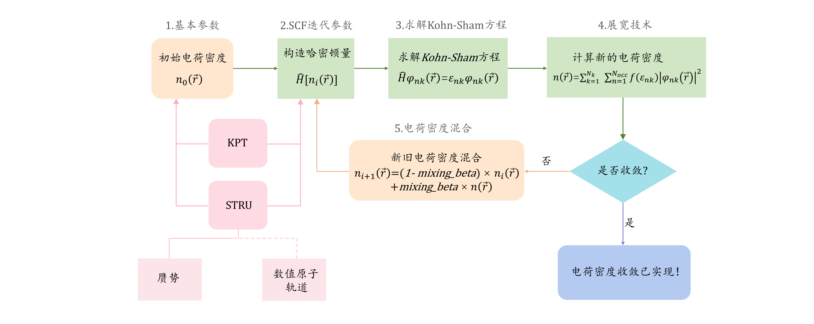
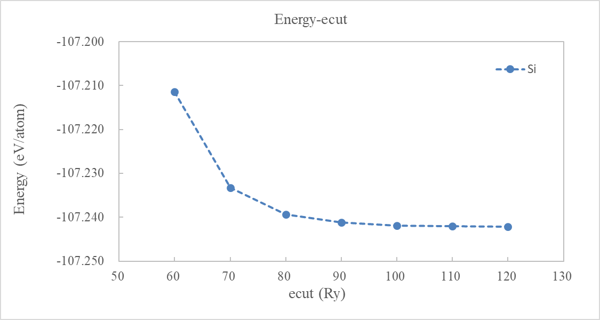
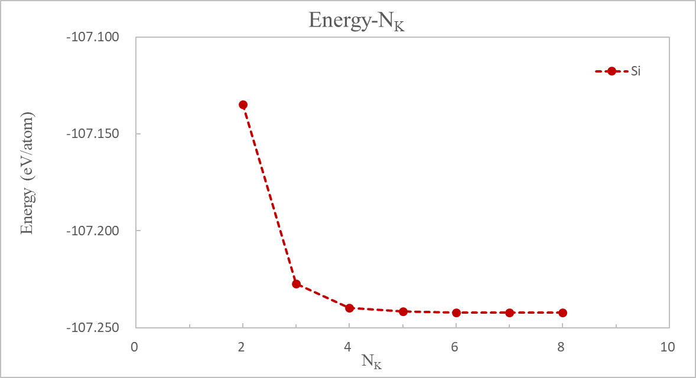
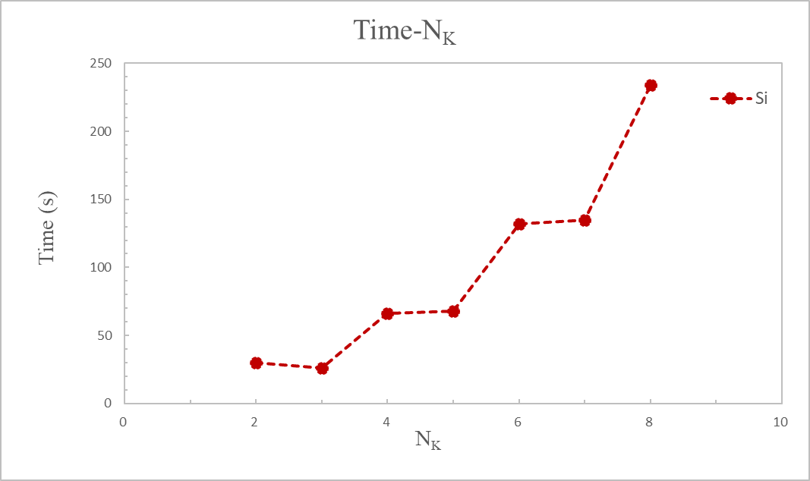

# ABACUS 的平面波计算与收敛性测试

<strong>作者：谢炘玥，邮箱：xyxie@stu.pku.edu.cn</strong>

<strong>审核：陈默涵，邮箱：mohanchen@pku.edu.cn</strong>

<strong>最后更新时间：2024/04/09</strong>

# 一、背景介绍

ABACUS(原子算筹)作为一款国产的电子结构软件，可用于对材料进行<strong>密度泛函理论（Density Functional Theory，简称 DFT）</strong>的<strong>第一性原理（first-principles）</strong>计算，其主要核心功能之一是<strong>电子自洽迭代计算(Self Consistent Field，简称SCF)</strong>，在给定材料微观层面的晶胞和原子位置的条件下，我们可以通过 SCF 流程的计算获得电子结构的总能量、能级、电子波函数、电子密度等关键信息，这些信息可用于进一步计算得出材料体系的其它性质。然而，对于初学者来说，初次运行 ABACUS 难免不熟悉输入参数，容易出错，要熟练掌握好 SCF 计算要领也颇具难度。因此，本文将主要针对初学者，详细介绍<strong>（1）如何采用ABACUS设置合理的输入参数完成一个SCF 计算</strong>，以及<strong>（2）如何对体系做收敛性测试，以便确定所有计算参数。</strong>这里收敛性测试包括在平面波（Plane Wave，简称 pw）基矢量下面对 ecut（电子动能截断值）进行测试，以及对布里渊区的 k 点个数进行测试来确定这些参数。

对密度泛函理论计算不太了解的读者，我们想先介绍密度泛函理论的三个特点。<strong>第一，只要给定原子坐标和种类，密度泛函理论就可以用于预测该体系的许多物理和力学等性质。第二，对于不同的原子坐标排列方式以及不同元素种类，密度泛函理论软件提供了一系列参数用于调节计算的精度和效率，只有将参数设定在某一些正确的范围之内，得到的结果才有意义。</strong>反之，如果参数过于粗糙，则得到的结果可能也不收敛，因此不具有价值。<strong>第三，密度泛函理论计算是一种虽然较为流行的但也相对昂贵的科学计算方法。</strong>笔记本电脑只能跑得动几个原子的小体系计算，真正数十个原子乃至更大的体系需要借助超算进行长时间的计算（几个小时甚至几天），而选择不同的参数可能会对最终运行时间有较大的影响。因此，基于以上三点认识，有必要更加细致地掌握密度泛函理论计算的具体参数，下面我们予以介绍。

# 二、输入文件简介



> 图1：控制 SCF 的主要输入文件有三个。`KPT` 和 `STRU` 文件分别存储了布里渊区的信息和晶体结构的信息。此外 `INPUT` 文件主要存储了 5 部分信息，对应于下一章的小节序号，可以对应查看。$$n_0(\vec{r})$$表示体系运行开始时的初猜电荷密度，$$\widehat{H}$$表示电子系统的哈密顿量，$$\varphi_{nk}(\vec{r})$$表示波函数，其中$$n$$代表不同的能级，$$k$$代表体系的第一布里渊区里不同的采样点。$$\varepsilon_{nk}$$表示特征值，$$N_{k}$$代表$$k$$点的个数，$$N_{occ}$$表示被电子占据的能级个数，$$f(\varepsilon_{nk})$$表示电子的费米-狄拉克分布函数，$$n(\vec{r})$$表示由波函数算出来的电荷密度，$$n_i(\vec{r})$$表示迭代过程中第$$i$$步的电荷密度而$$n_{i+1}(\vec{r})$$表示第$$i+1$$步的电荷密度。$$mixing\_beta$$表示混合新电荷密度的比例（取值范围为 0~1）。ABACUS 支持平面波和数值原子轨道双基组，如果使用平面波基矢量，则数值原子轨道信息可以在 `STRU` 里不提供。

使用 ABACUS 中进行密度泛函理论或者第一性原理分子动力学计算时，一般需要 `STRU`、`KPT`、`INPUT` 三个最基本的文件作为 ABACUS 的基本输入文件。`STRU` 文件提供元素、晶格、原子的基本结构信息；`KPT` 文件提供周期性边界条件下布里渊区采样的网格设置。`INPUT` 文件主要提供计算所需的各种设置参数，在图1里我们分成了五部分且将在下面详细介绍。

# 三、STRU 和 KPT 文件简单介绍

## 1. `STRU` 文件

`STRU` 文件提供元素种类、原子质量（SCF 中不会用到）、赝势文件（如果做密度泛函理论计算）、数值原子轨道（如果采用该基组做计算）、晶格矢量、原子位置、原子位置是否可移动等基本结构相关的信息。其中，晶格是晶体中原子有序排列的具体形式，我们可以选取一组晶格矢量来描述晶格。晶格确定后，原子的相对位置也可以通过选取不同坐标系（例如 Cartesian 直角坐标系或者 Direct 晶格坐标系）确定下来。

例如，以下是一个金刚石硅的结构文件（8 个硅原子，周期性边界条件）

```bash
ATOMIC_SPECIES
Si   28.085   Si_ONCV_PBE-1.0.upf

NUMERICAL_ORBITAL
Si_gga_8au_60Ry_2s2p1d.orb

LATTICE_CONSTANT
1.8897261258369282 

LATTICE_VECTORS
5.4307000000      0.0000000000      0.0000000000      
0.0000000000      5.4307000000      0.0000000000      
0.0000000000      0.0000000000      5.4307000000      

ATOMIC_POSITIONS
Direct
Si
0.0000000000
8
0.0000000000 0.0000000000 0.0000000000 1 1 1 mag 0.0 
0.0000000000 0.5000000000 0.5000000000 1 1 1 mag 0.0 
0.5000000000 0.0000000000 0.5000000000 1 1 1 mag 0.0 
0.5000000000 0.5000000000 0.0000000000 1 1 1 mag 0.0 
0.7500000000 0.7500000000 0.2500000000 1 1 1 mag 0.0 
0.7500000000 0.2500000000 0.7500000000 1 1 1 mag 0.0 
0.2500000000 0.7500000000 0.7500000000 1 1 1 mag 0.0 
0.2500000000 0.2500000000 0.2500000000 1 1 1 mag 0.0
```

- 第 2 行 "<strong>元素  原子质量  赝势</strong>" 中的 "原子质量" 在进行 DFT 计算时不可以省略不写，哪怕在 SCF 中不会用到。那么什么时候会用到呢？比如在进行分子动力学（Molecular Dynamics，简称 MD，在 INPUT 的 calculation 参数里设置）计算时，涉及运动的积分方程时用的是牛顿的第二定律$$F=ma$$，此时会使用原子的质量。另外注意，此行需要提供所使用的 "<strong>赝势</strong>" 文件名称。
- 第 5 行提供 LCAO 基组所需的 "<strong>某种元素的数值原子轨道</strong>" 文件名称，而如果采用 pw 基组计算，不需要写第 4~5 行内容。
- 第 8 行代表晶格整体缩放的一个长度，注意<strong>1 Angstrom=1.8897261258369282 bohr</strong>，这里写 1.8 开头的小数意味着接下来的 LATTICE_VECTORS 部分可以写以 Angstrom 为单位的晶格。
- 第 11~13 行表示$$x,y,z$$方向分别对应的三条晶格矢量。
- 第 16 行 "<strong>Direct</strong>" 表示给出原子位置的方法是分数坐标（或者称为晶格坐标），常用的还有<strong>Cartesian(笛卡尔坐标方法)</strong>，就是直角坐标系下的坐标。
- 第 17 行是元素种类的名称。
- 第 18 行设置原子初始磁矩，如果 `INPUT` 里的 `nspin` 参数设为 1，则不考虑磁性，这个参数不起作用。
- 第 19 行表示体系的硅原子个数。
- 第 20~27 行给出所有 8 个硅原子的坐标；前三个数是坐标，之后的(<strong>1 1 1</strong>)三个数代表允许该原子在对应的$$x,y,z$$对应方向上移动，相反，(0 0 0)表示不允许在对应的方向上移动；同样，当考虑磁性计算的时候，"<strong>mag 0.0</strong>" 指定每个原子的初始磁矩，若设置此参数，则第 18 行的值将被覆盖。

关于赝势，还值得多提一些。平面波基组计算涉及采用描述电子和离子吸引作用的赝势，例如<strong>模守恒赝势</strong>或者<strong>超软赝势</strong>。<strong>需要注意的是，如果赝势换了，则相应的 ecut 能量截断值也需要重新测试收敛性。</strong>而基于局域原子轨道(Linear Combination of Atomic Orbitals，简称 LCAO)基组的计算则涉及赝势和数值原子轨道（Numerical Atomic Orbitals，简称 NAO），需要使用者准备好相应文件。这里提到的赝势是一种描述核外电子和离子之间相互作用的近似方法，数值原子轨道是通过数值方法构建的描述电子波函数和电子密度等性质的基函数。<strong>需要注意的是，LCAO 计算所采用的数值原子轨道要和对应的赝势匹配，即数值原子轨道是从给定赝势生成出来的，赝势如果改变了，相应的数值原子轨道也要重新生成，才能保证较好的精度。一般来说数值原子轨道的截断半径越长或轨道越多，则基矢量越完备，计算精度越高，但同时计算量也越大。</strong>

## 2. `KPT` 文件

`KPT` 文件提供周期性边界条件下布里渊区$$k$$点采样的网格设置

```bash
K_POINTS
0
Gamma
k k k 0 0 0
```

- 第 2 行表示$$k$$点的总数，如果设置成 "<strong>0</strong>" 代表$$k$$点是自动生成的
- 如果第二行是 0，则第 3 行 <strong>"Gamma"</strong> (Γ-centered Monkhorst-Pack method)是选择以 Gamma 点为中心的 Monkhorst-Pack 方法划分布里渊区网格，此外还可以使用 <strong>"mp" </strong>方法，即最常用的 Monkhorst-Pack 方法。
- 第 4 行的前三个整数代表网格沿着每个方向划分成几份，后三个数代表网格的平移量，0 0 0 即代表不平移。
- 计算立方形晶格时，$$k$$点各方向应取相同个数。在本次计算中，我们会将$$k$$的各方向从 2 取到 8，测试不同$$k$$点下体系能量的收敛情况。
- 在后文我们将介绍如何进行$$k$$点的收敛性测试，当选定一个$$k$$点后，若体系在某方向扩胞$$n$$次，该方向$$k$$点个数大致可以缩小到原来的$$\frac{1}{n}$$。对于 N 原子以上的立方大体系，可通过在 `INPUT` 文件中设置参数 `gamma_only` 取 1，即只使用 Gamma 点计算，这个时候计算所需内存会显著下降，计算效率也会有提升。
- 此外，$$k$$点还有所谓的 `line mode`，或者离散的$$k$$点模式，若有兴趣的读者可以查看 `KPT` 的介绍文档（[http://abacus.deepmodeling.com/en/latest/advanced/input_files/kpt.html](http://abacus.deepmodeling.com/en/latest/advanced/input_files/kpt.html)）。

# 四、INPUT 文件关键输入参数

我们以金刚石结构硅原子体系（8 个原子）作为示例，进行电子自洽迭代计算(Self Consistent Field，SCF)。接下来让我们需要准备一个 `INPUT` 文件，我们把一些计算的关键参数分成如下 5 个部分。

## 1. 基本参数

- <strong>suffix：</strong>`suffix` 是用户可以自定义的后缀，运行 ABACUS 可执行程序之后，输入文件所在的文件夹里会生成一个包含大部分运行信息的 `OUT.suffix` 文件夹。例如，在这个例子里我们可设为 "<strong>Si</strong>"，运行后就会产生一个 `OUT.Si` 文件夹。
- <strong>calculation</strong>：设置本次计算类型，例如本次文档主要展示 "<strong>scf</strong>"(自洽电子结构计算)。scf((Self Consistent Field)、relax、cell-relax、md(Molecular Dynamics)是较常用的四类计算。

  1. <strong>scf(自洽电子结构计算)</strong>是一种用于求解电子基态电子密度的自洽迭代计算方法，通过迭代来持续更新体系的电子密度，以达到收敛条件。通过电子自洽迭代，计算是否达到收敛由参数 `scf_thr` 决定。
  2. <strong>relax(结构弛豫计算)</strong>是通过调整体系中原子的位置来达到系统最稳定的状态的计算方法，每一次 relax 中都包含若干步的 scf 计算。在 relax 中，需要设置参数 `force_thr_ev` (eV/Angstrom)，代表所有原子中最大受力的收敛阈值。而 relax 计算的收敛需要每一步离子迭代时 scf 中的 `scf_thr` 都满足，以及最后多步离子迭代后 `force_thr_ev` 也满足。
  3. <strong>cell-relax(结构弛豫计算)</strong>与 relax 不同的是，其晶胞参数，比如晶格常数、晶格形状也会发生变化。除 `force_thr_ev` 外，还需要设置参数 `stress_thr`(kbar)，是晶胞感受到的应力的阈值。
  4. <strong>md(分子动力学)</strong>基于牛顿力学原理，通过数值积分模拟粒子的运动轨迹，根据原子间的势能计算相互作用力，因此势函数的选择比较关键，在 ABACUS 里可以选择 DFT 来计算相互作用力，也可以选择 DP 势函数。
- <strong>symmetry</strong>：是否考虑对称性，有如下三个选项
  > -1   不进行对称性分析
  
  > 0   仅考虑时间反演对称性

  > 1   进行对称性分析

如果打开对称性（设置为 1），布里渊区$$k$$点可以根据对称性进行简化处理，若体系有对称性，则可以减少所需计算的$$k$$点。因为每个$$k$$点都会进行一次 Kohn-Sham 方程的求解，对称性分析后若 k 点减少则将提升计算效率。本次计算中开启对称性分析，设置 "1"，关于对称性分析的测试还在进一步完善，如果计算结果奇怪，建议设置成 "0"之后再进行计算，比较结果是否一致。

- <strong>pseudo_dir</strong>：计算中需要使用赝势来近似离子和电子相互作用势能，为计算提供赝势文件。<strong>pseudo_dir</strong>指定 `STRU` 文件中赝势文件所在的目录。本次计算将赝势和轨道文件都与 `INPUT`、`STRU`、`KPT` 文件放在一起，因此填入 "."，表示处在当前文件夹中。
  > ABACUS 支持的赝势文件——Si_ONCV_PBE-1.0.upf

  > "ONCV"代表模守恒赝势的种类，"PBE"是采用的交换关联泛函。

- <strong>orbital_dir</strong>：本次计算将采取 pw（平面波轨道）基组（后文 basis_type 中设置）。若采用 LCAO 基组进行计算，则需要提供作为基组的轨道文件，在 `STRU` 文件中指定轨道文件所在的目录。若选用 pw 基组，则不需要轨道文件，不需要填写此参数。常用的轨道有：DZP（Double-ζ valence orbitals plus SZ polarization，两条径向轨道和一条杂化轨道）,TZDP（Triple-ζ valence orbitals plus DZ polarization，三条径向轨道和两条杂化轨道）。
  > ABACUS 支持的轨道文件——Si_gga_7au_100Ry_2s2p1d.orb：

  > "gga"代表 GGA 泛函；"7au"是轨道半径，半径越大，计算结果会更准确，但花费时间也更久；"100Ry"是推荐的 `ecutwfc` 值；"2s2p1d"表明采用了 DZP 轨道，轨道数目越多，即基矢量更完备，计算也会更准确。

- <strong>basis_type</strong>：计算的基组（指描述电子波函数的基函数），在 ABACUS 中常用的有两种：
  > pw：平面波基组（由于基矢量更完备，pw 计算将更准确，同时计算时间也更长）

  > LCAO：局域原子轨道基组（没有 pw 准确，但效率高）

- <strong>ecutwfc</strong>：平面波函数的能量截止（单位：Ry），在平面波基组里是很重要的一个参数，其大小决定着作为基矢的平面波函数的个数多少，而基矢的多少，也决定了计算精度的高低。
  > 在本次计算选用的 LCAO 基组中，一般选取轨道文件上推荐的值，设置 "100" Ry 即可。

本次计算中选择 pw 基组。如前所述，pw 中不会用到轨道文件。

我们目前填写好的基本参数如下：

```bash
#Parameters (1.General)
suffix                  Si
calculation             scf
symmetry                1
pseudo_dir              .
orbital_dir             .
basis_type              pw
ecutwfc                 100
```

## 2. SCF 迭代参数

- <strong>scf_nmax</strong>：针对每个离子构型，scf 电子迭代的最大次数为 `scf_nmax`，可设为"50"或"100" 次。半导体和绝缘体是较容易收敛的体系，一般 20 步 scf 以内即可达到收敛，对于金属体系或者费米面较为复杂的体系，有可能 50 步仍未收敛。注意，如果做 relax, cell-relax, 或者 md 的时候发现有某些 scf 迭代次数达到最大时仍未达到收敛条件，建议先把计算停下来弄清楚原因后再继续算，有可能是因为离子构型或者$$k$$点等参数的设置不合理引起的。
- <strong>scf_thr</strong>：代表两个相邻电子迭代步之间的电荷密度误差，也是 SCF 计算中判断是否收敛、完成计算的标准，对于 LCAO，一般设置为 "1e-7"，可认为精度足够。对于 pw，建议设置 1e-8 或 1e-9 的精度。

```bash
#Parameters (2. SCF iterations)
scf_nmax                100
scf_thr                 1e-8
```

## 3. 求解 Kohn-Sham 方程

- <strong>nbands</strong>：计算的 Kohn-Sham 轨道数目，在本次计算中无磁性，参数 `nspin` 取 1（默认值），程序目前采取 `0.5*`<em>max(1.2*occupied_bands, occupied_bands + 10) </em>计算 nbands。 对于 Si，价电子数为 4，每个能级填充可以填充自旋向上和向下 2 个电子，金刚石结构中共有 8 个原子，则<em>nbands=max(1.2*8*2，8*2+10)=26</em>。
- <strong>ks_solver</strong>：在不同基组中展开哈密顿矩阵的对角化方法，对于 pw，可以选择 `cg`(Conjugate Gradient，默认方法)，`bpcg`(还不是太稳定、测试中)，`dav`(Davidson 算法)；对于 LCAO，可以选择 `genelpa`(默认值)，`scalapack_gvx`(Scalable Linear Algebra PACKage)。如果选用 LCAO 基组，`ks_solver` 可设置为"genelpa"。

```bash
#Parameters (3. Solve KS equation)
nbands                  26
ks_solver               cg
```

## 4. 展宽技术

- <strong>smearing_method</strong>：对于金属体系或者费米面附近较复杂的体系，电子自洽迭代方法往往不容易收敛，这个时候可以选择给电子提供一个光滑的占据函数，用来调节程序计算电荷密度和总电子数时候的电子占据函数，这对于费米面附近的电子态尤为重要。我们这里称为 "smearing method"，或者称为展宽方法。具体来说，对于金属体系可以选择 `mp`(methfessel-paxton)，`mp2`(2-nd methfessel-paxton) ，也可以使用 `gauss`(也可以写作 `gaussian`)。因为我们计算金刚石 Si 具有半导体性质，所以 smearing 方法基本不起作用，默认可以选择 `gauss`。此外，非导体计算可以选择 `fixed`，半导体和非导体也可以选择 `fd`(Fermi-Dirac)方法。
- <strong>smearing_sigma</strong>：给定展宽方法的能量范围（单位：Ry），默认是 0.015 Ry，我们按照通常情况给定 "0.01"。

```bash
#Parameters (4.Smearing)
smearing_method         gauss
smearing_sigma          0.01
```

## 5. 电荷密度混合

- <strong>mixing_type</strong>：进行新旧电荷密度混合时选用的方法，可选 "plain"(简单电荷密度混合方法，如图 1 所示)、"pulay"、"broyden"），默认选择 "broyden"算法。
- <strong>mixing_beta</strong>：新旧电荷密度混合时，新电荷的比例，不同系统取值不同。能带大于 1 eV 的体系，设为 0.7；能带小于 1 eV 的金属和过渡金属，设为 0.2。这个参数越大，收敛得越快，但不收敛的风险也会变大，不过取值大小并不会改变基态能量的结果。对于 Si，因为其能带隙为 1.12 eV，本计算中设置此参数为 "0.7"。
- <strong>mixing_gg0</strong>：电子迭代过程中，可能出现混合电荷密度不收敛的情况，此时可以通过一种叫 Kerker Mixing 的方法来加快收敛。这个参数代表 Kerker 方法中调整电荷密度的尺度，本计算中设置此参数为 "0"。

```bash
#Parameters (5.Mixing)
mixing_type             broyden
mixing_beta             0.7
mixing_gg0              0
```

到此，我们完成了对主要计算参数的设置，此时集成了以上主要参数的 `INPUT` 文件如下：

```bash
#Parameters (1.General)
suffix                  Si
calculation             scf
symmetry                1
pseudo_dir              .
orbital_dir             .
basis_type              pw
ecutwfc                 100

#Parameters (2. SCF iterations)
scf_nmax                100
scf_thr                 1e-8

#Parameters (3. Solve KS equation)
nbands                  26
ks_solver               cg

#Parameters (4.Smearing)
smearing_method         gauss
smearing_sigma          0.01

#Parameters (5.Mixing)
mixing_type             broyden
mixing_beta             0.7
mixing_gg0              0
```

# 五、收敛性测试

## 1. Ecut 收敛（只对平面波有效）

平面波（pw）作为一种可以用于描述周期性边界条件下的电子波函数和电荷密度基矢量，它们都是正交的，且可以通过一个 `ecutwfc` 参数来控制基矢量的个数，ecut 其实代表了每一个平面波所对应的动能，如果 ecut 取得越大，则基矢量可以描述震荡得越剧烈的物理量（例如氧原子的 2p 轨道），那么计算结果就会越精确，但同时所带来的机时成本消耗也越大。因此我们采用 pw 基组做真正计算前，需要对 ecut 进行测试来获得一个足够准确且效率也高的取值。

保持前文用于计算的基组为"pw"，进行 ecut 的收敛性测试，ecut 取值范围为：20~100 Ry。这个例子在 4 进程下启动 MPI 进行并行计算，一般推荐总核数(=线程数*进程数)取 2 的 n 次方或者 n 倍。一个较为粗糙、但基本不会造成计算资源浪费的选取 n 值原则是：体系有多少个原子，不要用超过这个原子个数太多的总核数进行并行计算。例如，体系如果有 16 个原子，不要用远大于 16 的总核数进行计算，一般取 16 的总核数或者更少就够了，具体需要测试。

```
mpirun -n 4 abacus
```

计算完成后，建议用脚本提取 ecut 数值下<strong>OUT.Si</strong>文件夹里<strong>running_scf.log</strong>文件中收敛的系统总能量，计算单原子能量并绘制其随着 ecut 的变化曲线。如图2，可以看见随 ecut 增大，系统总能量趋于收敛。在 ecut=60 Ry 时，认为总能量收敛(与 ecut=50 Ry 的能量差小于 1 meV/atom)。



## 2. k 点收敛

对具有周期性的体系进行计算时，DFT 计算实际会对第一布里渊区中不同离散化$$k$$点的单独进行计算（例如每个$$k$$点都会单独求解一次依赖于该$$k$$点的 Kohn-Sham 方程），并将计算结果进行积分。$$k$$点越多，则需要求的离散积分就越多，也将越近似连续积分的结果，但计算资源也会增加。因此，pw 和 LCAO 都有必要对 "需要多少$$k$$点" 进行测试并得出合适的$$k$$点选取方案。

金刚石Si的$$k$$点测试结果。同样在4进程下进行并行计算。

```
mpirun -n 4 abacus
```

计算完成后，提取各 K 点下<strong>OUT.Si</strong>文件夹里<strong>running_scf.log</strong>文件中收敛的系统总能量和计算时间，绘制这两个参数随 K 点的变化曲线。此处，$$N_k$$表示各方向上的$$k$$点取值个数，"$$Energy-N_k$$" 图中采用单原子的能量。

分析图3和图4可知，在$$N_k=6$$时，结果已收敛，能量不会再发生较大的变化(与$$N_k=5$$的能量差小于 1 meV/atom)，而此时花费时间 132 秒，相比于更大的$$N_k$$点较低。因此选择 6×6×6 的$$k$$点可以同时获得准确的结果和高的计算效率。





提取出每个计算中实际使用到$$k$$点个数，如表一所示，实际使用$$k$$点数相比总$$k$$点数有较明显的简化。如前所述，`INPUT` 文件中我们设置了参数 `symmetry` 取 "1"，因此在实际计算中利用了晶胞结构中的对称性，即倒易空间的积分没有使用所有的$$k$$点计算，而是巧妙的利用了对称性得到其它$$k$$点的信息，简化了布里渊区中的计算工作量。这也解释了图4中明明总$$k$$点数不同，计算时间却十分接近的原因。

表一、$$N_k$$点数，总$$k$$点数，实际使用$$k$$点数：

| $$N_k$$                         | 2 |  3  |  4  |  5  |  6  |  7  |  8  |
| ---------------------------     | - | --- | --- | --- | --- | --- | --- |
| 总$$k$$点个数                   | 8 |  27 |  64 | 125 | 216 | 343 | 512 |
| 实际计算$$k$$点数（开了对称性） | 4 |  4  |  10 |  10 |  20 |  20 |  35 |

以上就是本教程的内容，希望对学习密度泛函理论计算的初学者有所帮助。
