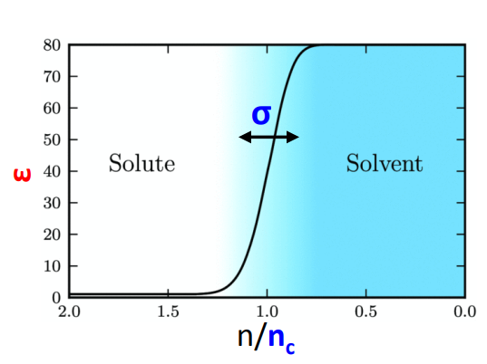
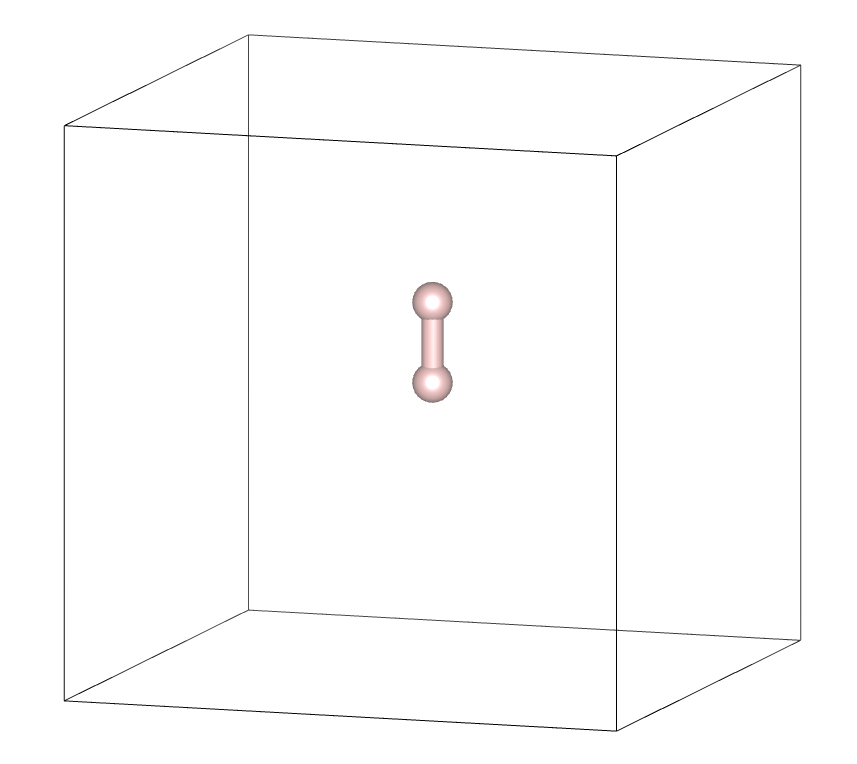
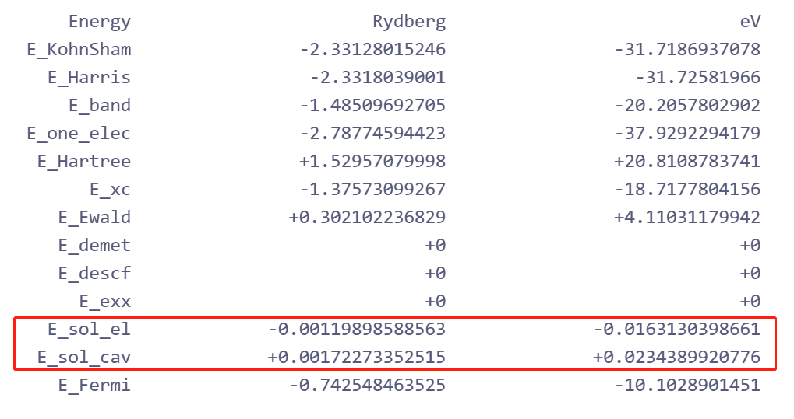

# ABACUS 隐式溶剂模型使用教程

<strong>作者：刘裕，邮箱：liuyu@stu.pku.edu.cn；孙梦琳，邮箱：sunmenglin@stu.pku.edu.cn</strong>

<strong>审核：许审镇，邮箱：xushenzhen@pku.edu.cn；陈默涵，邮箱：mohanchen@pku.edu.cn</strong>

<strong>最后更新时间：2023/10/01</strong>

# 一、介绍

近年来，电化学表面反应，例如一些电催化系统，无论是在工业界还是科学研究领域，都受到了广泛的关注。而对于一个真实电极表面反应体系，往往需要考虑许多复杂的情况，例如电极与电解液之间的固液界面，在材料模拟中经常遇到和使用。在这种系统的第一性原理计算中应该考虑溶剂化效应，以便获得准确的性质预测。

<strong>溶剂化</strong>是指溶质和溶剂之间的相互作用，使溶质在溶液中稳定。这种相互作用的强度和性质影响体系的许多特性。在计算化学中，<strong>溶剂模型(Solvation model) </strong>是描述溶剂化行为的一种计算方法。

<strong>隐式溶剂化模型(Implicit solvation model)</strong>是一种处理溶剂化效应的成熟方法，在有限系统和周期系统中得到了广泛的应用。这种方法将溶剂视为连续介质，而不是单独的“显式”溶剂分子，这意味着嵌入隐式溶剂中的溶质以及溶剂自由度的平均值将隐含在溶剂浴的性质中。与“显式”方法相比，这种隐式溶剂化模型可以以低得多的计算成本提供定性正确的结果，特别适用于大型复杂系统。

ABACUS 中实现的隐式溶剂化模型采用了 Mathew、Sundararaman、Letchworth-Waver、Arias 和 Hennig 在 2014 年开发的方法[1]。

# 二、文档和算例

ABACUS 里关于隐式溶剂模型的线上文档地址为：

[http://abacus.deepmodeling.com/en/latest/advanced/scf/advanced.html#implicit-solvation-model](http://abacus.deepmodeling.com/en/latest/advanced/scf/advanced.html#implicit-solvation-model)

ABACUS 里关于隐式溶剂模型参数的线上文档地址为：[https://abacus.deepmodeling.com/en/latest/advanced/input_files/input-main.html#implicit-solvation-model](https://abacus.deepmodeling.com/en/latest/advanced/input_files/input-main.html#implicit-solvation-model)

ABACUS 的隐式溶剂模型算例下载地址为（gitee）：

[https://gitee.com/deepmodeling/abacus-develop/tree/develop/examples/implicit_solvation_model/Pt-slab](https://gitee.com/deepmodeling/abacus-develop/tree/develop/examples/implicit_solvation_model/Pt-slab)

可以采用的下载命令是：

```bash
git clone https://gitee.com/deepmodeling/abacus-develop.git
```

之后进入 `/abacus-develop/examples/``implicit_solvation_model/Pt-slab` 目录

或者采用 Github 仓库地址：

[https://github.com/deepmodeling/abacus-develop/tree/develop/examples/implicit_solvation_model/Pt-slab](https://github.com/deepmodeling/abacus-develop/tree/develop/examples/implicit_solvation_model/Pt-slab)

# 三、输入参数

```shell
INPUT_PARAMETERS
#Parameters (1.General)
suffix              H2
calculation         scf
ntype               1
nbands              2
symmetry            0
pseudo_dir          ./

#Parameters (2.Iteration)
ecutwfc             60
scf_thr             1e-6
scf_nmax            100

#Parameters (3.Basis)
basis_type          pw

#Parameters (Solvation Model)
imp_sol             1
eb_k                80
tau                 0.000010798
sigma_k             0.6
nc_k                0.00037
```

以算例提供的 `INPUT` 文件为例，使用隐式溶剂模型方法只需添加如下参数即可：

- `imp_sol`：类型是 Bool，指定隐式溶剂模型的开(1)或者关(0)，默认值为 0
- `eb_k`：类型是 Real，溶剂的相对介电常数，水为 80
- `tau`：类型是 Real，有效表面张力参数，用于描述未被静电项捕获的溶质和溶剂之间的空化、分散和排斥相互作用，单位是$Ry/Bohr^2$，默认值为 1.0798e-05
- `sigma_k`：类型是 Real，由溶质的电子结构隐含地确定的扩散腔的宽度（溶质电子密度与 nc_k 的比值，无量纲），默认值为 0.6
- `nc_k`：类型是 Real，介电腔形成时的电子密度值，单位是$Bohr^{-3}$，默认值为 0.00037

注意，`eb_k` 可根据需要设置为模拟溶剂分子的相对介电常数参数，默认值 80 为水分子情况。`tau`，`sigma_k`，`nc_k` 的默认值均由在水溶液情况下与实验结果拟合得到，如需考虑其他溶剂，可自行测试拟合。



# 四、预期结果

如图所示，一个氢分子位于超胞中，模拟其处于溶液环境时的状态。将 `imp_sol` 设为 1，其他参数使用默认值，表示溶剂为水。 在输出文件 OUT.ABACUS/running_scf.log 中，`E_sol_el` 和 `E_sol_cav` 分别表示静电作用和空腔作用引起的能量修正。如案例所示，`E_sol_el` 代表溶质和溶剂分子之间的静电感应作用，贡献的能量修正一般为负值。`E_sol_cav` 代表溶质分子在溶剂中产生空腔所引起的能量修正，一般为正值。

体系溶剂化能的计算：打开隐式溶剂模型（`imp_sol` = 1)时体系总能量(结构优化之后)与真空情况（`imp_sol` = 0)体系总能量（结构优化之后）之差。





# 五、参考文献

[1] J. Chem. Phys. <strong>140</strong>, 084106 (2014), [https://doi.org/10.1063/1.4865107](https://doi.org/10.1063/1.4865107)
