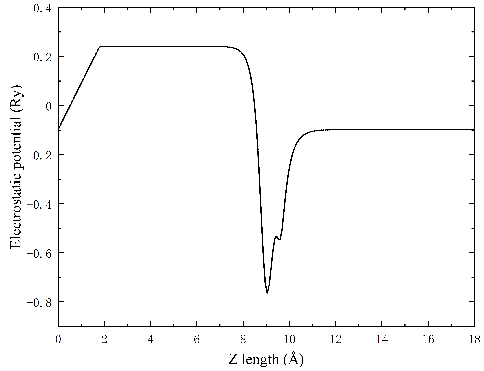

# 采用 ABACUS 进行表面计算（二）：偶极修正

<strong>作者：刘裕，邮箱：liuyu@stu.pku.edu.cn</strong>

<strong>审核：陈默涵，邮箱：mohanchen@pku.edu.cn</strong>

<strong>最后更新时间：2023/08/28</strong>

# 一、偶极修正介绍（Dipole Correction）

<strong>偶极矩（Dipole Moment）</strong>是一个矢量，由正、负电荷中心距离和其所带电量乘积得到，方向规定为正电中心指向负电中心，采用原子建模表面时，往往表面会产生偶极矩。

ABACUS 在 xyz 三个方向都采用周期性边界条件（Periodic Boundary Conditions），当使用密度泛函理论（Density Functional Theory，简称 DFT）进行表面体系的电子结构计算时常采用超胞（Supercell）近似，这时所研究的体系在真空方向会出现两个表面。当两个表面不对称时（例如在某表面进行吸附原子计算），这两个表面的电荷密度分布就会不同，这个时候两个表面的偶极密度不同且表面附近的静电势（Electrostatic Potential）会呈现不同的值。然而，周期性边界条件的存在会强制使得静电势也要满足周期性边界条件，这个时候周期性边界条件的存在相当于制造了一个非物理的人造电场（Artificial Electric Field）。

通常情况下，降低这个人造电场的方法是加大真空层的厚度，使得相邻的超胞之间没有相互作用，但这往往要大幅增加密度泛函理论的计算量。因此，为了消除周期性边界条件对表面偶极矩带来的影响，我们可以采用偶极修正（Dipole Correction）的方法，通过引入另外一个外电场来抵消这个人造电场，但注意引入的外电场需要存在于真空中（其位置是程序输入参数的一部分）才不至于影响所要研究的表面体系。经过修正后，人造电场将被抵消，真空电势则维持不变。

ABACUS 中实现了偶极修正功能[1]，<strong>可以有效的加速静电势收敛，避免超胞的真空取得太长，从而可以降低计算量</strong>。该修正功能主要体现在 Hartree 项的处理上，并且存在相应的原子受力的修正，可以用于平面波（Plane-Wave）基组和数值原子轨道（Numerical Atomic Orbitals）基组计算，但注意该功能只能用于带真空层的表面体系。

# 二、文档与算例

ABACUS 里关于偶极修正的线上文档地址为：

[http://abacus.deepmodeling.com/en/latest/advanced/scf/advanced.html#dipole-correction](http://abacus.deepmodeling.com/en/latest/advanced/scf/advanced.html#dipole-correction)

ABACUS 里关于偶极修正参数的线上文档地址为：[https://abacus.deepmodeling.com/en/latest/advanced/input_files/input-main.html#electric-field-and-dipole-correction](https://abacus.deepmodeling.com/en/latest/advanced/input_files/input-main.html#electric-field-and-dipole-correction)

ABACUS 的偶极修正算例下载地址为（gitee）：

[https://gitee.com/MCresearch/abacus-user-guide/tree/master/examples/dipole_correction/H2O](https://gitee.com/MCresearch/abacus-user-guide/tree/master/examples/dipole_correction/H2O)

可以采用的下载命令是：

```bash
git clone https://gitee.com/MCresearch/abacus-user-guide
```

之后进入 `/abacus-user-guide/examples/``dipole_correction/H2O/` 目录

或者采用 Github 仓库地址：

[https://github.com/MCresearch/abacus-user-guide/tree/master/examples/dipole_correction/H2O](https://github.com/MCresearch/abacus-user-guide/tree/master/examples/dipole_correction/H2O)

# 三、偶极修正输入参数介绍

```bash
INPUT_PARAMETERS
#Parameters (1.General)
suffix              H2O
calculation         scf
nbands              6
symmetry            0
pseudo_dir          ../../PP_ORB

#Parameters (2.Iteration)
ecutwfc             100
scf_thr             1e-6
scf_nmax            100

#Parameters (3.Basis)
basis_type          pw

#Parameters (4.Smearing)
smearing_method     fixed

#Parameters (5.Mixing)
mixing_type         pulay
mixing_beta         0.7

#Parameters (6.Dipole correction)
efield_flag         1
dip_cor_flag        1
efield_pos_max      0.0
efield_pos_dec      0.1
efield_amp          0.00

#Parameters (7.Output)
out_pot             2
```

以算例提供的 `INPUT` 文件为例，使用偶极修正方法只需添加如下参数即可：

- `efield_flag`：类型是 Bool，指定外加电场的开(1)或者关(0)，默认值为 0，注意应用偶极修正功能时，efield_flag 必须设为 true
- `dip_cor_flag`：类型是 Bool，指定偶极修正的开(1)或者关(0)，默认值为 0
- `efield_dir`：类型是 Int，外加电场方向，可取 0，1，2 分别表示 x，y，z 方向，默认值为 2
- `efield_pos_max`：类型是 Real，锯齿状电势最大值所在分数坐标，范围[0,1)，默认值为 0.5
- `efield_pos_dec`：类型是 Real，锯齿状电势从最大值到最小值的长度（同样以分数坐标为度量），默认值为 0.1，范围[0,1)。<strong>以图1为例，0.5 是最大值，0.6 是最小值，那么 0.5 ~ 0.6 的区域必须放置在没有原子的真空层中</strong>


- `efield_amp`：类型是 Real，电场强度，默认值为 0，单位为 a.u.，其中 1 a.u. = 51.4220632*10^10 V/m。在偶极修正时需要设为 0，不为 0 则说明同时添加了外加电场和偶极修正

# 四、预期结果

如图2所示，一个水分子位于超胞（尺寸为 $$3\times3\times18$$ Å$$^3$$）的中部（即位于9 Å），那么按照上一部分的说明，锯齿应该放在没有原子的真空处，因此我们将电势的最大值所在的位置设为 `efield_pos_max` 设为 `0.0`，之后设置电势从最大值到最小值的长度，即将 `efield_pos_dec` 设为 `0.1`（在这个例子是 1.8 Å），如此锯齿即位于 0.0~0.1 的区域。

为了验证结果的正确性，我们可以画出静电势沿 `Z` 轴（`c` 方向）的变化如图3所示。在水分子上方（9-18 Å）和下方（0-9 Å）的真空层中，静电势在很长一段区间保持常数不变，出现了两个平台，这说明我们的偶极修正功能使用无误。静电势计算和作图方法请参考静电势和功函数计算文档。




# 五、参考文献

[1] Phys. Rev. B <strong>59</strong>, 12301 (1999), [https://doi.org/10.1103/PhysRevB.59.12301](https://doi.org/10.1103/PhysRevB.59.12301)
