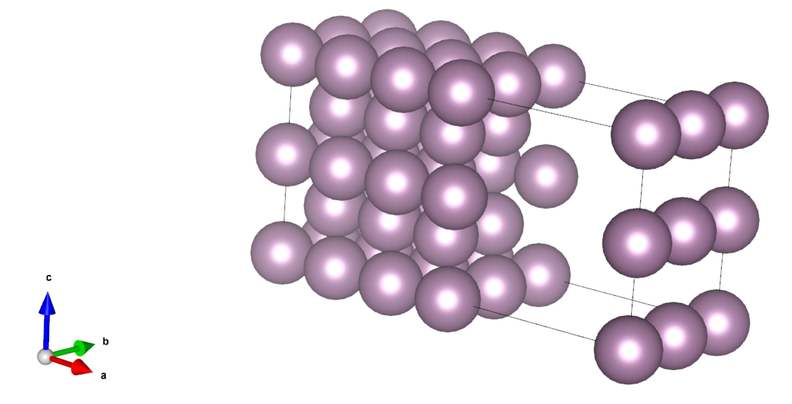
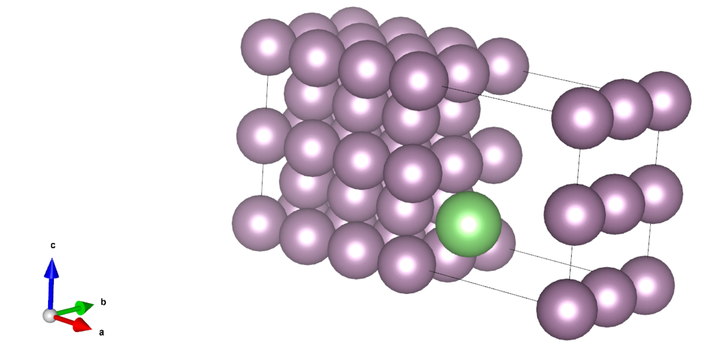

# 采用 ABACUS 进行表面计算（四）：表面缺陷能和吸附能计算

<strong>作者：孙亮，邮箱：l.sun@pku.edu.cn</strong>

<strong>审核：陈默涵，邮箱：mohanchen@pku.edu.cn</strong>

<strong>最后更新时间：2023/10/09</strong>

# 一、背景

在研究表面的稳定性时，我们经常关注表面上形成空穴、或者表面上吸附其它分子的难易程度，这两种现象可以分别用表面缺陷能和表面吸附能描述。

表面<strong>缺陷能（surface vacancy energy）</strong>定义为在表面上形成原子的空穴所需能量，缺陷能越低，则该表面越容易形成缺陷。

表面<strong>吸附能（surface adsorption energy）</strong>定义为原子、离子或分子（吸附物，adsorbate）附着在固体表面（吸附剂，adsorbent）的吸附过程中，二者结合时的能量下降，它描述了吸附剂对吸附物的吸附能力，吸附能越低，则吸附能力越强。

由于缺陷间或吸附物间的相互作用，上述两种物理量都与缺陷或吸附物在表面的覆盖率（coverage）$$\theta$$有关，其定义为$$\theta = N_{\rm{v/a}}/N_{\rm{surface}}$$，即缺陷数或吸附物数与表面原子数之比。覆盖率越低，则缺陷间或吸附物间相互作用越弱，计算时所需的超胞也越大，实际计算中，可根据需求选择合适的覆盖率。本文档中，为了节省计算量，采取较大的覆盖率$$\theta=0.25$$。

下面我们分别介绍这两个物理量的计算方法，并展示如何使用 ABACUS 计算。

ABACUS 中，我们可以采用平面波基组、原子轨道基组下的 Kohn-Sham DFT（KSDFT）和无轨道密度泛函理论等电子结构计算方法来计算所需的能量，也可以调用 DeePMD 势函数。接下来，我们以平面波基组下的 KSDFT 为例介绍其计算方法，如果需要使用其它的能量求解器，只需要设置 `INPUT` 文件里的 `esolver_type`、`basis_type` 更换能量求解器并设置相应求解器的参数即可。

# 二、ABACUS 计算表面缺陷能具体流程

表面缺陷能$$E_{\rm{vac}}$$可定义为

$$
E_{\rm{vac}} = E_{\rm{slab/vac}} + E_{\rm{bulk}} - E_{\rm{slab}}
$$

其中$$E_{\rm{slab/vac}}$$为带缺陷表面构型的总能量，$$E_{\rm{bulk}}$$为体材料中每原子的能量，$$E_{\rm{slab}}$$为无缺陷表面构型的总能量，注意计算$$E_{\rm{slab/vac}}$$所需构型比$$E_{\rm{slab}}$$少一个原子，即缺陷。

因此为了计算某种表面的缺陷能，我们需要进行三次自洽迭代（scf）计算，分别得到上述三个能量。

注意下面的例子中，为了提升效率，我们采用了较低的能量截断值（20 Ry）以及较少的 k 点（gamma 点），实际计算中，需要对二者做收敛性测试。

如果计算体系有磁性原子，要注意体材料的时候是否要加上磁性的计算。

## 计算实例：钼体心立方 110 表面缺陷能

链接：[https://gitee.com/mcresearch/abacus-user-guide/tree/master/examples/surface_vacancy_adsorption/0_vacancy/Mo](https://gitee.com/mcresearch/abacus-user-guide/tree/master/examples/surface_vacancy_adsorption/0_vacancy/Mo)

### 1.1 计算体材料能量

这一步我们用晶格弛豫方法找到体心立方（bcc） Mo 的晶格常数以及平衡能量。

运行算例后，用 `grep FINAL_ETOT_IS OUT.example/running_cell-relax.log` 得到总能量为 `-1861.827 eV`，由于原胞内只有一个原子，因此$$E_{\rm{bulk}}=-1861.827\ \rm{eV}$$。

从 `OUT.example/STRU_ION_D` 文件中可以读到平衡晶格常数为$$a_0=5.924\ \rm{Bohr}$$，它将用于表面构型的构造。

### 1.2 计算表面体系能量

这一步我们参考文献[1]，搭建了一个 7 层的 Mo bcc(110)表面体系，每层包含 4 个原子，如下图所示：

计算其总能量时，可以根据实际需要选择是否做结构优化，这里为了效率更高，我们<strong>没有做结构优化</strong>。

用 `grep FINAL_ETOT_IS OUT.example/running_scf.log` 得到总能量为 `-52129.480 eV`，因此$$E_{\rm{slab}}=-52129.480\ \rm{eV}$$。

### 1.3 计算带缺陷的表面体系能量

第三步我们搭建带缺陷的表面体系，方法是从表面上移除一个原子，如下图所示，移除了表面中心的原子：

此算例同样<strong>没有做结构优化</strong>。

用 `grep FINAL_ETOT_IS OUT.example/running_scf.log` 得到总能量为 `-50265.933 eV`，因此$$E_{\rm{slab/vac}}=-50265.933\ \rm{eV}$$。

### 1.4 计算缺陷能

对于上述构型，最终的缺陷能$$E_{\rm{vac}} = E_{\rm{slab/vac}} + E_{\rm{bulk}} - E_{\rm{slab}} = 1.720\ \rm{eV}$$。

# 三、ABACUS 计算表面吸附能具体流程

表面吸附能$$E_{\rm{ads}}$$可定义为

$$
E_{\rm{ads}} = E_{\rm{adsorbate/adsorbent}} - E_{\rm{adsorbent}} - E_{\rm{adsorbate}} + \Delta \rm{ZPE}
$$

其中$$E_{\rm{adsorbate/adsorbent}}$$为吸附物与吸附剂结合后的总能量，$$E_{\rm{adsorbent}}$$为吸附剂体系的总能量，$$E_{\rm{adsorbate}}$$为吸附剂体系的总能量，$$\Delta \rm{ZPE}$$为零点能，注意计算$$E_{\rm{adsorbate/adsorbent}}$$所需构型的原子数为$$E_{\rm{adsorbent}}$$与$$E_{\rm{adsorbate}}$$之和。

因此为了计算吸附能，我们需要进行三次自洽迭代（scf）计算，分别得到上述三个能量。

## 计算实例：Li 原子在 Mo bcc(110)表面的吸附能

链接：[https://gitee.com/mcresearch/abacus-user-guide/tree/master/examples/surface_vacancy_adsorption/1_adsorption/Li-Mobcc110](https://gitee.com/mcresearch/abacus-user-guide/tree/master/examples/surface_vacancy_adsorption/1_adsorption/Li-Mobcc110)

### 1.1 计算 Li 原子能量

这一步我们计算孤立 Li 原子的能量，方法是将一个 Li 原子放在一个足够大的原胞中，以排除 Li 原子间的相互作用。比如本例子中 Li 原子间距为 $$20\ \rm{Å}$$。

用 `grep FINAL_ETOT_IS OUT.example/running_cell-relax.log` 得到总能量为 `-183.156 eV`，由于原胞内有两个原子，因此$$E_{\rm{adsorbent}}=-183.156\ \rm{eV}$$。

### 1.2 计算 Mo bcc(110)体系总能量

上文已经计算过$$E_{\rm{slab}}=-52129.480\ \rm{eV}$$，因此这里$$E_{\rm{adsorbate}}=-52129.480\ \rm{eV}$$。

### 1.3 计算吸附体系总能量

这一步我们参考文献[1]搭建了以 long bridge 形式吸附了 Li 原子的 Mo bcc(110)表面体系，其中 Li 到 Mo 表面的距离为 $$2.229\ \rm{Å}$$，如下图所示，绿色的原子为 Li 原子。

这里我们<strong>没有做结构优化</strong>，但在实际计算中，Li 原子到 Mo 表面的距离应该通过结构优化得到。

用 `grep FINAL_ETOT_IS OUT.example/running_scf.log` 得到总能量为 `-52315.069 eV`，因此$$E_{\rm{adsorbate/adsorbent}}=-52315.069\ \rm{eV}$$。

### 1.4 计算吸附能

对于上述构型，吸附能$$E_{\rm{ads}} = E_{\rm{adsorbate/adsorbent}} - E_{\rm{adsorbent}} - E_{\rm{adsorbate}} = -2.433\ \rm{eV}$$。（此处忽略了零点能）

# 四、参考文献

[1] Chen M, Roszell J, Scoullos E V, et al. Effect of temperature on the desorption of lithium from molybdenum (110) surfaces: Implications for fusion reactor first wall materials[J]. The Journal of Physical Chemistry B, 2016, 120(26): 6110-6119.
