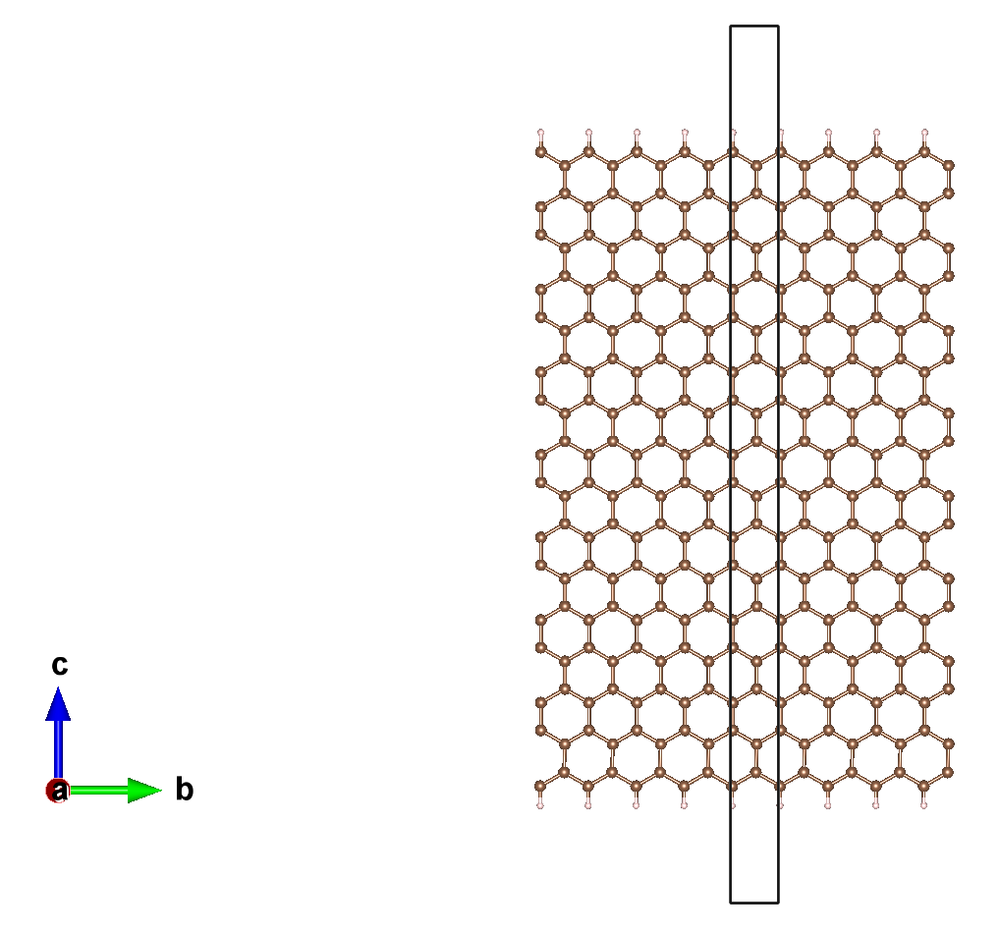
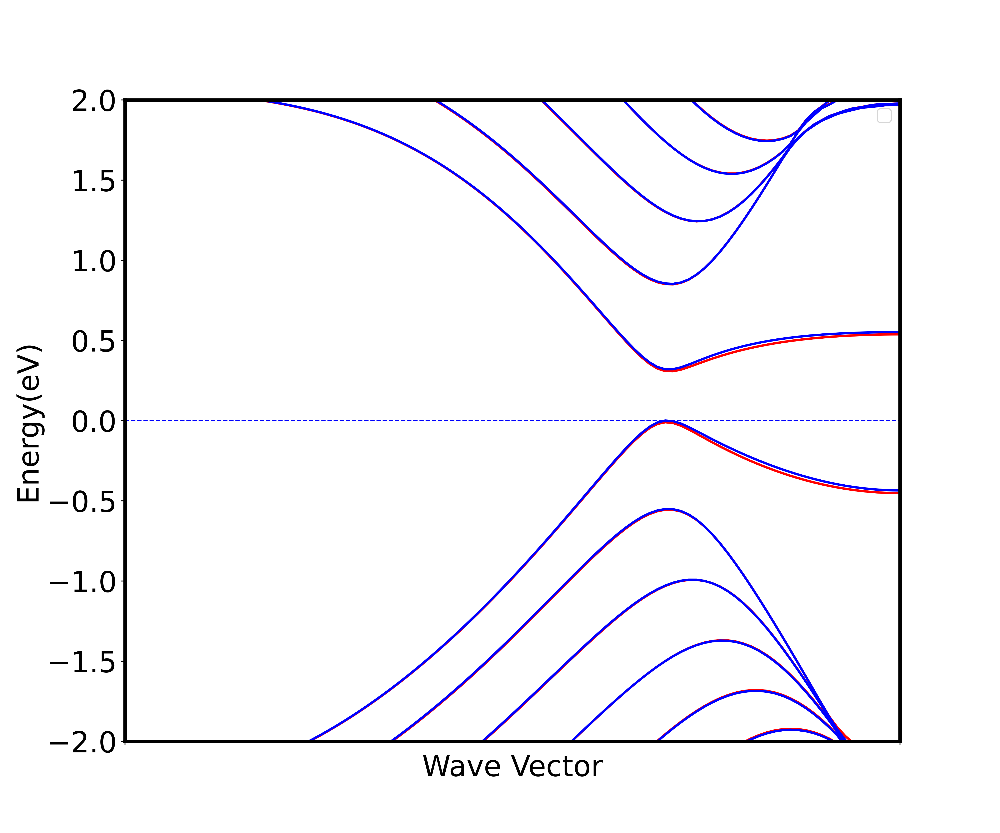

# 采用 ABACUS 进行表面计算（五）：外加电场

<strong>作者：刘裕，邮箱：liuyu@stu.pku.edu.cn</strong>

<strong>审核：陈默涵，邮箱：mohanchen@pku.edu.cn</strong>

<strong>最后更新时间：2023/08/28</strong>

# 一、介绍

电场是电荷及变化磁场周围空间里存在的一种特殊物质。这种物质与通常的实物不同，它虽然不是由分子原子所构成的，但它却是客观存在的特殊物质，具有通常物质所具有的力和能量等客观属性。许多材料在外加电场作用下会表现出不同寻常的性质，例如：铁电体在外加电场的作用下会产生电极化，也可以通过施加的电场来控制磁性和自发极化，因此在信息储存和传输中有广泛应用；二维材料（如石墨烯）在外加电场下表现出不同的电子性质和可控制的物理性质，这种特性使其具有在电子学领域的广泛应用前景。在电子结构计算中，周期性边界条件下对体系施加电场较为容易，而施加磁场则困难很多。

因此，外加电场是密度泛函理论（Density Functional Theory，简称 DFT）软件中可以被实现且重要的功能。ABACUS 中实现了在<strong>表面体系</strong>中外加<strong>恒定电场</strong>的功能[1]。注意，在 ABACUS 中，外加电场功能存在相应的原子受力的修正，可以用于平面波（Plane-Wave）基组和数值原子轨道（Numerical Atomic Orbitals）基组计算，但注意该功能只能用于带真空层的表面体系。

本教程中将会展示如何在 ABACUS 计算中使用加电场功能，为使得这个教程较为有趣，我们举一个半金属二维材料 nanoribbon（见图 1）加电场产生半金属的例子来讲解如何给体系添加电场，该 DFT 的计算工作曾发在 2006 年的 Nature 杂志上，具体可参考文献[2]。在这个教程里，我们使用的是数值原子轨道基矢量（Numerical Atomic Orbitals），碳和氢的轨道半径都是 8 a.u.，但实际上也可以使用平面波基矢量，只是前者效率更高所以在这里采用。我们还会使用到电子的自洽场（self-consistent field，简称 SCF）计算，非自洽计算（non-self-consistent field，简称 NSCF），自旋非极化和极化计算等概念。在不考虑自旋时（即设置 `nspin=1` 时），计算出的能带图中没有带隙，为金属；考虑自旋之后，带隙打开，成为半导体；在自旋极化基础上，外加恒定电场之后，其中一个自旋表现为半导体，另一个自旋则为金属。



# 二、软件和算例准备

ABACUS 里关于外加电场的线上文档地址为：

[http://abacus.deepmodeling.com/en/latest/advanced/scf/advanced.html#external-electric-field](http://abacus.deepmodeling.com/en/latest/advanced/scf/advanced.html#external-electric-field)

ABACUS 里关于外加电场参数的线上文档地址为：[https://abacus.deepmodeling.com/en/latest/advanced/input_files/input-main.html#electric-field-and-dipole-correction](https://abacus.deepmodeling.com/en/latest/advanced/input_files/input-main.html#electric-field-and-dipole-correction)

ABACUS 的外加电场算例下载地址为（gitee）：

[https://gitee.com/MCresearch/abacus-user-guide/tree/master/examples/electric_field/](https://gitee.com/MCresearch/abacus-user-guide/tree/master/examples/electric_field/)

可以采用的下载命令是：

```
git clone https://gitee.com/MCresearch/abacus-user-guide
```

下载后解压，之后进入 `/abacus-user-guide/examples/``electric_field` 目录

或者采用 Github 仓库地址：

[https://github.com/MCresearch/abacus-user-guide](https://github.com/MCresearch/abacus-user-guide)

# 三、采用加电场进行二维材料的能带计算

该算例中含有六个文件夹，解释如下：

<strong>1_unspin_scf</strong>：做非自旋极化（`INPUT` 文件中的 `nspin` 设为 1）的自洽场迭代 SCF 计算（`INPUT` 文件中的 `calculation` 设为 scf），输出自洽迭代之后的电子密度（将 `INPUT` 中的 `out_chg` 设为 1），注意二维材料的 KPT 文件，因为超胞大小是 10*2.4595121466*45 Å^3，所以对应的布里渊区 k 点取的是 1*10*1，因为实空间周期长度小的方向对应的布里渊区大，所以需要取更多 k 点得到收敛结果。

<strong>2_unspin_band</strong>：  采用非自洽计算 NSCF（`INPUT` 文件中的 `calculation` 设为 nscf），读入上一个步骤输出的电荷密度（`INPUT` 文件中的 `init_chg` 设为 file），从而可以读入体系的基态电荷密度进行能带计算。

<strong>3_spin_scf</strong>：同 1_unspin_scf 的计算，只是把 `nspin` 设为 2。

<strong>4_spin_band</strong>：同 2_unspin_band 的计算，只是把 `nspin` 设为 2。

<strong>5_spin_elec_scf</strong>：同 3_spin_scf 的计算，只是又外加了电场的参数。

<strong>6_spin_elec_band</strong>：同 4_spin_band 的计算，只是又外加了电场的参数。

以下是算例 5 的输入文件（包含电场参数）：

```bash
INPUT_PARAMETERS
#Parameters (General)
suffix                nanoribbon
calculation           scf
nbands                70
nspin                 2
pseudo_dir            ../../PP_ORB
orbital_dir           ../../PP_ORB

#Parameters (Basis)
basis_type            lcao

#Parameters (Accuracy)
ecutwfc               100
scf_thr               1e-6
scf_nmax              200

#Parameters (Smearing)
smearing_method       gaussian
smearing_sigma        0.001

#Parameters (Charge mixing)
mixing_type           pulay
mixing_beta           0.1
mixing_ndim           20
mixing_gg0            1.5

#Parameters (Efield)
efield_flag           1
efield_dir            2
efield_amp            0.0019440124
efield_pos_max        0.95
efield_pos_dec        0.10
```

以算例提供的 `INPUT` 文件为例，使用外加电场功能只需添加如下参数即可：

- `efield_flag`：类型是 Bool，指定外加电场的开(1)或者关(0)，默认值为 0
- `efield_dir`：类型是 Int，外加电场方向，可取 0，1，2 分别表示 x，y，z 方向，默认值为 2
- `efield_pos_max`：类型是 Real，锯齿状电势最大值所在分数坐标，范围[0,1)，默认值为 0.5
- `efield_pos_dec`：类型是 Real，锯齿状电势从最大值到最小值的长度（同样以分数坐标为度量），默认值为 0.1，范围[0,1)。<strong>以图2为例，0.5 是最大值，0.6 是最小值，那么 0.5 ~ 0.6 的区域必须放置在没有原子的真空层中</strong><strong>，注意这个例子设置的是 0.95 到 0.10 为电场区间。</strong>


- `efield_amp`：类型是 Real，电场强度，默认值为 0，单位为 a.u.，其中 1 a.u. = 51.4220632*10^10 V/m

以上参数的使用方法在[采用 ABACUS 进行表面计算（二）：偶极修正](https://mcresearch.gitee.io/abacus-user-guide/abacus-surface2.html)中有更详细的说明。

# 四、预期计算结果

- 运行完算例 `2_unspin_band` 后会通过非自洽计算得到体系非自旋极化能带图，横坐标是对二维材料布里渊区取 `k` 点，从 `Gamma` 点（坐标为 `0 0 0`）取到$$\pi$$点（坐标为 `0 0.5 0`），取了 100 个 `k` 点算出来的能带图；纵坐标是能级，将费米面设置为 0，取了费米面附近 2 eV 的能量区间画出能带。以下两张图是同样取法。
- 运行完算例 `4_spin_band` 后会得到非自洽计算得到的自旋极化能带图（图 3）。
- 运行完算例 `6_spin_elec_band` 后会得到自旋极化加电场的能带图（图 4），注意这里所加的电场为 0.1 V/Å，由输入文件 INPUT 中的 `efield_amp` 设置，但 `efield_amp` 的单位是 a.u.，需要换算。





# 五、参考文献

[1] Phys. Rev. B <strong>59</strong>, 12301 (1999), [https://doi.org/10.1103/PhysRevB.59.12301](https://doi.org/10.1103/PhysRevB.59.12301)

[2] Nature <strong>444</strong>, 347–349 (2006), [https://doi.org/10.1038/nature05180](https://doi.org/10.1038/nature05180)
