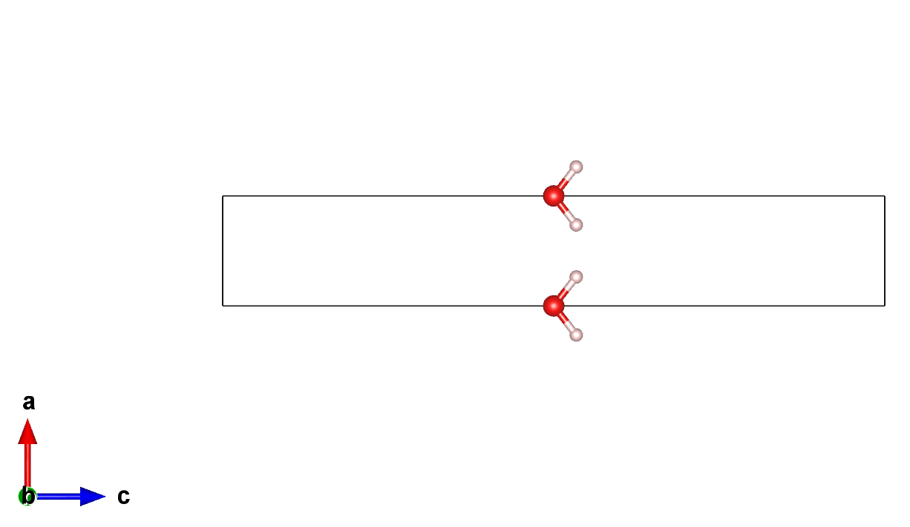
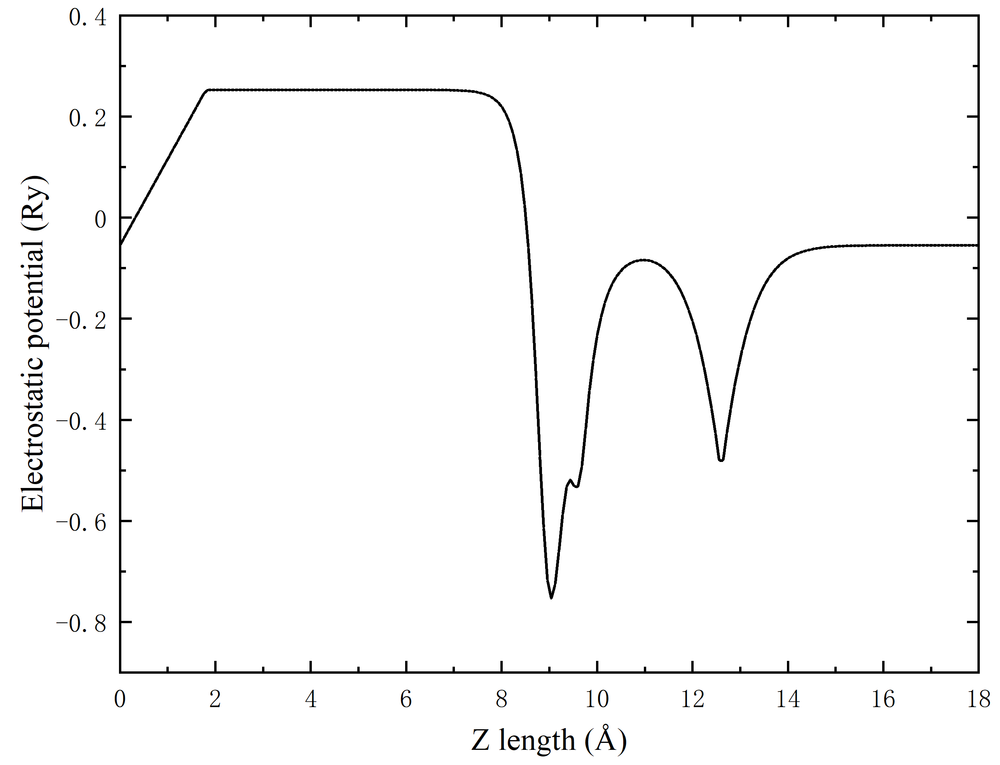

# 采用 ABACUS 进行表面计算（六）：补偿电荷

<strong>作者：刘裕，邮箱：liuyu@stu.pku.edu.cn</strong>

<strong>审核：陈默涵，邮箱：mohanchen@pku.edu.cn</strong>

<strong>最后更新时间：2023/08/28</strong>

# 一、介绍

现实中的化学反应多数时候发生在恒定电势条件下，而传统的 DFT 计算软件则是基于恒定电荷的条件。若要在计算模拟中保持恒定电势，在电化学表面反应建模时就需要调整晶胞中的电子数。在开源密度泛函理论软件 ABACUS 里，模拟体系时使用的是周期性边界条件，因此需要添加额外的算法保持模拟过程中同时保证超胞的电中性。其中的一种方案就是当从系统中添加/提取额外的电子时，需要在表面模型的真空区域中实现补偿电荷的分布。

目前 ABACUS 软件中实现了补偿电荷功能[1]，与增减电子数相对应的补偿电荷会以带电平板的形式（不考虑平板厚度）予以补偿进而保持电中性，并且存在相应的原子受力的修正，可以用于平面波（Plane-Wave）基组和数值原子轨道（Numerical Atomic Orbitals）基组计算，但注意目前该功能只能用于带真空层的表面体系。我们以下的例子以一个水分子为例，如图 1 所示。



# 二、文档与算例

ABACUS 里关于补偿电荷的线上文档地址为：

[http://abacus.deepmodeling.com/en/latest/advanced/scf/advanced.html#compensating-charge](http://abacus.deepmodeling.com/en/latest/advanced/scf/advanced.html#compensating-charge)

ABACUS 里关于补偿电荷参数的线上文档地址为：[https://abacus.deepmodeling.com/en/latest/advanced/input_files/input-main.html#gate-field-compensating-charge](https://abacus.deepmodeling.com/en/latest/advanced/input_files/input-main.html#gate-field-compensating-charge)

ABACUS 的补偿电荷算例下载地址为（gitee）：

[https://gitee.com/mcresearch/abacus-user-guide/tree/master/examples/compensating_charge/H2O](https://gitee.com/mcresearch/abacus-user-guide/tree/master/examples/compensating_charge/H2O)

可以采用的下载命令是：

```bash
git clone https://gitee.com/mcresearch/abacus-user-guide
```

之后进入 `/abacus-develop/``examples/compensating_charge/H2O` 目录

或者采用 Github 仓库地址：

[https://github.com/MCresearch/abacus-user-guide/tree/master/examples/compensating_charge/H2O](https://github.com/MCresearch/abacus-user-guide/tree/master/examples/compensating_charge/H2O)

# 三、偶极修正与补偿电荷结合的表面计算

在[采用 ABACUS 进行表面计算（二）：偶极修正](https://mcresearch.gitee.io/abacus-user-guide/abacus-surface2.html)文档中，我们给出了水分子层计算中应用偶极修正之后的结果。在此基础上，我们可以进一步应用补偿电荷功能。如图 1 所示，我们采用了完全相同的一个水分子在周期性晶胞的结构，只有 `INPUT` 文件中添加了补偿电荷相关参数。

```shell
INPUT_PARAMETERS
#Parameters (1.General)
suffix              H2O
calculation         scf
nbands              8
symmetry            0
pseudo_dir          ../../PP_ORB

#Parameters (2.Iteration)
ecutwfc             100
scf_thr             1e-6
scf_nmax            100

#Parameters (3.Basis)
basis_type          pw

#Parameters (4.Smearing)
smearing_method     gauss
smearing_sigma      0.001

#Parameters (5.Mixing)
mixing_type         broyden
mixing_beta         0.1

#Parameters (6.Dipole correction)
efield_flag         1
dip_cor_flag        1
efield_pos_max      0.0
efield_pos_dec      0.1
efield_amp          0.0

#Parameters (7.Compensating charge)
gate_flag           1
zgate               0.7
nelec               9

#Parameters (8.Output)
out_pot             2
```

以算例提供的 `INPUT` 文件为例，使用补偿电荷功能只需添加如下参数即可：

- `gate_flag`：类型是 Bool，指定补偿电荷功能的开(1)或者关(0)，默认值为 0
- `efield_dir`：类型是 Int，指定与带电平板垂直的方向，可取 0，1，2 分别表示 x，y，z 方向，默认值为 2
- `zgate`：类型是 Real，指定带电平板（位于真空中）在晶胞中的位置（分数坐标），范围[0,1)，默认值为 0.5
- `nelec`：类型是 Real，设定的体系总电子数，这里是 9 个电子（氧原子因为赝势有 6 个电子，每个氢原子有 1 个电子，总共 8 个电子），即原体系多加了 1 个电子，那么为了保持电中性，带电平板会带 1 个正电荷
- `block`：类型是 Bool，添加势垒以防止电子溢出的功能（可选），1 代表开，0 代表关，默认值为 0
- `block_down`：类型是 Real，势垒的起点（分数坐标），默认是 0.45
- `block_up`：类型是 Real，势垒的终点（分数坐标），默认是 0.55
- `block_height`：类型是 Real，势垒高度，单位是里德堡（Rydberg），默认是 0.1

# 四、预期结果

如左下图所示，一个水分子位于超胞（尺寸为 $$3\times3\times18 \mathrm{\AA^3}$$）的中部（即位于$$9 \mathrm{\AA}$$）。按照[采用 ABACUS 进行表面计算（二）：偶极修正](https://mcresearch.gitee.io/abacus-user-guide/abacus-surface2.html)文档中偶极修正参数设置的说明，锯齿即位于 0.0~0.1 的区域。<strong>注意在采用偶极修正/外加电场功能的情况下，带电平板的位置应该在真空区域，并且不同于偶极修正锯齿所在的区域</strong>。

为了验证结果的正确性，我们可以画出静电势沿 `Z` 轴（`c` 方向）的变化如图 2 所示。与只应用偶极修正功能的静电势相比（可参考表面计算二里面的图 3），在分数坐标 0.7（Z 轴 12.6 埃）处，静电势出现了一个向下的凹陷，这来自于此处的补偿电荷带电平板的影响。

静电势计算和作图方法请参考静电势和功函数计算文档。



# 五、参考文献

[1] Phys. Rev. B <strong>89</strong>, 245406 (2014), [https://doi.org/10.1103/PhysRevB.89.245406](https://doi.org/10.1103/PhysRevB.89.245406)
