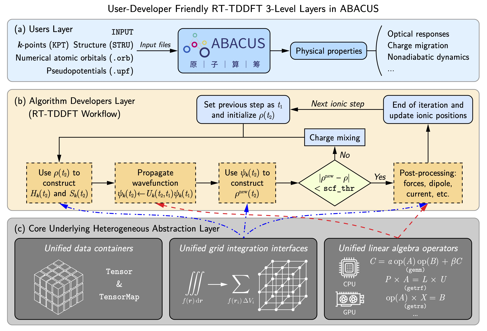
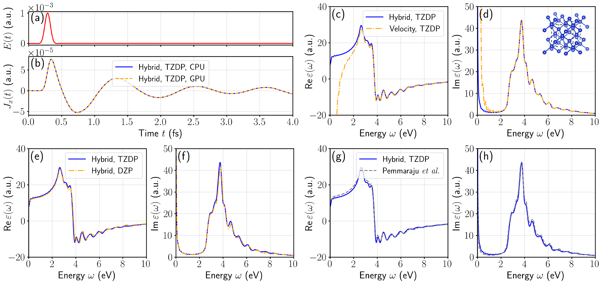
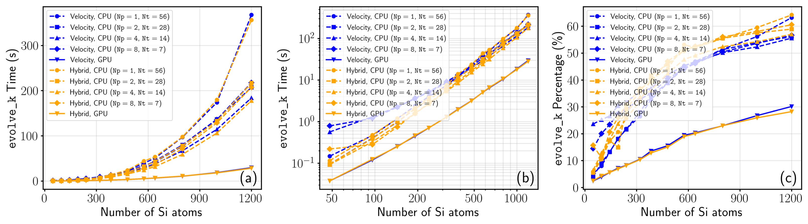
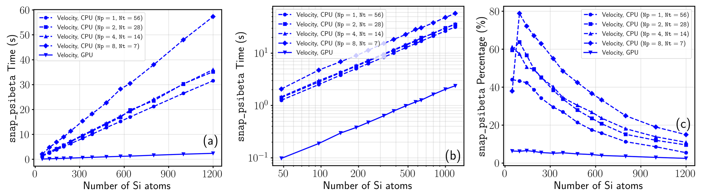

# ABACUS 还能干这个？基于数值原子轨道的 RT-TDDFT 高效异构计算

**作者：包涛尼，邮箱：baotaoni@pku.edu.cn**

**审核：陈默涵，邮箱：mohanchen@pku.edu.cn**

**最后更新时间：2026 年 6 月 22 日**

# 一、简介

近日，来自北京大学、中科大、物理所等单位的合作团队，基于国产开源密度泛函理论软件原子算筹（ABACUS），实现了一种统一的数值原子轨道（NAO）实时含时密度泛函理论（RT-TDDFT）异构计算框架。研究团队通过在ABACUS代码里引入硬件无关的抽象代码层，在保持物理算法代码整洁与可维护性的同时，成功实现了从单节点多核 CPU 到大规模多 GPU 架构的高效跨平台加速。

该框架能够高效计算光学吸收光谱、介电函数等重要光学性质，并支持模拟非绝热 Ehrenfest 离子-电子耦合动力学等物理过程。在精度上，GPU 结果与 CPU 实现数值级别的完全一致，并与现有主流软件基准高度吻合。在效率上，单张 GPU 可实现相较于 56 核双路 CPU 节点 3-4 倍的提速；并且实现了多卡加速，同时维持了较好的并行效率。相比于同类软件，该工作不仅实现了极佳的跨平台移植性和 RT-TDDFT 多卡加速，还从底层异构加速算法上解决了速度规范（Velocity Gauge）在 NAO 基组下的计算瓶颈。相关功能已在 ABACUS v3.9.0.26 及后续版本中正式上线，详见中文文档教程：[ABACUS 实时含时密度泛函理论使用教程（适用 LCAO 基组，v3.9.0.26 及以后）](https://mcresearch.github.io/abacus-user-guide/abacus-tddft-lcao.html)。

相关研究成果以“A unified heterogeneous implementation of numerical atomic orbitals-based real-time TDDFT within the ABACUS package”为题，发表在计算物理领域经典期刊 *Computer Physics Communications* 上（https://doi.org/10.1016/j.cpc.2026.110260）。

# 二、异构加速面临的工程挑战

在模拟飞秒至阿秒量级的超快电子动力学和光与物质相互作用时，RT-TDDFT 是一种极其重要的第一性原理计算方法。随着计算规模和时长的增加，将此类方法向 GPU 等异构加速卡移植成为了必然趋势。

然而，针对局域基组（如数值原子轨道 NAO）的 RT-TDDFT 异构加速在软件工程上面临挑战。首先，开发和维护底层 GPU 代码极其复杂，涉及繁琐的显存管理和特定架构的内核优化，这不仅极易引发内存泄漏等 Bug，也严重阻碍了科学软件的长期可持续发展。其次，当前高性能计算平台百花齐放（涵盖 NVIDIA GPU、AMD GPU 以及国产加速卡等），如果代码与单一硬件厂商的编程模型深度绑定，将失去跨平台移植的灵活性。

# 三、统一的异构计算框架：硬件无关设计

为了解决上述软件工程瓶颈，本工作并未采用在物理逻辑代码中硬编码底层加速指令的传统做法，而是为 ABACUS 重新设计了三层协同的硬件抽象架构：

- 统一的数据容器： 这是整个异构框架的核心。团队设计了支持多维数组的`Tensor`类，它不仅封装了张量形状、数据类型，还将主机端（CPU）和设备端（GPU）的内存分配与释放操作完全接管。基于 RAII（资源获取即初始化）机制，开发者无需手动进行内存管理与主从端数据拷贝，从而在根本上杜绝了指针悬挂和内存泄漏风险。

- 统一的线性代数算子接口： 在`Tensor`容器的基础上，团队封装了一套多态的稠密线性代数算子。该接口会根据硬件环境自动分发至相应的数学库（如 CPU 端的 BLAS/LAPACK，GPU 端的 cuBLAS/cuSOLVER 等）。这使得物理算法的开发者可以专注于波函数演化（例如解 Crank-Nicolson 传播器方程）的物理公式表达，而无需顾虑底层硬件环境。

- 统一的实空间格点积分接口： 针对实空间物理量（如电荷密度、哈密顿量构建）的积分瓶颈，团队设计并实现了统一的异构格点积分接口。值得一提的是，对于速度规范（Velocity Gauge）下引入的随位置变化的相位因子，传统方法在球面格点积分上会产生极大的性能衰减。该框架通过批量化原子级的 GPU 规约算法，实现了速度规范下高效的计算。

# 四、物理验证与计算性能

在物理验证方面，该异构框架展现了极高的可靠性。研究人员测试了从蒽分子到三维体相硅等多种维度的体系，在光学吸收光谱和非绝热 Ehrenfest 分子动力学中，GPU 结果均与 CPU 结果在数值精度上严格重合，且与领域内的基准数据高度吻合。

在性能表现上，该工程架构取得了显著的加速比：

- 单节点性能： 在对包含 1200 个原子的硅超胞进行波函数时间步演化时，单张 NVIDIA A800 GPU 的墙上时间比满载运行的 56 核双路 CPU 节点（Intel Xeon Gold 6348）快了约 3 倍至 4 倍。其中，核心的波函数传播演化模块实现了高达 6 至 7 倍的加速，速度规范下的球面格点积分甚至实现高达 12 倍的加速。

- 多卡扩展性： 借助分布式多 GPU 线性求解器策略，该框架在跨节点的分布式超算集群中表现出极佳的强扩展性。在对 1728 个原子的复杂体系进行模拟时，扩展至 40 张 GPU 依然能维持约 76% 的并行效率。

# 五、总结

本工作通过系统性的架构设计，将底层异构硬件的复杂性对物理算法开发者进行抽象，成功将 ABACUS 的 LCAO 基组 RT-TDDFT 模块进行了异构加速。这种“代码解耦”与“统一接口”的工程思路，不仅为复杂电子动力学的超快模拟提供了强有力的性能支撑，也为未来科学软件拥抱更多异构计算平台和 AI4S 打下了极具扩展性的坚实基础。

本研究工作得到了国家重点研发计划（2025YFB3003603）和国家自然科学基金委卓越研究群体项目（12588301）的资助。多 GPU 强扩展性测试在赛先生（SAI）开源超级计算平台上完成。

# 六、参考文献

[1] Bao, T., Li, Y., Deng, Z., Zhao, H., Lu, D., Huang, Y., Lian, C., He, L., & Chen, M. (2026). A unified heterogeneous implementation of numerical atomic orbitals-based real-time TDDFT within the ABACUS package. *Computer Physics Communications*, 327, 110260. [https://doi.org/10.1016/j.cpc.2026.110260](https://doi.org/10.1016/j.cpc.2026.110260)

[2] Pemmaraju, C. D., Vila, F. D., Kas, J. J., Sato, S. A., Rehr, J. J., Yabana, K., & Prendergast, D. (2018). Velocity-gauge real-time TDDFT within a numerical atomic orbital basis set. *Computer Physics Communications*, 226, 30-38. [https://doi.org/10.1016/j.cpc.2018.01.013](https://doi.org/10.1016/j.cpc.2018.01.013)

