# ABACUS 实时含时密度泛函理论使用教程（适用 LCAO 基组，v3.9.0.26 及以后）

**作者：包涛尼，邮箱：baotaoni@pku.edu.cn**

**审核：陈默涵，邮箱：mohanchen@pku.edu.cn**

**最后更新时间：2026 年 5 月 7 日**

# 零、前言

由于 ABACUS 软件功能的开发和接口的快速迭代，原先的教程文档（ABACUS 实时演化含时密度泛函理论使用教程：[https://mcresearch.github.io/abacus-user-guide/abacus-tddft.html](https://mcresearch.github.io/abacus-user-guide/abacus-tddft.html)）有些内容需要补充。本文档的撰写基于原先的教程，但是会着重介绍最近新添加的功能和方法，例如电子步和离子步的分离、混合规范、杂化泛函以及异构硬件加速等。

实时含时密度泛函理论（real-time time-dependent density functional theory，RT-TDDFT）已经成为模拟激发态电子动力学和光与物质相互作用的重要基石，它超越了传统 Kohn-Sham 密度泛函理论（Kohn-Sham density functional theory，KSDFT）对基态的描述限制。通过在外场（如超快激光脉冲）的作用下显式地演化含时 Kohn-Sham 轨道，RT-TDDFT 能够对非平衡现象进行第一性原理建模，这对于研究飞秒到阿秒时间尺度的超快过程至关重要。随着最新版本 ABACUS 异构计算框架的引入，用户现在可以借助统一的数据容器和底层抽象，在 CPU 或 GPU 等异构硬件上高效地进行大规模的电子演化计算。

完整的 RT-TDDFT 输入参数的细节可参考线上文档：[https://abacus.deepmodeling.com/en/latest/advanced/input_files/input-main.html#rt-tddft-real-time-time-dependent-density-functional-theory](https://abacus.deepmodeling.com/en/latest/advanced/input_files/input-main.html#rt-tddft-real-time-time-dependent-density-functional-theory)

# 一、背景及理论简介

RT-TDDFT 通过直接在时间域内求解含时演化方程，能够捕捉系统瞬态的电子响应。与基于线性响应理论（linear-response TDDFT，LR-TDDFT）的方法不同，RT-TDDFT 不需要预先获取激发态的本征态信息，因此特别适合用于研究线性与非线性的光学响应、电荷迁移以及高次谐波产生（high-harmonic generation，HHG）等复杂的超快动力学过程。

在 RT-TDDFT 的理论框架中，核心任务是求解随时间演化的含时 Kohn-Sham（TDKS）方程：

$$
\mathrm{i}\frac{\partial}{\partial t}\psi_{nk}(r,t)=H(t)\psi_{nk}(r,t)
$$

其中，$$H(t)$$是含时 Kohn-Sham Hamilton 量，$$\psi_{nk}(r,t)$$是随时间演化的 Kohn-Sham 波函数。

在 ABACUS 的 RT-TDDFT 模块中，波函数的计算基于数值原子轨道（numerical atomic orbitals，NAO）基组。在周期性边界条件下，随时间演化的波函数可以展开为类似 Bloch 波的 NAO 线性组合：

$$
\psi_{nk}(r,t)=\sum_{R}\sum_{\mu}c_{n\mu,k}(t)\mathrm{e}^{\mathrm{i}k\cdot R}\phi_{\mu}(r-\tau_{I}-R)
$$

这里$$\phi_{\mu}$$是实空间中的数值原子轨道，$$c_{n\mu,k}(t)$$是随时间变化的轨道系数。

由于数值原子轨道通常是非正交的，当我们将上述连续空间的 TDKS 方程投影到 NAO 基组上时，会自然地引入交叠矩阵（overlap matrix）$$S$$。方程随即转换为以下的矩阵微分形式：

$$
\mathrm{i}\frac{\partial}{\partial t}C_{k}(t)=S_{k}^{-1}H_{k}(t)C_{k}(t)
$$

在这个矩阵方程中：

- 系数向量$$C_k(t)$$：由含时的轨道展开系数$$\{c_{n\mu,k}(t)\}$$组成的列向量，也是我们在实时演化中主要求解和更新的物理量。
- Hamilton 量矩阵$$H_k(t)$$：包含了系统的动能、势能以及外部电磁场相互作用项的矩阵元。由于 Hamilton 量依赖于随时间变化的电子密度，因此它是一个随时间快速变化的矩阵。
- 交叠矩阵$$S_k$$：由非正交的 NAO 基函数计算得到的交叠积分矩阵。

为了在离散的时间步长$$\Delta t$$内推进系统状态，需要引入时间演化算符$$U(t_2,t_1)$$。波函数在下一时刻$$t_2$$的状态可以通过演化算符作用于前一时刻$$t_1$$的状态得到：

$$
\psi_{nk}(r,t_{2})=U_{k}(t_{2},t_{1})\psi_{nk}(r,t_{1})
$$

其中$$\Delta t$$很小时，时间演化算符可以近似为指数形式：

$$
U_k(t_2,t_1)\approx\exp\left[-\mathrm{i}S_{k}^{-1}H_{k}(t^{\prime})\Delta t\right]
$$

在这里，$$t^{\prime}=(t_{1}+t_{2})/2$$代表中间时刻。在实际的数值实现中，时间演化算符里中间时刻的 Hamilton 量采用了中点近似（midpoint approximation）：

$$
H_{k}(t^{\prime})\approx\frac{1}{2}[H_{k}(t_{1})+H_{k}(t_{2})]
$$

这就意味着，计算演化算符不仅需要依赖由上一时刻$$t_1$$保存的 Hamilton 量，还需要获取当前待求时刻$$t_2$$的 Hamilton 量。然而，时刻$$t_2$$的 Hamilton 量依赖于该时刻的电子密度$$\rho(r,t_2)$$，而该密度的构建又反过来需要用到时刻$$t_2$$的波函数$$\psi_{nk}(r,t_2)$$。这一相互依赖的物理关系构成了一个闭环，因此在演化的每一个时间步内，程序必须通过自洽迭代（SCF）程序来确保电荷密度达到收敛。

# 二、传播子的选择

ABACUS 中，时间演化算符（即传播子）$$U_k(t_2,t_1)\approx\exp[-\mathrm{i}S_{k}^{-1}H_{k}(t^{\prime})\Delta t]$$的计算依赖于数值近似。目前，程序中通过参数 `td_propagator` 实现了 3 种不同类型的传播子近似方法供选择：

## Crank-Nicolson 方法（`td_propagator = 0` 或 `3`）

CN 方法是一种无条件稳定的传播子近似，能够很好地保持演化过程的幺正性。其公式表达为：

$$
U_k\approx\frac{S_{k}-\mathrm{i}H_{k}(t^{\prime})\Delta t/2}{S_{k}+\mathrm{i}H_{k}(t^{\prime})\Delta t/2}
$$

在 ABACUS 中，CN 方法提供了两种具体的数值实现途径：

- `td_propagator = 0`（默认值）：显式地求解出传播子$$U_k$$并演化波函数。
- `td_propagator = 3`：将问题转化为求解线性方程组

  $$
  \left(S_k+\frac{\mathrm{i}\Delta t}{2}H_k\right)\psi_{nk}(t+\Delta t)=\left(S_k-\frac{\mathrm{i}\Delta t}{2}H_k\right)\psi_{nk}(t)
  $$

> [!TIP]
> 使用建议：如果你的模拟任务主要在 CPU 上运行并且算得比较慢，建议尝试设置 `td_propagator = 3`。CPU 的实现主要依赖于分布式线性代数库 ScaLAPACK，此求解器直接求解线性方程组通常比显式计算传播子$$U_k$$开销更小。

## 四阶 Taylor 展开法（`td_propagator = 1`）

该方法通过直接对指数算符进行四阶截断的 Taylor 展开来进行近似：

$$
U\approx I+\hat{A}+\frac{1}{2}\hat{A}^{2}+\frac{1}{6}\hat{A}^{3}+\frac{1}{24}\hat{A}^{4}
$$

其中，$$\hat{A}=-\mathrm{i}S_{k}^{-1}H_{k}(t^{\prime})\Delta t$$。此方法在较大的时间步长下可能会破坏演化的幺正性，因此需要仔细测试并选取足够小的时间步长，通常不推荐使用。

## 强制时间反演对称（ETRS）方法（`td_propagator = 2`）

ETRS 方法的基本思想是利用不同时刻的 Hamilton 量进行交替演化，能够更好地保持时间反演对称性：

$$
U\approx\exp\left[-\mathrm{i}S_{k}^{-1}H_{k}(t+\Delta t)\frac{\Delta t}{2}\right]\exp\left[-\mathrm{i}S_{k}^{-1}H_{k}(t)\frac{\Delta t}{2}\right]
$$

在代码实现中，ETRS 内部的指数算符同样是借助四阶 Taylor 展开来计算的。

# 三、规范的选择

在 RT-TDDFT 中描述光与物质相互作用时，外部相互作用是作为经典电磁场引入的（通常忽略磁场效应，只保留电场）。虽然在电动力学理论框架下，不同的标量势和矢量势选择对应相同的物理场，但在实际的数值模拟中，规范的选择会对计算的准确性、适用边界和计算开销产生影响。在 ABACUS 中，当通过设置 `td_vext = 1` 开启含时外场，并通过 `td_vext_dire` 指定电场方向后，用户需要通过参数 `td_stype` 来选择具体的规范形式。

## 长度规范（`td_stype = 0`）

长度规范是最直观的规范选择，它通过在 Hamilton 量中直接引入偶极耦合项$$E(t)\cdot r$$来描述含时电场：

$$
H^{\text{len}}(t) = H_0 + E(t)\cdot r
$$

不过可以看出，由于位置算符$$r$$并不是一个周期函数，它破坏了系统的平移对称性。因此，长度规范无法与周期性边界条件兼容，严格受限于孤立分子、团簇或 surface slab 等有限体系的模拟。

为了恢复体系的周期性边界条件，需要人为地在边界处添加一个反向电场：

$$
E_\mu(x_\mu,t)=\begin{cases}E_\mu(t), & \mathtt{cut1}\leqslant x_\mu \leqslant \mathtt{cut2} \\-E_\mu(t)\left(\dfrac{1}{\mathtt{cut1}+1-\mathtt{cut2}}-1\right), & 0 < x_\mu < \mathtt{cut1}~~\text{or}~~\mathtt{cut2} < x_\mu < 1 \end{cases}
$$

在 ABACUS 的实际参数设置中，上述公式中的$$\mathtt{cut1}$$和$$\mathtt{cut2}$$分别对应参数 `td_lcut1` 和 `td_lcut2`。这两个参数定义了主电场$$E_\mu(t)$$作用的有效区间，默认值分别为 0.05 和 0.95，其数值代表在$$\mu$$方向晶格矢量上的分数坐标。因此，要注意我们关心的物理过程不能发生在主电场有效区间以外的晶胞边界处。

在该规范下，随时间变化的偶极矩$$P(t)$$是可以直接获取并作为主要响应物理量的指标：

$$
P(t) = \int \rho(r, t)r \, \mathrm{d}r
$$

用户可以通过设置 `out_dipole = 1` 来输出偶极矩数据，以供后续通过 Fourier 变换计算光吸收谱。当然，也可以设置 `out_current` 参数来输出电流响应，详见下文。

## 速度规范（`td_stype = 1`）

对于周期性体系，通常采用速度规范。该规范通过含时矢量势$$A(t)$$来引入电场，满足$$E(t)=-\partial_t A(t)$$，从而 Hamilton 量

$$
H^{\text{vel}}(t) = \frac{1}{2} \left[ -\mathrm{i}\nabla + A(t) \right]^2 + V_{\text{H}} + V_{\text{xc}} + V_{\text{ps}}
$$

仍天然地保持周期性。在此规范下，偶极矩定义失效，自然的光学响应物理量是宏观电流密度$$J(t)$$，可以通过设置 `out_current` 参数进行输出：

$$
J(t) = -\frac{1}{\Omega N_k} \sum_{nk} f_{nk} \ \mathrm{Re} \Braket{\psi_{nk}(t) | -\mathrm{i}\nabla + A(t) + \mathrm{i}\left[\widetilde{V}_{\text{NL}}, r\right] | \psi_{nk}(t)}
$$

其中，电流支持两种不同的计算方式：

- `out_current = 1`：使用传统的双中心积分进行计算，通常算得更快；
- `out_current = 2`：使用更精确的矩阵对易方法，但通常会算得更慢一些，详见参考文献 [1]。

同时，支持通过 `out_current_k = 1` 输出各个 k 点的分量。

值得一提的是，由于规范变换的存在，非局域赝势项的矩阵元不能使用长度规范中的双中心积分的形式，必须转而使用更耗时的实空间球面格点积分，这会导致额外的计算开销，具体公式可以阅读参考文献 [2]。因此通常来说，速度规范相比于长度规范计算速度稍微慢一些。

## 混合规范（`td_stype = 2`）

为了解决 NAO 基组下速度规范的吸收谱低频发散问题并兼顾计算效率，ABACUS 实现了新近提出的混合规范方法。此功能从版本 [v3.9.0.10](https://github.com/deepmodeling/abacus-develop/releases/tag/v3.9.0.10) 开始支持。

混合规范巧妙地在每个原子中心$$\tau_\mu$$处引入了一个相对局域相位因子$$\mathrm{e}^{-\mathrm{i}A(t)\cdot(r-\tau_\mu)}$$，将数值原子轨道规范变换为

$$
\phi_\mu(r) \to \mathrm{e}^{-\mathrm{i}A(t)\cdot(r - \tau_\mu)} \phi_\mu(r)
$$

公式中的位移项$$r-\tau_\mu$$确保了积分在空间上的有界性和周期性。此时 Hamilton 量矩阵元相应地变换为

$$
H_{\mu\nu}^{\text{hyb}}(t) = \mathrm{e}^{-\mathrm{i}A(t)\cdot(\tau_\mu - \tau_\nu)} \Braket{\phi_\mu | H_0 + E(t) \cdot (r - \tau_\nu) | \phi_\nu}
$$

这种处理不仅有效缓解了速度规范中吸收谱低频发散的数值问题，同时非局域赝势项的矩阵元重新恢复了高效的双中心积分形式，免除了实空间球面格点积分的计算开销，因此整体计算效率上和长度规范相当。具体细节详见文献 [3]。

因此在日常计算中，对于具有周期性边界条件的体系，如果想要计算体系的 UV-Vis 吸收谱等（计算中需要保持离子位置固定的）性质，我们强烈推荐优先使用混合规范。然而由于混合规范的公式和实现较为复杂，目前 ABACUS 还不支持混合规范下的求力和分子动力学。

在输出控制方面，混合规范同样依赖电流响应。用户需按照与速度规范相同的参数（如 `out_current`）来提取电流等关心的物理量并进行后处理。

# 四、使用电子步和离子步分离功能来加速计算

从版本 [v3.9.0.10](https://github.com/deepmodeling/abacus-develop/releases/tag/v3.9.0.10) 开始，ABACUS 的 RT-TDDFT 算法添加了电子步和离子步分离的功能。

这一功能的核心在于引入了 `estep_per_md` 和 `td_dt` 两个新参数，允许在一个离子步（MD 步）的周期内执行多个电子波函数的演化步。在 Ehrenfest 分子动力学框架下，离子的运动积分与电子的传播循环本身就是解耦的，仅需要在特定的时间步进行同步。

在以往的版本中，如果我们需要固定离子位置计算体系的吸收谱，通常会使用以下 INPUT 参数组合：

```
calculation           md
esolver_type          tddft
md_type               nve
md_nstep              10000
md_dt                 0.00242
```

这代表以 0.00242 fs 的步长演化 10000 步 RT-TDDFT。但在这种常规设置下，程序在每一步电子波函数演化后，都会默认执行一次分子动力学的后处理，也就是计算原子的受力等信息。对于离子位置严格固定的模拟任务来说，这无疑带来了极大的额外开销。

利用电子步和离子步分离功能，对于完全相同的固定离子位置的计算任务，我们可以将 INPUT 参数优化为：

```
calculation           md
esolver_type          tddft
md_type               nve
md_nstep              1
td_dt                 0.00242
estep_per_md          10000
```

顾名思义，所谓的电子步和离子步分离指的就是 `estep_per_md` 参数。上述第二种参数设置下，程序的实际效果是只会运行 1 步 MD，但在这 1 个离子步内部，电子波函数会以 `td_dt = 0.00242`（单位：fs）的步长连续传播 10000 步。

这几个相关参数的底层关联逻辑如下：

- `estep_per_md`：定义了两个相邻离子步之间进行的电子传播步数，默认值为 1。
- `td_dt`：专门用于电子传播的时间步长（单位为 fs）。当你显式设置了 `td_dt` 时，程序会在内部自动将总的离子步长 `md_dt` 覆盖重置为 `td_dt * estep_per_md`；如果未在 INPUT 中显式声明 `td_dt`，其默认值会自动推导为 `md_dt / estep_per_md`。
- `md_nstep` 和 `md_dt`：分别控制分子动力学（离子运动）的总步数与步长。

对于离子位置固定的计算场景（例如计算 UV-Vis 吸收谱），这种参数分离的设置能够省去绝大部分不必要的计算量。它彻底跳过了每个电子步演化后成本较高的求力等后处理过程，从而让计算资源完全集中在电子波函数的演化上，显著提升整体的模拟效率。

# 五、使用杂化泛函计算 RT-TDDFT

在典型的 RT-TDDFT 模拟中，时间演化通常基于局域密度近似（local-density approximation，LDA）或广义梯度近似（generalized gradient approximation，GGA）的波函数进行。然而，这些泛函固有的离域化误差不仅限制了基态性质的准确性，同样也会影响激发态动力学的计算表现。这在描述固体中的激子动力学时尤为明显。为了有效减少离域化误差，可以引入包含部分非局域 Hartree-Fock 交换能（HF exchange）的杂化泛函。特别是分程杂化泛函（range-separated hybrid，RSH），由于能更准确地描述交换关联势的长程渐近行为，被证明可以提升光学响应和激发态性质的预测精度。相关内容可以阅读参考文献 [1]。

因此，ABACUS 从版本 [v3.9.0.24](https://github.com/deepmodeling/abacus-develop/releases/tag/v3.9.0.24) 开始支持使用杂化泛函来计算 RT-TDDFT。但也要注意，使用杂化泛函计算此类长时间的含时演化代价是非常昂贵的，计算前需要仔细评估计算耗时和收益。

在使用 RT-TDDFT 的杂化泛函功能之前，我们建议先阅读下面的中文文档：

- ABACUS+LibRI 做杂化泛函计算教程：[https://mcresearch.github.io/abacus-user-guide/abacus-libri.html](https://mcresearch.github.io/abacus-user-guide/abacus-libri.html)

LCAO 基组下使用杂化泛函需要带 LibRI 库进行编译，这一点要额外注意。

带 LibRI 库编译成功后，在 ABACUS 中开启杂化泛函的计算非常简便，主要通过在 INPUT 文件中显式指定 `dft_functional` 参数来实现。该参数一旦设定，将自动覆盖赝势文件中自带的泛函类型。

你可以直接使用预设的缩写来调用对应的杂化泛函。例如 `hf`（纯 Hartree-Fock）或 `pbe0`。如果编译时链接了 Libxc 库，将解锁更多高级杂化泛函的支持，例如：`hse`（对应 HSE06）、`b3lyp`、`lc_pbe`、`lc_wpbe`、`cam_pbeh` 等。

# 六、使用 GPU 进行计算加速

ABACUS 从版本 [v3.9.0.1](https://github.com/deepmodeling/abacus-develop/releases/tag/v3.9.0.1) 开始支持 RT-TDDFT 的单 GPU 计算加速，而从版本 [v3.9.0.26](https://github.com/deepmodeling/abacus-develop/releases/tag/v3.9.0.26) 开始支持 RT-TDDFT 的多 GPU 计算加速。代码在中间进行过若干 bug 修复以及性能优化，因此我们推荐使用 v3.9.0.26 及以后的新版本进行 GPU 计算。

无论是单卡还是多卡加速，都需要首先在 INPUT 文件中将计算设备指定为 GPU（如果已经成功编译了 GPU 版的 ABACUS，这应该会被设置为默认参数）：

```
device                gpu
```

## 使用常规的单卡加速功能

对于常规体系的单 GPU 计算，RT-TDDFT 的底层演化主要依赖标准的 CUDA 环境以及单节点的数学库。

在编译阶段，仅需按照 ABACUS 官方文档的说明开启基础的 GPU 编译选项即可，无需引入复杂的分布式数学库依赖。相关问题可以参考以下中文文档：

- 编译 NVIDIA GPU 版本的 ABACUS：[https://mcresearch.github.io/abacus-user-guide/abacus-gpu.html](https://mcresearch.github.io/abacus-user-guide/abacus-gpu.html)
- ABACUS LCAO 基组 GPU 版本使用说明：[https://mcresearch.github.io/abacus-user-guide/abacus-gpu-lcao.html](https://mcresearch.github.io/abacus-user-guide/abacus-gpu-lcao.html)

在成功编译后，要在实际计算中激活单卡加速，需要在 INPUT 文件中进一步指定相应的单卡求解器（如果已经成功编译了 GPU 版的 ABACUS，这应该会被设置为默认参数）：

```
ks_solver             cusolver
```

## 使用多卡加速功能

对于包含数百乃至上千个原子的大规模超胞体系，单块 GPU 的显存和算力往往会成为瓶颈。为了支持此类大规模计算，ABACUS 引入了基于 NVIDIA cuBLASMp 和 cuSOLVERMp 库的多 GPU 分布式并行求解方案。

在编译阶段，由于多卡波函数演化过程中涉及到高昂的跨设备稠密线性代数求解，这部分功能对底层库的版本有严格的依赖：

- cuBLASMp：要求版本 >= v0.8.0（2026 年 2 月及以后发布）。
- cuSOLVERMp：要求版本 >= v0.7.0（2025 年 8 月及以后发布）。

版本依赖设定比较严格，原因是我们在开发测试中发现老版本的 cuBLASMp 和 cuSOLVERMp 存在恶性 bug，在特定硬件、环境和计算体系中有概率出现进程锁死、计算错误导致不收敛等各种问题。因此目前的多 GPU 支持强制依赖新的 NCCL（NVIDIA Collective Communication Library）后端，不兼容较老的 CAL（Communication Abstraction Library）后端。

在开始编译前，我们建议先阅读下面的中文文档：

- ABACUS 的多 GPU 矩阵求解器功能编译与使用：[https://mcresearch.github.io/abacus-user-guide/abacus-multigpu.html](https://mcresearch.github.io/abacus-user-guide/abacus-multigpu.html)

在配置编译环境时，必须在 CMake 阶段同时开启这两个多 GPU 库的编译开关。配置命令示例如下：

```bash
cmake -DUSE_CUDA=ON -DENABLE_CUSOLVERMP=ON -DENABLE_CUBLASMP=ON ...(其他必要编译参数)
```

其中，常规的 LCAO 多卡计算只需开启 `-DENABLE_CUSOLVERMP=ON`，但 RT-TDDFT 需要额外设置 `-DENABLE_CUBLASMP=ON`。CMake 脚本会自动解析头文件以检测版本号。如果检测到库版本过低（例如不满足 NCCL 后端要求），或者仅开启了 `-DENABLE_CUBLASMP=ON`，CMake 将会报错并中断配置。

在成功编译支持多 GPU 的版本后，若要在实际计算中激活多 GPU 求解器，需在 INPUT 文件中将求解器显式修改为：

```
ks_solver             cusolvermp
```

在运行配置上，多 GPU 计算通常遵循“一个 MPI 进程绑定一块 GPU”的资源映射策略，否则，NVIDIA cuBLASMp 和 cuSOLVERMp 库可能会出现未定义行为。例如，若单台计算节点拥有 4 块 GPU，则可以通过 `mpirun -np 4` 启动 4 个 MPI 进程，同时可以在每个 MPI 进程下分配适当的 OpenMP 线程以处理未卸载到 GPU 的 CPU 串行任务（例如 4 MPI × 14 OpenMP 线程）。多 GPU 库会自动接管 RT-TDDFT 演化步骤中耗时最大的$$\mathcal{O}(N^3)$$稠密矩阵操作。

关于底层统一异构计算框架的设计、实空间格点积分的 GPU 优化以及多 GPU 分布式线性代数求解的具体算法实现细节，以及相应的物理和性能测试结果，详见参考文献 [2]，这里不再赘述。

# 七、实战：计算 UV-Vis 吸收谱

## 理论

利用 RT-TDDFT 计算光吸收谱的基本思路，是对处于基态的体系施加一个微弱的含时微扰电场（通常采用脉冲电场），并在此电场作用下实时演化电子波函数。根据模拟体系边界条件的不同，我们可以分别提取不同的宏观响应物理量来计算其光谱特性。

对于孤立的分子或团簇等有限体系，我们主要关注体系受微扰后产生的诱导偶极矩$$P(t)$$。通过记录其随时间的变化并进行 Fourier 变换得到频域下的偶极矩响应$$P(\omega)$$，进而可以计算出体系的动态极化率$$\alpha(\omega)$$：

$$
\alpha_{\mu\nu}(\omega) = \frac{P_\mu(\omega)}{E_\nu(\omega)}
$$

其中$$E_\nu(\omega)$$是施加外场的 Fourier 变换分量。体系的光学吸收截面与动态极化率张量的虚部成正比。对于气体分子或溶液体系，其实际吸收截面表现为在各个方向上的平均响应。这意味着我们需要求取极化率张量的迹：

$$
\mathrm{Re}\,\overline{\sigma}(\omega) \propto \frac{\omega}{3}\mathrm{Im}\,\mathrm{Tr}[\alpha(\omega)] = \frac{\omega}{3} \mathrm{Im} \left[ \alpha_{xx}(\omega) + \alpha_{yy}(\omega) + \alpha_{zz}(\omega) \right]
$$

因此，在计算有限体系的光学吸收时，由于分子的振子强度高度依赖于其在坐标系中的相对取向，我们通常需要分别沿$$x,y,z$$三个相互正交的方向独立施加微扰电场，获取相应的三个偶极响应并求平均，才能得到准确的吸收谱。

对于具有周期性边界条件的延伸固体体系，偶极矩的绝对定义失效，我们转而利用宏观电流密度$$J(t)$$来描述光学响应。通过在速度规范或混合规范下引入含时电场，记录体系演化产生的含时电流密度，对其进行 Fourier 变换得到$$J(\omega)$$，即可直接计算出材料的光学电导率张量$$\sigma(\omega)$$：

$$
\sigma_{\mu\nu}(\omega) = \frac{J_\mu(\omega)}{E_\nu(\omega)}
$$

进一步，通过电动力学关系，可以将光学电导率与材料的复数介电函数$$\varepsilon(\omega)$$联系起来：

$$
\varepsilon_{\mu\nu}(\omega) = \delta_{\mu\nu} + \frac{4\pi \mathrm{i}}{\omega} \sigma_{\mu\nu}(\omega)
$$

固体材料的 UV-Vis（紫外-可见光）吸收光谱特征主要由其宏观介电函数的虚部$$\mathrm{Im}[\epsilon(\omega)]$$决定。由此可见，在同一套含时波函数演化框架下，通过合理选择规范和响应物理量，RT-TDDFT 能够统一且高效地处理从孤立分子到三维晶体的激发态光学吸收。

## 计算参数设置

以下以孤立的乙酸（CH₃COOH）分子计算为例，详细说明相关的输入文件及核心参数设置。如果需要计算晶体固体的吸收谱，只需将晶胞结构、k 点设置以及输出物理量（如开启 `out_current`）进行相应替换即可。

### 结构文件（STRU）

可以看到，我们把分子体系放在大约 10 Å 的真空层中。实际生产环境计算中，真空层可能还要取得更大一些。

```
ATOMIC_SPECIES
C   12.011        C.upf
O   15.999        O.upf
H   1.008         H.upf

NUMERICAL_ORBITAL
C_gga_10au_100Ry_3s3p2d.orb
O_gga_10au_100Ry_4s4p3d2f.orb
H_gga_10au_100Ry_3s2p.orb

LATTICE_CONSTANT
1.8897261258369282

LATTICE_VECTORS
10.6409030000000      0.00000000000000      0.00000000000000      
0.00000000000000      10.6409030000000      0.00000000000000      
0.00000000000000      0.00000000000000      10.6409030000000      

ATOMIC_POSITIONS
Direct

C
0.00000000000000
2
0.44716584485400 0.52664480260700 0.49593014615400 0 0 0 mag 0.0 
0.58706252467500 0.50456791683900 0.49593052206200 0 0 0 mag 0.0 

O
0.00000000000000
2
0.39521094967200 0.62766000780200 0.49593052206200 0 0 0 mag 0.0 
0.38274875543900 0.41649644395800 0.49593071001600 0 0 0 mag 0.0 

H
0.00000000000000
4
0.61388834951300 0.44938547602600 0.57926856207600 0 0 0 mag 0.0 
0.61388787962800 0.44937542048800 0.41259887248300 0 0 0 mag 0.0 
0.63629509450500 0.59508072388200 0.49592525935100 0 0 0 mag 0.0 
0.29413400159700 0.43982388148800 0.49593136785500 0 0 0 mag 0.0
```

体系的分子结构如下：

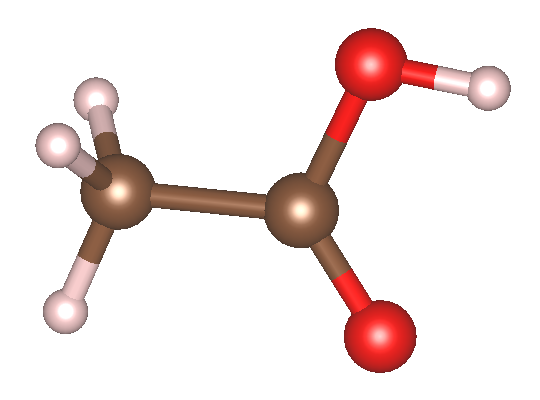

> [!TIP]
> 基组选择提示：在针对激发态的 RT-TDDFT 计算中，对基组的完备性要求远高于常规基态计算。使用较小尺寸的基组（例如 8 au 及以下的截断半径、DZP 及以下的轨道类型）往往无法提供足够的变分自由度。根据经验测试，较差的轨道质量是导致计算出的谱线发生非物理蓝移的主要原因之一。强烈建议至少使用 10 au 的 TZDP 及以上级别的轨道。对于高精度激发态演化，推荐使用 ABACUS APNS 计划推出的第三代轨道（[https://www.aissquare.com/datasets/detail?pageType=datasets&name=ABACUS-APNS-PPORBs-v1%253Apre-release&id=326](https://www.aissquare.com/datasets/detail?pageType=datasets&name=ABACUS-APNS-PPORBs-v1%253Apre-release&id=326)）。轨道相关的细节可以参见文献 [4]，不同基组对体系吸收谱精度的影响可以参见文献 [2]。

### K 点文件（KPT）

```
K_POINTS
0
Gamma
1 1 1 0 0 0
```

由于目标是孤立分子，我们在 STRU 中设置了真空层，因此仅需使用$$\Gamma$$点采样即可。对于晶体材料的计算，请务必根据实际情况使用足够密集的 k 点网格。通常来说，RT-TDDFT 中电流的计算要求的 k 点要比基态 SCF 更密集一些。

### 输入参数文件（INPUT）

这里我们使用 PBE 泛函进行计算。

```
INPUT_PARAMETERS
pseudo_dir            ./
orbital_dir           ./
basis_type            lcao

ecutwfc               100
calculation           md
esolver_type          tddft

scf_thr               1e-7

device                cpu

md_type               nve
md_nstep              1
td_dt                 0.00484
estep_per_md          8000

dft_functional        pbe

td_vext               1
td_vext_dire          1
td_stype              0

td_propagator         3

td_ttype              0
td_tstart             1
td_tend               8000
td_lcut1              0.01
td_lcut2              0.99
td_gauss_freq         2.0
td_gauss_phase        0
td_gauss_sigma        0.05
td_gauss_t0           60
td_gauss_amp          0.05142

out_efield            1
out_dipole            1
out_current           1
```

INPUT 文件包含了 RT-TDDFT 演化的核心控制逻辑，其中有几项关键的参数设置技巧：

- 演化步长控制：利用电子步和离子步分离功能（`md_nstep = 1` 配合 `estep_per_md = 8000`），将全部算力集中在纯电子波函数演化上以节省分子动力学相关开销。电子演化时间步长 `td_dt`（或未单独指定时的 `md_dt`）通常推荐设置在 0.005 fs 左右，最大可以在 0.01 fs 这个量级，不宜再大。步长过大会导致传播子的指数近似失效，从而引入能量漂移和演化误差。这个需要根据实际需求进行测试和设置。
- 规范与方向：对于孤立的乙酸分子，采用长度规范（`td_stype = 0`）。示例中 `td_vext_dire = 1` 表示沿$$x$$轴施加电场。在实际研究中，需另外准备两份将 `td_vext_dire` 改为 2 和 3 的输入文件进行计算，最后将三个方向提取的极化率做平均。
- 时域外场设计：设置 `td_ttype = 0` 采用 Gauss 脉冲电场。在实时演化中，理想的光场注入应当从 0 开始平滑过渡。Gauss 波包自然地提供了一个从零到峰值再衰减回零的缓变包络，能够有效避免由于电场突变导致的数值问题。如果使用 Heaviside 阶梯电场，最好也要确保一开始电场是 0，然后再施加阶梯电场，最后再撤掉电场。

  - 场强换算：`td_gauss_amp` 定义了外场的最大振幅（此处为 0.05142 V/Å）。一般而言，如果 Gauss 包络的振幅设置为 0.0274 V/Å，其对应于宏观激光功率密度约 $$10^{10}\,\mathrm{W/cm^2}$$，可用公式$$\frac{1}{2}c\varepsilon_0E^2$$ 进行估算。
  - 中心时间：`td_gauss_t0` 这个参数需要额外注意，它的单位是“步数”而非“时间”，因此 `td_gauss_t0 = 60` 代表电场的中心时间是 `td_gauss_t0`×`td_dt`= 60 × 0.00484 = 0.2904 fs。当你改变演化步长时，要想保持电场不变，必须同时调整 `td_gauss_t0` 对应的步数。
  - 频域覆盖：参数 `td_gauss_freq`（中心频率）和 `td_gauss_sigma`（时域展宽）共同决定了脉冲的频域特征。在设计脉冲参数时，必须确保外场经 Fourier 变换后的频域包络$$E(\omega)$$在你所关心的吸收谱线范围内具有非零且足够大的振幅。例如，若需获取 80~200 nm（约 6~16 eV）的吸收特征，Gauss 脉冲的频谱就必须完整覆盖该能量区间。由于极化率或电导率的计算中$$E(\omega)$$处于分母位置，如果目标高能区间的场强频域分量过小，数值除法会成倍放大微小的舍入误差，导致求得的吸收谱线在高能尾部出现非物理的发散或“爆炸”。例如，下面是该 INPUT 文件对应的电场的时域（左）和频域（右）。可以看到其频域覆盖了相当广阔的范围：
    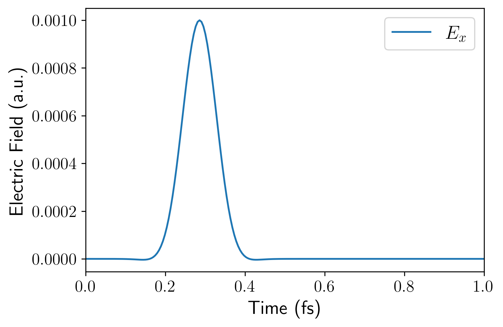
    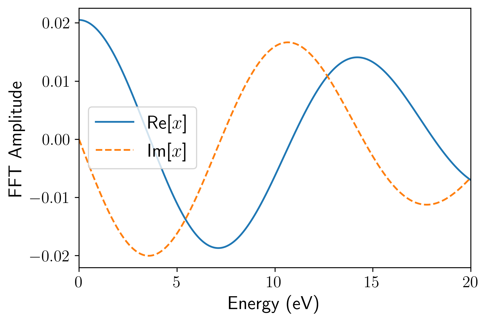
- 输出控制：开启响应物理量的输出记录（分子体系通常使用 `out_dipole = 1` 获取偶极矩，晶体体系则开启 `out_current` 获取电流）。同时需要开启 `out_efield = 1`，它能输出外加电场的时间序列。后续这些输出都需要用于后处理。

## 后处理

完成 RT-TDDFT 的波函数演化后，我们需要对输出的时域偶极矩（或电流）和电场数据进行 Fourier 变换，以获取频域的光学吸收谱。为了简化这一流程，在 ABACUS 源代码仓库的 `tools/rt-tddft-tools/` 目录下提供了一个 Python 后处理脚本 `plot_absorption.py`。该脚本集成了零填补（zero-padding）和指数衰减窗口（exponential decay window）等信号处理技术，能够有效抑制时间序列的截断误差并平滑谱线，同时内置了 Kramers-Kronig 关系的合理性检验功能。

在使用前，请确保你的 Python 环境中已安装 `numpy`、`scipy` 和 `matplotlib`。假设你按照前面的参数完成了计算，设置了时间步长为 0.00484 fs，总步数为 8000 步，且电场沿$$x$$方向施加。保存的电场文件为 `OUT.ABACUS/efield_0.txt`，偶极矩输出为 `OUT.ABACUS/dipole_s1.txt`，可以通过以下命令行运行脚本：

```bash
python plot_absorption.py \
  --material_name "CH\textsubscript{3}COOH" \
  --td_dt 0.00484 \
  --step_start 0 \
  --step_end 8000 \
  --direc 0 \
  --efield_path ./OUT.ABACUS/efield_0.txt \
  --dipolefile ./OUT.ABACUS/dipole_s1.txt \
  --system_type dipole_sigma
```

### 关键参数说明

- `--td_dt`：必须与 INPUT 中设置的电子演化时间步长保持严格一致（单位：fs）。
- `--step_end`：截取进行 Fourier 变换的最大演化步数。
- `--direc` 和 `--efield_path`：指定极化方向及对应的电场文件路径（0 对应$$x$$，1 对应$$y$$，2 对应$$z$$，注意和 ABACUS INPUT 的 `td_vext_dire` 有所区别）。
- `--system_type`：控制响应物理量的计算逻辑。孤立分子体系计算光学电导率时选用 `dipole_sigma`（基于偶极矩，ABACUS 计算时需要打开 `out_dipole = 1`），对于周期性固体体系则选用 `current_sigma`（基于电流，ABACUS 计算时需要打开 `out_current = 1`）。此外还提供了 `dipole_epsilon`（基于偶极矩）、`current_epsilon`（基于电流）两种计算光学介电函数的选项。

### 输出文件与二次后处理

脚本运行结束后，会在当前目录下生成一系列可视化图表，包括：

- `dipole.png`/`efield_time.png`：时域的偶极矩响应与外加电场波形。
  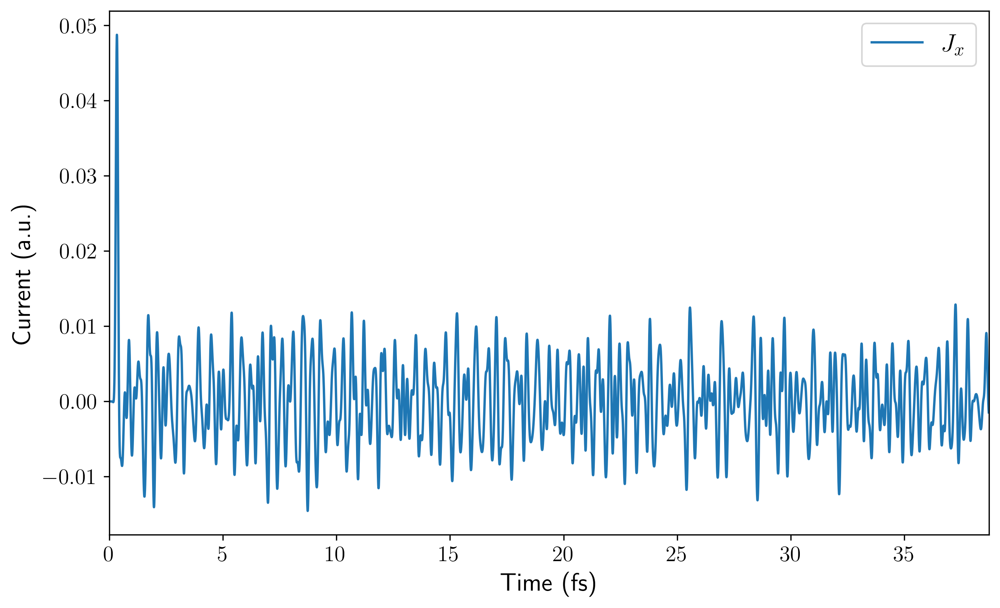
  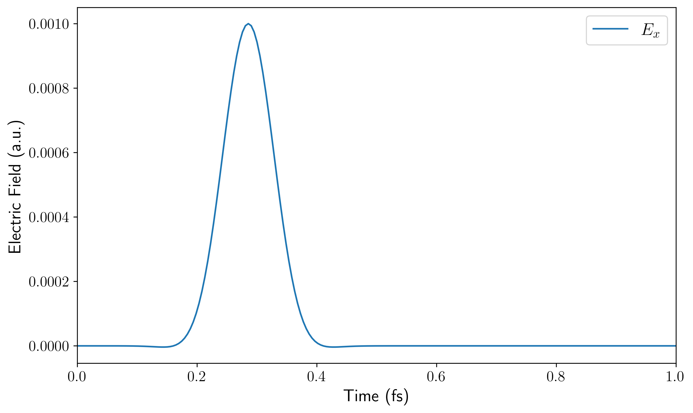
- `dipole_fourier.png`/`efield_fourier.png`：偶极矩响应与施加电场的频域分布，可用于排查电场的频域覆盖范围是否足够。
  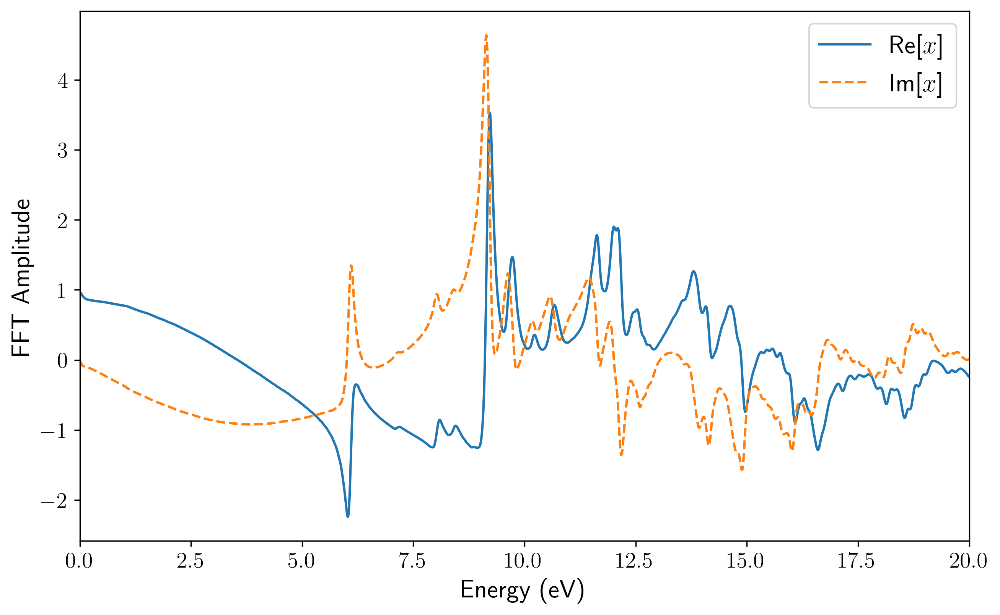
  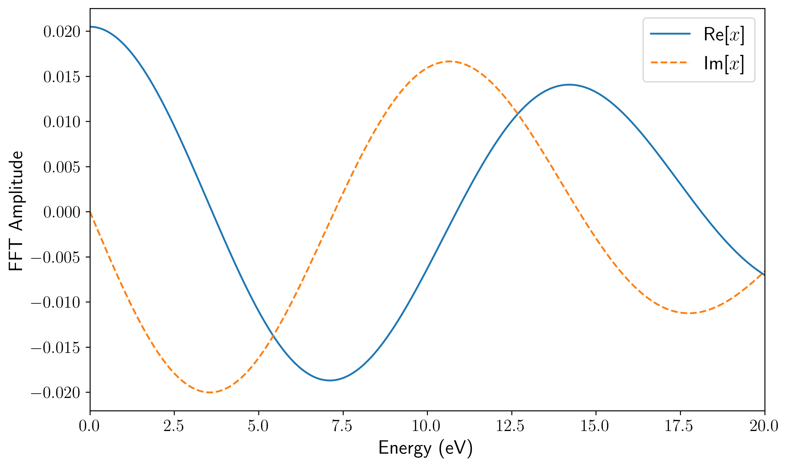
- `abs.png`/`abs_wavelength.png`：分别以能量（eV）和波长（nm）为横坐标的光学吸收谱。
  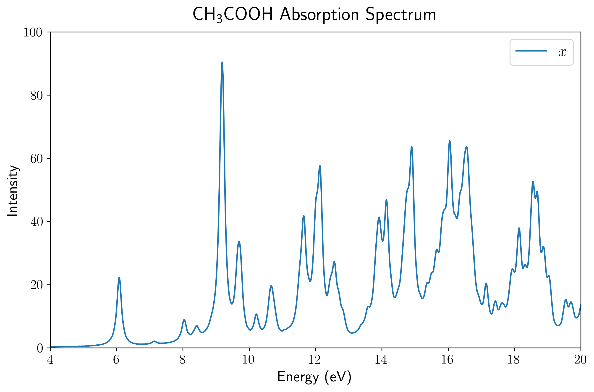
  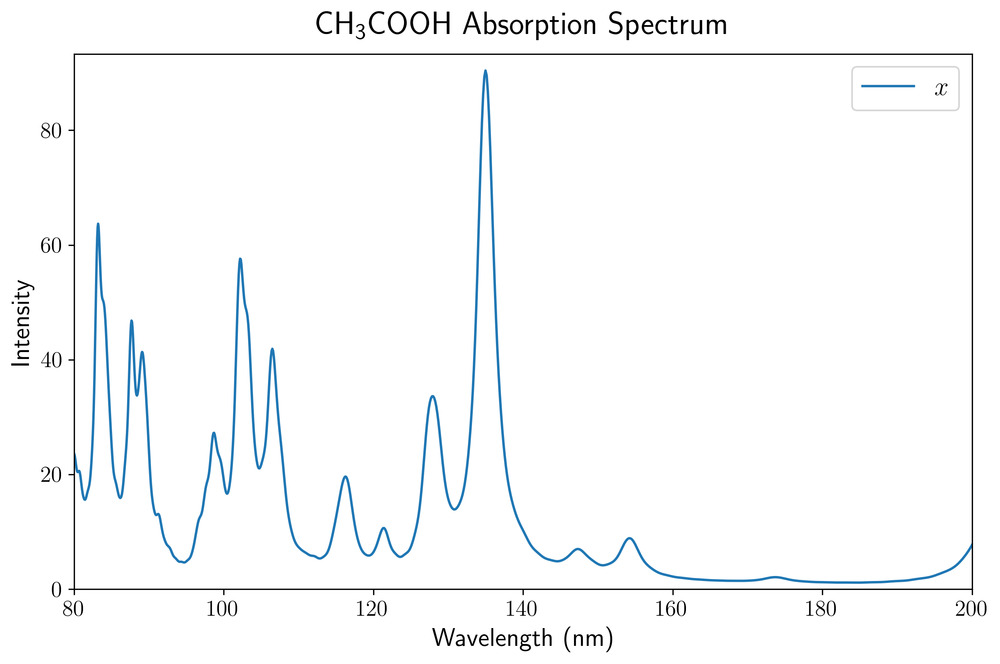
- `kk_check.png`：Kramers-Kronig 关系检验图，用于评估提取到的实部与虚部频域数据的物理自洽性。

除了直接生成上述图像供快速预览外，该脚本最核心的输出是一个名为 `abs_dat.txt` 的纯文本数据文件。该文件完整且格式化地记录了经过信号处理与 Fourier 变换后的核心频域结果，其数据列依次包含：能量（Energy, eV）、波长（Wavelength, nm）以及各个方向上的吸收强度（$$\alpha_x$$, $$\alpha_y$$, $$\alpha_z$$）。不过，如果你的电场只加了$$x$$方向，那么这一次计算中只有$$\alpha_x$$这一列的数据才是真实可用的，因为$$y$$和$$z$$方向没有电场，从而响应很小。因此还应该分别单独计算$$y$$方向和$$z$$方向，并相应地得到$$\alpha_y$$和$$\alpha_z$$（而不能用$$x$$方向电场算出的$$\alpha_y$$和$$\alpha_z$$）。

在实际的科研工作和论文图表制作中，直接使用脚本生成的预览图往往无法满足排版要求。此时，你可以直接提取 `abs_dat.txt` 中的数据，将其导入到 Origin、Excel、Gnuplot 或其他你所习惯的数据分析与绘图软件中，进行自定义的高质量二次绘图。当然，该后处理脚本的逻辑完全开源且结构清晰，如果你熟悉 Python，也十分鼓励直接修改脚本源代码，以定制专属的绘图样式和拓展后处理分析功能。

## 结果展示

通过上述后处理脚本对输出的偶极矩数据进行处理，我们可以直观地展示乙酸分子的 UV-Vis 吸收光谱。

首先，由于孤立分子的空间取向具有各向异性，电场施加在晶胞的不同方向上会激发出完全不同的偶极响应。 第一张图展示了使用 PBE 泛函计算得到的乙酸分子分别在$$x,y,z$$三个主轴方向上的吸收谱分量（虚线），以及对这三个分量进行平均后得到的最终吸收谱（蓝色实线）。在实际的 UV-Vis 光谱测量中，气体或溶液中分子的取向是完全随机分布的，因此只有经过平均后的光谱才对应于宏观可观测的各向同性真实吸收截面。

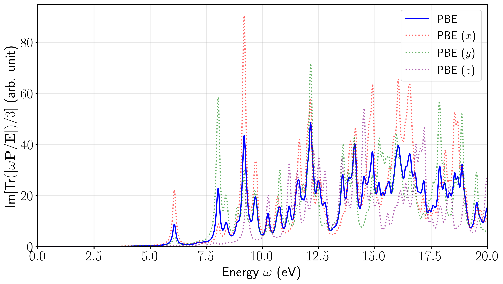

当然，也可以根据自己的习惯，选择在波长坐标（nm）下进行绘制。

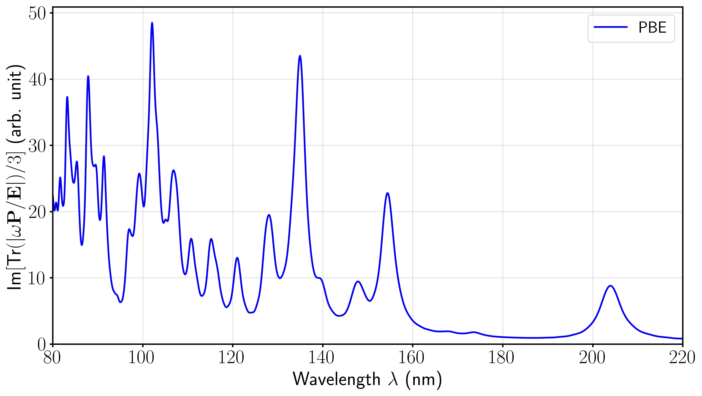

# 八、总结

我们在本文档中系统地介绍了 ABACUS 中 RT-TDDFT 模块的最新核心功能与使用方法。从底层异构硬件的单卡及多卡 GPU 并行加速、提升模拟效率的电子步与离子步分离技术，到新提出的混合规范，以及提高激发态能量预测精度的杂化泛函支持，这些新特性的引入极大地拓宽了 ABACUS 在激发态动力学领域的应用边界。结合计算乙酸分子 UV-Vis 吸收谱的实战案例，我们展示了从输入文件参数配置、规范选择到频域数据后处理的完整工作流。

借助统一的异构计算框架与底层抽象，用户现在能够以极具优势的计算成本，在各类主流硬件平台上开展大尺度、长时间的光与物质相互作用模拟。ABACUS 开发团队将持续推进实时演化算法的深度优化与功能拓展，欢迎广大用户在实际科研应用中积极尝试这些新特性，并通过 GitHub 等开源社区反馈使用建议或参与代码贡献，共同推动大尺度第一性原理超快电子动力学模拟的前沿发展。

# 参考文献

[1] Y. Ji, H. Zhao, P. Lin, X. Ren, L. He, Real-time time-dependent density functional theory simulations with range-separated hybrid functionals for periodic systems (2025). arXiv:2512.18754.

[2] T. Bao, Y. Li, Z. Deng, H. Zhao, D. Lu, Y. Huang, C. Lian, L. He, M. Chen, A Unified Heterogeneous Implementation of Numerical Atomic Orbitals-Based Real-Time TDDFT within the ABACUS Package (2026). arXiv:2603.21835.

[3] H. Zhao, L. He, Hybrid Gauge Approach for Accurate Real-Time TDDFT Simulations with Numerical Atomic Orbitals, Journal of Chemical Theory and Computation 21 (7) (2025) 3335–3341.

[4] Y. Huang, Z. Jin, L. Zhang, M. Chen, R. Chen, L. Li, Systematically Improvable Numerical Atomic Orbital Basis Using Contracted Truncated Spherical Waves (2026). arXiv:2603.13995.
