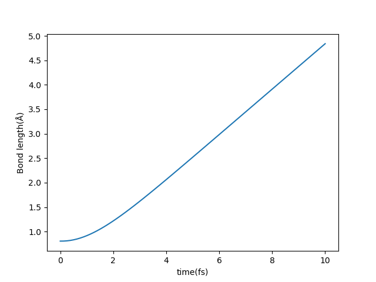

# ABACUS 实时演化含时密度泛函理论使用教程

<strong>作者：赵昊天，邮箱：zaotian@mail.ustc.edu.cn</strong>

<strong>审核：包涛尼，邮箱：baotaoni@pku.edu.cn</strong>

<strong>最后更新时间：2024 年 7 月 11 日</strong>

## <strong>一、背景</strong>

实时演化含时密度泛函理论（Real-time Time-Dependent Density Functional Theory，简称 rt-TDDFT）是一种基于第一性原理的模拟激发态电子体系动态演化的方法。与传统的密度泛函理论（DFT）不同，rt-TDDFT 是建立在 Runge-Gross 定理之上，主要研究时间依赖的 Kohn-Sham 方程（TDKS 方程）。该理论通过构建时间传播子迭代求解 TDKS 方程，直接演化电子的波函数。此外，它还采用半经典的 Ehrenfest 动力学来模拟离子实的运动，可以实时地得到激发电子态以及离子位置的信息，因此具有较为广泛的应用前景。

周期性体系具有能带结构，而非周期性的原子或分子体系则具有离散能级。体系的基态是指价电子从低到高依次填充至能带或能级中。当体系吸收特定能量后，低能态的电子跃迁至高能态，此时体系便处于激发态。研究激发态性质是 TDDFT 的一大优势，因此掌握如何模拟体系的激发态变得尤为关键。ABACUS 为此提供了两种方式：一种是直接改变占据数，使得叠加态的波函数拥有更多高能态分量；另一种是向一个处于基态的体系施加一个外加电场，为其提供激发所需的能量。下面将分别介绍这两种方式的具体使用。文档中提到的算例可以在如下仓库中找到：[https://gitee.com/mcresearch/abacus-user-guide/tree/master/examples/tddft](https://gitee.com/mcresearch/abacus-user-guide/tree/master/examples/tddft)

有关 TDDFT 输入参数的细节可参考输入参数线上文档：[https://abacus.deepmodeling.com/en/latest/advanced/input_files/input-main.html#tddft-time-dependent-density-functional-theory](https://abacus.deepmodeling.com/en/latest/advanced/input_files/input-main.html#tddft-time-dependent-density-functional-theory)

## <strong>二、在ABACUS 中使用rt-TDDFT时改变电子的占据数</strong>

算例：[https://gitee.com/mcresearch/abacus-user-guide/tree/master/examples/tddft/occupation](https://gitee.com/mcresearch/abacus-user-guide/tree/master/examples/tddft/occupation)

算例输入文件 INPUT 设置如下：

```bash
INPUT_PARAMETERS
#Parameters (1.General)
suffix              H2_ocp
calculation         md
esolver_type        tddft
nbands              5
nspin               1
pseudo_dir          ../../../tests/PP_ORB
orbital_dir         ../../../tests/PP_ORB

#Parameters (2.Iteration)
ecutwfc             60
scf_thr             1e-6
scf_nmax            100

#Parameters (3.Basis)
basis_type          lcao
gamma_only          0

#Parameters (4.Smearing)
smearing_method     gauss

#Parameters (5.MD Parameters)
md_type             nve
md_nstep            1000
md_dt               0.05
md_tfirst           0

#Parameters (6.TDDFT Occupation Parameters)
ocp                 1
ocp_set             1 1 0 0 0
```

具体参数设置请参考线上文档，这里仅对部分重要参数进行说明：

- `gamma_only`：必须设置为 `0`，`gamma_only` 为 `1` 会采用 double 类型计算，rt-TDDFT 使用传播子迭代计算波函数，需要 complex 类型存储数据，不兼容 `gamma_only` 为 `1` 的情况。
- `basis_type`：必须设置为 `lcao`，目前 ABACUS 仅支持基于数值原子轨道基组的 rt-TDDFT 功能。
- `nbands`：能带数，由于 `ocp_set` 需要手动设置每一条能带的占据数到最高带，建议手动设置 `nbands`，防止二者不对应。
- `calculation`：必须为 `md`，同时一般 MD（Molecular Dynamics）计算所需的参数都需要设置，这部分参数会对应 rt-TDDFT 的离子实运动的计算。
- `esolver_type`：`tddft`，表示采用 rt-TDDFT 求解器。
- `ocp`：改变占据数功能的开关，为 `1` 的时候开启。
- `ocp_set`：占据数的设置，`1 1 0 0`` 0` 表示这个算例所计算的五条能带，各自占据的电子数，其总和为 2，代表 H₂ 的两个价电子，可以简化为 `2*1 ``3``*0`。另外，对于有多个 k 点的体系，ABACUS 支持对各个 k 点单独设置占据数。假设体系拥有 5 条能带，2 个 k 点，则 `ocp_set` 需要指定 10 个数值，前五个代表第一个 k 点五条能带的占据，后五个代表第二个 k 点五条能带的占据。

按照分子轨道理论，两个 H 原子的原子轨道发生相互作用形成一条成键轨道、一条反键轨道，H₂ 分子的基态占据可以表示为 `2 0 0 0`` 0`，最低的能态代表成键轨道，则 `1 1 0 0`` 0` 占据数表示将一个电子从成键轨道上激发到反键轨道，会导致 H₂ 分子发生解离。通过输出目录 `OUT.H2_ocp/STRU` 下的结构文件，可以看到随着时间的推移，两个 H 原子逐渐解离。运行 occupation 文件夹下的算例，通过 ASE-ABACUS 读取各个时刻 STRU 文件，并计算了两个 H 原子实时的间距$$d$$，结果如下图所示：



为了说明这个解离是由于改变占据数引起的，可以将 INPUT 替换为 occupation 文件夹中的 INPUT-1，其中 `ocp_set` 被改为：`2 0 0 0`` 0`，同样输出实时的原子间距，可以看到，两个原子间距稳定的振荡，并未发生解离：


## <strong>三、ABACUS 中使用rt-TDDFT 外加电场计算材料吸收谱</strong>

在任意外加电场的影响下，rt-TDDFT 能够实时模拟并获得材料的电子态和离子位置信息。按照 Runge-Gross 定理（相当于 KSDFT 中的 Hohenberg-Kohn 定理），这等价于材料的全部物理性质。在众多的物理性质中，吸收谱作为材料基本的光电响应性质，处理简单，结果直观，可参考对比的数据丰富，很适合用于介绍 TDDFT 外加电场功能的基本细节。

### <strong>3.1 规范选择</strong>

如何加入电场存在规范问题，根据电动力学的知识：

$$
\boldsymbol{E} = -\nabla V -\frac{\partial \boldsymbol{A}}{\partial t}
$$

第一种是长度规范，把电场的影响归为纯标势的影响，向势场中加入：

$$
V\propto \boldsymbol{E} \cdot \boldsymbol{r}
$$

因为晶胞很小，按照通常所用的光的波长，体系内的电场在空间上是近似匀强的，故这里没有写成积分的形式。这种形式相对简单，需要处理的项较少，程序处理较快，但是由于$$\boldsymbol{r}$$的存在，它在周期性体系的边界是不连续的，只能采用锯齿状的方式在边界下降来衔接这种不连续性。对于非周期性体系，边界存在真空层，这种锯齿状衔接不会影响到材料的响应，但是对周期性体系，这种做法就行不通了。

对于周期性体系必须采用速度规范，它用矢势而非标势来引入电场：

$$
\boldsymbol{A}(t)\propto\int_0^{t} \boldsymbol{E}(t')\,\mathrm{d}t'
$$

在这种规范下，需要对正常的项进行一系列变换，这里不详细论述，想进一步了解的可以参考文献 [2](https://doi.org/10.1016/j.cpc.2018.01.013) 的内容。因而，我们实际上在程序里用的并不是直接的电场，而是标势或者矢势，但是它们都对应一个电场，程序指定电场的参数而不是势场的参数，这样可以统一处理长度和速度规范的场。

简单来说：长度规范只能处理非周期性体系，但是速度较快；速度规范可以处理周期性体系和非周期性体系，但是速度较慢，故一般建议对非周期性体系采用长度规范，周期性体系采用速度规范。

### <strong>3.2 长度规范示例</strong>

算例：[https://gitee.com/mcresearch/abacus-user-guide/tree/master/examples/tddft/absorption_H2_length](https://gitee.com/mcresearch/abacus-user-guide/tree/master/examples/tddft/absorption_H2_length)

输入文件 INPUT：

```bash
INPUT_PARAMETERS
#Parameters (1.General)
suffix              H2_absoprion
calculation         md
esolver_type        tddft
pseudo_dir          ../../../tests/PP_ORB
orbital_dir         ../../../tests/PP_ORB

#Parameters (2.Iteration)
ecutwfc             60
scf_thr             1e-6
scf_nmax            100

#Parameters (3.Basis)
basis_type          lcao
gamma_only          0

#Parameters (4.Smearing)
smearing_method     gauss

#Parameters (5.MD Parameters)
md_type             nve
md_nstep            1000
md_dt               0.005
md_tfirst           0

#Parameters (6.Efield Parameters)
td_vext             1
td_stype            0

td_tstart           1
td_tend             1000

td_vext_dire        3 3
td_ttype            0 0
td_gauss_freq       3.66 1.22
td_gauss_phase      0.0 0.0
td_gauss_sigma      0.2 0.2
td_gauss_t0         300 300
td_gauss_amp        0.01 0.01

#Parameters (7.Output)
out_chg             1
out_efield          1
out_dipole          1
```

其他的注意事项和占据数一样，这里注意补充一些电场参数的细节：

- `md_nstep`：MD 步，这里为了做演示只用了 1000 步，演化总时长 5 fs，为了精度考虑，实际计算时应当增加步数，具体视所需体系有所差异，一般保证 20 fs 以上总时长较为妥当。
- `td_vext`：外加电场的开关，`1` 为打开外加电场。
- `td_stype`：规范的选择，`0` 为长度规范，`1` 为速度规范。
- `td_tstart`：开始加入电场的步数，在 `td_tstart` 步之前，为无电场状态，一般为 `1` 即可。
- `td_tend`：电场结束的步数，`td_tend` 后不再计算电场，用于无电场时节约资源，最大可以等同 `md_nstep` 的值。`td_tend` 后，标势为 0，而矢势固定为 `td_tend` 处的值不再变化。
- `td_type`：电场的波包形状，`0`-`3` 分别对应高斯、梯形、三角、阶跃等不同类型的电场。
- `td_gauss_xxx`：由于这里指定的是高斯型，对应高斯型的参数，具体可以参考输入参数的说明文档：[https://abacus.deepmodeling.com/en/latest/advanced/input_files/input-main.html#tddft-time-dependent-density-functional-theory](https://abacus.deepmodeling.com/en/latest/advanced/input_files/input-main.html#tddft-time-dependent-density-functional-theory)
- `out_dipole`：输出每个时刻的电偶极矩，我们通过对电偶极矩的分析得到吸收谱。
- `out_efield`：输出每个时刻的电场。

注意，这里为了覆盖更大的频率范围，通过对电场形式的参数多加一列的方式，在一次计算中加入了两个不同频率的电场。理论上可以用这种方式得到各种形状的场，当加的较多时，支持采用正则表达式 `m*x` 的形式进行简化。

运行算例，会输出全时刻的电偶极矩文件 `SPIN1_DIPOLE`，如果 `nspin` 为 2 则会有 `SPIN2_DIPOLE` 文件分别对应两种自旋的电子各自的电偶极矩；以及电场文件 `efield_x.dat`，`x` 的数量视所加的电场数量而定，这个算例就是两个：`efield_0.dat` 和 `efield_1.dat`。不考虑单位，通过下列公式得到分子的吸收谱信息：

$$
\alpha_i(\omega)=\frac{\displaystyle\int D_i(t)\mathrm{e}^{\mathrm{i}\omega t}\,\mathrm{d}t}{\displaystyle\int E_i(t)\mathrm{e}^{\mathrm{i}\omega t}\,\mathrm{d}t}
$$

$$D_i$$为$$i$$方向的电偶极矩，$$E_i$$为$$i$$方向的电场。程序自带了相应的后处理功能，具体请参考 `tools``/``plot-tools` 下的说明进行使用，其结果如下：


这表明在$$z$$方向加的电场激发了一个频率为 8.5 eV 左右的吸收峰。

### <strong>3.3 速度规范示例</strong>

算例：[https://gitee.com/mcresearch/abacus-user-guide/tree/master/examples/tddft/absorption_H2_velocity](https://gitee.com/mcresearch/abacus-user-guide/tree/master/examples/tddft/absorption_H2_velocity)

速度规范的流程与长度规范基本相同，主要不同的参数有两个：

- `td_stype`：变为了 `1`，代表进行速度规范计算。
- `out_current`：输出电流的开关。对无限大的周期性体系无法定义电偶极，采用电流来代替，公式可以参考本文的参考文献 [2](https://doi.org/10.1016/j.cpc.2018.01.013)。简单来说：

$$
I(t)\propto\frac{\mathrm{d}D(t)}{\mathrm{d}t}
$$

因此在傅里叶变换时：

$$
D(\omega)\propto\frac{I(\omega)}{\mathrm{i}\omega}
$$

因此二者可以得到类似的结果，不过 current 的结果由于分母的原因，在极低频时会无法避免的发散。相应的问题在文献 [3](https://link.aps.org/doi/10.1103/PhysRevB.85.045134) 中有讨论。

## <strong>四、参考文献</strong>

1. Meng S, Kaxiras E. <em>Real-Time, Local Basis-Set Implementation of Time-Dependent Density Functional Theory for Excited State Dynamics Simulations</em>[J]. The Journal of Chemical Physics, 2008, 129(5), [https://doi.org/10.1063/1.2960628](https://doi.org/10.1063/1.2960628) .
2. Pemmaraju C D, Vila F D, Kas J J, et al. <em>Velocity-Gauge Real-Time TDDFT Within a Numerical Atomic Orbital Basis Set</em>[J]. Computer Physics Communications, 2018, 226: 30-38, [https://doi.org/10.1016/j.cpc.2018.01.013](https://doi.org/10.1016/j.cpc.2018.01.013) .
3. Yabana K, Sugiyama T, Shinohara Y, et al. <em>Time-Dependent Density Functional Theory for Strong Electromagnetic Fields in Crystalline Solids</em>[J]. Physical Review B, 2012, 85(4): 045134, [https://link.aps.org/doi/10.1103/PhysRevB.85.045134](https://link.aps.org/doi/10.1103/PhysRevB.85.045134) .
