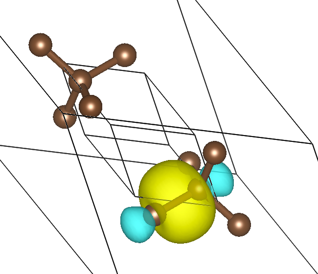

# ABACUS+Wannier90 使用教程

<strong>作者：刘人熙，邮箱：rxliu@stu.pku.edu.cn</strong>

<strong>审核：陈默涵，邮箱：mohanchen@pku.edu.cn</strong>

<strong>最后更新时间：2023/11/09</strong>

# 教程使用说明

Wannier 函数是周期性晶格势场中局域表象下的波函数，Wannier 函数在 1937 年由 Gregory H. Wannier 提出，它可以通过傅立叶变换和布洛赫波函数互相转换。Wannier 函数对于理解半导体、过渡金属、分子晶体等价电子局域程度比较高的凝聚态系统有重要帮助，因而在物理中有广泛的应用。

在 ABACUS 等密度泛函理论（Density Functional Theory，简称 DFT）软件中，单电子近似下的布洛赫波函数可以通过自洽迭代求解 Kohn-Sham 方程得到。但是布洛赫波函数存在规范不确定性，进而导致 Wannier 函数[1-4]也不是唯一的。1997 年到 2001 年间，Nicola Marzari、David Vanderbilt 和 Ivo Souza 等人发展了最大局域化的 Wannier 函数（Maximally localized Wannier function, 简称 MLWF）的方法[1,2,4]，提出可以通过优化 Wannier 表象下的电子位置的方差（即 spread 函数）来确定一个规范，在该规范下 Wannier 函数是最局域的；该方法可以在 DFT 电子结构计算完之后以后处理的方式实现计算 MLWF。2008 年，用于产生 MLWF 的 Wannier90 软件发布，并在随后几年获得了广泛的应用。

本教程分为两部分，第一部分 [最大局域化 Wannier 函数方法简介](https://mcresearch.gitee.io/abacus-user-guide/algorithm-wannier.html) 介绍最大局域化 Wannier 函数的算法，主要介绍 1997 年和 2001 年的两篇 PRB 文章中提出的优化算法，侧重物理与算法原理；第二部分即本文档，是 Wannier90 软件的 ABACUS 接口说明，主要介绍如何使用 ABACUS 计算 Wannier90 需要的输入文件，侧重具体软件使用。

# 一、Wannier90 软件介绍

Wannier90 软件[5-7]是 Arash A. Mostofi 同 Marzari、Vanderbilt 等人在 2008 年写的做 Wannier 函数最局域化的 Fortran 语言写成的软件，目前是做 Wannier 函数最局域化的主流软件。在 Wannier 函数方面，Wannier90 软件可以输出 Wannier 函数的中心（负电中心），也可以画出 Wannier 函数的等值面图像。除了做 Wannier 函数相关的计算，Wannier90 还具有计算能带与态密度、Berry Phase、输运性质等方面的功能，程序的下载和使用方法可以参考其官网：[Wannier90](https://wannier.org/)。

# 二、使用 ABACUS 准备 Wannier90 需要的文件

目前的 ABACUS 平面波基组功能支持 Wannier90 接口，LCAO 的接口还在完善中。

使用 Wannier90 接口不需要编译 ABACUS 过程中做额外操作。

## 1. ABACUS 软件的输入参数解释

| <strong>参数名</strong>    | <strong>默认值</strong> | <strong>变量类型</strong> | <strong>参数解释</strong>                                                                                                                                                             |
| -------------------------- | ----------------------- | ------------------------- | ------------------------------------------------------------------------------------------------------------------------------------------------------------------------------------- |
| towannier90                | 0                       | bool                      | 是否打开 Wannier90 接口的计算功能                                                                                                                                                     |
| nnkpfile                   | seedname.nnkp           | string                    | Wannier90 产生的 nnkp 文件的路径，nnkp 文件包含了 k 点邻居关系等计算 mmn 和 amn 文件必要的信息。                                                                                      |
| wannier_spin               | up                      | string                    | 输出向上/向下的波函数及其内积                                                                                                                                                         |
| out_wannier_mmn            | 1                       | bool                      | 是否输出 `mmn` 文件，`mmn` 文件存储了$M_{mn}^{\mathbf{k,b}}$，即布洛赫波函数之间的内积。mmn 文件在计算 Wannier 最局域化时必须输出。                                                        |
| out_wannier_amn            | 1                       | bool                      | 是否输出 `amn` 文件，`amn` 文件存储了$A_{mn}$，即初猜的 Wannier 函数和布洛赫波函数之间的内积。在 Wannier 最局域化计算中最好有该文件（可以加快优化迭代的收敛），也可以没有。                |
| out_wannier_eig            | 1                       | bool                      | 是否输出 `eig` 文件，`eig` 文件存储了各个 k 点、各个能带的本征能量。在计算输出能带时需要输出，如果不需要输出能带则不需要输出该文件。                                                     |
| out_wannier_unk            | 1                       | bool                      | 是否输出 `UNK` 文件，`UNK` 文件存储了布洛赫波函数$u_{n\mathbf{k}}$。计算 Wannier 函数最局域化，输出 Wannier 函数的中心和 spread 不需要波函数信息。只有画 Wannier 函数图像时需要 UNK 文件。 |
| out_wannier_wvfn_formatted | 1                       | bool                      | 输出的 UNK 文件是否是文本文件。非文本文件即二进制文件，输出速度会比文本文件快很多。                                                                                                   |

在运行 ABACUS+wannier90 程序前，需要准备自洽计算（SCF）的输入文件、非自洽计算（NSCF）的输入文件和 Wannier90 的输入文件，ABACUS 的输入文件有如下注意事项：

1. <strong>自洽计算：</strong>需要注意 `INPUT` 中一定要指定 `out_chg` 参数为 1，即输出电荷密度，以供给非自洽计算计算使用；
2. <strong>非自洽计算：</strong>需要注意 INPUT 中需要把 `init_charge` 参数设置为 `file`，即读取文件中的电荷密度；一定要指定 `towannier90` 参数为 1，同时指定 `nnkpfile` 参数为 Wannier90 产生的 nnkp 文件的地址；另外需要注意 `KPT` 文件中的布里渊区 `k` 点要和 Wannier90 输入文件中的 `k` 点一模一样，所以最好手动输入 K 点坐标指定；
3. <strong>非自洽计算：</strong>INPUT 中有 `out_wannier_mmn`、`out_wannier_amn`、`out_wannier_eig`、`out_wannier_unk`、`out_wannier_wvfn_formatted` 五个控制 Wannier90 相关文件输出的参数，默认值都是 1，其中 `out_wannier_eig` 和 `out_wannier_mmn` 是必须打开的，`out_wannier_unk` 和 `out_wannier_amn` 在需要使用 Wannier90 绘制波函数图时需要打开，`out_wannier_wvfn_formatted` 控制输出的 UNK 文件是文本文件还是二进制文件，输出文本文件的时间成本和存储空间都会比较大，输出二进制文件的时间开销和存储开销则会相对较小。

## 2. 运行流程

这里给出了运行 ABACUS+wannier90 的一个脚本文件，结合 `examples/interface_wannier90/` 中的例子讲解结合 ABACUS 和 Wannier90 计算最局域化 Wannier 函数的完整运行流程，这里的流程对平面波基组和原子轨道基组均适用，原子轨道基组的 NSCF 会比平面波基组慢一些。

```bash
export W90=wannier90.x
export ABACUS=abacus
export NP=12

# 1. 运行Wannier90软件，生成nnkp文件；
cd wannier
mpirun -np $NP $W90 -pp diamond.win

# 2. 运行ABACUS软件，执行电子结构的自洽计算；
cd ../ABACUS
cp INPUT-scf INPUT
cp KPT-scf KPT
mpirun -np $NP $ABACUS >> scf.out

# 3. 将nnkp文件放在ABACUS的非自洽计算的INPUT文件中指定的位置，运行ABACUS软件，执行非自洽计算；
cp ../wannier/diamond.nnkp .
cp INPUT-nscf INPUT
cp KPT-nscf KPT
mpirun -np $NP $ABACUS >> nscf.out

# 4. 将非自洽计算生成的Wannier90所需要的文件（mmn、amn、eig、UNK）放在Wannier90的运行路径下，运行Wannier90软件。
cd ../wannier
cp ../ABACUS/OUT.ABACUS/diamond.amn ../ABACUS/OUT.ABACUS/diamond.mmn ../ABACUS/OUT.ABACUS/diamond.eig ../ABACUS/OUT.ABACUS/UNK* .
mpirun -np $NP $W90 diamond.win
```

在这个例子中，Wannier90 的输入文件 diamond.win 中指定要求画出 Wannier 函数的图像，运行结束之后会得到 `diamond_0000[1-4].xsf` 四个文件，存有 Wannier 函数的实空间格点数值，放在 VESTA 中可以画出如下图的 Wannier 函数的等值面。



## 3. 运行时间参考

由于 Wannier90 接口只涉及上述步骤中的 NSCF 计算，所以这里只提供 NSCF 部分的时间统计。

在 12 个 CPU（型号：Intel(R) Xeon(R) Bronze 3104 CPU @ 1.70GHz）上并行运行样例，UNK 文件采用二进制格式输出，平面波基组耗时 4 秒，原子轨道基组耗时 98 秒。

## 4. 样例文件

下载地址为（国内 gitee）：

[https://gitee.com/mcresearch/abacus-user-guide/tree/master/examples/interface_Wannier90](https://gitee.com/mcresearch/abacus-user-guide/tree/master/examples/interface_Wannier90)

# 三、参考文献

1. Nicola Marzari, Arash A. Mostofi, Jonathan R. Yates, Ivo Souza, and David Vanderbilt, Maximally localized Wannier functions: Theory and applications, <em>Rev. Mod. Phys. </em><strong>84</strong>, 1419 (2012). （关于最大局域化 Wannier 函数的综述文献）
2. Nicola Marzari and David Vanderbilt, Maximally localized generalized Wannier functions for composite energy bands, <em>Phys. Rev. B</em> <strong>56</strong>, 12847 (1997). （提出最大局域化 Wannier 函数方法的文献）
3. Blount, E. I., <em>Solid State Phys. </em><strong>13</strong>, 305 (1962). （关于 Bloch 状态的诸多基础性质的讨论，最大局域化中$\langle n\mathbf{R}|\mathbf{r}|m\mathbf{0}\rangle$在布洛赫表象下的表达式来源于此）
4. Ivo Souza, Nicola Marzari, and David Vanderbilt, Maximally localized generalized Wannier functions for entangled energy bands, <em>Phys. Rev. B</em>  <strong>65</strong>, 035109 (2001). （从纠缠能带中解耦出部分能带，做最大局域化 Wannier 函数的文献）
5. Arash A. Mostofi, Jonathan R. Yates, Young-Su Lee, Ivo Souza, David Vanderbilt, Nicola Marzari, wannier90: A tool for obtaining maximally-localised Wannier functions, <em>Comput. Phys. Commun.</em>, 178, 9, 685 (2008). (发布 Wannier90 软件的文献)
6. Giovanni Pizzi et al. Wannier90 as a community code: new features and applications. <em>J. Phys.: Condens. Matter,</em> 32, 165902 (2020). (Wannier90 软件近期的更新)
7. ABACUS 的 Wannier90 接口的英文文档：[Wannier90 ‒ ABACUS documentation](http://abacus.deepmodeling.com/en/latest/advanced/interface/Wannier90.html)
