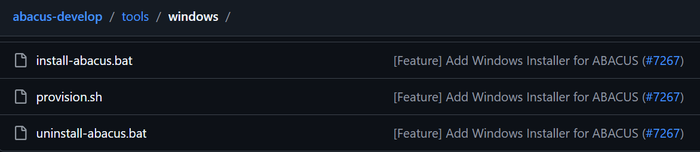

# AI 还能干这个？实现 Windows 系统中一键安装 ABACUS 功能

**作者：张笑扬，邮箱：zxypku21@stu.pku.edu.cn**

**审核：陈默涵，邮箱：mohanchen@pku.edu.cn**

**最后更新时间：2026/05/07**

# 一、背景

对于科学计算领域从业者来说，在 Linux 环境安装各类依赖库、借助复杂命令编译专业软件已是常规操作。但不少刚进入科学计算领域的人本身并无 Linux 使用基础，这也是入门阶段十分普遍的情况。此外，ABACUS（原子算筹）属于大型科研软件，依赖众多数学底层库，安装流程本身较为繁琐，初学者往往需要先花费时间熟悉操作系统，再对照官方文档逐步部署安装，期间还常会遇到各类编译与环境报错，只能不断向课题组前辈请教排查问题。

考虑到多数非计算方向人员日常习惯使用 Windows 系统，为此专门开发了适配 Windows 平台的简易工具，以开箱即用的方式省去复杂环境配置与编译部署流程，由此打造出这款轻量化实用工具。若在使用和部署过程中遇到相关问题，也可查阅 ABACUS 中文手册及配套中文文档参考解决。

那么如何在 Windows 下安装和使用 ABACUS 呢？

对于 Windows 用户而言，ABACUS 官方文档给出的建议是使用 WSL（Windows 适用于 Linux 的子系统） 来运行程序。WSL 可以在 Windows 系统中搭建完整的 Linux 运行环境，虽能满足编译与运行需求，但存在与 Windows 主硬盘目录互访繁琐的问题，且本质仍依赖 Linux 命令行操作，依旧没有避开新手不熟悉命令行、配置繁琐的痛点。

基于此，我们设计了一套一键解决方案：制作 Windows 可直接运行的.bat 脚本，可自动检测并静默安装 WSL 环境（未部署时自动配置），再在 WSL 内部通过脚本全自动完成 ABACUS 的安装与依赖配置。同时额外配置 Windows 端专属命令入口，用户只需在 Windows 系统下直接执行简单指令，即可后台调用 WSL 内部的 ABACUS 开展计算，并将程序运行日志与输出结果同步转发至 Windows 端展示。

# 二、AI 辅助实现

编写大段批处理脚本本身属于小众技能，相较于常规编程语言，其编写过程繁琐且耗时费力，因此该任务直接交由 AI 来完成。首先，开发者与 AI 模型就方案展开讨论，明确提出需求（需具备 Windows 交互界面），并阐述设想的实现方案——封装一个通往 WSL 的接口，但自身不具备相关开发能力，进而咨询具体操作方法。AI 模型随即提供了对应解决方案，指出安装 ABACUS 最简便的方式是通过 Conda 直接获取全套运行环境及软件包，同时给出了从 Windows 命令行直接向 WSL 发送指令的实现方法。

或许得益于开发者具备扎实的软硬件知识，能够条理清晰地与 AI 模型沟通方案，或许是 AI 模型本身性能强大，亦或是两者兼具 😋，这项开发任务推进得十分迅速。仅用一个下午便完成了原型制作，后续经过简单优化完善，相关内容已合并至 ABACUS 的代码仓库中。

众所周知，脚本文件通常编写难度大、耗时久，借助这样的方式，未来或许无需再有人手动编写此类繁琐脚本。

# 三、如何装载 Windows 下的 ABACUS

现在用户可以直接参考 ABACUS 官方文档完成 Windows 下的 ABACUS 版本安装：[https://abacus.deepmodeling.com/en/latest/advanced/windows_installer.html](https://abacus.deepmodeling.com/en/latest/advanced/windows_installer.html)

在 ABACUS 的代码仓库里，`tools/windows` 下添加了这几个文件。只需要右键点击 `install-abacus.bat`，以管理员权限运行即可自动安装。



安装完成后，如果你需要运行 ABACUS，只需要打开你的算例的文件夹，然后右击文件夹的空白处，选择“`在PowerShell中打开`”，接着输入

```shell
abacus
```

就能运行了！

如果你需要运行 MPI 版本，则输入：

```shell
abacus-mpi -n 进程数
```

如果你发现出现了 OpenMP 超线程问题，你也可以手动设置线程数，防止这样的情况发生。Windows 里设置的环境变量一样会生效，只需要

```shell
set OMP_NUM_THREADS=你需要的线程数
abacus-mpi -n 进程数
```

这样就行了！

GPU 算例也能跑 😋👍 如果你的电脑有一块英伟达 GPU 的话。

如果你想卸载的话，直接跑 `uninstall-abacus.bat` 即可。不过这个不会卸载 WSL，防止你有其它作用。如果你想要卸载 WSL，可以自己手动执行：

```shell
wsl --uninstall
```

这件事就这么简单地完成了，几个几十 kb 的脚本文件就完成了这个看上去很难很麻烦的任务。

# 四、关于 Vibe Coding 的感想

AI 看似能力全面、无所不能，实则并不具备自主逻辑与真正的认知能力，往往需要先通过自主推演规划完整思路，再依照既定方案落地执行。

具备深厚编码功底的人群，借助 Vibe Coding 模式能实现效率大幅提升。只需和 AI 模型敲定整体技术方案，便可交由 AI 直接落地开发，极大解放了重复性、体力化的基础编码工作。懂编程的人依托 AI Agent，单人便可承担多人的开发工作量；而没有编程基础的人，也无法单纯依靠这类工具凭空掌握编程能力。

常有反馈称主流 AI 模型的使用时长额度十分有限，即便开发小型功能也容易耗尽额度，还需要反复沟通调整、多次返工。不少 AI 模型的额度设置确实偏紧张，但对于思路清晰、具备专业认知的开发者而言，足以完成体量不小的开发任务。这类人群能够精准明确地向 AI 下达需求、界定开发边界，既能大幅节省资源消耗，又能提升开发效率，从根源上减少反复修改返工的情况。

想要借助 AI Agent 产出实用、靠谱的代码，依旧需要扎实的编程功底与逻辑思维作为支撑。
