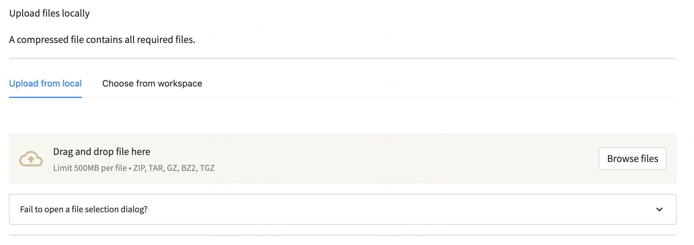
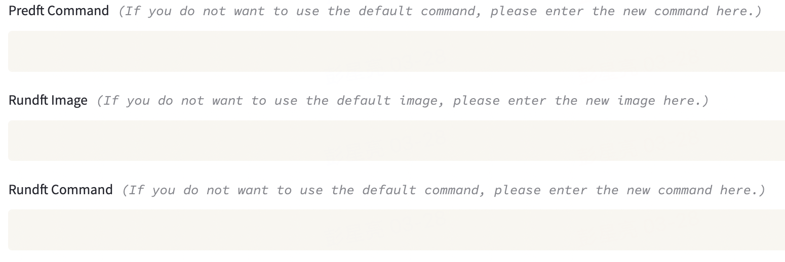
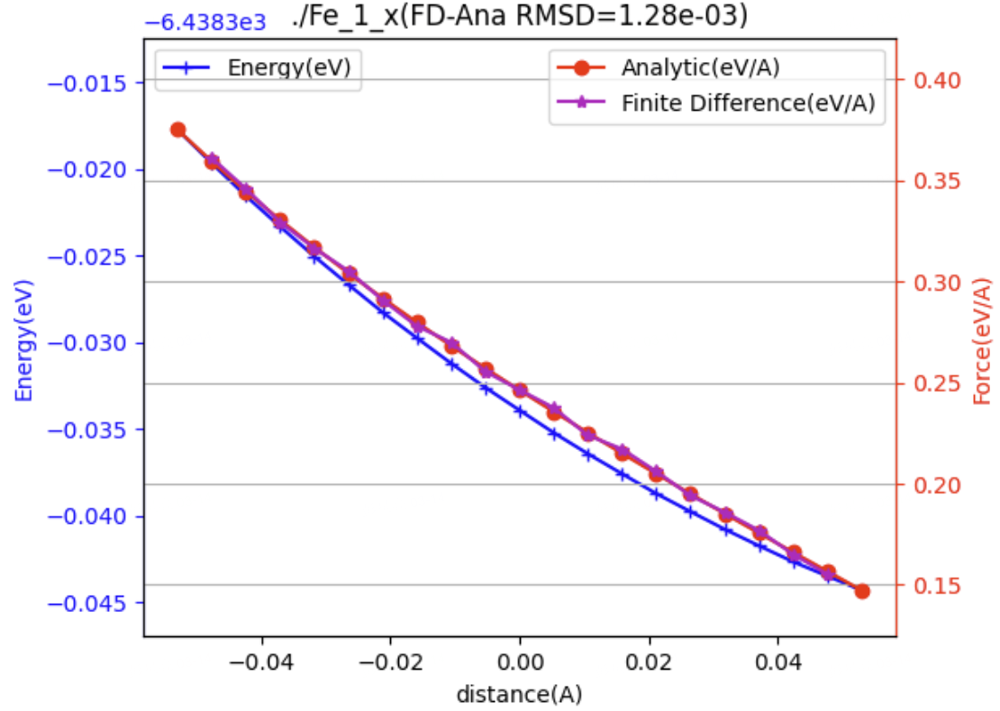

# 在 ABACUS 中进行差分测试

<strong>作者：金祖鑫，邮箱：jinzx@aisi.ac.cn；彭星亮，邮箱：pengxl@aisi.ac.cn；周巍青，邮箱：zhouwq@aisi.ac.cn</strong>

<strong>工作单位：北京科学智能研究院</strong>

<strong>最后更新时间：2024/3/29</strong>

# 背景

对 DFT（Density Functional Theory）电子结构计算软件而言，数值计算的精度是软件质量的重要一环。纸面上，一个完整的 DFT 计算只包含构建例如哈密顿矩阵、对角化、最优化等寥寥几步，但在代码层面，很多数学操作的数值实现并非如纸上的公式一般平凡：一些基本的数值算法可能无法兼顾性能与精度；开发者可能需要采用专门的算法以同时满足两者，或者将一些控制参数交给用户设置自行权衡。不难想象，在一定计算资源下获得的精度一般受限于算法中精度最薄弱的一环。

从开发者的角度，<strong>单元测试</strong>固然是一种可将整体精度问题分割后方便逐个分析的有力措施，但在程序模块较多、部分环节不便于单元测试的情况下，<strong>集成测试</strong>亦是一种有效的检测方法。从使用者的角度，集成测试也能更为直接地反映软件的整体质量。

在 DFT 计算中<strong>能量与力的计算</strong>占据核心地位。通常能量会在自洽场收敛后依照能量泛函的表达式计算获得，而力的计算则会依赖 Hellmann-Feynman 定理，采用与能量计算不同的路径。由于两者存在密切的关联而在实现上又迥然不同，能量与力的一致性测试往往被视作最基本的数值集成测试。

## 能量的数值微分

记第 $$i$$个原子的坐标 $$R^i_\alpha(\alpha=x,y,z)$$，其沿 $$\alpha$$方向的受力为 $$F^i_{\alpha}$$，根据定义有

$$
F^{i}_\alpha(\mathbf{R}^1,\ldots,\mathbf{R}^N) = -\frac{\partial}{\partial{}R_{\alpha}^{i}} E(\mathbf{R}^1,\ldots,\mathbf{R}^N)
$$

在最低阶的差分近似下

$$
\frac{\partial}{\partial{}R_{\alpha}^{i}} E(\mathbf{R}^1,\ldots,\mathbf{R}^N) \approx \frac{E(\ldots,\mathbf{R}^i+\Delta{}R\hat{\mathbf{e}}_{\alpha},\ldots) - E(\ldots,\mathbf{R}^i-\Delta{}R\hat{\mathbf{e}}_{\alpha},\ldots)}{2\Delta{}R}
$$

其中 $$\hat{\mathbf{e}}_{\alpha}$$表示 $$\alpha$$方向的单位向量。

## 数值微分的步长与误差

差分公式本身作为近似会带来离散化误差。对于上述一阶导的最低阶差分，误差随步长关系为 $$O((\Delta{}R)^2)$$。

【更高阶的差分及相应的误差项可参考 [https://en.wikipedia.org/wiki/Finite_difference_coefficient](https://en.wikipedia.org/wiki/Finite_difference_coefficient)】

虽然离散化误差会随着差分步长的减小而降低，但这并不意味着差分步长越小越好。由于数值计算中的数不可避免地只具有有限的精度，当步长小于一定程度后数值微分的整体误差反而会上升。例如，双精度浮点数有大约 16 位有效数字，这意味着即使对正弦函数这样简单、平滑的函数做数值微分，当步长取到 $$10^{-16}$$时只会得到纯粹的噪音。不仅如此，由于浮点数减法在“大数减大数得到小数”情况下存在有效位数丢失，理想的步长应远大于 $$10^{-16}$$。

以正弦函数为例，若能进行足够精度的计算，有

$$
\begin{aligned}
\sin(1+10^{-10}) &= {0.841470984}861926737235108938446263127449290359072...\\
\sin(1-10^{-10}) &= {0.841470984}753866276061480994966255906729317751565...\\
\Delta &= {0.000000000}108060461173627943480007220719972607507...\\
&=1.08060461173627943480007220719972607507... × 10^{-10}
\end{aligned}
$$

我们得到 $$\sin x$$在 $$x=1$$处的数值差分导数

$$
\begin{aligned}
\frac{\sin(1+10^{-10})-\sin(1-10^{-10})}{2 \times 10^{-10}} &={0.540302305868139717400}0361035998630375...\\
\cos{}x &={0.540302305868139717400}9366074429766037...
\end{aligned}
$$

与理论上的 $$\cos x$$对比，有 20 位左右的有效数字。然而，在双精度浮点数的运算下，

$$
\begin{aligned}
\sin(1+10^{-10}) &= {0.841470984}86192673\\
\sin(1-10^{-10}) &= {0.841470984}75386628\\
\Delta &= ~~~~~~~~~~~~~~~~~~~~1.080604{494774206614}\times 10^{-10}\\
\frac{\sin(1+10^{-10})-\sin(1-10^{-10})}{2 \times 10^{-10}} &=  {0.540302}{247387103307}
\end{aligned}
$$

10 位有效数字在两个三角函数值的减法中丢失，由浮点运算规则补齐的位数（蓝色数字）只是一些噪音，最后导致数值微分结果只有 6 位有效数字。

在上述三角函数例子中，浮点运算带来的精度误差主导了最终结果中的误差。事实上，如步长取为 $$10^{-7}$$则能获得8-9位有效数字，优于步长为 $$10^{-10}$$的情况。但若取为 $$10^{-3}$$，则离散化误差将变为主导，最终只能得到约6位有效数字。实践中，为得到尽可能小的数值微分误差，步长的选择应当在离散化误差与精度误差间取得一个均衡。例如，https://en.wikipedia.org/wiki/Numerical_differentiation 中介绍了一个进行前向差分【$$(f(x+\Delta{}x)-f(x))/\Delta{}x$$】时的推荐步长。当采用不同的差分方案时，最优步长的估计方式也不尽相同。

由于 DFT 的能量源于一个自洽场计算，本身受到 SCF 收敛阈值等参数的影响，因此做数值微分时其精度不应直接视作相应的浮点数精度，而需综合多方面考量。

---

# 利用 ABACUS 自动工作流进行差分测试

ABACUS（原子算筹）是一款国产的开源密度泛函理论软件。

在软件中，我们可以直接使用 abacustest 进行原子受力（force）的差分测试。

应用地址（需要 Bohrium 账号获得本文档提供的差分工作流，但实际上差分测试程序也可以自己写）：[https://app.bohrium.dp.tech/abacustest?request=GET%3A%2Fapplications%2Fabacustest](https://app.bohrium.dp.tech/abacustest?request=GET%3A%2Fapplications%2Fabacustest)

以下是该自动工作测试流的使用说明。

## 1. 准备算例

在进行测试之前，需要自己准备需要进行测试的算例，每个算例需要把 ABACUS 计算需要的所有文件（包括赝势和轨道文件）都放在一个文件中。同时需要额外准备一个 `info.txt` 文件，用于指定需要进行差分测试的原子以及 xyz 方向，每一行是对一个需要测试的原子的设置，格式为 `<原子符号> <原子序号> <测试方向>... `

```cpp
>>> ls Fe  #假设你的算例你有一个Fe的算例，并且把计算需要的所有文件已经准备在Fe文件夹中
Fe_gga_7au_100Ry_4s2p2d1f.orb  Fe_ONCV_PBE-1.2.upf  info.txt  INPUT  KPT STRU

>>> cat Fe/info.txt
Fe 1 x y      
Fe 2 y 

>>> zip -r fe.zip Fe   # 对算例文件夹进行压缩
```

比如上述设置，表明对第一个 Fe 原子的 x 和 y 方向进行测试，以及对第二个 Fe 原子的 y 方向进行测试。

## 2. 打开应用登入账号

打开应用地址，填入自己的 bohrium 账号密码进行登入


## 3. 选择 abacustesst 的模式

点击 `Form`，并在 `Select Sub Model` 处选择 `Reuse` model


## 4. 上传算例

在 `Upload files locally` 处，上传准备好的算例压缩包。完成后在页面的最后处点击 `Next`,进入下一页的设置。



## 5. 选择 force 差分计算模式

在 `Model` 处选择 `005-finite_diff_force` 进行 force 的差分测试


## 6. 计算细节设置

- `Predft Command` 可以对差分的细节进行设置，此处不填会使用默认值：`python prepare.py -d 0.0001 -n 2`，其中，`-d` 定义差分点的步长，单位是 bohr，`-n` 定义每个正负方向改变的构型数量。
- `Rundft Image` 可以对进行 abacus 计算使用的镜像进行设置，此处不填会使用默认的 abacus 的 intel latest 镜像：`registry.dp.tech/deepmodeling/abacus-intel:latest`。
- `Rundft Command` 可以设置进行 abcus 计算的命令，此处不填会使用默认值：`OMP_NUM_THREADS=1 mpirun -np 16 abacus | tee out.log`。需要注意的是测试使用的机型是固定为 ali `c32_m64_cpu`（此机型的实际物理机为 16，所有使用 16 核并行计算），如果自己设置计算命令时需注意并行的核数。



其他选项不需要额填写。点击页面最后的 `Next`，再点击 `Next` 进入最后的计算提交页面

## 7. 提交计算

在最后的 `Review` 页面的最后部分，点击 `I agree to the terms and conditions` 后点击 `Submit` 进行提交。


## 8. 查看结果

计算完成后会在页面中显示差分值和解析值的作图结果。



图. 对第一个 Fe 原子的 x 方向的差分测试结果。图最上方的 `FD-Ana RMSD` 是差分值和解析值得均方差。此算例表明 Fe_1_x force 得解析误差~1.28e-03  eV/A。此测试设置的步长为 0.01，差分点个数为 10（`predft_command: python prepare.py -d 0.01 -n 10`)，任务地址：[https://app.bohrium.dp.tech/abacustest?request=GET%3A%2Fapplications%2Fabacustest%2Fjobs%2Fjob-abacustest-v0.3.97-770b66](https://app.bohrium.dp.tech/abacustest?request=GET%3A%2Fapplications%2Fabacustest%2Fjobs%2Fjob-abacustest-v0.3.97-770b66)

---

# ABACUS 能量差分与解析力结果不一致的可能原因及解决方案

## 原因 1：差分的步长选取过小/SCF 收敛不充分

差分与解析解之间的误差来源于两部分，一部分 SCF 基态与真实基态之间的误差；二是差分操作本身导致的数值误差。前者与 SCF 计算的收敛判据（`scf_thr`）、k 点采样（`kspacing`）、平面波基组个数（`ecutwfc`）等有关；而后者与差分的步长选取有关。具体的讨论可以参考本文第一部分的背景介绍。相关的问题也在 Issue[#3645](https://github.com/deepmodeling/abacus-develop/issues/3645) 中被较为详细的讨论。

### 解决方案 1

SCF 参数不变，重新预估一个合理的差分步长。

### 解决方案 2

调小 SCF 计算的收敛判据（`scf_thr`）、k 点采样（`kspacing`）；增大平面波基组个数（`ecutwfc`），使得 SCF 的计算更为准确。

## 原因 2：LCAO 计算中的“egg box effect”

当差分不一致发生在 LCAO（采用数值原子局域轨道）的计算之中时，出现例如 Issue#3685 中展示的周期性波动的时候，那么有可能是因为 LCAO 中格点积分部分导致的<strong>“egg box effect”</strong>（此效应形容由于格点离散化带来的周期性平移对称性的破缺，原子在空间平移，会产生计算出来的能量和受力的规律性震荡，就像装鸡蛋的鸡蛋盒所呈现出来的形状）。


为了确认这一点，你可以设置 `basis_type=lcao_in_pw`。因为 LCAO_IN_PW 的计算避开了格点积分，可以帮助确认是否是格点积分导致的数值误差。

### 解决方案 1

使用 `basis_type=lcao_in_pw` 避开格点积分。

### 解决方案 2

加密实空间的格点，减小“egg box effect”误差的量级。

---

# 参考文献

1. Issue #3645 [https://github.com/deepmodeling/abacus-develop/issues/3645](https://github.com/deepmodeling/abacus-develop/issues/3645)
2. Issue #3685 [https://github.com/deepmodeling/abacus-develop/issues/3685](https://github.com/deepmodeling/abacus-develop/issues/3685)
3. [Force 差分测试 （LCAO）](https://dptechnology.feishu.cn/docx/Y6YQdT5gOoAtqbxiIFIcKGvWnyf)（这个文档只有飞书有权限才可以浏览）
