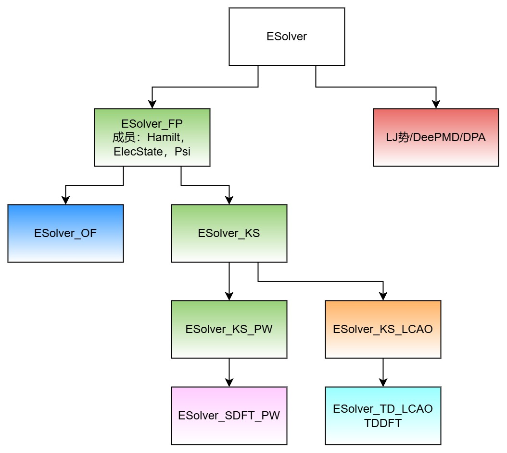
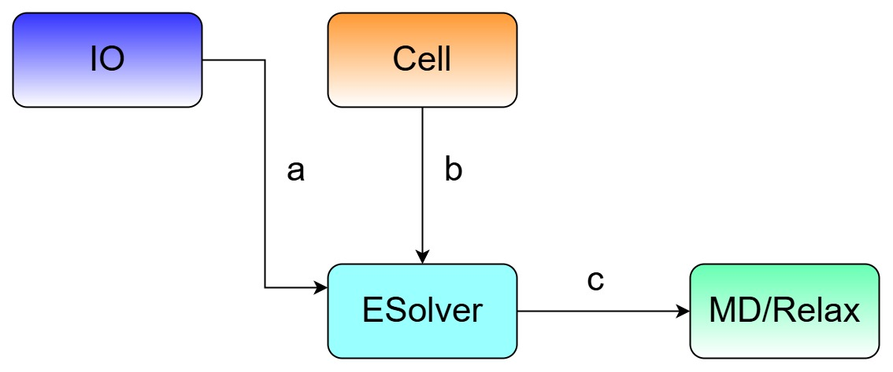

# ESolver 模块介绍

<strong>作者：陈默涵，邮箱：mohanchen@pku.edu.cn</strong>

<strong>最后更新时间：2024 年 11 月 15 日</strong>

# 一、ESolver 模块介绍

## 1. 物理模型

原子算筹的 ESolver 模块（Energy Solver，简称 ESolver，代表能量求解器）是在给定原子位置的前提下，通过计算该体系的总能量、得到原子的受力、原胞的应力等关键物理量。

无论是密度泛函理论计算还是分子动力学模拟，都是在给定晶格形状和大小，给定好原子坐标后计算体系的总能量。唯一较大的区别是，密度泛函理论把原子拆分成电子和离子两部分开处理，通过计算电子-电子、电子-离子、和离子-离子相互作用来获得体系总能量，而传统分子动力学方法（例如 LJ 势）一般是通过解析的势函数直接计算原子-原子间的相互作用。如果是基于机器学习的分子动力学方法，例如 DPMD 方法，则是通过神经网络来代替原子间的势函数。

在 ESolver 模块中，原子算筹提供了多种能量求解器，包括在 DFT 中通过对角化的方式求解 Kohn-Sham 方程，从而计算系统的基态电子性质。其中 Kohn-Sham 方程的求解又要区分在平面波和局域轨道两种基矢量情况下的代码。此外，ESolver 还提供诸如随机波函数密度泛函理论（Stochastic DFT）、无轨道密度泛函理论（Orbital-Free DFT）、以及随时间演化的含时密度泛函理论（rt-TDDFT）等其他电子结构的求解器。最后，ESolver 还提供了给定 LJ 势或者 DPMD 势来计算体系总能量的功能。

## 2. 设计思路

ESolver 在 ABACUS 中起着非常重要的作用，属于 ABACUS 的“顶层框架设计”，从 ESolver 会分出不同的基矢量（PW 或者 LCAO），不同的能量求解方法（KSDFT、OFDFT、Stochastic DFT、real-time TDDFT 和 Linear-response TDDFT 方法等），此外还有一些经验势场，包括 DP 方法都在 ESolver 的层次实现了调用，因此有必要规范 ESolver 的写法。

# 二、ESolver 的设计规范

建议开发者在 ESolver 中采用以下 11 个函数为成员函数，其它新提交的 PR 中若包含这些函数以外的成员函数，将不会被接收。

```cpp
// 函数1 before_all_runners:在程序初始，离子位置开始变化之前之前需要执行的操作
ESolver::before_all_runners();

for(i=0; i<number_of_ion_steps; ++i)
{
  // 函数2 runner:在离子弛豫和分子动力学的每一步调用，给定离子构型，
  // 得到能量、受力、应力等信息
  ESolve::runner();
 
  // 函数3 cal_energy：计算体系总能量
  ESolver::cal_energy();

  // 函数4 cal_energy：计算体系总能量
  ESolver::cal_force();

  // 函数5 cal_energy：计算体系总能量
  ESolver::cal_stress();
} // 结束离子步

// 函数6 after_all_runners：所有离子步结束之后的操作
ESolver::after_all_runners();
```

在 runner()函数内部，一般来讲有以下一些成员函数。如果以下函数不满足需求，可以重载 runner 函数

```cpp
ESolver::runner()
{
  //函数7 before_scf: 电子自洽迭代循环之前做的操作，包括检查离子位置变化
  // 带来的一些物理量的更新
  ESolver::before_scf();

  // 电子迭代循环
  for(iter=0; iter<number_of_scf_iterations; ++iter)
  {
    // 函数8 iter_init：在每次电子scf迭代之前的准备工作
    ESolver::iter_init();

    // 函数9 hamilt2density：构造哈密顿量，并且从哈密顿量解出电子密度
    ESolver::hamilt2density();
  
    // 函数10 iter_finish：每步电子步迭代之后的操作
    ESolver::iter_finish();
  }// end iter
 
  // 函数11 after_scf：如果电子迭代结束（收敛或达到最大允许步数），
  // 需要做的操作
  ESolver::after_scf()
}// end runner
```

注：所谓的 nscf，其实就是重载 runner，把电子迭代次数设成 1，或者去掉 scf 的循环。如果最后输出不一样，可以适当调用一些自由函数来输出相关信息。

注：before_scf()包含求 Ewald 能量。

# 三、代码介绍

## 1. 代码位置

- ESolver 代码的位置在[/source/module_esolver/](https://gitee.com/deepmodeling/abacus-develop/tree/develop/source/module_esolver)
- 整个模块的名字空间（namespace）为 ModuleESolver

## 2. 代码框架图



图：能量求解器 ESolver 的框架图。ESolver 分成两大部分：第一性原理的能量求解器 ESolver_FP 和经验势的求解器。其中 ESolver_FP 又派生出无轨道密度泛函理论求解器 ESolver_OF（用平面波基矢量）和 Kohn-Sham 密度泛函理论求解器 ESolver_KS。其中 ESolver_KS 需要波函数 Psi，电子信息 ElecState，和电子哈密顿量求解器 HSolver 作为输入，同时可以派生出不同基矢量的能量求解器。

## 3. 模块关系图



图：a. IO 模块提供 ESolver 需要的输入参数和物理量输出接口; b. Cell 模块作为 ESolver 模块的核心输入，是 ESolver 的求解目标，ESolver 中的 Cell 模块对象是只读的; c. ESolver 模块; d. ESolver 提供 MD 和 Relax 模块需要的系统势能和原子受力、应力的计算;

# 四、主要功能

每个功能里可以加关键算法和参考文献。

## 1. esolver.h

父类，其子类只能使用其定义的虚函数接口。

## 2. <strong>esolver_ks_pw</strong>

继承了 ESolver_KS，采用平面波求解 KS 方程。

## 3. <strong>esolver_ks_lcao</strong>

采用数值原子轨道来构建体系的哈密顿量，通过对角化厄密矩阵的方法来求解 Kohn-Sham 方程，获得系统基态电子密度和总能量。

## 4. <strong>esolver_ks_lcao_tddft</strong>

支持采用数值原子轨道进行 real-time TDDFT 计算。

## 5. <strong>esolver_sdft_pw</strong>

支持采用平面波进行 stochastic DFT 的计算[2]。采用切比雪夫展开和随机波函数的方法进行电子密度的计算，之后还是采用自洽迭代的方法求出体系的基态电子密度。

## 6. <strong>esolver_of</strong>

支持采用平面波进行 OFDFT 的计算。

## 7. <strong>esolver_dp</strong>

基于机器学习的分子动力学 DPMD 方法。如果预处理定义了__DPMD，则可以支持 ABACUS+DPMD 的计算

## 8. <strong>esolver_lj</strong>

支持 LJ 经验势的计算。

# 五、ESolver 重构计划

1. 原来在 init_after_vc()函数里的内容应该移入 before_scf()
2. 将会根据上面的原则，逐步去除不合规定的函数（挪到别的模块）。
3. 规范成员变量和成员函数所属层级以及访问权限，关于 ESolver 允许的成员变量的规范仍在制定之中，之后会重新设计成员变量。
4. ESolver 是否采用模板，以及哪些是模板参数，需要重新评估。
5. 将 ESolver 的继承关系转化为组合的形式，删除没必要的继承。
6. 根据新功能添加更多的 ESolver，例如基于 LCAO 轨道的 DFPT 方法，基于 PW 的 DFPT 方法等等。

# 六、参考文献

1. Pengfei Li, Xiaohui Liu, <strong>Mohan Chen*</strong>, Peize Lin, Xinguo Ren*, Lin Lin, Chao Yang, and Lixin He*, "<em>Large-scale ab initio simulations based on systematically improvable atomic basis</em>", Comp. Mater. Sci., <strong>112</strong>, 503 (2016).
2. Qianrui Liu and <strong>Mohan Chen*</strong>, "<em>Plane-wave-based stochastic-deterministic density functional theory for extended systems</em>", Phys. Rev. B, <strong>106</strong>, 125132 (2022).
