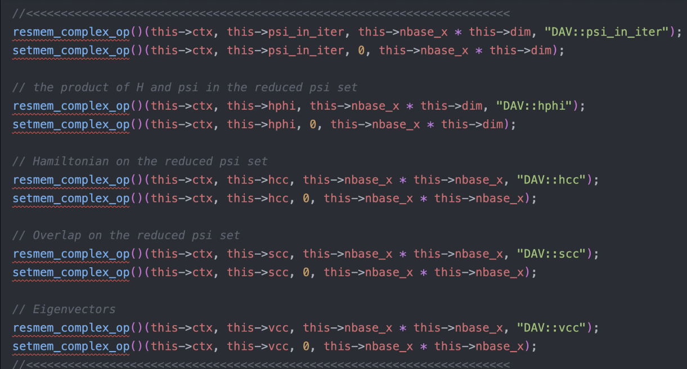
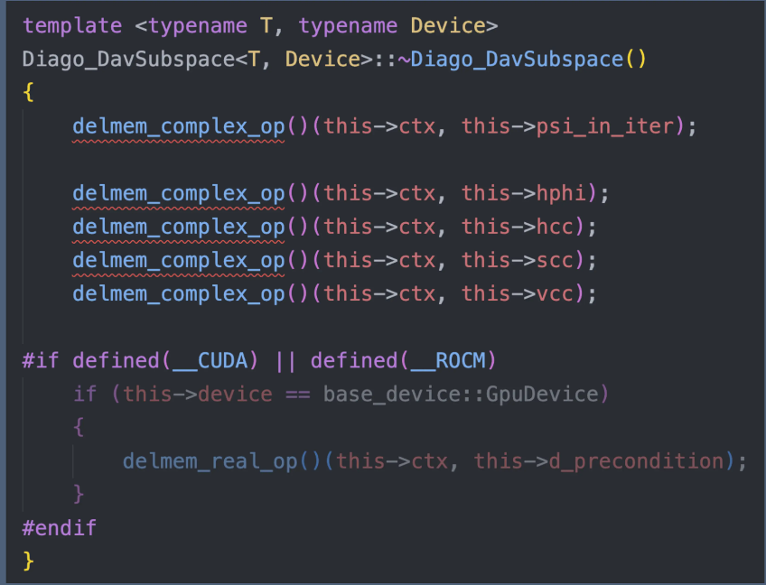
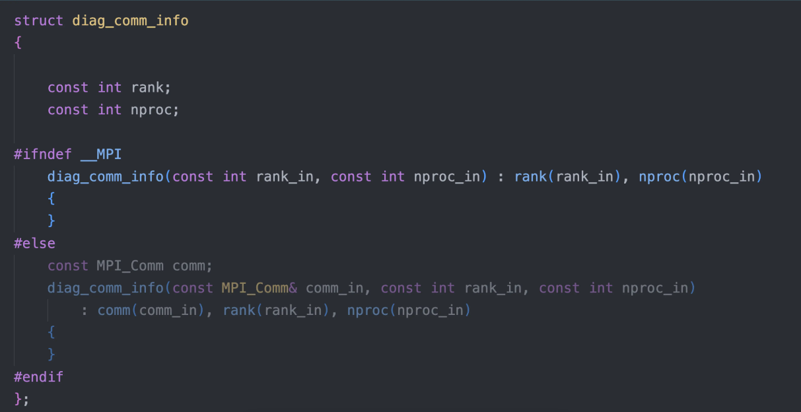
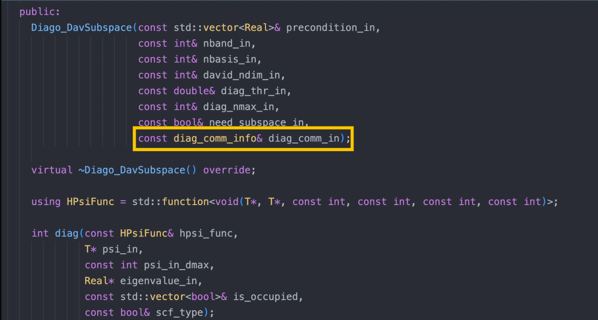
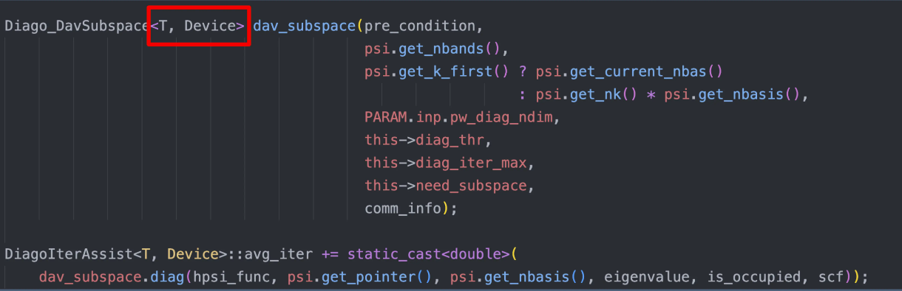
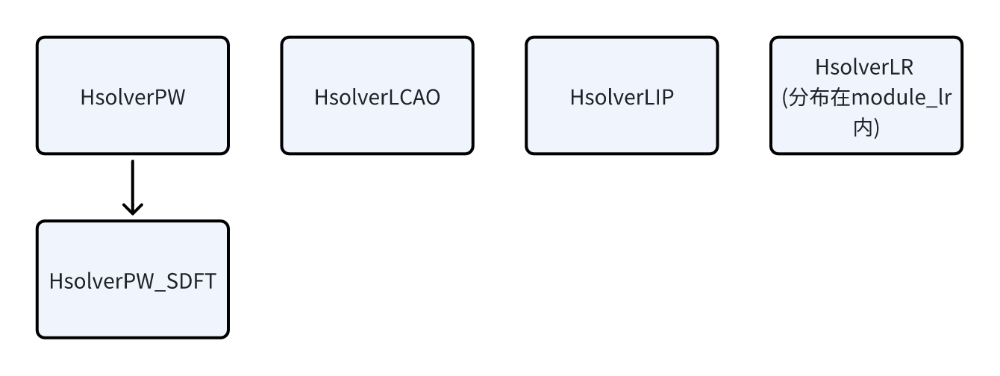
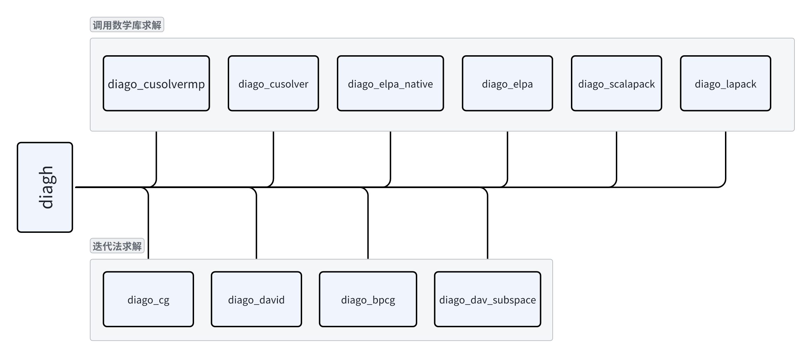

# HSolver 模块介绍

<strong>作者：韩昊知，邮箱：haozhi.han@stu.pku.edu.cn</strong>

<strong>审核：陈默涵，邮箱：mohanchen@pku.edu.cn</strong>

<strong>单位：北京大学</strong>

<strong>最后更新时间：2024/11/15</strong>

# 一、HSolver 模块介绍

## 1. 物理模型

从密度泛函理论（Density Functinoal Theory，简称 DFT）理论可以推导出 Kohn-Sham 方程，求解 Kohn-Sham 方程是大多数 DFT 软件最核心的功能。由于 Kohn-Sham 方程是非线性特征值问题，因此需要采用自洽场（self-consistent field，简称 SCF）方法进行迭代求解。

- 求解 Kohn-Sham 方程是一个迭代过程，我们称之为“SCF 迭代”，而对于迭代过程中的每一步叫做“单步 SCF”。
- 对于单步 SCF，其求解过程等价于对角化描述单电子体系的哈密顿量矩阵 H。

Hsolver 负责单步 SCF 过程中 KS 方程的求解，即：对角化给定的哈密顿矩阵 H。国产开源密度泛函理论软件 ABACUS（原子算筹）里提供了专门的 Hsolver 模块，叫做：module_hsolver。该模块（意为 H 矩阵求解器）聚焦于对角化线性代数里的对称矩阵（或厄密矩阵）问题。

在一次 SCF 内，KS 方程的形式可以写为为$$\mathrm{H_k}|\Psi_{ik}\rangle=E_{ik}|\Psi_{ik}\rangle$$。这里$$H$$代表的是电子系统的哈密顿量，$$E$$代表的是能级，$$|\Psi\rangle$$代表的是 Kohn-Sham 单电子波函数。

## 2. 数学模型

- 多次求解特征对

  - 对每一个布里渊区的 `k` 点，都需要求解一个对应 k 点的 KS 方程。
  - 对于自旋（`nspin` 参数）为 2 的计算，ABACUS（原子算筹）软件是把两个不同自旋方向的计算当作两组不同的 k 点来处理。
- 广义特征对问题

  - 在 DFT 中，如果选用正交的基矢量（如：平面波，简称 PW），则待求解方程的形式为：$$\mathrm{H_k}|\Psi_{ik}\rangle=E_{ik}|\Psi_{ik}\rangle$$。
  - 在 DFT 中，如果选用不正交的基矢量（如：数值原子局域轨道，简称 LCAO），则待求解方程的形式为：$$\mathrm{H_k}|\Psi_{ik}\rangle=E_{ik} S_{ik}|\Psi_{ik}\rangle$$。其中$$S$$矩阵称为基矢量的 Overlap 矩阵。该方程还是求解特征值和特征向量，但是有另一个名称叫<strong>广义特征值</strong>求解问题。普通的特征值求解问题是广义特征值求解问题的一个特例，即 Overlap 矩阵为单位矩阵的时候。

总结：Hsolver 负责求解一系列个（一个或多个）方程的（广义）特征对。

## 3. 设计思路

HSolver 在 ABACUS 中起着非常重要的作用，属于 ABACUS 的“顶层框架设计”。Hsolver 主要分为两种不同的求解方式：一种是广泛用于 LCAO 基组的直接求解法；一种是主要用于 PW 基组的迭代求解法。

直接求解法需要调用很多不同的数学库，因此如何统一调用方式是 Hsolver 设计的中重要问题。

迭代求解法也包含很多种方法，如：CG，BPCG，Davidson，Dav-subspace，LOBPCG 等方法。

# 二、HSolver 的设计规范

## 1. Hsolver 模块的设计

- 同时支持迭代法求解广义特征值与调用成熟数学库求解广义特征值两种求解方案。

  - ABACUS 支持两种基组，它们有着显著不同的特点。
  - 由 PW 基组构造的 H 矩阵拥有超级大的维度，难以存储在计算机内存中，因此需要选用迭代求解的方案求得特征对。
  - 由 LCAO 基组构造的 H 矩阵维度较小，可以存储在计算机内存中，调用成熟的数学库更加快速高效。
- module-hsolver 理论上不包含任何物理的知识，仅需高性能计算与线性代数的知识即可。因此其不应该出现物理的内容。
- module-hsolver 应该支持多底层硬件的异构，使其可以快速迁移到新的硬件设备上。

## 2. Diag 模块的设计要求

- 记录对⻆化消耗的最大内存。
- 对⻆化的通信域可以被调用者指定，在调用函数中传入。
- 调用的时候可以指定使用单精度还是双精度（通过模版）。

## 3. 设计规范

- 解耦

  - <strong>不包含全局变量和全局函数</strong>：Hsolver 本质上并不涉及更多的物理知识，Hsolver 本身是可以独立于 ABACUS 的，因此 Hsolver 内部不需要出现 ABACUS 中包含的全局变量或者全局函数。
  - <strong>Hsolver 及时构造及时销毁</strong>：Hsolver 与 ABACUS 的关系只是 ABACUS 会在每次 SCF 的时候调用一次 Hsolver。不同 SCF 之间并没有必要的联系，其本质只是对角化两个不同的矩阵，因此 ABACUS 调用 Hsolver 的方式应该是需要时构造，调用完立刻析构。Hsolver 的对象不应该存在于 ABACUS 非 SCF 的计算流程中。
- 内存敏感性

  - 在 Hsolver 的求解过程中，会出现内存峰值，为了软件更好的维护与易用，Hsolver 应该提供整个计算过程中其最大内存使用量。
  - 将额外需要申请内存的操作统一到一起进行管理。
  - 把所有大块内存的 malloc 放到构造函数；free 放到析构函数。
    
    
- 通讯域显示化

  - Hsolver 的求解一定会需要并行，对于开发者来说，清楚当前 Hsolver 采用的并行策略是十分重要的。因此我们的代码应该显示的表现当前 Hsolver 的并行方式。

- 易用性
  - Hsolver 会被 ABACUS 调用。因此能否为 ABACUS 提供方便可用的对角化接口是至关重要的。
  - 例如：ABACUS 想要实现混合精度，Hsolver 就必须既能提供单精度求解的接口，又能提供双精度求解的接口。这是 Hsolver 易用性的体现。

# 三、代码介绍

## 1. 代码位置

- HSolver 代码的位置在[/source/module_hsolver/](https://gitee.com/deepmodeling/abacus-develop/tree/develop/source/module_hsolver)
- 整个模块的名字空间（namespace）为 Hsolver

  - `./diag*`：Diag 相关类代码。
  - `./hsolver*`：HSolver 相关类代码。
  - `./genelpa/`：ELPA 对角化接口辅助库，用于 DiagoElpa 类。
  - `./``kernels``/`：定义和实现了 Hamitonian 模块中涉及到的多设备支持算子（multi-device operator），目前只对 PW 基组进行了支持。
  - `./test/`：一些 HSolver 的测试数据，持续更新中

## 2. 代码框架图

- HsolverPW 类：负责 PW 基组构造的 H 矩阵的求解。

  - HsolverPW_SDFT：负责 SDFT 中 PW 基组构造的 H 矩阵的求解。
- HsolverLCAO 类：负责 LCAO 基组构造的 H 矩阵的求解。
- HsolverLIP 类：负责 lcao-in-pw 的求解过程。

- 迭代求解法：

  - `diago_cg`：band-by-band CG（共轭梯度）方法
  - `diago_david`: block davidson 方法
  - `diago_bpcg`: all band CG 方法
  - `diago_dav_subspace`：参考 QE，改进的 davidson 方法
- 调用数学库求解法：

  - `diago_lapack`：基于 lapack 数学库求解，不能并行，只能串行。
  - `diago_scalapck`：基于 scalapck 数学库求解，只能多核并行（仅 CPU）。
  - `diago_cusolver`：基于 Nvidia cusolver 数学库求解，仅能用于 Nvidia GPU 硬件上。且只能用于单 GPU。
  - `diago_cusolvermp`：基于 Nvidia cusolver 数学库求解，仅能用于 Nvidia GPU 硬件上。用于多 GPU 并行求解。
  - `diago_elpa ` 和 `diago_elpa_native`：基于 ELPA 数学库求解。diago_elpa 是 基于旧版的 ELPA 实现的，diago_elpa_native 是基于新版的 ELPA 实现的。且 diago_elpa_native 同时支持 CPU 并行求解和 GPU 求解。

# 四、主要功能

## Diag 与 Hsolver

Hsolver 模块内还有一个子模块叫做 Diag。

- Hsolver 负责求解一系列个（一个或多个）方程的（广义）特征对。
- Diag 负责求解一个方程的（广义）特征对。

## Diag 与 Hsolver 的调用关系

- 一次 SCF 调⽤⼀次 hsolver
- ⼀次 hsolver 调用一次或者多次 diag

## 1. hsolver.h

包含 Hsolver 模块的一些辅助函数。如：`set_diagethr_ks`，`set_diagethr_sdft`，`reset_diag_ethr`，`cal_hsolve_error`

## 2. hsolver_pw

PW 基组采用迭代法求解 H 矩阵的特征值和特征向量。目前支持的迭代法有：CG，BPCG，Davidson，Dav-subspace。

## 3. hsolver_pw_sdft

继承自 hsolver_pw，stochastic DFT 中 PW 基组采用迭代法求解 H 矩阵的特征值和特征向量。

## 4. hsolver_lcao

LCAO 基组采用直接求解法求解 H 矩阵的特征值和特征向量。目前支持的直接求解方法有：lapack，scalapack，cusolver，elpa，cusolver。cusolvermp，pexsi 等。

## 5. hsolver_lcaopw

调用 lcao-in-pw、即将 LCAO 轨道展开成平面波的求解过程。

## 6. diago_cg

调用 Band-by-band CG 迭代求解法的实现过程。

## 7. diago_david

调用 Davidson 迭代求解法的实现过程。

## 8. diago_dav_subspace

调用 Davidson subspace 迭代求解法的实现过程。

## 9. diago_bpcg

调用多条能带一起运算的 CG 迭代求解法的实现过程。

## 10. diago_elpa

调用 genELPA（[https://github.com/pplab/GenELPA](https://github.com/pplab/GenELPA)）直接求解广义特征值问题的实现过程。

## 11. diago_elpa_native

调用 ELPA 原生 API 直接求解广义特征值问题的实现过程。

## 12. diago_lapack

调用 Lapack 单 CPU 核求解广义特征值问题的实现过程。

## 13. diago_scalapack

调用 scalapck 通过 2D 块循环（[https://www.netlib.org/scalapack/slug/node75.html](https://www.netlib.org/scalapack/slug/node75.html)）的并行方式多 CPU 核求解广义特征值问题的实现过程。

## 14. diago_cusovler

调用 Nvidia cuSolver 库在 GPU 上快速求解广义特征值问题的实现过程。

## 15. diago_cusolvermp

调用 Nvidia cuSolverMp 库在多 GPU 上以 2D 块循环并行方式快速求解广义特征值问题的实现过程。

## 16. diago_pexsi

调用 PEXSI 库求解的实现过程。

# 五、参考

- [https://www.netlib.org/lapack/](https://www.netlib.org/lapack/)
- [https://www.netlib.org/scalapack/](https://www.netlib.org/scalapack/)
- https://elpa.mpcdf.mpg.de/
- [https://docs.nvidia.com/cuda/cusolver/index.html](https://docs.nvidia.com/cuda/cusolver/index.html)
- [https://docs.nvidia.com/cuda/cusolvermp/](https://docs.nvidia.com/cuda/cusolvermp/)
- [https://github.com/pplab/GenELPA](https://github.com/pplab/GenELPA)
- [https://www.netlib.org/scalapack/slug/node75.html](https://www.netlib.org/scalapack/slug/node75.html)
