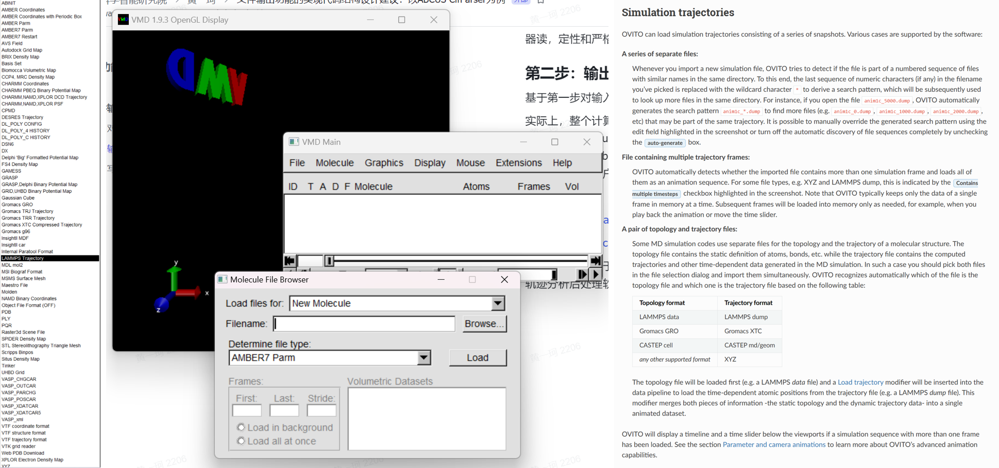
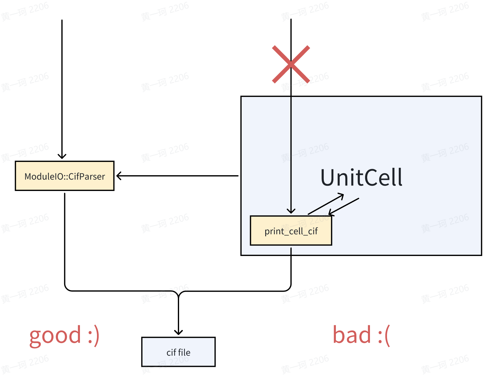

# 文件输出功能的实现代码结构设计建议：以 ABCUS CifParser 为例

<strong>作者：黄一珂，邮箱：huangyk@aisi.ac.cn</strong>

<strong>审核：陈默涵，邮箱：mohanchen@pku.edu.cn</strong>

<strong>最后更新时间：2024 年 9 月 6 日</strong>

<em>输入输出功能并不是软件开发的边角任务。良好的输入输出设计不仅能便捷用户的使用，提升用户体验，使得软件能够无缝地结合 community 已有成熟工作范式，也会在必要时为以 disk I/O 解决内存问题发挥明显作用</em>

# 背景

- 随着 ABACUS 的功能持续增加，对感兴趣物理量输出的需求也随之增加，且从 running_log 中抓取信息愈加困难
- 随着 ABACUS 的用户群体增加，越来越多的 ABACUS 与各种具有结构化文件接口的后处理软件不兼容的 issue/报告数量也在增加
- 将积分表和其他非高频访问（计算次数有限，但每次计算成本较高）数据写入文件来减轻内存使用，是模拟更大尺度体系的常见和成熟技术路线之一

# 规范化文件输出-读入功能开发流程

## 第一步：对输出内容的重新思考

在设计和编写输出代码之前，我们<strong>必须</strong>再次<strong>明确</strong>至少以下两个方面：

- 这种输出功能的用途是什么？<strong>是给人读还是机器读</strong>？
- <strong>从原则上讲</strong>，所需输出物理量，在输出过程中产生的<strong>精度损失是否应该</strong>发生？

实际上，ABACUS 目前的确存在“具有有限保留位数，但用于被期望进行数值误差尽可能小的计算”这一情况中，例如：

- LCAO 波函数：out_wfc_lcao 关键词可赋值 1 输出为 plaintext，赋值 2 输出二进制格式。但 plaintext 文件用于 restart SCF 计算
- 电荷密度：out_chg 关键词可赋值 1 输出实空间电荷密度为 Gaussian cube，<strong>该文件默认只保留 3 位小数，且在 PR#4958 之前无法更改</strong>，用于 restart SCF 计算
- H(k), S(k)：out_mat_hs 关键词可赋值 1 输出 H(k)和 S(k)为 plaintext。<strong>该类文件默认只保留 6 位小数，且在 PR#3468 之前无法更改</strong>，联合 out_wfc_lcao 1 所输出的波函数文件，数值误差达到<strong>1e-5</strong>数量级，已经无法用于精度要求稍高的后处理计算

...

这些情况的出现，反映了 ABACUS 涉及文件输入输出的一致性并未良好设计，且经常出现一种文件承担了人读和机器读，定性和严格定量两种场景需求。

## 第二步：输出文件格式调研

<strong>基于第一步对输入/输出目的的再次明确</strong>，之后考虑储存在文件中数据的结构问题。

实际上，整个计算化学/计算物理领域的软件已经对相当多的数据结构就“应当如何输出”、“输出为何种格式”凝聚出共识，如实空间三维格点数据以 Gaussian Cube/xsd 文件输出，稀疏矩阵使用 csr 格式输出，绘图数据使用 gnuplot 可读格式输出，结构文件使用 cif/(ext-)xyz/pdb 等格式输出。也不断有新的格式被推广，如三维格点数据使用具有更高压缩比的 BQB，因为 Python 的大范围应用因此支持输出 npy, npz 等。因此具有输出和读入物理量的需求时，如果希望该功能对用户可见且被高度信任地使用，应当首先对数据格式和标准进行调研。

举例：

[https://www.quantum-espresso.org/Doc/INPUT_PP.html#idm124](https://www.quantum-espresso.org/Doc/INPUT_PP.html#idm124)

[https://manual.cp2k.org/trunk/CP2K_INPUT/FORCE_EVAL/DFT/PRINT.html](https://manual.cp2k.org/trunk/CP2K_INPUT/FORCE_EVAL/DFT/PRINT.html)

特别地，例如对于 restart 所需文件和 MD 轨迹的存储，应当在软件间进行广泛调研。对于 restart，如 QE 默认输出电荷密度、波函数的二进制文件，CP2K 默认输出最新三步的波函数二进制文件，GROMACS 将轨迹保存在二进制格式的 trr 中，LAMMPS 可以设置 dump 关键词将指定信息输出在文件中，CP2K 默认将 AIMD 轨迹保存在 xyz 文件中，且他们支持根据 suffix/prefix 来批量设置各种输出文件的文件名。

对于 MD 轨迹则应当调研常见的轨迹分析后处理软件和可视化软件的可接受格式，如 Visual Molecular Dynamics (VMD)、OVITO，分别在蛋白模拟、材料模拟领域久负盛名，各自具有庞大的用户群体：



## 第三步：写一个好用的工具库

不得不承认，文件读写代码的实现在实际功能开发时是“dirty work”，因此我们应当尽可能减少“dirty work”占用所有开发者的时间。基于这种目的，我们需要对需要输出的量其数据结构进行抽象的认识，之后根据精度要求选择合适的格式进行输出，因此所有真正对输入-输出的实现都应当具有库的性质，而非总是 case-by-case 地去编写代码，如 ABACUS 之前版本中出现的 STRU_SIMPLE.cif 和 STRU_READIN_ADJUST.cif，两文件具有相同的扩展名，但实际上两文件都不具有完整的 cif 文件规定的结构。

### 设计原则零：100% 明确封装的必要性

多人协作开发 C++ 程序时，有时会出现开发者起手就要把自己将要写的代码用“class XXX {}”套起来的情况，但至于为什么如此做却不能给出令人满意的回答，即“面向对象”其“对象”究竟为何物的意义不明确。就当前语境而言，将 ABACUS 中数据写入文件中，这一过程理想情况下不应该涉及任何数据的复制和存储，即输入输出函数并不应当在 ABACUS 功能模块和文件之间将数据存储在“其他地方”，而大部分 C++ 开发者在编写类声明时，又格外自然地将数据放在 private 域中，这无疑在设计上是错上加错的实现方式。

因此对于 ModuleIO::CifParser，尽管 CifParser 参考 pymatgen.CifParser 设计成类，但实际上对 cif 文件的读写均为 static 函数实现，封装成类的意图仅仅为对齐 pymatgen.CifParser 以文件名为输入参数构建对象的方式使用，此时类具有唯一数据成员“raw”，其被赋值是在调用构造函数构造对象，构造函数直接 static read 函数时，这实际上也符合了 RAII（Resource Acquisition Is Initiallization）原则，见扩展阅读材料。

```cpp
class CifParser
    {
        public:
            CifParser() = delete; // I cannot see any necessity to have a default constructor
            CifParser(const std::string& fcif); // read the cif file and store the information
            ~CifParser() {} // actually do not need to do anything explicitly

            static void write(//...
                             );
            static void read(//...
                             );

            std::vector<std::string> get(const std::string& key);

        private:
            // interface to ABACUS UnitCell impl.
            static void _unpack_ucell(//...
                                      );
            // stores the information of the cif file
            std::map<std::string, std::vector<std::string>> raw_;
    };
```

### 设计原则一：核心函数尽可能避免对 STL 容器和基本数据类型之外的任何类有依赖



我们总应当尽可能低耦合地编写代码，否则对于单元测试和代码调试都会造成极大的困难。原先对 cif 文件输出的函数实现作为 UnitCell 的成员函数，这实际上意味着“<strong>如果需要输出 cif 文件，则需要首先构造一个 UnitCell 对象</strong>”——这显然从原则上是荒谬的，在程序实现上，UnitCell 中只有少部分数据是 cif 文件写入所需要的。

```cpp
static void write(const std::string& fcif,
                  const double* abc_angles,
                  const int natom,
                  const std::string* atom_site_labels, // the one without numbers
                  const double* atom_site_fract_coords,
                  const std::string& title = "# generated by ABACUS",
                  const std::string& data_tag = "data_?",
                  const int rank = 0,
                  const double* atom_site_occups = nullptr, // may be this will be useful after impementation of VCA?
                  const std::string& cell_formula_units_z = "1");
```

```cpp
static void read(const std::string& fcif,
                 std::map<std::string, std::vector<std::string>>& out,
                 const int rank = 0);
```

如此对两个核心函数的单元测试可以完全不构建 UnitCell 对象，使得该单元测试的编写相当容易。

之后因为当前 ABACUS 的程序结构原因，重载一个形参表具有 UnitCell 对象，

```cpp
static void write(const std::string& fcif,
                  const UnitCell& ucell,
                  const std::string& title = "# generated by ABACUS",
                  const std::string& data_tag = "data_?",
                  const int rank = 0);
```

，实际上只需要从 UnitCell 对象中获取需要的信息，之后调用核心函数。这使得 cif 的写入由

```cpp
ucell.print_cell_cif("STRU.cif");
```

变化为

```cpp
ModuleIO::CifParser::write(GlobalV::global_out_dir + "STRU.cif", ucell);
```

。另外出于对 ABACUS Python 化的考虑（pybind 对数据类型的支持范围，具体见 [https://pybind11.readthedocs.io/en/stable/advanced/cast/overview.html#list-of-all-builtin-conversions](https://pybind11.readthedocs.io/en/stable/advanced/cast/overview.html#list-of-all-builtin-conversions)），另设置一“write”函数的重载如：

```cpp
static void write(const std::string& fcif,
                  const std::vector<double>& abc_angles,
                  const std::vector<std::string>& atom_site_labels, // the one without numbers
                  const std::vector<double>& atom_site_fract_coords,
                  const std::string& title = "# generated by ABACUS",
                  const std::string& data_tag = "data_?",
                  const int rank = 0,
                  const std::vector<double>& atom_site_occups = {}, // may be this will be useful after impementation of VCA?
                  const std::string& cell_formula_units_z = "1");
```

### 设计原则二：读写一致性

一般地，我们希望使用“write”将数据写入文件后，以“read”函数再读入的数据和原先完全相同，如单元测试：

```cpp
TEST(CifParserTest, WriteTest)
{
    int rank = 0;
#ifdef __MPI
    MPI_Comm_rank(MPI_COMM_WORLD, &rank);
#endif
    const std::string fcif = "test.cif";
    std::ofstream ofs(fcif);
    const std::vector<double> abc_angles = {2.46637620, 2.46637620, 24.84784531, 90.0, 90.0, 120.0};
    const int natom = 4;
    const std::vector<std::string> atom_site_labels = {"C", "C", "C", "C"};
    const std::vector<double> atom_site_fract = {0.0, 0.0, 0.75, 
                                                 0.0, 0.0, 0.25, 
                                                 0.333333, 0.666667, 0.75, 
                                                 0.666667, 0.333333, 0.25};
    ModuleIO::CifParser::write(fcif, 
                               abc_angles.data(), 
                               natom, 
                               atom_site_labels.data(), 
                               atom_site_fract.data(),
                               "# Generated during unittest of function ModuleIO::CifParser::write",
                               "data_test");
    std::map<std::string, std::vector<std::string>> data;
    ModuleIO::CifParser::read(fcif, data);
// ...
```

### 设计建议一：不要总是指望 rank 0

实际上，如果在运行过程中已经对部分数据进行分发，则可以通过不同的 rank 同时进行不同文件的读写，来减轻单一 rank（ABACUS 通常指定为 rank 0）的读写负担，因此在 read 和 write 函数中有如下字段：

```cpp
void ModuleIO::CifParser::write(const std::string& fcif,
                                const double* abc_angles,
                                const int natom,
                                const std::string* atom_site_labels,
                                const double* atom_site_fract_coords,
                                const std::string& title,
                                const std::string& data_tag,
                                const int rank,
                                const double* atom_site_occups,
                                const std::string& cell_formula_units_z)
{
#ifdef __MPI // well...very simple...
    int myrank;
    if (rank != 0)
    {
        return;
    }
#endif
// ...
}
```

```cpp
void ModuleIO::CifParser::read(const std::string& fcif,
                               std::map<std::string, std::vector<std::string>>& out,
                               const int rank)
{
    // okey for read, cannot just use if rank != 0 then return, because need to broadcast the map
    out.clear();
#ifdef __MPI
    int myrank;
    if (rank == 0) // only the rank assigned to read the cif file will read the file
    {
#endif
    std::ifstream ifs(fcif);
// ...
}
```

此时我们可以按照任意的规则，例如基于通讯域和具体 processor 的划分，在调用 read 或者 write 时将“rank”指定为 0，而并不一定绑定例如 `GlobalV::MY_RANK == rank`。

### 设计建议三：并非所有数据都可以收集在一个 rank 再进行文件写入

尽管在当前 CifParser 的案例中不涉及，但有时我们会遇到需要输出大规模数据的情况，例如对 PW 波函数等信息的输出。为避免多个 MPI 进程写文件时发生冲突，ABACUS 中常常使用“收集到 rank0”-“rank 0 打开文件并写入”的方式进行。然而，并非所有数据都可以被单个 rank 的内存所承受，当数据量非常大时，通常需要数据在每个 rank 独立写入，而非进行收集。

# 扩展阅读

C++ 程序设计的一些想法：[https://mcresearch.github.io/abacus-user-guide/develop-design.html](https://mcresearch.github.io/abacus-user-guide/develop-design.html)
