# ABACUS 注释规范：Doxygen 入门 (c++)

<strong>作者：金祖鑫，邮箱：jinzx@aisi.ac.cn</strong>

<strong>审核：陈默涵，邮箱：mohanchen@pku.edu.cn</strong>

<strong>最后更新时间：2023/09/15</strong>

# 一、简介

开源密度泛函理论软件 ABACUS 目前由众多社区开发者共同开发，因此有一个统一的代码注释规范是非常重要的，本文主要推荐以 Doxygen 工具为辅助的代码注释格式。

## 1. 什么是 Doxygen

Doxygen 是一款支持包括 C/C++, Python, Fortran 等多种语言的静态程序分析与文档生成工具。通过搜集并整理代码中的信息，包括但不限于

- 函数的调用/被调用
- 类的成员以及继承、协作关系
- 文件夹之间的依赖关系
- 头文件 include 关系

Doxygen 不仅能自动生成包含以上信息的图表与列表，也能将代码中<strong>采用特定格式</strong>的注释附到相应位置，最终生成内容翔实的文档。在适当的 Doxygen 配置与良好的代码注释下，Doxygen 自动生成的文档能为开发者提供诸多便利，降低阅读代码的难度，从而促进开发者社区的建设。

## 2. 功能与文档范例

Doxygen 可以生成某个函数的调用与被调用图(call & caller graph)。以开源密度泛函理论软件 ABACUS 代码为例，其中负责计算三次样条插值的函数 `ModuleBase::CubicSpline::eval`，doxygen 可将其调用关系自动可视化为如下图表：

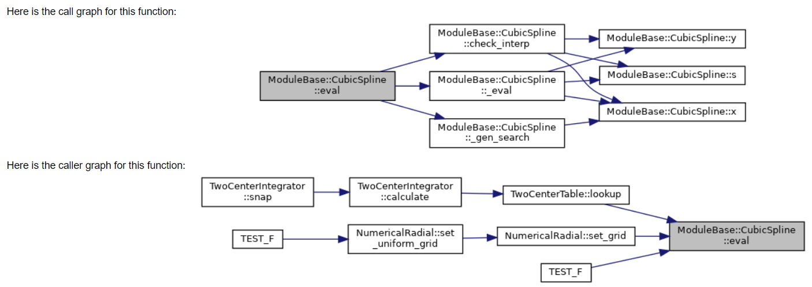

Doxygen 可以将类的继承关系生成图表。下图展示了 `ModuleESolver::ESolver` 的一系列继承

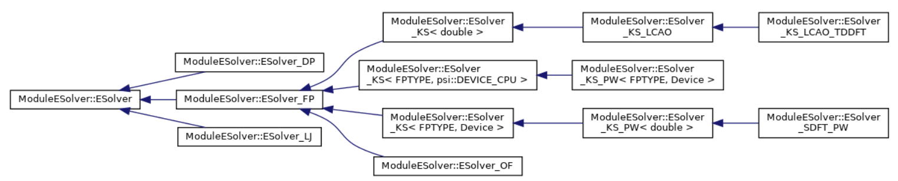

Doxygen 可以生成类的协作图（collaboration diagram）。下图展示了 `container::Tensor` 的成员以及成员的成员之间的关系：

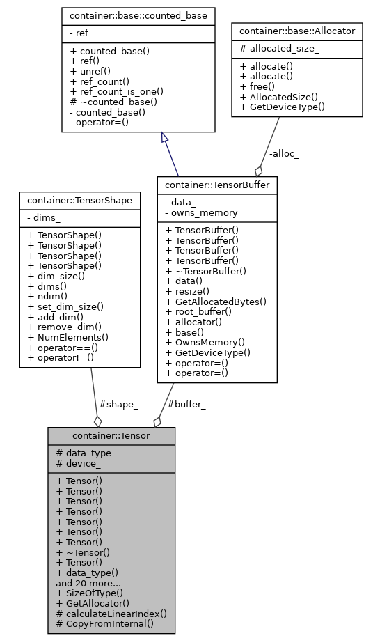

Doxygen 可以生成文件夹之间的依赖关系图。下图展示了 `source/module_basis` 及其内部成员文件夹与其他文件夹的耦合。

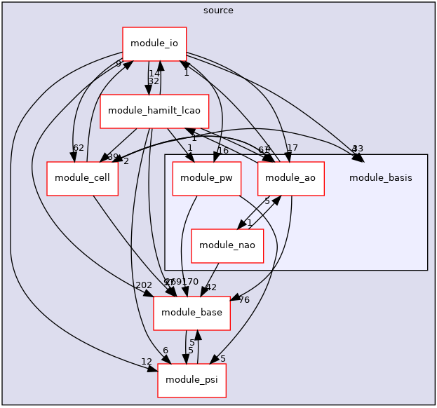

Doxygen 可以将头文件的 include 关系可视化成图表 (include dependency graph)。下图（部分地）展示了 `module_basis/module_nao/numerical_radial.h` 包含与被包含的情况：

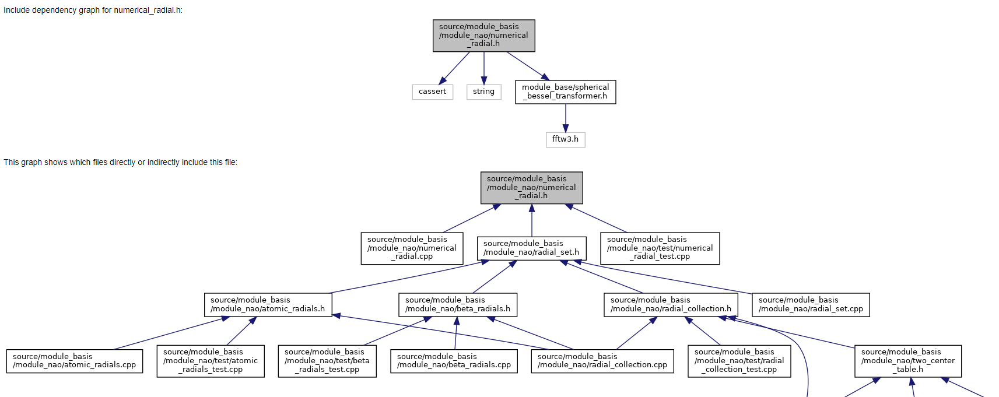

大量项目使用 Doxygen 生成文档 (https://www.doxygen.nl/projects.html)。对科学计算开发者而言一个著名的例子是 LAPACK 的在线文档 [https://www.netlib.org/lapack/explore-html/](https://www.netlib.org/lapack/explore-html/)

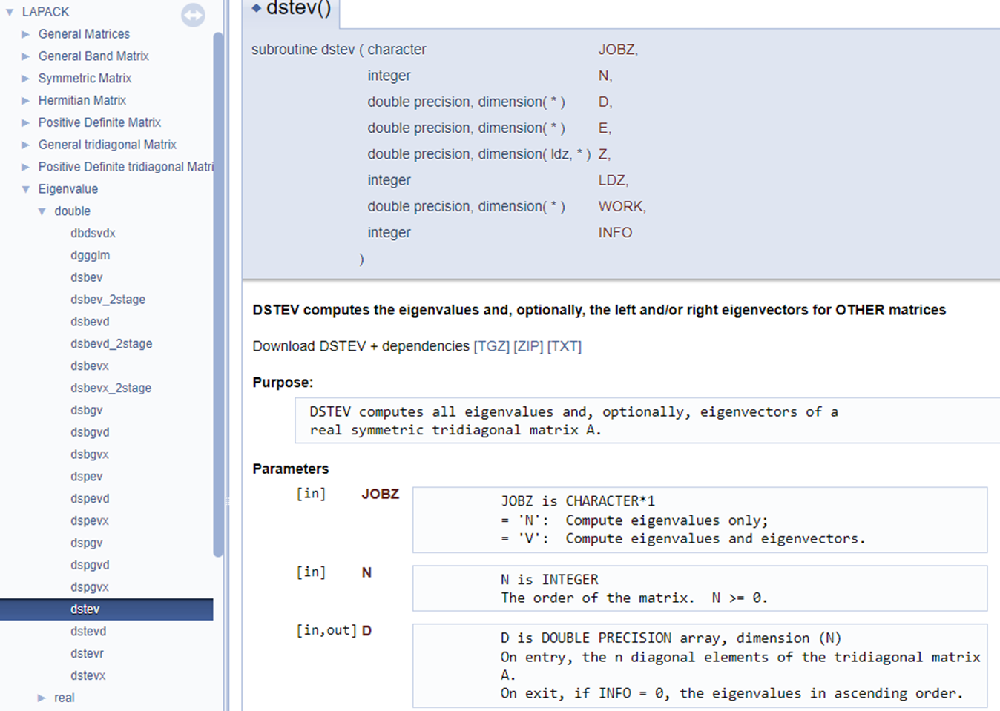

# 二、如何使用 Doxygen

Doxygen 可以自动识别代码逻辑并生成以上例子中的函数调用、类的继承与协作、文件夹依赖以及头文件依赖等图表。但是，对理想的开发者文档而言代码注释中的信息亦不可或缺。在最终生成的文档中，除以上自动生成的图表外，Doxygen 会将类的成员与函数一一列举，并识别代码中特定格式的注释后将其附在对应位置。

## 1. 如何写能被 Doxygen 识别的注释

通常开发者会希望一部分精心撰写的注释——比如类的功能介绍或者函数参数的含义——出现在开发者文档里，而不希望文档充斥着临时变量的描述或某一行意义的解释。Doxygen 充分考虑了这一点。事实上，普通的注释均会被 Doxygen 忽略；只有特定格式的注释会被 Doxygen 识别。下面的代码是一个简单的例子。尽管其中各处都附上了注释，但这些均不会出现在最终生成的文档中：

```cpp
// A class that represents a circle.
// This toy class will be used to demonstrate the usage of Doxygen.
class Circle {
public:
    // Initializes a Circle object with a given radius.
    // A unit circle is assumed by default.
    Circle(double r = 1.0);

    // Rescales a Circle object.
    // The radius of the given Circle object is multiplied by the given factor.
    static void rescale(Circle* circ, // pointer to the Circle object
                        double factor // radius rescaling factor
                       );

private:
    double r_; // radius of the Circle object
    static constexpr double PI = 3.14159265358979324;
};
```

以上代码生成的文档如下。Doxygen 会自动将成员变量和函数一一列举，但由于注释不符合特定格式，因而不会出现在文档相应位置。

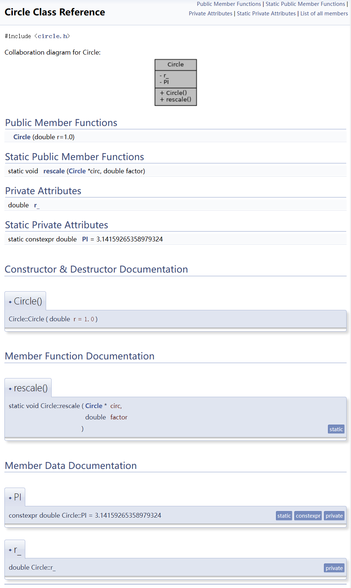

下面介绍如何写能被 Doxygen 识别的注释以及一些基本用法。

### 1.1 基本格式

在 c++ 中 Doxygen 会识别以下三种注释格式：

- Javadoc-style

```cpp
/**
 *  This is a Javadoc-style comment
 */
```

- Qt-style

```cpp
/*!
 * This is a Qt-style comment
 */
```

- Extended c++ style

```cpp
/// This is the so-called extended c++-style comment
//! This also works!
```

以上三种格式本身均是合法的 C++ 注释，只是在 // 和 /*  */ 的基础上添加了额外的 '*' ，'!' 或 '/' 。一旦文档中出现了以上三者之一，Doxygen 便会将之后的注释内容填入文档的相应位置。这三种基本格式是所有 Doxygen 用法的基础，所有的进阶功能（如 group，module，equation 等）均需在这三者之一开启的注释行/块内实现。这三种基本格式可以混用，开发者可以按自己的习惯选择一种或多种使用。

Doxygen 默认注释作用于之后的类、变量或函数（允许有空行）。如我们希望注释作用于之前的对象，则可在基本格式后立刻添加 '<' 符号，例如

```cpp
//！ this comment line applies to print(), even though there's an empty line below

void print();
///<  this comment line also applies to print(), not get(); note the '<' character!
int get();
```

### 1.2 详细与简略描述

如之前例子所示，Doxygen 自动生成类的文档时会先把成员函数与变量罗列在开头，随后才是每个成员的介绍（当然，由于之前的例子里没有采用 doxygen 格式，详细描述为空）。只要使用了基本格式，Doxygen 就会自动将注释附在对应成员处。比如若将之前构造函数前的 // 注释替换为 /// :

```cpp
/// Initializes a Circle object with a given radius.
/// A unit circle is assumed by default.
Circle(double r = 1.0);
```

这些内容即会出现在原先为空的 Constructor & Destructor Documentation 下 Circle()的描述里:

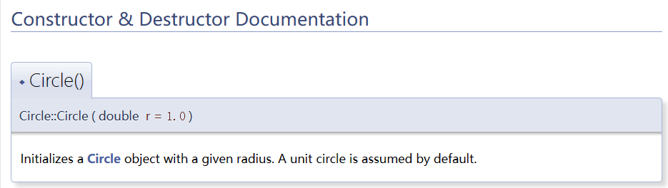

Doxygen 还允许让一些简略描述出现在类文档的开头部分。有两种方式可以实现这一目的。较为正式的方式是在注释块里添加 `@brief ` 或者 `\brief`。以这种方式指定的简略描述可以跨多行（如下面开头 Circle 类的注释）。另一种较为轻便的方式是使用<strong>单行</strong>的 extended C++ style 注释，如下面 Circle 的构造函数。【多行的 extended c++ style 注释只会被当做详细描述】

```cpp
/**
 * @brief A class that represents
 *        a circle.
 *
 * This toy class will be used to demonstrate the usage of Doxygen
 */
class Circle {
public:
    /// Initializes a Circle object with a given radius.
    /*!
     * A unit circle is assumed by default.
     */
    Circle(double r = 1.0);

    /*!
     * \brief Rescales a Circle object.
     *
     * The radius of the given Circle object is multiplied by the given factor.
     *
     */
    static void rescale(Circle* circ,
                        double factor
                       );

private:
    double r_; ///< radius of the Circle object
    static constexpr double PI = 3.14159265358979324;
};
```

以上代码生成的 Doxygen 文档在开头罗列部分会出现对应的简略描述；详细介绍部分则会包括所有的注释（包括 brief）。

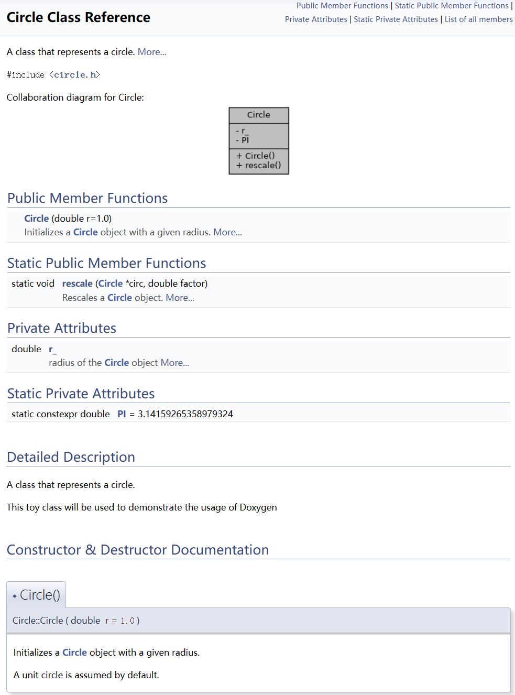

### 1.3 函数参数

一个开发者写的函数经常会被很多其他开发者使用。除对函数整体功能的描述外，每个参数含义的注释也十分重要。Doxygen 支持两种给函数参数添加注释的方式。较为正式的方式是在注释块内添加 `@param` 或 `\param`：

```cpp
/*!
 * \brief Rescales a Circle object.
 *
 * The radius of the given Circle object is multiplied by the given factor.
 *
 * @param [in,out] circ     Pointer to the Circle object to be rescaled.
 * @param [in]     factor   Radius rescaling factor.
 */
static void rescale(Circle* circ,
                    double factor
                   );
```

较为轻便的方式是在函数声明的参数列表里直接添加（加在参数后注意要使用 '<' ）

```cpp
/*!
 * \brief Rescales a Circle object.
 *
 * The radius of the given Circle object is multiplied by the given factor.
 */
static void rescale(Circle* circ, ///<[in,out] Pointer to the Circle object to be rescaled.
                    double factor ///<[in] Radius rescaling factor.
                   );
```

`[in]`, `[out]` 或 `[in, out]` 可以提示该参数是输入还是输出参数。这并非 Doxygen 的强制要求，但十分推荐。

以上两种参数注释方式对 Doxygen 而言是等价的，开发者可按习惯选择一种使用，生成的函数描述如下：

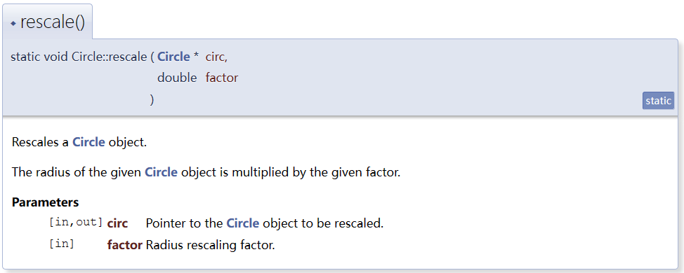

### 1.4 数学公式

有时一些函数严格对应了某个公式，这种情况下直接用数学公式作为注释的效果可能胜过大段的文字描述。Doxygen 允许开发者以 Latex 的语法实现公式注释。如有在文字中嵌入公式的需求，可以采用 `\f$ ... \f$`：

```cpp
/// A constant that represents the value of \f$ \pi \f$.
    static constexpr double PI = 3.14159265358979324;
```

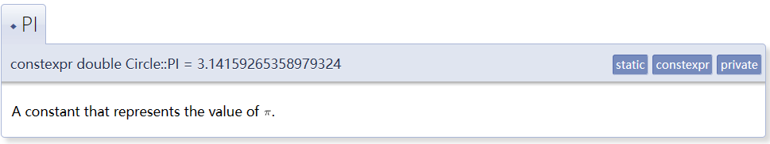

<strong>单行</strong>公式由 `\f[ ... \f]` 实现：

```cpp
/*!
 * @brief Returns the area of the current Circle object.
 *
 * The area of the a circle is given by
 *
 * \f[ S = \pi r^2 \f]
 */
 double area() const;
```

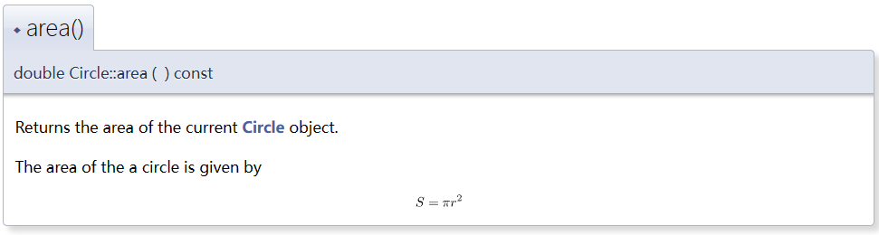

如有多行公式的需求，Doxygen 支持调用 eqnarray 等 latex 数学环境：

```cpp
/*!
 * @brief Returns the circumference of the current Circle object.
 *
 * The circumference of the a circle is given by
 *
 * \f{eqnarray*}{
 *      L &= \pi d \\
 *        &= 2 \pi r
 * \f}
 *
 */
double circumference() const;
```

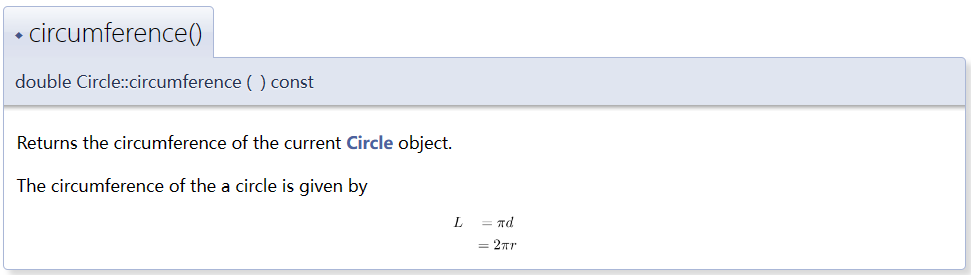

【在配置文件中采用 “USE_MATHJAX = YES” 可以调用 mathjax 渲染公式得到更好的视觉效果】

### 1.5 列表

Doxygen 还有大量用法可供用户生成理想的文档。

对齐的 '-', '+' 或 '*' 可自动生成列表 (bullet list)；'-#'则可用来生成带序号的列表：

```cpp
/**
 * @brief A class that represents
 *        a circle.
 *
 * This toy class will be used to demonstrate the usage of Doxygen
 *
 * List of functionalities:
 * -# initialize a Circle object with a given radius
 *   - a unit circle is assumed by default
 * -# get the radius of the current Circle object
 * -# get the area of the current Circle object
 * -# get the circumference of the current Circle object
 * -# rescale a Circle object by a factor
 *
 */
class Circle                              */                                                */
```

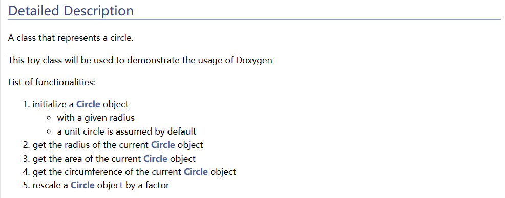

### 1.6 Member Group & Module

变量或函数可以由 `@{ ... ``@}` 归类为 member group 并附上相应注释，这能使文档更有层次感：

```cpp
///@{ @name Properties
/// Functions that return the properties of the current Circle object.

/// Gets the radius of the current Circle object.
double radius() const { return r_; }

/*!
 * @brief Returns the area of the current Circle object.
 *
 * The area of the a circle is given by
 *
 * \f[ S = \pi r^2 \f]
 */
double area() const;

/*!
 * @brief Returns the circumference of the current Circle object.
 *
 * The circumference of the a circle is given by
 *
 * \f{eqnarray*}{
 *      L &= \pi d \\
 *        &= 2 \pi r
 * \f}
 *
 */
double circumference() const;
///@}
```

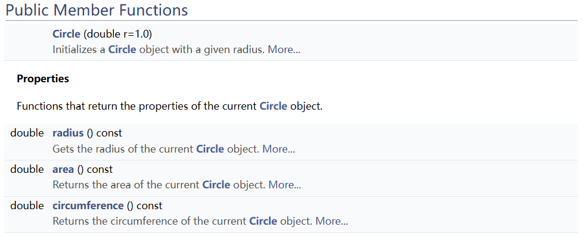

有共性的类之间亦可归类组成 Modules:

```cpp
/// @defgroup shape Shape Module
/// @brief A module that contains various shape classes.
///
/// This module contains the following classes:
/// - Circle
/// - Rectangle
/// - Triangle

/// @addtogroup shape
/// @{
class Circle {
...
};
///@}

/// @addtogroup shape
/// @{
class Rectangle {
...
};
///@}

/// @addtogroup shape
/// @{
class Triangle {
...
};
///@}
```

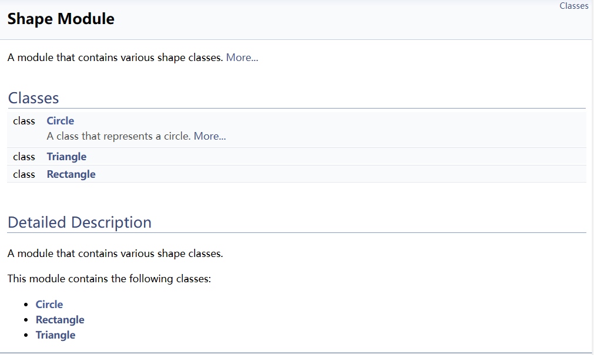

更多用法可参考官方文档 [Doxygen Manual: Overview](https://www.doxygen.nl/manual/index.html)

## 2. 如何生成文档

上一节介绍了 Doxygen 支持的注释格式以及一些常见的使用方式。以下以 Ubuntu 用户为例介绍让开发者在本地生成 html 文档的方法：

1\. 安装 doxygen 与 graphviz

```bash
sudo apt install doxygen graphviz
```

2\. 生成 Doxygen 的配置文件

```bash
doxygen -g  <your_preferred_doxyfile_name>
```

默认的配置文件名为 Doxyfile。

3\. 修改配置文件

配置文件内已经包含介绍各选项的注释。常用的选项包括：

- `INPUT`：用以生成文档的文件夹或文件路径
- `RECURSIVE`：是否遍历给定路径下的所有子文件夹
- `EXCLUDE`：是否要排除一些子文件夹或子文件
- `EXTRACT_PRIVATE`, `EXTRACT_STATIC`, `EXTRACT_PRIV_VIRTUAL`：文档是否要包括私有成员/静态成员/私有虚函数
- `CALL_GRAPH`, `CALLER_GRAPH`: 文档是否要包含函数调用/被调图
- `PREDEFINED`：预编译宏
- `MACRO_EXPANSION`：是否要展开宏定义
- `EXPAND_ONLY_PREDEF`：是否只展开 PREDEFINED 的宏定义

一个可供参考的 Doxyfile 可见于 [Doxygen 使用](https://dptechnology.feishu.cn/docs/doccnz21EL13dyZnJPug3v8N2pc) （赵天琦）

完整的配置选项可参考官网 [Doxygen Manual: Configuration](https://www.doxygen.nl/manual/config.html)

4\. 运行 doxygen

假设配置文件叫 `my_doxyfile`：

```bash
doxygen my_doxyfile
```

# 附录：Doxygen 与 VS Code

Visual Studio Code 上有 doxygen 插件 [Doxygen Documentation Generator - Visual Studio Marketplace](https://marketplace.visualstudio.com/items?itemName=cschlosser.doxdocgen#generate-doxygen-comments-in-vs-code) 可供 VS Code 用户方便使用。

【注：前文中有提到对 doxygen 而言三种基本注释格式可以混用；混用的注释会合并在一起作用于注释后的对象。这个特性与 VS Code 中鼠标悬停于类或函数上时出现的预览窗口不兼容；如注释格式混用则会导致前一种格式的注释被忽略】
