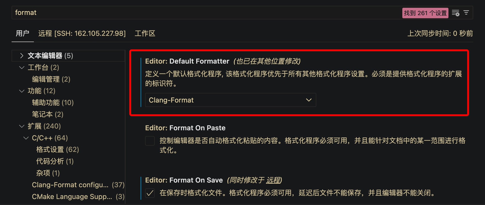

# ABACUS 中使用格式化工具 clang-format

<strong>作者：韩昊知，邮箱：haozhi.han@stu.pku.edu.cn</strong>

<strong>审核：陈默涵，邮箱：mohanchen@pku.edu.cn</strong>

<strong>最后更新时间：2023/10/03</strong>

# 一、引言

<strong>良好统一的代码风格在多人协同开发中至关重要，这一点在 ABACUS 团队里也尤其重要，特别是考虑到大部分的开发者都是研究生，没有经过特别系统的编程训练，那么好的代码风格能够降低阅读代码的障碍，加快开发效率，甚至可以防止一些不必要的 bug 的产生。</strong>

clang-format 是一个开源的代码格式化工具，它可以帮助程序员自动调整源代码的格式，以符合指定的编码风格规范。clang-format 可以在保持代码功能不变的情况下，自动处理缩进、空格、括号、逗号等细节，提高代码的可读性和一致性。

# 二、在 ABACUS 中使用 clang-format

clang-format 支持包括 LLVM、Google、Chromium、Mozilla、WebKit 等在内的多种代码风格，如果不指定自定义的代码风格，每次对代码进行格式化时使用的将是 clang-format 默认的风格。

clang-format 还支持在已有的代码风格基础之上自定义一个名为 `.clang-format` 的代码风格文件，clang-format 就可以根据文件中定义的规则对代码进行格式化。

在 ABACUS 开源项目中，开发者已经制定了针对 ABACUS 项目的代码风格文件 `.clang-format`，其位于项目的根目录下。（[https://github.com/deepmodeling/abacus-develop/blob/develop/.clang-format](https://github.com/deepmodeling/abacus-develop/blob/develop/.clang-format)）

<strong>注意事项：ABACUS 开源项目中的.clang-format是依赖于 clang-format-14 标准的，因此请确保你的 clang-format 不低于 14 版本。</strong>

## 1. 在系统上安装 clang-format

clang-format 有诸多版本可供使用，目前最新版本为 clang-format 18。不同版本所支持的格式化选项不尽相同，但向后兼容。

安装统一版本的 clang-format（ABACUS 项目中统一选择 clang-format-14）

```bash
# Linux上，以Ubuntu为例：
sudo apt install clang-format-14

# 验证是否安装成功，并查看安装的版本号：
clang-format-14 --version
```

> <strong>⚠</strong> 这里应注意，不能通过 `sudo apt install clang-format` 命令进行安装，因为对于不同的 Ubuntu 发行版而言，通过该命令安装得到的 clang-format 版本是不同的。

安装完成后，我们能够使用的命令名是 `clang-format-14`，我们将其提级为 `clang-format`：

```bash
sudo update-alternatives --install /usr/bin/clang-format clang-format /usr/bin/clang-format-14 100
```

后面当我们使用 `clang-format` 命令时，指代的即为 `clang-format-14`。

```bash
# 此时再次验证安装的版本号：（应为 14 版本）
clang-format --version
```

## 2. 基于 vscode 使用 clang-format

基于 vscode 使用 clang-format，我们可以选择安装支持 clang-format 的插件，即可更方便的使用 clang-format。

但由于插件商场有很多插件都支持 clang-format 功能，且其支持的 clang-format 版本经常变化。所以我们应尽量选择支持更为稳定的插件进行使用。

> 通过 vscode 进行 C++ 开发时，我们一般会安装微软官方的 [C/C++ 插件](https://marketplace.visualstudio.com/items?itemName=ms-vscode.cpptools)，打开该插件的安装目录我们会发现，该插件已经封装了一个内置的 clang-format。那为什么不直接使用这个 C/C++ 插件内置的 clang-format 呢？
>
> - 不同版本的 C/C++ 插件内置的 clang-format 版本往往不同，就带来不必要的麻烦。

为了使用统一的 clang-format-14，我们建议在 vscode 中安装 [Clang-Format（Xaver Hellauer） 插件 ](https://marketplace.visualstudio.com/items?itemName=xaver.clang-format)。

安装完成后，打开“File -> Preferences -> Settings”，搜索“format”，如下图：



将 Default Formatter 刚换为新下载的 Clang-Format 插件。

之后在一个文件内，通过 "option" + "shift" + "F" 快捷键，即可实现对当前代码文件的格式化。

## 3. 基于命令行使用 clang-format

除了使用 vscode ，可能还会有使用命令行进行开发的开发者。

使用方式：

```bash
clang-format -style=file -i demo.cpp
```

# 三、参考文献：

[使用 clang-format 进行 C++ 代码风格管理](https://blog.shipengx.com/archives/ed6ff3ad.html)

1. [Clang-Format 用法详解](https://zhuanlan.zhihu.com/p/641846308)
2. [Clang-Format Style Options — Clang 14.0.0 documentation](https://releases.llvm.org/14.0.0/tools/clang/docs/ClangFormatStyleOptions.html)
3. [C++ programming with Visual Studio Code](https://code.visualstudio.com/docs/languages/cpp#_code-formatting)
4. [基于 vscode 使用 clang-format（旧版）](https://xmywuqhxb0.feishu.cn/docx/NwtLdHTGYob6vWx29vHc7JDrnM4)
