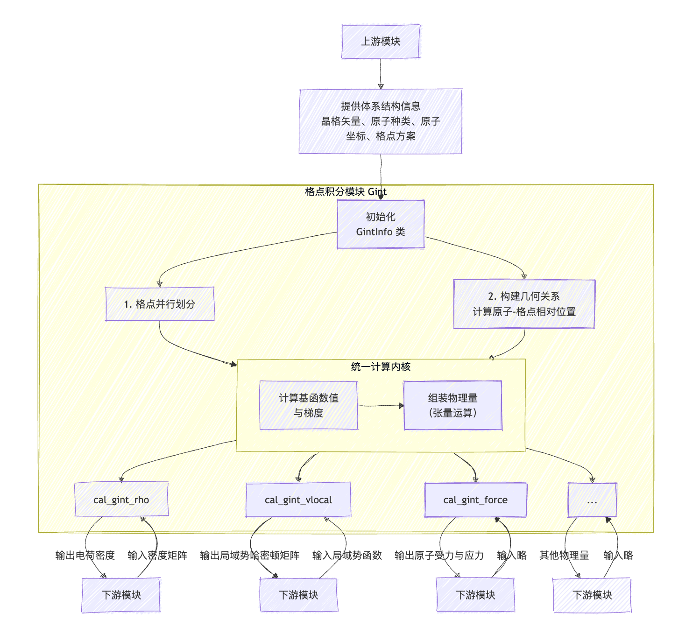

# 格点积分模块介绍

**作者：邓子超，邮箱：zcdeng@pku.edu.cn**

**审核：陈默涵，邮箱：mohanchen@pku.edu.cn**

**单位：北京大学**

**最后更新时间：2025/09/15**

# 一、功能介绍

格点积分模块（Grid Integration Module），简称 Gint 模块，是 ABACUS 软件在使用线性组合原子轨道基组（LCAO, Linear Combination of Atomic Orbitals）进行第一性原理计算时的核心数值计算组件之一。在 LCAO 方法中，体系的电子态由局域化的原子轨道基函数展开表示，而许多关键物理量（如电子密度、哈密顿矩阵的局域势部分等）的求解，依赖于这些原子轨道基组（及其一阶、二阶导数）在实空间规则格点上的数值展开。

这类物理量的计算流程遵循统一的逻辑链条：

**计算各格点上的原子轨道基函数值 → 基于基函数及其导数构造目标物理量**

Gint 模块正是为实现这一核心计算流程而设计的模块，它负责所有依赖于实空间格点积分的物理量的统一计算。

> ABACUS 在 v3.9.0.9 版本重构了格点积分代码，使得格点积分整体代码更加模块化，功能划分更加清晰。因为格点积分整体代码改动太大，基于稳定性考量，目前 ABACUS 仓库中（截止 v3.9.0.14 版本）同时保存了旧的格点积分代码以及新的格点积分代码，旧代码在 source_lcao/module_gint 目录下，新代码在 source_lcao/module_gint/temp_gint 目录下，编译时默认编译新格点积分代码，如果需要编译旧格点积分代码，需要添加编译选项“-DOLD_GINT=1"。**以下介绍均是基于 ABACUS v3.9.0.14 版本**。

## 模块概述

**对外接口：**

Gint 模块对外提供一套简洁的物理量求解接口，封装了内部复杂的格点管理和并行计算细节。用户通过调用这些接口，传入必要的参数（如势场、密度矩阵），即可触发相应物理量的计算。其主要输出的物理量包括电子密度、局域势哈密顿量、原子力、应力张量等等。这些接口使得上层模块无需关心格点积分的具体实现，目前在 gint_interface.h 中可以看到大部分的计算接口，同时在 source_lcao/module_gint/temp_gint 下可以看到负责不同物理量求解的类，比如 gint_vl.cpp 对应实空间哈密顿量局域势计算的实现，gint_vl_nspin4.cpp 对应 nspin=4 情况下哈密顿量局域势计算的实现，gint_rho.cpp 对应电荷密度计算的实现，想要清楚这些不同物理量计算接口的具体实现可以参考这些类。

**内部实现：**

为实现上述接口的高效执行，Gint 模块在内部承担了以下核心功能：

1. **管理周期性边界条件**

   - 模块负责识别每个实空间格点周围哪些原子的基函数具有非零贡献（基于轨道截断半径）。
   - 处理晶体周期性：不仅搜索原胞内的原子，还自动扩展至所有相邻原胞，找出所有对格点有贡献的周期性原子映像。
   - 对于每个对当前格点有贡献的原子，模块记录其所属原胞相对于中心原胞的平移矢量 $${R}$$（布拉维格矢），为后续计算提供正确的相对位置。
2. **计算原子轨道基函数值**

   - 对于每个有效格点，通过查表与插值快速计算原子轨道的径向函数部分。
   - 结合实数球谐函数 $$Y_{lm}(\theta, \phi)$$，合成完整的原子轨道基函数值 $$\phi_i(\mathbf{r})$$ 及其笛卡尔坐标梯度 $$\nabla \phi_i(\mathbf{r})$$。此步骤是后续所有计算的基础。
3. **提供统一计算内核**

   - 基于计算出的基函数值，模块提供一组通用运算内核（如点积、外积、矩阵乘法等）。
   - 这些内核作为基础“积木”，被不同物理量的特定计算公式所调用，用于构造电子密度、哈密顿矩阵等，实现了代码的复用和统一管理。
4. **负责并行计算与数据分发**

   - 格点并行：为支持大规模并行计算，模块将实空间格点沿 Z 轴进行划分（未来计划支持三维划分），每个 MPI 进程仅负责其本地子区域内的格点计算。
   - 数据转换与通信：由于 ABACUS 中哈密顿矩阵与密度矩阵以 2D 块循环方式并行分布，而 Gint 模块需要基于“原子-格点”关系进行计算，因此它负责管理这两种不同数据分布模式之间的转换。确保每个进程能获取其负责的格点区域所需的全部矩阵子块数据。

# 二、调用方法

对大部分开发者来说，只需要知道如何调用格点积分提供的接口来计算所需物理量即可，并不需要知道格点积分内部是如何实现的，这节内容将介绍具体的调用方法。

简单来说，调用格点积分接口分为两步，第一步是初始化 `GintInfo` 类，这个类负责管理格点与原子相关的几何与拓扑信息（周期性边界条件），相当于格点积分计算的上下文，格点积分上下文设置好后即可调用对应函数进行具体的物理量计算。

在每个离子步开始时，需传入以下体系结构信息来构造 `GintInfo` 类实例：

- 晶格参数：原胞大小、晶格矢量等；
- 原子信息：原子种类、坐标位置及原子轨道函数信息等；
- 格点划分方案：格点在不同 MPI 进程间的分布方式（当前格点切分策略与平面波模块保持一致，需由平面波模块传入）。

`GintInfo` 类的构造函数内部实际做下下面三件事情：

1. 对原胞进行网格划分，存储网格划分信息，用于后续计算原子与格点之间的相对位置；
2. 根据原子轨道半径，筛选出对每个格点有非零贡献的原子及其周期性映像，计算它们与格点之间的相对位置；
3. 将这些几何关系数据存储于 `GintInfo` 类中，为后续所有物理量的计算提供统一的几何上下文，避免重复计算。

`GintInfo` 是 `Gint` 类的静态成员变量。格点积分模块中所有用于计算物理量的类均继承自 `Gint` 类，因此一旦完成 `GintInfo` 的初始化，即可通过格点积分模块提供的接口进行物理量计算。需要注意的是，由于原子位置可能在每个离子步中发生变化，因此需在每个离子步开始时重新初始化 `GintInfo`。初始化完成后，若要计算某一物理量，只需调用 `gint_interface.h` 中对应的函数即可。

以计算局域势哈密顿量为例，具体调用代码如下：

1. `Esolver_KS_LCAO` 类有一个类成员是指向 `GintInfo` 的 `unique_ptr`，我们在 `Esolver_KS_LCAO` 类的 `before_scf` 函数中初始化这个 `unique_ptr`:

```cpp
gint_info_.reset(
        new ModuleGint::GintInfo(
        this->pw_big->nbx,
        this->pw_big->nby,
        this->pw_big->nbz,
        this->pw_rho->nx,
        this->pw_rho->ny,
        this->pw_rho->nz,
        0,
        0,
        this->pw_big->nbzp_start,
        this->pw_big->nbx,
        this->pw_big->nby,
        this->pw_big->nbzp,
        orb_.Phi,
        _ucell_,
        this->gd));
    ModuleGint::Gint::set_gint_info(gint_info_.get());
```

代码分为两步，第一步，传入格点与原子信息，构造一个新的 `GintInfo` 类实例。该实例由 `Esolver_KS_LCAO` 类成员中的 `unique_ptr` 进行管理，以确保其所分配的资源能够随 `Esolver_KS_LCAO` 的析构而自动释放，避免内存泄漏。
第二步，调用 `Gint` 类中的一个静态函数 `set_gint_info`，将 `Gint` 类内部的静态 `GintInfo` 指针指向新创建的实例。此后，通过 `Gint` 模块执行的所有物理量计算均将在这一新的 `GintInfo` 上下文环境中进行。

1. `GintInfo` 初始化完成后，计算局域势哈密顿量只需要一行代码：

```cpp
ModuleGint::cal_gint_vl(vr_eff1, this->hR);
```

这个函数有两个参数，第一个参数是入参，表示局域势数组，第二个参数是出参，用来存储求得的哈密顿矩阵。

---

> 如果你是外部模块的开发者，仅需调用格点积分模块提供的现有物理量计算接口，那么前两节的内容已足够帮你理解其功能与使用方式。

> 但如果你有功能扩展的需求，比如你希望计算的物理量本应由 Gint 模块负责，但在 `gint_interface.h` 中没有提供相应接口，而且在 `module_gint` 目录下也缺乏具体实现，你只能借助 Gint 底层模块自己实现这个接口。又或者是你想对格点积分的核心计算过程进行性能调优——鉴于 Gint 模块通常是 LCAO 方法中的计算热点，调优给 ABACUS 程序整体带来的加速是很明显的。在这些情况下，你不仅应该知道“格点积分模块做了什么”，更应该了解“格点积分是怎么做的”。为此，后面几节内容将介绍格点积分物理背景到算法的具体实现，我们会结合 Gint 模块的底层代码来讲，为开发者提供开展二次开发与性能优化所需的完整知识。

# 三、物理背景

## 原子及轨道基函数

在原胞中包含若干原子，记为 $$I, J,\ldots$$，每个原子 $$I$$ 在原胞中的位置表示为 $$\mathbf{r}_I$$。在局域轨道基组方法（Linear Combination of Atomic Orbitals, LCAO）框架下，Kohn-Sham 轨道被展开为一组中心位于原子核的局域轨道基函数。每个原子轨道基函数（Atomic Orbital, AO）是一个以原子 $$I$$ 为中心的空间函数，其一般形式为：$$\phi_{nlm}(\mathbf{r} - \mathbf{r}_I) = R_n(|\mathbf{r} - \mathbf{r}_I|) \cdot Y_{lm}({\mathbf{r}} - \mathbf{r}_I)$$
其中：

- $R_n(r)$为径向波函数。
- $Y_{lm}(\theta, \phi)$ 为实球谐函数，描述轨道的角向分布特性。
- $(n, l, m)$为量子数，分别对应主量子数、角量子数和磁量子数，决定轨道的类型（如 s、p、d 等）。

由于晶体具有平移对称性，每个原子 $$I$$ 在空间中会生成无限多个周期像，其位置为 $$\mathbf{R} + \mathbf{r}_I$$，其中 $$\mathbf{R}$$为任意布拉维晶格平移矢量，在之后的表述中，我们$$I(\mathbf{R})$$来表示原子 $$I$$在$$\mathbf{R} + \mathbf{r}_I$$处的周期像。相应地，原子 $$\alpha$$ 在晶格位置 $$\mathbf{R}$$ 处的周期像所对应的原子轨道基函数定义为：
$$\phi_{nlm}(\mathbf{r} - \mathbf{r}_I - \mathbf{R}) = R_n(|\mathbf{r} - \mathbf{r}_I - \mathbf{R}|) \cdot Y_{lm}({\mathbf{r}} - \mathbf{r}_I - \mathbf{R})$$
这类轨道在空间中随原子位置周期性重复，构成了整个晶体电子结构展开的基础。
值得注意的是，实际使用的原子轨道具有明确的**空间局域性**，即其函数值在距离原子核超过某一截断半径 $$r_{\text{cut}}^\alpha$$后可忽略不计。因此，在数值计算中无需考虑所有无限多个周期像。对于实空间中的某个格点$$\mathbf{r}_g$$，只需计入那些满足以下条件的周期像：$$|\mathbf{r}_g - \mathbf{r}_I - \mathbf{R}| < r_{\text{cut}}^I$$即可保证基函数贡献的完整性。对于原子 $I$，若其支持 $nw_I$ 个轨道（例如 s 轨道 1 个、p 轨道 3 个、d 轨道 5 个），则该原子（或其某一周期像）在作用范围内的每个格点 $$\mathbf{r}_g$$ 上的原子轨道基函数值构成一个实向量：$${\phi}_{I}(\mathbf{r}_g-\mathbf{R}) =
\left[
\phi_{nlm_1}(\mathbf{r}_g - \mathbf{r}_I- \mathbf{R}),\
\phi_{nlm_2}(\mathbf{r}_g - \mathbf{r}_I - \mathbf{R}),\
\dots,\
\phi_{nlm_{nw_I}}(\mathbf{r}_g - \mathbf{r}_I - \mathbf{R})
\right]^T \in \mathbb{R}^{nw_I}$$我们记 $${\phi}_{I}(\mathbf{r}_g-\mathbf{R})$$ 为原子 $$I$$ 在晶格矢量 $$\mathbf{R}$$ 处的周期像在格点 $$\mathbf{r}_g$$ 上的轨道值向量。

## 实空间哈密顿量局域势部分

### 求解公式

在 Kohn-Sham 密度泛函理论中，系统的总哈密顿量包含多个部分，其中**局域势哈密顿量**（Local Potential Hamiltonian）是与空间位置相关的势场作用项，主要包括：

- 离子的局域赝势（$$V_{\text{local}}^{\text{ion}}$$）
- Hartree 势（$$V_{\text{Hartree}}$$）
- 交换关联势的局域部分（$$V_{\text{xc}}$$）

这些势场在实空间中是局域的，即它们在某一点 $$\mathbf{r}$$ 的值仅依赖于该点的电子密度或原子核位置。因此，其对应的哈密顿矩阵元可以通过实空间格点积分计算。

实空间哈密顿矩阵局域势部分的计算公式为：

$$
H_{IJ}^{loc}(\mathbf{R}) = \int \phi_I^*(\mathbf{r-\mathbf{R}_I}) \left[ V_{\text{local}}(\mathbf{r}) \right] \phi_J(\mathbf{r}-\mathbf{R}_J) d\mathbf{r}
$$

公式说明：

- $$
  V_{local} = V_{\text{local}}^{\text{ion}} + V_{\text{Hartree}} + V_{\text{xc}}
  $$
- $\mathbf{R} = \mathbf{R}_I - \mathbf{R}_J$，其中$$\mathbf{R}_I$$和$$\mathbf{R}_J$$为原子或者原子像所属晶格的平移矢量，实空间哈密顿矩阵$$H^{loc}$$按不同原子对对应的子矩阵$$H_{IJ}^{loc}(\mathbf{R})$$存储，在**多 k 点算法**中，每个子矩阵依靠三元组$$(I,J,\mathbf{R})$$来索引，在 **gamma-only 算法**中我们不需要追踪$$\mathbf{R}$$索引，每个子矩阵只依靠二元组$(I,J)$来索引。

在实际数值计算中，该积分通过实空间格点离散化进行近似:$$H_{IJ}^{loc}(\mathbf{R}) =   [\sum_g {\phi}_I(\mathbf{r}_g-\mathbf{R}_I) \otimes {\phi}_J(\mathbf{r}_g-\mathbf{R}_J)] V_{\text{local}}(\mathbf{r}_g)\Delta v$$其中$$\Delta v$$为格点体积，求和遍及所有格点$$\mathbf{r}_g$$。可以看到，按照离散化后的公式，我们只需要在每个格点上对不同原子对应的原子轨道向量进行外积运算，并按权重累加到相应的 $$H_{IJ}^{\text{loc}}(\mathbf{R})$$ 子块中。在实际程序中我们还会将相邻格点上的原子轨道向量合并为矩阵，将向量外积运算转化为高效的矩阵乘法运算。

### 哈密顿矩阵存储

在 ABACUS 中，实空间局域势哈密顿矩阵由专门设计的 `HContainer` 类统一管理。由于原子轨道具有紧致截断特性，绝大多数原子对 $$(I,J)$$ 的轨道支持区域不重叠，对应子块$$H_{IJ}^{\text{loc}}(\mathbf{R})$$ 为零矩阵。为高效利用内存资源，`HContainer` 采用稀疏存储策略，仅分配和保存非零子块，避免对全零矩阵进行冗余存储。更重要的是，`HContainer` 封装了多 k 点与 Gamma-only 计算模式下的不同数据组织方式，对外提供一致的访问接口：

- **多 k 点算法**：哈密顿矩阵按 $$\mathbf{R}$$ 分块存储，每个非零子块由三元组 $$(I, J, \mathbf{R})$$ 唯一索引。不同的 $$\mathbf{R}$$ 对应不同的矩阵块 $$H(\mathbf{R})$$，用于后续在 $$\mathbf{k}$$ 空间中进行傅里叶变换： $$H(\mathbf{k}) = \sum_{\mathbf{R}} e^{-i\mathbf{k}\cdot\mathbf{R}} H(\mathbf{R})$$
- **Gamma-only 算法**：由于 $$\mathbf{k} = \mathbf{0}$$，所有 $$\mathbf{R}$$ 对应的贡献可累加至单一全局矩阵：
$$H^{\text{loc}} = \sum_{\mathbf{R}} H(\mathbf{R})$$
此时无需追踪 $$\mathbf{R}$$ 索引，所有原子对 $$(I,J)$$ 的贡献直接归并到同一个子块 $$H_{IJ}^{\text{loc}}$$ 中。`HContainer` 内部根据当前计算模式自动选择相应的索引策略与存储结构，屏蔽底层差异，使上层模块（如 Gint）无需区分两种情形即可调用统一接口完成哈密顿矩阵的构建。

### 多 k 点算法与 Gamma-only 算法区别

尽管多 k 点与 Gamma-only 算法在哈密顿矩阵的组织方式上存在区别，但在格点积分的具体计算流程中，二者的核心数值逻辑完全一致。关键差异仅体现在 $$H(\mathbf{R})$$**子块的归并策略**上：

- 在多 k 点计算中，需精确追踪每对原子 $$(I,J)$$ 所属的晶格平移差 $$\mathbf{R} = \mathbf{R}_I - \mathbf{R}_J$$，并将当前格点贡献累加至对应的 $$H_{IJ}^{\text{loc}}(\mathbf{R})$$子块；
- 在 Gamma-only 计算中，则忽略 $$\mathbf{R}$$ 信息，将所有满足相同原子类型对 $$(I,J)$$ 的贡献统一累加至单一矩阵块 $$H_{IJ}^{\text{loc}}$$。

得益于 `HContainer` 对索引机制的封装，Gint 模块在执行格点积分时无需显式判断当前运行模式，多 k 点算法和 Gamma-only 算法可复用同一套代码。

## 电子密度

### 求解公式

电子密度的计算公式为

$$\rho(\mathbf{r}) = \sum_{\mu\nu} \rho_{\mu\nu} \phi_\mu(\mathbf{r}) \phi_\nu(\mathbf{r})$$

其中$$\rho_{\mu\nu}$$是密度矩阵$$P$$的矩阵元。

### 基于原子对的算法实现

我们可以从原子对的角度重写上面公式，将原子轨道索引$$(\mu,\nu)$$转换为原子索引$$(I,J)$$,电子密度的计算公式可以重新组织为 $$\rho(\mathbf{r}) = \sum_{I(\mathbf{R_I})} {\phi}_I(r-\mathbf{R_I}) \cdot \sum_{J(\mathbf{R_J})}P_{IJ}(\mathbf{R}) {\phi}_J(\mathbf{r-\mathbf{R}_J})
$$，其中，$$P_{IJ}(\mathbf{R})$$表示密度矩阵$$P$$中由$$(I,J,\mathbf{R})$$索引的矩阵子块，对 gamma-only 算法来说，可以忽略这里的$$\mathbf{R}$$索引，仅由$$(I,J)$$索引密度矩阵子块

从重新组织的公式可以自然导出电子密度求解的两步算法实现方案，第一步是计算矩阵向量乘并累加：$${\phi}^{\prime}_I = \sum_{J(\mathbf{R_J})}P_{IJ}(\mathbf{R}) {\phi}_J(\mathbf{r-\mathbf{R}_J})$$，第二步是对两向量内积并累加：$$\rho(\mathbf{r})=\sum_{I} {\phi}_I \cdot {\phi^{\prime}}_J$$，这两步也正是 Gint 模块内部对电子密度的求解算法。

对 Gamma-only 与多 k 点算法来说，求解电子密度的流程唯一的区别在于求解原子对$$I(\mathbf{R_I})，J(\mathbf{R_J})$$对电子密度的贡献时候，对多 k 点算法来取密度矩阵的子矩阵$$P_{IJ}(\mathbf{R}) $$时需要考虑索引$$\mathbf{R}$$，而对 gamma-only 算法来说不需要索引$$\mathbf{R}$$，因为密度矩阵$P$也是由 `HContainer` 来存储，`HContainer` 内部已经封装了这两种情况的区别，所以使用格点积分计算电子密度时也可以复用一套代码。

# 四、计算流程

这一节我们将介绍格点积分的具体计算流程，前面已经提到格点积分模块负责计算的各类物理量（哈密顿量、电子密度、力、应力等）遵循统一的计算范式。尽管这些物理量的具体表达式各异，但其核心计算流程展现出高度的一致性，均可归纳为以下两个关键步骤

**计算各格点上的原子轨道基函数值 → 基于基函数及其导数构造目标物理量**

在计算各格点上的原子轨道基函数值之前，还有很重要的一步是**初始化原子和格点信息**，在这一步我们需要求出原子和格点的相对位置，用于之后求解原子轨道基函数值。这三步合在一起就构成了格点积分模块的完整计算流程。格点积分模块计算流程图可以总结如下：



下面我们将基于这张计算流程图，从初始化 `GintInfo` 类开始，到统一计算内核，最后到具体的物理量求解函数（以哈密顿矩阵局域势部分为例，也即 cal_gint_vlocal 函数)，逐步介绍格点积分内部这些类的功能与具体实现。

在具体介绍之前，还要补充介绍一下格点积分模块用到的两级格点结构，这对理解格点积分的算法至关重要。

## 两级格点结构

在格点积分模块中，为了提高计算效率，减小内存占用，引入了两级格点结构。这种结构包括高分辨率的小格点（在程序中通常表示为 `meshgrid` 或者简写为 `mgrid`），以及由相邻小格点组成的大格点（在程序中通常表示为 `biggrid` 或者简写为 `bgrid`）。

### **小格点**

小格点是指用于精确描述物理场（如电子密度、势能等）分布的细密格点网络，在前面所有公式或者描述中提到的格点均是指小格点。在格点积分模块中，我们需要搜索每个小格点上的近邻原子（也即对小格点有贡献的原子），考虑到相邻的小格点通常有相似的近邻原子列表，直接为每个小格点单独存储近邻原子表会导致很大的内存浪费。在实际程序中，我们并不会以小格点为单位搜索近邻原子，而是以大格点为单位。

### **大格点**

大格点是包括一组相邻小格点组成的粗粒度格点单元。每个大格点都包含相同数量的小格点，例如，由 2*2*2 个小格点组成一个大格点。其关键思想是：**同一个大格点内的所有小格点共享相同的近邻原子列表。**这种设计减少了存储近邻原子的内存占用。不过需要注意的是，在每次计算小格点上的原子轨道基组值时，我们需要额外判断一下近邻原子列表中的原子是否真的对该小格点有贡献（因为有可能大格点在原子的截断半径内，但是小格点不在）。

除了能减小内存占用外，大格点还有一个很重要的作用是**将一组小格点上的向量运算转为更高效的矩阵运算**。我们用一个简单的例子来说明格点积分模块内部是**如何存储原子轨道基组值**以及**大格点结构是如何将小格点上的向量运算转变为矩阵运算**的，以哈密顿矩阵的局域势部分计算为例。

假设一个体系中只有一个大格点，这个大格点由 2*2*2 个小格点组成（小格点索引从 0 到 7）。这个大格点总共有三个近邻原子，其中：

- 0 号原子有 $$nw_0 = 4$$ 个轨道，它只对 0、1、2 号小格点有贡献；
- 1 号原子有 $$nw_1 = 6$$ 个轨道，它只对 4、6、7 号小格点有贡献；
- 2 号原子有 $$nw_2 = 3$$ 个轨道，它对全部 8 个小格点都有贡献。

在代码中，我们会为每个大格点分配一个矩阵来存储所有小格点上所有近邻原子的原子轨道函数值。该矩阵的维度为：$$bxyz \times nw_{total} = 8 \times (4 + 6 + 3) = 8 \times 13$$，其中：

- 每一行对应一个小格点；
- 每一列对应一个原子轨道（按原子顺序排列：前 4 列是 0 号原子的轨道，中间 6 列是 1 号原子的轨道，最后 3 列是 2 号原子的轨道）；
- 对于某个小格点上无贡献的原子轨道，其值设为 0。

对这个大矩阵$$ M$$来说，每个原子在所有小格点上的原子轨道值构造一个子矩阵，例如 0 号原子对应的子矩阵为矩阵$$ M$$的前四列，记为$$ M_0$$；1 号原子对应的子矩阵为矩阵$$ M$$的第 4 到 9 列，记为$$ M_1$$；2 号原子对应的子矩阵为矩阵$$ M$$的最后 3 列，记为$$ M_2$$；

在“三、物理背景”这一节中我们介绍过，计算哈密顿矩阵局域势部分$$H^{\text{loc}}$$时，我们每次会计算其中一个原子对 $$(I,J)$$ 对应的子块 $$H_{IJ}^{\text{loc}}$$。例如，我们要计算本例中 0 号原子和 1 号原子形成的原子对对应的子块 $$H_{01}^{\text{loc}}$$，其维度为：$$H_{01}^{\text{loc}} \in \mathbb{R}^{4 \times 6}$$

按照公式：$$H_{01}^{\text{loc}} = \sum_g w_g \cdot {\phi}_0(\mathbf{r}_g) \otimes {\phi}_1(\mathbf{r}_g)
= \sum_g w_g(\mathbf{r}_g) \cdot {\phi}_0(\mathbf{r}_g) \cdot {\phi}_1(\mathbf{r}_g)^T$$
其中 $$w_g(\mathbf{r}_g) = V_{\text{local}}(\mathbf{r}_g) \cdot \Delta v$$ 是权重因子。如果我们逐小格点计算外积：

- 需要遍历每个小格点 $$g$$；
- 提取 $${\phi}_0(\mathbf{r}_g)$$（长度为 4）和 $${\phi}_1(\mathbf{r}_g)$$（长度为 6）；
- 计算外积 $${\phi}_0 {\phi}_1^T$$（$$4\times6$$ 矩阵）；
- 乘以权重 $$w_g(\mathbf{r}_g)$$ 后累加到 $$H_{01}^{\text{loc}}$$。

这涉及 8 次独立的向量外积操作，效率较低。

**借助大格点内的统一轨道矩阵 **$${M}$$**，我们可以将上述过程重构为一次高效的矩阵乘法**。

具体步骤如下：

- 构造一个新的矩阵$${M}^{\prime}$$，新矩阵的每一行等于原来矩阵$${M}$$对应行乘以权重$$w_g(\mathbf{r}_g)$$。
- 取矩阵$${M}$$的的子矩阵$$ M_0$$和矩阵$${M}^{\prime}$$的子矩阵$${M}_1^{\prime}$$，计算矩阵乘$${M}_0^T{M}_1^{\prime}$$后累加到$$H_{01}^{\text{loc}}$$

**通过大格点矩阵，我们把 8 次向量外积操作转化为一个高度优化的 gemm 函数调用，这带来了计算效率上的提升。**

---

了解了格点积分模块的两级格点结构之后，现在我们能将整个算法流程和代码一一对应起来了，下面我们还是以哈密顿矩阵局域势部分的计算为例，从输入开始到输出矩阵，过一遍整个计算流程。

## 初始化 `GintInfo` 类

在调用格点积分的接口之前，首先要构造一个 `GintInfo` 类实例，这个类负责统一管理格点积分相关的数据结构。

```cpp
GintInfo::GintInfo(
    int nbx, int nby, int nbz,
    int nmx, int nmy, int nmz,
    int startidx_bx, int startidx_by, int startidx_bz,
    int nbx_local, int nby_local, int nbz_local,
    const Numerical_Orbital* Phi,
    const UnitCell& ucell, Grid_Driver& gd)
    : ucell_(&ucell)
{
_    // initialize the unitcell information_
    unitcell_info_ = std::make_shared<UnitCellInfo>(ucell_->a1 * ucell_->lat0, ucell_->a2 * ucell_->lat0, ucell_->a3 * ucell_->lat0,
                                                    nbx, nby, nbz, nmx, nmy, nmz);

    biggrid_info_ = unitcell_info_->get_bgrid_info();
    meshgrid_info_ = biggrid_info_->get_mgrid_info();

_    // initialize the divide information_
    divide_info_ = std::make_shared<DivideInfo>(startidx_bx, startidx_by, startidx_bz,
                                                nbx_local, nby_local, nbz_local, unitcell_info_, false);

_    // initialize the localcell information_
    localcell_info_ = divide_info_->get_localcell_info();

_    // initialize the biggrids_
    BigGrid::init_localcell_info(localcell_info_);
    BigGrid::init_unitcell_info(unitcell_info_);
    BigGrid::init_bgrid_info(biggrid_info_);

    for (int i = 0; i < localcell_info_->get_bgrids_num(); i++)
    {
        biggrids_.push_back(std::make_shared<BigGrid>(i));
    }

_    // initialize the atoms and the numerical orbital_
    init_atoms_(ucell_->ntype, ucell_->atoms, Phi);

_    // initialize trace_lo_ and lgd__
    init_trace_lo_(ucell, PARAM.inp.nspin);

_    // initialize the ijr_info_
_    // this step needs to be done after init_atoms_, because it requires the information of is_atom_on_bgrid_
    init_ijr_info_(ucell, gd);

    #ifdef __CUDA
    if(PARAM.inp.device == "gpu")
    {
        streams_num_ = PARAM.inp.nstream;_  // the default value of num_stream is 4_
        const int batch_size = nbz_local;
        init_bgrid_batches_(batch_size);
        gpu_vars_ = std::make_shared<GintGpuVars>(biggrid_info_, ucell, Phi);
    }
    #endif
}
```

`GintInfo` 类接受以下关键参数：

- 格点信息：nbx\nby\nbz，这三个参数表示原胞在三个晶格矢量方向分别包含多少大格点，nmx\nmy\nmz，这三个参数表示一个大格点在三个基矢量方向分别包含多少小格点，前面这六个参数用来描述整个原胞，后面六个参数用来描述本地 MPI 进程分到的部分原胞，startidx_bx\startidx_by\startidx_bz，这三个参数表示在本地进程上分到的大格点在全局大格点中的起始 index，nbx_local\nby_local\nbz_local，这三个参数用来表示在本地进程上分到的原胞在三个晶格矢量方向分别包含多少大格点。
- 轨道数据：Numerical_Orbital* Phi，用于后续插值求解原子轨道函数值
- 近邻原子数据：Grid_Driver &gd 用来搜索近邻原子对，这是之后构建用来存储哈密顿矩阵的 `HContainer` 数据结构的基础。
- 原胞的一些其他信息：UnitCell& ucell

构造函数内部进行的操作如下：

### **初始化原胞、两级网格的几何信息**

这些几何数据用于之后求解网格和原子的相对位置：

```cpp
unitcell_info_ = std::make_shared<UnitCellInfo>(ucell_->a1 * ucell_->lat0, ucell_->a2 * ucell_->lat0, ucell_->a3 * ucell_->lat0,
                                                    nbx, nby, nbz, nmx, nmy, nmz);

    biggrid_info_ = unitcell_info_->get_bgrid_info();
    meshgrid_info_ = biggrid_info_->get_mgrid_info();
```

### **MPI 划分：切分原胞**

目前原胞在不同进程间的切分策略很简单：沿 Z 轴将原胞的所有大格点均匀划分成 n 份，n 为进程数量，每个进程处理对应部分大格点：

```cpp
_    // initialize the divide information_
    divide_info_ = std::make_shared<DivideInfo>(startidx_bx, startidx_by, startidx_bz,
                                                nbx_local, nby_local, nbz_local, unitcell_info_, false);

_    // initialize the localcell information_
    localcell_info_ = divide_info_->get_localcell_info();
```

### **创建本地大格点实例**

为本进程上的每一个大格点创建实例，这些实例会存储每个大格点的信息，比如大格点在本地大格点中的索引，以及大格点的近邻原子列表等等：

```cpp
_    // initialize the biggrids_
    BigGrid::init_localcell_info(localcell_info_);
    BigGrid::init_unitcell_info(unitcell_info_);
    BigGrid::init_bgrid_info(biggrid_info_);

    for (int i = 0; i < localcell_info_->get_bgrids_num(); i++)
    {
        biggrids_.push_back(std::make_shared<BigGrid>(i));
    }
```

### **创建原子实例以及搜索格点的近邻原子**

在每个 MPI 进程上，若某个原子或其周期性像对本进程所负责的本地大格点区域具有潜在贡献，则会创建一个对应的 `GintAtom` 实例。该实例不仅记录了原子（或者原子像）的基本信息（如原子种类、实空间位置），还包括其所属原胞相对于中心原胞的平移矢量 $\mathbf{R}$，以及相关的原子轨道数据，从而支持后续在格点上的插值计算。
为了高效构建大格点与其近邻原子之间的关联关系，程序采用一种基于空间包围盒的预筛选策略：对每一个 `GintAtom` 实例，以其位置为中心，以该原子轨道的最大截断半径为半径构造一个球形影响区域。在该球体外部构造一个与晶胞取向一致的最小外接平行六面体（即边平行于晶胞基矢）,  所有中心位于该六面体内的大格点，均被视为处于该原子的影响范围内。系统将该原子添加到这些大格点的近邻原子列表中。

要注意的是，这里的预筛选是比较粗糙的：由于六面体体积大于球体，部分被纳入列表的原子可能实际上并不覆盖任何小格点（即其截断球未与该大格点内的任何小格点重叠）。
不过这种“粗糙”并不会影响最终计算的准确性。因为在后续的精确计算阶段，系统会逐一小格点重新判断：只有当小格点与原子之间的距离小于其轨道截断半径时，才认为该原子对该格点有实际贡献，并参与轨道值插值和矩阵积分。

上述过程都在以下函数中实现：

```cpp
for (int i = 0; i < localcell_info_->get_bgrids_num(); i++)
{
    biggrids_.push_back(std::make_shared<BigGrid>(i));
}

_// initialize the atoms and the numerical orbital_
init_atoms_(ucell_->ntype, ucell_->atoms, Phi);
```

### **构建近邻原子对信息**

在明白为什么需要近邻原子对信息之前，我们需要了解**哈密顿量局域势矩阵在 ABACUS 程序中是如何存储的**，以及在**格点积分模块内部的矩阵和在模块外部的矩阵有什么区别**。

在之前“哈密顿量局域势部分”的“稀疏矩阵存储策略中”我们介绍过， ABACUS 程序使用自定义的数据结构 `HContainer` 来存储哈密顿量局域势矩阵。在大部分情况下，`HContainer` 结构会分配一段连续数组来存储整个矩阵$$H^{\text{loc}}$$，每个**近邻原子对**对应的子矩阵$$H_{IJ}^{\text{loc}}$$对应整个数组中连续的一段，所以整个$$H^{\text{loc}}$$实际是由若干个$$H_{IJ}^{\text{loc}}$$拼接而成，注意这里提到的**近邻原子对**是指截断半径区域重叠的两个原子，如果两个原子的截断半径区域不重叠，他们对应的哈密顿量局域势矩阵子矩阵是全零的，`Hcontainer` 并不会存储这些矩阵。所以要构造一个 `Hcontainer` 结构，首先要确定体系中有多少近邻原子对。

格点积分内部和外部的哈密顿矩阵局域势矩阵都是用 `Hcontainer` 存储，但是它们结构并不完全一致，它们主要有以下两点区别：

因为格点积分模块和外部模块存储的哈密顿矩阵的这两点不同，在格点积分模块需要自己构造一个 `HContainer` 来存储哈密顿矩阵局域势部分，在构造格点积分内部的 `HContainer` 时候就需要用到本进程的本地近邻原子对信息，这些信息存储在 `ijr_info` 中：

```cpp
_    // initialize trace_lo_ and lgd__
    init_trace_lo_(ucell, PARAM.inp.nspin);

_    // initialize the ijr_info_
_    // this step needs to be done after init_atoms_, because it requires the information of is_atom_on_bgrid_
    init_ijr_info_(ucell, gd);
```

这段代码中的 `init_ijr_info_` 函数就是用来初始化 `ijr_info` 结构的，`init_trace_lo` 用来记录进程本地的原子轨道在全局哈密顿矩阵中的位置（索引映射）。

### **初始化 GPU 资源（如果开启 GPU 加速）**

如果开启 GPU 加速，`GintInfo` 类就还需要管理在 GPU 上分配的内存，并且负责将一些数据传送到 GPU 内存中：

```cpp
#ifdef __CUDA
    if(PARAM.inp.device == "gpu")
    {
        streams_num_ = PARAM.inp.nstream;_  // the default value of num_stream is 4_
        const int batch_size = nbz_local;
        init_bgrid_batches_(batch_size);
        gpu_vars_ = std::make_shared<GintGpuVars>(biggrid_info_, ucell, Phi);
    }
    #endif
```

## 统一计算内核 `PhiOperator`

在完成 `GintInfo` 类的初始化后，系统已构建起完整的原子和格点几何信息框架，包括两级格点结构（大格点与小格点）、原子分布、近邻关系等。此时，计算的核心任务转向在实空间格点上高效求解原子轨道函数值，并基于这些值进一步构造各类物理量（如电子密度、哈密顿矩阵元素、力与应力等）。这一关键步骤由 `PhiOperator` 类承担，它是格点积分模块中统一的计算内核，负责计算每个格点上的原子轨道基组值及其导数，并执行后续的关键代数运算，`PhiOperator` 类对整个格点积分模块的计算效率有这关键影响。

### **设计目标**

`PhiOperator` 类的核心职责是：**针对一个特定的大格点，计算其内部所有小格点上的原子轨道函数值及其导数，并提供一系列高性能可复用的操作接口，用于构建物理量的中间项**
该类的设计目标包括：

- **高效插值**：利用预构建的原子相对坐标和截断半径信息，快速计算数值轨道在格点上的函数值；
- **计算复用**：支持对同一组轨道值进行多次不同类型的积分操作；
- **模块化封装**：隐藏底层细节，向上层接口提供简洁的数学语义操作。

### 初始化

在 `GintInfo` 中维护了一个 `BigGrid` 数组，其中每个 `BigGrid` 实例记录了如下信息：

- 该大格点的空间位置；
- 该大格点上的所有近邻原子（包括原胞内及周期像）；
- 每个近邻原子的种类、位置、轨道截断半径、数值轨道基组等。

`PhiOperator` 通过 `set_bgrid()` 接口绑定一个 `BigGrid` 实例，从而获得完整的局部计算上下文：

在此过程中，`PhiOperator` 完成以下初始化工作：

1. 获取原子轨道函数值矩阵的维度信息：
   （在“两级格点结构”的“大格点”这一小节介绍过一个大格点上的所有原子轨道函数值是如何存储为一个矩阵的）

   - `rows_`：该大格点包含的小格点数（`mgrids_num`）；
   - `cols_`：所有近邻原子的轨道总数（`phi_len`）。
2. 计算每个小格点到原子相对坐标：

   - 对每个原子，计算其到本大格点内所有小格点的相对坐标；
   - 存储于 `atoms_relative_coords_`，避免重复计算。
3. 构建贡献掩码：

   - 利用截断半径判断每个原子是否对某个小格点有贡献（还记得前面提到过 `BigGrid` 类里记录的近邻原子并不一定对每个小格点都有贡献）；
   - 结果存储在 `is_atom_on_mgrid_` 布尔数组中，用于后续跳过无效计算。
4. 初始化原子对作用区间：

   - 预计算每个原子对共同影响的小格点索引范围（`start_idx`, `end_idx`），为双原子积分提供优化支持。

这一系列初始化操作确保了后续所有计算能够高效进行。

### 原子轨道值计算

在绑定大格点后，`PhiOperator` 提供了多个接口用于计算原子轨道函数值及其导数：

1. 函数值求解接口：

```cpp
template<typename T>
    void set_phi(T* phi) const;
```

该函数只有一个出参 `phi` 数组，这个数组长度为 `rows_` * `cols`，存储了大格点上的所有原子轨道函数值。函数内部会调用每个 `GintAtom` 的插值函数。

1. 一阶导数求解接口：

```cpp
**void set_phi_dphi(double* phi, double* dphi_x, double* dphi_y, double* dphi_z) const;**
```

该函数用来求解原子轨道函数值的一阶导数，也可以同时输出函数值数组 `phi`（如果某个物理量计算只需要用到原子轨道函数值的一阶导数，将 `phi` 指针设置为 `nullptr` 即可）

1. 二阶导数求解接口：

```cpp
void set_ddphi(
        double* ddphi_xx, double* ddphi_xy, double* ddphi_xz,
        double* ddphi_yy, double* ddphi_yz, double* ddphi_zz) const;
```

用来输出原子轨道函数值的二阶导数。

以上这些插值结果构成了后续所有物理量计算的基础数据。

### 组装物理量

`PhiOperator` 不仅负责插值，还封装了一些用来处理原子轨道函数值的接口，这些接口可以在计算不同物理量的函数中复用。

下面我们介绍两个在计算哈密顿矩阵局域势部分中需要用到的接口，前面已经介绍了计算哈密顿矩阵局域势部分的两个步骤[格点积分模块介绍](https://xmywuqhxb0.feishu.cn/wiki/K8uIwZ5XLiNVIEkyITEcvCeBnvh#share-YQozd6URpoZOyuxcNZActMeDn0d)，这两步分别对应 `PhiOperator` 提供的两个接口：

1. `phi_mul_vldr3` 函数，对应“构造一个新的矩阵${M}^{\prime}$，新矩阵的每一行等于原来矩阵${M}$对应行乘以权重$$w_g(\mathbf{r}_g)$$这一步：
```cpp
// result(ir,iwt) = phi(ir,iwt) * vl(ir)
template<typename T>
void phi_mul_vldr3(
const T*const vl,                   // vl(ir)
const T dr3,
const T*const phi,                  // phi(ir,iwt)
T*const result) const;              // result(ir,iwt)
```

2. `phi_mul_phi`函数，对应取矩阵$${M}$$的的子矩阵$$ M_0$$和矩阵$${M}^{\prime}$$的子矩阵$${M}_1^{\prime}$$，计算矩阵乘$${M}_0^T{M}_1^{\prime}$$后累加到$$H_{01}^{\text{loc}}$$这一步：
```cpp
// hr(iwt_i,iwt_j) = \sum_{ir} phi_i(ir,iwt_i) * phi_i(ir,iwt_j)
// this is a thread-safe function
template<typename T>
void phi_mul_phi(
    const T*const phi_i,                // phi_i(ir,iwt)
    const T*const phi_j,                // phi_j(ir,iwt)
    HContainer<T>& hr,                  // hr(iwt_i,iwt_j)
    const Triangular_Matrix triangular_matrix) const;
```

其他的接口以及这些函数的具体实现限于篇幅就不在这里展开介绍了，简而言之，`PhiOperator` 类负责从“原子格点相对位置”到“原子轨道基组值”再到“具体物理量”的高效转换。

## 物理量求解接口实现

通过结合使用 `PhiOperator` 类提供的不同接口，我们可以实现不同物理量的求解。在格点积分模块中，每个物理量的求解逻辑都封装在一个继承自 `Gint` 的类中，例如 `Gint_rho` 类负责电子密度的求解，`Gint_vl` 负责哈密顿矩阵局域势部分求解，`Gint_fvl` 负责原子受力及应力求解。

下面以求解哈密顿矩阵局域势部分为例，介绍 `Gint_vl` 类的具体实现。

### Gint_vl 实现

哈密顿矩阵局域势部分的求解公式前面已经介绍过了，从公式中可以看出，计算除了需要原子轨道值之外，还需要局域势函数在每个格点上的值(公式中的$$V_{\text{local}}(\mathbf{r}_g)$$）以及格点体积（$$\Delta v$$)。局域势函数的值不由格点积分模块负责求解，它通过 `Gint_vl` 的构造函数传入：

```cpp
Gint_vl(
        const double* vr_eff,
        HContainer<double>* hR)
        : vr_eff_(vr_eff), hR_(hR), dr3_(gint_info_->get_mgrid_volume()) {}
```

构造函数参数中的 `hR` 用来存储输出的哈密顿矩阵局域势部分，在 `Gint_vl` 类初始化之后，我们可以调用类提供的 `cal_gint` 函数完成哈密顿矩阵局域势部分的计算。

`cal_gint` 函数如下：

```cpp
void Gint_vl::cal_gint()
{
    ModuleBase::TITLE("Gint", "cal_gint_vl");
    ModuleBase::timer::tick("Gint", "cal_gint_vl");
    init_hr_gint_();
    cal_hr_gint_();
    compose_hr_gint(hr_gint_);
    transfer_hr_gint_to_hR(hr_gint_, *hR_);
    ModuleBase::timer::tick("Gint", "cal_gint_vl");
}
```

`cal_gint` 函数的四个函数分别对应求解的四个步骤：

1. `init_hr_gint_`:初始化格点积分内部用来储存哈密顿矩阵局域势部分的容器。
2. `cal_hr_gint_`:求解哈密顿矩阵局域势部分，这是整个计算的核心，由于矩阵是对称矩阵，这里只会求解上三角部分。
3. `compose_hr_gint_`:将前面求解的上三角矩阵扩充为整个矩阵。
4. `transfer_hr_gint_to_hR`:将格点积分内部计算的哈密顿矩阵局域势部分转化成外部格式并回填到输出上（之前提到格点积分模块和外部模块存储矩阵方式不同，所以需要这步转换）

这四步中最重要的是 `cal_hr_gint` 函数，该函数对本地大格点循环，计算每个大格点对哈密顿矩阵局域势部分的贡献：

```cpp
void Gint_vl::cal_hr_gint_()
{
#pragma omp parallel
    {
        PhiOperator phi_op;
        std::vector<double> phi;
        std::vector<double> phi_vldr3;
#pragma omp for schedule(dynamic)
        for(const auto& biggrid: gint_info_->get_biggrids())
        {
            if(biggrid->get_atoms().empty())  //跳过空格点
            {
                continue;
            }
            phi_op.set_bgrid(biggrid);  //将 PhiOperator 绑定到大格点
            const int phi_len = phi_op.get_rows() * phi_op.get_cols();  //计算原子轨道值矩阵维度
            phi.resize(phi_len);
            phi_vldr3.resize(phi_len);
            phi_op.set_phi(phi.data());  //求解大格点上的原子轨道值并存在 phi 中
            phi_op.phi_mul_vldr3(vr_eff_, dr3_, phi.data(), phi_vldr3.data());  //计算 M'
            phi_op.phi_mul_phi(phi.data(), phi_vldr3.data(), hr_gint_, PhiOperator::Triangular_Matrix::Upper); //计算 M^T与 M'的矩阵乘
        }
    }
}
```

参照 `Gint_vl` 的实现，我们很容易为格点积分模块添加新的物理量求解接口。
