# ABACUS 的 Github 仓库 Issues 处理流程

<strong>作者：赵天琦，邮箱：zhaotq@aisi.ac.cnmailto:zhaotq@aisi.ac.cn；</strong>

<strong>审核：陈默涵，邮箱：mohanchen@pku.edu.cnmailto:mohanchen@pku.edu.cn</strong>

<strong>最后更新时间：2023/10/01</strong>

# 一、Github 的 Issues 机制

## 1. 简介 Github 的 Issues

GitHub 上的 Issues 机制是一个用于跟踪和讨论项目相关问题、需求、任务和改进的功能。它为开发者们提供了一个集中式的平台，使得项目的参与者们能够跟踪项目进展、报告错误、提出新功能、讨论改进方向等。

## 2. Issues 对 ABACUS 软件的作用

ABACUS（原子算筹）是一款国产密度泛函理论（Density Functional Theory，简称 DFT）软件，其涉及到的功能繁多，仅 2023 年上半年统计到的输入参数就有三百多个，应用的对象也很广，在材料、物理、化学、能源和工程等多个领域都有应用。因此，常见的问题是开发者开发出的功能不能包含所有可能的应用对象，因此软件在某些特定场合出现效率不高甚至某个功能无法运行的情况是时有发生的。另外一方面，ABACUS 项目参与的开发人员广泛，不同开发者对同一个软件代码进行修改，容易引发新的 bug。因此，建立一个良好的用户和开发者，乃至开发者之间互动交流的平台，对于发现软件问题，不断改善软件质量和提高稳定性易用性方面具有重要作用。Github 上的 Issues 机制则承担起了这一部分功能。因此，将 Issues 机制建立好是不断提升 ABACUS 软件，使其快速迭代的重要措施。

## 3. Issues 功能介绍

- <strong>创建 Issue：</strong>项目的任何参与者都可以新建一个 Issue。创建 Issue 时，需要填写标题、描述（可以使用 Markdown 语法格式化描述内容）、分配处理人（Assignees，可选）、添加分类标签（Labels，可选）、关联项目看板（Projects，可选）和设置里程碑（Milestones，可选）。
- <strong>标签（Labels）：</strong>标签是用来对 Issues 进行分类和过滤的。项目维护者可以创建自定义标签，例如：bug、feature、documentation、enhancement 等。这有助于组织和优先处理不同类型的问题。
- <strong>里程碑（Milestones）：</strong>里程碑用于对 Issues 进行分阶段管理和规划。项目维护者可以创建里程碑并为其分配截止日期，这样有助于按照计划进行项目开发。
- <strong>指派（Assignees）：</strong>在 Issue 上指派处理人意味着将该 Issue 的负责人分配给特定的项目参与者。这有助于清楚地了解谁负责解决某个问题。
- <strong>评论和讨论：</strong>项目的参与者们可以在 Issue 下面发表评论，进行讨论。评论支持 Markdown 语法，因此可以方便地插入代码、图片和链接等。
- <strong>引用和关联 Issue：</strong>在评论和提交（Commit）中，可以通过输入类似 `#issue编号` 的格式引用其他 Issue，这有助于将讨论串联起来。此外，还可以使用关键字（如：close、fix、resolve 等）在提交信息中自动关闭相关 Issue。
- <strong>通知和订阅：</strong>当您参与某个 Issue 时（如创建、评论或被指派），如果您希望及时收到回复，建议您关注是否会收到邮件通知（关注一下 Github 的功能）
- <strong>关闭和重开 Issue：</strong>当某个问题被解决或者不再适用时，项目维护者或 Issue 创建者可以关闭 Issue。如果后续发现问题没有解决或者需要重新讨论，可以重新打开 Issue。

# 二、ABACUS 项目的 Issues 标签分类

提交 Issues 会让提交者（提交者可以是用户或者开发者）选择标签，以下是 ABACUS 开发者团队推荐的标签及其使用场景

- 分类 ：
  1. Bug Report（开发者/用户）: 用于报告代码问题，例如崩溃、错误或意外行为。
  2. Code Quality（开发者）：用于报告与代码质量相关的问题，例如代码不规范、设计不良、全局类或去全局变量使用不当、或者可维护性问题，开发者会用重构来解决相关问题。
  3. Docs（开发者/用户）：用于报告与软件文档相关的问题，例如缺少或不完整的文档，或难以理解的文档。
  4. Feature Request（开发者/用户）：用于请求新功能或对现有功能进行增强。
  5. Performance（开发者/用户）：用于报告与用户角度下软件性能相关的问题，例如响应时间慢、资源使用率高或可扩展性问题。
  6. Questions（开发者/用户）：软件安装、软件易用性等用户或开发者需要帮助解决的问题。
  7. Tests （开发者）：用于报告与测试相关的问题，例如测试失败、缺少或不完整的测试或测试自动化问题

- 优先级：
  1. Priority High: 通常指的是需要尽快解决的紧急问题，如 CI 不通过，新 PR 全部报错
  2. Priority Medium: 重要且需要近期解决的问题，如...
  3. Priority Low：可能是一些不紧急但需要解决的问题，如需求调整、性能优化

- 专题
  1. DFTU, EXX, big system 等用于记录一些专题类 Issues，以方便开发者系统解决同一个主题的 Issues

# 三、Issues 处理流程

## 1. 介绍

提交的Issues会在24小时内得到开发者团队的回复。当前Issues处理的闭环方式有：
- 提交PR修改代码，解决对应Issues，之后关闭相应的Issue。
- ISSUE历史大于两周以上，且ISSUE提出者不对有效回应做回应，则提醒用户后关闭
- 属于Discussion机制而不属于Issues的范围，会转移到Github的Discussion模块：例如用户的想法，用户的建议，用户对社区的问题等以用户的满意程度为指标的问题

## 2. 创建一个 ISSUE

有多种方法可以创建 ISSUE，您可以选择最方便的方法来。本例将使用 GitHub UI。有关其他创建 ISSUE 的方法的更多信息，请参考 Github 文档“[创建 ISSUE](https://docs.github.com/en/issues/tracking-your-work-with-issues/creating-an-issue)”。以下是具体步骤：

1. 在 GitHub 上，导航到 ABACUS 仓库的主页。
   [https://github.com/deepmodeling/abacus-develop.git](https://github.com/deepmodeling/abacus-develop.git)
2. 在 ABACUS 仓库名称下面，单击“Issues”。
   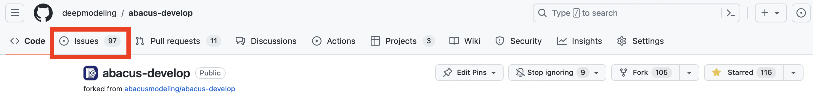
3. 单击“New issue”。
   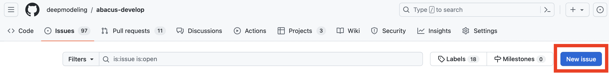
4. 选择一个最适合您的 ISSUE 的一个标签模版，点击“Get started”。如果 ABACUS 提供的默认模版不符合您的 ISSUE 类型，可以选择“Open a blank issue”。
   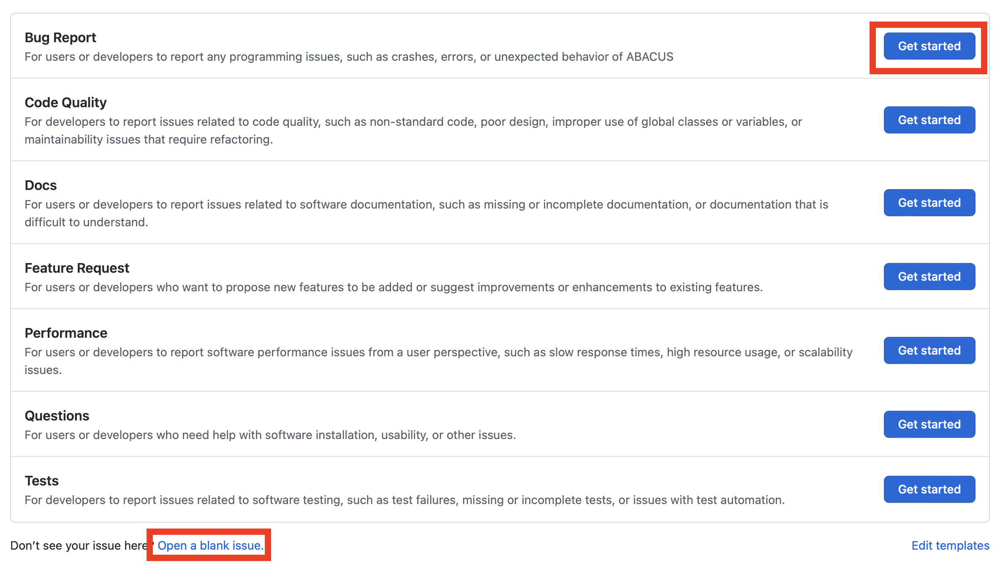

## 3. 填入 ISSUE 信息

给您的 ISSUE 一个描述性的标题。标题应该一眼就能传达问题的内容。 添加一个解释 ISSUE 目的的描述，包括任何可能有助于解决问题的细节。例如，如果这是一个 bug 报告，描述重现 bug 的步骤、预期结果和实际结果。 您可以使用 Markdown 添加格式、链接、表情等。有关更多信息，可参阅“[在 GitHub 上撰写](https://docs.github.com/en/get-started/writing-on-github)”。

以下是 ABACUS 的 Bug report 类型 ISSUE 的模版，您可以根据 ISSUE 模版示例来填入 ISSUE 信息。其中带“*”的项是必填项。

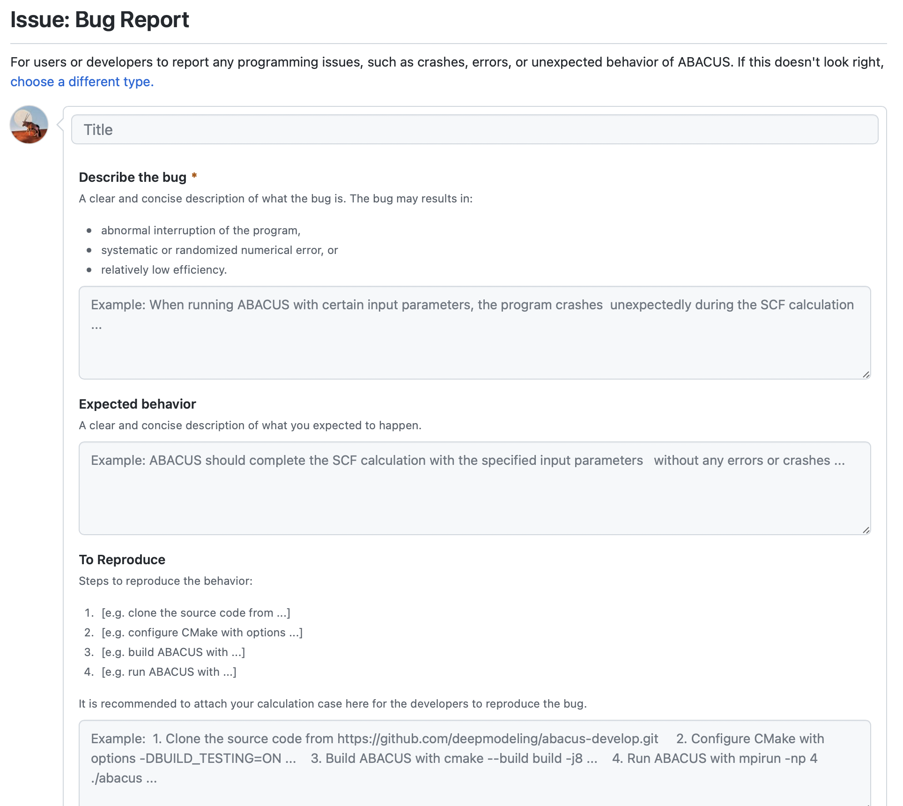

## 4. ISSUE 的任务列表

请注意“Task list for Issue attackers”是为了帮助开发者检查 ISSUE 解决的进度，并不是要求您选择解决 ISSUE 需要完成哪些工作。所以您只需要提供足够详细的信息以帮助开发者来解决 ISSUE。如果您提供的信息已经完成其中的一些任务列表，可以在相应的任务前打对勾，但是如果没有可以不用关心“Task list for Issue attackers”。当然，了解解决一个 ISSUE 所需要经过的一般步骤，有助于您了解 ABACUS 代码的开发过程。如果您想通过自定义的任务列表给开发者一些提示，可以参考 Github 文档“[About task lists](https://docs.github.com/en/get-started/writing-on-github/working-with-advanced-formatting/about-task-lists)”。

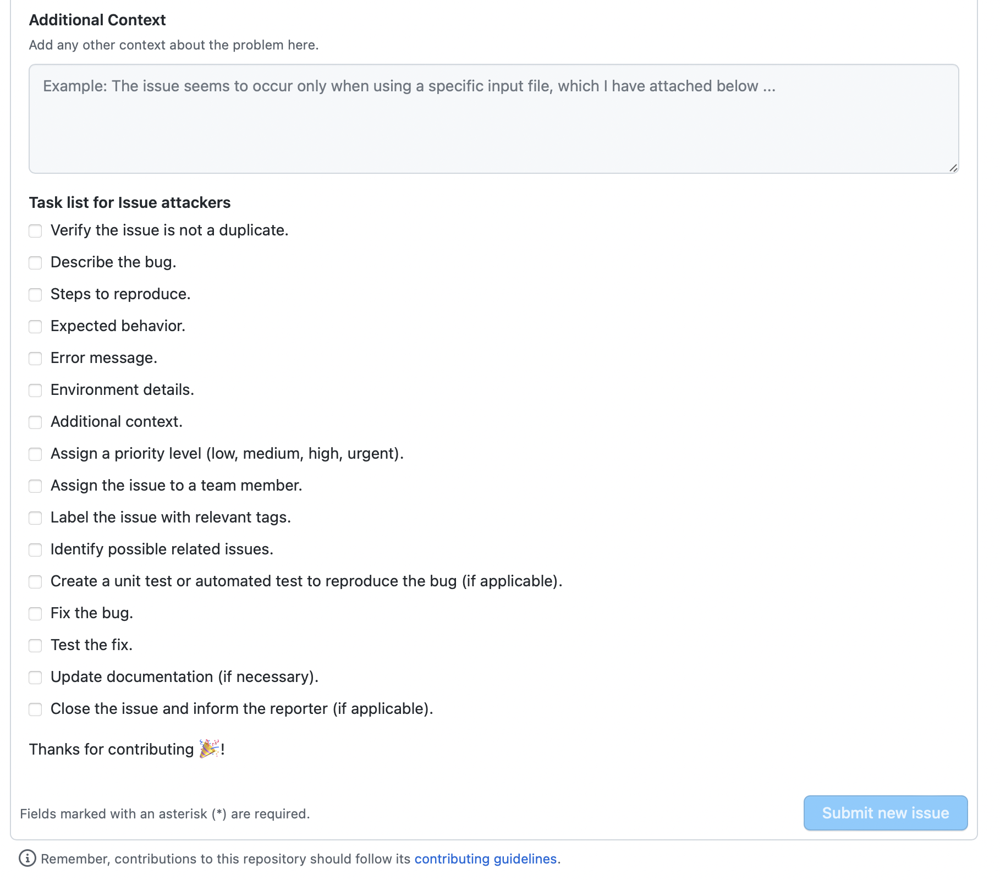

## 5. 添加 ISSUE 标签

如果您选择 ISSUE 模版，创建完 ISSUE 之后会自然有相应的标签出现，如：

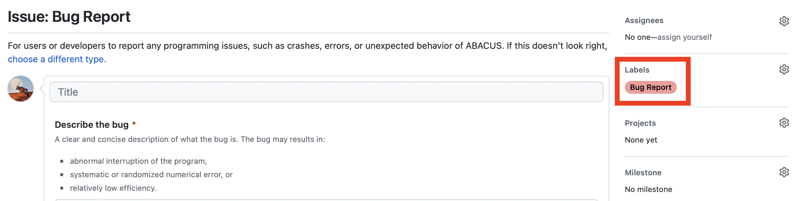

此外，您也可以参考 ABACUS 的专题标签（例如 DFTU, EXX 等）添加相应的标签，或者通过“Edit labels”创建新标签：

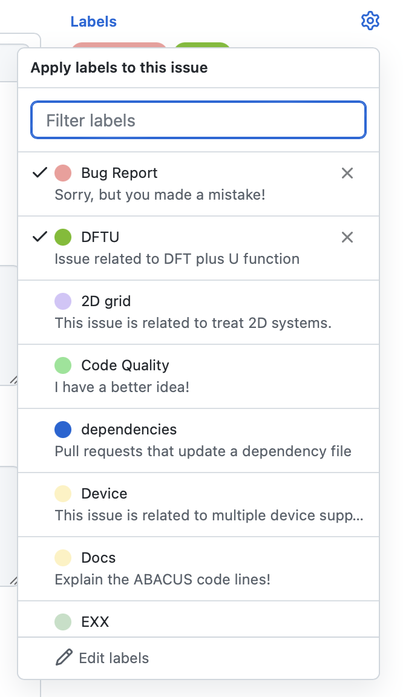

## 6. 提交 ISSUE

点击“Submit new issue”以创建您的 ISSUE。您可以在创建问题后编辑上述任何字段。您的 ISSUE 有一个唯一的 URL，您可以与团队成员分享，或在其他 ISSUE 或 Pull Requat 中引用。

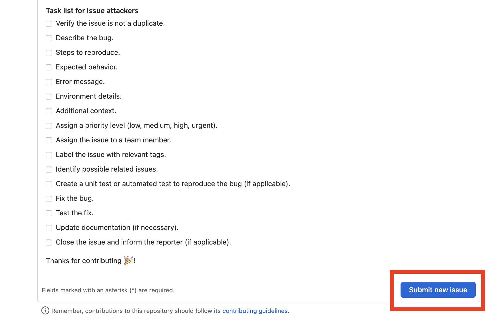

## 7. 与开发者交流

创建 ISSUE 后，通过添加评论与开发者或其他协作者交流对话。您可以键入 @ 邀请协作者或团队关注评论。

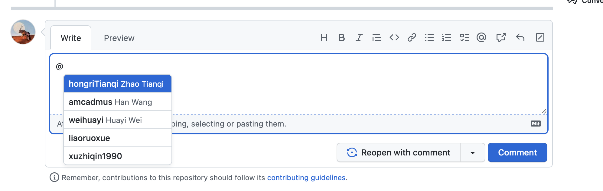

要在同一仓库中可以链接相关问题，您可以键入#，后跟 ISSUE 标号或部分标题，然后单击要链接的问题。有关更多信息，请参见““[在 GitHub 上撰写](https://docs.github.com/en/get-started/writing-on-github)””。

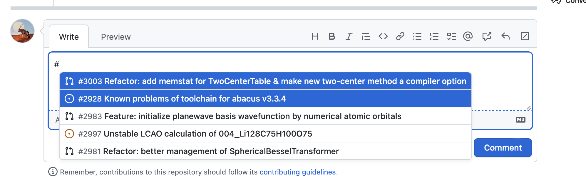

## 8. 查看 ISSUE 解决进度

查看 ISSUE 解决有 3 种方式，如下图所示：

1. 可以通过“task list”的完成进度查看 ISSUE 的解决进度
2. 新建的 ISSUE 会被自动加入 ABACUS ISSUEs 项目，开发者通过讨论之后会在其中加入"Iteration"解决周期，"Priority"优先级，"Collaborators"开发者单位，"Project"是否纳入近期的开发者项目等信息，您也可以在这里看到 ISSUEs 的进展。
3. Assignees 是解决 ISSUE 的开发者，需要 ABACUS 管理员进行分诊。

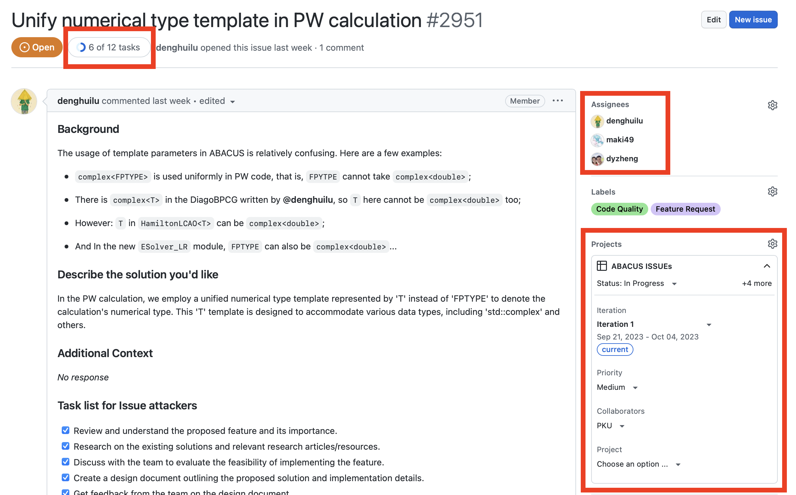

## 9. 关闭 ISSUE

以第 1 步和第 2 步同样的方式找到想要关闭的 ISSUE。 点击“Close issue”，关闭 ISSUE。

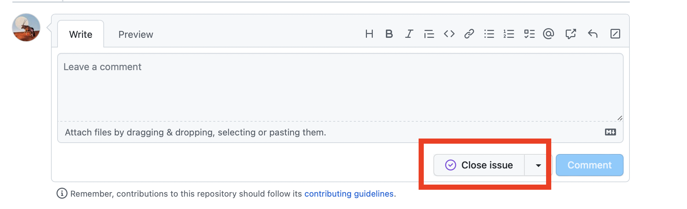

如果要添加关闭 ISSUE 的原因，可以在“Leave a comment”处添加关闭原因，然后点击“Close with comment”，关闭 ISSUE。

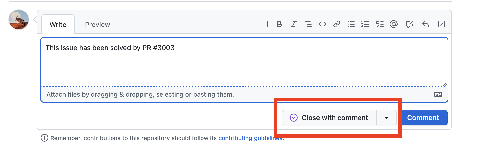
