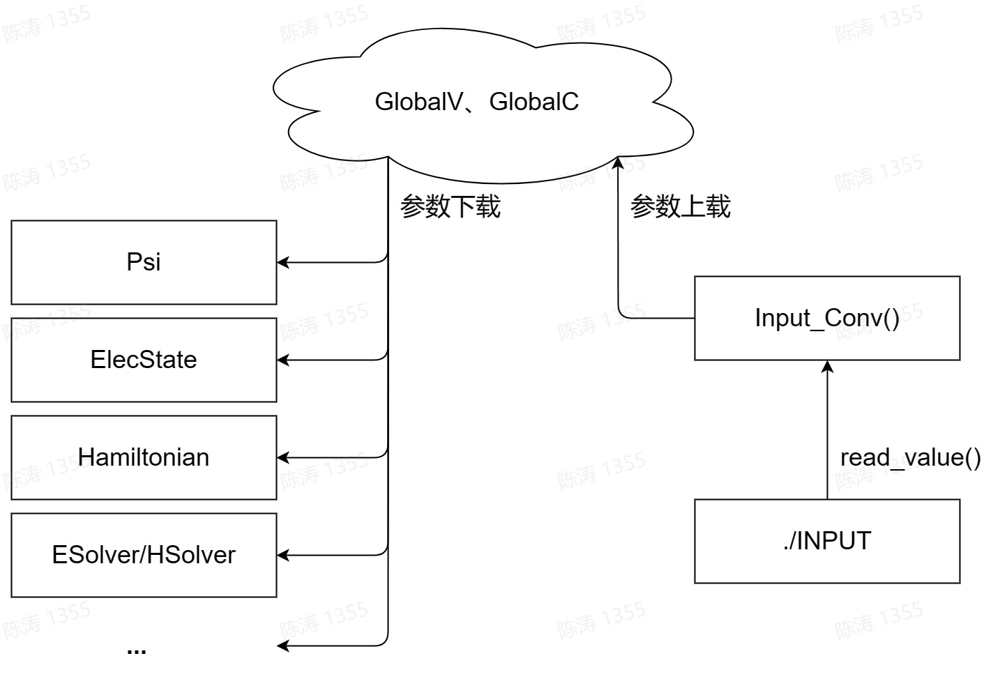
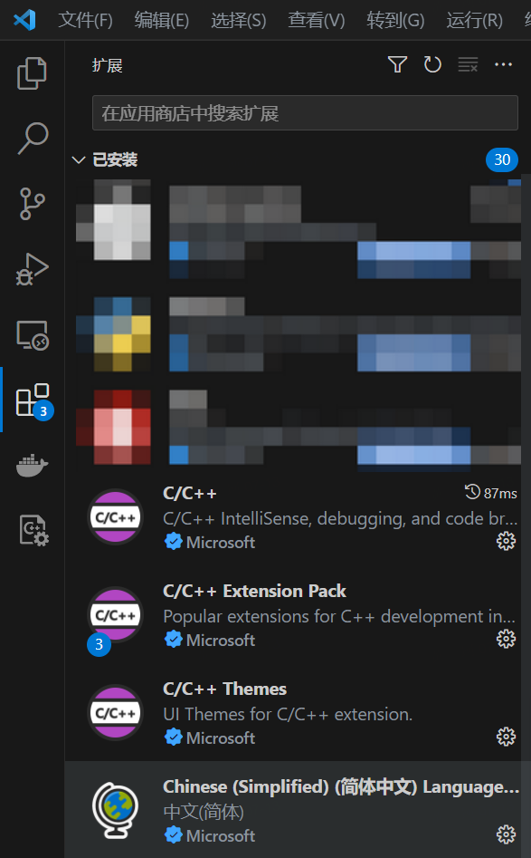
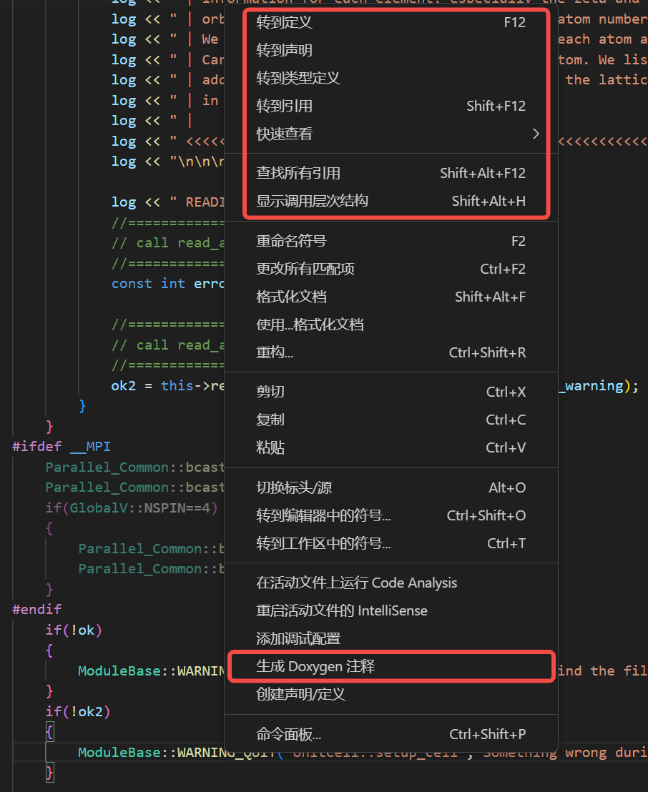

# Introduction to ABACUS: Path to PW calculation - Part 1

<strong>作者：黄一珂，邮箱：huangyk@aisi.ac.cn</strong>

<strong>审核：陈默涵，邮箱：mohanchen@pku.edu.cn</strong>

<strong>飞书链接：[Introduction to ABACUS: Path to PW calculation - Part 1](https://xmywuqhxb0.feishu.cn/docx/XBX6dMphfozMCWx7u8ucUEFOnze)</strong>

> 💡<strong>写在前面</strong>
> 作为 SIAB（Systematically Improvable Atomic orbital Basis, [link](https://mcresearch.gitee.io/abacus-user-guide/abacus-nac2.html)）数值原子轨道生成程序的数据上游，本系列文档将首先从平面波基组/SCF（Self-Consistent Field，即自洽场迭代）讲起，将《从 SIAB 到 ABACUS》的讲述延续下去，之后再探索 SIAB 的下游，即涉及 NAOs 的 LCAO method（basis_type = 'lcao'）。
> 本系列文档的预期受众：新晋 ABACUS 开发者

> 🎨<strong>写在前面</strong>
> 实际上，在 2023 Q1（第一季度），ABACUS 发布了面向团队内部的[代码编程规范](https://mcresearch.gitee.io/abacus-user-guide/develop-C++.html)，因此在代码阅读过程中可能遇到各种还没有被更正的变量命名，请格外注意。代码的缩进与其他格式则由 2023.5 发布的新 Pull request 标准，采用<strong>clang-format-16</strong>标准执行。

> 📃<strong>写在前面</strong>
> 本系列文档内容的组织原则为：
>
> 1. 不脱离代码——避免读者看完手册后对代码没有一丁点概念
> 2. 不堆砌代码解释——避免平庸的代码解释，努力兼顾拉近读者和代码距离的同时，做到提纲挈领，不逐行复制代码后进行停留在代码语义上的解释

首先通过位于根目录下的 `main.cpp` 进入程序：

```cpp
int main(int argc, char **argv)
{
    ModuleIO::parse_args(argc,argv);
    Parallel_Global::read_mpi_parameters(argc,argv);

    Driver DD;
    DD.init(); // <- start!
```

# Driver

在本文档中，我们跳过所有关于记录时间的函数，只关心最主要的部分。在 `main.cpp` 中定义的 `Driver` 类对象 `DD`，其类成员函数 `Driver::init()` 在根目录 `driver.cpp` 下被定义：

```cpp
void Driver::init()
{
    this->reading();
    this->atomic_world();
    INPUT.close_log();
}
```

## Driver::reading()

首先从 `Driver::init()` 来到其所调用第一个函数 `Driver::reading()`：

```cpp
void Driver::reading(void)
{
    INPUT.Init(GlobalV::global_in_card);
....
}
```

### Input

便发现 `Driver` 类可能有数据成员 `INPUT`，查看头文件 `driver.h`，并没有关于 `Input INPUT` 的声明，并且 `Driver` 类实际上并无任何数据成员，因此需要从 `#include` 中寻找：

```cpp
#include "driver.h"

#include "module_io/input.h"
#include "module_io/input_conv.h"
#include "module_hamilt_pw/hamilt_pwdft/global.h"
#include "module_base/memory.h"
#include "module_base/timer.h"
#include "module_esolver/esolver.h"
#include "module_io/cal_test.h"
#include "module_io/print_info.h"
#include "module_io/winput.h"
```

追踪到 `input.h`，发现外部变量声明：

```cpp
extern Input INPUT;
```

在 `input.cpp` 中则有 `Input INPUT;` 这一 `INPUT` 的变量定义。类似地，我们在更多的被 include 文件中寻找 `extern` 变量，<strong>这些变量都会在程序运行一开始被定义，直到程序结束时才会销毁</strong>：

```cpp
// module_hamilt_pw/hamilt_pwdft/global.h
namespace GlobalC
{
// line 284
    extern pseudopot_cell_vnl ppcell;
// line 292
    extern UnitCell ucell;
    extern Parallel_Grid Pgrid;
    extern Parallel_Kpoints Pkpoints;
    extern Restart restart; // Peize Lin add 2020.04.04
```

即是说例如对于 `UnitCell ucell`，其数据成员全部会在程序运行一开始被创建。

#### Input::init()

Driver 首先调用的 `INPUT` 的成员函数 `Input::Init()`（ABACUS 中很多类都具有 `init()` 函数，但存在函数名无法体现其功能的问题，可能会在后续工作中修改），该成员函数定义在 `source/module_io/input.cpp`，同时也发现了 `Input INPUT` 的定义：

```cpp
//source/module_io/input.cpp
Input INPUT;

void Input::Init(const std::string &fn)
{
    this->Default();
    bool success = this->Read(fn);
    this->Default_2();

#ifdef __MPI
    Parallel_Common::bcast_bool(input_error);
    Parallel_Common::bcast_bool(success);
    Bcast();
#endif
    bool out_dir = false;
    if(!out_app_flag && (out_mat_hs2 || out_mat_r || out_mat_t || out_mat_dh)) out_dir = true;
    ModuleBase::Global_File::make_dir_out(this->suffix, this->calculation, out_dir, GlobalV::MY_RANK, this->mdp.md_restart, this->out_alllog);
    Check();
}
```

`Input::init()` 唯一参数为 `fn`，实际被传入参数 `GlobalV::global_in_card`（这里 GlobalV 代表 Global Variables，是全局变量的意思，一般用全大写的变量名，C++ 区分字母大小写，Fortran 不区分）。这一参数在 `module_base/global_variable.cpp` 中被定义，类似的文件还有 `stru_file` 和 `global_kpoint_card`：

```cpp
//source/module_base/global_variable.cpp
std::string global_in_card = "INPUT";
std::string stru_file = "STRU";
std::string global_kpoint_card = "KPT";
```

因此 `Input::init()` 函数实际上将要打开 `INPUT` 文件。

##### Input::Default()

`Input::init()` 调用 `Input::Default()` 函数，

```cpp
//source/module_io/input.cpp
void Input::Init(const std::string &fn)
{
    this->Default(); // <- we are here now
    bool success = this->Read(fn);
    this->Default_2();
    ....
```

其定义为：

```cpp
//source/module_io/input.cpp
void Input::Default(void)
{
    suffix = "ABACUS";
    stru_file = ""; // xiaohui modify 2015-02-01
    kpoint_file = ""; // xiaohui modify 2015-02-01
    pseudo_dir = "";
    orbital_dir = ""; // liuyu add 2021-08-14
    read_file_dir = "auto";
    wannier_card = "none";
    latname = "none";
    calculation = "scf";
    esolver_type = "ksdft";
    pseudo_rcut = 15.0; // qianrui add this parameter 2021-5
    pseudo_mesh = false; // qianrui add this pararmeter
    ntype = 0;
    ...
```

即 `Input::Default()` 函数为所有变量赋默认值。当前所展示的这些变量实际上均为 `Input` 类的数据成员，而非 `GlobalV` 等全局类。全局类的存在是为了避免出现巨大的形参表。在 `Input::Default()` 之后，调用 `Input::Read()` 函数读取 INPUT 文件，并确定是否读取成功。

##### Input::Read()

```cpp
//source/module_io/input.cpp
void Input::Init(const std::string &fn)
{
    this->Default();
    bool success = this->Read(fn); // <- we are here now
    this->Default_2();
    ....
```

`Input::Read()` 函数：

```cpp
//source/module_io/input.cpp
bool Input::Read(const std::string &fn)
{
....
    std::ifstream ifs(fn.c_str(), std::ios::in);
    ifs.clear(); ifs.seekg(0);

    char word[80]; char word1[80];
....
    while (ifs.good())
    {
        ifs >> word1;
        if (ifs.eof()) break;
        strtolower(word1, word);

        if (strcmp("suffix", word) == 0)  read_value(ifs, suffix);
        else if (strcmp("stru_file", word) == 0) read_value(ifs, stru_file);
        ...
```

> 🔧<strong>重构思考</strong>
> `Input::read()` 函数的功能为读取 `INPUT` 文件（创建 `ifstream` 类对象 `ifs`），之后使用对 N 行参数定义，使用最多 N 次 if 判断 `strcmp` 的方法进行参数读取，若参数读取成功，被传递给 `Input` 类的数据成员（覆盖）。

由于我们现在考察针对 PW（Plane Wave，平面波）的相关功能，因此额外注意包含 `pw` 的相关字段：

```cpp
bool Input::Read(const std::string &fn)
{
....
    if (basis_type == "pw" && gamma_only != 0) // pengfei Li add 2015-1-31
    {
        gamma_only = 0;
        GlobalV::ofs_running << " WARNING : gamma_only has not been implemented for pw yet" << std::endl;
        GlobalV::ofs_running << " the INPUT parameter gamma_only has been reset to 0" << std::endl;
        GlobalV::ofs_running << " and a new KPT is generated with gamma point as the only k point" << std::endl;

        GlobalV::ofs_warning << " Auto generating k-points file: " << GlobalV::global_kpoint_card << std::endl;
        std::ofstream ofs(GlobalV::global_kpoint_card.c_str());
        ofs << "K_POINTS" << std::endl;
        ofs << "0" << std::endl;
        ofs << "Gamma" << std::endl;
        ofs << "1 1 1 0 0 0" << std::endl;
        ofs.close();
    }
```

这里 `"gamma_only"` 不为 0，是因为目前 ABACUS 不支持只计算单个布里渊区 `k=（0，0，0）`（通常称为 Gamma 点）的算法，只用 Gamma 点的算法可以把平面波基矢量减少一半，但目前 ABACUS 还不支持。

##### Input::Default_2()

```cpp
//source/module_io/input.cpp
void Input::Init(const std::string &fn)
{
    this->Default();
    bool success = this->Read(fn);
    this->Default_2(); // <- we are here now
    ....
```

接下来 `Input` 类成员调用其 `Input::Default_2()` 方法：

```cpp
//source/module_io/input.cpp
void Input::Default_2(void) // jiyy add 2019-08-04
{
    if (GlobalV::MY_RANK != 0) return;
    if (vdw_s6 == "default")
    {
        if (vdw_method == "d2") vdw_s6 = "0.75";
        else if (vdw_method == "d3_0" || vdw_method == "d3_bj") vdw_s6 = "1.0";
    }
    if (vdw_s8 == "default")
    {
        if (vdw_method == "d3_0") vdw_s8 = "0.722";
        else if (vdw_method == "d3_bj") vdw_s8 = "0.7875";
    }
    ...
    if (calculation == "scf")
    {
        if (mem_saver == 1)
        {
            mem_saver = 0;
            ModuleBase::GlobalFunc::AUTO_SET("mem_saver", "0");
        }
        this->relax_nmax = 1;
    }
    else if (calculation == "relax")
    {
        if (mem_saver == 1)
        {
            mem_saver = 0;
            ModuleBase::GlobalFunc::AUTO_SET("mem_saver", "0");
        }
        cal_force = 1;
        if (!this->relax_nmax)
            this->relax_nmax = 50;
    }
```

在首先设置 `Default`，即参数默认值后再覆盖，然后再调用 `Default_2` 的好处是可以再次覆盖某些参数的实际取值，并根据 case-by-case 地，调整某些值。实际上，此处暗示了一些已经成熟的参数搭配方式，即是说根据特征的任务，实际上都有其一套参数赋值方案。

```cpp
void Input::Default_2(void) // jiyy add 2019-08-04
{
    ....
    if (basis_type == "pw")
    {
        if (ks_solver == "default")
        {
            ks_solver = "cg";
            ModuleBase::GlobalFunc::AUTO_SET("ks_solver", "cg");
        }
        else if (ks_solver == "cg")
        {
            GlobalV::ofs_warning << " It's ok to use cg." << std::endl;
            if (diago_proc != GlobalV::NPROC)
            {
                ModuleBase::WARNING("Input", "when CG is used for diago, diago_proc==GlobalV::NPROC");
                diago_proc = GlobalV::NPROC;
            }
        }
        else if (ks_solver == "dav") GlobalV::ofs_warning << " It's ok to use dav." << std::endl;
        bx = 1; by = 1; bz = 1;
    }
...
    if (basis_type == "pw" || basis_type == "lcao_in_pw")
    {
        if (gamma_only_local)
        {
            gamma_only_local = 0;
            ModuleBase::GlobalFunc::AUTO_SET("gamma_only_local", "0");
        }
    }
 ...
     if (scf_thr == -1.0) // default value, set in Input::Default()
    {
        if (basis_type == "lcao" || basis_type == "lcao_in_pw") scf_thr = 1.0e-7;
        else if (basis_type == "pw") scf_thr = 1.0e-9;
    }

    if (scf_thr_type == -1) // default value, set in Input::Default()
    {
        if (basis_type == "lcao" || basis_type == "lcao_in_pw") scf_thr_type = 2;
        else if (basis_type == "pw") scf_thr_type = 1;
    }
...
```

考虑到一般而言第一性原理软件分支功能众多，且对于 ABACUS，其功能的扩展需要入侵性修改众多代码，行数过多，易扩展性有待提高（关于程序的易扩展性设计方案，见之后单独文档）。因此以下我们首先假设情景为使用 PW 进行 SCF 计算。

##### ModuleBase::Global_File::make_dir_out()

```cpp
//source/module_io/input.cpp
....
void Input::Init(const std::string &fn)
{
    ....
    bool out_dir = false;
    if(!out_app_flag && (out_mat_hs2 || out_mat_r || out_mat_t || out_mat_dh)) out_dir = true;
    ModuleBase::Global_File::make_dir_out(this->suffix, this->calculation, out_dir, GlobalV::MY_RANK, this->mdp.md_restart, this->out_alllog); // <- we are here now
    Check();
}
```

区别于之前的 Input 类中成员函数，这里突然调用的函数变成了 `ModuleBase` 类。这个函数的功能为读取 INPUT 文件之后，在 INPUT 中定义的 `out_dir`、`suffix` 等，在这里可以拼合成为完整路径，并使用 C++/Linux interface 来根据具体任务创建不同的具体输出路径（[jump to the code](https://github.com/deepmodeling/abacus-develop/blob/develop/source/module_base/global_file.cpp#L19)）：

```cpp
//source/module_io/input.cpp
void ModuleBase::Global_File::make_dir_out(const std::string &suffix, const std::string &calculation, const bool &out_dir, const int rank, const bool &restart, const bool out_alllog)
{
    std::string prefix ;

#ifdef __EPM
    #ifdef __MPI
        prefix = "OUT_EPM_MPI.";
    #else
        prefix = "OUT_EPM.";
    #endif
#else
    prefix = "OUT.";
#endif

    GlobalV::global_out_dir = prefix + suffix + "/";
    GlobalV::global_stru_dir = GlobalV::global_out_dir + "STRU/";
    GlobalV::global_matrix_dir = GlobalV::global_out_dir + "matrix/";

#ifdef __MPI
    MPI_Barrier(MPI_COMM_WORLD);
#endif
    int make_dir = 0;
    std::string command0 =  "test -d " + GlobalV::global_out_dir + " || mkdir " + GlobalV::global_out_dir;

    if(calculation == "md")
    {
        int make_dir_stru = 0;
        std::string command1 =  "test -d " + GlobalV::global_stru_dir + " || mkdir " + GlobalV::global_stru_dir;
....}
    if((out_dir) && calculation == "md")
    {
        int make_dir_matrix = 0;
        std::string command1 =  "test -d " + GlobalV::global_matrix_dir + " || mkdir " + GlobalV::global_matrix_dir;
        times = 0;
....}

    std::stringstream ss,ss1;

    if(out_alllog)
    {
        ss << "running_" << calculation << "_" << rank + 1;
        open_log(GlobalV::ofs_running, ss.str(), calculation, restart);
        #if defined(__CUDA) || defined(__ROCM)
        open_log(GlobalV::ofs_device, "device" + std::to_string(rank), calculation, restart);
        #endif
    }
    else
    {
        if(rank==0)
        {
            ss << "running_" << calculation;
            open_log(GlobalV::ofs_running, ss.str(), calculation, restart);
            #if defined(__CUDA) || defined(__ROCM)
            open_log(GlobalV::ofs_device, "device", calculation, restart);
            #endif
        }
    }

    if(rank==0) open_log(GlobalV::ofs_warning, "warning", calculation, restart);

#ifdef GATHER_INFO
    open_log(GlobalV::ofs_info, "math_info_" + std::to_string(rank), calculation, restart);
#endif
}
```

> 🔧<strong>重构思考</strong>
> 这部分定义出了相当多的输出文件和目录，然而多个输出文件往往不利于对 ABACUS 新上手使用者，容易在繁多的文件中迷路，因此可以考虑重新设计输出信息。

最后调用 `Input::check()` 函数对某些参数进行核对。

### Input_Conv

返回 `Driver::reading()`，来到 `Input_Conv::Convert().`

```cpp
void Driver::reading(void)
{
    INPUT.Init(GlobalV::global_in_card);
    Input_Conv::Convert(); // <- now we are here
    ....
```

#### Input_Conv::Convert()

这个函数实现了从 `Input` 类对象的数据成员到 `GlobalV` 和 `GlobalC` 等全局变量集合的转换。相当于从 `Input` 到 `GlobalV` 和 `GlobalC`，以及其他直接的类的参数上载：

其他内容见 ABACUS 第一版开发手册（[02. IO 模块](https://dptechnology.feishu.cn/wiki/wikcn8RfpGtELuidwVJ5ZGxCUie#YKsGdUySEo20SgxGqhXchDUKnib)，目前暂为飞书内部文档）：



```cpp
void Input_Conv::Convert(void)
{
....
    else if (INPUT.stru_file != "")
    {
        GlobalV::stru_file = INPUT.stru_file;
    }
    GlobalV::global_wannier_card = INPUT.wannier_card;
    if (INPUT.kpoint_file != "")
        GlobalV::global_kpoint_card = INPUT.kpoint_file;
....

    GlobalC::ucell.setup(INPUT.latname, INPUT.ntype, INPUT.lmaxmax, INPUT.init_vel, INPUT.fixed_axes);

    if (INPUT.calculation == "relax" || INPUT.calculation == "cell-relax")
    {
        if (INPUT.fixed_ibrav && !INPUT.relax_new)
        {
            ModuleBase::WARNING_QUIT("Input_Conv", "fixed_ibrav only available for relax_new = 1");
        }
....
        GlobalV::fixed_atoms = INPUT.fixed_atoms;
    }

    for(int i=0;i<3;i++)
    {
        GlobalV::KSPACING[i] = INPUT.kspacing[i];
    }
    GlobalV::MIN_DIST_COEF = INPUT.min_dist_coef;
....
    GlobalV::device_flag = psi::device::get_device_flag(INPUT.device, INPUT.ks_solver, INPUT.basis_type);

    if (GlobalV::device_flag == "gpu")
    {
        GlobalV::KPAR = psi::device::get_device_kpar(INPUT.kpar);
    }
    else
    {
        GlobalV::KPAR = INPUT.kpar;
        GlobalV::NSTOGROUP = INPUT.bndpar;
    }
    GlobalV::precision_flag = INPUT.precision;
...
    BFGS_Basic::relax_bfgs_w1 = INPUT.relax_bfgs_w1;
...
    Ions_Move_Basic::relax_bfgs_rmax = INPUT.relax_bfgs_rmax;
...
    Lattice_Change_Basic::fixed_axes = INPUT.fixed_axes;
...
    Ions_Move_CG::RELAX_CG_THR = INPUT.relax_cg_thr; // pengfei add 2013-09-09
...
    ModuleSymmetry::Symmetry::symm_flag = std::stoi(INPUT.symmetry);
....
    elecstate::Efield::efield_dir = INPUT.efield_dir;
....
}
```

> 🔧<strong>重构思考</strong>
> 对模拟体系的完全与分层次描述，是每个模拟软件包的核心设计要求。INPUT 的数据成员不仅录入到 `GlobalV`, `GlobalC`，还录入到 `BFGS_Basic`, `Ions_Move_Basic` 等类中，或许部分扰乱了这种层级。

### winput

> 📝<strong>开发者旁注</strong>
> 本部分内容已经过时，在未来发行版中将会完全弃用

```cpp
void Driver::reading(void)
{
    INPUT.Init(GlobalV::global_in_card);
    Input_Conv::Convert();
    ....
    winput::Init(GlobalV::global_wannier_card); // <- we arrive here
    ....
```

接下来来到 Wannier 函数计算部分，调用 Init()函数，传入参数为 wannier 文件的具体路径（winput 相关的这部分功能目前已经基本不使用，相关读入参数都在 `INPUT` 里面实现，后续版本会把这部分代码删除）。

在 `Input::Default()` 中，该量被设置为 `"none"`，在 `Input::Read()` 中，该量对应于关键词 `wannier_card` 被读入。实际上，一般将 `wannier_card` 赋值为 `INPUTw`。

#### winput::Init()

```cpp
void winput::Init(const std::string &fn)
{
    Default();
    Read(fn);
    Check();

#ifdef __MPI
    Bcast();
#endif
}
```

##### winput::Default()

`wannier_card` 部分同样具有 `Default()` 函数，

```cpp
void winput::Default()
{
    //========================
    //  part1 : control
    //========================
    target          = "test";
    wlmr_dir    = "./";
    rcut            = 10;
    before_iter     = false;
    after_iter      = false;
    begin_stop_flag = false;
    end_flag        = false;
...
}
```

其中各变量均为 winput 中数据成员，类型附加 static 关键词。

##### winput::Read()

> 🔧<strong>重构思考</strong>
> 此处仍然使用 `if(strcmp())` 方法读入输入文件中参数

```cpp
void winput::Read(const std::string &fn)
{
    if(GlobalV::MY_RANK!=0) return;

    std::ifstream ifs(fn.c_str(), std::ios::in);
    ifs.clear(); ifs.seekg(0);

    char word[80];
....

    while (ifs.good())
    {
        ifs >> word;
        for(auto &i : word)
        {
            i = tolower(i);
        }
        //parameters for <ESP.wannier> users

        if (strcmp("target",         word) == 0)       {read_value(ifs, target);}
        else if (strcmp("trial",         word) == 0)       {read_value(ifs, trial);}
...
```

`winput::check()` 则同样地，进行一些检查。

##### 变量分发举例：winput::Bcast()和 Input::Bcast()

和 `Input` 一样，`winput::Bcast()` 对读入所有参数进行节点间广播：

```cpp
#include "module_base/parallel_common.h"
#ifdef __MPI
void winput::Bcast(void)
{
    Parallel_Common::bcast_string( target );
    Parallel_Common::bcast_bool( before_iter );
...
    Parallel_Common::bcast_double( rcut );
...
    Parallel_Common::bcast_string( wlmr_dir );
...
    Parallel_Common::bcast_int( imp_pao );
...
```

同理在 `Input::Bcast()` 中：

```cpp
#ifdef __MPI
void Input::Bcast()
{
    Parallel_Common::bcast_string(suffix);
    Parallel_Common::bcast_string(stru_file); // xiaohui modify 2015-02-01
    Parallel_Common::bcast_string(pseudo_dir);
    // Parallel_Common::bcast_string(pseudo_type); // mohan add 2013-05-20 (xiaohui add 2013-06-23)
    Parallel_Common::bcast_string(orbital_dir);
    Parallel_Common::bcast_string(kpoint_file); // xiaohui modify 2015-02-01
    Parallel_Common::bcast_string(wannier_card);
...
```

`Prallel_Common` 属于 `module_base` 中 parallel_common.h 中声明的自建命名空间，其声明大致如下：

```cpp
namespace Parallel_Common
{
    void bcast_complex_double( std::complex<double> *object, const int n);
...
    void bcast_complex_double( std::complex<double> &object);
...
}
```

举例其中 `Prallel_Common::bcast_int()`：

```cpp
void Parallel_Common::bcast_int(int &object)
{
    MPI_Bcast(&object, 1, MPI_INT, 0, MPI_COMM_WORLD);
}
```

其中 `MPI_Bcast()` 为 MPI 内部函数，其参数表中分别传入了需广播数据的内存地址、、数据类型，以及。

▶ 离开 winput，回到 `source/driver.cpp Driver::reading()`，只剩下如下内容：

```cpp
std::stringstream ss1;
    ss1 << GlobalV::global_out_dir << GlobalV::global_in_card;
    INPUT.Print(ss1.str());
```

## Driver::atomic_world()

`Driver::atomic_world()` 函数中执行的内容其实只有 `Driver::driver_run()` 函数：

```cpp
void Driver::atomic_world(void)
{
    this->driver_run();
}
```

不要忘记我们已经完成 `Driver::reading()` 函数内容，到达 `Driver::atomic_world()`。这一点从本文档设置的分级目录中也可以看得到。


```cpp
cppvoid Driver::init()
{    
    this->reading();
    this->atomic_world(); // <- here!    
    INPUT.close_log();
}
```

### Driver::driver_run()

#### esolver

ESolver 是 ABACUS 内部工作流的驱动，根据当前模拟任务所属阶段，按顺序调用各个所需模块，

> 📝<strong>开发者旁注</strong>
> 原则上讲，`ESolver` 不应当含有 `Device` 和 `FPTYPE` 模板参数，未来将会被舍弃

`Driver::driver_run()` 定义在 `source/driver.cpp` 文件中，是实际驱动 ABACUS 各模块的驱动（driver）。首先创建 `ESolver` 类指针，并利用 `ModuleESolver::init_esolver()` 将其初始化：

```cpp
void Driver::driver_run()
{
    ModuleESolver::ESolver *p_esolver = nullptr;
    ModuleESolver::init_esolver(p_esolver);
...
```

##### ModuleESolver::init_esolver()

我们目前只关注 pw 基的方法，首先调用 `ModuleESolver::determine_type()` 函数，读取具体在 `INPUT` 中定义的计算类型（`GlobalV::ESOLVER_TYPE` 和 `GlobalV::BASIS_TYPE`）：

```cpp
void init_esolver(ESolver*& p_esolver)
    {
        std::string esolver_type = determine_type();
```

作为回溯，`GlobalV::ESOLVER` 和 `GlobalV::BASIS_TYPE` 的赋值在 `module_io/input_conv.cpp`：

```cpp
GlobalV::BASIS_TYPE = INPUT.basis_type; // line 320
GlobalV::ESOLVER_TYPE = INPUT.esolver_type; // line 273
```

其在 `INPUT` 中关键词为（`module_io/input.cpp`）：

```cpp
else if (strcmp("basis_type", word) == 0) //line 843
        {
            read_value(ifs, basis_type);
...
         else if (strcmp("esolver_type", word) == 0)// line 685
        {
            read_value(ifs, esolver_type);
        }
...
```

###### ModuleESolver::determine_type()

接下来根据 `basis_type` 和 `esolver_type` 两关键词对 `esolver_type` 进行赋值（❗ 此处已经出现 esolver 一词多义，在 `ModuleESolver` 域中实际上是 `[能量计算方法]_[基组](_[任务类型]）` 的合并）：

```cpp
std::string determine_type()
    {
        std::string esolver_type = "none";
        if (GlobalV::BASIS_TYPE == "pw")
        {
            if(GlobalV::ESOLVER_TYPE == "sdft") esolver_type = "sdft_pw";
            else if(GlobalV::ESOLVER_TYPE == "ofdft") esolver_type = "ofdft";
            else if(GlobalV::ESOLVER_TYPE == "ksdft") esolver_type = "ksdft_pw";
        }
        else if (GlobalV::BASIS_TYPE == "lcao_in_pw")
        {
#ifdef __LCAO
            if(GlobalV::ESOLVER_TYPE == "sdft") esolver_type = "sdft_pw";
            else if(GlobalV::ESOLVER_TYPE == "ksdft") esolver_type = "ksdft_pw";
#endif
        }
        else if (GlobalV::BASIS_TYPE == "lcao")
        {
#ifdef __LCAO
            if(GlobalV::ESOLVER_TYPE == "tddft") esolver_type = "ksdft_lcao_tddft";
            else if(GlobalV::ESOLVER_TYPE == "ksdft") esolver_type = "ksdft_lcao";
#endif
        }
        else
        {
            if(GlobalV::ESOLVER_TYPE == "lj") esolver_type = "lj_pot";
            else if(GlobalV::ESOLVER_TYPE == "dp") esolver_type = "dp_pot";
            else if(esolver_type == "none")
            {
                ModuleBase::WARNING_QUIT("ESolver", "No such esolver_type combined with basis_type");
            }
        }
        return esolver_type;
    }
```

得到 `esolver_type`，返回 `ModuleESolver::init_esolver()`，之后根据其由 `esolver_type` 定义的不同内容，为创建的 `p_esolver` 指定对应类型的内存空间，此时注意到各类 `ESolver_*` 实际上都是对 `ModuleESolver::ESolver` 父类的继承，而 `p_esolver` 为父类指针：

```cpp
if (esolver_type == "ksdft_pw")
        {
        #if ((defined __CUDA) || (defined __ROCM))
            if (GlobalV::device_flag == "gpu") {
                if (GlobalV::precision_flag == "single") p_esolver = new ESolver_KS_PW<float, psi::DEVICE_GPU>();
                else p_esolver = new ESolver_KS_PW<double, psi::DEVICE_GPU>();
                return;
            }
        #endif
            if (GlobalV::precision_flag == "single") p_esolver = new ESolver_KS_PW<float, psi::DEVICE_CPU>();
            else p_esolver = new ESolver_KS_PW<double, psi::DEVICE_CPU>();
        }
#ifdef __LCAO
        else if (esolver_type == "ksdft_lcao") p_esolver = new ESolver_KS_LCAO();
        else if (esolver_type == "ksdft_lcao_tddft") p_esolver = new ESolver_KS_LCAO_TDDFT();
#endif
        else if (esolver_type == "sdft_pw") p_esolver = new ESolver_SDFT_PW();
        else if (esolver_type == "ofdft") p_esolver = new ESolver_OF();
        else if (esolver_type == "lj_pot") p_esolver = new ESolver_LJ();
        else if (esolver_type == "dp_pot") p_esolver = new ESolver_DP(INPUT.mdp.pot_file);
    }
```

各种 esolver 的继承关系如下所示。例如 `ESolver_KS_PW` 和 `ESolver_KS_LCAO`，均公有继承自 `ESolver_KS`：

```cpp
// module_solver/esolver_ks_pw.h
namespace ModuleESolver
{
    template<typename FPTYPE, typename Device = psi::DEVICE_CPU>
    class ESolver_KS_PW : public ESolver_KS<FPTYPE, Device>
// module_esolver/esolver_ks_lcao.h
namespace ModuleESolver
{
    class ESolver_KS_LCAO : public ESolver_KS<double>
```

`ESolver_KS` 则公有继承自 `ESolver_FP`：

```cpp
// module_solver/esolver_ks.h
namespace ModuleESolver
{
    template<typename FPTYPE, typename Device = psi::DEVICE_CPU>
    class ESolver_KS : public ESolver_FP
```

`ESolver_FP` 公有继承自 `ESolver`：

```cpp
// module_solver/esolver_fp.h
namespace ModuleESolver
{
    class ESolver_FP : public ESolver
```

而 `p_esolver` 为 `ModuleESolver::ESolver` 类指针，自然可以如此赋值。其他关于各种 ESolver 的层级关系，可见第一版开发者手册的 [09. ESolver 模块](https://dptechnology.feishu.cn/wiki/wikcnNDXb5zlyQlvujOh4maKl9e) （目前暂为飞书内部文档) 。接下来我们假设 `esolver_type == "ksdft_pw"`，则我们需要关注前面已经展示过的（`module_esolver/esolver.cpp ModuleESolver::init_esolver()`: line 93）：

```cpp
if (esolver_type == "ksdft_pw")
        {
        #if ((defined __CUDA) || (defined __ROCM))
            if (GlobalV::device_flag == "gpu") {
                if (GlobalV::precision_flag == "single") {
                    p_esolver = new ESolver_KS_PW<float, psi::DEVICE_GPU>();
                }
                else {
                    p_esolver = new ESolver_KS_PW<double, psi::DEVICE_GPU>();
                }
                return;
            }
        #endif
            if (GlobalV::precision_flag == "single") {
                p_esolver = new ESolver_KS_PW<float, psi::DEVICE_CPU>();
            }
            else {
                p_esolver = new ESolver_KS_PW<double, psi::DEVICE_CPU>();
            }
        }
```

我们首先只关注 `p_esolver = new ESolver_KS_PW<double, psi::DEVICE_CPU>();`，即精度为浮点双精度，使用 cpu 为计算设备的情况。

不难发现，关于 `ESolver_KS_PW` 类的具体实现，同时使用数据类型和设备作为模板：

```cpp
namespace ModuleESolver
{
    template <typename FPTYPE, typename Device>
    ESolver_KS_PW<FPTYPE, Device>::ESolver_KS_PW()
    {
        this->classname = "ESolver_KS_PW";
        this->basisname = "PW";
        this->device = psi::device::get_device_type<Device>(this->ctx);
        #if ((defined __CUDA) || (defined __ROCM))
            if (this->device == psi::GpuDevice)
            {
                hsolver::createBLAShandle();
                hsolver::createCUSOLVERhandle();
            }
        #endif
    }
```

其代入的设备类型 `psi::DEVICE_CPU`，是 `psi` 命名空间的变量。

至此，`ModuleESolver::init_esolver()` 退出，`p_esolver` 有值 `&ESolver_KS_PW<double, psi::DEVICE_CPU>()`，来到设置模拟体系的结构部分。

# 附录

## 配置便捷高效 Vscode C++ 工作环境（Windows）

在大型程序的代码阅读过程中，往往遇到变量和函数数量大，源文件、头文件不计其数的情况。因此高效、快速寻找当前感兴趣变量/函数/类/命名空间的上下游就十分重要。Vscode 是由 Microsoft 开发的集成开发环境，具有轻量、灵活、功能健全、插件开发者活跃、程序迭代较快等优点，因此推荐 Vscode 作为 ABACUS 的编辑器。

### Vscode

下载链接：[Download Visual Studio Code - Mac, Linux, Windows](https://code.visualstudio.com/download)

在选择“是否把 vscode 添加到 PATH 环境变量”时，如无特殊需求，建议选择“是”，同时在选择“是否将 vscode 添加到右键菜单”时，选择“是”。

相关资料：[新人教程文档](https://dptechnology.feishu.cn/docs/doccne4tP1qvfKdJp7ufhyre0gd#xV308O)（目前暂为飞书内部文档)

### Vscode C++ 插件

配置完成 Vscode 后，在其扩展商店搜索“C/C++”，即可顺利一并安装三个插件，用于 C++ 程序的开发工作。



### Mingw64 GNU compilers

为了让 C++ 开发环境变得更加智能，需要联合编译器，让编译器寻找变量、函数、类、命名空间等之间跨文件的引用关系。为了实现这一点，见 Microsoft Vscode 关于 C++ 编译器的官方配置教程：

[Get Started with C++ and Mingw-w64 in Visual Studio Code](https://code.visualstudio.com/docs/cpp/config-mingw)

之后在 vscode `setting.json` 添加 `“C_Cpp.default.compilerPath”` 值，且可选 `"C_Cpp.default.cppStandard"` 值，对于 ABACUS，通常选择 `"c++11"` 或 `"c++14"`。

### Mingw64 fftw3, mpi and googletest libraries

为了能够尽可能多避免 vscode 浏览 ABACUS 代码过程中报错，可以选择安装发行在 msys2 系列平台上的 fftw3 和 msmpi 库：

fftw3: [https://packages.msys2.org/package/mingw-w64-i686-fftw?repo=mingw32](https://packages.msys2.org/package/mingw-w64-i686-fftw?repo=mingw32)

msmpi: [https://packages.msys2.org/package/mingw-w64-x86_64-msmpi](https://packages.msys2.org/package/mingw-w64-x86_64-msmpi)

Googletest: [https://packages.msys2.org/base/mingw-w64-googletest](https://packages.msys2.org/base/mingw-w64-googletest)

其他常见的库也可以在 [https://packages.msys2.org/](https://packages.msys2.org/)进行搜索后，复制命令在 msys2 prompt 进行下载安装

### CMake

ABACUS 使用 CMake 便捷编译，因此也可以在本地配置 CMake。

下载、安装 CMake：[Download | CMake](https://cmake.org/download/)

将安装好的 CMake 一并放入 PATH 环境变量，之后在 Vscode `setting.json` 中添加 `“cmake.generator”`，以及 `"cmake.cmakePath"` 值，设置 `"cmake.additionalCompilerSearchDirs"`。

## 将本地 Vscode 连通 Bohrium 平台进行高效编译开发

Bohrium 平台提供在线云计算服务，对于 ABACUS 开发工作，可以在其服务器上进行软件编译。

Bohrium 网站：

之后请 follow 单元测试环境搭建教程：[新人教程文档](https://dptechnology.feishu.cn/docs/doccne4tP1qvfKdJp7ufhyre0gd#xV308O) （目前暂为飞书内部文档)

## 变量、函数、类的声明、定义、调用快捷跳转

对准想要查看其声明、定义和调用（引用）的量，点击鼠标右键：



若跳转到声明（.h 文件），发现其声明旁未添加注释，或注释并非 Doxygen 格式，可以在 Vscode 扩展应用商店下载 Doxygen 插件后，发现菜单出现“生成 Doxygen 注释”，将注释内容复写为 Doxygen 格式。

相关材料：[自动文档 Doxygen 使用说明](https://dptechnology.feishu.cn/wiki/wikcnFCA1p4IaQIkqjIhdPgxMgd) （目前暂为飞书内部文档)

## 给你的开发加点魔法：Github.copilot vscode 部署

首先进行 Github 学生认证：[https://education.github.com/pack](https://education.github.com/pack)

然后在 vscode 上 Extension 界面下载 Github copilot 插件。vscode 通过最下角 Github 账号登录来验证 Github.copilot 的使用权限（完成学生认证后自动拥有 Github.copilot 的使用权限）。


# 系列链接

上篇：[从 SIAB 到 ABACUS（一）：准备工作](https://ucoyxk075n.feishu.cn/docx/NIWLdeaceoiqKFxZrT3czXAJnOg)（施工中 🚧）

下篇：[Introduction to ABACUS: Path to PW calculation - Part 2](develop-path2.md)
