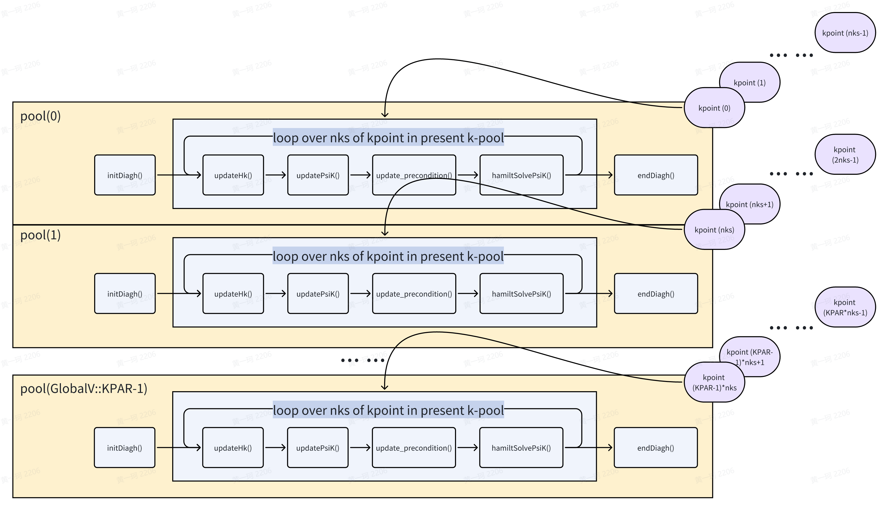
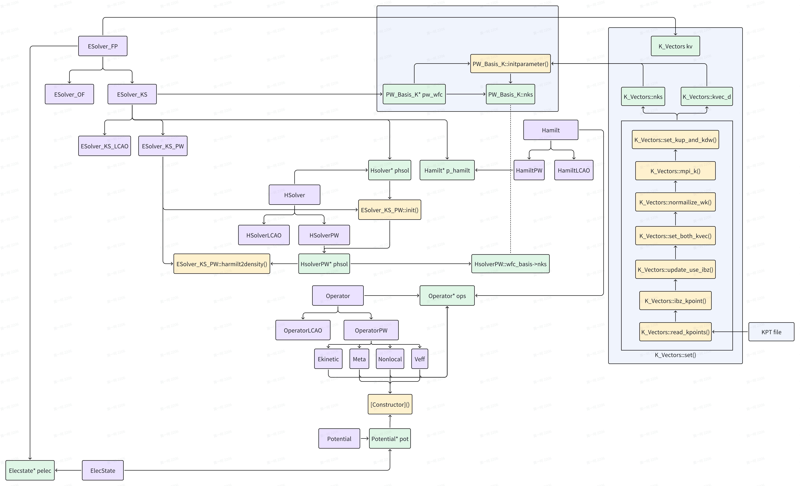
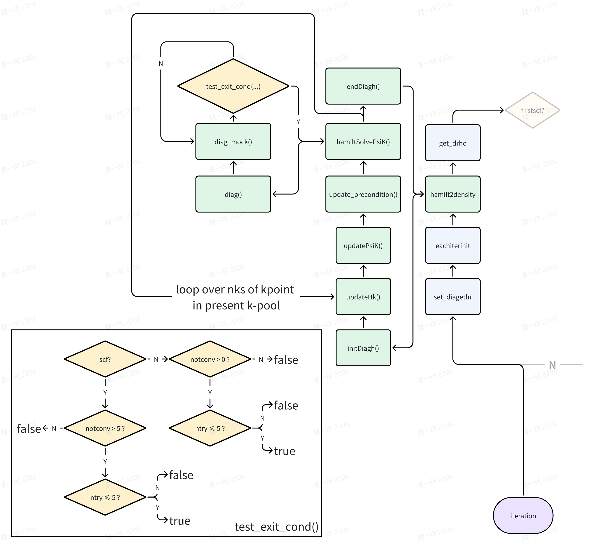
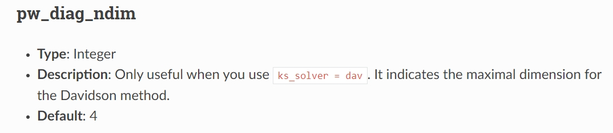
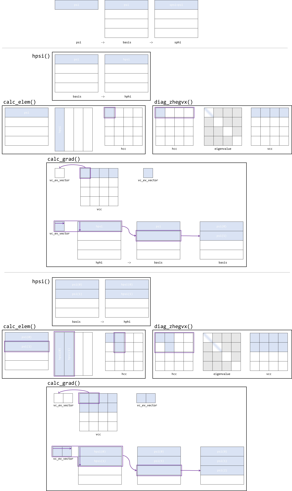

# Introduction to ABACUS: Path to PW calculation - Part 10

<strong>作者：黄一珂，邮箱：huangyk@aisi.ac.cn</strong>

<strong>审核：陈默涵，邮箱：mohanchen@pku.edu.cn</strong>

<strong>飞书链接：[Introduction to ABACUS: Path to PW calculation - Part 10](https://xmywuqhxb0.feishu.cn/docx/MRsZdVLw3o3neTxJxRpcrvvqnMe)</strong>

> 📃<strong>写在前面</strong>
>
> 1. 不脱离代码——避免读者看完手册后对代码没有一丁点概念
> 2. 不堆砌代码解释——避免平庸的代码解释，努力兼顾拉近读者和代码距离的同时，做到提纲挈领，不逐行复制代码后进行停留在代码语义上的解释

<strong>Relax_Driver::relax_driver()</strong>

# ESolver_KS::Run()


## HSolverPW::set_diagethr()

进入迭代，首先以 `HSolverPW::set_diagethr()` 函数设置能量收敛限（本身并无复杂的原理，因此安排读者自行阅读代码细节（[link](https://github.com/abacusmodeling/abacus-develop/blob/develop/source/module_hsolver/hsolver_pw.cpp#L233)））。`HSolverPW` 构造函数（[link](https://ucoyxk075n.feishu.cn/docx/X499dN2xWoWmp3xgxg9cb0qHnWb?contentTheme=DARK&theme=LIGHT#L6TKdaSwPoKFnExP309cLYQUnBb)）已经对 `HSolverPW::diag_ethr` 由默认值 `0.0` 赋值为 `GlobalV::PW_DIAG_THR`，并且回溯 input_conv.cpp（[link](https://github.com/deepmodeling/abacus-develop/blob/develop/source/module_io/input_conv.cpp#L338)）以及 input.cpp（[link](https://github.com/deepmodeling/abacus-develop/blob/develop/source/module_io/input.cpp#L252), [link](https://github.com/deepmodeling/abacus-develop/blob/develop/source/module_io/input.cpp#L1033)），我们可以知道 `GlobalV::PW_DIAG_THR` 的默认值为 `1.0e-2`，用户的一般默认值设置为 `1.0e-6`。因此无论如何对于上述程序块的第 7 行，都判断为真（注意，if 判断中 `1.0e-6` 是<strong>数值层面的0。相较于纯公式推导，数值计算过程中应当注意来自各方面可能的误差来源：</strong>

### Conventional numerical errors due to unawareness: provided by meta-llama2

> 1. Division by zero: This is a classic example of a numerical error that can occur when calculating a function like sin(x)/x as x approaches zero. When x is close to zero, the denominator (x) becomes very small, and the numerator (sin(x)) may become very large due to the amplification effect of the sine function near zero. This can cause the computation to overflow or underflow, resulting in a NaN (Not a Number) value.
> 2. Loss of significance: This occurs when a number becomes too small to be accurately represented by the available floating-point precision. For example, suppose we have two vectors u and v, both with a magnitude of 1.0, but one has a tiny component in the direction of the other. If we subtract the two vectors, the result will be a vector with a magnitude of 0.0, because the difference between the two vectors is smaller than the machine epsilon (the smallest representable number). However, if we then try to normalize this vector, we may find that its length is no longer 0.0, but rather a small positive value, due to roundoff errors. This can cause the vector to appear non-orthogonal, even though it should be orthogonal.
> 3. Roundoff errors: These occur when a number is rounded to the nearest representable value, either during computation or when storing intermediate results. Rounding errors can accumulate over time, especially when performing repeated operations, and can eventually cause significant errors in the final result. For example, suppose we compute the dot product of two vectors using the formula dot(u,v) = u_1<em>v_1 + u_2</em>v_2 + ... + u_n*v_n. If any of the components of u or v are very small, roundoff errors may cause the computed dot product to differ significantly from the actual value.
> 4. Cancellation errors: These occur when two nearly equal quantities are subtracted, resulting in a much smaller quantity. For example, suppose we compute the difference between two very large vectors, one of which has a slightly larger magnitude than the other. The subtraction operation may cancel out most of the digits, leaving behind only a few significant figures. This can cause the result to be very small, even though the original vectors were very large.
> 5. Overflow and underflow: These occur when a computation produces a result that exceeds the maximum or minimum representable value of the available floating-point format. For example, suppose we compute the sum of two very large vectors using the formula sum = u + v. If the sum exceeds the maximum representable value, it will wrap around to a very small value, potentially causing significant errors in downstream computations. Similarly, if the sum is negative and exceeds the minimum representable value in absolute value, it will also wrap around to a very small value.
> 6. Truncation errors: These occur when an intermediate result is truncated to fit within the available precision, causing the final result to differ from the exact value. For example, suppose we compute the square root of a number using a binary search algorithm that requires us to repeatedly divide the range of possible values in half until we find the correct interval containing the square root. If the range of possible values is very large, we may need to perform many iterations of the algorithm before finding the correct interval, and each iteration will introduce a small amount of truncation error. Over time, these errors can add up and cause the final result to differ significantly from the exact value.
> 7. Aliasing: This occurs when a periodic function is sampled at a rate that is not sufficient to capture its full frequency content. For example, suppose we compute the discrete Fourier transform of a periodic function using a finite number of samples. If the sampling rate is not high enough, aliasing effects may cause the reconstructed function to contain spurious features or artifacts that do not correspond to the underlying physical phenomenon.
> 8. Numerical instability: This occurs when a computation involves very large or very small numbers, or when the computation involves unstable mathematical operations like division by zero or taking the inverse of a very small number. Unstable computations can cause the result to vary widely depending on slight changes in the input parameters or intermediate results, leading to non-deterministic or chaotic behavior. An example of numerical instability is the Lorenz attractor, which exhibits chaotic behavior for certain parameter values despite being derived from simple, deterministic equations

），`HSolverPW::diag_ethr = 1.0e-2`，到达[流程图](develop-path10.md)的下一部分。

## ESolver_KS_PW::eachiterinit()

```cpp
template<typename FPTYPE, typename Device>
    void ESolver_KS<FPTYPE, Device>::Run(const int istep, UnitCell& ucell)
    {
    ....
            for (int iter = 1; iter <= this->maxniter; ++iter)
            {
    ....
                eachiterinit(istep, iter);
    ....
```

```cpp
template <typename FPTYPE, typename Device>
void ESolver_KS_PW<FPTYPE, Device>::eachiterinit(const int istep, const int iter)
{
    if (iter == 1)
        this->p_chgmix->reset();
    this->pelec->f_en.deband_harris = this->pelec->cal_delta_eband();

    //(2) save change density as previous charge,
    // prepared fox mixing.
    if (GlobalV::MY_STOGROUP == 0)
    {
        this->pelec->charge->save_rho_before_sum_band();
    }
}
```

`p_chgmix` 为 `ESolver_KS` 的数据成员，已经在构造函数中被初始化（[link](develop-path5.md)），且 `mixing_mode`, `mixing_beta`, `mixing_ndim`, `mixing_gg0`, `mixing_tau` 已经根据 `Input` 类赋值（默认值或用户给定），其数据成员 `rhopw` 也已赋值 `pw_rho`。

`Charge_Mixing::reset()` 函数重置四个数据成员：

```cpp
void Charge_Mixing::reset()     // Peize Lin add 2018-11-01
{
    this->new_e_iteration = true;
    irstep = 0; idstep = 0; totstep = 0;
....//omit irrelevant conditions
}
```

### ElecState::cal_delta_eband()

```cpp
double ElecState::cal_delta_eband() const
{
....
    return deband0; // is \Delta E in the following formulation
}
```

此处涉及到具体且比较复杂的计算，我们此处只阐明原理，读者之后可以根据原理来对比代码（[link](https://github.com/deepmodeling/abacus-develop/blob/develop/source/module_elecstate/elecstate_energy.cpp#L88)）进行理解。

- <strong>Harris functional</strong>

$$
E^{\mathrm{Harris}}\left[ \rho ^{\mathrm{in}} \right] =\sum_i{n_{\mathrm{i}}^{\mathrm{out}}\langle \psi _{\mathrm{i}}^{\mathrm{out}}|\hat{H}^{\mathrm{in}}|\psi _{\mathrm{i}}^{\mathrm{out}}\rangle}-\frac{1}{2}\iint{\mathrm{d}\mathbf{r}\mathrm{d}\mathbf{r}^{\prime}\frac{\rho ^{\mathrm{in}}\left( \mathbf{r} \right) \rho ^{\mathrm{in}}\left( \mathbf{r}^{\prime} \right)}{|\mathbf{r}-\mathbf{r}^{\prime}|}}+\int{\mathrm{d}\mathbf{r}\left( \epsilon _{\mathrm{xc}}^{\mathrm{in}}\left( \mathbf{r} \right) -v_{\mathrm{xc}}^{\mathrm{in}}\left( \mathbf{r} \right) \right) \rho ^{\mathrm{in}}\left( \mathbf{r} \right)}+\sum_{I<J}{\frac{Z_IZ_J}{R_{IJ}}}
$$

- <strong>Non-meta-GGA functional, nspin != 4 case</strong>

$$\Delta E=-\frac{\Omega _{\mathrm{cell}}}{\sum_p{n_{\mathrm{grid}}^{\mathrm{rs}}(p)}}\sum_{\omega}^{\alpha ,\beta}{\sum_i^{n_{\mathrm{grid}}^{\mathrm{rs}}(p)}{\{[V_{\mathrm{eff}}^{\omega}(r_i)-V_{\mathrm{fixed}}(r_i)]\rho ^{\omega}(r_i)\}}}-2E_{\mathrm{xx}}$$ (discrete form)

$$\Delta E=-\int_{\Omega _{\mathrm{cell}}}{d\mathbf{r}\int{d\omega}(V_{\mathrm{eff}}[\rho]-V_{\mathrm{fixed}}[\rho])\rho (\mathbf{r},\omega )}-2E_{\mathrm{xx}}$$ (continuous form)

- <strong>Meta-GGA functional, nspin != 4 case</strong>

$$\Delta E=-\frac{\Omega _{\mathrm{cell}}}{\sum_p{n_{\mathrm{grid}}^{\mathrm{rs}}(p)}}\sum_{\omega}^{\alpha ,\beta}{\sum_i^{n_{\mathrm{grid}}^{\mathrm{rs}}(p)}{\{[V_{\mathrm{eff}}^{\omega}(r_i)-V_{\mathrm{fixed}}(r_i)]\rho ^{\omega}(r_i)+\tau ^{\omega}(r_i)V_{\mathrm{ofk}}^{\omega}(r_i)\}}}-2E_{\mathrm{xx}}$$ (discrete form)

$$\Delta E=-\int_{\Omega _{\mathrm{cell}}}{\mathrm{d}\mathbf{r}\int{\mathrm{d}\omega (V_{\mathrm{eff}}[\rho]-V_{\mathrm{fixed}}[\rho])\rho (\mathbf{r},\omega )+\tau (\mathbf{r},\omega )V_{\mathrm{ofk}}(\mathbf{r})}}-2E_{\mathrm{xx}}$$ (continuous form)

- <strong>Non-meta-GGA functional, nspin = 4 case</strong>

$$\Delta E=-\frac{\Omega _{\mathrm{cell}}}{\sum_p{n_{\mathrm{grid}}^{\mathrm{rs}}(p)}}\left[ \sum_i^{n_{\mathrm{grid}}^{\mathrm{rs}}(p)}{\left( \sum_{\omega}^4{V_{\mathrm{eff}}^{\omega}(r_i)\rho ^{\omega}(r_i)} \right) -V_{\mathrm{fixed}}(r_i)\rho ^0(r_i)} \right] -2E_{\mathrm{xx}}$$ (discrete form)

- <strong>Meta-GGA functional, nspin = 4 case</strong>

$$\Delta E=-\frac{\Omega _{\mathrm{cell}}}{\sum_p{n_{\mathrm{grid}}^{\mathrm{rs}}(p)}}\left[ \sum_i^{n_{\mathrm{grid}}^{\mathrm{rs}}(p)}{\left( \sum_{\omega}^4{V_{\mathrm{eff}}^{\omega}(r_i)\rho ^{\omega}(r_i)} \right) -V_{\mathrm{fixed}}(r_i)\rho ^0(r_i)+\tau ^0(r_i)V_{\mathrm{ofk}}^{0}(r_i)} \right] -2E_{\mathrm{xx}}$$ (discrete form)

, where $$\tau ^{\omega}(r_i)\equiv \frac{1}{2}\sum_i^{\mathrm{occ}}{\left( \nabla \psi _i\left( r_i \right) \right) ^2}$$ is the kinetic energy density mapped on realspace grid (`kin_r`), $$n_{\mathrm{grid}}^{\mathrm{rs}}(p)$$ is the number of grid points in realspace ($$\text{rs}$$) distributed on processor $$p$$。

(source code [link](https://github.com/deepmodeling/abacus-develop/blob/develop/source/module_elecstate/elecstate_energy.cpp#L88))

### Charge::save_rho_before_sum_band()

此函数备份电荷密度 `rho`，当使用 meta-GGA 时，同时备份动能密度 `kin_r`：

```cpp
void Charge::save_rho_before_sum_band(void)
{
    for (int is = 0; is < GlobalV::NSPIN; is++)
    {
        ModuleBase::GlobalFunc::DCOPY(rho[is], rho_save[is], this->rhopw->nrxx);
        if (elecstate::get_xc_func_type() == 3 || elecstate::get_xc_func_type() == 5)
            ModuleBase::GlobalFunc::DCOPY(kin_r[is], kin_r_save[is], this->rhopw->nrxx);
    }
    return;
}
```

## ESolver_KS_PW::hamilt2density()

然后来到 SCF 迭代的主体——对角化。`hamilt2density` 即为 Hamiltonian to electron density，从固定的 Hamiltonian 矩阵到新的电荷密度信息。`hamilt2density()` 函数的主体梗概如下：

```cpp
template <typename FPTYPE, typename Device>
void ESolver_KS_PW<FPTYPE, Device>::hamilt2density(const int istep, const int iter, const double ethr)
{
    if (this->phsol != nullptr)
    {
        this->pelec->f_en.eband = 0.0;
        this->pelec->f_en.demet = 0.0;
        if ((istep == 0 || istep == 1) && iter == 1)
        {
            hsolver::DiagoIterAssist<FPTYPE, Device>::need_subspace = false;
        }
        else
        {
            hsolver::DiagoIterAssist<FPTYPE, Device>::need_subspace = true;
        }

        hsolver::DiagoIterAssist<FPTYPE, Device>::PW_DIAG_THR = ethr;
        hsolver::DiagoIterAssist<FPTYPE, Device>::PW_DIAG_NMAX = GlobalV::PW_DIAG_NMAX;
        this->phsol->solve(this->p_hamilt, this->kspw_psi[0], this->pelec, GlobalV::KS_SOLVER);
....
}
```

不难发现 `phsol`（pointer to HSolver）所调用其成员函数 `solve()` 一定是对角化的主体，HSolver 其顾名思义为 Hamiltonian 矩阵的求解器。针对具体的软件编写，我们关心在对角化过程中，究竟需要哪些（哪类）变量。最小地，我们对于 general 的对角化问题最统一的预想为仅仅需要 Hamiltonian 矩阵自身，ABACUS 的方案为：


`p_hamilt`: HamiltPW: [Introduction to ABACUS: Path to PW calculation - Part 9](develop-path9.md)，Hamiltonian 的 handle（指针为 handle 实现的实体）

`kspw_psi`: Psi: [Introduction to ABACUS: Path to PW calculation - Part 7](develop-path7.md)，Kohn-Sham planewave wavefunction 的 handle，同样指针是 handle 实现实体

`pelec`: ElecState: [Introduction to ABACUS: Path to PW calculation - Part 9](develop-path9.md)，电子态 handle

> 🤔<strong>为了明天</strong>
> 寻找可能存在的变量冗余！

### HSolverPW::solve()

`HSolverPW::solve()` 中编写了 `HamiltSolvePsiK()` 函数的主功能，在 `solve` 之后则仅仅为能隙的计算。

```cpp
template <typename FPTYPE, typename Device>
void ESolver_KS_PW<FPTYPE, Device>::hamilt2density(const int istep, const int iter, const double ethr)
{
....
        this->phsol->solve(this->p_hamilt, this->kspw_psi[0], this->pelec, GlobalV::KS_SOLVER);
....
}
```

根据早先的总结，ABACUS 的并行策略应当如图所示：

1. 按照 `GlobalV::KPAR` 确定并行池数量
2. 每个并行池同时处理 1 个 k 点的计算任务
3. 在 pool 中的 processor，则按照原先分发策略，分别按照实空间和到空间进行并行计算。

作为平行比较，Quantum ESPRESSO 官方不仅提供了更加灵活和精细的并行策略，也提供了基本的教学文档：

[https://www.quantum-espresso.org/Doc/user_guide/node18.html](https://www.quantum-espresso.org/Doc/user_guide/node18.html)

```cpp
template <typename FPTYPE, typename Device>
void HSolverPW<FPTYPE, Device>::solve(hamilt::Hamilt<FPTYPE, Device>* pHamilt,
                                      psi::Psi<std::complex<FPTYPE>, Device>& psi,
                                      elecstate::ElecState* pes,
                                      const std::string method_in,
                                      const bool skip_charge)
{
....//omit timer
    this->precondition.resize(psi.get_nbasis());

    this->method = method_in;
    this->initDiagh();
    std::vector<FPTYPE> eigenvalues(pes->ekb.nr * pes->ekb.nc, 0);

    for (int ik = 0; ik < this->wfc_basis->nks; ++ik)
    {
        pHamilt->updateHk(ik);

        this->updatePsiK(pHamilt, psi, ik);
        update_precondition(precondition, ik, this->wfc_basis->npwk[ik]);
        this->hamiltSolvePsiK(pHamilt, psi, eigenvalues.data() + ik * pes->ekb.nc);
        
        if(skip_charge)
        {
....//omit output
            DiagoIterAssist<FPTYPE, Device>::avg_iter = 0.0;
        }
    }
    castmem_2d_2h_op()(cpu_ctx, cpu_ctx, pes->ekb.c, eigenvalues.data(), pes->ekb.nr * pes->ekb.nc);
    this->endDiagh();

    if(skip_charge) {....}
    reinterpret_cast<elecstate::ElecStatePW<FPTYPE, Device>*>(pes)->psiToRho(psi);
....//omit timer and return
}
```




#### HSolverPW::initDiagh()

初始化对角化

```cpp
template<typename FPTYPE, typename Device>
void HSolverPW<FPTYPE, Device>::initDiagh()
{
    if (this->method == "cg")
    {
        if(this->pdiagh!=nullptr)
        {
            if(this->pdiagh->method != this->method)
            {
                delete (DiagoCG<FPTYPE, Device>*)this->pdiagh;
                this->pdiagh = new DiagoCG<FPTYPE, Device>(precondition.data());
                this->pdiagh->method = this->method;
            }
        }
        else
        {
            this->pdiagh = new DiagoCG<FPTYPE, Device>(precondition.data());
            this->pdiagh->method = this->method;
        }
    }
    else if (this->method == "dav")
    {
        DiagoDavid<double>::PW_DIAG_NDIM = GlobalV::PW_DIAG_NDIM;
        if (this->pdiagh != nullptr)
        {
            if (this->pdiagh->method != this->method)
            {
                delete (DiagoDavid<FPTYPE, Device>*)this->pdiagh;
                this->pdiagh = new DiagoDavid<FPTYPE, Device>(precondition.data());
                this->pdiagh->method = this->method;
            }
        }
        else
        {
            this->pdiagh = new DiagoDavid<FPTYPE, Device>( precondition.data());
            this->pdiagh->method = this->method;
        }
    }
    else {....}
}
```

若 `pdiagh` 已经存在，且 diagonalization_method 一致，do nothing，若不一致，delete, new 为当前 method。若 `pdiagh` 不存在，则按照 method new 相应 method 对应类内存空间。new 具有一致的形式。


#### HamiltPW::updateHk() and Operator::init()

```cpp
template <typename FPTYPE, typename Device>
void HSolverPW<FPTYPE, Device>::solve(hamilt::Hamilt<FPTYPE, Device>* pHamilt,
                                      psi::Psi<std::complex<FPTYPE>, Device>& psi,
                                      elecstate::ElecState* pes,
                                      const std::string method_in,
                                      const bool skip_charge)
{
....//omit timer and previous lines
    for (int ik = 0; ik < this->wfc_basis->nks; ++ik)
    {
        pHamilt->updateHk(ik);
```

```cpp
template<typename FPTYPE, typename Device>
void HamiltPW<FPTYPE, Device>::updateHk(const int ik)
{
    ModuleBase::TITLE("HamiltPW","updateHk");
    this->ops->init(ik);
    ModuleBase::TITLE("HamiltPW","updateHk");
}
```

```cpp
template<typename FPTYPE, typename Device>
void Operator<FPTYPE, Device>::init(const int ik_in) 
{
    this->ik = ik_in;
    if(this->next_op != nullptr) this->next_op->init(ik_in);
}
```

ik 实参为 k point index，因此最后是将 k point index 赋予每一个 `Operator` 的 `this->ik` 数据成员。回忆此操作，实际上建立在 `GlobalV::KPAR` 的基础上，`KPAR` 决定同时有多少 k 点并行。要求是 nproc/KPAR > 1，因此实际每个 processor 上不会同时存在多于 1 个 k 点，即同一个 processor 上不存在 Operator 被赋予不同 ik 值的情况。这一操作使得$$H(\mathbf{k})$$的$$\mathbf{k}$$获得更新。

更具体而言，根据每个 processor 上 k 点数量（归约后）nks，可以访问 k vector 的具体坐标，see：[Introduction to ABACUS: Path to PW calculation - Part 5](develop-path5.md) ，即在$$H(\mathbf{k})$$和具体的$$\mathbf{k}$$之间联系实际也有存储。



#### HSolverPW::updatePsiK()

```cpp
template <typename FPTYPE, typename Device>
void HSolverPW<FPTYPE, Device>::solve(hamilt::Hamilt<FPTYPE, Device>* pHamilt,
                                      psi::Psi<std::complex<FPTYPE>, Device>& psi,
                                      elecstate::ElecState* pes,
                                      const std::string method_in,
                                      const bool skip_charge)
{
....//omit timer and previous lines
    for (int ik = 0; ik < this->wfc_basis->nks; ++ik)
    {
    ....
        this->updatePsiK(pHamilt, psi, ik);
```

```cpp
template <typename FPTYPE, typename Device>
void HSolverPW<FPTYPE, Device>::updatePsiK(hamilt::Hamilt<FPTYPE, Device>* pHamilt,
                                           psi::Psi<std::complex<FPTYPE>, Device>& psi,
                                           const int ik)
{
    psi.fix_k(ik);
    if(!this->initialed_psi)
    {
        if(GlobalV::BASIS_TYPE=="pw")
        {
            hamilt::diago_PAO_in_pw_k2(this->ctx, ik, psi, this->wfc_basis, this->pwf, pHamilt);
        }
        else {....}
    }
}
```

##### Psi::fix_k()

```cpp
template <typename T, typename Device> void Psi<T, Device>::fix_k(const int ik) const
{
    assert(ik >= 0);
    this->current_k = ik;
    if (this->ngk != nullptr && this->npol != 2)
        this->current_nbasis = this->ngk[ik];
    else
        this->current_nbasis = this->nbasis;
    this->current_b = 0;
    if (ik >= this->nk) // this k point is not in present pool
    {
        // mem_saver case
        this->psi_current = const_cast<T*>(&(this->psi[0]));
        this->psi_bias = 0;
    }
    else
    {
        this->psi_current = const_cast<T*>(&(this->psi[ik * this->nbands * this->nbasis]));
        this->psi_bias = ik * this->nbands * this->nbasis;
    }
}
```

fix_k()函数锁定了当前的 k 点，使得 psi_current 指向当前 psi 一维数组中的正确位置。此处用到了 `Psi::ngk` 和 `Psi::npol` 值，这两值曾经出现在 `Psi` 构造函数中：

```cpp
template <typename T, typename Device> Psi<T, Device>::Psi(int nk_in, int nbd_in, int nbs_in, const int* ngk_in)
{
    this->ngk = ngk_in;
    this->current_b = 0;
    this->current_k = 0;
    this->npol = GlobalV::NPOL;
    this->device = device::get_device_type<Device>(this->ctx);
    this->resize(nk_in, nbd_in, nbs_in);
    // Currently only GPU's implementation is supported for device recording!
    device::print_device_info<Device>(this->ctx, GlobalV::ofs_device);
    device::record_device_memory<Device>(this->ctx,
                                         GlobalV::ofs_device,
                                         "Psi->resize()",
                                         sizeof(T) * nk_in * nbd_in * nbs_in);
}
```

我们的 psi 相关参数设定是在 `wavefunc::allocate()` 函数（[link](https://github.com/deepmodeling/abacus-develop/blob/develop/source/module_hamilt_pw/hamilt_pwdft/wavefunc.cpp#L81)），即：

```cpp
psi::Psi<std::complex<double>> *wavefunc::allocate(const int nks, const int *ngk, const int npwx_in)
{
...
    else
    {
        // initial psi rather than evc
        psi_out = new psi::Psi<std::complex<double>>(nks2, GlobalV::NBANDS, npwx * GlobalV::NPOL, ngk);
        const size_t memory_cost = nks2 * GlobalV::NBANDS*(GlobalV::NPOL*npwx) * sizeof(std::complex<double>);
        std::cout << " MEMORY FOR PSI (MB)  : " << double(memory_cost)/1024.0/1024.0 << std::endl;
        ModuleBase::Memory::record("Psi_PW", memory_cost);
    }
    return psi_out;

    //showMemStats();
}
```

`Psi::npol` 所取 `GlobalV::NPOL` 则在 `input_conv.cpp` 中可以找到：

```cpp
if (INPUT.noncolin || INPUT.lspinorb)
    {
        GlobalV::NSPIN = 4;
    }
    if (GlobalV::NSPIN == 4)
    {
        GlobalV::NONCOLIN = INPUT.noncolin;
        // wavefunctions are spinors with 2 components
        GlobalV::NPOL = 2;
        // set the domag variable to make a spin-orbit calculation with zero magnetization
        GlobalV::DOMAG = false; GlobalV::DOMAG_Z = true;
        GlobalV::LSPINORB = INPUT.lspinorb; GlobalV::soc_lambda = INPUT.soc_lambda;
....
    }
    else
    {
        GlobalV::LSPINORB = false; GlobalV::NONCOLIN = false;
        GlobalV::DOMAG = false; GlobalV::DOMAG_Z = false;
        GlobalV::NPOL = 1;
    }
```

##### hamilt::diago_PAO_in_pw_k2()

接下来到达 `HSolverPW::updatePsiK()` 调用的第二个函数。

```cpp
template <typename FPTYPE, typename Device>
void HSolverPW<FPTYPE, Device>::updatePsiK(hamilt::Hamilt<FPTYPE, Device>* pHamilt,
                                           psi::Psi<std::complex<FPTYPE>, Device>& psi,
                                           const int ik)
{
....
    if(!this->initialed_psi)
    {
        if(GlobalV::BASIS_TYPE=="pw")
        {
            hamilt::diago_PAO_in_pw_k2(this->ctx, ik, psi, this->wfc_basis, this->pwf, pHamilt);
        }
        else {....}
    }
}
```

```cpp
void diago_PAO_in_pw_k2(const int &ik,
                        psi::Psi<std::complex<double>> &wvf,
                        ModulePW::PW_Basis_K *wfc_basis,
                        wavefunc *p_wf,
                        hamilt::Hamilt<double> *phm_in)
{
    ModuleBase::TITLE("wavefunc","diago_PAO_in_pw_k2");
    
    const int starting_nw = p_wf->get_starting_nw();
    if(starting_nw == 0) return;
    assert(starting_nw > 0);
    std::vector<double> etatom(starting_nw, 0.0);

    const int nbasis = wvf.get_nbasis();
    const int nbands = wvf.get_nbands();
    const int current_nbasis = wfc_basis->npwk[ik];

    if( p_wf->init_wfc=="random" || ( p_wf->init_wfc.substr(0,6)=="atomic" && GlobalC::ucell.natomwfc == 0 ))
    {
        p_wf->random(wvf.get_pointer(),0,nbands,ik, wfc_basis);

        if(GlobalV::KS_SOLVER=="cg")
        {
            if(phm_in!= nullptr)
            {
                hsolver::DiagoIterAssist<double>::diagH_subspace(phm_in, wvf, wvf, etatom.data());
                return;
            }
            else ModuleBase::WARNING_QUIT("wavefunc","Hamiltonian does not exist!");
        }
    }
    else if(p_wf->init_wfc.substr(0,6)=="atomic")
    {
        ModuleBase::ComplexMatrix wfcatom(starting_nw, nbasis);
        if(GlobalV::test_wf)ModuleBase::GlobalFunc::OUT(GlobalV::ofs_running, "starting_nw", starting_nw);

        p_wf->atomic_wfc(ik, current_nbasis, GlobalC::ucell.lmax_ppwf, wfc_basis,
                         wfcatom, GlobalC::ppcell.tab_at, GlobalV::NQX, GlobalV::DQ);
                         
        if (p_wf->init_wfc == "atomic+random"
            && starting_nw == GlobalC::ucell.natomwfc)
        {
            p_wf->atomicrandom(wfcatom, 0, starting_nw, ik, wfc_basis);
        }

        p_wf->random(wfcatom.c, GlobalC::ucell.natomwfc, nbands, ik, wfc_basis);

        if(GlobalV::KS_SOLVER=="cg")
        {
            if(phm_in!= nullptr)
            {
                hsolver::DiagoIterAssist<double>::diagH_subspace_init(phm_in, wfcatom.c,
                            wfcatom.nr, wfcatom.nc, wvf, etatom.data());
                return;
            }
            else ModuleBase::WARNING_QUIT("wavefunc","Hamiltonian does not exist!");
        }

        assert(nbands <= wfcatom.nr);
        for (int ib=0; ib<nbands; ib++)
        {
            for (int ig=0; ig<nbasis; ig++)
            {
                wvf(ib, ig) = wfcatom(ib, ig);
            }
        }
    }
}
```

且此操作遍历 k 点。

> 🤔<strong>家庭作业</strong>
> 我们不打算花费太多时间在波函数初始化这个议题上，但是仍然推荐你自主阅读它！仔细看看有时候你搬弄的 `starting_wfc`/`init_wfc`/`scf_guess` 关键词背后到底是怎么运行的吧！

#### HSolverPW::update_precondition()

```cpp
template <typename FPTYPE, typename Device>
void HSolverPW<FPTYPE, Device>::solve(hamilt::Hamilt<FPTYPE, Device>* pHamilt,
                                      psi::Psi<std::complex<FPTYPE>, Device>& psi,
                                      elecstate::ElecState* pes,
                                      const std::string method_in,
                                      const bool skip_charge)
{
....//omit timer and previous lines
    for (int ik = 0; ik < this->wfc_basis->nks; ++ik)
    {
    ....
        update_precondition(precondition, ik, this->wfc_basis->npwk[ik]);
```

```cpp
template<typename FPTYPE, typename Device>
void HSolverPW<FPTYPE, Device>::update_precondition(std::vector<FPTYPE> &h_diag, const int ik, const int npw)
{
    h_diag.assign(h_diag.size(), 1.0);
    int precondition_type = 2;
    const auto tpiba2 = static_cast<FPTYPE>(this->wfc_basis->tpiba2);

    if (precondition_type == 1)
    {
        for (int ig = 0; ig < npw; ig++)
        {
            FPTYPE g2kin = static_cast<FPTYPE>(this->wfc_basis->getgk2(ik,ig)) * tpiba2;
            h_diag[ig] = std::max(static_cast<FPTYPE>(1.0), g2kin);
        }
    }
    else if (precondition_type == 2)
    {
        for (int ig = 0; ig < npw; ig++)
        {
            FPTYPE g2kin = static_cast<FPTYPE>(this->wfc_basis->getgk2(ik,ig)) * tpiba2;
            h_diag[ig] = 1 + g2kin + sqrt(1 + (g2kin - 1) * (g2kin - 1));
        }
    }
    if(GlobalV::NSPIN==4)
    {
        const int size = h_diag.size();
        for (int ig = 0; ig < npw; ig++)
        {
            h_diag[ig+size/2] = h_diag[ig];
        }
    }
}
```

对角化时的 preconditioner 一般兼具数学和数值计算的 trick，因此我们只观察其形式而不做过多解读。


Preconditioner of CG diagonalization method: [PreconditionerCGDiag.pdf](https://gitee.com/mcresearch/abacus-user-guide/blob/master/examples/develop/PreconditionerCGDiag.pdf)

Preconditioner of Davidson diagonalization method: [PreconditionerDavidsonDiag.pdf](https://gitee.com/mcresearch/abacus-user-guide/blob/master/examples/develop/PreconditionerDavidsonDiag.pdf)

#### HSolverPW::hamiltSolvePsiK()

```cpp
template <typename FPTYPE, typename Device>
void HSolverPW<FPTYPE, Device>::solve(hamilt::Hamilt<FPTYPE, Device>* pHamilt,
                                      psi::Psi<std::complex<FPTYPE>, Device>& psi,
                                      elecstate::ElecState* pes,
                                      const std::string method_in,
                                      const bool skip_charge)
{
....
    for (int ik = 0; ik < this->wfc_basis->nks; ++ik)
    {
....
    // each column corresponds to one energy band, row corresponds to k point. Therefore it
    // is ekb[ikpoint][iband], see declaration in CLASS elecstate
    std::vector<FPTYPE> eigenvalues(pes->ekb.nr * pes->ekb.nc, 0);
....
        /// solve eigenvector and eigenvalue for H(k), nr, nc are number of rows and columns
        this->hamiltSolvePsiK(pHamilt, psi, eigenvalues.data() + ik * pes->ekb.nc);
....
}
```

```cpp
template<typename FPTYPE, typename Device>
void HSolverPW<FPTYPE, Device>::hamiltSolvePsiK(hamilt::Hamilt<FPTYPE, Device>* hm, psi::Psi<std::complex<FPTYPE>, Device>& psi, FPTYPE* eigenvalue)
{
    this->pdiagh->diag(hm, psi, eigenvalue);
}
```

回忆刚刚在 `initDiagh` 函数中，根据不同的对角化方法，`pdiagh` 被分配不同派生类的内存空间（因此 pdiagh 很可能一开始被声明为 `DiagH` 基类指针，diag 可能在基类中被声明为纯虚函数）。这里我们跟随 Davidson 方法，因此 `pdiag` 的 diag 方法实际为 `DiagoDavid::diag()`。



##### DiagoDavid::diag()

```cpp
template <typename FPTYPE, typename Device>
void DiagoDavid<FPTYPE, Device>::diag(hamilt::Hamilt<FPTYPE, Device>* phm_in,
                                      psi::Psi<std::complex<FPTYPE>, Device>& psi,
                                      FPTYPE* eigenvalue_in)
{
    /// record the times of trying iterative diagonalization
    int ntry = 0;
    this->notconv = 0;

#if defined(__CUDA) || defined(__ROCM)
    if (this->device == psi::GpuDevice)
    {
        resmem_var_op()(this->ctx, this->d_precondition, psi.get_nbasis());
        syncmem_var_h2d_op()(this->ctx, this->cpu_ctx, this->d_precondition, this->precondition, psi.get_nbasis());
    }
#endif

    do
    {
        this->diag_mock(phm_in, psi, eigenvalue_in);
        ++ntry;
    } while (DiagoIterAssist<FPTYPE, Device>::test_exit_cond(ntry, this->notconv));

    if (notconv > std::max(5, psi.get_nbands() / 4))
    {
        std::cout << "\n notconv = " << this->notconv;
        std::cout << "\n DiagoDavid::diag', too many bands are not converged! \n";
    }
    return;
}
```

###### DiagoDavid::diag_mock()与 ABACUS-BLAS, LAPACK interfaces

Source code link: [https://github.com/deepmodeling/abacus-develop/blob/develop/source/module_hsolver/diago_david.cpp#L49](https://github.com/deepmodeling/abacus-develop/blob/develop/source/module_hsolver/diago_david.cpp#L49)


> 🔧<strong>重构信息</strong>
> `diag_mock()` will be renamed as `diag_once()` in the future

> 🤔<strong>复习</strong>
> Try to recall all details introduced from Part.1 to now as many as possible!
> In `Driver::reading()`, it is where `Input::Default()`, `Read()` and `Default_2()`, Input_conv::Convert() are called. From then on, we have parameters defined both from user input and default.
> In `Driver::atomic_world()`, it is where real space grid and planewave distributed. Remember `ESolver` driven the creation and initialization of `pw_rho`, `pw_wfc`? `PW_Basis` and `PW_Basis_K`? `setuptransform()`, `initgrids()`, `distribute_r()` and _g()?
> In `UnitCell::setup_cell()`, we read atom positions, pseudopotentials and kpoints,  then we have (ir)reducible k vector list, and so (k+G) the planewave expanded wavefunction.
> In present contents, we initialize `psi`, then construct H|psi>, use `HSolver` flow to orthogonalize and diagonalize it.

基于上图，我们将选择数个关键点进行说明。

1\. 对角化维度（ndim）设定

由于平面波数量众多-> 基函数数量众多-> 待对角化 Hamiltonian 矩阵维度巨大，而真正关心特征值/本征值/本征态数量远小于基函数数量，因此考虑使用子空间方法迭代求解其中能量最低的 n 个特征值/特征向量，而非一次性计算全部。由于子空间对角化方法的特性，实际需要对角化的子空间维度比用户所需能带数量要多（ndim 倍），ndim 被设计为用户设定参数：


`nbasis`: [Introduction to ABACUS: Path to PW calculation - Part 7](develop-path7.md) : npwx*GlobalV::NPOL, npwx: maximal number of planewaves among all kpoints, for non-noncolinear cases, GlobalV::NPOL is 1, otherwise is 2.

`ngk`: [Introduction to ABACUS: Path to PW calculation - Part 6](develop-path6.md)

`current_nbasis`: ngk[ik] or nbasis

| ABACUS                                      | Quantum ESPRESSO                            |
| ------------------------------------------- | ------------------------------------------- |
|  |  |

在 ABACUS 中，首先对角化子空间维数为 nbnd，若有部分本征值无法收敛，则使子空间维数递增，直到子空间维数增至 ndim*nbnd，然后重新开始计算 Hamiltonian 矩阵（refresh()，保留最初始 psi，即 ndim≥2 必须满足，从 dim=2 开始覆盖），直到达到最大迭代次数或收敛。

2\. hpsi_info

在对角化之前，确认被对角化的对象具体形式十分重要。`hpsi_info` 存储 `hpsi` 操作后的数据，出现于

```cpp
template <typename FPTYPE, typename Device>
void DiagoDavid<FPTYPE, Device>::diag_mock(hamilt::Hamilt<FPTYPE, Device>* phm_in,
                                           psi::Psi<std::complex<FPTYPE>, Device>& psi,
                                           FPTYPE* eigenvalue_in)
{
....
    /// initialize H|psi>...
    hpsi_info dav_hpsi_in(&basis, psi::Range(1, 0, 0, this->n_band - 1), this->hphi); // pack up |psi>, range (for finding psi on present processor), and H|psi>
    phm_in->ops->hPsi(dav_hpsi_in);

    this->cal_elem(this->dim, nbase, this->notconv, basis, this->hphi, this->sphi, this->hcc, this->scc);
    this->diag_zhegvx(nbase, this->n_band, this->hcc, this->scc, this->nbase_x, this->eigenvalue, this->vcc);
....
```

`hpsi_info` 的设计非常类似于裸露的，具有迭代器的数据结构，其中迭代器实际来源于 `psi::range` 这一 `psi` namespace 中名为 `range` 的结构体的支持。更加具体而言：

a. `hpsi_info`定义封装

```cpp
//source/module_hamilt_pwdft/operator_pw/operator_pw.h
    /// @brief short name of type hamilt::Operator<std::complex<FPTYPE>, Device>::hpsi_info, which is a tuple std::tuple<const psi::Psi<FPTYPE, Device>*, const psi::Range, FPTYPE*>
    /// @param Psi const psi::Psi<FPTYPE, Device>*
    /// @param Range const psi::Range, a struct in namespace psi, contains information about range, see source/module_psi/psi.h
    /// @param FPTYPE* pointer to the memory of hpsi
    /// @note in PW code, different operators donate hPsi independently. run this->act function for the first operator and run all act() for other nodes in chain table 
    using hpsi_info = typename hamilt::Operator<std::complex<FPTYPE>, Device>::hpsi_info;
```

b. `hpsi_info`定义

```cpp
//source/module_hamilt_general/operator.h
    typedef std::tuple<const psi::Psi<FPTYPE, Device>*, const psi::Range, FPTYPE*> hpsi_info;
    virtual hpsi_info hPsi(hpsi_info& input)const;
```

c. psi与其赝迭代器range：[psi::Psi::psi的多维数组存储](https://ucoyxk075n.feishu.cn/docx/VQlzdDXBeoqzuYxIci2cG5otnOg)

d. hpsi_info的调用方式

```cpp
template<typename FPTYPE, typename Device>
typename OperatorPW<FPTYPE, Device>::hpsi_info OperatorPW<FPTYPE, Device>::hPsi(
    hpsi_info& input) const 
{
  ModuleBase::timer::tick("OperatorPW", "hPsi");
  auto psi_input = std::get<0>(input);

  std::tuple<const std::complex<FPTYPE>*, int> psi_info = psi_input->to_range(std::get<1>(input));
  int n_npwx = std::get<1>(psi_info); // number of bands or k-points, as explained

  std::complex<FPTYPE> *tmhpsi = this->get_hpsi(input);
  const std::complex<FPTYPE> *tmpsi_in = std::get<0>(psi_info);
  if(tmpsi_in == nullptr)
  {
      ModuleBase::WARNING_QUIT("OperatorPW", "please choose correct range of psi for hPsi()!");
  }
  this->act(psi_input, n_npwx, tmpsi_in, tmhpsi);
  OperatorPW* node((OperatorPW*)this->next_op);
  while(node != nullptr)
  {
      node->act(psi_input, n_npwx, tmpsi_in, tmhpsi);
      node = (OperatorPW*)(node->next_op);
  }

  ModuleBase::timer::tick("OperatorPW", "hPsi");
  std::complex<FPTYPE>* hpsi_pointer = std::get<2>(input);
  if(this->in_place)
  {
      syncmem_complex_op()(this->ctx, this->ctx, hpsi_pointer, this->hpsi->get_pointer(), this->hpsi->size());
      delete this->hpsi;
      this->hpsi = new psi::Psi<std::complex<FPTYPE>, Device>(hpsi_pointer, *psi_input, 1, n_npwx/psi_input->npol);
  }                                     hpsi
  return hpsi_info(this->hpsi, psi::Range(1, 0, 0, n_npwx/psi_input->npol), hpsi_pointer);
}
```

`std::get<*>()` 方法可以从 tuple 容器里提取相应位置的元素（以引用方式）。

3\. 线性代数相关操作

遍布 `SchmidtOrth`、`calc_elem`、`diag_zhegvx`、`calc_grad`、`refresh` 和 `diag_mock` 本体，其中存在很多类似于 BLAS 和 LAPACK 数学库中操作（矢量、矩阵）的命名方式，例如 `gemm_op`、`gemv_op` 等。同样地，如此组织操作，是为了尽可能支持模板偏特化。举例来讲，`gemm` 为 general matrix-matrix multiplication，`gemv` 则为 general matrix-vector multiplication，更多的使用方式见 BLAS quick reference 以及 LAPACK online documentation（[https://www.netlib.org/lapack/explore-html/index.html](https://www.netlib.org/lapack/explore-html/index.html)）：[BlasQuickReference.pdf](https://gitee.com/mcresearch/abacus-user-guide/blob/master/examples/develop/BlasQuickReference.pdf)

> 🔧重构信息
> Present Gram-Schmidt orthogonalization need to optimize both for numerical accurancy and performance reasons.

> 🔧重构信息
> Interfaces between ABACUS and basic math libraries like BLAS, LAPACK are ill-designed 😖, see: 
> - [https://github.com/deepmodeling/abacus-develop/blob/develop/source/module_hsolver/kernels/math_kernel_op.cpp](https://github.com/deepmodeling/abacus-develop/blob/develop/source/module_hsolver/kernels/math_kernel_op.cpp)
> - [https://github.com/deepmodeling/abacus-develop/blob/develop/source/module_hsolver/kernels/dngvd_op.cpp](ttps://github.com/deepmodeling/abacus-develop/blob/develop/source/module_hsolver/kernels/dngvd_op.cpp)
> For a better design and implementation, see Armadillo Linear Algebra library ([https://arma.sourceforge.net/](https://arma.sourceforge.net/)):
> \armadillo-12.6.3\include\armadillo_bits\mul_gemm.hpp:line 245
> Consider carefully about what can be avoided to expose to developers who only care about the use but not the mechanism of those math libraries.

> 🔧重构信息
> On-going plan: interfaces between ABACUS and basic math libraries will be refactorized for heterogeneous programming (GPU support)

4/. 实际对角化过程



> 🤔<strong>批判性思考</strong>
> 你认为把 math_kernel_ops.cpp 和.h 文件放在目录 source/module_hsolver/kernels/下是合理的吗？如果不是，哪里可能是更好的选择呢？

5/. diag_mock()循环结束


```cpp
if (!this->notconv || (nbase + this->notconv > this->nbase_x)
            || (dav_iter == DiagoIterAssist<FPTYPE, Device>::PW_DIAG_NMAX))
        {
....//omit timer and comments
            setmem_complex_op()(this->ctx, psi.get_pointer(), 0, n_band * this->dmx);
            //<<<<<<<<<<<<<<<<<<<<<<<<<<<<<<<<<<<<<<<<<<<<<<<<<<<<<<<<<<<<<<<<<<<<<<
            // haozhihan repalce 2022-10-18
            gemm_op<FPTYPE, Device>()(this->ctx,           // fortran-stype comments
                                      'N',
                                      'N',
                                      this->dim,           // m: row of A,C
                                      this->n_band,        // n: col of B,C
                                      nbase,               // k: col of A, row of B
                                      this->one,
                                      basis.get_pointer(), // A dim * nbase
                                      this->dim,
                                      this->vcc,           // B nbase * n_band
                                      this->nbase_x,
                                      this->zero,
                                      psi.get_pointer(),   // C dim * n_band
                                      this->dmx
            );

            if (!this->notconv || (dav_iter == DiagoIterAssist<FPTYPE, Device>::PW_DIAG_NMAX))
            {
....//omit timer and comments
                break;
            }
```

##### DiagoCG 概览

在 Conjugated Gradient（共轭梯度法，CG）法中，我们也首先进行 band-by-band matrix 的对角化：

$$\mathbf{C}^{\mathbf{\dagger }}\mathbf{H}(\mathbf{G}_1,\mathbf{G}_2)\mathbf{C}$$，其中$$\mathbf{H}$$为以 pw 表象的 Hamiltonian 矩阵：

$$
H_{ij}=\langle \mathbf{G}_i|\hat{H}|\mathbf{G}_j\rangle 
\\
=\int{e^{-i\mathbf{G}_i\cdot \mathbf{r}}\hat{H}e^{i\mathbf{G}_j\cdot \mathbf{r}}\mathrm{d}\mathbf{r}}
\\
=\delta _{ij}\frac{1}{2}|\mathbf{G}_i|^2+V\left( |\mathbf{G}_i-\mathbf{G}_j| \right) 
$$

`psi` 存储的即为$\mathbf{C}$。我们得到 `psi` 后，使用 CG 方法 line-by-line（band-by-band）进行 CG 法优化能量，同时保持 line 之间正交。

#### HSolverPW::endDiagh()

在离开对角化之前，我们仍然有一些细节需要注意。首先再次阅读 `HSolverPW::solve()` 的 k 点循环部分：

```cpp
template <typename FPTYPE, typename Device>
void HSolverPW<FPTYPE, Device>::solve(hamilt::Hamilt<FPTYPE, Device>* pHamilt,
                                      psi::Psi<std::complex<FPTYPE>, Device>& psi,
                                      elecstate::ElecState* pes,
                                      const std::string method_in,
                                      const bool skip_charge)
{
....
    this->initDiagh();
    std::vector<FPTYPE> eigenvalues(pes->ekb.nr * pes->ekb.nc, 0);
    for (int ik = 0; ik < this->wfc_basis->nks; ++ik)
    {
        pHamilt->updateHk(ik);
        this->updatePsiK(pHamilt, psi, ik);
        update_precondition(precondition, ik, this->wfc_basis->npwk[ik]);
        this->hamiltSolvePsiK(pHamilt, psi, eigenvalues.data() + ik * pes->ekb.nc);
....
    }
    castmem_2d_2h_op()(cpu_ctx, cpu_ctx, pes->ekb.c, eigenvalues.data(), pes->ekb.nr * pes->ekb.nc);
    this->endDiagh(); //<- will be here soon
....
}
```

`eigenvalues` `std::vector` 申请内存空间实际为一扁平化二维数组，每个 k 点写入一个批次的本征值数据且平移指针到相应位置，`psi` 则在每次调用 `HSolverPW::updatePsiK()` 的时候移动指针，到 `psi` 扁平化三维数组中对应 k 点位置的能带-基函数起始位置。

k 点循环结束后，将 `eigenvalues` 的数据赋值给 `pes`（pointer to elecstate）的 `ekb`（energies of kpoint-band）数据成员，然后调用 `HSolverPW::endDiagh()` 函数，删除对角化指针 `pdiag`:

```cpp
template<typename FPTYPE, typename Device>
void HSolverPW<FPTYPE, Device>::endDiagh()
{
    if(this->method == "cg") {....}
    if(this->method == "dav")
    {
        delete (DiagoDavid<FPTYPE, Device>*)this->pdiagh;
        this->pdiagh = nullptr;
    }

    if(DiagoIterAssist<FPTYPE, Device>::avg_iter > 0.0)
    {
        GlobalV::ofs_running<< "Average iterative diagonalization steps: "<<DiagoIterAssist<FPTYPE, Device>::avg_iter / this->wfc_basis->nks
            <<" ; where current threshold is: "<<DiagoIterAssist<FPTYPE, Device>::PW_DIAG_THR<<" . "<<std::endl;
        //reset avg_iter
        DiagoIterAssist<FPTYPE, Device>::avg_iter = 0.0;
    }
    //psi only should be initialed once for PW
    if(!this->initialed_psi)
    {
        this->initialed_psi = true;
    }
}
```

`HSolverPW::solve()` 函数中最后还调用了 `ElecStatePW::psiToRho()` 函数，顾名思义该函数将输出新的电荷密度 rho。考虑到这个函数调用了众多子函数，我们将该函数留到下一篇。

# 系列链接

上篇：[Introduction to ABACUS: Path to PW calculation - Part 9](develop-path9.md)

下篇：[Introduction to ABACUS: Path to PW calculation - Part 11](develop-path11.md)
