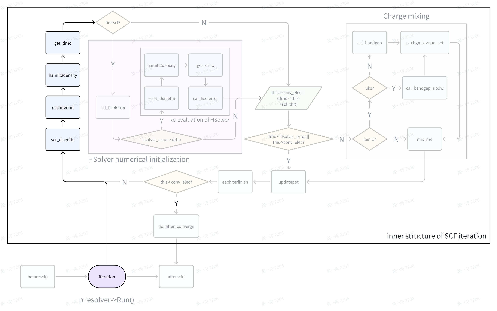
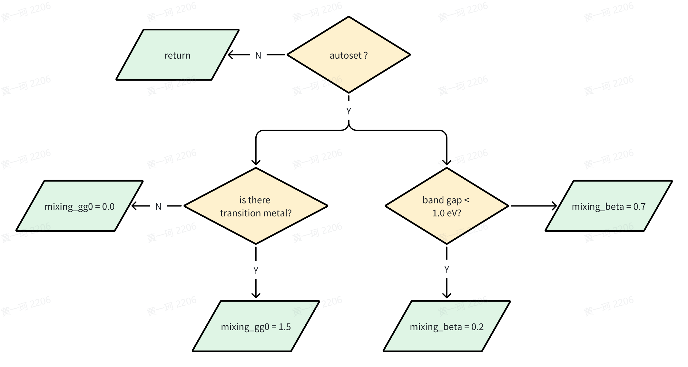
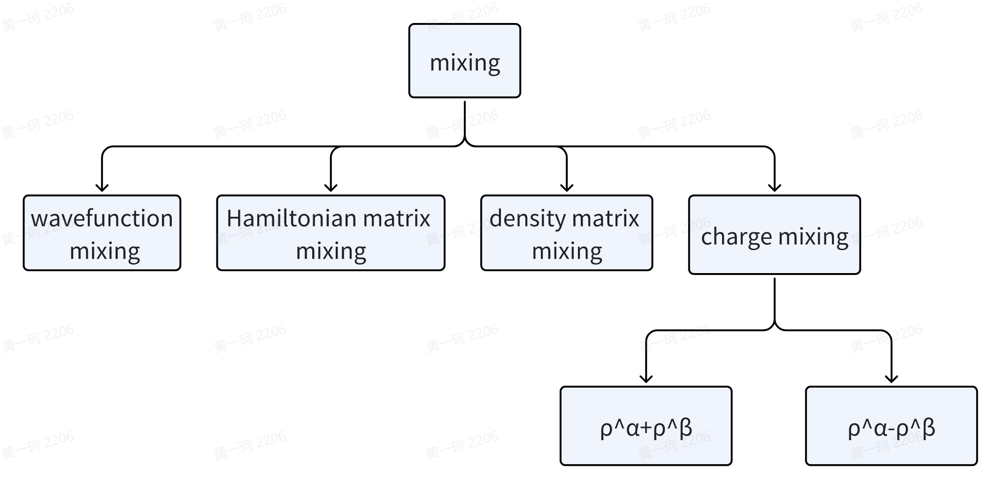
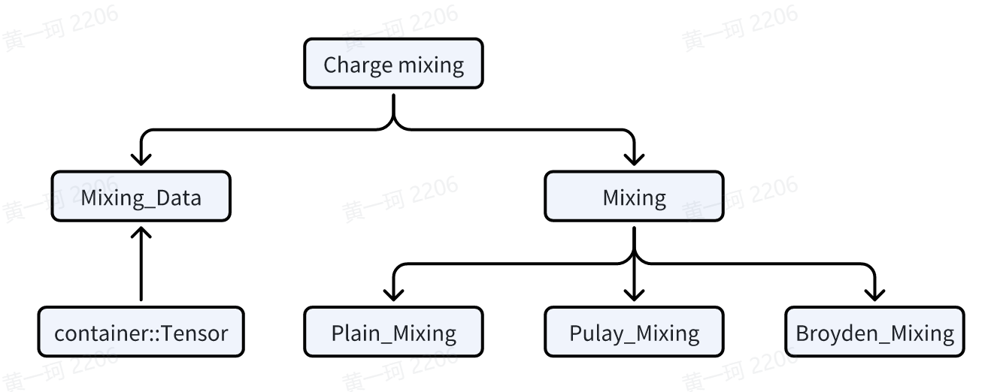

# Introduction to ABACUS: Path to PW calculation - Part 11

<strong>作者：黄一珂，邮箱：huangyk@aisi.ac.cn；金祖鑫，邮箱：jinzx@aisi.ac.cn</strong>

<strong>审核：陈默涵，邮箱：mohanchen@pku.edu.cn</strong>

<strong>飞书链接：[Introduction to ABACUS: Path to PW calculation - Part 11](https://xmywuqhxb0.feishu.cn/docx/Mn0bd8wS6os9sXxf5TXcVcE6n7g)</strong>

> 📃<strong>写在前面</strong>
>
> 1. 不脱离代码——避免读者看完手册后对代码没有一丁点概念
> 2. 不堆砌代码解释——避免平庸的代码解释，努力兼顾拉近读者和代码距离的同时，做到提纲挈领，不逐行复制代码后进行停留在代码语义上的解释

# Relax_Driver::relax_driver()

## ESolver_KS::Run()



### ESolver_KS_PW::hamilt2density()

#### HSolverPW::solve(): the rest

##### ElecStatePW::psiToRho()

当我们从 `HSolverPW::solve()` 中追溯 `psiToRho()` 函数的定义时，我们发现 `ElecStateLCAO` 和 `ElecStatePW` 均有该方法的实现，因此查看 `ElecState` 基类，发现声明为虚函数。回忆在 `ESolver_KS_PW` 中，Init()函数我们已经将其指明指向派生类对象，see [Introduction to ABACUS: Path to PW calculation - Part 7](develop-path7.md)，即此处也使用了基于多态的实现。

> 🤔<strong>批判式思考</strong>
> Polymorphism is an important technique in C++ for reducing code duplication and improving code reuse. Consider if polymorphism used here is necessary, share your opinions and ideas!

```cpp
template <typename FPTYPE, typename Device>
void ElecStatePW<FPTYPE, Device>::psiToRho(const psi::Psi<std::complex<FPTYPE>, Device>& psi)
{
    if (!this->init_rho) this->init_rho_data();
    this->calculate_weights();
    this->calEBand();
    for(int is=0; is<GlobalV::NSPIN; is++)
    {
        setmem_var_op()(this->ctx, this->rho[is], 0,  this->charge->nrxx);
        if (get_xc_func_type() == 3)
        {
            setmem_var_op()(this->ctx, this->kin_r[is], 0,  this->charge->nrxx);
        }
    }

    for (int ik = 0; ik < psi.get_nk(); ++ik)
    {
        psi.fix_k(ik);
        this->updateRhoK(psi);
    }
    if (GlobalV::device_flag == "gpu" || GlobalV::precision_flag == "single") {....}
    this->parallelK();
....
}
```

到目前为止，我们已经很难想起 `ElecStatePW::init_rho()` 是否被置为 `true`。我们使用“查找所有引用”，发现其只有在 `ElecState::init_rho_data()` 中被置为 `true`，而该函数之前从未被调用过（只有 `psiToRho()` 和 `rhoBandK()` 调用该函数），因此我们来到 `init_rho_data()`（简单起见，我们忽略 nspin=4, meta-GGA 泛函的情况）

```cpp
template<typename FPTYPE, typename Device>
void ElecStatePW<FPTYPE, Device>::init_rho_data() 
{
    if (GlobalV::device_flag == "gpu" || GlobalV::precision_flag == "single") {....}
    else {
        this->rho = reinterpret_cast<FPTYPE **>(this->charge->rho);
        if (get_xc_func_type() == 3) {....}
    }
    resmem_complex_op()(this->ctx, this->wfcr, this->basis->nmaxgr, "ElecSPW::wfcr");
    resmem_complex_op()(this->ctx, this->wfcr_another_spin, this->charge->nrxx, "ElecSPW::wfcr_a");
    this->init_rho = true;
}
```

我们让 `ElecState::rho` 和 `ElecState::charge::rho` 两指针指向同一内存区域，之后重置了 `wfcr` 和 `wfcr_another_spin` 的内存空间。`ElecState::calculate_weights()` 函数根据 smearing 方法，重新计算费米能级，并输出每个(k,b)-pair（或$$(\text{n},\mathbf{k})$$-pair）的权重。此处代码较为简单但冗长，留给感兴趣的读者自行阅读。

```cpp
void ElecState::calculate_weights()
{
....//omit timer
    if (this->skip_weights) return;

    int nbands = this->ekb.nc;
    int nks = this->ekb.nr;

    if (!Occupy::use_gaussian_broadening && !Occupy::fixed_occupations)
    {
    // [out] ef: efermi
    // [out] wg: weight of (k,b)-pair, for unoccupied band, wg=0, otherwise it is wk[ik]
        if (GlobalV::TWO_EFERMI)  // nspin = 2, uks case
        {
            Occupy::iweights(nks, this->klist->wk, nbands, this->nelec_spin[0],
                             this->ekb, this->eferm.ef_up, this->wg, 0,
                             this->klist->isk);
            ....// omit the other spin counter part
        }
        else {....}               // nspin = 1, rks case, set parameter behind wg to -1
    }
    else if (Occupy::use_gaussian_broadening)
    {
    // Gaussian smearing corrected efermi, wg and demet
    // [out] ef: efermi
    // [out] wg: the same
    // [out] demet: Delta Energy for METal
        if (GlobalV::TWO_EFERMI)  // nspin = 2, uks case
        {
            double demet_up = 0.0; double demet_dw = 0.0;
            Occupy::gweights(nks, this->klist->wk, nbands, this->nelec_spin[0],
                             Occupy::gaussian_parameter, Occupy::gaussian_type,
                             this->ekb, this->eferm.ef_up, demet_up, this->wg, 0,
                             this->klist->isk);
            ....// omit the other spin counter part
            this->f_en.demet = demet_up + demet_dw;
        }
        else {....}               // nspin = 1, rks case, set parameter behind wg to -1
#ifdef __MPI
        // qianrui fix a bug on 2021-7-21
        Parallel_Reduce::reduce_double_allpool(this->f_en.demet);
#endif
    }
    else if (Occupy::fixed_occupations) {....}
}
```

之后利用求得的 `wg(ik,ib)` 计算了 `eband` 数值：$$\text{eband}=\sum_{\mathbf{k}, \text{n}}{w_{\text{n}\mathbf{k}}\epsilon_{\text{n}\mathbf{k}}}$$

```cpp
void ElecState::calEBand()
{
    double eband = 0.0;
    for (int ik = 0; ik < this->ekb.nr; ++ik)
    {
        for (int ibnd = 0; ibnd < this->ekb.nc; ibnd++)
        {
            eband += this->ekb(ik, ibnd) * this->wg(ik, ibnd);
        }
    }
    this->f_en.eband = eband;
    if (GlobalV::KPAR != 1 && GlobalV::ESOLVER_TYPE != "sdft")
    {
        this->f_en.eband /= GlobalV::NPROC_IN_POOL;
#ifdef __MPI
        Parallel_Reduce::reduce_double_all(this->f_en.eband);
#endif
    }
}
```

```cpp
template<typename FPTYPE, typename Device>
void ElecStatePW<FPTYPE, Device>::updateRhoK(const psi::Psi<std::complex<FPTYPE>, Device>& psi)
{
    this->rhoBandK(psi);
}
```

```cpp
template<typename FPTYPE, typename Device>
void ElecStatePW<FPTYPE, Device>::rhoBandK(const psi::Psi<std::complex<FPTYPE>, Device>& psi)
{
....
    if (!this->init_rho)  this->init_rho_data();

    int ik = psi.get_current_k();
    int npw = psi.get_current_nbas();
    int current_spin = 0;
    if (GlobalV::NSPIN == 2) current_spin = this->klist->isk[ik];

    int nbands = psi.get_nbands();
    const double threshold = ModuleBase::threshold_wg * this->wg(ik, 0);

    if (GlobalV::NSPIN == 4) {....}
    else
    {
        for (int ibnd = 0; ibnd < nbands; ibnd++)
        {
            if (this->wg(ik, ibnd) < threshold) continue;

            this->basis->recip_to_real(this->ctx, &psi(ibnd,0), this->wfcr, ik);
            const auto w1 = static_cast<FPTYPE>(this->wg(ik, ibnd) / get_ucell_omega());

            if (w1 != 0.0)
            {
                elecstate_pw_op()(this->ctx,  current_spin, this->charge->nrxx, w1,  this->rho,  this->wfcr);
            }
            // kinetic energy density, if interested, see source code online:
            // https://github.com/deepmodeling/abacus-develop/blob/develop/source/module_elecstate/elecstate_pw.cpp#L196
            if (get_xc_func_type() == 3) {....}
        }
    }
}
```

这里我们将波函数从倒空间变换到了实空间（`this->wfcr`），然后使用这一量在 `this->charge->nrxx` 格点上，进行了叠加，存储在 `ElecState::rho` 里，并且因为 `ElecState::rho` 和 `ElecState::charge::rho` 指向同一片内存空间，因此使用 `ElecState::charge::rho` 访问该内存空间时，值也已经改变。即此处，我们已经根据 scf 结果更新了电荷密度 rho 的数值。

> 🤔<strong>批判性思考</strong>
> 你认为创建不止一个指针来管理同一片内存区域是否是个好主意？可能存在什么缺点或者隐患？如果不是，你是否有更好的办法？

离开 `HSolverPW::solve()` 函数刷新 `ElecState::ekb`、`psi::Psi::psi` 之后，来到计算带隙的部分：

```cpp
template <typename FPTYPE, typename Device>
void ESolver_KS_PW<FPTYPE, Device>::hamilt2density(const int istep, const int iter, const double ethr)
{
    if (this->phsol != nullptr)
    {
        ....
        this->phsol->solve(this->p_hamilt, this->kspw_psi[0], this->pelec, GlobalV::KS_SOLVER);

        if (GlobalV::out_bandgap)
        {
            if (!GlobalV::TWO_EFERMI) this->pelec->cal_bandgap();
            else this->pelec->cal_bandgap_updw();
        }
    }
    else {....}
    // calculate the delta_harris energy according to new charge density.
    // mohan add 2009-01-23
    this->pelec->cal_energies(1);
    Symmetry_rho srho;
    for (int is = 0; is < GlobalV::NSPIN; is++)
    {
        srho.begin(is, *(this->pelec->charge), this->pw_rho, GlobalC::Pgrid, this->symm);
    }
    // compute magnetization, only for LSDA(spin==2)
    GlobalC::ucell.magnet.compute_magnetization(this->pelec->charge->nrxx,
                                                this->pelec->charge->nxyz,
                                                this->pelec->charge->rho,
                                                this->pelec->nelec_spin.data());

    this->pelec->f_en.deband = this->pelec->cal_delta_eband();
}
```

因这部分代码非常简单，请自行阅读：[cal_bandgap()](https://github.com/deepmodeling/abacus-develop/blob/develop/source/module_elecstate/elecstate_energy.cpp#L11)、[cal_bandgap_updw()](https://github.com/deepmodeling/abacus-develop/blob/develop/source/module_elecstate/elecstate_energy.cpp#L41)。

#### ElecState::cal_energies()

```cpp
void ElecState::cal_energies(const int type)
{
    this->f_en.hartree_energy = get_hartree_energy();
    this->f_en.efield = get_etot_efield();
    this->f_en.gatefield = get_etot_gatefield();
    if (GlobalV::imp_sol) {....}
#ifdef __LCAO
    if (GlobalV::dft_plus_u) {....}
#endif
#ifdef __DEEPKS
    if (GlobalV::deepks_scf) {....}
#endif
    if (type == 1) // harris
    {
        this->f_en.calculate_harris();
    }
    else // etot
    {
        this->f_en.calculate_etot();
    }
}
```

```cpp
double ElecState::get_hartree_energy()
{
    return H_Hartree_pw::hartree_energy;
}
```

，`H_Hartree_pw::hartree_energy` 已经在 `PotHartree::cal_v_eff()` 所调用的 `H_Hartree_pw::v_hartree()` 被计算、赋值（see [Introduction to ABACUS: Path to PW calculation - Part 9](develop-path9.md) ）。

##### Harris and Kohn-Sham energies

- `fenergy::calculate_harris()`

```cpp
double fenergy::calculate_harris()
{
    etot_harris = eband + deband_harris + (etxc - etxcc) + ewald_energy + hartree_energy + demet + descf + exx + efield + gatefield + evdw + esol_el + esol_cav + edftu + edeepks_scf;
    return etot_harris;
}
```

- `fenergy::calculate_etot()`

```cpp
double fenergy::calculate_etot()
{
    etot = eband + deband + (etxc - etxcc) + ewald_energy +  hartree_energy + demet + descf + exx + efield + gatefield + evdw + esol_el + esol_cav + edftu + edeepks_scf;
    return etot;
}
```

我们尝试查找左侧函数中所有已经被赋值的项：

- eband：`psiToRho()` 中已经计算
- deband_harris：当前未计算
- etxc, etxcc：当前未计算
- demet：`psiToRho()` 中已经计算
- descf：当前未计算
- exx：当前未计算

#### GlobalC::ucell.magnet.compute_magnetization()

该函数源码十分简单，请自行阅读。该函数计算了 `tot_magnetization` 和 `abs_magnetization`，（对于 nspin=2 case）分别定义为：

`tot_magnetization` = $$\int{d\mathbf{r}(\rho^\alpha(\mathbf{r})-\rho^\beta(\mathbf{r}))}$$

`abs_magnetization` = $$\int{d\mathbf{r}(|\rho^\alpha(\mathbf{r})-\rho^\beta(\mathbf{r})|)}$$

nspin = 4 的情况请自行阅读。

#### ElecState::cal_delta_eband()

我们已经在上篇中解读过该函数（[Introduction to ABACUS: Path to PW calculation - Part 10](develop-path10.md)），到目前为止，区别于上一次调用，此次调用时电荷密度 rho 已经改变，因此在代码中：

```cpp
double ElecState::cal_delta_eband() const
{
    double deband0 = 0.0;
    double deband_aux = 0.0;

    const double* v_eff = this->pot->get_effective_v(0);
    const double* v_fixed = this->pot->get_fixed_v();
    const double* v_ofk = nullptr;
    if (get_xc_func_type() == 3 || get_xc_func_type() == 5)
    {
        v_ofk = this->pot->get_effective_vofk(0);
    }
    for (int ir = 0; ir < this->charge->rhopw->nrxx; ir++)
    {
        deband_aux -= this->charge->rho[0][ir] * (v_eff[ir] - v_fixed[ir]);
        if (get_xc_func_type() == 3 || get_xc_func_type() == 5)
        {
            deband_aux -= this->charge->kin_r[0][ir] * v_ofk[ir];
        }
    }

    if (GlobalV::NSPIN == 2)
    {
        v_eff = this->pot->get_effective_v(1);
        v_ofk = this->pot->get_effective_vofk(1);
        for (int ir = 0; ir < this->charge->rhopw->nrxx; ir++)
        {
            deband_aux -= this->charge->rho[1][ir] * (v_eff[ir] - v_fixed[ir]);
            if (get_xc_func_type() == 3 || get_xc_func_type() == 5)
            {
                deband_aux -= this->charge->kin_r[1][ir] * v_ofk[ir];
            }
        }
    }
    else if (GlobalV::NSPIN == 4) {....}

#ifdef __MPI
    MPI_Allreduce(&deband_aux, &deband0, 1, MPI_DOUBLE, MPI_SUM, POOL_WORLD);
#else
    deband0 = deband_aux;
#endif

    deband0 *= this->omega / this->charge->rhopw->nxyz;
    deband0 -= 2 * this->f_en.exx;
    return deband0;
}
```

凡是涉及 `charge->rho` 的项其最终计算结果均会有所差别。

### Charge_Mixing::get_drho()

`get_drho()` 函数拥有良好的注释，可以帮助读者理解函数所执行内容。

nspin=1 时密度的变化量为：

$$\mathrm{drho}=\left( \frac{1}{2}\Omega _{\mathrm{cell}} \right) \left( 4\pi e^2 \right) \sum_{\mathbf{G}\ne 0}{\frac{\Delta \rho \left( -\mathbf{G} \right) \Delta \rho \left( \mathbf{G} \right)}{\left( \frac{2\pi}{|a_0|}|\mathbf{G}| \right) ^2}}$$

nspin=2:

$$s=\left( 4\pi e^2 \right) f_{\Gamma}\left( \frac{1}{2}\Omega _{\mathrm{cell}} \right) \left\{ \sum_{\mathbf{G}\ne 0}{\frac{\left[ \Delta \rho ^{\alpha}\left( -\mathbf{G} \right) +\Delta \rho ^{\beta}\left( -\mathbf{G} \right) \right] \left[ \Delta \rho ^{\alpha}\left( \mathbf{G} \right) +\Delta \rho ^{\beta}\left( \mathbf{G} \right) \right]}{\left( \frac{2\pi}{|a_0|}|\mathbf{G}| \right) ^2}+\frac{\left[ \Delta \rho ^{\alpha}\left( 0 \right) +\Delta \rho ^{\beta}\left( 0 \right) \right] \left[ \Delta \rho ^{\alpha}\left( 0 \right) +\Delta \rho ^{\beta}\left( 0 \right) \right]}{\left( 2\pi \right) ^2}+}\sum_{\mathbf{G}\ne 0}{\frac{\left[ \Delta \rho ^{\alpha}\left( -\mathbf{G} \right) -\Delta \rho ^{\beta}\left( -\mathbf{G} \right) \right] \left[ \Delta \rho ^{\alpha}\left( \mathbf{G} \right) -\Delta \rho ^{\beta}\left( \mathbf{G} \right) \right]}{\left( 2\pi \right) ^2}} \right\}$$ 

关于 drho 的讨论可参考 Ewald summation 简介。`get_drho()` 计算了密度的变化量，为判断波函数收敛提供参考。

### HSolverPW::cal_hsolerror()

```cpp
template<typename FPTYPE, typename Device>
FPTYPE HSolverPW<FPTYPE, Device>::cal_hsolerror()
{
    return this->diag_ethr * static_cast<FPTYPE>(std::max(1.0, GlobalV::nelec));
}
```

，而 `diag_ethr` 在 `HSolverPW::set_diagethr()` 函数中被设置为 1E-2（见 [Introduction to ABACUS: Path to PW calculation - Part 10](develop-path10.md)）。若无法小于 `drho`，则重置 `diag_ethr` 后再次进行对角化、计算 `drho`，然后计算 `hsolerror` 值。

### Charge_Mixing::auto_set()

从 `ESolver_KS::Run()` 函数中，`esolver_ks_pw.cpp` 第 277 行可以知道，判断 scf 是否收敛的标准实际判断电荷密度：

```cpp
this->conv_elec = (drho < this->scf_thr);
```

但如果仍然有 `drho < hsolver_error`，则不进行 charge mixing 操作，否则进行 charge mixing：

```cpp
                    if (drho < hsolver_error || this->conv_elec)
                    {
                        if (drho < hsolver_error)    GlobalV::ofs_warning << " drho < hsolver_error, keep charge density unchanged." << std::endl;
                    }
                    else
                    {
                        //----------charge mixing---------------
                        //before first calling mix_rho(), bandgap and cell structure can be analyzed to get better default parameters
                        if(iter == 1)
                        {
                            double bandgap_for_autoset = 0.0;
                            if (!GlobalV::TWO_EFERMI)
                            {
                                this->pelec->cal_bandgap();
                                bandgap_for_autoset = this->pelec->bandgap;
                            }
                            else
                            {
                                this->pelec->cal_bandgap_updw();
                                bandgap_for_autoset = std::min(this->pelec->bandgap_up, this->pelec->bandgap_dw);
                            }
                            p_chgmix->auto_set(bandgap_for_autoset, GlobalC::ucell);
                        }
                        //conv_elec = this->estate.mix_rho();
                        p_chgmix->mix_rho(iter, pelec->charge);
                        //----------charge mixing done-----------
                    }
```

`auto_set()` 函数则为 charge mixing 设置默认值（如果 `auto_set` 的 flag 被设置为 `true`）：



### Charge_Mixing::mix_rho()

#### Mixing

Charge mixing 是一种加快 SCF 收敛的技术，其混合 SCF 过程中一定步数范围内的电荷密度，作为下一步电荷密度的实际使用数值。

##### Broyden 和 Kerker mixing

现在常见的 charge mixing 方法有 Broyden、Kerker、Pulay 等，其中 Broyden 和 Kerker mixing 方法的原理可见 VASP wiki（[link](https://www.vasp.at/wiki/index.php/IMIX#cite_note-pulay:cpl:80-5)）。

##### Pulay mixing

Pulay mixing 则使用 DIIS（Direct inversion in the iterative subspace）方法计算 mixing 系数，考虑到 DIIS 在不仅 charge mixing，在其他优化方法中也经常使用，我们对 DIIS 的原理进行简要介绍。 在 VASP 的 SCF（[Link](https://www.vasp.at/wiki/index.php/RMM-DIIS)），Quantum ESPRESSO（[Link](https://www.quantum-espresso.org/Doc/INPUT_PW.html#idm846)）、CP2K（[Link](https://manual.cp2k.org/trunk/CP2K_INPUT/FORCE_EVAL/DFT/SCF/OT.html)）、Gaussian（[Link](https://gaussian.com/scf/)）中都可以看到 DIIS 算法，其核心为求解如下矩阵的解$$\{c_i\}$$：

$$\left( \begin{matrix}
0&                -1&                -1&                \cdots&                -1\\
-1&                B_{11}&                B_{12}&                \cdots&                \,\,\\
\cdots&                \,\,&                \,\,&                \,\,&                \,\,\\
\,\,&                \cdots&                \,\,&                B_{ij}&                \,\,\\
\cdots&                \,\,&                \,\,&                \,\,&                \,\,\\
\end{matrix} \right) \left( \begin{array}{c}
-\lambda\\
c_1\\
\cdots\\
c_2\\
\cdots\\
\end{array} \right) =\left( \begin{array}{c}
-1\\
0\\
\cdots\\
0\\
\cdots\\
\end{array} \right) $$，

或写成非矩阵形式则为二次型的导数为 0 条件，亦即最小二乘法：

$$\lambda+\sum_{j=1}^N{c_jB_{ij}}=0$, $\sum_{i=1}^N{c_i}=1$，$\leftarrow\frac{1}{2}\sum_{i,j=1}^N{c_i c_jB_{ij}}+\lambda(\sum_{i=1}^N{c_i}-1)=f^\text{DIIS}(\{c_i\})$$

，其中$$B_{ij}=\langle\mathbf{e}_i|\mathbf{e}_j\rangle$，或记$|\mathbf{e}\rangle=\sum_{i=1}^N{c_i|\mathbf{e}_i\rangle}$$，则

$$
f^\text{DIIS}=\langle\mathbf{e}|\mathbf{e}\rangle+\lambda(\sum^N_{i=1}{c_i}-1)
$$

##### CDIIS

因此在以上 DIIS 框架下，Pulay 提出 error vector$|\mathbf{e}\rangle$可以具有的形式为（example implementation in pyscf: [link](https://pyscf.org/_modules/pyscf/scf/diis.html)）：

$$
|\mathbf{e}\rangle\equiv\sum^N_{i=1}{(\mathbf{FDS-SDF})}=\sum^N_{i=1}{c_i(\mathbf{F}\mathbf{D}_i\mathbf{S}-\mathbf{S}\mathbf{D}_i\mathbf{F})}
$$

##### EDIIS

EDIIS 在 DIIS 基础上混合了能量项，其 working function 变为：

$$
f^{\mathrm{EDIIS}}=\sum_{i=1}^N{c_iE\left( \mathbf{D}_i \right)}-\frac{1}{2}\sum_{i.j=1}^N{c_ic_j\mathrm{Tr}\left[ \left( \mathbf{F}_i-\mathbf{F}_j \right) \cdot \left( \mathbf{D}_i-\mathbf{D}_j \right) \right]}
$$

##### GEDIIS

自 Gaussian 09 发布以来，对于几何优化任务，Gaussian 的默认策略调整为 GEDIIS。GEDIIS 中需要用最小二乘法达成的最小化函数构造方式如下：

$$
f^\text{GEDIIS} =\sum_{i=1}^N{c_iE\left( \mathbf{R}_i \right)}-\frac{1}{2}\sum_{i.j=1}^N{c_ic_j\left( \mathbf{g}_i-\mathbf{g}_j \right) \left( \mathbf{R}_i-\mathbf{R}_j \right)}
$$

组合系数仍然要满足$\sum_{i=1}^N{c_i}=1$条件，$\mathbf{g}_i$为第 i 步的梯度。

#### ABACUS 实现



实际上，并非仅有 charge density 一个物理量可以进行 mixing，其他物理量，诸如波函数、Hamiltonian 矩阵、密度矩阵和自旋密度等都可以进行 mixing。实际 mixing 过程中 mixing dimension 通常在 10-20，即需要存储 10-20 个 SCF 迭代步的数据。为了在支持异构计算的同时减少 CPU-GPU 数据交换，对数据存储同样有异构化需求，因此使用了 ABACUS 中支持异构数据存储的 Tensor container。在 mixing 具体操作上，采用了继承方式：



### ESolver_KS::updatepot()

```cpp
template <typename FPTYPE, typename Device>
void ESolver_KS_PW<FPTYPE, Device>::updatepot(const int istep, const int iter)
{
    if (!this->conv_elec)
    {
        if (GlobalV::NSPIN == 4) {....}
        this->pelec->pot->update_from_charge(this->pelec->charge, &GlobalC::ucell);
        this->pelec->f_en.descf = this->pelec->cal_delta_escf();
    }
    else
    {
        this->pelec->cal_converged();
    }
}
```

#### Not converged case

##### Potential::update_from_charge()

```cpp
void Potential::update_from_charge(const Charge* chg, const UnitCell* ucell)
{
    ModuleBase::TITLE("Potential", "update_from_charge");
    ModuleBase::timer::tick("Potential", "update_from_charge");
    if (!this->fixed_done)
    {
        this->cal_fixed_v(this->v_effective_fixed.data());
        this->fixed_done = true;
    }

    this->cal_v_eff(chg, ucell, this->v_effective);
....// omit GPU, single float point support and timer
}
```

##### ElecState::cal_delta_escf()

```cpp
/// @brief calculate descf
double ElecState::cal_delta_escf() const
{
    ModuleBase::TITLE("energy", "delta_escf");
    double descf = 0.0;
    // now rho1 is "mixed" charge density
    // and rho1_save is "output" charge density
    // because in "deband" the energy is calculated from "output" charge density,
    // so here is the correction.
    // only potential related with charge is used here for energy correction
    // on the fly calculate it here by v_effective - v_fixed
    const double* v_eff = this->pot->get_effective_v(0);
    const double* v_fixed = this->pot->get_fixed_v();
    const double* v_ofk = nullptr;
    if (get_xc_func_type() == 3 || get_xc_func_type() == 5)
    {
        v_ofk = this->pot->get_effective_vofk(0);
    }

    for (int ir = 0; ir < this->charge->rhopw->nrxx; ir++)
    {
        descf -= (this->charge->rho[0][ir] - this->charge->rho_save[0][ir]) * (v_eff[ir] - v_fixed[ir]);
        if (get_xc_func_type() == 3 || get_xc_func_type() == 5) {....}
    }

    if (GlobalV::NSPIN == 2)
    {
        v_eff = this->pot->get_effective_v(1);
        if (get_xc_func_type() == 3 || get_xc_func_type() == 5) {....}
        for (int ir = 0; ir < this->charge->rhopw->nrxx; ir++)
        {
            descf -= (this->charge->rho[1][ir] - this->charge->rho_save[1][ir]) * (v_eff[ir] - v_fixed[ir]);
            if (get_xc_func_type() == 3 || get_xc_func_type() == 5)
            {
                descf -= (this->charge->kin_r[1][ir] - this->charge->kin_r_save[1][ir]) * v_ofk[ir];
            }
        }
    }
    if (GlobalV::NSPIN == 4) {....}

#ifdef __MPI
    Parallel_Reduce::reduce_double_pool(descf);
#endif

    descf *= this->omega / this->charge->rhopw->nxyz;
    return descf;
}
```

#### Converged case

##### ElecState::cal_converged()

```cpp
/// @brief calculation if converged
void ElecState::cal_converged()
{
    this->pot->get_vnew(this->charge, this->vnew);
    this->vnew_exist = true;
    this->f_en.descf = 0.0;
}
```

##### Potential::get_vnew()

```cpp
void Potential::get_vnew(const Charge* chg, ModuleBase::matrix& vnew)
{
    ModuleBase::TITLE("Potential", "get_vnew");
    vnew.create(this->v_effective.nr, this->v_effective.nc);
    vnew = this->v_effective;

    this->update_from_charge(chg, this->ucell_);
    //(used later for scf correction to the forces )
    for (int iter = 0; iter < vnew.nr * vnew.nc; ++iter)
    {
        vnew.c[iter] = this->v_effective.c[iter] - vnew.c[iter];
    }
}
```

### ESolver_KS::eachiterfinish()

```cpp
template <typename FPTYPE, typename Device>
void ESolver_KS_PW<FPTYPE, Device>::eachiterfinish(const int iter)
{
    // print_eigenvalue(GlobalV::ofs_running);
    this->pelec->cal_energies(2);
    // We output it for restarting the scf.
....// omit ofstream output of demanded properties such as electron density and wfc, see this function on Github
}
```

此时我们不再计算 Harris functional 而是 Kohn-Sham functional.

（我们省略了 `ESolver_KS::printiter()` 函数，即 scf 过程中的输出。关于该函数的实现细节，请自行阅读：link）

### ESolver_KS::do_after_converge()

我们假设经过许多轮 scf 后，密度已经达到收敛标准，则到达这一函数。`ESolver_KS` 中声明该函数为 `virtual`

```cpp
namespace ModuleESolver
{

    template<typename FPTYPE, typename Device = psi::DEVICE_CPU>
    class ESolver_KS : public ESolver_FP
    {
    public:
....
    protected:
....
        virtual bool do_after_converge(int& iter){return true;}
```

```cpp
    template<typename FPTYPE, typename Device>
    void ESolver_KS<FPTYPE, Device>::Run(const int istep, UnitCell& ucell)
    {
        if (!(GlobalV::CALCULATION == "scf" || GlobalV::CALCULATION == "md"
            || GlobalV::CALCULATION == "relax" || GlobalV::CALCULATION == "cell-relax"))
        {....}
        else
        {
....
            for (int iter = 1; iter <= this->maxniter; ++iter)
            {
....
                if (this->conv_elec)
                {
                    this->niter = iter;
                    bool stop = this->do_after_converge(iter);
                    if(stop) break;
                }
            }
....
```

，但在 `ESolver_KS_PW` 中则实际并无该函数的定义，但对于 LCAO 基组，则确实重新定义了这一函数。

### ESolver_KS::afterscf()

该函数进行了数个性质的输出。

```cpp
template <typename FPTYPE, typename Device>
void ESolver_KS_PW<FPTYPE, Device>::afterscf(const int istep)
{
    this->create_Output_Potential(istep).write();

    // save charge difference into files for charge extrapolation
    if (GlobalV::CALCULATION != "scf")
    {
        this->CE.save_files(istep,
                            GlobalC::ucell,
#ifdef __MPI
                            this->pw_big,
#endif
                            this->pelec->charge,
                            &this->sf);
    }

    if (GlobalV::out_chg)
    {
        for (int is = 0; is < GlobalV::NSPIN; is++)
        {
            this->create_Output_Rho(is, istep).write();
            if (XC_Functional::get_func_type() == 3 || XC_Functional::get_func_type() == 5)
            {
                this->create_Output_Kin(is, istep).write();
            }
        }
    }

    if (this->wf.out_wfc_pw == 1 || this->wf.out_wfc_pw == 2)
    {
        std::stringstream ssw;
        ssw << GlobalV::global_out_dir << "WAVEFUNC";
        ModuleIO::write_wfc_pw(ssw.str(), this->psi[0], this->kv, this->pw_wfc);
    }

    ModuleIO::output_convergence_after_scf(this->conv_elec, this->pelec->f_en.etot);
    ModuleIO::output_efermi(this->conv_elec, this->pelec->eferm.ef); 

    if (GlobalV::OUT_LEVEL != "m")
    {
        this->pelec->print_eigenvalue(GlobalV::ofs_running);
    }
    if (this->device == psi::GpuDevice)
    {
        castmem_2d_d2h_op()(this->psi[0].get_device(),
                            this->kspw_psi[0].get_device(),
                            this->psi[0].get_pointer() - this->psi[0].get_psi_bias(),
                            this->kspw_psi[0].get_pointer() - this->kspw_psi[0].get_psi_bias(),
                            this->psi[0].size());
    }
}
```

# 结语

至此，我们结束了 `ESolver_KS::Run()` 函数的全部内容，返回 `Relax_Driver::relax_driver()` 函数。考虑到我们关注的是 pw-scf 任务，因此并不对原子坐标和晶胞参数进行 relax，所以 `relax_driver()` 函数也在 scf 收敛后退出，到达 `ESolver::postprocess()`（但该函数为虚函数，因此到达 `ESolver_KS_PW::postprocess()`）。

在该函数中，主要对电子态、DOS、能带性质、实空间波函数等进行输出，在 esolver_ks_pw.cpp 的第 737 行，则进行了平面波和球 Bessel 函数的 overlap 积分输出：

```cpp
if (winput::out_spillage <= 2)
        {
            Numerical_Basis numerical_basis;
            numerical_basis.output_overlap(this->psi[0], this->sf, this->kv, this->pw_wfc);
            ModuleBase::GlobalFunc::DONE(GlobalV::ofs_running, "BASIS OVERLAP (Q and S) GENERATION.");
        }
```

Q 和 S 矩阵将用于 SIAB（Systematically improvable optimized atomic basis sets）程序，进行数值原子轨道生成的依据。生成数值原子轨道后，则可以在使用数值原子轨道为基组的基础上，使用 ABACUS 的基于数值原子轨道（线性组合原子轨道 LCAO，`basis_type lcao`）方法进行模拟，这将是我们下一个部分，Introduction to ABACUS: Path to LCAO calculation 系列的起点。

`ESolver_KS_PW::postprocess()` 对于计算电导率的情况还可以调用 KG 方法进行计算，但对 KG 的解读已经超出了本部分的讨论范围。

> 🤔<strong>“家庭作业”</strong>
> For now we are trying to make all ABACUS output look well-organized, you may try to participate in practical ABACUS developing starting from formatting those output information. With the newly merged Formatter library, you browse the source code and find somewhere to improve. Submit your pull request after local testing, do not hesititate!
> Instruction of Formatter library: [ABACUS formatter 库使用说明书](https://ucoyxk075n.feishu.cn/docx/Yym9dnm3aoTMfHxin8rcX9Rvnmb)

# 系列链接

上篇：[Introduction to ABACUS: Path to PW calculation - Part 10](develop-path10.md)

下篇：[Introduction to ABACUS: Path to PW calculation - Summary Final](develop-sm2.md)

游园惊梦：[Introduction to ABACUS: Path to PW calculation - Part 1](develop-path1.md)

下个章节：Introduction to ABACUS: Path to LCAO calculation - Part 1
