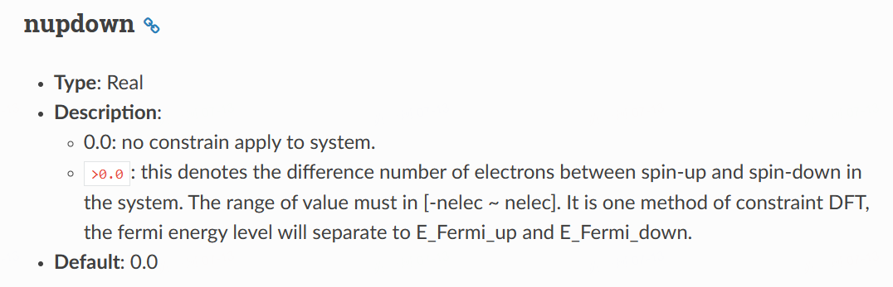

# Introduction to ABACUS: Path to PW calculation - Part 2

<strong>作者：黄一珂，邮箱：huangyk@aisi.ac.cn</strong>

<strong>审核：陈默涵，邮箱：mohanchen@pku.edu.cn</strong>

<strong>飞书链接：[Introduction to ABACUS: Path to PW calculation - Part 2](https://xmywuqhxb0.feishu.cn/docx/VacUdXtXaoWDE6xQfZNcY85znOc)</strong>

> 📃<strong>写在前面</strong>
>
> 1. 不脱离代码——避免读者看完手册后对代码没有一丁点概念
> 2. 不堆砌代码解释——避免平庸的代码解释，努力兼顾拉近读者和代码距离的同时，做到提纲挈领，不逐行复制代码后进行停留在代码语义上的解释

承接上篇对 `INPUT` 文件的解析，本篇延续 ABACUS workflow，介绍和 STRU 文件中信息读取紧密相关的 `UnitCell` 类。

# Driver

## Driver::atomic_world()

### Driver::driver_run()

#### ucell

在 `driver_run.cpp` 中直接调用了 `GlobalC` 的数据成员 `UnitCell ucell` 的成员函数 `UnitCell::setup_cell()`，

```cpp
// driver_run.cpp
void Driver::driver_run()
{
    ....
    GlobalC::ucell.setup_cell(GlobalV::stru_file, GlobalV::ofs_running);
```

则自然回忆回溯在何时 `ucell` 被声明、定义、初始化的（尽管在上篇中已经明确提到）。寻得在 `module_hamilt_pw/hamilt_pwdft/global.h` 中，有关于 `ucell` 为 `extern` 变量的声明：

```cpp
namespace GlobalC
{
    extern UnitCell ucell;
```

同时在 `module_hamilt_pw/hamilt_pwdft/global.cpp` 中，有其定义：

```cpp
namespace GlobalC
{
    UnitCell ucell;
```

则对于需要使用到 `UnitCell` 对象 `ucell` 的场合，只需要包含 `module_hamilt_pw/hamilt_pwdft/global.h` 头文件即可，其中 `ucell` 为全局类（将来可能会把这个全局类去掉，换成指定范围内可以使用的模块）。

##### UnitCell:setup_cell()

`ucell` 的一些数据成员在 `Input_Conv::Convert()` 函数中赋值：

```cpp
// line 266
GlobalC::ucell.setup(INPUT.latname, INPUT.ntype, INPUT.lmaxmax, INPUT.init_vel, INPUT.fixed_axes);
```

`GlobalC::UnitCell::setup()` 函数除了导入前四个量外，根据最后一个传入参数，控制 `UnitCell ucell` 中晶格矢量的约束条件 `lc[0]`, `lc[1]` 和 `lc[2]`。可见 `lc[i]` 实际上可能会出现在晶格矢量的 rescale factor 里，额外使用 `lc[i]` 作为变化量的 factor，若为 0，固定，则该晶格矢量在程序运行中不会有变化。

```cpp
void UnitCell::setup(const std::string& latname_in, const int& ntype_in, const int& lmaxmax_in, const bool& init_vel_in, const std::string& fixed_axes_in)
{
    this->latName = latname_in; this->ntype = ntype_in;
    this->lmaxmax = lmaxmax_in; this->init_vel = init_vel_in;

    if (fixed_axes_in == "None") this->lc[0] = 1; this->lc[1] = 1; this->lc[2] = 1;
    else if (fixed_axes_in == "volume")
    {
        this->lc[0] = 1; this->lc[1] = 1; this->lc[2] = 1;
        if (!GlobalV::relax_new)
        {
            ModuleBase::WARNING_QUIT(
                "Input",
                "there are bugs in the old implementation; set relax_new to be 1 for fixed_volume relaxation");
        }
    }
    else if (fixed_axes_in == "shape")
    {
        if (!GlobalV::relax_new)
        {
            ModuleBase::WARNING_QUIT("Input", "set relax_new to be 1 for fixed_shape relaxation");
        }
        this->lc[0] = 1; this->lc[1] = 1; this->lc[2] = 1;
    }
    else if (fixed_axes_in == "a") this->lc[0] = 0; this->lc[1] = 1; this->lc[2] = 1;
....//omit b and c
    else if (fixed_axes_in == "ab") this->lc[0] = 0; this->lc[1] = 0; this->lc[2] = 1;
....//omit without b and c
    else if (fixed_axes_in == "abc") this->lc[0] = 0; this->lc[1] = 0; this->lc[2] = 0;
    else
....//warning and quit
    return;
}
```

回到 `Driver::driver_run()` 的 line 33（[Link](https://github.com/abacusmodeling/abacus-develop/blob/develop/source/driver_run.cpp#L33)），其所调用 `UnitCell::setup_cell()` 函数首先根据前文提到在 `Input_Conv::Convert()` 中调用的 `UnitCell::setup()` 函数，确定了 `UnitCell::ntype`，因此使用 `ntype` 重新为 `magnet.start_magnetization` 分配内存空间。`UnitCell::magnet` 成员变量在 `module_cell/unitcell.h` 中被声明。类似的还有 `ucell.atoms` 等。

```cpp
void UnitCell::setup_cell(const std::string &fn, std::ofstream &log)
{
    delete[] magnet.start_magnetization;
    magnet.start_magnetization = new double[this->ntype];

    this->atoms = new Atom[this->ntype];
    this->set_atom_flag = true;
```

```cpp
class UnitCell
{
public:
    Magnetism magnet;  // magnetism Yu Liu 2021-07-03
```

在 `Driver::driver_run()` 中调用 `UnitCell::setup_cell()` 时，传入参数 `GlobalV::stru_file` 和文件流对象 `GlobalV::ofs_running`，前者具有默认值 `STRU`（[Introduction to ABACUS: Path to PW calculation - Part 1](https://ucoyxk075n.feishu.cn/docx/LnfedDEn7oydPlxguXVceKgknOh#NEwzdRNkAoZyihxhUhWc6pUenhe) `Input::init()`），后者同样具有默认值，见 `global_file.cpp`。

##### STRU file parse

若 `STRU` 文件存在，读取其中内容：

```cpp
const int error = this->read_atom_species(ifa, log);
    ok2 = this->read_atom_positions(ifa, log, GlobalV::ofs_warning);
```

`ifa` 即为打开 `STRU` 的 `ifstream` 文件流对象，`log` 为 `GlobalV:ofs_running` 变量。

###### Basic structure of STRU file: examples

在开始阅读 `STRU` 文件解析程序部分之前，首先展示几种 `STRU` 文件样例：

```cpp
// with latname = 'fcc' in INPUT file
ATOMIC_SPECIES
Si 28.00 Si_ONCV_PBE-1.0.upf // label; mass; pseudo_file
NUMERICAL_ORBITAL
Si_gga_8au_60Ry_2s2p1d.orb //numerical_orbital_file
LATTICE_CONSTANT
10.2 // lattice scaling factor (Bohr)
ATOMIC_POSITIONS
Direct //Cartesian or Direct coordinate.

Si // Element type
0.0 // magnetism
2 // number of atoms
0.00 0.00 0.00 0 0 0//the position of atoms and other parameter specify by key word
0.25 0.25 0.25 1 1 1
```

```cpp
// with latname = 'none' or do not set it in INPUT file
ATOMIC_SPECIES
Si 28.00 Si_ONCV_PBE-1.0.upf upf201 // label; mass; pseudo_file; pseudo_type

NUMERICAL_ORBITAL
Si_gga_8au_60Ry_2s2p1d.orb //numerical_orbital_file

LATTICE_CONSTANT
10.2 // lattice scaling factor (Bohr)

LATTICE_VECTORS
0.5 0.5 0.0 // latvec1
0.5 0.0 0.5 // latvec2
0.0 0.5 0.5 // latvec3

ATOMIC_POSITIONS
Direct //Cartesian or Direct coordinate.
Si // Element type
0.0 // magnetism(Be careful: value 1.0 refers to 1.0 bohr mag, but not fully spin up !!!)
2 // number of atoms
0.00 0.00 0.00 0 0 0
0.25 0.25 0.25 1 1 1
```

```cpp
ATOMIC_SPECIES
Pt 195.08 Pt_ONCV_PBE-1.0.upf

LATTICE_CONSTANT
1.8897259886 // 1 Angstrom, but unit required is Bohr, so it is this value

LATTICE_VECTORS
8.4359998703         0.0000000000         0.0000000000
-4.2179999352         7.3057901940         0.0000000000
0.0000000000         0.0000000000        25.1919994354

ATOMIC_POSITIONS
Cartesian // Cartesian (Unit is LATTICE_CONSTANT)

Pt
0.0
27
     0.000000000         0.000000000         3.288052246
     1.405985941         0.811746362         1.643526123
     0.000000000         1.623492723         0.000000000
     2.811971882         0.000000000         3.287052246
...
```

```cpp
// directly start after ATOMIC_POSITIONS' title
Fe
1.0
2
0.0 0.0 0.0 m 0 0 0 mag 1.0 angle1 90 angle2 0
0.5 0.5 0.5 m 1 1 1 mag 1.0 angle1 90 angle2 180
```

> 🔧<strong>重构思考</strong>
> 将来可以增添 `xyz` 格式的原子信息文件到 ABACUS 的接口以增强易用性。

###### UnitCell::read_atom_species()

⚙`UnitCell::read_atom_species()` 函数实际上读取除原子坐标外的所有信息，如晶格矢量 `latvec` 等。这些变量都是 `UnitCell` 的数据成员。具体读取的 section 有 `ATOMIC_SPECIES`, `NUMERICAL_ORBITAL`, `NUMERICAL_DESCRIPTOR`, `ABFS_ORBITAL`, `LATTICE_CONSTANT`, `LATTICE_VECTORS`, `LATTICE PARAMETERS` 等。

```cpp
int UnitCell::read_atom_species(std::ifstream &ifa, std::ofstream &ofs_running)
{
    int error = 0;

    delete[] atom_label; this->atom_mass  = new double[ntype];
    delete[] atom_mass; this->atom_label = new std::string[ntype];
    delete[] pseudo_fn; this->pseudo_fn  = new std::string[ntype];
    delete[] pseudo_type; this->pseudo_type = new std::string[ntype];
    delete[] orbital_fn; this->orbital_fn = new std::string[ntype];
...
    if( ModuleBase::GlobalFunc::SCAN_BEGIN(ifa, "ATOMIC_SPECIES") )
    {
...
#ifdef __LCAO
    if(GlobalV::BASIS_TYPE=="lcao" || GlobalV::BASIS_TYPE=="lcao_in_pw")
    {
        if( ModuleBase::GlobalFunc::SCAN_BEGIN(ifa, "NUMERICAL_ORBITAL") )
        {
            for(int i=0; i<ntype; i++) ifa >> orbital_fn[i];
        }   

        if(GlobalV::deepks_setorb)
        {
            if (ModuleBase::GlobalFunc::SCAN_BEGIN(ifa, "NUMERICAL_DESCRIPTOR")) {
                ifa >> descriptor_file;
            }
        }
        else descriptor_file = GlobalV::global_orbital_dir + orbital_fn[0];
    }
...
#ifdef __EXX
    if( GlobalC::exx_info.info_global.cal_exx )
    {
        if( ModuleBase::GlobalFunc::SCAN_BEGIN(ifa, "ABFS_ORBITAL") )
        {
            for(int i=0; i<ntype; i++)
            {
                std::string ofile;
                ifa >> ofile;
                GlobalC::exx_info.info_ri.files_abfs.push_back(ofile);
            }
        }
    }

    if (GlobalV::rpa_setorb)
    {
        if (ModuleBase::GlobalFunc::SCAN_BEGIN(ifa, "ABFS_ORBITAL"))
        {
            GlobalV::rpa_orbitals.resize(ntype);
            for (int i = 0; i < ntype; i++) ifa >> GlobalV::rpa_orbitals[i];
        }
    }
....
    if( ModuleBase::GlobalFunc::SCAN_BEGIN(ifa, "LATTICE_CONSTANT") )
    {
        ModuleBase::GlobalFunc::READ_VALUE(ifa, lat0);
        lat0_angstrom = lat0 * 0.529177 ;
        this->tpiba  = ModuleBase::TWO_PI / lat0;
        this->tpiba2 = tpiba * tpiba;
    }
...
    if(latName=="none"){    
        if( ModuleBase::GlobalFunc::SCAN_BEGIN(ifa, "LATTICE_VECTORS") )
        {
            ifa >> latvec.e11 >> latvec.e12;
            ModuleBase::GlobalFunc::READ_VALUE(ifa, latvec.e13);
            ifa >> latvec.e21 >> latvec.e22;
            ModuleBase::GlobalFunc::READ_VALUE(ifa, latvec.e23);
            ifa >> latvec.e31 >> latvec.e32;
            ModuleBase::GlobalFunc::READ_VALUE(ifa, latvec.e33);
// read e(i)3 in this way is to change to the next line
        }
        if( ModuleBase::GlobalFunc::SCAN_BEGIN(ifa, "LATTICE_PARAMETERS") )
        {
            ModuleBase::WARNING_QUIT("UnitCell::read_atom_species","do not use LATTICE_PARAMETERS without explicit specification of lattice type");
        }
    }
    else{
        if( ModuleBase::GlobalFunc::SCAN_BEGIN(ifa, "LATTICE_VECTORS") )
        {
            ModuleBase::WARNING_QUIT("UnitCell::read_atom_species","do not use LATTICE_VECTORS along with explicit specification of lattice type");
        }
        if(latName=="sc"){//simple-cubic, ibrav = 1
            latvec.e11 = 1.0; latvec.e12 = 0.0; latvec.e13 = 0.0;
            latvec.e21 = 0.0; latvec.e22 = 1.0; latvec.e23 = 0.0;
            latvec.e31 = 0.0; latvec.e32 = 0.0; latvec.e33 = 1.0;
        else if(latName=="fcc"){//face-centered cubic, ibrav = 2
        ...}
        else if(latName=="bcc"){//body-centered cubic, ibrav = 3
        ...}
    ...
        else if(latName=="triclinic"){//triclinic, ibrav = 14
            double bba = 0.0; double cba = 0.0; double cosab = 0.0; double cosac = 0.0;
            double cosbc = 0.0; double sinab = 0.0; double term = 0.0;
            if( ModuleBase::GlobalFunc::SCAN_BEGIN(ifa, "LATTICE_PARAMETERS") )
            {
                ifa >> bba >> cba >> cosab >> cosac;
                ModuleBase::GlobalFunc::READ_VALUE(ifa, cosbc);
                sinab = sqrt(1.0-cosab*cosab);
            }
            latvec.e11 = 1.0; latvec.e12 = 0.0; latvec.e13 = 0.0;
            latvec.e21 = bba * cosab; latvec.e22 = bba * sinab; latvec.e23 = 0.0;
            latvec.e31 = cba * cosac; latvec.e32 = cba * (cosbc - cosac*cosab) / sinab;
            term = 1.0 + 2.0 * cosab*cosac*cosbc - cosab*cosab - cosac*cosac - cosbc*cosbc;
            term = sqrt(term)/sinab;
            latvec.e33 = cba * term;
        }
        else{ 
            std::cout << "latname is : " << latName << std::endl;
            ModuleBase::WARNING_QUIT("UnitCell::read_atom_species","latname not supported!");
        }
    a1.x = latvec.e11; a1.y = latvec.e12; a1.z = latvec.e13;
    a2.x = latvec.e21; a2.y = latvec.e22; a2.z = latvec.e23;
    a3.x = latvec.e31; a3.y = latvec.e32; a3.z = latvec.e33;
    // a(i) is lattice vector
}
```

<strong>我们约定，`LATTICE_CONSTANT`无量纲，`LATTICE_VECTORS`有量纲，`STRU`文件中原子坐标无量纲</strong>。

###### UnitCell::read_atom_positions()

> 🔧<strong>重构思考</strong>
> 同样地，`UnitCell::read_atom_positions()` 函数也不仅仅读取原子的位置，还额外读取各种具体涉及每个原子的速度、固定、磁化等等信息。

首先来到读取 `STRU` `ATOMIC_POSITIONS` 部分：

```cpp
bool UnitCell::read_atom_positions(std::ifstream &ifpos, std::ofstream &ofs_running, std::ofstream &ofs_warning)
{
    if( ModuleBase::GlobalFunc::SCAN_BEGIN(ifpos, "ATOMIC_POSITIONS"))
    {
        ModuleBase::GlobalFunc::READ_VALUE( ifpos, Coordinate);
```

STRU 第二行指定坐标类型，被读取为 `UnitCell::Coordinate`。`UnitCell::Coordinate` 在 `STRU` 里有不同选项，⚙ 决定原子的具体位置和单位：

```cpp
            if(Coordinate != "Cartesian" 
            && Coordinate != "Direct" 
            && Coordinate != "Cartesian_angstrom"
            && Coordinate != "Cartesian_au"
            && Coordinate != "Cartesian_angstrom_center_xy"
            && Coordinate != "Cartesian_angstrom_center_xz"
            && Coordinate != "Cartesian_angstrom_center_yz"
            && Coordinate != "Cartesian_angstrom_center_xyz"
            )
        {
            ModuleBase::WARNING("read_atom_position","Cartesian or Direct?");
            ofs_warning << " There are several options for you:" << std::endl;
            ofs_warning << " Direct" << std::endl;
            ofs_warning << " Cartesian_angstrom" << std::endl;
            ofs_warning << " Cartesian_au" << std::endl;
            ofs_warning << " Cartesian_angstrom_center_xy" << std::endl;
            ofs_warning << " Cartesian_angstrom_center_xz" << std::endl;
            ofs_warning << " Cartesian_angstrom_center_yz" << std::endl;
            ofs_warning << " Cartesian_angstrom_center_xyz" << std::endl;
            return 0; // means something wrong
        }
```

这将决定最后实际的原子坐标：

```cpp
// module_cell/read_atom.cpp: line 695
                    if(Coordinate=="Direct")
                    {
                        atoms[it].taud[ia] = v;
                        atoms[it].tau[ia] = v * latvec;
                    }
                    else if(Coordinate=="Cartesian")
                    {
                        atoms[it].tau[ia] = v ;
                    }
                    else if(Coordinate=="Cartesian_angstrom")
                    {
                        atoms[it].tau[ia] = v / 0.529177 / lat0;
                    }   
                    else if(Coordinate=="Cartesian_angstrom_center_xy")
                    {
                        latcenter.x = (latvec.e11 + latvec.e21 + latvec.e31)/2.0;
                        latcenter.y = (latvec.e12 + latvec.e22 + latvec.e32)/2.0;
                        latcenter.z = 0.0;
                        atoms[it].tau[ia] = v / 0.529177 / lat0 + latcenter; 
                    ...
```

> 🔧<strong>重构思考</strong>
> ABACUS 代码中现在分原子类型导入数据，尽管在代码中分种类管理原子是十分自然的选择，但 ABACUS 将这种选择表露在用户端，因此 STRU 中关于原子位置的定义也必须按类型分开输入。

接下来是按原子种类循环 `ATOMIC_POSITIONS` section:

```cpp
        int na = 0;
        this->nat = 0;
        assert(ntype>0);
        for (int it = 0;it < ntype; it++)
        {
            ofs_running << "\n READING ATOM TYPE " << it+1 << std::endl;
```

> 🔧<strong>重构思考</strong>
> 进入循环体，检查在 ATOMIC_POSITIONS section 中原子定义的顺序是否和 ATOMIC_SPECIES 相同
> 📝<strong>开发者旁注</strong>
> 已在重构计划中

```cpp
            ModuleBase::GlobalFunc::READ_VALUE(ifpos, atoms[it].label);
            bool sequence_match = false;
            for(int it2=0; it2<ntype; it2++)
            {
                if( this->atoms[it].label == this->atom_label[it2] )
                {   
                    if (it2 == it) sequence_match = true;
                }
            }
            if(!sequence_match)
            {
                ...
                return 0;
            }
```

读取当前原子类型的 starting_magnetization、原子总数 na

```cpp
            ModuleBase::GlobalFunc::READ_VALUE(ifpos, magnet.start_magnetization[it] );
            ...
            ModuleBase::GlobalFunc::READ_VALUE(ifpos, na);
            this->atoms[it].na = na;
            ....
            this->nat += na;
            ....
```

在当前 type 下刷新 type-specific 的原子性质：

```cpp
// positions and positional constraints
                delete[] atoms[it].tau; delete[] atoms[it].taud; delete[] atoms[it].mbl;
                atoms[it].tau = new ModuleBase::Vector3<double>[na];
                atoms[it].taud = new ModuleBase::Vector3<double>[na];
                atoms[it].mbl = new ModuleBase::Vector3<int>[na];
// evoluation
                delete[] atoms[it].vel; delete[] atoms[it].dis;
                atoms[it].vel = new ModuleBase::Vector3<double>[na];
                atoms[it].dis = new ModuleBase::Vector3<double>[na];
// magnetization
                delete[] atoms[it].mag;
                delete[] atoms[it].angle1; delete[] atoms[it].angle2;
                delete[] atoms[it].m_loc_;
                atoms[it].mag = new double[na];
                atoms[it].angle1 = new double[na];
                atoms[it].angle2 = new double[na];
                atoms[it].m_loc_ = new ModuleBase::Vector3<double>[na];
```

⚙ 然后在 ATOMIC_POSITIONS 中读取：

```cpp
                atoms[it].mass = this->atom_mass[it];
```

❗ 此处的 `atoms[it].mass` 与 `this->atom_mass[it]` 的用法与 `atomis[it].label` 与 `this->atom_label[it]` 不同：传值 vs 核对。

接下来读取类中每个原子的速度信息，在做分子动力学模拟的时候可能需要用到：

```cpp
                for (int ia = 0;ia < na; ia++)
                {
                    ifpos >> v.x >> v.y >> v.z;
```

然而，当前 `STRU` 文件在 `ATOMIC_POSITIONS` 的设计比较复杂，其可以包括任何一组 atom-specific 数据，且数量和顺序均不受限制，这导致判断条件变得复杂，详见 `module_cell/read_atoms.cpp:line 536 - 567`（[link](https://github.com/deepmodeling/abacus-develop/blob/develop/source/module_cell/read_atoms.cpp#L536)）。

`atoms[it].mag` 的赋值并非直接读取：

```cpp
                    else if ( tmpid == "mag" || tmpid == "magmom")
                    {
                        set_element_mag_zero = true;
                        double tmpamg=0; ifpos >> tmpamg;
                        tmp=ifpos.get();
                        while (tmp==' ') tmp=ifpos.get();
                        // ASCII code 48 to 57 are 0 to 9 the Arabic number
                        if((tmp >= 48 && tmp <= 57) or tmp=='-')
                        {
                            ifpos.putback(tmp); // touch the numerical data, go back
                            ifpos >> atoms[it].m_loc_[ia].y>>atoms[it].m_loc_[ia].z;
                            atoms[it].m_loc_[ia].x=tmpamg;
                            atoms[it].mag[ia]=sqrt(pow(atoms[it].m_loc_[ia].x,2)
                                                  +pow(atoms[it].m_loc_[ia].y,2)
                                                  +pow(atoms[it].m_loc_[ia].z,2)
                                                  );
                            input_vec_mag=true;
                        }
                        else
                        {
                            ifpos.putback(tmp);
                            atoms[it].mag[ia]=tmpamg;
                        }
                    }
```

⚙ 若 mag/magmom 后有一个值，则读取其值赋给 `atoms[it]::mag[ia]`，将 `input_vec_mag` 置为 `false`，若有三个值，则三个值依次被传入 `atoms[it].m_loc_[ia].x`, `atoms[it].m_loc_[ia].y` 和 `atoms[it].m_loc_[ia].z`，并将 `input_vec_mag` 置为 `true`，之后其向量模长为 `atoms[it]::mag[ia]`，然后在使用 `angle1`, `angle2` 来重新生成 `mag`。

```cpp
                    if(GlobalV::NSPIN==4)
                    {
                        if(GlobalV::NONCOLIN)
                        {
                            if(input_angle_mag)
                            {
                                atoms[it].m_loc_[ia].z = atoms[it].mag[ia] *
                                    cos(atoms[it].angle1[ia]);
                                if(sin(atoms[it].angle1[ia]) > 1e-10 )
                                {
                                    atoms[it].m_loc_[ia].x = atoms[it].mag[ia] *
                                        sin(atoms[it].angle1[ia]) * cos(atoms[it].angle2[ia]);
                                    atoms[it].m_loc_[ia].y = atoms[it].mag[ia] *
                                        sin(atoms[it].angle1[ia]) * sin(atoms[it].angle2[ia]);
                     ....
                            else if (input_vec_mag)
                            {
                                double mxy=sqrt(pow(atoms[it].m_loc_[ia].x,2)+pow(atoms[it].m_loc_[ia].y,2));
                                atoms[it].angle1[ia]=atan2(mxy,atoms[it].m_loc_[ia].z);
                                if(mxy>1e-8)
                                {
                                    atoms[it].angle2[ia]=atan2(atoms[it].m_loc_[ia].y,atoms[it].m_loc_[ia].x);
                     ....
                        else
                        {
                        // isn't this corresponds to common unrestricted case?
                            atoms[it].m_loc_[ia].x = 0;
                            atoms[it].m_loc_[ia].y = 0;
                            atoms[it].m_loc_[ia].z = atoms[it].mag[ia];
                        }
                    ....
                    else if(GlobalV::NSPIN==2)
                    {
                        atoms[it].m_loc_[ia].x = atoms[it].mag[ia];
                        atoms[it].m_loc_[ia].y = 0;
                        atoms[it].m_loc_[ia].z = 0;
                        ...
```

> 🤔<strong>批判性思考</strong>
> 然而，在 Quantum ESPRESSO 中，并不允许出现 `nspin=4` 且 `noncolinear=.false.` 的情况，在 ABACUS≤3.3.0 中是允许的，你怎么看？

Quantum ESPRESSO 相关信息：[pw.x input description](https://www.quantum-espresso.org/Doc/INPUT_PW.html#nspin)

ABACUS 对 `nspin=4` 情况的参数处理：

```cpp
//module_io/input_conv.cpp line 376
    if (INPUT.noncolin || INPUT.lspinorb)
    {
        GlobalV::NSPIN = 4;
    }

    if (GlobalV::NSPIN == 4)
    {
        GlobalV::NONCOLIN = INPUT.noncolin;
        // wavefunctions are spinors with 2 components
        GlobalV::NPOL = 2;
        // set the domag variable to make a spin-orbit calculation with zero magnetization
        GlobalV::DOMAG = false;
        GlobalV::DOMAG_Z = true;
        GlobalV::LSPINORB = INPUT.lspinorb;
        GlobalV::soc_lambda = INPUT.soc_lambda;

        if (INPUT.cal_force || INPUT.cal_stress)
        {
            ModuleBase::WARNING_QUIT("input_conv", "force & stress not ready for soc yet!");
        }

        if(INPUT.gamma_only_local)
        {
            ModuleBase::WARNING_QUIT("input_conv", "soc does not support gamma only calculation");
        }
    }
    else
    {
        GlobalV::LSPINORB = false;
        GlobalV::NONCOLIN = false;
        GlobalV::DOMAG = false;
        GlobalV::DOMAG_Z = false;
        GlobalV::NPOL = 1;
    }
```

`Input::noncolin` 等变量使用默认值初始化为：

```cpp
//input.cpp line 409
    noncolin = false;
    lspinorb = false;
    soc_lambda = 1.0;
```

###### Summary

经过 `UnitCell::read_atom_species()` 和 `UnitCell::read_atom_positions()`，以下量被赋值：

```cpp
// lattice info.
// unit
UnitCell::Coordinate;
// lattice constant (real space)
UnitCell::lat0; UnitCell:: lat0_angstrom;
// lattice constant (reciprocal space)
UnitCell::tpiba; UnitCell::tpiba2; 
// lattice vectors
UnitCell::latvec; UnitCell::latcenter; UnitCell::a1; UnitCell::a2; UnitCell::a3;
```

```cpp
// atoms overall info.
UnitCell::nat;
// types
UnitCell::ntype; UnitCell::atom_mass; UnitCell::atom_label;
// supplementary element-specific info.
// pseudopotential
UnitCell::pseudo_fn; UnitCell::pseudo_type;
// numerical orbital
UnitCell::orbital_fn
```

```cpp
// atom type specific info.

// atom type overall info.
UnitCell::atoms::label; UnitCell::atoms::na;

// atom position info. （constraint included）
UnitCell::atoms::taud; UnitCell::atoms::tau; UnitCell::atoms::mbl;

// atom move info. (velocities and displacements)
UnitCell::atoms::vel; UnitCell::atoms::dis;

// atom magnetization info.
UnitCell::magnet::starting_magnetization;
UnitCell::atoms::mag;
// nspin = 4; noncolinear case
UnitCell::atoms::m_loc_; UnitCell::atoms::angle1; UnitCell::atoms::angle2;
```

##### UnitCell::setup_cell(): the rest, and an example of backtracking unclear variable

离开 `STRU` 文件的解析部分，接下来计算了初始磁化强度：

```cpp
    //after read STRU, calculate initial total magnetization when NSPIN=2
    if(GlobalV::NSPIN == 2 && !GlobalV::TWO_EFERMI)
    {
        for(int it = 0;it<this->ntype; it++)
        {
            for(int ia = 0; ia<this->atoms[it].na; ia++)
            {
                GlobalV::nupdown += this->atoms[it].mag[ia];
            }
        }
    }
```

由于 `INPUT` 中参数众多，因此在前文中对参数有所遗漏。但基于前文已有内容介绍，关于 `GlobalV::TWO_EFERMI` 变量，可以通过如下方式查找其意义：

1. 在 `module_io/input_conv.cpp` 中寻找该变量，是何变量赋其值，发现：       
    ```cpp
            if (std::abs(INPUT.nupdown) > 1e-6)
           {
                GlobalV::TWO_EFERMI = true;
                GlobalV::nupdown = INPUT.nupdown;
            }
    ```
    因此 `GlobalV::TWO_EFERMI` 变量实际依赖于 `INPUT.nupdown`。
2. 接下来在 `module_io/input.cpp` 中寻找含 `INPUT.nupdown` 的 `if(strcmp(...))` 单元，查看在 `INPUT` 文件中是何参数赋予其具体值：
   ```cpp
                else if (strcmp("nupdown", word) == 0)
                {
                    read_value(ifs, nupdown);
                }
   ```
   即 `INPUT.nupdown` 在 `INPUT` 中也为 `nupdown`。接下来打开 [Full keyword list](https://abacus.deepmodeling.com/en/latest/advanced/input_files/input-main.html#nupdown) 寻找其解释。
3. 得到结果，即 `nupdown` 为 spin up 和 spin down 电子数量差值：



因此该部分逻辑为：若未使用 `nupdown` 来指定单电子数量，则对每种原子内每个原子，累加其 mag/magmom，即磁矩模长，赋予 `GlobalV::nupdown`。❗ 但对于两种方式均赋予，但值不一致的情况未进行处理。

接下来根据在 STRU 中读取的晶胞参数，计算晶胞体积，并计算倒空间矢量（在上篇中已经对 `latvec`, `G`, `GT`, `GGT` 有所介绍，`invGGT` 的意义也不言自明）：

```cpp
    this->omega = std::abs( latvec.Det() ) * this->lat0 * lat0 * lat0 ;

    this->GT = latvec.Inverse();
    this->G  = GT.Transpose();
    this->GGT = G * GT;
    this->invGGT = GGT.Inverse();

    this->GT0 = latvec.Inverse();
    this->G0  = GT.Transpose();
    this->GGT0 = G * GT;
    this->invGGT0 = GGT.Inverse();
```

然后建立从[原子索引]到[原子种类]和[种类内原子索引]的映射：

```cpp
this->set_iat2itia();
```

即该函数的函数名实际应该写为：`set_iat2ia_iat2it()`：

```cpp
void UnitCell::set_iat2itia(void)
{
    delete[] iat2it;
    delete[] iat2ia;
    this->iat2it = new int[nat];
    this->iat2ia = new int[nat];
    int iat = 0;
    for (int it = 0; it < ntype; it++)
    {
        for (int ia = 0; ia < atoms[it].na; ia++)
        {
            this->iat2it[iat] = it;
            this->iat2ia[iat] = ia;
            ++iat;
        }
    }
    return;
}
```

至此，`UnitCell::setup_cell()` 函数的内容全部结束。

#### 回溯：how many objects are created when we see "init_esolver()"?

在阅读整个程序的过程中，还有一个重要的方面需要注意：<strong>伴随变量的创建，尤其是创建类对象时，其中同样非简单数据类型的数据成员又是在何时初始化，拥有具体数值？</strong>由于 `Driver.h` 中并无任何变量的声明（如前所述，有变量直接被声明为 `extern`），且 `Input.h` 中声明变量的值分别靠 `Input::Default()`、`Input::Read()` 和 `Input::Default2()` 给定，且关系简单直接，因此只剩下 `ESolver` 和其派生类需要注意。

##### Constructor: ESolver()

```cpp
class ESolver
{
    ....
    ESolver()
    {
        classname = "ESolver";
    }
```

`ESolver` 类的构造函数非常简单，因为其是所有具体 `ESolver_*` 的抽象基类，所以本身的操作设计原则应该尽可能抽象且共通。<em>关于设计抽象基类和编程范式的问题，请见文档</em>（<em>暂缺失</em>）

##### Constructor: ESolver_FP()

```cpp
ESolver_FP::ESolver_FP()
    {
        pw_rho = new ModulePW::PW_Basis_Big(GlobalV::device_flag, GlobalV::precision_flag);

        pw_big = static_cast<ModulePW::PW_Basis_Big*>(pw_rho);
        pw_big->setbxyz(INPUT.bx, INPUT.by, INPUT.bz);
        sf.set(INPUT.nbspline);

        this->symm.epsilon = this->symm.epsilon_input = INPUT.symmetry_prec;
    }
```

check 其头文件中变量声明：

```cpp
namespace ModuleESolver
{
    class ESolver_FP : public ESolver
    {
    public:
        ModulePW::PW_Basis* pw_rho;
        ModulePW::PW_Basis_Big* pw_big;
        ....// constructor and destructor declarations omitted

        elecstate::ElecState* pelec = nullptr;
        Charge chr;
        ModuleSymmetry::Symmetry symm;

        psi::Psi<std::complex<double>>* psi = nullptr;
        psi::Psi<double>* psid = nullptr;
        Structure_Factor sf;
        K_Vectors kv;

      private:
        ....// member function(s) omitted
    };
```

创建当前类和子类对象时，该构造函数被调用，`Charge` 类对象 `chr`、`ModuleSymmetry::Symmetry` 类对象 `symm`、`Structure_Factor` 类对象 `sf`，以及 `K_Vectors` 类对象 `kv` 被创建并分配内存，而 `ModulePW::PW_Basis` 类 `pw_rho`、`ModulePW::PW_Basis_Big` 类 `pw_big`、`elecstate::ElecState` 类 `pelec`、`psi::Psi<std::complex<double>>` 类 `psi`，以及 `psi::Psi<double>` 类 `psid` 则为指针，只创建但并未调用其所属类的构造函数。

###### Special topic: 继承与多态

在 ESolver_FP 的构造函数中有两行格外醒目：

```cpp
ESolver_FP::ESolver_FP()
    {
        pw_rho = new ModulePW::PW_Basis_Big(GlobalV::device_flag, GlobalV::precision_flag);
        pw_big = static_cast<ModulePW::PW_Basis_Big*>(pw_rho);
```

对于 ESolver 本身，其指针对象 p_esolver 实际上也有类似操作：

```cpp
    //Some API to operate E_Solver
    void init_esolver(ESolver*& p_esolver)
    {
        //determine type of esolver based on INPUT information
        std::string esolver_type = determine_type();

        //initialize the corresponding Esolver child class
        if (esolver_type == "ksdft_pw")
        {
        #if ((defined __CUDA) || (defined __ROCM))
            if (GlobalV::device_flag == "gpu") {
                if (GlobalV::precision_flag == "single") p_esolver = new ESolver_KS_PW<float, psi::DEVICE_GPU>();
                else p_esolver = new ESolver_KS_PW<double, psi::DEVICE_GPU>();
                return;
            }
        #endif
            if (GlobalV::precision_flag == "single") p_esolver = new ESolver_KS_PW<float, psi::DEVICE_CPU>();
            else p_esolver = new ESolver_KS_PW<double, psi::DEVICE_CPU>();
        }
#ifdef __LCAO
        else if (esolver_type == "ksdft_lcao") p_esolver = new ESolver_KS_LCAO();
        else if (esolver_type == "ksdft_lcao_tddft") p_esolver = new ESolver_KS_LCAO_TDDFT();
#endif
        else if (esolver_type == "sdft_pw") p_esolver = new ESolver_SDFT_PW();
        else if(esolver_type == "ofdft") p_esolver = new ESolver_OF();
        else if (esolver_type == "lj_pot") p_esolver = new ESolver_LJ();
        else if (esolver_type == "dp_pot") p_esolver = new ESolver_DP(INPUT.mdp.pot_file);
    }
```

“为基类指针分配派生类内存空间，以降低代码复写、提高代码复用率”这种操作称为 C++ 的多态编程，举简单例子如下：

```cpp
//a.cpp
#include <iostream>

class a{
public:
    a() {};              ~a() {};
    void TestFunction(); void AnotherFunction();
    int GetPrivate(){return this->private_;}
    bool SetPrivate(int p){this->private_ = p; return true;}
    void GetPrivateAddress(){std::cout<<&(this->private_)<<std::endl;}
private:
    int private_;
};
void a::TestFunction() {std::cout<<"This is a function of a"<<std::endl;}
void a::AnotherFunction() {std::cout<<"This is another function of a"<<std::endl;}
```

```cpp
//b.cpp
#include "a.cpp"

class b: public a{
public:
    b() {};              ~b() {};
    void TestFunction(); void AnotherFunction();
    int GetPrivate(){return this->private_;}
    bool SetPrivate(int p){this->private_ = p; return true;}
    void GetPrivateAddress(){std::cout<<&(this->private_)<<std::endl;}
private:
    int private_;
};
void b::TestFunction() {std::cout<<"This is a function of b"<<std::endl;}
void b::AnotherFunction() {std::cout<<"This is another function of b"<<std::endl;}
```

```cpp
//main.cpp
#include "b.cpp"

using namespace std;
int main()
{
    a* p_a; p_a = new b();
    cout<<"call p_a's member function before static_cast"<<endl;
    p_a->TestFunction(); b* p_tmp = static_cast<b*>(p_a);
    cout<<"Memory address of p_a is "<<p_a<<endl;
    cout<<"Memory address of p_tmp is "<<p_tmp<<endl;
    cout<<"call p_tmp's member function after static_cast"<<endl;
    p_tmp->TestFunction(); cout<<"call p_a's member function after static_cast"<<endl;
    p_a->TestFunction(); cout<<"call p_a's member function"<<endl;
    p_a->AnotherFunction(); cout<<"call p_tmp's member function"<<endl;
    p_tmp->AnotherFunction(); cout<<"now test member variable accessibility"<<endl;
    p_a->SetPrivate(10); cout<<"p_a's private member is "<<p_a->GetPrivate()<<endl;
    cout<<"p_tmp's private member is "<<p_tmp->GetPrivate()<<endl;
    p_tmp->SetPrivate(20); cout<<"p_a's private member is "<<p_a->GetPrivate()<<endl;
    cout<<"p_tmp's private member is "<<p_tmp->GetPrivate()<<endl;
    cout<<"Re-check memory address of p_a and p_tmp: "<<endl;
    cout<<"Memory address of p_a is "<<p_a<<endl;
    cout<<"Memory address of p_tmp is "<<p_tmp<<endl;
    cout<<"Check private member variables' addresses"<<endl;
    p_a->GetPrivateAddress(); p_tmp->GetPrivateAddress();
    delete p_a;
    return 0;
}
```

```cpp
//result
/*
call p_a's member function before static_cast
This is a function of a
Memory address of p_a is 0x55ee8123beb0
Memory address of p_tmp is 0x55ee8123beb0
call p_tmp's member function after static_cast
This is a function of b
call p_a's member function after static_cast
This is a function of a
call p_a's member function
This is another function of a
call p_tmp's member function
This is another function of b
now test member variable accessibility
p_a's private member is 10
p_tmp's private member is 0
p_a's private member is 10
p_tmp's private member is 20
Re-check memory address of p_a and p_tmp:
Memory address of p_a is 0x55ee8123beb0
Memory address of p_tmp is 0x55ee8123beb0
Check private member variables' address
0x55ee8123beb0
0x55ee8123beb4
*/
```

为基类指针分配派生类内存空间，使得基类和派生类指针指向同一个内存地址（基派生类对象的起始内存位置, line 21, 22: `0x55ee8123beb0`），但对于上例，基类需要 4 个字节存储基类对象，而派生类需要 4+4 个字节存储基类对象：因为派生类对象创建时会首先创建其中的基类部分，而实际上即使不进行如此操作，单一创建派生类对象时，在派生类中访问基类数据成员则需要额外以基类的名称作为域标识加以区分。此时基类指针相当于切换成对派生类内存空间的基类视角，即基类指针只能看到派生类存储中的基类部分，但看不到派生类所额外派生的部分，也因此上例共占用内存空间 4+4 字节而非 4+4+4 字节。

举例对于不使用基类指针的情况，在派生类的方法中直接访问其基类数据成员，需要写为：

```cpp
void b::PrintBaseAndDerivedClassVariable()
{
    std::cout<<a::private_<<std::endl;
    std::cout<<this->private_<<std::endl;
}
```

而使用指针方法则应该写为：

```cpp
std::cout<<p_a->private_<<std::endl;
std::cout<<p_tmp->private_<<std::endl;
```

另一点需要注意的是虚函数。实际上，因为基类指针使用派生类指针进行初始化，因此其“语境”为派生类，所以对于虚函数而言，调用的基函数实际为派生类的相应函数。如果使用基类指针调用非虚函数，则调用的是基类的同名函数（examples provided by New Bing Creative）。

注意：不能使用基类指针（即使已经申请派生类内存空间）访问派生类中声明和定义（但基类中无虚函数声明）的函数。

```cpp
// polymorphism_example.cpp#include <iostream>using namespace std;

class A {
public:
    virtual void f() { cout << "A::f()" << endl; }
    void g() { cout << "A::g()" << endl; }
};

class B : public A {
public:
    virtual void f() { cout << "B::f()" << endl; }
    void g() { cout << "B::g()" << endl; }
};

int main() {
    A* p_a = new B(); // 声明p_a为A类指针，分配B类的内存空间
    B* p_b = static_cast<B*>(p_a); // 以B* p_b=static_cast<B*>(p_a)给p_b初始化
    p_a->f(); // 调用B::f()，因为f()是虚函数，会根据实际类型进行动态绑定
    p_a->g(); // 调用A::g()，因为g()不是虚函数，会根据声明类型进行静态绑定
    p_b->f(); // 调用B::f()，因为f()是虚函数，会根据实际类型进行动态绑定
    p_b->g(); // 调用B::g()，因为g()不是虚函数，会根据声明类型进行静态绑定delete p_a; // 释放内存空间return 0;
}
//result
/*
B::f()
A::g()
B::f()
B::g()
*/
```

当释放内存空间时，则可以使用基类指针为柄，也可以使用派生类指针为柄，编译器将自主判断实际内存占用情况并进行释放（如果声明析构函数为虚函数，则会动态连接并达到如此期望，否则不能）。因此对于 `PW_Basis` 类对象 `pw_rho` 而言，其中被声明为虚函数的有：

```cpp
//file module_basis/module_pw/pw_basis.h
class PW_Basis
{

public:
    ....
    virtual ~PW_Basis();
    ....
    virtual void initgrids(
        const double lat0_in, //unit length (unit in bohr)
        const ModuleBase::Matrix3 latvec_in, // Unitcell lattice vectors (unit in lat0) 
        const double gridecut //unit in Ry, ecut to set up grids
    );
    ....
    virtual void initgrids(
        const double lat0_in,
        const ModuleBase::Matrix3 latvec_in, // Unitcell lattice vectors
        const int nx_in, int ny_in, int nz_in
    );
    ....
protected:
    ....
    virtual void distribute_r();
```

```cpp
//file module_basis/module_pw/pw_basis.h
class PW_Basis_Big: public PW_Basis
{
public:
    ....
    virtual void initgrids(const double lat0_in,const ModuleBase::Matrix3 latvec_in,
        const double gridecut){
        ....
        }
    ....
    virtual void initgrids(
    const double lat0_in,
    const ModuleBase::Matrix3 latvec_in, // Unitcell lattice vectors
    const int nx_in, int ny_in, int nz_in
    ){
    ....
    }
    ....
protected:
    ....
    virtual void distribute_r(){
    ....
    }
```

派生类的析构函数也可以声明为 `virtual`。这些函数实际上调用 `PW_Basis_Big` 此派生类中声明和定义的版本。

其余的数据成员在构造函数中进行初始化均总结于下表：

| 数据成员 | 所属类                     | 是否在当前类（ESolver_FP）的构造函数中被调用构造函数 |
| -------- | -------------------------- | ------------------------------------------------------ |
| `chr`    | `Charge`                   | 是                                                     |
| `symm`   | `ModuleSymmetry::Symmetry` | 是                                                     |
| `sf`     | `Structure_Factor`         | 是                                                     |
| `kv`     | `K_Vectors`                | 是                                                     |
| `pw_rho` | `ModulePW::PW_Basis`       | 是                                                     |
| `pw_big` | `ModulePW::PW_Basis_Big`   | 是                                                     |

⚙ 然而，`PW_Basis_Big` 和 `PW_Basis` 的关系（后文也有 `PW_Basis_K` 和 `PW_Basis_K_Big`）实际并不符合程序设计的抽象理念，这一点将在随后介绍。

| <strong>变量</strong>                                                                                                                                                                                                                                                      | <strong>声明时赋初值</strong> | <strong>调用构造函数所赋初值</strong> |
| -------------------------------------------------------------------------------------------------------------------------------------------------------------------------------------------------------------------------------------------------------------------------- | ----------------------------- | ------------------------------------- |
| <strong>Charge 类</strong>                                                                                                                                                                                                                                                 |                               |                                       |
| `rho`, `rho_save`, `rhog`, `rhog_save`, `kin_r`, `kin_r_save`, `rho_core`, `rhog_core`, `rhopw`                                                                                                                                                                            | `nulllptr`                    |                                       |
| `nrxx`, `nxyz`, `ngmc`, `nspin`                                                                                                                                                                                                                                            |                               |                                       |
| `allocate_rho`, `allocate_rho_final_scf`                                                                                                                                                                                                                                   |                               | `false`                               |
| `prenspin`                                                                                                                                                                                                                                                                 | `1`                           |                                       |
| <strong>Symmetry 类</strong>                                                                                                                                                                                                                                               |                               |                                       |
| `symm_flag`                                                                                                                                                                                                                                                                |                               |                                       |
| `available`                                                                                                                                                                                                                                                                |                               | `true`                                |
| `s1`, `s2`, `s3`, `a1`, `a2`, `a3`, `p1`, `p2`, `p3`                                                                                                                                                                                                                       |                               |                                       |
| `ntype`, `nat`, `na`, `istart`, `itmin_type`, `itmin_start`                                                                                                                                                                                                                |                               |                                       |
| `newpos`, `rotpos`, `ptrans`, `ncell`, `index`                                                                                                                                                                                                                             |                               |                                       |
| `cel_const`, `pcel_const`, `pre_const`                                                                                                                                                                                                                                     |                               |                                       |
| `symflag_fft`, `sym_test`, `pbrav`, `real_brav`, `ilattname`, `plattname`                                                                                                                                                                                                  |                               |                                       |
| `gmatrix`,`kgmatrix`, `gtrans `                                                                                                                                                                                                                                            |                               |                                       |
| `symop`, `nop`, `s_flag`, `nrot`, `pgnumber`, `spgnumber`, `pgname`, `spgname`                                                                                                                                                                                             |                               |                                       |
| `optlat`,`plat `                                                                                                                                                                                                                                                           |                               |                                       |
| `nrotk`,`max_nrotk `                                                                                                                                                                                                                                                       | `-1`                          |                                       |
| `tab`                                                                                                                                                                                                                                                                      |                               | `12`                                  |
| <strong>Structure_Factor 类</strong>                                                                                                                                                                                                                                       |                               |                                       |
| `nbspline`, `strucFac`, `eigts1`, `eigts2`, `eigts3`                                                                                                                                                                                                                       |                               |                                       |
| `c_eigts1`, `c_eigts2`, `c_eigts3`, `z_eigts1`, `z_eigts2`, `z_eigts3`                                                                                                                                                                                                     | `nullptr`                     |                                       |
| <strong>K_Vectors 类</strong>                                                                                                                                                                                                                                              |                               |                                       |
| `kvec_c`, `kvec_d`, `kvec_d_ibz`, `wk`, `wk_ibz`, `ngk`, `isk`, `ibz2bz`,  `nmp`                                                                                                                                                                                           |                               |                                       |
| `nspin`, `nks`, `nkstot`, `nkstot_ibz`,`k_nkstot`                                                                                                                                                                                                                          |                               | `0`                                   |
| `koffset`                                                                                                                                                                                                                                                                  |                               |                                       |
| `kc_done`, `kd_done`                                                                                                                                                                                                                                                       |                               | `false`                               |
| `k_kword`                                                                                                                                                                                                                                                                  |                               |                                       |
| <strong>PW_Basis 类</strong>                                                                                                                                                                                                                                               |                               |                                       |
| `classname`                                                                                                                                                                                                                                                                |                               | `"PW_Basis"`                          |
| `ig2isz`, `istot2ixy`, `is2fftixy`, `d_is2fftixy`, `fftixy2up`, `nst_per`, `npw_per`, `startz`, `numz`, `numg`, `numr`, `startg`, `startr`, `gdirect`, `gcar`, `gg`, `startnsz_per`, `ig2igg`, `gg_uniq`                                                                   | `nullptr`                     |                                       |
| `device`                                                                                                                                                                                                                                                                   | `"cpu"`                       |                                       |
| `precision`                                                                                                                                                                                                                                                                | `"double"`                    |                                       |
| `nst`, `nstnz`, `nstot`, `npw`, `npwtot`, `nrxx`, `startz_current`, `nplane`, `ngg`, `ggecut`, `gridecut_lat`, `full_pw_dim`, `poolrank`, `fftnx`, `fftny`, `fftnz`, `fftnxyz`, `fftnxy`, `nx`, `ny`, `nz`, `nxyz`, `nxy`, `liy`, `riy`, `lix`, `rix`, `ng_xeq0`, `nmaxgr` | `0`                           |                                       |
| `ig_gge0 `                                                                                                                                                                                                                                                                 | `-1`                          |                                       |
| `lat0`, `tpiba`, `tpiba2`, `omega`, `distribution_type`, `poolnproc`,                                                                                                                                                                                                      | `1`                           |                                       |
| `xprime`                                                                                                                                                                                                                                                                   | `false`                       |                                       |
| <strong>PW_Basis:public PW_Basis_big 类</strong>                                                                                                                                                                                                                           |                               |                                       |
| `bx`, `by`, `bz`                                                                                                                                                                                                                                                            | 1                             |                                       |
| `bxyz`, `nbx`, `nby`, `nbz`, `nbzp`, `nbxx`, `nbzp_start`                                                                                                                                                                                                                  |                               |                                       |


# 系列链接

上篇：[Introduction to ABACUS: Path to PW calculation - Part 1](develop-path1.md)

下篇：[Introduction to ABACUS: Path to PW calculation - Part 3](develop-path3.md)
