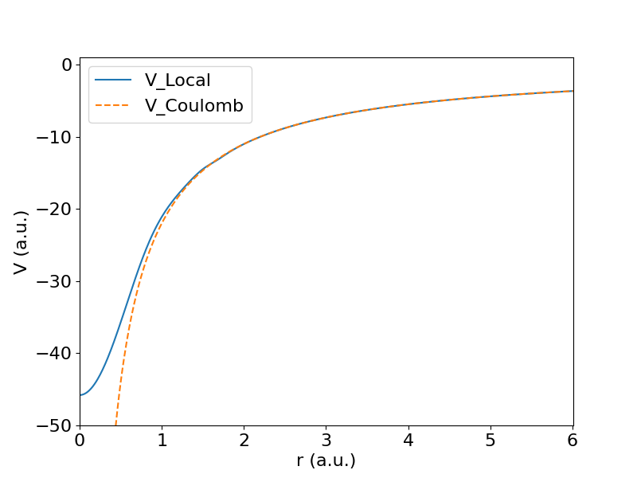
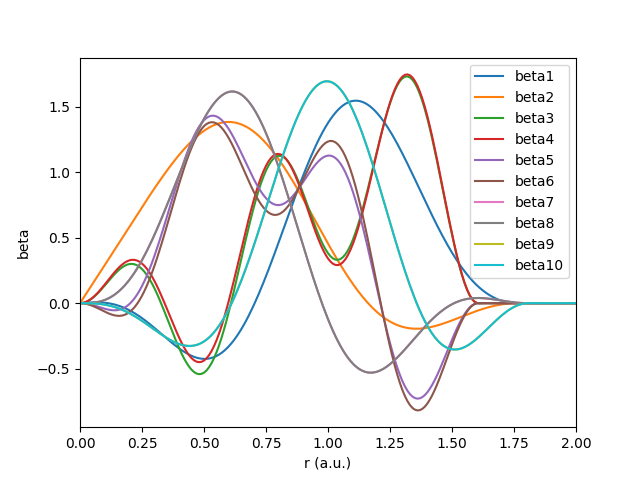

# Introduction to ABACUS: Path to PW calculation - Part 3

<strong>作者：黄一珂，邮箱：huangyk@aisi.ac.cn</strong>

<strong>审核：陈默涵，邮箱：mohanchen@pku.edu.cn</strong>

<strong>最后更新时间：2023/09/15</strong>

> 📃<strong>写在前面</strong>
>
> 1. 不脱离代码——避免读者看完手册后对代码没有一丁点概念
> 2. 不堆砌代码解释——避免平庸的代码解释，努力兼顾拉近读者和代码距离的同时，做到提纲挈领，不逐行复制代码后进行停留在代码语义上的解释

# Driver

## Driver::atomic_world()

### Driver::driver_run()

#### 多层继承：Init() functions in esolver class

##### Trigger: ESolver_FP::Init()

承接上篇中已经导入的结构信息，以及了解到构造函数及其伴随的变量初始化和 ABACUS 里应用到的 C++ 多态编程，接下来即将（逐渐）步入 ABACUS 的核心内容。我们暂时跳过位于 `source/driver_run.cpp:driver_run()` 的：

```cpp
// 3. For these two types of calculations
    // nothing else need to be initialized
    if(GlobalV::CALCULATION == "test_neighbour" || GlobalV::CALCULATION == "test_memory")
    {
        p_esolver->Run(0, GlobalC::ucell);
        ModuleBase::QUIT();
    }
```

直接来到第 44 行，`ModuleESolver::ESolver::Init()` 函数对 `esolver` 进行更多的设置：

```cpp
// driver_run.cpp: line 44
    p_esolver->Init(INPUT, GlobalC::ucell);
```

然而查找该函数的定义和声明时，发现该函数在 `module_esolver/esolver.h` 被声明为纯虚函数，类似的还有 `un()`, `cal_Energy()`, `cal_Force()`, `cal_Stress()` 等。

```cpp
namespace ModuleESolver
{
class ESolver
{
  public:
  ....
    virtual void Init(Input& inp, UnitCell& cell) = 0;
    virtual void Run(int istep, UnitCell& cell) = 0;
    virtual void cal_Force(ModuleBase::matrix& force) = 0;
    virtual void cal_Stress(ModuleBase::matrix& stress) = 0;
  ....
```

考虑到我们之前已经根据 `basis_type` 和 `esolver_type` 确定基类（`ESolver`）指针 `p_esolver` 所指向内存空间所存储变量为 `ESolver_KS_PW<double, psi::DEVICE_CPU>`，因此我们首先只关注该纯虚函数在 `esolver_ks_pw` 的实例化。

查看 `module_esolver/esolver_ks_pw.cpp` 中该函数的定义：

```cpp
namespace ModuleESolver
{
    ....
    template <typename FPTYPE, typename Device>
    void ESolver_KS_PW<FPTYPE, Device>::Init(Input& inp, UnitCell& ucell)
    {
        ESolver_KS<FPTYPE, Device>::Init(inp, ucell);
```

从上篇中可知，`ESolver_KS_PW` 有从 `ESolver_KS` 的继承，`ESolver_KS` 是从 `ESolver_FP`（FP 代表 First-Principles）的继承，`ESolver_FP` 是从 `ESolver` 的继承，因此 `ESolver` 各子类中 `Init()` 函数均保持结构统一，且第一行为父类的 `Init()` 函数：

`module_esolver/esolver_ks.cpp`：

```cpp
namespace ModuleESolver
{
    ....
    template<typename FPTYPE, typename Device>
    void ESolver_KS<FPTYPE, Device>::Init(Input& inp, UnitCell& ucell)
    {
        ESolver_FP::Init(inp,ucell);
```

`module_esolver/esolver_fp.cpp`：

```cpp
namespace ModuleESolver
{
    ....
    void ESolver_FP::Init(Input& inp, UnitCell& cell)
    {
        cell.read_pseudo(GlobalV::ofs_running);
```

同时由于多层的继承关系，`p_esolver` 现在具有所有的数据成员，`ESolver_FP` 具有数据成员：

```cpp
namespace ModuleESolver
{
    class ESolver_FP : public ESolver
    {
    public:
        ModulePW::PW_Basis* pw_rho;
        ModulePW::PW_Basis_Big* pw_big;

        elecstate::ElecState* pelec = nullptr;
        Charge chr;
        ModuleSymmetry::Symmetry symm;
        
        psi::Psi<std::complex<double>>* psi = nullptr;
        psi::Psi<double>* psid = nullptr;
        Structure_Factor sf;
        K_Vectors kv;
    };
}
```

同理，`ESolver_KS` 的数据成员，也被 `ESolver_KS_PW` 继承。`ESolver_FP::Init()` 首先调用 `UnitCell::read_pseudo()` 函数进行赝势文件读取，而将赝势文件读取任务放在 FP 层级下，也暗示对于 ABACUS 的第一性原理方法实现来讲，都需要使用赝势。

###### Pseudopotential import: UnitCell::read_pseudo()

```cpp
void UnitCell::read_pseudo(std::ofstream &ofs)
{
    read_cell_pseudopots(GlobalV::global_pseudo_dir, ofs);
```

在解读赝势文件读取功能之前，首先需要对赝势文件的结构和信息做一定程度的了解。

####### ONCV pseudopotential file

######## Section 0: Norm-conserving conditions, generation of pseudopotential and header of exact UPF file

赝势的意义不言自明，其中模守恒赝势需满足如下条件：

1. $$\epsilon^\text{ps}_l=\epsilon_l$$（赝势得到的能级和全电子方法求解的能级一样，这里 ps 代表 pseudopotentials）
2. $$\phi^\text{ps}_l(r)$$无节点（赝波函数没有结点，nodeless）
3. 在截断半径之外（$$r>r_c$$）有$$\phi^\text{ps}_l(r)=\phi_l(r)$$（赝波函数在截断半径之后一致）
4. $$\int_{r<r_c}|\phi^\text{ps}_l(r)|^2r^2dr=\int_{r<r_c}|\phi_l(r)|^2r^2dr$$（电子数守恒，即模守恒）

生成赝势的步骤如下：

1. $$-\frac{\hbar^2}{2m}\frac{d^2}{dr^2}\phi_{l}(r)+[\frac{\hbar^2}{2m}\frac{l(l+1)}{r^2}+V(r)]\phi_l(r)=\epsilon_l\phi_l(r)$$，解得($$\phi_l(r)$$-$$\epsilon_l$$) pair
2. 满足上述四个模守恒条件前提下生成($$\phi^\text{ps}_l(r)$$-$$\epsilon^\text{ps}_l$$) pair，使得$$-\frac{\hbar^2}{2m}\frac{d^2}{dr^2}\phi^\text{ps}_{l}(r)+[\frac{\hbar^2}{2m}\frac{l(l+1)}{r^2}+V(r)]\phi^\text{ps}_l(r)=\epsilon^\text{ps}_l\phi^\text{ps}_l(r)$$成立
3. $$V_l(r)=\frac{1}{\phi^\text{ps}_l(r)}[\epsilon^\text{ps}_l-\frac{\hbar^2}{2m}\frac{l(l+1)}{r^2}+\frac{\hbar^2}{2m}\frac{d^2}{dr^2}]\phi^\text{ps}_l(r)$$，解得$$V_l(r)$$。
4. 扣除$$V_l(r)$$中 Hartree、xc 部分，得到$$V^\text{ps}_l(r)$$：$$V^\text{ps}_l(r)=V_l(r)-V^\text{H}[\rho^\text{ps}(r)]-V^\text{xc}[\rho^\text{ps}(r)]$$。$$\rho^\text{ps}(r)=\frac{1}{4\pi}\sum_i^\text{occ}{f_{i}|\phi^\text{ps}_l(r)|^2}$$

更多细节见

```html
<UPF version="2.0.1">
    <PP_INFO>
        <!-- omitted information here -->
        <PP_INPUTFILE>
            <!-- omitted information here -->
        </PP_INPUTFILE>
    </PP_INFO>
    <!--                               -->
    <!-- END OF HUMAN READABLE SECTION -->
    <!--                               -->
```

从 UPF 文件（注意 UPF 文件也有不同的版本，目前 ABACUS 都支持，若有不支持的，可以提 Github 的 issues 进行讨论）开始，截止到 `<PP_HEADER>` 之前，提供了赝势文件的作者信息，引用信息以及生成赝势文件所使用的程序和相应输入文件，并附带输入文件参数中的解释。由于此块内容对实际计算并不起作用，因此暂时略过。

######## Section 1: <PP_HEADER>

```html
<PP_HEADER
      generated="Generated using ONCVPSP code by D. R. Hamann" author="Martin Schlipf and Francois Gygi"
      date="150105" comment=""
      element="Al"
      pseudo_type="NC"
      relativistic="scalar"
      is_ultrasoft="F"
      is_paw="F"
      is_coulomb="F"
      has_so="F"
      has_wfc="F"
      has_gipaw="F"
      core_correction="F"
      functional="PBE"
      z_valence="   11.00"
      total_psenergy="  -6.90690753360E+01"
      rho_cutoff="   6.01000000000E+00"
      l_max="1"
      l_local="-1"
      mesh_size="   602"
      number_of_wfc="0"
      number_of_proj="4"/>
```

`<PP_HEADER>` 部分尽管已经位于所谓“not human readable”区域，但也并非如此。这部分“标签”（HTML 语境）/block 实际上包含了众多精简过的信息，如元素名称（element）、赝势类型（pseudo_type，模守恒，norm-conserving，NC），相对论效应（relativistic），是否为超软赝势等等信息。当前 Al 理论上其原子序数 13，因此有 13 个电子，但此处 z_valence 参数为 11，即有两个 1s 电子被赝化，只留下 2s, 2p, 3s, 3p 电子共 2+6+2+1 个。对于某些元素，甚至有大核赝势与小核赝势之分，根据赝化电子数量不同进行区分。显而易见地，赝化电子数量越多，则计算量越小，但计算结果的精确程度可能更低。

######## Section 2: <PP_MESH>

```html
<PP_MESH>
        <PP_R type="real"  size=" 602" columns="8">
            0.0000    0.0100    0.0200    0.0300    0.0400    0.0500    0.0600    0.0700
            <!-- omitted information here -->
            5.9200    5.9300    5.9400    5.9500    5.9600    5.9700    5.9800    5.9900
            6.0000    6.0100
        </PP_R>
        <PP_RAB type="real"  size=" 602" columns="8">
            0.0100    0.0100    0.0100    0.0100    0.0100    0.0100    0.0100    0.0100
            <!-- omitted information here -->
            0.0100    0.0100    0.0100    0.0100    0.0100    0.0100    0.0100    0.0100
            0.0100    0.0100
        </PP_RAB>
    </PP_MESH>
```

这部分开始出现了关于实空间格点相关量的定义。在 tag 中不仅指定数据类型为实数，也指定当前数据的长度（size），以及数据存储的列数（columns = 8）。`PP_R` 为格点坐标，`PP_RAB` 则为格点间距。

######## Section 3: <PP_LOCAL>

```html
<PP_LOCAL type="real"  size=" 602" columns="4">
        -4.5793174225E+01   -4.5788454271E+01   -4.5774276797E+01   -4.5750659428E+01
        <!-- omitted information here -->
        -3.6912752197E+00   -3.6850921941E+00   -3.6789298138E+00   -3.6727880140E+00
        -3.6666666933E+00   -3.6605657501E+00
    </PP_LOCAL>
```

从 `<PP_LOCAL>` 部分开始，正式开始写入赝势的具体数值，建立在 `<PP_R>` 和 `<PP_RAB>` 所描述的实空间格点上。$$\hat{V}=\hat{V}^\text{loc}+\hat{V}^\text{NL}$$。`<PP_LOCAL>` 正是赝势的局域势部分。



######## Section 4: <PP_NONLOCAL>

```html
<PP_NONLOCAL>
        <PP_BETA.1
           type="real"
           size=" 602"
           columns="4"
           index="1"
           angular_momentum="0"
           cutoff_radius_index=" 246"
           cutoff_radius="    2.4500000000E+00" >
            0.0000000000E+00    8.1959788337E-02    1.6389680452E-01    2.4578292762E-01
            <!-- omitted information here -->
            -1.2623857798E-05    0.0000000000E+00    0.0000000000E+00    0.0000000000E+00
            <!-- omitted information here -->
            0.0000000000E+00    0.0000000000E+00    0.0000000000E+00    0.0000000000E+00
            0.0000000000E+00    0.0000000000E+00
        </PP_BETA.1>
        <PP_BETA.2 type="real" size=" 602" columns="4" index="2" angular_momentum="0"
           cutoff_radius_index=" 246" cutoff_radius="    2.4500000000E+00" >
           <!-- omitted information here -->
        </PP_BETA.2>
        <PP_BETA.3 type="real" size=" 602" columns="4" index="3" angular_momentum="1"<strong>
</strong>           cutoff_radius_index=" 246" cutoff_radius="    2.4500000000E+00" >
           <!-- omitted information here -->
        </PP_BETA.3>
        <PP_BETA.4 type="real" size=" 602" columns="4" index="4" angular_momentum="1"
           cutoff_radius_index=" 246" cutoff_radius="    2.4500000000E+00" >
        <!-- omitted information here -->
        </PP_BETA.4>
        <PP_DIJ type="real"  size="  16" columns="4">
            5.3707838603E+00    0.0000000000E+00    0.0000000000E+00    0.0000000000E+00
            0.0000000000E+00   -8.2930195943E-01    0.0000000000E+00    0.0000000000E+00
            0.0000000000E+00    0.0000000000E+00   -6.5836757852E+00    0.0000000000E+00
            0.0000000000E+00    0.0000000000E+00    0.0000000000E+00   -4.6797927123E+00
        </PP_DIJ>
    </PP_NONLOCAL>
```

完全非局域部分，$$\hat{V}^\text{NL}=\sum_{ij}{|\beta_i\rangle D_{ij}\langle\beta_j|}$$。其中$$|\beta_i\rangle$$一般被称为非局域势投影子（projector）。



######## Section 5: <PP_PSWFC> and <PP_RHOATOM>

```html
<PP_PSWFC>
    </PP_PSWFC>
    <PP_RHOATOM type="real" size=" 602" columns="4">
        0.0000000000E+00    3.6337392512E-03    1.4532726686E-02    3.2690254089E-02
        <!-- omitted information here -->
    </PP_RHOATOM>
</UPF>
```

`<PP_PSWFC>` 为赝波函数，`<PP_RHOATOM>` 则为赝电荷密度在实空间格点上的数据。一个简单的赝势文件信息提取脚本：

[ParseUpfWordByWord.py](https://gitee.com/mcresearch/abacus-user-guide/blob/master/examples/develop/ParseUpfWordByWord.py)

> 🤔 玩玩看！

Quantum ESPRESSO 官网上提供了更多关于 UPF 文件格式的信息：[Unified Pseudopotential Format - QUANTUMESPRESSO](https://pseudopotentials.quantum-espresso.org/home/unified-pseudopotential-format)

> ❗<strong>注意</strong>
> 读入的投影子 projector $$|\beta\rangle$$和 pswfc $$\tilde{\phi}(r)$$已经乘径向坐标$$r$$。

####### UnitCell::read_cell_pseudopots()

link to Github -> [link](https://github.com/abacusmodeling/abacus-develop/blob/develop/source/module_cell/read_cell_pseudopots.cpp)

```cpp
void UnitCell::read_cell_pseudopots(const std::string &pp_dir, std::ofstream &log)
{
    std::stringstream ss;
    ss << GlobalV::global_out_dir << "atom_pseudo.log";

    std::string pp_address;
    for (int i = 0;i < ntype;i++)
    {
        Pseudopot_upf upf;

        int error = 0;
        int error_ap = 0;
        
        if(GlobalV::MY_RANK==0)
        {
            pp_address = pp_dir + this->pseudo_fn[i];
            error = upf.init_pseudo_reader( pp_address, this->pseudo_type[i] );
```

赝势文件的读取 type-by-type，每次创建 `Pseudopot_upf` 类对象 `upf`，之后调用 `upf.init_pseudo_reader()` 对文件进行读取，需要指定文件的地址（`pp_address`）和赝势类型（`UnitCell::pseudo_type[i]`）。`Pseudopot_upf::init_pseudo_reader()` 为每种赝势文件进行判断，之后进行不同的解析。为方便起见，这里我们只关注 ABACUS 的常用赝势类型，即模守恒 upf。跟随“转到定义”，来到 `module_cell/read_pp.cpp` 文件（[link](https://github.com/abacusmodeling/abacus-develop/blob/develop/source/module_cell/read_pp.cpp)）：

```cpp
int Pseudopot_upf::init_pseudo_reader(const std::string &fn, std::string &type)
{
    std::ifstream ifs(fn.c_str(), std::ios::in);

    if (type == "auto")
    {
        set_pseudo_type(fn, type);
    }
    if (type == "upf")
    {
        int info = read_pseudo_upf(ifs);
        return info;
    }
    else if (type == "vwr")
    {
        int info = read_pseudo_vwr(ifs);
        return info;
    }
    else if (type == "upf201")
    {
        int info = read_pseudo_upf201(ifs);
        return info;
    }
    else if (type == "blps")
    {
        int info = read_pseudo_blps(ifs);
        return info;
    }
    return 0;
}
```

选择 `read_pseudo_upf()` 函数，跳转到位于 `module_cell/read_pp_upf100.cpp` 的该函数定义。`read_pseudo_upf()` 函数分标签读取 upf 格式赝势文件中信息，每个标签都有单独的解析器：

<PP_HEADER>

```cpp
while (ifs.good())
    {
        ifs >> dummy;
        if(dummy=="<PP_HEADER>")
        {
            ierr = 1;
            read_pseudo_header(ifs);
            ModuleBase::GlobalFunc::SCAN_END(ifs, "</PP_HEADER>");
            break;
        }
    }
```

<PP_MESH>

```cpp
if ( ModuleBase::GlobalFunc::SCAN_BEGIN(ifs, "<PP_MESH>") )
    {
        read_pseudo_mesh(ifs);
        ModuleBase::GlobalFunc::SCAN_END(ifs, "</PP_MESH>");
    }
```

<PP_NLCC>

```cpp
if (this->nlcc)
    {
        ModuleBase::GlobalFunc::SCAN_BEGIN(ifs, "<PP_NLCC>"); 
        read_pseudo_nlcc(ifs);
        ModuleBase::GlobalFunc::SCAN_END(ifs, "</PP_NLCC>");
    }
```

<PP_LOCAL>

```cpp
ModuleBase::GlobalFunc::SCAN_BEGIN(ifs, "<PP_LOCAL>");
    read_pseudo_local(ifs);
    ModuleBase::GlobalFunc::SCAN_END(ifs, "</PP_LOCAL>");
```

与 <PP_LOCAL> 类似的还有 <PP_NONLOCAL>, <PP_PSWFC>, <PP_RHOATOM>, 从 <PP_ADDINFO> 则可以读取旋轨耦合相关信息：

```cpp
if (has_so)
    {
        ModuleBase::GlobalFunc::SCAN_BEGIN (ifs,"<PP_ADDINFO>");
        read_pseudo_so (ifs);
        ModuleBase::GlobalFunc::SCAN_END (ifs,"</PP_ADDINFO>");
    }
```

每个具体 tag 的解析函数 `Pseudopot_upf::read_pseudo_xxx()` 均赋值于数据成员，声明在 `module_cell/read_pp.h` 中（[link](https://github.com/abacusmodeling/abacus-develop/blob/develop/source/module_cell/read_pp.h)）。

| <strong>Functions in Pseudopot_upf class</strong> | <strong>Variables value assgined</strong>                                                                                                                                                             | <strong>explain</strong>                                                                                                                                                                                                                                                                                                                                                                                                        |  |
| ------------------------------------------------- | ----------------------------------------------------------------------------------------------------------------------------------------------------------------------------------------------------- | ------------------------------------------------------------------------------------------------------------------------------------------------------------------------------------------------------------------------------------------------------------------------------------------------------------------------------------------------------------------------------------------------------------------------------- | - |
| `void read_pseudo_header(std::ifstream &ifs);`    | `this->nv``this->psd``this->tvanp``this->nlcc``this->xc_func``this->zp``this->etotps``this->ecutwfc``this->ecutrho``this->lmax``this->mesh``this->nwfc``this->nbeta``this->els``this->lchi``this->oc` | Version numberElement labelIf ultrasoft pseudopotentialIf noncolinear correction addedXc functionalAtomic chargesTotal energySuggested energy cutoff for wavefunctionSuggested energy cutoff for charge densityMaximal angular momentum includedNumber of points in radial meshNumber of wavefunctionsNumber of projectorsDim `nwfc`, labels of orbitalDim `nwfc`, angular momentum of orbitalDim `nwfc`, occupation of orbital |  |
| `void read_pseudo_mesh(std::ifstream &ifs);`      | `this->r``this->rab`                                                                                                                                                                                  | Dim `this->mesh`, realspace mesh of radiusDim `this->mesh`,                                                                                                                                                                                                                                                                                                                                                                     |  |
| `void read_pseudo_nlcc(std::ifstream &ifs);`      | `this->rho_atc`                                                                                                                                                                                       | Dim `this->mesh`,                                                                                                                                                                                                                                                                                                                                                                                                               |  |
| `void read_pseudo_local(std::ifstream &ifs);`     | `this->vloc`                                                                                                                                                                                          | Dim `this->mesh`, Vlocal                                                                                                                                                                                                                                                                                                                                                                                                        |  |
| `void read_pseudo_nl(std::ifstream &ifs);`        | `this->kkbeta`              `this->lll`               `this->beta``this->dion``this->nd`                                                                                                              | Dim `this->nbeta`, number of mesh points of projectors.Dim `this->nbeta`, angular momentum for projectors.Dim `this->nbeta`*`this->mesh`.Dim `this->nbeta`*`this->nbeta`.Number of nonzero $$D_{ij}$$                                                                                                                                                                                                                               |  |
| `void read_pseudo_pswfc(std::ifstream &ifs);`     | `this->chi`                                                                                                                                                                                           | Dim `this->nwfc`*`this->mesh`,                                                                                                                                                                                                                                                                                                                                                                                                  |  |
| `void read_pseudo_rhoatom(std::ifstream &ifs);`   | `this->rho_at`                                                                                                                                                                                        | Dim `this->mesh`, atomic electron density on realspace mesh                                                                                                                                                                                                                                                                                                                                                                     |  |
| `void read_pseudo_addinfo(std::ifstream &ifs);`   | <em>Not implemented</em>                                                                                                                                                                              | <em>Not implemented</em>                                                                                                                                                                                                                                                                                                                                                                                                        |  |
| `void read_pseudo_so(std::ifstream &ifs);`        | `this->nn `              `this->jchi``this->jjj`                                                                                                                                                      | Dim `this->nwfc`, quantum number of wavefunctionDim `this->nwfc`, $$j=l+s$$, where $$s=\pm\frac{1}{2}$$.Dim `this->nbeta`, $$j=l+s$$, where $$s=\pm\frac{1}{2}$$, for projector.                                                                                                                                                                                                                                                                |  |

我们假设 ONCV.upf 格式赝势文件顺利读取完毕，`upf.init_pseudo_reader()` 返回 0（`error == 0`），来到条件判断：

```cpp
if(error==0)
            {
                if(this->atoms[i].flag_empty_element) upf.set_empty_element();            
                error_ap = upf.average_p(GlobalV::soc_lambda);
            }
```

`Pseudopot_upf::set_empty_element()` 的作用为设置 `Vloc`、`dion` 和 `rho_at` 均为 0，`Pseudopot_upf::average_p()` 则属于自旋轨道耦合（spin-orbital coupling）功能，这里先不介绍。

我们来到 line 82,

```cpp
if(GlobalV::MY_RANK==0)
                {
                        atoms[i].ncpp.set_pseudo_nc( upf );
....
                }
```

实际上 ABACUS 目前只能处理模守恒的赝势类型。显然该行实现的为<strong>将赝势信息从upf到atoms[i].ncpp的拷贝</strong>，而 upf 的意义也不言自明：UPF file parser。解析 UPF 文件后传值给 `atoms[i].ncpp`

```cpp
void pseudo_nc::set_pseudo_nc(const Pseudopot_upf &upf)
{
        this->set_pseudo_h(upf);
        this->set_pseudo_atom(upf);
        this->set_pseudo_vl(upf);

        delete[] lll; lll = new int[nbeta];

        for (int i = 0;i < nbeta;i++) lll[i] = upf.lll[i];
        nh = 0;
        for (int nb = 0; nb < nbeta;nb++) nh += 2 * lll [nb] + 1;

        this->kkbeta = 0;
        for (int nb = 0;nb < nbeta;nb++)
        {
                this->kkbeta = (upf.kkbeta[nb] > kkbeta) ? upf.kkbeta[nb] : kkbeta;
        }

        this->betar.create(upf.beta.nr, upf.beta.nc); this->betar = upf.beta;
        this->dion.create(nbeta, nbeta); this->dion = upf.dion;
}
```

该函数属于类 `pseudo_nc`，而 `pseudo_nc` 对象为 `atom` 的数据成员，`atoms` 则为 `UnitCell` 的数据成员。`pseudo_nc::set_pseudo_h()`，`pseudo_nc::set_pseudo_atom` 和 `pseudo_nc::set_pseudo_vl` 的内容在此省略，但其分别为将 Hamilton, 原子性质和 Vlocal 相关数据从 upf 对象拷贝。之后(1)使用 `lll` 刷新为 upf 对象的 projectors 的角动量，然后计算出磁角动量区分时的 projector 个数。(2)取所有 projector 衰减到 0 时候的最大最普适半径。

####### 赝势信息后处理

回到 `module_cell/unitcell.cpp` line 663，接下来为每个原子创建目录，在目录中写 `[原子label].NONLOCAL` 文件。`[label].NONLOCAL` 文件中内容包含 `<HEADER>`, `<DIJ>` 和 `<PP_BETA>` 三个 tag。

`<HEADER>` 中包含内容：

```cpp
ofs << "<HEADER>" << std::endl;
            ofs << std::setw(10) << atom->label << "\t" << "label" << std::endl;
            ofs << std::setw(10) << atom->ncpp.pp_type << "\t" << "pseudopotential type" << std::endl;
            ofs << std::setw(10) << atom->ncpp.lmax << "\t" << "lmax" << std::endl;
            ofs << "</HEADER>" << std::endl;
```

`<DIJ>` 中包含内容为 projector 数量 `atom->ncpp.nbeta`、对应于每个原子的 projector 的角动量为指标的 `dion` 矩阵：

```cpp
ofs << "\n<DIJ>" << std::endl;
            ofs << std::setw(10) << atom->ncpp.nbeta << "\t" << "nummber of projectors." << std::endl;
            for(int ib=0; ib<atom->ncpp.nbeta; ib++)
            {
                for(int ib2=0; ib2<atom->ncpp.nbeta; ib2++)
                {
                    ofs << std::setw(10) << atom->ncpp.lll[ib] 
                        << " " << atom->ncpp.lll[ib2]
                        << " " << atom->ncpp.dion(ib,ib2)<<std::endl;
                }
            }
            ofs << "</DIJ>" << std::endl;
```

`<PP_BETA>` 中包含内容为 projector 仅其值大于 1.0e-10 的值。首先仍然输出当前原子的 projector 索引，以及角动量，然后截断 projector:

```cpp
int cut_mesh = atom->ncpp.mesh; 
                for(int j=atom->ncpp.mesh-1; j>=0; --j)
                {
                    if( std::abs( atom->ncpp.betar(i,j) ) > 1.0e-10 )
                    {
                        cut_mesh = j; 
                        break;
                    }
                }
                if(cut_mesh %2 == 0) ++cut_mesh;
```

之后按照截断后的网格重新存储 projector 的 `realspace grid`, `projector value`, `rab` 数据，分三列分别存储：

```cpp
for(int j=0; j<cut_mesh; ++j)
                {
                    ofs << std::setw(15) << atom->ncpp.r[j]
                        << std::setw(15) << atom->ncpp.betar(i, j)
                        << std::setw(15) << atom->ncpp.rab[j] << std::endl;
                }
                ofs << "</PP_BETA>" << std::endl;
```

####### 赝势信息分发：UnitCell::bcast_unitcell2(void)

`#ifdef __MPI`

`#endif`

####### 赝势信息核对

接下来跨原子种类检验泛函是否一致：

```cpp
for(int it=0; it<ntype; it++)
    {
        if(atoms[0].ncpp.xc_func !=atoms[it].ncpp.xc_func)
        {
```

####### STRU 结构检查：UnitCell::check_structure()

检验结构中任意两原子之间距离是否大于其固定倍数（<1）的共价半径和，

```cpp
check_structure(GlobalV::MIN_DIST_COEF);
```

####### 计算轨道数：UnitCell::cal_natomwfc()

`UnitCell::cal_natomwfc()` 函数计算所有种类的原子轨道数量加和，对于非 `nspin=4`，即非 soc（自旋轨道耦合）情况，角量子数 l 和 s 非耦合，l 单独可以作为好的量子数来区分量子态，因此对于每个赝势中定义的 wfc，若其对应 occupation 大于等于 0（即有效 wfc），则对应于其角量子数 l，轨道数量增加 2l+1，即计数其磁量子数 m，也相当于对 alpha 和 beta spin 的单独计数。对于 `nspin=4` 的情况，若考虑 soc，则轨道数对 j=l+s 的情况，当前原子种类当前角量子数对应轨道数量记为 2l+1+1，否则为 2l+1。对于非 soc 但 `nspin=4`，当前原子种类轨道当前角量子数对应轨道数量记(2l+1)*2：

```cpp
void UnitCell::cal_natomwfc(std::ofstream &log)
{
        this->natomwfc = 0;
        for (int it = 0;it < ntype;it++)
        {
                int tmp=0;
                for (int l = 0;l < atoms[it].ncpp.nchi;l++)
                {
                        if (atoms[it].ncpp.oc[l] >= 0)
                        {
                                if(GlobalV::NSPIN==4)
                                {
                                        if(atoms[it].ncpp.has_so)
                                        {
                                                tmp += 2 * atoms[it].ncpp.lchi[l];
                                                if(fabs(atoms[it].ncpp.jchi[l] - atoms[it].ncpp.lchi[l] - 0.5) < 1e-6) tmp += 2 ;
                                        }
                                        else tmp += 2 * (2 * atoms[it].ncpp.lchi[l] + 1);
                                }
                                else tmp += 2 * atoms[it].ncpp.lchi[l] + 1;
                        }
                }
                natomwfc += tmp * atoms[it].na;
        }
}
```

接下来调用 `UnitCell::cal_nwfc()` 函数，计算并赋值

1. 波函数 index 到角动量，zeta 和磁量子数的表格，
2. 跨原子种类的最大原子数，以及最大 wfc 数量，
3. 轨道数量和：

```cpp
GlobalV::NLOCAL = 0;
        for(int it=0; it<ntype; it++)
        {
                atoms[it].stapos_wf = GlobalV::NLOCAL;
                const int nlocal_it = atoms[it].nw * atoms[it].na;
                if(GlobalV::NSPIN!=4) 
                {
                        GlobalV::NLOCAL += nlocal_it;
                }
                else 
                {
                        GlobalV::NLOCAL += nlocal_it * 2;//zhengdy-soc
                }

        }
```

1. 建立 `UnitCell::itia2iat`（种类 index，种类内原子 index）->（原子全局 index）映射表、`UnitCell::iat2iwt`（原子全局 index）->（波函数全局 index）映射表、`UnitCell::iwt2iw`（波函数全局 index）->（波函数种类内 index）映射表、`UnitCell::iwt2iat`（波函数全局 index）->（原子全局 index）映射表、`UnitCell::iwt2iw`（波函数全局 index）->（波函数种类内 index）映射表。
2. 计算跨原子种类最大角量子数 UnitCell::lmax 和某 l 对应最大 zeta 数 `UnitCell::nmax`，以及跨原子种类的类内 zeta 数总和最大值 UnitCell::nmax_total
3. 寻找赝势中最大角量子数 `UnitCell::lmax_ppwf`。

####### 价电子数核对

核对赝势中定义的价电子数与 ABACUS 预置库中原子的最小价电子数

####### 获取最大格点数量：UnitCell::cal_meshx()

计算跨原子种类的最大格点数量，存储在 `UnitCell::meshx` 中，目前 ABACUS 代码中变量命名后缀 x 可能代表 max，正如之前看到 `npwx` 等。

至此，我们离开函数 `UnitCell::read_pseudo()`，回到 `ModuleESolver::ESolver_FP::Init()` 函数。

> 📃<strong>和 Quantum Espresso 对齐的赝势参数</strong>
> 读入 UPF 格式的模守恒赝势之后，如果要和 QE 的结果做 apple-to-apple 的比较，使得总能量受力等性质计算一致，可以把基矢量调成平面波(`basis_type` 设成 pw)，然后在 `INPUT` 文件中，把 `pseudo_rcut` 设成 10（默认是 15），`pseudo_mesh` 设成 1 即可（默认是 0）。

# 系列链接

上篇：[Introduction to ABACUS: Path to PW calculation - Part 2](develop-path2.md)

下篇：[Introduction to ABACUS: Path to PW calculation - Part 4](develop-path4.md)