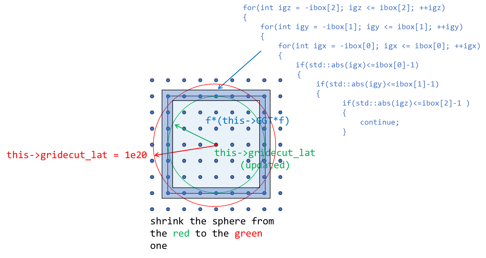
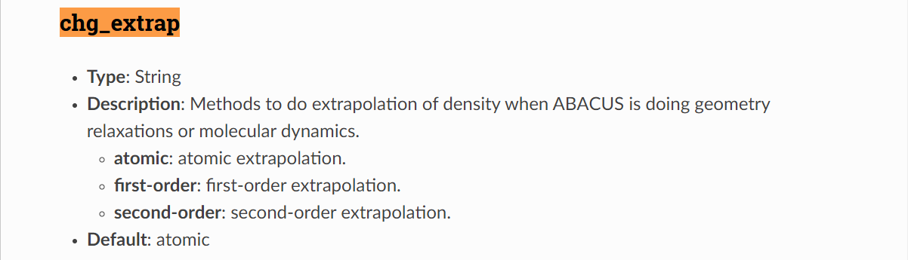

# Introduction to ABACUS: Path to PW calculation - Part 6

<strong>作者：黄一珂，邮箱：huangyk@aisi.ac.cn</strong>

<strong>审核：陈默涵，邮箱：mohanchen@pku.edu.cn</strong>

> 📃<strong>写在前面</strong>
>
> 1. 不脱离代码——避免读者看完手册后对代码没有一丁点概念
> 2. 不堆砌代码解释——避免平庸的代码解释，努力兼顾拉近读者和代码距离的同时，做到提纲挈领，不逐行复制代码后进行停留在代码语义上的解释

# Driver

## Driver::atomic_world()

### Driver::driver_run()

#### 多层继承：Init() functions in esolver class

我们来到 `ModuleESolver::ESolver_KS::Init()`，在 `source/module_esolver/esolver_ks.cpp: line105`（[link](https://github.com/abacusmodeling/abacus-develop/blob/develop/source/module_esolver/esolver_ks.cpp#L105)）：

```cpp
template<typename FPTYPE, typename Device>
    void ESolver_KS<FPTYPE, Device>::Init(Input& inp, UnitCell& ucell)
    {
    ....
        if(GlobalV::BASIS_TYPE=="pw" || GlobalV::CALCULATION=="get_wf")
        {
            //Envelope function is calculated as lcao_in_pw
            //new plane wave basis
    #ifdef __MPI
            this->pw_wfc->initmpi(GlobalV::NPROC_IN_POOL, GlobalV::RANK_IN_POOL, POOL_WORLD);
    #endif
            this->pw_wfc->initgrids(inp.ref_cell_factor * ucell.lat0,
                                    ucell.latvec,
                                    this->pw_rho->nx,
                                    this->pw_rho->ny,
                                    this->pw_rho->nz);
            this->pw_wfc->initparameters(false, inp.ecutwfc, this->kv.nks, this->kv.kvec_d.data());
#ifdef __MPI
            if(INPUT.pw_seed > 0) MPI_Allreduce(MPI_IN_PLACE, &this->pw_wfc->ggecut, 1, MPI_DOUBLE, MPI_MAX , MPI_COMM_WORLD);
            //qianrui add 2021-8-13 to make different kpar parameters can get the same results
    #endif
            this->pw_wfc->setuptransform();
            for (int ik = 0; ik < this->kv.nks; ++ik)
            this->kv.ngk[ik] = this->pw_wfc->npwk[ik];
            this->pw_wfc->collect_local_pw(); 
            this->print_wfcfft(inp, GlobalV::ofs_running);
        }
```

##### PW_Basis_k::initgrids()

⚠ 注意，在 `ESolver_KS` 的构造函数中有

```cpp
namespace ModuleESolver
{

    template<typename FPTYPE, typename Device>
    ESolver_KS<FPTYPE, Device>::ESolver_KS()
    {
        ....
        pw_wfc = new ModulePW::PW_Basis_K_Big(GlobalV::device_flag, GlobalV::precision_flag);
        ModulePW::PW_Basis_K_Big* tmp = static_cast<ModulePW::PW_Basis_K_Big*>(pw_wfc);
```

因此对 `pw_wfc` 中成员函数的调用，和 `pw_rho` 类似地，此处会调用到其派生类 `PW_Basis_K_Big` 的对象 `tmp` 的成员函数。另一方面在 [Introduction to ABACUS: Path to PW calculation - Part 4](https://ucoyxk075n.feishu.cn/docx/R2b5dB0jKoMLwGxJERDcYpfanUb)，我们对 `PW_Basis_Big::initgrids()` 在形参表中不包含 `nx`, `ny` 和 `nz` 的重载情况进行了介绍。当时使用 `ecutrho`，生成了 `nx`, `ny`, `nz`，`bx`，`by`，`bz` 及其组合，以及倒空间 `fftnx`, `fftny` 和 `fftnz`，然后分别将格点进行了实空间和倒空间的分发，为切片和“棍子”为分配基本单元，在 processors 间进行分发。

此处继续沿用依靠 `Input::ecutrho` 生成的 `nx`, `ny` 和 `nz`，调用包含 `nx`, `ny` 和 `nz` 在形参表中的 `PW_Basis_K::initgrids()` 函数（和 `PW_Basis_Big` 类不同，`PW_Basis_K_Big` 类并未重载 `initgrids()`）,

```cpp
template<typename FPTYPE, typename Device>
    void ESolver_KS<FPTYPE, Device>::Init(Input& inp, UnitCell& ucell)
    {
    ....
            this->pw_wfc->initgrids(inp.ref_cell_factor * ucell.lat0,
                                    ucell.latvec,
                                    this->pw_rho->nx,
                                    this->pw_rho->ny,
                                    this->pw_rho->nz);
    ....
```

以寻找适配于当前（格点数量增多后）`nx`, `ny` 和 `nz` 的新的 ecutwfc 球半径（`PW_Basis_K::gridecut_lat`）。

> 🤔<strong>思考时间</strong>
> 这样做的结果是什么？让 ecutwfc 等于 ecutrho 的操作正确吗？



`nx`, `ny` 和 `nz` 实空间格点数量增多的原因？→ 回顾 `nx`, `ny` 和 `nz` 的生成方式：在给定 ecutwfc 球半径后（通过 `ecutrho`），在可以分辨每个倒空间中点的情况下所确定出的最小格点数量。之后在给定的 ecutwfc 球中分别寻找可能达到的最大的 `x`/`y`/`z` 格点数，作为 `nx`, `ny` 和 `nz`，然后进行(2, 3, 5)-factorization，此处从

$$\Delta l_i=\frac{\sqrt{\text{ecut}}}{n_i^\text{min}}\le|\mathbf{b}_i|$$→$$n_i^\text{min}\ge\frac{\sqrt{\text{ecut}}}{|\mathbf{b}_i|}$$→$$n_i$$↑, $$\Delta l_i$$↓

关系出发正向搜索，会使得 `nx`, `ny` 和 `nz` 增大。

```cpp
void PW_Basis::initgrids(
    const double lat0_in,
    const ModuleBase::Matrix3 latvec_in, // Unitcell lattice vectors
    const int nx_in, int ny_in, int nz_in
)
{
    this->lat0 = lat0_in;
    
    this->tpiba = ModuleBase::TWO_PI / this->lat0;
    this->tpiba2 = this->tpiba*this->tpiba;
    
    this->latvec = latvec_in;
    this->omega = std::abs(latvec.Det()) * lat0 * lat0 * lat0;
    
    this->GT = latvec.Inverse(); this->G  = GT.Transpose(); 
    
    this->nx = nx_in; this->ny = ny_in; this->nz = nz_in;
    this->nxy = this->nx * this->ny;
    this->nxyz = this->nxy * this->nz;

    int *ibox = new int[3];
    ibox[0] = int((this->nx-1)/2)+1; ibox[1] = int((this->ny-1)/2)+1; ibox[2] = int((this->nz-1)/2)+1;
    this->gridecut_lat = 1e20;
    int count = 0;
    for(int igz = -ibox[2]; igz <= ibox[2]; ++igz)
    {
        for(int igy = -ibox[1]; igy <= ibox[1]; ++igy)
        {
            for(int igx = -ibox[0]; igx <= ibox[0]; ++igx)
            {
                ++count;
                if(count%this->poolnproc != this->poolrank) continue; /* distribute this task over all processors */
                if(std::abs(igx)<=ibox[0]-1 && std::abs(igy)<=ibox[1]-1 && std::abs(igz)<=ibox[2]-1 ) continue; /* skip the interior points */
                ModuleBase::Vector3<double> f;
                f.x = igx; f.y = igy; f.z = igz;
                double modulus = f * (this->GGT * f);
                /* if the surface vector has norm shorter than radius of present Bloch sphere, shrink the sphere */
                if(modulus < this->gridecut_lat)
                {
                    this->gridecut_lat = modulus;
                }
            }
        }
    }
#ifdef __MPI
    MPI_Allreduce(MPI_IN_PLACE, &this->gridecut_lat, 1, MPI_DOUBLE, MPI_MIN , this->pool_world);
#endif
    this->gridecut_lat -= 1e-6;

    delete[] ibox;
    return;
}
```

注意，在第 32 行，对该任务进行了分发，使用 MPI 函数 `MPI_Allreduce()` 以 `MPI_MIN` 对不同 processor 进行归并，得到其中最小的 `this->gridecut_lat`，之后共享给所有 processors。

##### PW_Basis_K::initparameters()

之后使用 `PW_Basis_K::initparameters()` 函数读取经过 k 点生成、归并、分发后读取的 `kvec_c` 与 `kvec_d`、`nks` 等参数。这三个两存储在 `ESolver_FP` 对象的 `K_Vectors kv` 数据成员中：

```cpp
template<typename FPTYPE, typename Device>
    void ESolver_KS<FPTYPE, Device>::Init(Input& inp, UnitCell& ucell)
    {
    ....
        if(GlobalV::BASIS_TYPE=="pw" || GlobalV::CALCULATION=="get_wf")
        {
            ....
            this->pw_wfc->initparameters(false, inp.ecutwfc, this->kv.nks, this->kv.kvec_d.data());
....
```

使得 `pw_wfc` 以下数值更新（initparameters()函数链接->[link](https://github.com/deepmodeling/abacus-develop/blob/develop/source/module_basis/module_pw/pw_basis_k.cpp#L52)）：

| 属于 PW_Basis_k pw_wfc 的成员变量                                             | 取值                                                                                       | 意义                           |
| ----------------------------------------------------------------------------- | ------------------------------------------------------------------------------------------ | ------------------------------ |
| `this->nks`                                                                   | `ESolver_FP::K_Vectors::nks`                                                               | 当前 processor 所分得 k 点数量 |
| `this->kvec_c`                                                                | `ESolver_FP::K_Vectors::kvec_c`                                                            | 采样的 k 点的 Cartesian 坐标   |
| `this->kvec_d`                                                                | `ESolver_FP::K_Vectors::kvec_d`                                                            | 采样的 k 点的 Direct 坐标      |
| `this->gk_ecut`                                                               | $$(\sqrt{\text{this->ggecut}}-                                                             | \mathbf{k}                     |
| `this->ggecut`                                                                | $$\min(\text{Input::ecutrho},(\sqrt{\text{Input::ecutwfc}}+                                | \mathbf{k}                     |
| `this->gamma_only`                                                            | `false`                                                                                    | 仅 gamma 点                    |
| `this->xprime`                                                                | `true`                                                                                     | 是否 x 优先 FFT 变换           |
| `this->fftnx`, `this->fftny`, `this->fftnz`, `this->fftnxy`, `this->fftnxyz`, | `this->nx`, `this->ny`, `this->nz`, `this->fftnx*this->fftny`, `this->fftnz*this->fftnxy`, | 倒空间格点数量                 |
| `this->distribution_type`                                                     | `1`                                                                                        | 倒空间格点分发方式，默认 `1`    |
| `this->d_kvec_c`                                                              | `ESolver_FP::K_Vectors::kvec_d.data()`                                                     | `kvec_c` 的指针                 |

（for words in red）因此在 ABACUS 当前的实现中，只取更大的 `ecutwfc` 并不会带来波函数精度的提升，因为 `ggecut` 同时还受到 `ecutrho` 的限制：在所有采样的 k 点$$\mathbf{k}$$中，不允许存在用于展开波函数的某平面波基其$$|\mathbf{G+k}|$$超过电荷密度中用于展开的平面波的$$|\mathbf{G}|$$。

之后跨 processors 对 `this->ggecut` 进行归并，所有 processors 均取跨 processors 中 `this->ggecut` 最高的那个值。

```cpp
#ifdef __MPI
            if(INPUT.pw_seed > 0)    MPI_Allreduce(MPI_IN_PLACE, &this->pw_wfc->ggecut, 1, MPI_DOUBLE, MPI_MAX , MPI_COMM_WORLD);
            //qianrui add 2021-8-13 to make different kpar parameters can get the same results
#endif
```

##### 格点分发

###### pw_wfc 和 pw_rho 格点分发的相同与不同：PW_Basis_K::setuptransform()

和 `PW_Basis::setuptransform()` 完全相同，或说 `ESolver_KS::pw_wfc` 和 `ESolver_FP::pw_rho` 完全相同地，此处按照实空间进行格点分发，以及平面波所对应的倒空间进行倒空间格点分发。仍然实际调用其派生类 `*_Big::distrbute_r()`，但 `PW_Basis_K_Big` 没有重载 `initgrids()` 函数。可以预见，如果 `ecutwfc` 取得足够大，则实际上波函数的倒空间分发和电荷密度的完全相同。另外和 `ESolver_FP::pw_rho` 所不同的是 `PW_Basis_K::setuptransform()` 多出来一个 `PW_Basis_K::setupIndGk()` 函数：

```cpp
void PW_Basis::setuptransform()
{
    ModuleBase::timer::tick(this->classname, "setuptransform");
    this->distribute_r();
    this->distribute_g();
    this->getstartgr();
    
    this->ft.clear();
    if(this->xprime)    this->ft.initfft(this->nx,this->ny,this->nz,this->lix,this->rix,this->nst,this->nplane,this->poolnproc,this->gamma_only, this->xprime);
    else                this->ft.initfft(this->nx,this->ny,this->nz,this->liy,this->riy,this->nst,this->nplane,this->poolnproc,this->gamma_only, this->xprime);
    this->ft.setupFFT();
    ModuleBase::timer::tick(this->classname, "setuptransform");
}
```

```cpp
void PW_Basis_K::setuptransform()
{
    ModuleBase::timer::tick(this->classname, "setuptransform");
    this->distribute_r();
    this->distribute_g();
    this->getstartgr();
    this->setupIndGk();
    this->ft.clear();
    if(this->xprime)    this->ft.initfft(this->nx,this->ny,this->nz,this->lix,this->rix,this->nst,this->nplane,this->poolnproc,this->gamma_only, this->xprime);
    else                this->ft.initfft(this->nx,this->ny,this->nz,this->liy,this->riy,this->nst,this->nplane,this->poolnproc,this->gamma_only, this->xprime);
    this->ft.setupFFT();
    ModuleBase::timer::tick(this->classname, "setuptransform");
}
```

###### PW_Basis_K::setupIndGk()

`PW_Basis_K::setupIndGk()` 函数首先计算每个 k 点具有的平面波数量（因为有些 k 点的 k 向量加上平面波向量 G 之后可能会超出截断半径，因此不同 k 点的平面波数量可能会有小的差别），之后赋值给 `this->npwk`（实际上 `this->npwk` 是一维数组，具有 `this->nks` 的长度，而 `this->nks` 实际上是分发后 k 点数量，即实际上可能每个 processor 被分配到不止一个 k 点），并且在扫描当前 processor 所有的平面波时，同时计算跨 k 点的当前 processor 具有最大平面波数量，存储在 `this->npwk_max` 中。

在扫描平面波过程中所调用的 `PW_Basis_K::cal_GplusK_cartesian()` 函数则不外乎之前提到的实现在（ip, is, iz）到（x, y, z）之间的映射关系，此处反而是更加简单的情况：从 processor 所分配的某个平面波 ig，映射到其模长，实现如下：

```cpp
ModuleBase::Vector3<double> PW_Basis_K:: cal_GplusK_cartesian(const int ik, const int ig) const {
    int isz = this->ig2isz[ig];
    int iz = isz % this->nz;
    int is = isz / this->nz;
    int ix = this->is2fftixy[is] / this->fftny;
    int iy = this->is2fftixy[is] % this->fftny;
    if (ix >= int(this->nx/2) + 1) ix -= this->nx;
    if (iy >= int(this->ny/2) + 1) iy -= this->ny;
    if (iz >= int(this->nz/2) + 1) iz -= this->nz;
    ModuleBase::Vector3<double> f;
    f.x = ix;
    f.y = iy;
    f.z = iz;
    f = f * this->G;
    ModuleBase::Vector3<double> g_temp_ = this->kvec_c[ik] + f;
    return g_temp_;
}
```

上述代码中 `f=f*this->G` 操作实现了平面波的坐标从 Direct 到 Cartesian 的转换。即 `PW_Basis_K::cal_GplusK_cartesian()` 函数实现从第 `ik` 个 k 点，第 `ig` 个平面波到其向量和的计算。当 `ecutwfc` 给定较小时，取平面波其对应倒空间矢量模长小于等于 `ecutwfc` 所对应矢量（但按照 `ggecut` 进行平面波的分发）：

> 🤔<strong>思考时间</strong>
> 如果 `ecutwfc != ggecut` 会怎样？是否会有内存空间的浪费？

平面波“棍子”分发时的能量比较：

```cpp
void PW_Basis::count_pw_st(
        int* st_length2D, // the number of planewaves that belong to the stick located on (x, y).
        int* st_bottom2D  // the z-coordinate of the bottom of stick on (x, y).
)
{
....
            int length = 0; // number of planewave on stick (x, y).
            for (int iz = iz_start; iz <= iz_end; ++iz)
            {
                f.x = ix;
                f.y = iy;
                f.z = iz;
                double modulus = f * (this->GGT * f);
                if (modulus <= this->ggecut || this->full_pw)
                {
                    if (length == 0) st_bottom2D[index] = iz; // length == 0 means this point is the bottom of stick (x, y).
                    ++this->npwtot;
                    ++length;
                    if(iy < this->riy) this->riy = iy;
                    if(iy > this->liy) this->liy = iy;
                    if(ix < this->rix) this->rix = ix;
                    if(ix > this->lix) this->lix = ix;
                }
            }
            if (length > 0)
            {
                st_length2D[index] = length;
                ++this->nstot;
            }
....
}
```

processor 上平面波计数：

```cpp
void PW_Basis_K::setupIndGk()
{
....
    this->npwk_max = 0;
    delete[] this->npwk; this->npwk = new int [this->nks];
    for (int ik = 0; ik < this->nks; ik++)
    {
        int ng = 0;
        for (int ig = 0; ig < this->npw ; ig++)
        {
            const double gk2 = this->cal_GplusK_cartesian(ik, ig).norm2();       
            if (gk2 <= this->gk_ecut) ++ng; // this->gk_ecut may be equilvalent with ecutwfc
        }
        this->npwk[ik] = ng;
....
        if ( this->npwk_max < ng) this->npwk_max = ng;
    }
....
```

而作为回溯，`this->npw` 和 `this->nks` 分别在倒空间格点的分发阶段 `PW_Basis::distribution_method1()`（该函数 `PW_Basis_K` 直接从 `PW_Basis` 继承）和 `PW_Basis_K::initparameters()` 被赋值，赋值来源分别是 `npw_per[this->poolrank]`、`st_length` 和 `ESolver_KS::K_Vectors::nks`，后者来源于 `K_Vectors::mpi_k()` 函数。

接下来建立两映射表：

```cpp
//get igl2isz_k and igl2ig_k
    if(this->npwk_max <= 0) return;
    delete[] igl2isz_k; this->igl2isz_k = new int [this->nks * this->npwk_max];
    delete[] igl2ig_k; this->igl2ig_k = new int [this->nks * this->npwk_max];
    for (int ik = 0; ik < this->nks; ik++)
    {
        int igl = 0;
        for (int ig = 0; ig < this->npw ; ig++)
        {
            const double gk2 = this->cal_GplusK_cartesian(ik, ig).norm2();       
            if (gk2 <= this->gk_ecut)
            {
                this->igl2isz_k[ik*npwk_max + igl] = this->ig2isz[ig];
                this->igl2ig_k[ik*npwk_max + igl] = ig;
                ++igl;
            }
        }
    }
....
    return;
}
```


由于此处的命名过于抽象，我们可以直接添加注释在头文件，之后提交 PR：

```cpp
class PW_Basis_K : public PW_Basis
{
public:
....
    /// @brief flattened, sparse 2d matrix whose row index runs over planewaves distributed on present processor and column index for kpoint (distributed on present processor, also), the matrix element value is PW_Basis::isz. isz is flattened index of (is, iz), where the is, is index of stick on present processor and iz is z index of FFT grid. "Sparse" means not every kpoint has as many as npwk_max planewaves, but the unflattened 2D matrix has dimension of npwk_max*nks, which means there will be empty elements (unreasonable isz value). igl is index of g-vector (equilvalent with planewave) local, the "local" means every kpoint.
    int *igl2isz_k=nullptr;
....
    /// @brief flattened, sparse 2d matrix established in the same way as this->igl2isz_k, mapping from (igl,ik) to ig, ig is index of planewave in present processor, for more info., see comment of this->igl2isz_k.
    int *igl2ig_k=nullptr;
```

而 `this->igl2isz_k` 这一矩阵的使用在紧接着的 `PW_Basis_K::collect_local_pw()` 中即将展现。

之后反向更新 `ESolver_KS::K_Vectors::ngk` 中值：

```cpp
template<typename FPTYPE, typename Device>
    void ESolver_KS<FPTYPE, Device>::Init(Input& inp, UnitCell& ucell)
    {
    ....
            for (int ik = 0; ik < this->kv.nks; ++ik)
            {
                this->kv.ngk[ik] = this->pw_wfc->npwk[ik];
            }
    ....
```

###### 后处理

`PW_Basis_K::collect_local_pw()` 展现了 `this->igl2isz_k` 如此抽象的 mapping 的使用方法（此处计算平面波的 Cartesian 坐标，即以 0 点为中心的截断半径内的平面波的坐标）：

```cpp
void PW_Basis_K::collect_local_pw()
{
    if(this->npwk_max <= 0) return;
    delete[] gk2; delete[] gcar;
    this->gk2 = new double[this->npwk_max * this->nks];
    this->gcar = new ModuleBase::Vector3<double>[this->npwk_max * this->nks];
....
    ModuleBase::Vector3<double> f;
    for(int ik = 0 ; ik < this->nks ; ++ik)
    {
        ModuleBase::Vector3<double> kv = this->kvec_d[ik];
        for(int igl = 0 ; igl < this-> npwk[ik] ; ++igl)
        {
            int isz = this->igl2isz_k[ik * npwk_max + igl];
            int iz = isz % this->nz;
            int is = isz / this->nz;
            int ixy = this->is2fftixy[is];
            int ix = ixy / this->fftny;
            int iy = ixy % this->fftny;
            if (ix >= int(this->nx/2) + 1) ix -= this->nx;
            if (iy >= int(this->ny/2) + 1) iy -= this->ny;
            if (iz >= int(this->nz/2) + 1) iz -= this->nz;
            f.x = ix; f.y = iy; f.z = iz;

            this->gk2[ik * npwk_max + igl] = (f+kv) * (this->GGT * (f+kv));
            this->gcar[ik * npwk_max + igl] = f * this->G;
        }
    }
....
    this->d_gcar = reinterpret_cast<double *>(&this->gcar[0][0]);
    this->d_gk2 = this->gk2;
....
}
```

的确，尽管我们以稀疏方式存储满足模长小于等于 `Input::ecutwfc` 的平面波的 `isz`，也不用担心访问到空元素：`this->npwk` 数组的存在，标定了究竟对于每一个存储在当前 processor 上的 k 点，有多少个平面波，且此时 `this->npwk` 里“平面波数量”已经是 `ig` 和 `ik` correlate 的结果：他们必须使得平面波模长小于等于 `Input::ecutwfc`。因此循环 k 点索引即可得到平面波数量，进而根据平面波数量可以获得局部平面波索引 `igl`，之后使用 igl 与 ik 访问刚刚建立的映射表 `this->igl2isz_k`，得到 `isz`，然后使用 `isz` 和 `is`、`iz` 的关系得到后两者，`is` 传入 `this->is2fftixy` 映射表，得到平面波的倒空间 Direct 坐标。

经过$$|\mathbf{G+k}|$$以及坐标变换，得到 `this->gk2` 和 `this->gcar`，并且使用指针（`this->d_gcar`、`this->d_gk2`）指向两者。

至此，我们比起 `ESolver_FP::pw_rho` 的倒空间分发，多知道了和 k 点相关的众多属性：因波函数本身的平移对称性决定了其和 k 点的相关性，因而 k 点必然参与在内。

##### GlobalC::Parallel_Grid::init()

```cpp
template<typename FPTYPE, typename Device>
    void ESolver_KS<FPTYPE, Device>::Init(Input& inp, UnitCell& ucell)
    {
    ....
        GlobalC::Pgrid.init(this->pw_rho->nx,
                            this->pw_rho->ny,
                            this->pw_rho->nz,
                            this->pw_rho->nplane,
                            this->pw_rho->nrxx,
                            pw_big->nbz,
                            pw_big->bz); // mohan add 2010-07-22, update 2011-05-04
....
```

`Parallel_Grid::init()` 函数将 `PW_Basis pw_rho` 的实空间格点数据存储到 `Parallel_Grid` 类中，并且根据 `KPAR` 用户设置参数，使得$$\mathbf{k}$$点的分发策略同时适用于实空间格点。

```cpp
void Parallel_Grid::init(const int &ncx_in, const int &ncy_in, const int &ncz_in, const int &nczp_in, const int &nrxx_in, const int &nbz_in, const int &bz_in)
{
    ....
    const int remain_pro = nprocgroup%GlobalV::KPAR;
    for(int i=0; i<GlobalV::KPAR; i++)
    {
        nproc_in_pool[i] = nprocgroup/GlobalV::KPAR;
        if(i<remain_pro) this->nproc_in_pool[i]++;
    }

    this->numz = new int*[GlobalV::KPAR];
    this->startz = new int*[GlobalV::KPAR];
    this->whichpro = new int*[GlobalV::KPAR];

    for(int ip=0; ip<GlobalV::KPAR; ip++)
    {
        const int nproc = nproc_in_pool[ip];
        this->numz[ip] = new int[nproc];
        this->startz[ip] = new int[nproc];
        this->whichpro[ip] = new int[this->ncz];
        ModuleBase::GlobalFunc::ZEROS(this->numz[ip], nproc);
        ModuleBase::GlobalFunc::ZEROS(this->startz[ip], nproc);
        ModuleBase::GlobalFunc::ZEROS(this->whichpro[ip], this->ncz);
    }

    this->allocate = true;
    this->z_distribution();
    ....
}
```

```cpp
void Parallel_Grid::z_distribution(void)
{
    assert(allocate);   
    int* startp = new int[GlobalV::KPAR];
    startp[0] = 0;

    for(int ipool=0; ipool<GlobalV::KPAR; ipool++)
    {

        const int nproc = nproc_in_pool[ipool];
        if(ipool>0) startp[ipool] = startp[ipool-1] + nproc_in_pool[ipool-1];

        for(int iz=0; iz<nbz; iz++)
        {
            const int proc = iz % nproc;
            numz[ipool][proc]+=bz;
        }
        startz[ipool][0] = 0;
        for (int proc=1; proc<nproc; proc++)
        {
            startz[ipool][proc] = startz[ipool][proc-1] + numz[ipool][proc-1];
        }
        for(int iz=0; iz<ncz; iz++)
        {
            for(int proc=0; proc<nproc; proc++)
            {
                if(iz>=startz[ipool][nproc-1])
                {
                    whichpro[ipool][iz] = startp[ipool] + nproc-1;
                    break;
                }
                else if(iz>=startz[ipool][proc] && iz<startz[ipool][proc+1])
                {
                    whichpro[ipool][iz] = startp[ipool] + proc;
                    break;
                }
            }
        }
    }
    delete[] startp;
}
```

`PW_Basis_K::setupIndGk()` 已经将分发后 k 点和平面波基函数（倒空间格点）相互耦合，最终获得的 processor-specific `igl2isz_k` 可以实现$$\mathbf{k}$$和$$\mathbf{G}$$的合并存储，即相当于实现了$$\mathbf{k}$$和$$\mathbf{G}$$的一并分发。

我们之前使用 `pw_rho` 的 `PW_Basis::initgrids()` 函数对用于电荷密度$$\rho$$的实空间格点数量进行过初始化，也指定了分发策略。也为继承自 `ESolver_FP` 类的 `ModulePW::PW_Basis_Big` 类对象 `pw_big` 数据成员 `bx`, `by`, `bz`, `nbx`, `nby` 和 `nbz`：

```cpp
namespace ModuleESolver
{
    class ESolver_FP : public ESolver
    {
    public:
        ....
        ModulePW::PW_Basis_Big* pw_big; ///< [temp] pw_basis_big class
        ....
```

```cpp
ESolver_FP::ESolver_FP()
{
    pw_rho = new ModulePW::PW_Basis_Big(GlobalV::device_flag, GlobalV::precision_flag);

    pw_big = static_cast<ModulePW::PW_Basis_Big*>(pw_rho);
    pw_big->setbxyz(INPUT.bx, INPUT.by, INPUT.bz);
    ....
}
```

`Parallel_Grid::init()` 调用 `Parallel_Grid::z_distribution()` 实现具体的分发过程，具体确定了以下三个列表的值：

| 变量             | Dimension                                                                                                           | 意义                                                                                                                                                                                      |
| ---------------- | ------------------------------------------------------------------------------------------------------------------- | ----------------------------------------------------------------------------------------------------------------------------------------------------------------------------------------- |
| `this->numz`     | N(groups)*N(proc_in_group), N(groups)由 GlobalV::KPAR 决定，即该二维索引实际上是一维索引（rank of processor）的展开 | 存储每个组中每个 processor 所分得 xy 平面的个数。在 `Parallel_Grid::z_distribution()` 具体实现中，每次为一个 processor 分配一个 bz，即 big grid contained xyplanes，一共分配 nbz 个 xyplane |
| `this->startz`   | N(groups)*N(proc_in_group)                                                                                          | 每个组中每个 processor 分得的 xy 平面中最小 z 坐标                                                                                                                                        |
| `this->whichpro` | N(groups)*N(xyplane)                                                                                                | 每个组所分得平面归属于哪个 processor                                                                                                                                                      |

⚙ 在阅读 `Parallel_Grid::init()` 时还会发现另一个 `Parallel_Grid::init_final_scf()` 函数，其和 `Parallel_Grid::init()` 具有高度的相似性。

##### 结构因子计算：ModuleESolver::ESolver_FP::Structure_Factor::setup_structure_factor()

```cpp
template<typename FPTYPE, typename Device>
    void ESolver_KS<FPTYPE, Device>::Init(Input& inp, UnitCell& ucell)
    {
....
        // Calculate Structure factor
        this->sf.setup_structure_factor(&GlobalC::ucell, this->pw_rho);
```

固体物理中结构因子$$S(\mathbf{G})$$以 atom type-by-atom type 定义为

$$
S_\alpha(\mathbf{G})=\sum_{\mathbf{G}}{\sum_{i}^{N_{\alpha}}{e^{-i\mathbf{G}\cdot\mathbf{\tau}_{\alpha,i}}}}
$$

其中$$\mathbf{G}$$为当前晶格所允许的倒空间矢量，即$$\mathbf{G}=\sum_{i}^3{m_i\mathbf{b}_i}$$, $$m_i\in Z$$, $$\alpha$$为当前原子种类，$$i$$为当前盒子内$$\alpha$$类型原子的索引，$$N_\alpha$$为该种类原子数量。其会出现在任何涉及原子性质加和得到倒空间相应量的过程中：

$$
V(\mathbf{G})=\int{d\mathbf{r} e^{i\mathbf{G}\cdot\mathbf{r}}
\sum_{\mathbf{T}}{
\sum_{\alpha}^{N}{
\sum_{i}^{n^\alpha}{
V^{\alpha}(\mathbf{r}-\mathbf{\tau}_{\alpha i}-\mathbf{T})
}
}
}
}
$$

$$
=\sum_\alpha{V^\alpha(\mathbf{G})S^\alpha(\mathbf{G})}
$$

```cpp
void Structure_Factor::setup_structure_factor(UnitCell* Ucell, const ModulePW::PW_Basis* rho_basis)
{
    ....
    const std::complex<double> ci_tpi = ModuleBase::NEG_IMAG_UNIT * ModuleBase::TWO_PI;

    this->strucFac.create(Ucell->ntype, rho_basis->npw); // itype, iG-vector table
    ....
    bool usebspline;
    if(nbspline > 0) usebspline = true;
    else usebspline = false;
```

我们首先考虑不加 b 样条的情况：

```cpp
if(usebspline){....}
    else
    {
        for (int it=0; it<Ucell->ntype; it++) /* runs over all atomtypes */
        {
            const int na = Ucell->atoms[it].na;
            const ModuleBase::Vector3<double> * const tau = Ucell->atoms[it].tau;
....//parallelization with openmp is omitted in this line
            for (int ig=0; ig<rho_basis->npw; ig++) /* runs over G-vectors */
            {
                const ModuleBase::Vector3<double> gcar_ig = rho_basis->gcar[ig];
                std::complex<double> sum_phase = ModuleBase::ZERO;
                for (int ia=0; ia<na; ia++)
                {
                    // e^{-i G*tau}
                    sum_phase += ModuleBase::libm::exp( ci_tpi * (gcar_ig * tau[ia]) );
                }
                this->strucFac(it,ig) = sum_phase;
            }
        }
    }
```

注意，来自于形参表的 `rho_basis->npw` 决定了具体结构因子的倒空间波矢$$\mathbf{G}$$具体取值（取值直接来自 `rho_basis->gcar`，实际即 `pw_rho->gcar`，由 `INPUT.ecutrho` 确定）。然后计算了$$e^{i\mathbf{G}\cdot\mathbf{\tau}_{\alpha i}}$$在实空间格点上的 map：

```cpp
void Structure_Factor::setup_structure_factor(UnitCell* Ucell, const ModulePW::PW_Basis* rho_basis)
{
    ....
    int i,j; //ng;
    this->eigts1.create(Ucell->nat, 2*rho_basis->nx + 1);
    this->eigts2.create(Ucell->nat, 2*rho_basis->ny + 1);
    this->eigts3.create(Ucell->nat, 2*rho_basis->nz + 1);
....
    ModuleBase::Vector3<double> gtau;
    int inat = 0;
    for (i = 0; i < Ucell->ntype; i++)
    {
....
        for (j = 0; j < Ucell->atoms[i].na;j++)
        {
            gtau = Ucell->G * Ucell->atoms[i].tau[j];
            for (int n1 = -rho_basis->nx; n1 <= rho_basis->nx;n1++)
            {
                double arg = n1 * gtau.x;
                this->eigts1(inat, n1 + rho_basis->nx) = ModuleBase::libm::exp( ci_tpi*arg  );
            }
            for (int n2 = -rho_basis->ny; n2 <= rho_basis->ny;n2++)
            {
                double arg = n2 * gtau.y;
                this->eigts2(inat, n2 + rho_basis->ny) = ModuleBase::libm::exp( ci_tpi*arg );
            }
            for (int n3 = -rho_basis->nz; n3 <= rho_basis->nz;n3++)
            {
                double arg = n3 * gtau.z;
                this->eigts3(inat, n3 + rho_basis->nz) = ModuleBase::libm::exp( ci_tpi*arg );
            }
            inat++;
        }
    }
    this->z_eigts1 = this->eigts1.c;
    this->z_eigts2 = this->eigts2.c;
    this->z_eigts3 = this->eigts3.c;
}
```

经过 `Structure_Factor::setup_structure_factor()` 函数，计算好的以[原子种类，G-vectors（从 pw_rho）]2D 数组存储结构因子被存储在 `ESolver_KS::Structure_Factor::strucFac` 中，属于 `ESolver_KS` 类（当前）对象 `p_esolver` 的 `Structure_Factor` 类对象为 `sf`。同理，还存储了 `p_esolver->sf.eigts1`, `2` 和 `3`，以及 `p_esolver->sf.z_eigts1`, `2`, `3`。`this->eigts1`, `2`, `3` 按照如下方式取值：

$$\text{eigts}_1[i]=e^{i2\pi(n_1\mathbf{b}_1)\cdot\mathbf{\tau}_i}$$,

`Ucell->G` 所存储的是 G 矩阵，其中是倒空间 3 个基矢量，而$$n_1\mathbf{b}_1\equiv\mathbf{G}_1$$，因此仍然有

$$\text{eigts}_1[i]=e^{i\mathbf{G}_1[i]\cdot\mathbf{\tau}_i}$$。

即 `this->eigts(i), i=1,2,3` 中所存储的是由 INPUT.ecutrho 所确定的球形区域中每个倒空间格点对每个原子的结构因子，或相位项。

##### 电荷外推初始化：Charge_Extra::Init_CE()

```cpp
template<typename FPTYPE, typename Device>
    void ESolver_KS<FPTYPE, Device>::Init(Input& inp, UnitCell& ucell)
    {
....
        // Initialize charge extrapolation
        CE.Init_CE(GlobalC::ucell.nat);
    }
```

```cpp
void Charge_Extra::Init_CE(const int& natom)
{
    if(GlobalV::chg_extrap == "none") pot_order = 0;
    else if(GlobalV::chg_extrap == "atomic") pot_order = 1;
    else if(GlobalV::chg_extrap == "first-order") pot_order = 2;
    else if(GlobalV::chg_extrap == "second-order") pot_order = 3;
    else
    {
        ModuleBase::WARNING_QUIT("Charge_Extra","charge extrapolation method is not available !");
    }

    if(pot_order == 3)
    {
        dis_old1 = new ModuleBase::Vector3<double>[natom];
        dis_old2 = new ModuleBase::Vector3<double>[natom];
        dis_now  = new ModuleBase::Vector3<double>[natom];
    }
    alpha = 1.0; beta  = 0.0;
}
```

关于 `GlobalV::chg_extrap`：

```cpp
//input_conv.cpp
GlobalV::chg_extrap = INPUT.chg_extrap;
//input.cpp
void Input::Default(void)
{
    ....
    chg_extrap = "atomic"; // xiaohui modify 2015-02-01
    ....
}
bool Input::Read(const std::string &fn)
{
    ....
    while (ifs.good())
    {
        ....
        else if (strcmp("chg_extrap", word) == 0) // xiaohui modify 2015-02-01
        {
            read_value(ifs, chg_extrap); // xiaohui modify 2015-02-01
        }
        ....
    }
    ....
}
void Input::Default_2(void)
{
    ....
    else if (calculation == "get_pchg")
    {
        ....
        chg_extrap = "atomic"; // xiaohui modify 2015-02-01
        ....
    }
    else if (calculation == "get_wf")
    {
        ....
        chg_extrap = "atomic"; // xiaohui modify 2015-02-01
        ....
    }
    ....
}
void Input::Check()
{
    ....
    if (chg_extrap == "dm" && basis_type == "pw") // xiaohui add 2013-09-01, xiaohui modify 2015-02-01
    {
        ModuleBase::WARNING_QUIT(
            "Input",
            "wrong 'chg_extrap=dm' is only available for local orbitals."); // xiaohui modify 2015-02-01
    }
    ....
}
```



下篇我们将回到再上一层函数，`ESolver_KS_PW::Init()` 中去。

# 系列链接

上篇：[Introduction to ABACUS: Path to PW calculation - Summary 1](develop-sm1.md)

下篇：[Introduction to ABACUS: Path to PW calculation - Part 7](develop-path7.md)
