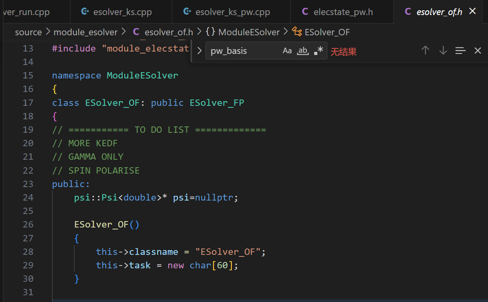
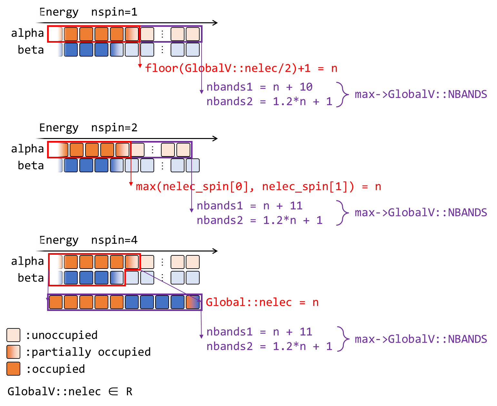
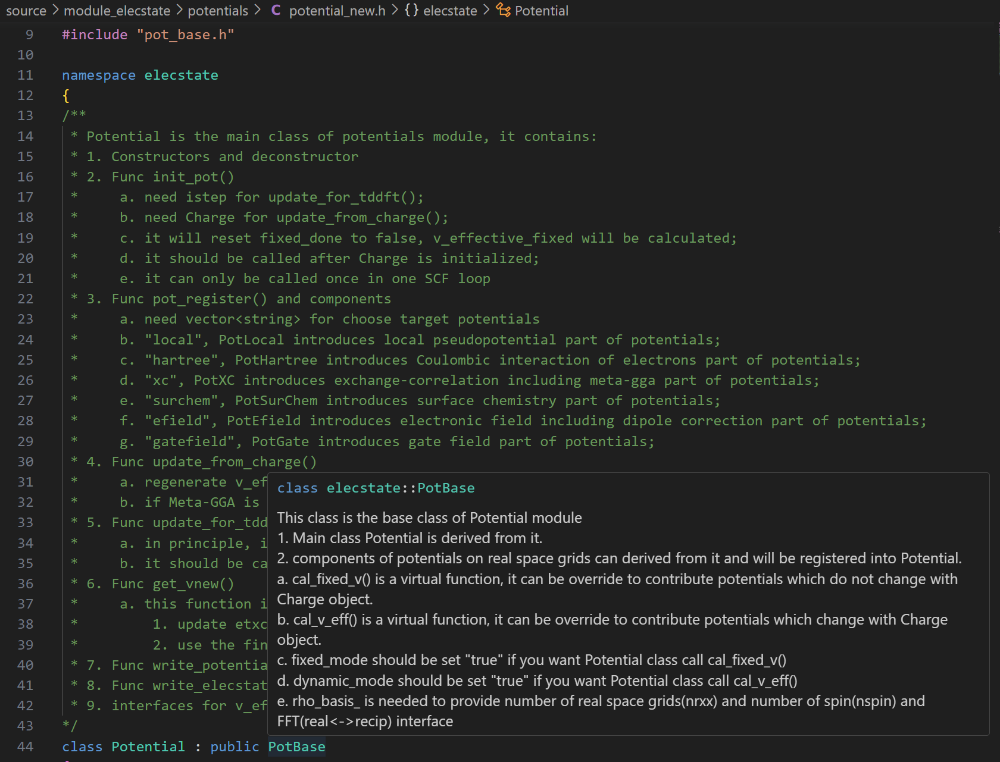

# Introduction to ABACUS: Path to PW calculation - Part 7

<strong>作者：黄一珂，邮箱：huangyk@aisi.ac.cn</strong>

<strong>审核：陈默涵，邮箱：mohanchen@pku.edu.cn</strong>

<strong>飞书链接：[Introduction to ABACUS: Path to PW calculation - Part 7](https://xmywuqhxb0.feishu.cn/docx/ZPswdc7WAo1GdWxLinicDYtcnwk)</strong>

> 📃<strong>写在前面</strong>
>
> 1. 不脱离代码——避免读者看完手册后对代码没有一丁点概念
> 2. 不堆砌代码解释——避免平庸的代码解释，努力兼顾拉近读者和代码距离的同时，做到提纲挈领，不逐行复制代码后进行停留在代码语义上的解释

# Driver

## Driver::atomic_world()

### Driver::driver_run()

#### 多层继承：Init() functions in esolver class

终于来到和原本 `p_esolver` 相同的类的成员函数 `Init()`：

```cpp
template <typename FPTYPE, typename Device>
void ESolver_KS_PW<FPTYPE, Device>::Init(Input& inp, UnitCell& ucell)
{
    ESolver_KS<FPTYPE, Device>::Init(inp, ucell); // <- we just leave from here

    // Initialize HSolver
    if (this->phsol == nullptr)
    {
        this->phsol = new hsolver::HSolverPW<FPTYPE, Device>(this->pw_wfc, &this->wf);
    }

    // Initialize ElecState
    if (this->pelec == nullptr)
    {
        this->pelec = new elecstate::ElecStatePW<FPTYPE, Device>(this->pw_wfc, &(this->chr), &(this->kv), this->pw_rho, this->pw_big);
    }

    // Initialize the charge density
    this->pelec->charge->allocate(GlobalV::NSPIN);
    this->pelec->omega = GlobalC::ucell.omega;

    // Initialize the potential
    if (this->pelec->pot == nullptr)
    {
        this->pelec->pot = new elecstate::Potential(this->pw_rho, &GlobalC::ucell, &(GlobalC::ppcell.vloc), &(this->sf), &(this->pelec->f_en.etxc), &(this->pelec->f_en.vtxc));
    }
    
    this->Init_GlobalC(inp, ucell);
    if (GlobalV::ocp) this->pelec->fixed_weights(GlobalV::ocp_kb);
}
```

##### Initialization of HSolverPW object

###### Constructor

首先来到按照注释划分的第一部分“Initialize HSolver”（line 6，HSolver 就是求解体系哈密顿量的求解器）：

```cpp
template <typename FPTYPE, typename Device>
void ESolver_KS_PW<FPTYPE, Device>::Init(Input& inp, UnitCell& ucell)
{
    ESolver_KS<FPTYPE, Device>::Init(inp, ucell);

    // Initialize HSolver
    if (this->phsol == nullptr)
    {
        this->phsol = new hsolver::HSolverPW<FPTYPE, Device>(this->pw_wfc, &this->wf);
    }
```

其实 `phsol`（此处命名逻辑为 p 代表 Pointer，hsol 为 HSolver 的缩写）并非是 `ESolver_KS_PW` 类中数据成员，而是在 `ESolver_KS` 中，这意味着 `ESolver_KS` 的派生类均有可能使用这一数据成员。稍加搜索，发现 `ESolver_KS_LCAO::Init()` 中也有类似操作：

```cpp
void ESolver_KS_LCAO::Init(Input& inp, UnitCell& ucell)
{
    ....
    // init HSolver
    if (this->phsol == nullptr)
    {
        this->phsol = new hsolver::HSolverLCAO(this->LOWF.ParaV);
        this->phsol->method = GlobalV::KS_SOLVER;
    }
```

另一点可以预料的是，在基类 `ESolver_KS` 的声明中，`phsol` 起始被声明为基类 `HSolver` 类对象，而非直接地 `HSolverPW` 这一派生类对象，这一操作再次体现了 C++ 的多态编程思路。具体在当前 Init 函数中，`phsol` 被分配内存时调用的 `HSolverPW` 类构造函数，其形参表中，`pw_wfc` 是属于 `PW_Basis_K`（以及其派生类 `PW_Basis_K_Big`）类对象，继承自 `ESolver_KS`。`wf` 是 `wavefunc` 类对象，也继承自 `ESolver_KS`，这体现了仅对于 `ESolver_KS` 层级而言需要带有 k 点的平面波波函数，以及波函数的存储类，而再上一级 `ESolver_FP` 则不一定需要这两者。平行而言 `ESolver_OF` 也属于“FP”，但在 `ESolver_FP` 的派生类 `ESolver_OF` 中，丝毫没有关于平面波波函数的数据成员：



派生类 `HSolverPW` 的构造函数其结构十分简单：

```cpp
template <typename FPTYPE, typename Device>
HSolverPW<FPTYPE, Device>::HSolverPW(ModulePW::PW_Basis_K* wfc_basis_in, wavefunc* pwf_in)
{
    this->classname = "HSolverPW";
    this->wfc_basis = wfc_basis_in;
    this->pwf = pwf_in;
    this->diag_ethr = GlobalV::PW_DIAG_THR;
}
```

，即将 `ESolver_KS::pw_wfc` 复制进 HSolverPW 的数据成员 `wfc_basis`，`ESolver_KS::wf` 到 `HSolverPW::pwf`。

##### Initialization of ElecState object

###### Constructor

接下来来到 `ESolver_KS_PW::Init()`“第二部分”中 `ElecState` 类对象的初始化。

```cpp
template <typename FPTYPE, typename Device>
void ESolver_KS_PW<FPTYPE, Device>::Init(Input& inp, UnitCell& ucell)
{
....
    // init ElecState,
    if (this->pelec == nullptr)
    {
        this->pelec = new elecstate::ElecStatePW<FPTYPE, Device>(this->pw_wfc,
                                                                 &(this->chr),
                                                                 &(this->kv),
                                                                 this->pw_rho,
                                                                 this->pw_big);
    }
```

和 `phsol` 同样地，这一次 `pelec` 是继承自 `ESolver_FP` 类（因此说明 `FP` 不仅 `KS` 派生类需要电荷这一物理量），但 `pelec` 实际被声明为基类 `ElecState` 的指针，在 `ESolver_KS_PW::Init()` 中被分配以其派生类 `ElecStatePW` 的内存空间（同样地也有 `ElecStateLCAO` 派生类等），因此调用派生类构造函数：

```cpp
template<typename FPTYPE, typename Device>
ElecStatePW<FPTYPE, Device>::ElecStatePW(ModulePW::PW_Basis_K *wfc_basis_in, Charge* chg_in, K_Vectors *pkv_in, ModulePW::PW_Basis* rhopw_in, ModulePW::PW_Basis_Big* bigpw_in) : basis(wfc_basis_in)  
{
    this->classname = "ElecStatePW";
    this->init_ks(chg_in, pkv_in, pkv_in->nks, rhopw_in, bigpw_in);
}
```

在该构造函数的函数体外初始化了成员变量 `basis` 以 `ESolver_KS::pw_wfc`。除了设置 `ElecStatePW::classname` 这一数据成员的具体值外，调用 `ElecState::init_ks()` 函数（显然继承自基类）。

###### ElecState::init_ks()

```cpp
void ElecState::init_ks(Charge* chg_in, // pointer for class Charge
                        const K_Vectors* klist_in,
                        int nk_in,
                        ModulePW::PW_Basis* rhopw_in,
                        const ModulePW::PW_Basis_Big* bigpw_in)
{
    this->charge = chg_in;
    this->charge->set_rhopw(rhopw_in);
    
    this->klist = klist_in;
    
    this->bigpw = bigpw_in;
    
    // init nelec_spin with nelec and nupdown
    this->init_nelec_spin();
    // autoset and check GlobalV::NBANDS, nelec_spin is used when NSPIN==2
    this->cal_nbands();
    // initialize ekb and wg
    this->ekb.create(nk_in, GlobalV::NBANDS);
    this->wg.create(nk_in, GlobalV::NBANDS);
}
```

####### Link Charge* ElecState::charge to Charge ESolver_FP::chg

⚠ 注意在 `ElecState`/`ElecStatePW` 类中的数据成员 `charge` 是 `Charge` 类指针，被赋值为 `ESolver_FP` 类的 `Charge` 类对象，即使得 `ElecState` 类的 `Charge` 类指针指向 `ESolver_FP` 的 `chr` 数据成员。

```cpp
namespace ModuleESolver
{
    class ESolver_FP : public ESolver
    {
    public:
        ....
        elecstate::ElecState* pelec = nullptr;
        Charge chr;
        ModuleSymmetry::Symmetry symm;
        ....
        K_Vectors kv;
```

因此

```cpp
this->charge = chg_in;
    this->charge->set_rhopw(rhopw_in);
```

的意义在于由 `ElecState::init_ks()` 作为被包含在 `ESolver_FP`（或说 `ESolver`）对象中的 `Charge` 类对象 `chg` 和 `PW_Basis` 类 `pw_rho` 的连接。（是否冗余？）

变量 `ElecState::klist`、`ElecState::bigpw`、`ElecState::rhopw` 传入的实参也类似，同样来自于 `ESolver_FP`。

```cpp
void Charge::set_rhopw(ModulePW::PW_Basis* rhopw_in)
{
    this->rhopw = rhopw_in;
}
```

| context                 | 用于展开电荷的 PW_Basis 类指针 | 包含 Big FFT grid 的用于电荷展开的 PW_Basis_Big 类指针 |
| ----------------------- | ------------------------------ | ------------------------------------------------------ |
| `ElecState` 数据成员     |                                | `bigpw`                                                |
| `ElecState::init_ks()`  | `rhopw_in`                     | `bigpw_in`                                             |
| `ESolver_KS_PW::Init()` | `pw_rho`                       | `pw_big`                                               |
| `ESolver_FP` 数据成员    | `pw_rho`                       | `pw_big`                                               |
| `Charge` 数据成员        | `rhopw`                        |                                                        |

####### Calculate numbers of electrons in different spin channels

`ElecState::init_nelec_spin()` 函数的调用为 `this->nelec_spin` 赋值，其中 `GlobalV::nupdown` 的意义已经在（[Introduction to ABACUS: Path to PW calculation - Part 2](https://ucoyxk075n.feishu.cn/docx/JruadAi9FoipBAxkxWaczZoxnwg#GtbCdmMyHoArL7xb3IZcgti4nHb) ）介绍，为 up 和 down spin 的差值：

```cpp
void ElecState::init_nelec_spin()
{
    this->nelec_spin.resize(GlobalV::NSPIN);
    if (GlobalV::NSPIN == 2)
    {
        // in fact, when TWO_EFERMI(nupdown in INPUT is not 0.0), nelec_spin will be fixed.
        this->nelec_spin[0] = (GlobalV::nelec + GlobalV::nupdown) / 2.0;
        this->nelec_spin[1] = (GlobalV::nelec - GlobalV::nupdown) / 2.0;
    }
}
```

####### Get number of bands to solve: ElecState::cal_nbands()

`ElecState::cal_nbands()` 函数的调用为 `GlobalV::NBANDS`（需要计算的能带数量）这一全局变量赋值或对通过 `INPUT` 文件中 `nbands` 关键词进行赋值的值进行合理性检查。对于未在 `INPUT` 文件中进行赋值的情况，则在此函数之前仍然保持值为 0，之后的赋值策略为：

```cpp
void ElecState::cal_nbands()
{
....
    if (GlobalV::LSPINORB == 1)
        occupied_bands = static_cast<double>(GlobalV::nelec);
    /* it can only be the case of uks, but if so, the following method for calculating NBANDS will make this variable meaningless cuz never used! */
    if ((occupied_bands - std::floor(occupied_bands)) > 0.0)
    {
        occupied_bands = std::floor(occupied_bands) + 1.0; // mohan fix 2012-04-16
    }
....
    ModuleBase::GlobalFunc::OUT(GlobalV::ofs_running, "occupied bands", occupied_bands);
    if (GlobalV::NBANDS == 0)
    {
        if (GlobalV::NSPIN == 1)
        {
            const int nbands1 = static_cast<int>(occupied_bands) + 10;
            const int nbands2 = static_cast<int>(1.2 * occupied_bands) + 1;
            GlobalV::NBANDS = std::max(nbands1, nbands2);
            if (GlobalV::BASIS_TYPE != "pw")
                GlobalV::NBANDS = std::min(GlobalV::NBANDS, GlobalV::NLOCAL);
        }
        else if (GlobalV::NSPIN == 4)
        {
            const int nbands3 = GlobalV::nelec + 20;
            const int nbands4 = static_cast<int>(1.2 * GlobalV::nelec) + 1;
            GlobalV::NBANDS = std::max(nbands3, nbands4);
            if (GlobalV::BASIS_TYPE != "pw")
                GlobalV::NBANDS = std::min(GlobalV::NBANDS, GlobalV::NLOCAL);
        }
        else if (GlobalV::NSPIN == 2)
        {
            /* max() is because the keyword nupdown can either be positive or negative */
            const double max_occ = std::max(this->nelec_spin[0], this->nelec_spin[1]);
            const int nbands3 = static_cast<int>(max_occ) + 11;
            const int nbands4 = static_cast<int>(1.2 * max_occ) + 1;
            GlobalV::NBANDS = std::max(nbands3, nbands4);
            if (GlobalV::BASIS_TYPE != "pw")
                GlobalV::NBANDS = std::min(GlobalV::NBANDS, GlobalV::NLOCAL);
        }
        ModuleBase::GlobalFunc::AUTO_SET("NBANDS", GlobalV::NBANDS);
    }
```



> 🤔<strong>思考时间</strong>
> Is there any differences bewteen the ways to assign default values for number of bands to calculate in ABACUS and Quantum ESPRESSO?

回溯：`GlobalV::nelec` 的值从 `ESolver_KS::Init()` 调用时确定（具体调用 `UnitCell::cal_nelec()`，[Introduction to ABACUS: Path to PW calculation - Part 5](https://ucoyxk075n.feishu.cn/docx/RCLSd2Of5oughUxmVDZcBhmqnDe#Tjg1dV3biorDVfxdl4vcmHNlnHh)）。

```cpp
//module_base/global_variable.cpp
GlobalV::NBANDS = 0;
//module_io/input.cpp
INPUT.nbands = 0;
//module_io/input.cpp::Read()
        else if (strcmp("nbands", word) == 0) // number of atom bands
        {
            read_value(ifs, nbands);
        }
//module_io/input_conv.cpp
    GlobalV::NBANDS = INPUT.nbands;
```

对于赋值的情况则需要对其合理性进行检查，一方面是对使用 smearing 时候的 `nbands` 数量（对于能级简并度较高的情况，SCF 过程中能级的变化将引起能量的变化剧烈，因此可以通过 smearing 方法弥散最高占据能级附近的电子布居，使得能量变化剧烈程度减少。smearing 的具体参照一方面可以由独立费米子体系所遵循 Fermi-Dirac 统计借鉴而来，或直接采用 Gauss 分布。控制 smearing 的参数取值越大，电子偏离“0 温”越严重，但可以加速电子迭代的收敛。实际计算时，一般对半导体或者绝缘体、或者有 gap 的系统，可以不取 smearing，或者 smearing 不起作用；如果对金属系统，可以适当取一点 smearing 加速收敛，但太大容易引起结果不准确）：

```cpp
void ElecState::cal_nbands()
{
....
    if (GlobalV::NBANDS == occupied_bands)
    {
        if (Occupy::gauss())
        {
            ModuleBase::WARNING_QUIT("ElecState::cal_nbands", "for smearing, num. of bands > num. of occupied bands");
        }
    }
```

`Occupy` 是在 `input_conv` 被调用时所赋值的对象，

```cpp
//module_io/input_conv.cpp line 589
    Occupy::decision(INPUT.occupations, INPUT.smearing_method, INPUT.smearing_sigma);
```

而 `Occupy::gauss()` 的功能仅仅为：

```cpp
class Occupy
{
public:
....
    static const bool& gauss(void) {return use_gaussian_broadening;}
```

剩余部分：

```cpp
void ElecState::cal_nbands()
{
....
    if (GlobalV::NBANDS == 0) {....}
    else
    {
        if (GlobalV::NBANDS < occupied_bands)
            ModuleBase::WARNING_QUIT("unitcell", "Too few bands!");
        if (GlobalV::NSPIN == 2)
        {
            if (GlobalV::NBANDS < this->nelec_spin[0])
            {
                ModuleBase::GlobalFunc::OUT(GlobalV::ofs_running, "nelec_up", this->nelec_spin[0]);
                ModuleBase::WARNING_QUIT("ElecState::cal_nbands", "Too few spin up bands!");
            }
            if (GlobalV::NBANDS < this->nelec_spin[1])
            {
                ModuleBase::GlobalFunc::OUT(GlobalV::ofs_running, "nelec_down", this->nelec_spin[1]);
                ModuleBase::WARNING_QUIT("ElecState::cal_nbands", "Too few spin down bands!");
            }
        }
    }
```

###### Others

```cpp
this->pelec->charge->allocate(GlobalV::NSPIN);
    this->pelec->omega = GlobalC::ucell.omega;
```

第二行将当前晶胞体积赋值给 `ElecState` 指针中该成员变量，第一行则为 `Charge* ElecState::charge` 申请内存空间：

```cpp
void Charge::allocate(const int& nspin_in)
{
    ModuleBase::TITLE("Charge", "allocate");
    this->nrxx = this->rhopw->nrxx; // number of distributed real space grid points
    this->nxyz = this->rhopw->nxyz; // total number of real space grid points
    this->ngmc = this->rhopw->npw; // number of distributed planewaves

    if (allocate_rho == true)
    {
        this->destroy();
        allocate_rho = false;
    }
    assert(allocate_rho == false);

    this->nspin = nspin_in;
....// standard output omitted here

    rho = new double*[nspin];
    rhog = new std::complex<double>*[nspin];
    rho_save = new double*[nspin];
    rhog_save = new std::complex<double>*[nspin];
    if (elecstate::get_xc_func_type() == 3 || elecstate::get_xc_func_type() == 5)
    {
        kin_r = new double*[nspin]; kin_r_save = new double*[nspin];
    }
    //spin-by-spin (sbs)
    for (int is = 0; is < nspin; is++)
    {
        rho[is] = new double[nrxx]; // charge density on distributed realspace grid sbs
        rhog[is] = new std::complex<double>[ngmc]; // charge density in reciprocal space sbs
        rho_save[is] = new double[nrxx]; // backup of rho
        rhog_save[is] = new std::complex<double>[ngmc]; // backup of rhog
        ....// initialize above four arrays of present spin with zeros
        if (elecstate::get_xc_func_type() == 3 || elecstate::get_xc_func_type() == 5)
        {
            kin_r[is] = new double[nrxx]; kin_r_save[is] = new double[nrxx];
            ....// initialize above two arrays of present spin with zeros
        }
    }
.... // memory record omitted
    this->rho_core = new double[nrxx]; // core charge in real space
    this->rhog_core = new std::complex<double>[ngmc]; // reciprocal core charge
    ....// initialize above two arrays of present spin with zeros
.... // memory record omitted
    this->allocate_rho = true;
}
```

##### Initialization of Potential

```cpp
template <typename FPTYPE, typename Device>
void ESolver_KS_PW<FPTYPE, Device>::Init(Input& inp, UnitCell& ucell)
{
    ....
    // Initialize the potential.
    if (this->pelec->pot == nullptr)
    {
        this->pelec->pot = new elecstate::Potential(this->pw_rho,
                                                    &GlobalC::ucell,
                                                    &(GlobalC::ppcell.vloc),
                                                    &(this->sf),
                                                    &(this->pelec->f_en.etxc),
                                                    &(this->pelec->f_en.vtxc));
    }
```

接下来将各与势能相关变量的内存地址拉取到 `ElecStatePW* ESolver_KS_PW::pelec` 的指针成员 `Potential* pot` 下（继承自基类 `ElecState`），`Potential` 类构造函数被调用，初始化 `pot` 指针：

```cpp
namespace elecstate
{
    Potential::Potential(const ModulePW::PW_Basis* rho_basis_in, const UnitCell* ucell_in, const ModuleBase::matrix* vloc_in, Structure_Factor* structure_factors_in, double* etxc_in, double* vtxc_in): ucell_(ucell_in), vloc_(vloc_in),  structure_factors_(structure_factors_in), etxc_(etxc_in), vtxc_(vtxc_in)
        {
            this->rho_basis_ = rho_basis_in;
            this->fixed_mode = true;
            this->dynamic_mode = true;
            // allocate memory for Potential.
            this->allocate();
        }
```

在 `Potential` 构造函数的形参表中，我们发现了从未出现过的 `ModuleBase::matrix* GlobalC::ppcell` 变量，以及 `fenergy ElecState::f_en` 变量，这些变量以内存地址形式存入 `ElecStatePW* ESolver_KS_PW::pelec` 中。对于 `Potential::allocate()` 函数，则不出例外地为数组申请内存空间：

```cpp
void Potential::allocate()
{
    ModuleBase::TITLE("Potential", "allocate");
    int nrxx = this->rho_basis_->nrxx;
    if (nrxx == 0) return;

    this->v_effective_fixed.resize(nrxx);
    this->v_effective.create(GlobalV::NSPIN, nrxx);
.... // memory record omitted
    if (elecstate::get_xc_func_type() == 3 || elecstate::get_xc_func_type() == 5)
    {
        this->vofk_effective.create(GlobalV::NSPIN, nrxx);
.... // memory record omitted
    }
    if (GlobalV::device_flag == "gpu") {....}
    else {
        if (GlobalV::precision_flag == "single") {....}
        else {
            this->d_v_effective = this->v_effective.c;
            this->d_vofk_effective = this->vofk_effective.c;
        }
        // There's no need to allocate memory for double precision pointers while in a CPU environment
    }
}
```

```cpp
// module_elecstate/potentials/potential_new.h 
class Potential : public PotBase
{
  ....//google-style indent?
  private:
  ....
    std::vector<double> v_effective_fixed; //<-line 154
    ModuleBase::matrix v_effective; // mixed use of std::vector and self-built matrix?
```

`Potential` 和其基类 `PotBase` 拥有漂亮的类注释文档（[link](https://github.com/abacusmodeling/abacus-develop/blob/develop/source/module_elecstate/potentials/potential_new.h)）：



##### Initialization of rest parts of GlobalC

`GlobalC` 和 `GlobalV` 是两个特殊的类，如第一版开发者文档所提到，此两种类的收益为避免过大的形参表，但负向收益为带来对两类中全局变量意外覆盖读写的隐患，因此在 ABACUS 的未来版本中，会逐步弃用 `GlobalC` 和 `GlobalV`，转而使用对象：利用高度且合理的封装方式，每次传入对象，对象包含各自相关的数据成员和函数。但就当前而言，`GlobalC` 提供了一些全局类。此处剩余的一些全局类申请内存空间、被初始化。

```cpp
template <typename FPTYPE, typename Device>
void ESolver_KS_PW<FPTYPE, Device>::Init_GlobalC(Input& inp, UnitCell& cell)
{
    if (this->psi != nullptr)
        delete this->psi;
    this->psi = this->wf.allocate(this->kv.nks, this->kv.ngk.data(), this->pw_wfc->npwk_max);

    // init pseudopotential
    GlobalC::ppcell.init(GlobalC::ucell.ntype, &this->sf, this->pw_wfc);

    // initalize local pseudopotential
    GlobalC::ppcell.init_vloc(GlobalC::ppcell.vloc, this->pw_rho);

    // Initalize non local pseudopotential
    GlobalC::ppcell.init_vnl(GlobalC::ucell);
    GlobalC::ppcell.cal_effective_D();
    // create GlobalC::ppcell.tab_at , for trial wave functions.
    this->wf.init_at_1(&this->sf);

    // Initial start wave functions
    this->wf.wfcinit(this->psi, this->pw_wfc);

    // denghui added 20221116
    this->kspw_psi = GlobalV::device_flag == "gpu" || GlobalV::precision_flag == "single"
                         ? new psi::Psi<std::complex<FPTYPE>, Device>(this->psi[0])
                         : reinterpret_cast<psi::Psi<std::complex<FPTYPE>, Device>*>(this->psi);
....//memory record omitted here
}
```

> 📝<strong>笔者的话</strong>
> 这里有一个有趣的东西是 `kspw_psi`（在求力部分还有 `__kspw_psi`）。有兴趣的读者可以自行查看对于 gpu 或者单精度情况，在调用的 `psi` 构造函数中发生了什么。
> 实际上，`kspw_psi` 支持了异构计算，而 `psi`，如 esolver_fp.h 声明中，实际上只为 `psi::Psi<std::complex<double>, Device = psi::DEVICE_CPU>*` 类指针。因此真正计算架构-dependent 的是 `kspw_psi`。`ESolver_KS_PW` 为支持异构计算，整个类为模板类。在 psi 被分配内存空间后，为 `kspw_psi` 赋予了其数据的可达性（accessibility），`reinterpret_cast` 或者复制内容。

###### Psi

`Psi` 是 ABACUS 中一类特殊的数据结构，用于存储波函数（平面波基函数系数）信息。其包含如下数据成员：

```cpp
namespace psi
{
template <typename T, typename Device = DEVICE_CPU> class Psi
{
  public:
    int npol = 1;
    ....
  private:
    T* psi = nullptr; // avoid using C++ STL

    AbacusDevice_t device = {}; // track the device type (CPU, GPU and SYCL are supported currented)
    Device* ctx = {}; // an context identifier for obtaining the device variable

    // dimensions
    int nk = 1; // number of k points
    int nbands = 1; // number of bands
    int nbasis = 1; // number of basis

    mutable int current_k = 0; // current k point
    mutable int current_b = 0; // current band index
    mutable int current_nbasis = 1; // current number of basis of current_k

    // current pointer for getting the psi
    mutable T* psi_current = nullptr;
    // psi_current = psi + psi_bias;
    mutable int psi_bias = 0;

    const int* ngk = nullptr;

    bool k_first = true;
    ....
};
}
```

####### Codes

我们首先阅读为 `Psi` 申请内存空间的代码

```cpp
psi::Psi<std::complex<double>> *wavefunc::allocate(const int nks, const int *ngk, const int npwx_in)
{
    /* parameter list:
    nks: number of kpoints distributed on present processor
    ngk: number of planewaves on kpoints respectively on present processor
    npwx_in: maximal number of planewaves across all kpoints distributed on present processor
    */
    this->npwx = npwx_in;
    assert(npwx > 0);
    assert(nks > 0);

    // if use spin orbital, do not double nks but double allocate evc and wanf2.
    int prefactor = 1;
    if(GlobalV::NSPIN==4) prefactor = GlobalV::NPOL;//added by zhengdy-soc

    const int nks2 = nks;

    psi::Psi<std::complex<double>>* psi_out = nullptr;
....// non-pw cases are omitted
    else
    {
        psi_out = new psi::Psi<std::complex<double>>(nks2, GlobalV::NBANDS, npwx * GlobalV::NPOL, ngk);
....// standard output and memory record omitted
    }
    return psi_out;
}
```

即 `wavefunc::allocate()` 函数核心功能为为不同基组类型按照不同方式分配内存空间，仍然需要调用 `psi` 自己的构造函数。`psi` 的构造函数的重载共有 6 个（以及 1 个默认构造函数）：

```cpp
template <typename T, typename Device = DEVICE_CPU> class Psi
{
  public:
    // Constructor 1: basic
    Psi();
    // Constructor 2: specify ngk only, should call resize() later
    Psi(const int* ngk_in);
    // <strong>Constructor 3</strong>: specify nk, nbands, nbasis, ngk, and do not need to call resize() later
    Psi(int nk_in, int nbd_in, int nbs_in, const int* ngk_in = nullptr);
    // Constructor 4: copy a new Psi which have several k-points and several bands from inputted psi_in
    Psi(const Psi& psi_in, const int nk_in, int nband_in = 0);
    // Constructor 5: a wrapper of a data pointer, used for Operator::hPsi()
    // in this case, fix_k can not be used
    Psi(T* psi_pointer, const Psi& psi_in, const int nk_in, int nband_in = 0);
    // Constructor 6: initialize a new psi from the given psi_in
    Psi(const Psi& psi_in);
    // Constructor 7: initialize a new psi from the given psi_in with a different class template
    // in this case, psi_in may have a different device type.
    template <typename T_in, typename Device_in = Device>
    Psi(const Psi<T_in, Device_in>& psi_in);
```

此处我们调用的是"<strong>Constructor 3</strong>"：

```cpp
template <typename T, typename Device> Psi<T, Device>::Psi(int nk_in, int nbd_in, int nbs_in, const int* ngk_in)
{
    this->ngk = ngk_in;
    this->current_b = 0;
    this->current_k = 0;
    this->npol = GlobalV::NPOL;
    this->device = device::get_device_type<Device>(this->ctx);
    this->resize(nk_in, nbd_in, nbs_in);
    // Currently only GPU's implementation is supported for device recording!
    ....//device recording omitted
}
```

```cpp
template <typename T, typename Device>
void Psi<T, Device>::resize(const int nks_in, const int nbands_in, const int nbasis_in)
{
    assert(nks_in > 0 && nbands_in >= 0 && nbasis_in > 0);
    // This function will delete the psi array first(if psi exist), then malloc a new memory for it.
    resize_memory_op()(this->ctx, this->psi, nks_in * nbands_in * nbasis_in, "no_record");
    this->nk = nks_in;
    this->nbands = nbands_in;
    this->nbasis = nbasis_in;
    this->current_nbasis = nbasis_in;
    this->psi_current = this->psi;
    // GlobalV::ofs_device << "allocated xxx MB memory for psi" << std::endl;
}
```

```cpp
//psi.h line 130
    using resize_memory_op = psi::memory::resize_memory_op<T, Device>;
```

```cpp
//module_psi/kernels/memory_op.h
namespace psi {
namespace memory {
template <typename FPTYPE, typename Device> 
struct resize_memory_op {
    void operator()(const Device* dev, FPTYPE*& arr, const size_t size, const char* record_in = nullptr);
};
```

```cpp
//module_psi/kernels/memory_op.cpp
namespace psi{
namespace memory{

template <typename FPTYPE> 
struct resize_memory_op<FPTYPE, psi::DEVICE_CPU>
{
    void operator()(const psi::DEVICE_CPU* dev, FPTYPE*& arr, const size_t size, const char* record_in)
    {
        if (arr != nullptr) free(arr);
        arr = (FPTYPE*) malloc(sizeof(FPTYPE) * size);
    
        std::string record_string;
        if(record_in != nullptr) record_string = record_in;
        else record_string = "no_record";

        if(record_string != "no_record" )
        {
            ModuleBase::Memory::record(record_string , sizeof(FPTYPE) * size);
        }
    }
};
```

因此 `Psi` 类对象最终使用 `resize_memory_op()` 来为 `Psi::psi` 数据成员进行内存申请，用于存储波函数信息/其同样是 3d-flatten，即申请的实际上是一级指针，规模为 `[ikpoint][iband][ibasis]`。

####### Feature: struct with overloaded "()", extends the way of defining functions

`Psi` 申请内存时使用了在之前介绍的 ABACUS 代码中从未出现过的方式，即创建模板类结构体，之后在其中重载括号运算符，以调用函数的方式使用重载的括号。这种方式为 C++ 结构体所独有，是固定特性，对原本的函数实现方式实现了更大范围的拓展，结合 `using` 关键字，可以达到模板类实例化、封装、多态等效果。

并且

```cpp
resize_memory_op()(this->ctx, this->psi, nks_in * nbands_in * nbasis_in, "no_record");
```

实际可以写为

```cpp
resize_memory_op(this->ctx, this->psi, nks_in * nbands_in * nbasis_in, "no_record");
```

和原本的函数使用方法更加相似。类似的例子还有关于 Psi 类对象其他内存空间的操作：

```cpp
namespace psi
{
template <typename T, typename Device = DEVICE_CPU> class Psi
{
  public:
    ....
  private:
    ....
    using set_memory_op = psi::memory::set_memory_op<T, Device>;
    using delete_memory_op = psi::memory::delete_memory_op<T, Device>;
    using resize_memory_op = psi::memory::resize_memory_op<T, Device>;
    using synchronize_memory_op = psi::memory::synchronize_memory_op<T, Device, Device>;
};
} // end of namespace psi
```

```cpp
template <typename FPTYPE, typename Device>
struct delete_memory_op {
  /// @brief free memory for multi-device
  /// \param dev : the type of computing device
  /// \param arr : the input array
  void operator()(const Device* dev, FPTYPE* arr);
};
```

```cpp
template <typename FPTYPE>
struct delete_memory_op<FPTYPE, psi::DEVICE_CPU>
{
  void operator()(const psi::DEVICE_CPU* dev, FPTYPE* arr) {
    free(arr);
  }
};
```

```cpp
template <typename FPTYPE, typename Device> 
struct set_memory_op {
  /// @brief memset for multi-device
  /// \param dev : the type of computing device
  /// \param var : the specified constant value
  /// \param size : array size
  /// Output Parameters
  /// \param arr : output array initialized by the input value
  void operator()(const Device* dev, FPTYPE* arr, const int var, const size_t size);
};
```

```cpp
template <typename FPTYPE> 
struct set_memory_op<FPTYPE, psi::DEVICE_CPU> {
  void operator()(const psi::DEVICE_CPU* dev, FPTYPE* arr, const int var, const size_t size) {
    ModuleBase::OMP_PARALLEL([&](int num_thread, int thread_id) {
      int beg, len;
      ModuleBase::BLOCK_TASK_DIST_1D(num_thread, thread_id, size, (size_t)4096/sizeof(FPTYPE), beg, len);
      memset(arr + beg, var, sizeof(FPTYPE)*len);
    });
  }
};
```

```cpp
template <typename FPTYPE, typename Device_out, typename Device_in> 
struct synchronize_memory_op {
  /// @brief memcpy for multi-device
  /// \param dev_out : the type of computing device of arr_out
  /// \param dev_in : the type of computing device of arr_in
  /// \param arr_in : input array
  /// \param size : array size
  /// Output Parameters
  /// \param arr_out : output array initialized by the input array
  void operator()(
      const Device_out* dev_out, 
      const Device_in* dev_in, 
      FPTYPE* arr_out, 
      const FPTYPE* arr_in, 
      const size_t size);
};
```

```cpp
template <typename FPTYPE> 
struct synchronize_memory_op<FPTYPE, psi::DEVICE_CPU, psi::DEVICE_CPU>
{
  void operator()(
                  const psi::DEVICE_CPU* dev_out, 
                  const psi::DEVICE_CPU* dev_in, 
                  FPTYPE* arr_out, 
                  const FPTYPE* arr_in, 
                  const size_t size) {
    ModuleBase::OMP_PARALLEL([&](int num_thread, int thread_id) {
      int beg, len;
      ModuleBase::BLOCK_TASK_DIST_1D(num_thread, thread_id, size, (size_t)4096/sizeof(FPTYPE), beg, len);
      memcpy(arr_out + beg, arr_in + beg, sizeof(FPTYPE)*len);
    });
  }
};
```

这种方式实现了模板函数的偏特化（partial specialization）需求（[see cppreference](https://en.cppreference.com/w/cpp/language/partial_specialization)），即首先实例化其中一个模板参数，之后再在其他地方实例化另一个。在更新的 C++20 版本中，使用 concepts（requires, [see C++20](https://en.cppreference.com/w/cpp/20)）可以达到类似效果（[see cppstories](https://www.cppstories.com/2021/concepts-intro/#what-is-a-concept)）。

在 ESolver_KS_PW()::init()的最后还有如下语句：

```cpp
this->kspw_psi = GlobalV::device_flag == "gpu" || GlobalV::precision_flag == "single"
                         ? new psi::Psi<std::complex<FPTYPE>, Device>(this->psi[0])
                         : reinterpret_cast<psi::Psi<std::complex<FPTYPE>, Device>*>(this->psi);
```

我们不考虑 GPU 和单精度的情况，因此以上等价于：

```cpp
this->kspw_psi = reinterpret_cast<psi::Psi<std::complex<double>>*>(this->psi);
```

###### pseudopot_cell_vnl

####### Before init()

我们之前没有特别关注过这个被声明在 `GlobalC` 里的全局类（[line 278](https://github.com/abacusmodeling/abacus-develop/blob/develop/source/module_hamilt_pw/hamilt_pwdft/global.h#L284)），这里我们首先非常粗略回顾其顾名思义的非局域项的原理，之后在下一篇中对该类成员函数的一些细节进行详细说明（但仍然不会逐行逐句进行“翻译”）。该类的名字 `pseudopot_cell_vnl` 实际上是 pseudopotential_cell_V(potential)_nonlocal 的缩写。首先简单介绍 Kleinman-Bylander 方法（[Phys. Rev. Lett. ](https://journals.aps.org/prl/abstract/10.1103/PhysRevLett.48.1425)<strong>48</strong>[, 1425（1982）](https://journals.aps.org/prl/abstract/10.1103/PhysRevLett.48.1425)）将 pseudopotential 分为完全非局域和局域部分：

> $$\hat{V}^{\mathrm{KB}}=\sum_{l=0}^{l_{max}}{\sum_{m=-l}^{+l}{\sum_{i=1}{|\chi _{lm,i}\rangle V_{li}^{KB}\langle \chi _{lm,i}|}}}$$.
> Therefore the fully nonlocal part of pp. has projectors of different angular momentum, magnetic quantum number and basis functions. That is to say, this projector will project one state onto some basic states at such kind of resolution.
> The basis of projector, is constructed in this way:
>
> $$
> \chi _{lm,i}\left( \mathbf{r} \right) =\langle \mathbf{r}|\chi _{lm,i}\rangle =R_{l,i}\left( r \right) Y_{lm}\left( \hat{\mathbf{r}} \right) 
> $$
>
> It is, similar with a hydrogen wavefunction that has radial part and angular part. The angular part, is represented by spherical harmonic function, and basis function, is only used for constructing radial part of the basis of projector $$\hat{V}^{KB}$$.
> However, what is $$V^{KB}_{li}$$ ? How is it calculated?
> $$V_{li}^{KB}=\langle \varphi _{li}|\delta V_l|\varphi _{li}\rangle $$, where $$\delta V_l=V_l(r)-V^{local}(r)$$, from semilocal pp. $$V_l(r)$$ (the one may directly read from portable pp. files like *.UPF), subtract the local part from it, leaving term $$\delta V_l(r)$$, is angular momentum-resoluted, while the local part is not.
> Imagine $$\delta V_l(r)$$ itself has its eigenspace and for each axis there is an eigenvalue. Any state can be expanded by eigenvectors $$\{|v_{li}\rangle\}$$ of $$\delta V_l(r)$$-space. Thus,
> $$|\varphi _{li}\rangle =\sum_k{c_{ik}|v_{lk}\rangle}$$,
>
> $$
> \langle \varphi _{li}|\delta V_l|\varphi _{li}\rangle =\langle \varphi _{li}|\sum_j{|v_{lj}\rangle v_{lj}\langle v_{lj}|}\varphi _{li}\rangle
> $$

\\
=\sum_{k^{\prime}}{c_{ik^{\prime}}^{\dagger}\langle v_{lk^{\prime}}}|\sum_j{|v_{lj}\rangle v_{lj}\langle v_{lj}|}\sum_k{c_{ik}|v_{lk}\rangle}
\\
=\sum_{k^{\prime}}{\sum_k{\sum_j{c_{ik^{\prime}}^{\dagger}c_{ik}\langle v_{lk^{\prime}}|v_{lj}\rangle v_{lj}\langle v_{lj}|v_{lk}\rangle}}}
\\
=\sum_{k^{\prime}}{\sum_k{\sum_j{c_{ik^{\prime}}^{\dagger}c_{ik}\delta _{k^{\prime}j}\delta _{kj}v_{lj}}}}
\\
=\sum_j{c_{ij}^{\dagger}c_{ij}v_{lj}}=\sum_j{c_{ij}^{2}v_{lj}}
\\
=v_{l1}\left( c_{i1}^{2} \right) +v_{l2}\left( c_{i2}^{2} \right) +...$$

> The result above is, norm of vector/state $$|\varphi_{li}\rangle$$ in eigen-space of operator $$\delta V_l$$.
> It is the same for any other kinds of scalar product, thus Schmidt orthogonalization in any arbitrary space has a more general form. For example, states $$\{\varphi_{li}\}$$ is $$\delta V_l$$-space-orthogonalized version of eigenstates of $$V_l(r)$$, the semilocal pp employing KS eq.:
>
> $$
> |\varphi _{li}\rangle =|\psi _{li}\rangle -\sum_{i^{\prime}=1}^{i-1}{|\varphi _{li^{\prime}}\rangle \frac{\langle \varphi _{li^{\prime}}|\delta V_l|\psi _{li^{\prime}}\rangle}{\langle \varphi _{li^{\prime}}|\delta V_l|\varphi _{li^{\prime}}\rangle}}
> $$
>
> The term $$V^{local}$$ is however, somewhat arbitrary, a sphericallly symmetrical charge distribution is directly given in this paper as:
>
> $$
> \rho^{local}(r)=A\exp[-(\frac{\sinh(abr)}{\sinh(br)})^2]
> $$
>
> Parameters $$a$$and $$b$$ are arbitrary. In paper $$a$$is optimized to 1.82/$$r_{core}$$, b is 1.

另一方面，自 ABACUS 开始运行时便调用其构造函数的 `pseudopot_cell_vnl`，有如下数据成员具有初始值：

| 变量                                         | 默认值    | 意义                             | 备注                                                  |
| -------------------------------------------- | --------- | -------------------------------- | ----------------------------------------------------- |
| `multi_proj`                                 | `false`   | 是否使用多个投影子（projector）  |                                                       |
| `s_deeq`, `d_deeq`, `c_deeq_nc`, `z_deeq_nc` | `nullptr` |                                  |                                                       |
| `s_nhtol`, `s_nhtolm`, `s_indv`, `s_tab`     | `nullptr` |                                  |                                                       |
| `c_vkb`                                      | `nullptr` | Kleinman-Bylander 完全非局域赝势 |                                                       |
| `d_nhtol`, `d_nhtolm`, `d_indv`, `d_tab`     | `nullptr` |                                  |                                                       |
| `z_vkb`                                      | `nullptr` | Kleinman-Bylander 完全非局域赝势 |                                                       |
| `wfcpw`                                      | `nullptr` | 平面波基波函数的指针             | `Init()` 被赋值为 `PW_Basis_K* ESolver_KS_PW::pw_wfc`   |
| `psf`                                        | `nullptr` | 结构因子指针                     | `Init()` 被赋值为 `Structure_Factor* ESolver_KS_PW::sf` |

在下一篇中，我们将更加细致地探究这个类的其他被 `Init_GlobalC()` 函数所调用的成员函数。

# 系列链接

上篇：[Introduction to ABACUS: Path to PW calculation - Part 6](develop-path6.md)

下篇：[Introduction to ABACUS: Path to PW calculation - Part 8](develop-path8.md)
