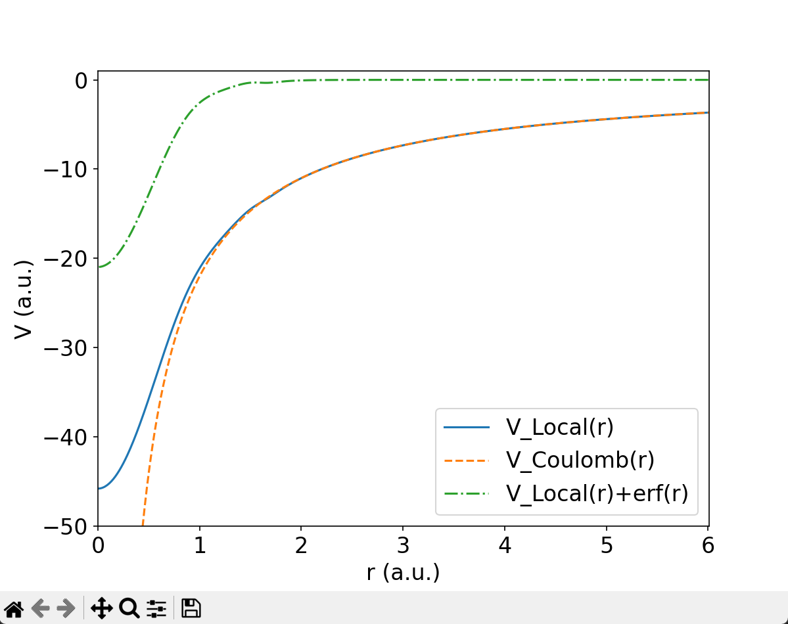
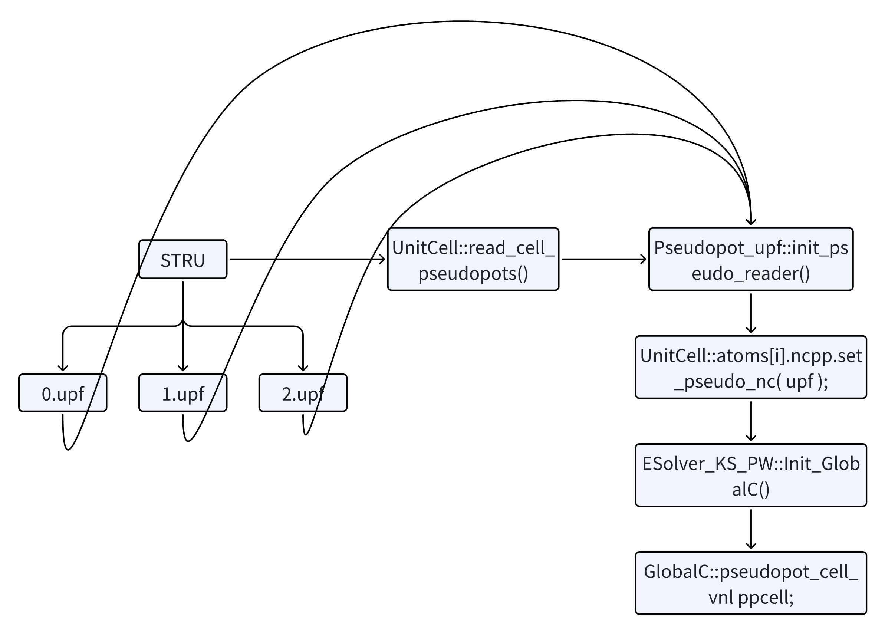

# Introduction to ABACUS: Path to PW calculation - Part 8

<strong>作者：黄一珂，邮箱：huangyk@aisi.ac.cn</strong>

<strong>审核：陈默涵，邮箱：mohanchen@pku.edu.cn</strong>

<strong>飞书链接：[Introduction to ABACUS: Path to PW calculation - Part 8](https://xmywuqhxb0.feishu.cn/docx/Neu6d9ncwoOlKnxIFxkcfEdZnvg)</strong>

> 📃<strong>写在前面</strong>
>
> 1. 不脱离代码——避免读者看完手册后对代码没有一丁点概念
> 2. 不堆砌代码解释——避免平庸的代码解释，努力兼顾拉近读者和代码距离的同时，做到提纲挈领，不逐行复制代码后进行停留在代码语义上的解释

<strong>Driver</strong>

<strong>Driver::atomic_world()</strong>

<strong>Driver::driver_run()</strong>

# 多层继承：Init() functions in esolver class

## Initialization of rest parts of GlobalC

### pseudopot_cell_vnl

#### pseudopot_cell_vnl::init()

`init()` 函数赋值以下变量，并为指针和数组进行初始化：

| 变量           | 意义                                                                                                                        | 操作                             |
| -------------- | --------------------------------------------------------------------------------------------------------------------------- | -------------------------------- |
| `wfcpw`        | `ESolver_KS_PW` 对象中 `PW_Basis_K` 类指针                                                                                     | exact value                      |
| `psf`          | ...对象中 `Structure_Factor` 类指针                                                                                           | exact value                      |
| `lmaxkb`       | 跨原子种类的 projector 最大角动量                                                                                           | exact value                      |
| `nhm`          | 原子种类的 projector 最大数量                                                                                               | zero                             |
| `nkb`          | 所有原子的 projector 数量总和                                                                                               | zero                             |
| `indv`         | 映射表，从[原子种类索引][projector 全局索引]到“原子种类内 projector 索引”                                                 | zero                             |
| `nhtol`        | 映射表，从[原子种类索引][projector 全局索引]到 projector 角量子数 l                                                         | zero                             |
| `nhtolm`       | 映射表，从[原子种类索引][projector 全局索引]到 projector 的(l,m)-pair: 0: s, 1/2/3: p, 4/5/6/7/8: d, ...                    | zero                             |
| `nhtoj`        | 映射表，从[原子种类索引][projector 全局索引]到 projector 总角量子数                                                         | zero                             |
| `deeq`         | 赝势<DIJ>block 中数据（projector-projector），存储为[自旋 channel 索引][原子种类索引][projector1 索引][projector2 索引]     | zero                             |
| `deeq_nc`      | Spin-orbit coupling case specific `deeq`                                                                                    | zero                             |
| `z_deeq_nc`    | double 指针，指向 `deeq_nc`                                                                                                  |                                  |
| `d_deeq`       | double 指针，指向 `deeq`                                                                                                     | exact value                      |
| `d_indv`       | double 指针，指向 `indv`                                                                                                     | exact value                      |
| `d_nhtol`      | double 指针，指向 `nhtol`                                                                                                    | exact value                      |
| `d_nhtolm`     | double 指针，指向 `nhtolm`                                                                                                   | exact value                      |
| `dvan`         | 赝势 projector 间<DIJ>，存储为[原子种类][projector1 全局索引][projector2 全局索引]                                          | zero                             |
| `dvan_so`      | Spin-orbit coupling case specific `dvan`, 存储为[自旋 channel 索引][原子种类][projector1 全局索引][projector2 全局索引]     | zero                             |
| `becsum`       | 存储为[自选channel索引][原子索引][(projectori,projectorj)-pair数量/2]      |  zero                            |
| `lmaxq`        | `2 * this->lmaxkb + 1;`                                                                                                     | exact value                      |
| `vkb`          | 倒空间$$V^{KB}$$值，即$$V_i(\mathbf{G}_j)^{KB}$$, $$i\in$$N(projector)，$$j\in$$N(planewaves)                                               | zero                             |
| `GlobalV::NQX` | 球 Bessel 函数的 q-空间格点数量                                                                                             | exact value                      |
| `tab`          | 插值表，表值$$\frac{4\pi}{\sqrt{\Omega}}\int{r^2\text{d}r\beta_{\alpha i}(r)j_l(qr)}$$, 存储为[原子种类][projector 索引][$$q$$索引] | zero                             |
| `tab_at`       | 原子波函数插值表                                                                                                            | zero                             |
| `z_vkb`        | double 指针，指向 `vkb`                                                                                                      |                                  |
| `d_tab`        | double 指针，指向 `tab`                                                                                                      |                                  |

因此部分函数冗长但功能简单，可读性强，因此不逐行解读，如需寻找代码细节，请自行阅读（[link](https://github.com/deepmodeling/abacus-develop/blob/develop/source/module_hamilt_pw/hamilt_pwdft/VNL_in_pw.cpp#L62)）。

#### pseudopot_cell_vnl::init_vloc()

##### code

```cpp
template <typename FPTYPE, typename Device>
void ESolver_KS_PW<FPTYPE, Device>::Init_GlobalC(Input& inp, UnitCell& cell)
{
....
    //=================================
    // initalize local pseudopotential
    //=================================
    GlobalC::ppcell.init_vloc(GlobalC::ppcell.vloc, this->pw_rho);
    ModuleBase::GlobalFunc::DONE(GlobalV::ofs_running, "LOCAL POTENTIAL");
```

```cpp
//VL_in_pw.cpp
void pseudopot_cell_vl::init_vloc(ModuleBase::matrix& vloc_in, const ModulePW::PW_Basis* rho_basis)
{
....
    double *vloc1d = new double[rho_basis->ngg];
    ModuleBase::GlobalFunc::ZEROS(vloc1d, rho_basis->ngg);

    this->allocate(rho_basis->ngg);
    
    for (int it = 0; it < GlobalC::ucell.ntype; it++) 
    {
        const Atom* atom = &GlobalC::ucell.atoms[it];
        ModuleBase::GlobalFunc::ZEROS(vloc1d, rho_basis->ngg);
        this->zp[it] = atom->ncpp.zv;

        if(numeric[it]==true)
        {
            this->vloc_of_g(atom->ncpp.msh, atom->ncpp.rab, atom->ncpp.r, atom->ncpp.vloc_at, this->zp[it], vloc1d, rho_basis);
        }
        else ModuleBase::WARNING_QUIT("init_vloc","not available now.");

        if(it>=0 && it<vloc_in.nr && vloc_in.nc>=0) ModuleBase::GlobalFunc::COPYARRAY(vloc1d, &vloc_in(it, 0), rho_basis->ngg);
    } 

    delete[] vloc1d;
    this->print_vloc(rho_basis);
}
```

回顾在 Part 3（[Introduction to ABACUS: Path to PW calculation - Part 3](evelop-path3.md)）曾经读取过赝势到 `UnitCell::atom.ncpp` 数据成员中，`pseudopot_cell_vl::init_vloc()` 函数调用 `pseudopot_cell_vl::vloc_of_g()` 对实空间局域势进行傅里叶变换：

$$
V_{\mathrm{loc}}\left( \mathbf{G} \right) =\mathscr{F} \left[ V_{\mathrm{loc}}\left( \mathbf{r} \right) \right] 
$$

$$
=\mathscr{F} \left[ V_{\mathrm{loc}}\left( \mathbf{r} \right) +\frac{Ze^2}{r}\mathrm{erf}\left( r \right) \right] -\frac{Ze^2}{r}\mathscr{F} \left[ \mathrm{erf}\left( r \right) \right] 
$$

后一项具有解析解，

$$
\frac{Ze^2}{r}\mathscr{F} \left[ \mathrm{erf}\left( r \right) \right] =Ze^2\frac{\exp \left[ -\frac{|\mathbf{G}|^2}{4} \right]}{|\mathbf{G}|^2}
$$

前一项的傅里叶变换可以继续化简：

$$
\mathscr{F} \left[ V_{\mathrm{loc}}\left( \mathbf{r} \right) +\frac{Ze^2}{r}\mathrm{erf}\left( r \right) \right] =\frac{1}{\Omega}\int{\mathrm{d}\mathbf{r}e^{-i\mathbf{G}\cdot \mathbf{r}}\left[ V_{\mathrm{loc}}\left( \mathbf{r} \right) +\frac{Ze^2}{r}\mathrm{erf}\left( r \right) \right]}
$$

$$
=\frac{1}{\Omega}\int{r^2\mathrm{d}r\int_0^{\pi}{\sin \theta \mathrm{d}\theta}\int_0^{2\pi}{\mathrm{d}\phi}e^{-i|\mathbf{G}||\mathbf{r}|\cos \theta}\left[ V_{\mathrm{loc}}\left( r \right) +\frac{Ze^2}{r}\mathrm{erf}\left( r \right) \right]}
$$

$$
=\frac{2\pi}{\Omega}\int{r^2\mathrm{d}r\int_0^{\pi}{\sin \theta \mathrm{d}\theta}e^{-i|\mathbf{G}|r\cos \theta}\left[ V_{\mathrm{loc}}\left( r \right) +\frac{Ze^2}{r}\mathrm{erf}\left( r \right) \right]}
$$

$$
=\frac{2\pi}{\Omega}\int{r^2\mathrm{d}r\int_1^{-1}{\mathrm{d}t}e^{-i|\mathbf{G}|rt}\left[ V_{\mathrm{loc}}\left( r \right) +\frac{Ze^2}{r}\mathrm{erf}\left( r \right) \right]}
$$

$$
=\frac{2\pi}{\Omega}\int{r^2\mathrm{d}r\frac{e^{i|\mathbf{G}|r}-e^{-i|\mathbf{G}|r}}{i|\mathbf{G}|r}\left[ V_{\mathrm{loc}}\left( r \right) +\frac{Ze^2}{r}\mathrm{erf}\left( r \right) \right]}
$$

$$
=\frac{4\pi}{\Omega}\int{r^2\mathrm{d}r\frac{\sin \left( |\mathbf{G}|r \right)}{|\mathbf{G}|r}\left[ V_{\mathrm{loc}}\left( r \right) +\frac{Ze^2}{r}\mathrm{erf}\left( r \right) \right]}
$$

最后得到：

$$
V_{\mathrm{loc}}\left( \mathbf{G} \right) =\frac{4\pi}{\Omega}\int{r^2\mathrm{d}r\frac{\sin \left( |\mathbf{G}|r \right)}{|\mathbf{G}|r}\left[ V_{\mathrm{loc}}\left( r \right) +\frac{Ze^2}{r}\mathrm{erf}\left( r \right) \right]}-Ze^2\frac{\exp \left[ -\frac{|\mathbf{G}|^2}{4} \right]}{|\mathbf{G}|^2}
$$



> 🤔<strong>思考时间</strong>
> Write a piece of code to calculate the term above! Compare with the version in ABACUS source code, what are your pros and what are your cons?
> If you are confident enough with your codes in aspect of well-documenting, clean-formatting and even efficiency and accurancy, why not pull a request to replace the present one? Do it!

##### Relevant topic: a glimpse of Ewald summation

数值计算过程中需要考虑更多的技术问题，对于函数积分的可收敛性是其中一个重要的方面。erf(x)和 erfc(x)分别定义为：

$$
\mathrm{erf}\left( x \right) \equiv \int_0^x{\exp \left[ -t^2 \right] \mathrm{d}t}
$$

$$
\mathrm{erfc}\left( x \right) \equiv 1-\mathrm{erf}\left( x \right) 
$$

就实际应用场景而言，原子势能就是其中之一。为避免$$V(r)=-\frac{Ze^2}{r}$$的傅里叶变换可能存在的积分发散，使用 erf(x)来 rescale 它，得到：

$$
V^\text{loc}(r)\equiv V(r)\text{erf}(r)
$$

$$
V^\text{nloc}(r)\equiv V(r)\text{erfc}(r)
$$

进而让$$V^\text{nloc}(r)$$在倒空间进行加和，$$V^\text{loc}(r)$$在实空间进行加和。

> <strong>🤔 思考时间</strong>
> The following reading materials are generated by OpenAI GPT-4, read it and try to understand the use of erf(x) function

> <strong>Ewald summation</strong> is a method used to compute long-range electrostatic interactions in periodic systems. It's especially important in simulations of crystalline solids and other periodic systems because the straightforward summation of pairwise Coulomb interactions converges very slowly due to the long-range nature of the interaction.
> Here's a brief outline with the essential mathematical details:
> <strong>The Problem</strong>
> In a periodic system, the electrostatic energy $$U$$ due to a set of charged particles can be written as: $$U=\frac{1}{2}\sum_{ij, \mathbf{T}}{\frac{q_iq_j}{|\mathbf{\tau}_i-\mathbf{\tau}_j+\mathbf{T}|}}$$
> Where:
>
> - $$q_i$$ and $$q_j$$ are the charges of particles $$i$$ and $$j$$.
> - $$\mathbf{\tau}_i$$ and $$\mathbf{\tau}_j$$ are their positions.
> - $$\mathbf{T}$$ represents a lattice vector of the periodic system. The summation over $$\mathbf{T}$$ includes all periodic replicas of the system.
>   <strong>Ewald's Idea</strong>
>   Ewald summation splits the Coulomb interaction into two parts:
>
> 1. Short-range, real-space sum: This converges quickly in real space.
> 2. Long-range, reciprocal-space sum: This converges quickly in Fourier (reciprocal) space.
>    <strong>The Split</strong>
>    To achieve this, Ewald introduced a splitting function $$\text{erf}(r)/r$$ (complementary error function) such that:
>
> $$
> \frac{1}{r}=\frac{\text{erf}(\alpha r)}{r}+\frac{\text{erfc}(\alpha r)}{r}
> $$
>
> - $$\text{erf}$$ is the error function.
> - $$\alpha$$ is a free parameter that can be chosen to optimize convergence.
>   The first term on the right-hand side is short-ranged and is treated in real space. The second term is treated in reciprocal space.
>   <strong>The Two Parts</strong>
>
> 1. Real-Space Sum:
>    $$U_\text{real}=\frac{1}{2}\sum_{ij, \mathbf{T}}{q_iq_j\frac{\text{erf}(\alpha|\mathbf{\tau}_i-\mathbf{\tau}_j+\mathbf{T}|)}{|\mathbf{\tau}_i-\mathbf{\tau}_j+\mathbf{T}|}}$$
>    (Only nearby terms are summed, as this converges quickly in real space.)
> 2. Reciprocal-Space Sum:
>    $$U_\text{recip}=\frac{1}{2\pi\Omega}\sum_{\mathbf{G}\neq0}{\frac{\exp[-\frac{G^2}{4\alpha^2}]}{G^2}|\sum_{i}{q_i\exp[i\mathbf{G}\cdot\mathbf{r}_i]}|^2}$$
>    Where $$\mathbf{G}$$ are the reciprocal lattice vectors and $$\Omega$$ is the volume of the unit cell.
>    An additional self-energy term and surface term are added to correct for the self-interaction and surface effects.
>    <strong>Conclusion</strong>
>    The Ewald summation provides a more efficient way to compute the electrostatic interactions in a periodic system. By treating short-range interactions in real space and long-range interactions in reciprocal space, both parts converge much faster than the naive pairwise sum.

> 🤔<strong>思考时间</strong>
> More specifically the Ewald summation technique, there are many derivatives of it, for the Ewald summation takes a large part of computation time in classical Molecular dyanmics simulation. Further reading: PME (Particle Mesh Ewald summation), SPME (Smoothed Particle Mesh Ewald summation).

#### Nonlocal pseudopotential initialization

```cpp
template <typename FPTYPE, typename Device>
void ESolver_KS_PW<FPTYPE, Device>::Init_GlobalC(Input& inp, UnitCell& cell)
{
....
    //======================================
    // Initalize non local pseudopotential
    //======================================
    GlobalC::ppcell.init_vnl(GlobalC::ucell);
    ModuleBase::GlobalFunc::DONE(GlobalV::ofs_running, "NON-LOCAL POTENTIAL");
    GlobalC::ppcell.cal_effective_D();
```

##### pseudopot_cell_vnl::init_vnl()

在上篇（[Introduction to ABACUS: Path to PW calculation - Part 7](develop-path7.md) ）和 `init()` 函数中（[link](https://ucoyxk075n.feishu.cn/docx/LRCEd799ko7WJrxorsQc2YMDndd#doxcnZKpIIIo5ZviJRPHCfqL8F2)）已经阐明各变量的意义，init_vnl()则对非局域赝势相关变量（`nhtol`, `nhtolm`, `nhtoj`, `indv`, `dvan/dvan_so`, `tab` 等）进行了实际的赋值操作，使其符合表（[link](https://ucoyxk075n.feishu.cn/docx/LRCEd799ko7WJrxorsQc2YMDndd#doxcnZKpIIIo5ZviJRPHCfqL8F2)）中描述。考虑到篇幅限制和实际需求，此处 SOC 相关部分略过，但保留链接可供自行查看：[link](https://github.com/deepmodeling/abacus-develop/blob/develop/source/module_hamilt_pw/hamilt_pwdft/VNL_in_pw.cpp#L438)

##### pseudopot_cell_vnl::cal_effective_D()

先前实际上已经对$$D_{ij}$$的出现位置进行过介绍（[Introduction to ABACUS: Path to PW calculation - Part 3](develop-path3.md) ），此处 `cal_effective_D()` 则实现的是从 `dvan`（[原子种类][global index of projectori][global index of projectorj]）到 `deeq`（[ispin][global index of atom][index of projectori][index of projectorj]）的数据拷贝。

```cpp
void pseudopot_cell_vnl::cal_effective_D(void)
{
    ModuleBase::TITLE("pseudopot_cell_vnl", "cal_effective_D");
    for (int iat = 0; iat < GlobalC::ucell.nat; iat++)
    {
        const int it = GlobalC::ucell.iat2it[iat];
        const int nht = GlobalC::ucell.atoms[it].ncpp.nh;
        for (int is = 0; is < GlobalV::NSPIN; is++)
        {
            for (int ih = 0; ih < nht; ih++)
            {
                for (int jh = ih; jh < nht; jh++)
                {
                    if (GlobalV::LSPINORB) {....}
                    else if (GlobalV::NSPIN == 4) {....}
                    else
                    {
                        this->deeq(is, iat, ih, jh) = this->dvan(it, ih, jh);
                        this->deeq(is, iat, jh, ih) = this->dvan(it, ih, jh);
                        if(ih != jh && std::fabs(this->deeq(is, iat, ih, jh))>0.0)
                        {
                            this->multi_proj = true;
                        }
                    }
                }
            }
        }
    }
    if (GlobalV::device_flag == "gpu") {....}
    else {
        if (GlobalV::precision_flag == "single") {....}
    }
}
```

亦即对于 nspin≤2 的情况，一开始的 projector 其配置完全相同，而对于 nspin=4 的情况，ispin=0 和 3 的数值和 nspin≤2 的 ispin=0 和 1 相同，而 ispin=1 和 2 则在此处被初始化为 `std::complex<double>(0.,0.)`。

到这里，`GlobalC::pseudopot_cell_vnl ppcell` 中大部分数据成员的值均从 `UnitCell::atoms::ncpp` 中获得，即实现了如下数据传输方式：



即赝势数据从 upf 文件经 `UnitCell::atom.ncpp` 解析，上传至 `GlobalC` 中，详细其对应类为 `GlobalC::pseudopot_cell_vnl`，具体实例化对象为 `ppcell`。这一操作类似于 `Input::INPUT` 解析 INPUT 文件，上传至 `GlobalV`，唯一的区别是 `GlobalV` 直接以散装变量方式存储。

> 🔧<strong>重构信息</strong>
> 回顾当前 ABACUS 版本中从外部读入数据的传递模式：
> STRU 文件的读取，使用的为 `UnitCell` 中方法，`UnitCell` 中存储，并且 `UnitCell` 本身也属于 `GlobalC`，为全局变量。
> KPT 文件的读取，使用 `K_Vectors` 类中方法，但 `K_Vectors` 对象被声明在 `ESolver_FP` 中，并非 `GlobalC`。
> INPUT 文件的读取，使用 `Input` 类中方法，`Input` 被声明为 `extern`，其成员函数 `Input::input_conv()` 将大部分变量传到 `GlobalV`，少部分直接传到具体的类数据成员中。
> 😖 somewhat in mess

### wavefunc

#### wf_atomic::init_at_1()

```cpp
template <typename FPTYPE, typename Device>
void ESolver_KS_PW<FPTYPE, Device>::Init_GlobalC(Input& inp, UnitCell& cell)
{
....
    //==================================================
    // create GlobalC::ppcell.tab_at , for trial wave functions.
    //==================================================
    this->wf.init_at_1(&this->sf);
```

回忆 `wavefunc` 实际为 `ESolver_KS` 中数据成员，因 `ESolver_FP` 还包括 `ESolver_OF` 即 orbital-free dft 方法，此种方法不需要显式的波函数，而 init_GlobalC 是 `ESolver_KS_PW` 类成员函数，因此其中所有"`this->`"都为当前类对象的指针。`init_at_1()` 由 `wavefunc` 类继承自 `wf_atomic`，此函数归一化了原子的 pswfc（$$\tilde{\phi}^\alpha_{i}(r)$$，即赝波函数，pseudo wavefunction），之后对其求

`tab_at(it, ic, iq)` = $$\frac{4\pi}{\sqrt{\Omega}}\int_{0}^{r_\text{cut}}{j_l(qr)\tilde{\phi}^\alpha_{i}(r)r^2dr}$$

。注意如 Part 3 所提到，实际读取的 pswfc 已经乘以 r。

#### wavefunc::wfcinit()

```cpp
template <typename FPTYPE, typename Device>
void ESolver_KS_PW<FPTYPE, Device>::Init_GlobalC(Input& inp, UnitCell& cell)
{
....
    //================================
    // Initial start wave functions
    //================================
    this->wf.wfcinit(this->psi, this->pw_wfc);
```

```cpp
void wavefunc::wfcinit(psi::Psi<std::complex<double>> *psi_in, ModulePW::PW_Basis_K *wfc_basis)
{
....
    if (GlobalV::BASIS_TYPE == "pw")
    {
        if (this->irindex != nullptr)
            delete[] this->irindex;
        this->irindex = new int[wfc_basis->fftnxy];
        wfc_basis->getfftixy2is(this->irindex);
    }
....
}
```

#### ASE philosophy: the so-called dynamics

我们通过 `ESolver` 初始化工作流，之后使用 `Relax_Driver` 类对象运行工作流。

```cpp
void Driver::driver_run()
{
....
    if(GlobalV::CALCULATION == "md")
    {
        Run_MD::md_line(GlobalC::ucell, p_esolver, INPUT.mdp);
    }
    else // scf; cell relaxation; nscf; etc
    {
        Relax_Driver rl_driver;
        rl_driver.relax_driver(p_esolver);
    }
```

这是我们首次提到这个类，检查发现 Relax_Driver 并非直接显式包含在当前 driver_run.cpp 中，而是位于

```cpp
#include "module_hamilt_pw/hamilt_pwdft/global.h"
```

，可以发现

```cpp
#include "module_relax/relax_driver.h"
```

。一窥 Relax_Driver 类的数据成员：

```cpp
class Relax_Driver
{

  public:
    Relax_Driver(){};
    ~Relax_Driver(){};

    void relax_driver(ModuleESolver::ESolver *p_esolver);

  private:
    // mohan add 2021-01-28
    // mohan moved this variable from electrons.h to relax_driver.h
    int istep = 0;
    double etot = 0;
    // new relaxation method
    Relax rl;
    // old relaxation method
    Relax_old rl_old;
};
```

因为我们只考虑 PW-SCF 计算任务，因此 `Relax` 和 `Relax_old` 类成员我们可暂且不去关心。`Relax_Driver` 类构造函数直接在当前头文件中定义为空，因此只剩下 `Relax_Driver::relax_driver()` 成员函数：

```cpp
void Relax_Driver::relax_driver(ModuleESolver::ESolver *p_esolver)
{
....//omit output and timer
    if (GlobalV::CALCULATION == "relax" || GlobalV::CALCULATION == "cell-relax") {....}

    this->istep = 1;
    ....//omit force and stree step defnition
    bool stop = false;

    while (istep <= GlobalV::RELAX_NMAX && !stop)
    {
        ....//omit output and timer
        p_esolver->Run(istep - 1, GlobalC::ucell);
....//omit timer
        if (GlobalV::CALCULATION == "scf" || GlobalV::CALCULATION == "relax" || GlobalV::CALCULATION == "cell-relax")
        {
            this->etot = p_esolver->cal_Energy();
            ....// omit, calculate and gather all parts of total ionic forces
            ....// omit, calculate and gather all parts of stress
            if (GlobalV::CALCULATION == "relax" || GlobalV::CALCULATION == "cell-relax") {....}
            }
        }
....//omit timer
        ++istep;
    }
....//omit output and timer
}
```

通过检查 `ESolver` 各派生类和基类之间的继承关系，`ESolver_KS::Run()` 为此时实际调用的函数。

## ESolver::Run()/ESolver_KS::Run()

```cpp
    template<typename FPTYPE, typename Device>
    void ESolver_KS<FPTYPE, Device>::Run(const int istep, UnitCell& ucell)
    {
....//omit totally irelevant lines
        else
        {
....//omit timer
            this->beforescf(istep); //Something else to do before the iter loop
....//omit record and output
            bool firstscf = true;
            this->conv_elec = false;
            this->niter = this->maxniter;
            for (int iter = 1; iter <= this->maxniter; ++iter)
            {
                writehead(GlobalV::ofs_running, istep, iter);
#ifdef __MPI
                auto iterstart = MPI_Wtime();
....//omit non-mpi case
#endif
                double diag_ethr = this->phsol->set_diagethr(istep, iter, drho);
                eachiterinit(istep, iter);
                this->hamilt2density(istep, iter, diag_ethr);
                if(GlobalV::MY_STOGROUP == 0)
                {
                    drho = p_chgmix->get_drho(pelec->charge, GlobalV::nelec);
                    double hsolver_error = 0.0;
                    if (firstscf)
                    {
                        firstscf = false;
                        hsolver_error = this->phsol->cal_hsolerror();
                        if (hsolver_error > drho)
                        {
                            diag_ethr = this->phsol->reset_diagethr(GlobalV::ofs_running, hsolver_error, drho);
                            this->hamilt2density(istep, iter, diag_ethr);
                            drho = p_chgmix->get_drho(pelec->charge, GlobalV::nelec);
                            hsolver_error = this->phsol->cal_hsolerror();
                        }
                    }

                    this->conv_elec = (drho < this->scf_thr);

                    // If drho < hsolver_error in the first iter or drho < scf_thr, we do not change rho.
                    if (drho < hsolver_error || this->conv_elec)
                    {
                        if (drho < hsolver_error)    GlobalV::ofs_warning << " drho < hsolver_error, keep charge density unchanged." << std::endl;
                    }
                    else
                    {
                        if(iter == 1)
                        {
                            double bandgap_for_autoset = 0.0;
                            if (!GlobalV::TWO_EFERMI)
                            {
                                this->pelec->cal_bandgap();
                                bandgap_for_autoset = this->pelec->bandgap;
                            }
                            else
                            {
                                this->pelec->cal_bandgap_updw();
                                bandgap_for_autoset = std::min(this->pelec->bandgap_up, this->pelec->bandgap_dw);
                            }
                            p_chgmix->auto_set(bandgap_for_autoset, GlobalC::ucell);
                        }
                        p_chgmix->mix_rho(iter, pelec->charge);
                    }
                }
#ifdef __MPI
                MPI_Bcast(&drho, 1, MPI_DOUBLE , 0, PARAPW_WORLD);
                MPI_Bcast(&this->conv_elec, 1, MPI_DOUBLE , 0, PARAPW_WORLD);
                MPI_Bcast(pelec->charge->rho[0], this->pw_rho->nrxx, MPI_DOUBLE, 0, PARAPW_WORLD);
#endif
                updatepot(istep, iter);
                eachiterfinish(iter);
#ifdef __MPI
                double duration = (double)(MPI_Wtime() - iterstart);
....//omit non-mpi case
#endif
                printiter(iter, drho, duration, diag_ethr);
                if (this->conv_elec)
                {
                    this->niter = iter;
                    bool stop = this->do_after_converge(iter);
                    if(stop) break;
                }
            }
            afterscf(istep);
....//omit timer
        }       
    };
```

下一篇我们将基于 `ESolver_KS::Run()` 正式步入 ABACUS 的主要工作部分，并暂时将 `Relax_Driver::relax_driver()` 函数提级为一级标题。

# 系列链接

上篇：[Introduction to ABACUS: Path to PW calculation - Part 7](develop-path7.md)

下篇：[Introduction to ABACUS: Path to PW calculation - Part 9](develop-path9.md)
