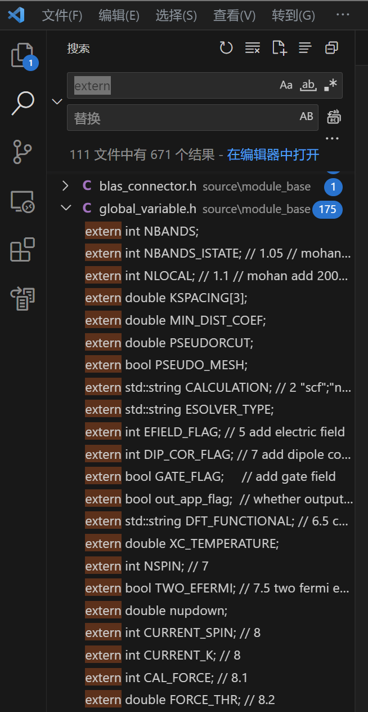
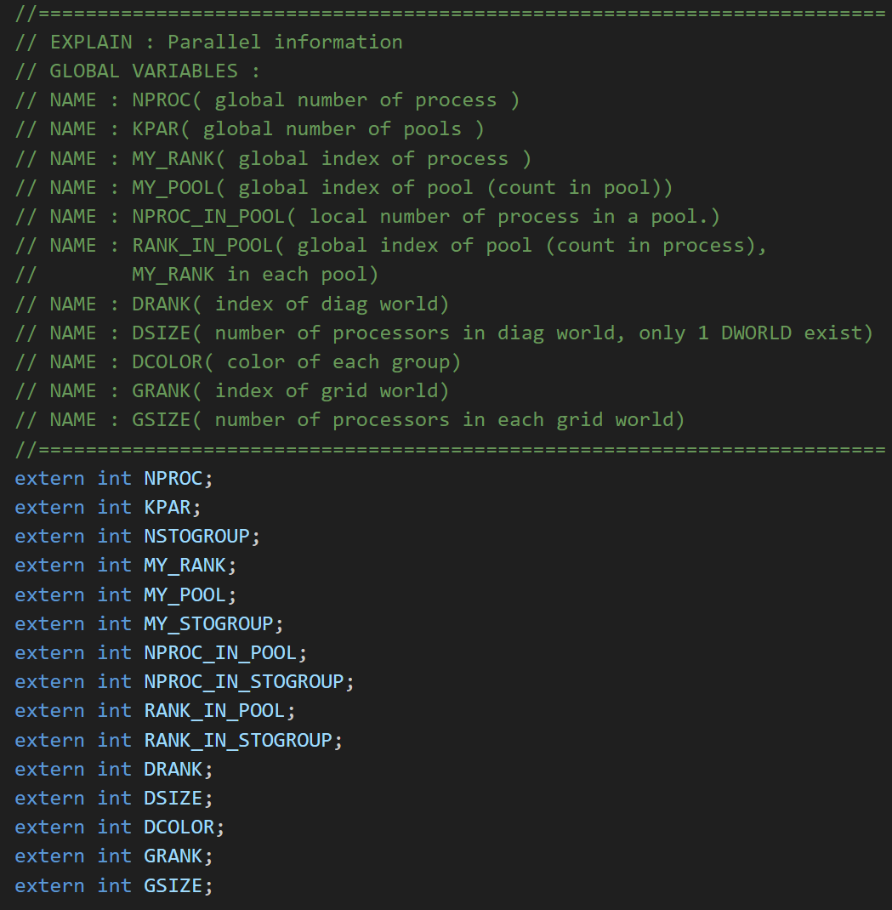
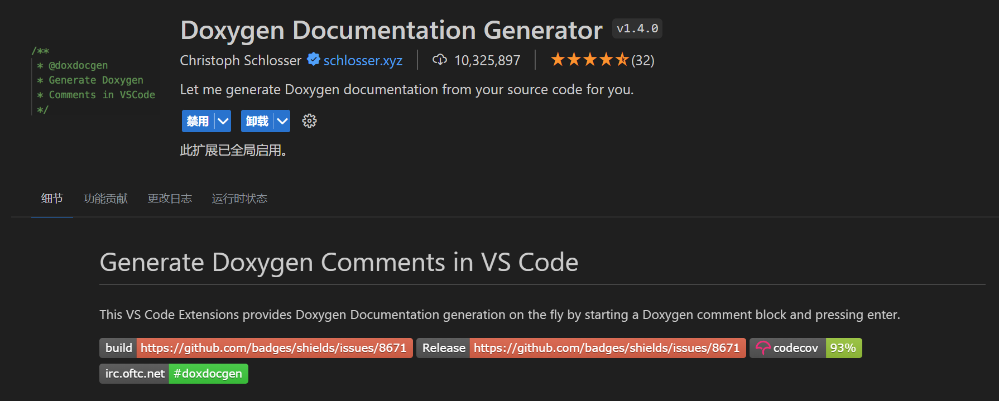
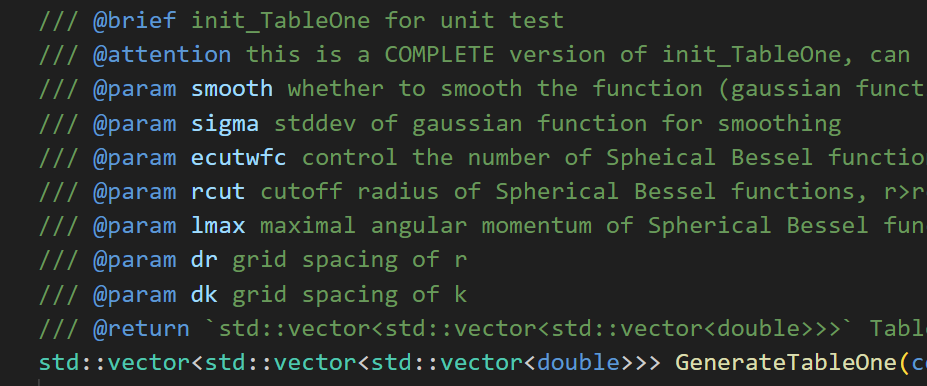

# Introduction to ABACUS: Path to PW calculation - Summary 1

<strong>作者：黄一珂，邮箱：huangyk@aisi.ac.cn；金祖鑫，邮箱：jinzx@aisi.ac.cn</strong>

<strong>审核：陈默涵，邮箱：mohanchen@pku.edu.cn</strong>

<strong>飞书链接：[Introduction to ABACUS: Path to PW calculation - Summary 1](https://xmywuqhxb0.feishu.cn/docx/HIEudrn2foKcCOxagiKcev6Dnmb)</strong>

> 🏮<strong>写在前面</strong>
> 经过 Introduction to ABACUS: Path to PW calculation 的 Part1 到 5，我们已经阅读过上百行程序。在继续之前，有必要将已经解读过的内容再次就重点进行回顾，并凝练和一定程度的抽象。牢记本系列内容组织的两原则：
>
> 1. 不脱离代码——避免读者看完手册后对代码没有一丁点概念
> 2. 不堆砌代码解释——避免平庸的代码解释，努力兼顾拉近读者和代码距离的同时，做到提纲挈领，不逐行复制代码后进行停留在代码语义上的解释

# 主题 1：dataflow

## 全局变量

不仅在上篇（[Part 5](develop-path5.md)）的最后，在 k 点分发时我们看到了在 `GlobalC` 中声明为 `extern` 的 `Parallel_Kpoints` 类对象 `Pkpoints`，在很多地方会被直接调用的 `UnitCell` 类对象 `ucell`，以及实际上最一开始看到的 `Input` 类对象 `INPUT`，也被声明为 `extern`。



`extern` 标识变量的好处(1)是跨文件/跨模块可用，以至于可以尽量缩减每个函数的形参表体积，(2)维持变量的唯一性，若又有其他变量具有相同名字，则编译阶段无法通过。但缺点是 `extern` 变量可能被修改，修改后则所有用到该 `extern` 变量的地方均受影响。另外 `extern` 的使用不当可能会(1)破坏封装性，为函数、变量、类、模块带来深度耦合，为之后的开发工作带来困难，(2)带来异常大的程序运行内存开销——因为有些变量确实可以具有短于整个程序的生命周期。

另一方面，如果有 `extern` 变量的生命周期和整个程序相同，可能给开发者带来困难：判断其何时何阶段具有何值就更有难度。

## 输入文件读取

综合前 5 篇介绍的内容，结合 ABACUS workflow 的赋值顺序，将有关的全局变量总结如下：

# 主题 2：分发存储

## 格点分发

在 [Part 4](develop-path4.md)，我们解读过 ABACUS 关于实空间格点与倒空间格点的分发策略。我们需要重新<strong>确定所分发的产物是什么</strong>。

实际上，在实空间进行积分的量基本都和电荷密度$$\rho$$有关，因此格点数量实际通过 ecutrho 来控制。同时考虑到 FFT 的维数问题，因此基本要求是实空间和倒空间格点数目完全一致（除去 `gamma_only` 情况），即

```cpp
this->fftnx = this->nx;
this->fftny = this->ny;
this->fftnz = this->nz;
```

### 实空间格点（[link](https://ucoyxk075n.feishu.cn/docx/R2b5dB0jKoMLwGxJERDcYpfanUb#JM21dgJZOoUBxPxp43mcprzInCb)）

实空间格点的分发策略分两步：

1. xyz 三维实空间沿 z 轴切片
2. 切片按照先按 processors 均分，若有余则再按顺序分配

实空间格点划分后在 `PW_Basis` 类中，如下成员变量被赋值：

| PW_Basis 类内数据成员 | 变量意义                                                           |
| ---------------------- | ------------------------------------------------------------------ |
| `this->numz`           | 列表，每个 processor 所分得 xy 平面数量                            |
| `this->nplane`         | 当前 processor 所分得 xy 平面数量                                  |
| `this->startz`         | 列表，每个 processor 分得 xy 平面后，所具有平面沿 z 方向的起始索引 |
| `this->startz_current` | 当前 processor 分得 xy 平面后，所具有平面沿 z 方向的起始索引       |
| `this->nrxx`           | 当前 processor 分得实空间格点数量                                  |

因此实空间的格点分发对于每个 processor 来说，能够特征识别的仅仅是 `this->nplane` 和 `this->startz_current`，主要为以上两量具有特征，且真正进行运算时，可以根据 `this->startz_current` 来分配数据（作为结果地，`this->nrxx` 是 processor 具有的实空间格点数）。

可以预想，对于三维空间的数据，可以以 `this->startz_current` 为依据分配具有数据的格点给不同 processor，也可使用一个 processor，访问 `this->startz` 数组来实现三维空间格点数据在 processor 间的分发。

### 倒空间格点（[link](https://ucoyxk075n.feishu.cn/docx/R2b5dB0jKoMLwGxJERDcYpfanUb#PyVAdzA0xoYGdqxQgAucmNrznWU)）

倒空间的格点分发策略分两步：

1. 首先在 ecutrho 划定倒空间球壳（我们约定，以后简称“ecutrho/ecutwfc 球壳”）内沿 z 方向划分出不同数量的“棍子”，即每根“棍子”包含一定数量的相同(x,y)而不同 z 的倒空间格点
2. 将“棍子”长度按照降序排列后，按照“当前所有 processors 中具有最小‘棍子’累计高度的，优先分配”为原则进行分发

倒空间格点划分后在 `PW_Basis` 类中，如下成员变量被赋值：

| PW_Basis 类内数据成员 | 变量意义                                                                                                     |
| ---------------------- | ------------------------------------------------------------------------------------------------------------ |
| `this->startnsz_per`   | 每个包含“棍子”的 processor 其第一个 z-axis grid point 的编号，从 0 开始，跨 processor。                    |
| `this->npw`            | 当前 processor 分得平面波数量（亦即倒空间格点数量）                                                          |
| `this->npw_per`        | 列表，每个 processor 分得平面波数量（亦即倒空间格点数量）                                                    |
| `this->nst`            | 当前 processor 分得“棍子”数量                                                                              |
| `this->nst_per`        | 列表，每个 processor 分得“棍子”数量                                                                        |
| `this->nstnz`          | `this->nstnz = this->nst * this->nz`                                                                         |
| `this->npwtot`         | 平面波总数                                                                                                   |
| `this->fftixy2ip`      | 从“棍子”translated (x,y)-pair 到 processor index 的映射                                                    |
| `this->istot2ixy`      | 从“棍子”索引到非折叠倒空间折合坐标的映射                                                                   |
| `this->ig2isz`         | 从平面波的 processor 内索引，到其倒空间平移后 z 坐标的映射                                                   |
| `this->is2fftixy`      | 每个 processor 各有一份，建立从 procesor 内“棍子”索引到其折叠后倒空间 xy 平面折合坐标的映射                |
| `this->numg`           | 列表，从当前 processor 从实空间 z 方向格点/xy 平面到所有 processors 的倒空间 `sticks` 的映射数量               |
| `this->numr`           | 列表，当前 processor 从倒空间到所有 processors 所拥有 `this->numz`，即实空间 z 方向格点/xy 平面数量的映射数量 |
| `this->startg`         | 列表，`this->numg` 的从当前 processor 到所有 processor 的映射的起始索引                                       |
| `this->startr`         | 列表，`this->numr` 的从当前 processor 到所有 processor 的映射的起始索引                                       |
| `this->ig2igg`         | 从归约前平面波索引到归约后模长列表的索引的映射                                                               |
| `this->gg_uniq`        | 列表，归约后平面波数量                                                                                       |

由于倒空间格点的分发比较复杂，因此各个 processor 分得的格点，需要从 ecutrho 球壳中格点到 processor 进行 mapping，也需要方便地从 processor 中格点方便地知道其所对应（x,y,z）。

举例定义分发后的某倒空间格点为（ip, is, iz），其中 ip 为 index_processor，is 为 index_stick_processor，即在当前 processor 中“棍子”的索引，iz 为 index_z_stick，即在当前“棍子”中格点的索引（实际等价于 z 坐标的索引），则（😀 以下建立两坐标系的双向 1-1 映射过程可以出成思考题）：

（ip, is, iz）→（x, y, z）：ip 人为给定、`this->is2fftixy` 确定从（ip, is）到（x, y）映射，iz 则实际上可以直接换算——因为 ecutrho 球壳关于 z=0 平面上下对称。

（x, y, z）→（ip, is, iz）：`this->fftixy2ip` 确定 ip，在 ip 中得到 `this->nst`，再访问当前 processor 的 `this->is2fftixy`，核对（x, y），得到 is，然后转换 z 到 iz。

## k 点分发（[link](https://ucoyxk075n.feishu.cn/docx/RCLSd2Of5oughUxmVDZcBhmqnDe#X6MVdY6t4oAFcGxvVfIcMUmgnUh)）

k 点的分发策略分三步：

1. 按照用户给定方式生成 k 点：Gamma、Monkhorst-Pack、给定 k 点、k path
2. 通过确定的对称性，对所生成的 k 点进行对称变换，对 k 点数量进行归约
3. k 点先按 processor 均分，若有余则再按顺序分配

k 点分发后在 `K_Vectors` 类中，主要有如下成员变量被赋值：

| PW_Basis 类内数据成员 | 变量意义                                                         |
| ---------------------- | ---------------------------------------------------------------- |
| this->kvec_c           | 列表，当前 processor 分得 k 点的 Cartesian 坐标                  |
| this->kvec_d           | 列表，当前 processor 分得 k 点的 Direct 坐标                     |
| this->wk               | 列表，当前 processor 分得 k 点的权重                             |
| this->isk              | 列表，当前 processor 分得 k 点的 spin channel, 0: alpha, 1: beta |
| this->nks              | 当前 processor 分得 k 点的数量                                   |
| this->nkstot           | k 点总数                                                         |

因此 k 点分发直接获得 k 点坐标和对应权重，以及 spin channel 的标识。

# 开发初步尝试：doxygen 注释和单元测试

## 程序注释规范

### 现状介绍

诚然这个系列的文档是为让 ABACUS 新晋开发者更快熟悉 ABACUS 代码，清楚 ABACUS 中各个变量和功能可能声明、初始化和实现的位置，以及变量间的从属关系，但文档的发行速度和更新速度远慢于 ABACUS 新版本的开发。因为这一点，ABACUS 开发团队同时希望 ABACUS 的信息 self-contained，即在每个程序文件中都有足够详尽的关于当前文件内容的注释，以及其他可能需要的信息。

然而由于 ABACUS 的历史较长，ABACUS 的开发者也所属组织和单位众多，因此除了代码风格多样外，注释风格也十分多样。格式和缩写各异的注释使得代码整洁程度下降，因此代码主体的可读性降低，并且注释的可读性也难以保证。

目前在 ABACUS 中存在的代码注释风格按添加注释的位置分类主要包括两种：随行注释和 Section 注释。




然而，在头文件中添加 section 型注释可能会导致在 vscode 中讲注释显示在临近的第一个变量/函数上（如上图，会显示在 `NPROC` 上），而其他各变量和函数均保持未注释状态，此时在其他代码位置鼠标悬停时不会有注释显式。

### 基本注释原则

#### Doxygen 注释

ABACUS 现在推进 doxygen 格式的注释。Doxygen 注释在 vscode 中可以使用插件进行模板插入：




Doxygen 函数注释样例：

|  |  |
| ------------------------------------------- | ------------------------------------------- |

#### 若干注意事项

1. 对于某个类中数据成员和成员函数的注释，请添加在相应的头文件中，避免在源文件中添加此类注释。对于程序代码的注释则没有要求，只需保证清晰明了。
2. （对于头文件中添加的函数注释）特别对于一些 void 类型函数，形参表中变量既有输入也有输出的，在 `@param` 字段注明“[in]”或者"[out]"作为标识
3. `@brief` 字段尽量保证描述清晰且语言简洁，更多的内容可以添加在 `@details` 字段
4. 注意事项等可以添加在 `@attention` 字段

### 为了更平滑的开发和维护：扩展注释内容

#### 模块封装化注释

封装、继承和多态是包括 C++ 在内的高级编程语言的核心理念。良好的封装有助于保护程序运行的稳定性，同时有利于开发工作的开展。然而，封装不仅仅是局部而言对某个类的封装，更应该将封装的理念应用于整体的程序设计。程序整体组织层面的封装，有利于在程序因一定需求需大幅改变结构时，能够稳定运行而不出错，同时能够实现各部分的独立、高效开发。

现阶段 ABACUS 缺乏模块层级的注释，即对于某个模块（module）究竟需要传入哪些参数/物理量/性质，传出哪些参数/物理量/性质，是尚未总结和落实到文档中的方面。

#### 上游-下游函数注释

另一方面，除去 vscode 自身所包含的“查找所有引用”/“转到引用”的功能外，鼓励为函数添加注释时，添加 `@note` 字段，注明引用该函数的下游函数，即：考虑到通过 vscode“查看定义”，以及函数本身的调用方式可以方便查找到当前函数的上游函数，但在上游函数却较为困难获知被何下游函数调用。

注释下游函数有利于局部重构工作的开展。

## 单元测试

大型程序包含数量众多的函数，对 C++ 等支持 OOP 的语言来说，也包含更多的类等。保障程序中各函数的顺利和正确执行，是保障程序整体能够运行的基础。对于数值计算软件来说，除去正常运行测试外，之后也应包括数值精度测试，这一理念的前提是开发者具有数值计算软件的编程常识，如避免小数位数丢失、DivideZeroError、相减精度丢失等数值错误，同时也将推动 ABACUS 在精度方面进行一定数量的小范围重构，符合 2023 Q2 推行的“测试驱动开发（Test Driven Development, TDD）”理念。

### 单元测试的设计原则

1. 独立性：在设计和编写单元测试时，应当尽可能减少对其他部分函数的依赖，当作其他函数并未测试，因此可靠性不能保证。
2. 高覆盖：对于程序流程控制出现分支的情况，应酌情对所有分支进行全面覆盖，以保证所有分支的函数和运算都可以正常执行。
3. 自动：禁止出现 stdin 交互
4. 快速：因为仅需要测试函数是否正常运行，是否可以得到预期结果，因此需要尽可能避免使用需要高时间复杂度的计算方式，而是使用尽可能简单（可以 unphysical）的数据，尽可能快地得出结果，可以考虑对预期结果进行硬编码。

### 对 private 变量的访问

由于当前 ABACUS 代码的封装并不完善，部分函数声明为 private 却仍然需要测试。另一方面，getter 和 setter 函数在原则上应当是从外部直接访问私有变量的唯一方式，但在使用之前也需要进行有效性测试。考虑到这两点，我们不得不尝试访问 private 或 protected 变量和成员函数。目前而言 ABACUS 中对 private 变量访问的方式主要有两种：

1. `#define private public`，已知此种方式有一定情况不兼容<sstream>，从而导致无法编译通过。
2. 我们曾对访问 private 成员的方法进行过讨论，搜集到解决方案如下：[https://github.com/deepmodeling/abacus-develop/issues/2666](https://github.com/deepmodeling/abacus-develop/issues/2666)
   C++ 委员会有关于几种访问私有成员的方式及其讨论：http://www.gotw.ca/gotw/076.htm

### 更多细节补充

ABACUS 的单元测试依靠 Googletest 框架实现。关于 Googletest 的安装、单元测试的运行、单元测试的注释规范等，见：[ABACUS 测试者必知必会](https://dptechnology.feishu.cn/wiki/wikcnqfbpNCB3m4KTDvERnuWotd) 。

为保证本地机器的工作不受影响，建议单元测试的编译和进行在 Bohrium 平台进行。

## Fork and Pull request：在 ABACUS 上发布你的注释和单元测试，甚至更多！

### Fork 和 Pull request

Fork 是便于进行多人协作开发的机制，其“叉子”体现在：

1. 从待开发的软件仓库其软件的开发时间线创建时间线分支，即 Fork，到自己的仓库
2. 在自己的仓库进行的任何改动将不会直接影响到原程序的时间线，但可以通过代码改动比较，来尽可能无冲突地将多人的改动进行合并
3. 提交自己的改动，将自己 Fork 出的时间线和原有时间线进行合并的操作称为 Pull request (PR)

### 工作流示例 1

1. Fork ABACUS Github 仓库到自己的账号下


2. 在自己的 ABACUS 仓库选择同步到 Github Desktop


3. 在 Github Desktop 中选择自己的 ABACUS 仓库，之后选择在 Vscode 中打开


4. 在 Vscode 上进行代码修改，每一次改动的保存都会同步被 Github Desktop 记录


5. 重新编译、进行测试
6. 在 Github Desktop 里选择左下角“Commit to develop”，然后“Push origin”将代码改动 push 到自己的 ABACUS 仓库


7. Github Desktop 中选择打开自己的仓库，再次审核代码改动后创建 pull request，待自动代码编译检查通过与代码人工审核


# 附：如何在飞书中平滑地分享文档

## 权限简介

在进行文档写作前，请确定自己账号所在的组织（如深势科技“DP”或北京科学智能研究院“AISI”）。一般而言对于创建的文档，非本人外的访问均需要文档作者进行分享，或在其他地方获得文档链接后，其阅读权限需要向作者发送权限申请。根据作者对文档的开放程度，可以分别赋予可阅读、可编辑、可管理权限，其权限自由度由低到高。

然而对于组织外，一般无文档阅读权限。

## 无限制访问

为了解决这一问题，可以在文档管理中按照如下方式设置：

（电脑端）

打开文档，在文档右上角依次选择：


（手机端）


# 系列链接

INPUT 读取：[Introduction to ABACUS: Path to PW calculation - Part 1](develop-path1.md)

STRU 读取：[Introduction to ABACUS: Path to PW calculation - Part 2](develop-path2.md)

赝势读取：[Introduction to ABACUS: Path to PW calculation - Part 3](develop-path3.md)

平面波并行与分发：[Introduction to ABACUS: Path to PW calculation - Part 4](develop-path4.md)

k 点并行与分发：[Introduction to ABACUS: Path to PW calculation - Part 5](develop-path5.md)

下篇：[Introduction to ABACUS: Path to PW calculation - Part 6](develop-path6.md)
