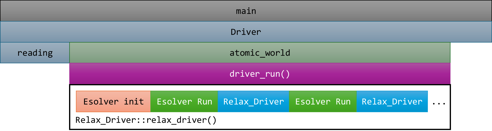
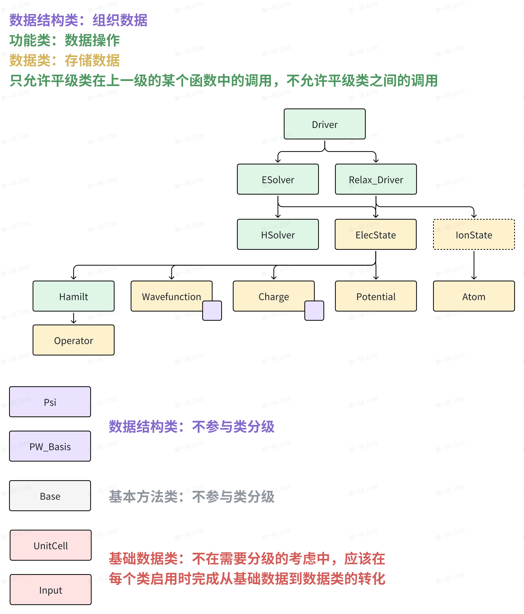

# Introduction to ABACUS: Path to PW calculation - Summary Final

<strong>作者：黄一珂，邮箱：huangyk@aisi.ac.cn</strong>

<strong>审核：陈默涵，邮箱：mohanchen@pku.edu.cn</strong>

<strong>飞书链接：[Introduction to ABACUS: Path to PW calculation - Summary Final](https://xmywuqhxb0.feishu.cn/docx/Of6wdzlyeoBXd7x9AxDcxUoCn3b)</strong>

> 📃<strong>写在前面</strong>
>
> 1. 不脱离代码——避免读者看完手册后对代码没有一丁点概念
> 2. 不堆砌代码解释——避免平庸的代码解释，努力兼顾拉近读者和代码距离的同时，做到提纲挈领，不逐行复制代码后进行停留在代码语义上的解释

# Flow：ABACUS 里的工作流

回忆我们的起点，从 `main()` 函数出发，经过 MPI 初始化后到达 `Driver`，然后到 `Driver_run()`。是 `Driver_run()` 唤起了整个程序的实际运行部分，其实迄今为止我们所看到的所有“故事”，都发生在 `Driver_run()` 的 `ESolver::init()`，以及 `Relax_Driver::run()`。

我们同样也拥有更低层级的 driver，比如 `ESolver_KS::Run()` 函数，实际上 ESolver 的 `Run()` 函数只关心 SCF，即只关心“求得能量”，尽管有另一个相似命名的模块，`HSolver`，其关注的范围其实更小：只关注 Hamiltonian 矩阵的对角化。

因此我们可以画出一个分层级的 workflow，在不同 workflow 上引导的则是 driver：



另有 `Run_md` 和 `Relax_Driver` 是平行关系，但由于我们目前仍未正式涉及 MD 的相关代码，因此不在上图中画出。

# Interface：串联模块的组织模式

## Inteface 设计的必要性

遗憾的是，`GlobalV` 和 `GlobalC` 虽然提供了“参数上云、用时下载”这一概念并方便了对待模拟体系的描述相关参数传递和热点函数调用，但对于单元测试来讲却并非好的设计，尤其对于 `GlobalC`。我们可能在编写单元测试（以确定模块功能正常运作）时，会遇到对过多变量进行初始化的问题，例如我们只想使用 `UnitCell` `GlobalC::ucell`，include `GlobalC` 的头文件后，却发现了诸多的“`undefined reference to Parallel_Kpoints`”等问题。

从设计上来讲，这是发生了类间耦合，尽管这种耦合可能在设计之初未被预计到。因此为了能够尽可能大地减少基于 `GlobalC` 的类间耦合，更加提倡不使用 `GlobalC`，而是从具体的某个类被定义的地方设计接口（指针进行调用），如对于一个类 `illustrate_interface` 的函数 `illustrative_f`，我们如果需要使用 `UnitCell GlobalC::ucell`，不写成：

```cpp
void illustrate_interface::illustrative_f()
{
....
    std::cout << "The address of ucell: " << &(GlobalC::ucell) << std::endl;
....
}
```

而是在 `illustrate_interface` 类中创建一个 interface：

```cpp
class illustrate_interface
{
    private:
        UnitCell* p_ucell;
};
```

该 interface 可以在构造函数中被指定，也可以使用相应 setter 函数。之后对 `illustrative_f` 函数的编写就成为：

```cpp
void illustrate_interface::illustrative_f()
{
....
    std::cout << "The address of ucell: " << this->p_ucell << std::endl;
....
}
```

如此一来使得实际所使用的 `GlobalC` 中类（比如 `UnitCell`）和其他类解耦开。

## （单元测试）尽情 mock 你想要使用的类

假设你想要在单元测试中使用一些函数，但你 include 实现那个函数的 cpp 文件后发现出现了很多棘手的 `undefined reference to xxx`，应该怎么办？又或者在你 include 的类中有其他的类对象作为成员，然后编译器提示报错 `undefined reference to [class]::[class]()`，怎么办？

除了可以尝试使用 gmock 这个 googletest 提供的函数框架外，第二种思路只需要记住一件事：<strong>因为你只 include 了头文件，所以你可以实现当中的任何函数，而非必须包含进来它原本的实现（即所对应的原本的cpp文件）。</strong>

如果类 `Parallel_Grid` 对你无关紧要，但是确实在某个类或者命名空间中出现了这个类对象的声明，那么你可以在单元测试 cpp 文件中对它的构造函数和析构函数进行定义：

```cpp
Parallel_Grid::parallel_grid(){ }
Parallel_Grid::~parallel_grid(){ }
```

然后避免再和原本的 cpp 文件一同进行编译，即在 CMakeLists.txt 的 `SOURCE` 中或 `LIBS` 中认真查看是否还包含该类的原始定义。如果有所遗漏，则会出现 `multiple definition of xxx(), ..., first defined here ...` 的编译报错，即同一签名函数拥有多重定义。

> 🤔<strong>思考时间</strong>
> Read unittest module_io/test/bessel_basis_test.cpp and module_io/test/CMakeLists.txt, try to understand dependencies and how they are eliminated by redefinition of those functions whose declarations are included.

# 层级与功能：设计理念的思考

相较于 `GlobalC`，`GlobalV` 则是更成熟/成功的一个类，其部分原因为保持了功能划分意义上的单纯性：data-carrier。

在实际编程过程中，除了将类进行明确的功能区分外，还可以按照类的实际存储数据类型和函数的功能与密度进行二次划分，例如对于 `ESolver` 和 `Relax_Driver`（或 `Driver` 类），他们本身并不涉及到直接和被模拟体系相关的数据存储，即 ESolver 等类是程序流程控制的实现。

另一种类是我们之前介绍过的 `ModulePW::PW_Basis_K` 和 `PW_Basis`，其存储了平面波的数量和实空间、倒空间分发信息，以及 `psi::Psi` 类，存储了平面波基波函数的相关信息，并且基于这种类的二次划分，即该类被称为“数据载体（data carrier）”类，`psi::Psi` 进行了异构化支持，用于在 GPU 和 CPU 进行异构计算，同理，`Charge_Mixing` 存储数据的类也是 data-carrier。

当然在第一性原理软件中出现最多的还是直接和功能相关，即“功能类”。最基本地，我们有 module_relax，module_hsolver 等。这些类只提供在整个模拟流程中的具体实现方法，本身并不（应该）存储大量数据，而只应对所使用方法等信息有所基本描述即可。

因此可以按照上述方法将现有主要类按照如下关系进行划分：



。前文提到过关于接口设计的相关方法，然而如果接口以及链接接口的场所（即发生链接的函数所述类）不进行精心设计，则仍然无法保证程序具有清晰结构，从而为程序主体的运行带来隐患，单元测试的编写带来困难，“单元编译”变得更加难以实现。

举例对于 `Hamilt` 类，实际上提供 Hamiltonian 和相关算符，则其必然按照层级从上往下依次从 `ESolver` 和 `Hamilt`，`Operator` 类进行初始化，之后返回 `ESolver`，执行下一项动作，而不是在其他地方进行 `Hamilt` 对象初始化，然后将可能的数据的类在 `Hamilt` 进行直接链接，这无疑加重了类间耦合关系。

# 效率与正确性：并行与异构化编程

## minimize data exchange

由于 OMP 和 MPI 的默认内存共享机制不同，MPI 可能会需要在 processor（进程）间收发数据。然而频繁进行数据的收发会带来明显的时间运行成本，因此合理设计 MPI processor 之间收发的具体数据，最小化数据传输规模，同样是并行编程的一个重要考虑方面。

对于异构编程同样如此。在 `Charge_Mixing` 类中，由于电荷密度、动能密度和密度矩阵的数据存储规模较大，频繁在 CPU 和 GPU 之间进行数据交换过于浪费时间，因此三个量的存储也进行异构化编程，具体实现为 `container::Tensor` 类。关于该类的实现，请自行阅读代码（[link](https://github.com/deepmodeling/abacus-develop/tree/develop/source/module_base/module_container/ATen/core)）。

## 全局单例（singleton）

OMP 的粒度为线程（thread），线程间共享内存，因此为避免共享内存的各线程同时创建变量，并且顺序不同地进行读写，造成预期之外的结果时，可以使用全局单例模式进行对象的创建，以下方式称为 Mayers' Singleton Pattern：

```cpp
#include <stdio.h>
 struct singleton_t
 {
     static singleton_t& instance() 
     {
          static singleton_t instance;
          return instance;
     } // instance

     singleton_t(const singleton_t &) = delete;
     singleton_t& operator = (const singleton_t &) = delete;

     private:
          singleton_t() {}
          ~singleton_t() {}

     public:
          void out(){ printf("out\n"); } 
}; // struct singleton_t

int main()
{
     singleton_t::instance().out();
     return 0;
}
```

该类中，拷贝构造函数和默认构造函数均被删除或隐藏，亦无法使用“=”运算符进行对象的传递。

---

> 🤔<strong>“家庭作业”</strong>
> Read function `Atom::bcast_atom()`, write a code to support distribution of 3-layered `std::vector` (e.g.: `std::vector<std::vector<std::vector<double>>>`)
> Only a little bit challenging :)

# 系列链接

上篇：[Introduction to ABACUS: Path to PW calculation - Part 11](develop-path11.md)

下篇：🚧（施工中）
