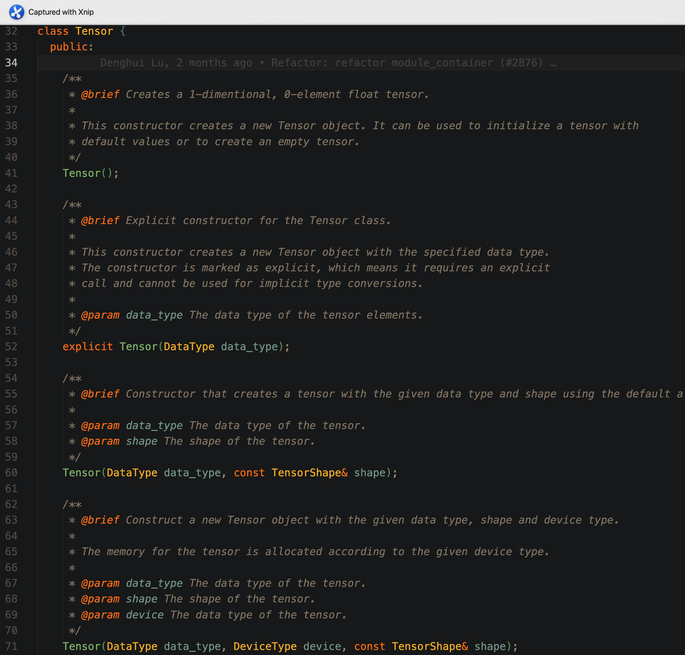

# Tensor 类文档 1：构造和使用说明

<strong>作者：路登辉，邮箱：denghuilu@pku.edu.cn</strong>

<strong>审核：陈默涵，邮箱：mohanchen@pku.edu.cn</strong>

<strong>最后更新时间：2025/03/02</strong>

# 一、背景介绍

在 ABACUS 项目中，我们引入了一种新的 `Tensor` 容器，其目的是为了统一底层数据容器并在此基础上构建一系列算子以执行复杂的计算操作。这一设计的引入基于以下两个主要考虑：

- <strong>框架层面的考虑：</strong>在当今的机器学习和深度学习领域，几乎所有先进的框架，如 PyTorch 和 TensorFlow，都将张量作为基本的数据单元。这些框架的 `Tensor` 对象不仅支持复杂的数学运算和自动梯度计算，还能在不同的计算设备（例如 CPU 和 GPU）间灵活地转移数据和执行计算任务。我们的 `Tensor` 类借鉴了流行的深度学习框架如 PyTorch 和 TensorFlow 中的张量实现。这种设计选择使得该类不仅适用于传统的科学计算，也保留了将来集成到现代的机器学习框架中的可能性。未来如有需要也可在这一框架下更方便的引入自动微分算法，进一步完善 Tensor 容器。
- <strong>科学计算程序的视角：</strong>在科学计算，尤其是密度泛函理论（DFT）的应用中，核心挑战在于处理和操作大量的数值数据。`Tensor` 类作为一种多维数据结构，在这方面提供了强大而灵活的支持。采用 `Tensor` 数据类型带来了以下几个显著优势：

  - 统一底层数据容器：通过统一底层容器，我们显著提升了代码的可读性和可维护性。
  - 多平台计算支持：`Tensor` 类设计支持多种计算设备，并且易于扩展以适应新的计算设备。
  - 多精度计算的兼容性：支持多精度计算，增强了计算的灵活性和适应性。

综上所述，`Tensor` 容器在 ABACUS 项目中有助于增加计算的效率和灵活性，提升代码可读性和稳定性。

# 二、Tensor 对象

## 2.1 代码目录

代码目录位于 deepmodeling 下的 abacus-develop 仓库:

[abacus-develop/source/module_base/module_container at develop · deepmodeling/abacus-develop](https://github.com/deepmodeling/abacus-develop/tree/develop/source/module_base/module_container)

```bash
[denghui@LuDh-4090:module_base]$ tree -d module_container 
module_container            #代码位置，位于module_base目录下
├── ATen                    #ATen/Array-Tensor 存储了Tensor容器的方法
│   ├── core                #存储了Tensor对象的核心方法，比如reshape，tensor_buffer以及Tensor对象的定义
│   ├── kernels             #定义了异构计算的函数，比如矩阵乘法gemm/gemv等等
│   │   ├── cuda            #提供了异构计算函数所需的CUDA实现
│   │   ├── rocm            #提供了异构计算函数所需的ROCM实现
│   │   └── test            #针对定义的异构计算函数的单元测试
│   └── ops                 #针对Tensor对象，定义了一系列算子
│       └── test            #算子的单元测试
├── base                    #Tensor无关的基础函数
│   ├── core                
│   ├── macros              #常用的宏函数声明
│   ├── third_party         #第三方软件，比如BLAS等的声明
│   │   └── backward-cpp    #提供backtrace的实现
│   └── utils           
└── test                    #base模块的单元测试
```

## 2.2 概述

`Tensor` 类是一个基础类，用于处理不同数据类型和形状的张量，它提供了基本的张量操作功能以及异构计算的支持。

### 2.2.1 头文件引用

该类依赖以下头文件：

```cpp
#include <base/core/allocator.h>         // 存储管理模块
#include <ATen/core/tensor_types.h>      // 自定义类型
#include <ATen/core/tensor_shape.h>      // Tensor维度管理
#include <ATen/core/tensor_buffer.h>     // 管理Tensor对象的数据存储
#include <ATen/core/tensor_accessor.h>   // Tensor对象的访问函数
#include <ATen/kernels/memory.h>         // 内存操作函数
#include <base/macros/macros.h>          // 宏函数定义
```

### 2.2.2 类定义

`Tensor` 类的定义在 container 名称空间中，不是模板类：

```cpp
namespace container {

class Tensor {
    // 成员变量和方法定义...
};

}
```

## 2.3 公共方法和属性

以下是 `Tensor` 类的一些主要方法：

### 2.3.1 构造函数



- `Tensor()`：无参数构造函数，构造一个空的 Tensor 对象；
- `Tensor(DataType data_type)`：接受给定数据类型作为参数，构造一个空的 Tensor 对象；
- `Tensor(DataType data_type, TensorShape shape)`：接受数据类型和形状作为参数，此构造函数为 Tensor 对象分配存储空间，大小和 shape 的维度相匹配，存储在 CPU 上；
- `Tensor(DataType data_type, DeviceType device, const TensorShape& shape)`：接受数据类型，计算设备参数和形状作为参数，此构造函数为 Tensor 对象分配存储空间，大小和 shape 的维度相匹配，存储在 device（这里的 device 可以为 CPU 也可以为 GPU 或者其他支持的设备）上；
- 此外还定义了相应的拷贝构造函数和移动构造函数，这里就不一一展示

### 2.3.2 成员方法

- `GetAllocator(DeviceType device)`：根据设备类型获取存储分配器；
- `zero()`：将张量的所有元素设置为 0；
- `reshape(TensorShape shape)`：改变张量的形状；
- `resize(const TensorShape& new_shape)`：调整张量的大小；
- `CopyFrom(const Tensor& other)`：从另一个张量复制数据；
- `CopyFrom(const Tensor& other, const TensorShape& shape)`：设置特定的形状，并从另一个张量复制数据；
- `AllocateFrom(const Tensor& other, const TensorShape& shape)`：根据另一个张量和给定形状分配内存；
- `sync(const Tensor& rhs)`：同步两个张量的数据；
- `template <typename T> T* data() const`：直接访问 Tensor 数据的指针接口；
- 此外也重载了输出运算符 `<<`，现在可以直接使用 cout 输出。

## 2.4 示例用法

以下是 Tensor 对象的构造函数单元测试，可供参考：

```cpp
TEST(Tensor, Constructor) {
    // Test constructor with default allocator
    container::Tensor t1(container::DataType::DT_FLOAT, container::TensorShape({2, 3}));
    EXPECT_EQ(t1.data_type(), container::DataType::DT_FLOAT);
    EXPECT_EQ(t1.device_type(), container::DeviceType::CpuDevice);
    // EXPECT_EQ(t1.shape().dims(), std::vector<int64_t>({2, 3}));
    EXPECT_EQ(t1.NumElements(), 6);

#if __CUDA || __ROCM
    // Test constructor with specified device type
    container::Tensor t2(container::DataType::DT_DOUBLE, container::DeviceType::GpuDevice,
                         container::TensorShape({3, 4}));
    EXPECT_EQ(t2.data_type(), container::DataType::DT_DOUBLE);
    EXPECT_EQ(t2.device_type(), container::DeviceType::GpuDevice);
    EXPECT_EQ(t2.shape().dims(), std::vector<int64_t>({3, 4}));
    EXPECT_EQ(t2.NumElements(), 12);
#endif

    // Test copy constructor
    container::Tensor t3 = t1;
    EXPECT_EQ(t3.data_type(), container::DataType::DT_FLOAT);
    EXPECT_EQ(t3.device_type(), container::DeviceType::CpuDevice);
    // EXPECT_EQ(t3.shape().dims(), std::vector<int64_t>({2, 3}));
    EXPECT_EQ(t3.NumElements(), 6);
    EXPECT_NE(t3.data(), t1.data());

    // Test reference constructor
    std::vector<float> vec{1.0, 2.0, 3.0};
    container::TensorMap t4(&vec[0], container::DataType::DT_FLOAT, container::DeviceType::CpuDevice,
                            container::TensorShape({1, 3}));
    EXPECT_EQ(t4.data_type(), container::DataType::DT_FLOAT);
    EXPECT_EQ(t4.device_type(), container::DeviceType::CpuDevice);
    // EXPECT_EQ(t4.shape().dims(), std::vector<int64_t>({1, 3}));
    EXPECT_EQ(t4.NumElements(), 3);
    EXPECT_EQ(t4.data(), vec.data());
}
```

单元测试中包含了所有 Tensor 类方法的测试，提供了使用参考，可以在这里查看：[abacus-develop/source/module_base/module_container/test/tensor_test.cpp at develop · deepmodeling/abacus-develop](https://github.com/deepmodeling/abacus-develop/blob/develop/source/module_base/module_container/test/tensor_test.cpp) .

## 2.5 其他待办事项和备注

- 添加日志系统；
- 添加异常处理系统；
- 重构 CMake 系统，使得 Tensor 对象可以独立编译。

# 三、算子（OP）的构建和使用

有了 Tensor 对象之后，如何基于 Tensor 对象进行相应的运算操作呢？这里我们引入算子的概念。

## 3.1 算子的声明

以加法操作举例，其声明定义在文件 [linalg_op.h](https://github.com/deepmodeling/abacus-develop/blob/develop/source/module_base/module_container/ATen/ops/linalg_op.h) 中，我们以其中的 add_op 举例，其定义如下所示：

```cpp
/**
 * @brief A functor to perform add operation on a Tensor.
 *
 * This functor adds two Tensors element-wise, resulting in a new Tensor with the same
 * shape as the input Tensors.
 */
struct add_op {
    /**
     * @brief Perform add operation on the input Tensors.
     *
     * This function adds two Tensors element-wise, resulting in a new Tensor with the same
     * shape as the input Tensors.
     *
     * @param x The first input Tensor.
     * @param y The second input Tensor.
     * @param z The output Tensor that will hold the result of the add operation.
     *          It must have the same shape as the input Tensors.
     */
    void operator()(
        const Tensor& x,
        const Tensor& y,
        Tensor& z);

    template <typename T>
    void operator()(
        const T& alpha,
        const Tensor& x,
        const T& beta,
        const Tensor& y,
        Tensor& z);
};
```

可以看到，这个结构体 `add_op` 的声明中重载了括号运算符，一共提供了两种加法操作：

```cpp
// z = x + y
void operator()(
    const Tensor& x,
    const Tensor& y,
    Tensor& z);
```

以及：

```cpp
// z = alpha * x + beta * y
template <typename T>
void operator()(
    const T& alpha,
    const Tensor& x,
    const T& beta,
    const Tensor& y,
    Tensor& z);
```

## 3.2 算子的实现

对应的 add_op 的实现位于 [linalg_op.cpp](https://github.com/deepmodeling/abacus-develop/blob/develop/source/module_base/module_container/ATen/ops/linalg_op.cpp) 中：

```cpp
void add_op::operator()(const Tensor &x, const Tensor &y, Tensor &z) {
    // check the shape
    REQUIRES_OK(x.shape() == y.shape() && x.shape() == z.shape(),
                "add: the shape of the two input Tensors must be the same")
    REQUIRES_OK(x.data_type() == y.data_type() && x.data_type() == z.data_type(),
                "add: the data type of the two input Tensors must be the same")
    REQUIRES_OK(x.device_type() == y.device_type() && x.device_type() == z.device_type(),
                "add: the device type of the two input Tensors must be the same")
    // allocate memory for the result
    TEMPLATE_ALL_LAMBDA_2(x.data_type(), x.device_type(), [&](){
        T_ alpha = static_cast<T_>(1);
        T_ beta  = static_cast<T_>(1);
        kernels::add<T_, DEVICE_>()(
            x.NumElements(), alpha, x.data<T_>(), beta, y.data<T_>(), z.data<T_>());
    })
}

template<typename T>
void add_op::operator()(const T& alpha, const Tensor &x, const T& beta, const Tensor &y, Tensor &z) {
    // check the shape
    REQUIRES_OK(x.shape() == y.shape() && x.shape() == z.shape(),
                "add: the shape of the two input Tensors must be the same")
    REQUIRES_OK(x.data_type() == y.data_type() && x.data_type() == z.data_type(),
                "add: the data type of the two input Tensors must be the same")
    REQUIRES_OK(x.device_type() == y.device_type() && x.device_type() == z.device_type(),
                "add: the device type of the two input Tensors must be the same")
    // allocate memory for the result
    TEMPLATE_ALL_LAMBDA_2(x.data_type(), x.device_type(), [&](){
        kernels::add<T, DEVICE_>()(
            x.NumElements(), alpha, x.data<T>(), beta, y.data<T>(), z.data<T>());
    })
}
```

针对 add_op 的两个运算函数分别给出实现：可以看到其实现进一步依赖于外部的 kernels:add 结构体，该结构体为模板类，TEMPLATE_ALL_LAMBDA_2 宏函数是事先封装的函数，可以通过它得到此时应当调用的结构体参数。

关于 kernels::add 的声明和实现可以在 container/ATen/kernels 目录下的 [linalg.h](https://github.com/deepmodeling/abacus-develop/blob/develop/source/module_base/module_container/ATen/kernels/linalg.h) 以及 [linalg.cpp](https://github.com/deepmodeling/abacus-develop/blob/develop/source/module_base/module_container/ATen/kernels/linalg.cpp) 中找到。kernels 目录结构可以参考：[ABACUS 代码存放规范 · GitBook](https://mcresearch.github.io/abacus-user-guide/develop-rule.html) 文档。

## 3.3 算子的使用

算子的使用同样可以参照对应的单元测试：[linalg_op_test.cpp](https://github.com/deepmodeling/abacus-develop/tree/develop/source/module_base/module_container/ATen/ops/test)。

同时以重构后的 CG 方法中的 orthogonal_gradient 函数举例如下：

其前后对比如下：

```cpp
template<typename T, typename Device>
void DiagoCG<T, Device>::orthogonal_gradient(hamilt::Hamilt<T, Device> *phm_in, const psi::Psi<T, Device> &eigenfunction, const int m)
{
    if (test_cg == 1) {
        ModuleBase::TITLE("DiagoCG", "orthogonal_gradient");
    }
    // ModuleBase::timer::tick("DiagoCG","orth_grad");

    phm_in->sPsi(this->gradient, this->scg, (size_t)this->dim);
    // int inc = 1;
    //<<<<<<<<<<<<<<<<<<<<<<<<<<<<<<<<<<<<<<<<<<<<<<<<<<<<<<<<<<<<<<<<<<<<<<
    // haozhihan replace 2022-10-07
    gemv_op<T, Device>()(
        this->ctx,
        'C',
        this->dim,
        m,
        this->one,
        eigenfunction.get_pointer(),
        this->dmx,
        this->scg,
        1,
        this->zero,
        this->lagrange,
        1);

    Parallel_Reduce::reduce_pool(this->lagrange, m);

    // (3) orthogonal |g> and |scg> to all states (0~m-1)
    //<<<<<<<<<<<<<<<<<<<<<<<<<<<<<<<<<<<<<<<<<<<<<<<<<<<<<<<<<<<<<<<<<<<<<<
    // haozhihan replace 2022-10-07
    gemv_op<T, Device>()(
        this->ctx,
        'N',
        this->dim,
        m,
        this->neg_one,
        eigenfunction.get_pointer(),
        this->dmx,
        this->lagrange,
        1,
        this->one,
        this->gradient,
        1);

    gemv_op<T, Device>()(
        this->ctx,
        'N',
        this->dim,
        m,
        this->neg_one,
        eigenfunction.get_pointer(),
        this->dmx,
        this->lagrange,
        1,
        this->one,
        this->scg,
        1);
}
```

```cpp
template<typename T, typename Device>
void DiagoCG_New<T, Device>::orth_grad(
    const ct::Tensor& psi, 
    const int& m, 
    ct::Tensor& grad, 
    ct::Tensor& scg,
    ct::Tensor& lagrange)
{
    this->spsi_func_(grad, scg); // scg = S|grad>
    ct::EinsumOption option(
        /*conj_x=*/true, /*conj_y=*/false, /*alpha=*/1.0, /*beta=*/0.0, /*Tensor out=*/&lagrange);
    lagrange = ct::op::einsum("ij,i->j", psi, scg, option);
    // TODO: add Tensor operators for communications
    Parallel_Reduce::reduce_pool(lagrange.data<T>(), m);

    // (3) orthogonal |g> and |scg> to all states (0~m-1)
    option = ct::EinsumOption(
        /*conj_x=*/false, /*conj_y=*/false, /*alpha=*/-1.0, /*beta=*/1.0, /*Tensor out=*/&grad);
    grad = ct::op::einsum("ij,j->i", psi, lagrange, option);

    option = ct::EinsumOption(
        /*conj_x=*/false, /*conj_y=*/false, /*alpha=*/-1.0, /*beta=*/1.0, /*Tensor out=*/&scg);
    scg = ct::op::einsum("ij,j->i", psi, lagrange, option);
}
```

# 四、总结

总结 Tensor 对象的引入具有如下的主要作用：

- 统一底层容器：

  - Tensor 对象的构造函数中可以传递 DataType 以及 DeviceType 作为参数控制该对象实例化的精度（例如 int,float,double,complex<float>以及 complex<double>等等）和设备（DEVICE_CPU 以及 DEVICE_GPU）等等。这确保了 Tensor 对象对于广泛的数据类型和计算设备提供了支持，能够适应于 ABACUS 的底层容器需求；
  - Tensor 对象中封装了对于裸指针的操作，包括数据访问，内存分配等等现在都基于规范统一的接口，有利于代码维护
- 使用算子（op）的形式来支持异构计算：

  - 通过定义算子（op）的形式，将基于 Tensor 的逻辑运算从主分支分离出去，主分支代码现在只需要调用一个统一的接口即可实现对应精度以及对应计算设备的逻辑运算。
- 保留了后续扩展的可能性

  - 参照 Torch 的实现，可以很方便的在现有的架构基础上引出包括自动微分等等框架的支持。
