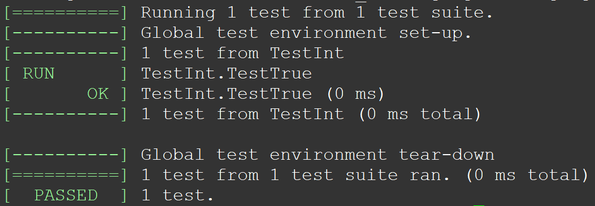
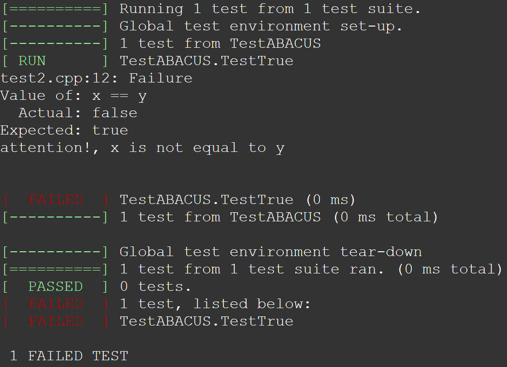
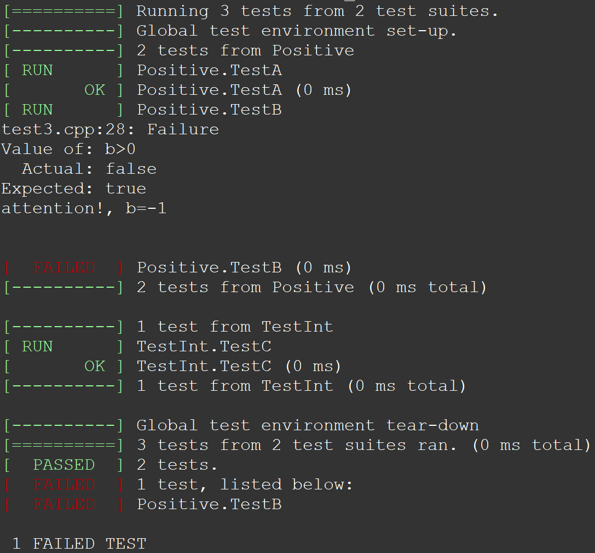

# ABACUS 中的测试（二）：测试工具 gtest

<strong>作者：彭星亮，邮箱：pxlppq007@163.com；赵天琦，邮箱：zhaotq13@tsinghua.org.cn</strong>

<strong>审核：陈默涵，邮箱：mohanchen@pku.edu.cn</strong>

<strong>最后更新时间：2023/12/08</strong>

# 一、gtest 简介

手动编写和执行测试用例可能会非常繁琐和耗时，因此我们在 C++ 程序的开发流程中引入了 Google Test 框架（以下简称 gtest）。`gtest` 是一个由 Google 开发的 C++ 单元测试框架。它为开发者提供了一套强大的工具和功能，用于编写、组织和运行测试用例。通过使用宏和断言，开发者可以较为轻松地定义测试用例和验证预期结果。

<strong>测试套件（test suite）</strong>的设计可以反映程序的结构。测试套件内的测试所共享的数据可放入同一个文件夹。一个测试项目可以包括多个测试套件。

`gtest` 的使用需要定义好对应的 `TEST`，`TEST_F`，`TEST_P` 宏来自动运行算例，结果的对比主要通过使用 `ASSERT_*` 或者 `EXPECT_*` 宏来进行。

- `gtest` 框架支持 C++11 及以上的 C++ 标准，支持 Linux、MacOS、Windows 等众多平台，支持 gcc 5.0+、clang5.0+、MSVC2015+ 编译器，支持 Bazel 以及 cmake 构建工具。
- 关于 `gtest` 的 User's Guide 的链接如下: [GoogleTest User’s Guide | GoogleTest](https://google.github.io/googletest/)
- `gtest` 的 github 仓库地址：[google/googletest: GoogleTest - Google Testing and Mocking Framework (github.com)](https://github.com/google/googletest)

# 二、gtest 的安装及测试

在 Linux 环境下安装 `gtest` 的第一种方法：apt 安装（如果无效，请尝试后面的方法）

```bash
sudo apt install googletest
```

第二种方法：从 github 下载并安装（需要有管理员 sudo 权限）：

```bash
git clone [https://github.com/google/googletest](https://github.com.cnpmjs.org/google/googletest)
cd googletest
cmake .
make
sudo make install
```

使用如下的算例验证是否安装成功

```cpp
//test.cpp
#include "gtest/gtest.h"

TEST(TestInt,TestTrue)  
{
    EXPECT_TRUE(2 == 2);  
}

/*
int main(int argc, char** argv)
{
    testing::InitGoogleTest(&argc, argv);
    return RUN_ALL_TESTS();
}
*/
```

以上算例可以不包含 main 函数（也可以写 main 函数），只要以下编译的时候加上 `-lgtest_main`，之后执行

```bash
g++ test.cpp -lgtest -lpthread -lgtest_main
./a.out
```

注意，如果 g++ 编译器版本太旧，需要添加参数 `-std=c++14` 才能编译通过。

运行之后，预期程序输出如下



# 三、gtest 的断言

- `gtest`<strong>里有一个核心概念叫“断言”，</strong>是对预期程序是否正确的一种<strong>“逻辑判断”，</strong>并且返回判断结果。
- `gtest` 提供了一个<strong>测试断言</strong>指令集。每个断言是<strong>宏</strong>，类似于函数调用。
- 测试断言会产生测试结果，分成 3 种情况：

  - `success`（成功，代表测试通过）
  - `nonfatal failure`（失败，非致命失败，程序不中断）
  - `fatal failure`（失败，致命失败，程序中断）。
- `gtest` 中有 2 种断言类型：`ASSERT_*` 和 `EXPECT_*`。

  - `ASSERT_*` 版本的断言失败会产生<strong>致命失败</strong>，并结束当前函数。
  - `EXPECT_*` 版本的断言产生<strong>非致命失败</strong>，不会终止当前函数。推荐使用 `EXPECT_*` 断言。
- 注意：当某个断言不通过时，开发者可以自定义输出的故障消息，只需在函数后面添加相应的 C++ 流运算符 << 即可，之后会有例子给出说明。

# 四、gtest 的宏

## 1. `TEST` 宏

在测试文件里，可以直接定义 `TEST`（类似一个 C++ 的函数）来编写测试代码，`TEST` 是一个 `gtest` 里被经常使用的宏（[TEST 的英文介绍](https://google.github.io/googletest/reference/testing.html#TEST)），是 `gtest` 里最基本的组成单元，其代码格式如下：

```cpp
TEST(<em>TestSuiteName</em>, <em>TestName</em>) {
  ... <em>statements</em> ...
}
```

- <em>TestSuiteName</em>是该 TestSuite 的名字，可以自己起名
- <em>TestName</em>是在这个 TestSuite 里具体的测试的名字，可以自己起名
- 注意 `TestSuiteName` 和 `TestName` 的命名中不要包含“`_`”，当然如果你加了编译也不会报错，但是会有隐患，推荐使用首字母大写来分隔单词
- 在 `TEST` 宏里面定义的 `statements` 是要被执行的测试代码。

下面是一个例子：

```cpp
//test2.cpp
#include <gtest/gtest.h>
#include <iomanip>

TEST(TestABACUS,TestTrue)
{
    using namespace std;
    EXPECT_TRUE(2 == 2) << "attention!, 2 is not equal to 2" << endl;

    double x=2.0;
    double y=2.000001;
    EXPECT_TRUE(x == y) << "attention!, x is not equal to y" << endl;
}
```

编译后的运行结果是



可以看到，这里提示第二个测试是失败的。

## 2. `TEST_F` 宏

在测试中如果<strong>要对相同的数据进行不同的判断（不同的判断指不同的测试）</strong>时，可以使用 `TEST_F` 宏，此时需要在测试代码里额外定义一个类（从给定的基类派生出一个类），我们管它叫做 test fixture 类（[Test Fixtures 英文介绍](https://google.github.io/googletest/primer.html#same-data-multiple-tests)），这个类的作用是包含所要测试的数据，并且可以传到不同的 `TEST_F`“函数”里，下面例子是 `TEST_F` 宏使用的格式。

```cpp
TEST_F(<em>TestFixtureName</em>, <em>TestName</em>) { 
  ... <em>statements</em> ...
}
```

第一个参数 `TestFixtureName` 是<strong>需要定义的类的名字</strong>，定义这个类的时候，它需继承自 `::testing::Test` 类。第二个参数 `TestName` 是自己命名的任务名。

创建一个 `test`` ``fixture` 类需要注意的是：

- 从 `testing::Test` 派生一个类。在类的开始部分使用 `protected:`，因为我们希望在子类中访问固件成员。
- 在类里，定义你想使用的任何数据成员，这样这个类可以在多个 `TEST_F` 宏里使用。
- 在编写单元测试时，经常需要对测试中使用的对象进行初始化。这可以通过编写默认构造函数或 `SetUp()` 函数来实现。`SetUp()` 函数是 Google Test 测试框架中用于在每个测试用例开始前准备对象的一个函数。也可以用 C++ 的关键字 `override` 来标明覆盖了基类的同名虚函数 `SetUp()`。
- 如果需要，还可以在 `Test Fixtures` 类里面定义 `TearDown()` 函数，把分配的临时空间给释放掉。
- 如果需要，还可以在 `Test Fixtures` 类里面定义其它成员函数，以方便不同的 `TEST_F` 调用。

```cpp
//test3.cpp
#include <gtest/gtest.h>
#include <iomanip>

class Positive : public testing::Test
{
    protected:
    int a;
    int b;
    void SetUp() override
    {
        a = 1;
        b = -1;
    }
};

TEST_F(Positive,TestA)
{
    using namespace std;
    EXPECT_TRUE(a>0)
    << "attention!, a=" << a << endl;
}

TEST_F(Positive,TestB)
{
    using namespace std;
    EXPECT_TRUE(b>0)
    << "attention!, b=" << b << endl;
}
TEST(TestInt,TestC)
{
    EXPECT_TRUE(2 == 2);
}
```

编译执行，结果如下



# 五、gtest 的 mock 功能

在某些测试里，需要中间调用别的类（例如类 `A`）才能够完成接下去的程序运行，但是类 `A` 太复杂，不适合定义在类里，这个时候可以造一个假类（`MockA`）来模仿真正的类 `A` 的操作，这个过程就叫做 `mock`！但是要注意的是：虽然 mock 某个对象可以帮助你在测试中消除不必要的依赖关系，使它们变得快速和可靠，但在 C++ 中手动去写 mock 代码是困难的。因此，Google Test 提供了 `gmock`，它是 `gtest` 的一个库，一个辅助框架，用来创建 `mock` 类，使用时需要 `include "gmock/gmock.h"`。

实际写测试的时候，mock 的思想可以借鉴。然而实际上，目前 ABACUS 的大部分需要 mock 的地方都可以通过自己写一个空的类来实现替代功能，因此如果有同学老师感兴趣这部分内容，可以参考 Goolge Test 官网教程。这部分就不多做介绍了。

# 六、gtest 里的全局环境设置

在 Google Test 中，全局环境（Global Environment）是指一个测试程序的全局设置，它允许在整个测试程序开始前和结束后执行一些特定的代码。例如，全局测试资源的初始化和清理，全局状态的设置，运行只需要一次性执行的代码。

- 全局环境设置方法：可以通过继承 `testing::Environment` 类并实现 `SetUp()` 和 `TearDown()` 方法来使用全局环境。
- 下面是一个例子：

```cpp
// test environment
#include <gtest/gtest.h>
#include <iomanip>

class MyEnvironment : public ::testing::Environment {
public:
    void SetUp() override {
        std::cout << "ABACUS, Made in China" << std::endl;
    }

    void TearDown() override {
        std::cout << "I clean up." << std::endl;
    }
};

TEST(TestInt,TestC)
{
    EXPECT_TRUE(2 == 2);
}

int main(int argc, char **argv) {

    testing::InitGoogleTest(&argc, argv);
    testing::AddGlobalTestEnvironment(new MyEnvironment());

    return RUN_ALL_TESTS();
}
```

编译后运行结果，可以看到测试开始前打印出的“ABACUS，Made in China”信息，以及测试结束后打印出来的“I clean up.”信息，分别对应的是上面的 `MyEnvironment` 类里 `SetUp` 和 `TearDown` 函数所执行的内容。


# 七、常用 ASSERT 和 EXPECT 语句

常用的 `ASSERT` 和 `EXPECT` 这两大类断言的相关语句如下，开发者可以在处理需要的数据类型时候灵活运用，例如布尔类型、二元值、字符串、浮点数等数据类型（附上这些语句的原文链接：[Assertions Reference | GoogleTest](https://google.github.io/googletest/reference/assertions.html))。

| <strong>致命断言</strong>                                                                       | <strong>非致命断言</strong>                                          | <strong>通过条件</strong>                                                                                    |
| ----------------------------------------------------------------------------------------------- | -------------------------------------------------------------------- | ------------------------------------------------------------------------------------------------------------ |
| 布尔类型                                                                                        |                                                                      |                                                                                                              |
| ASSERT_TRUE(condition)                                                                          | EXPECT_TRUE(condition)                                               | condition 为 true                                                                                            |
| ASSERT_FALSE(condition)                                                                         | EXPECT_FALSE(condition)                                              | condition 为 false                                                                                           |
| 二元值                                                                                          |                                                                      |                                                                                                              |
| ASSERT_EQ(val1, val2)                                                                           | EXPECT_EQ(val1, val2)                                                | val1 = val2                                                                                                  |
| ASSERT_NE(val1, val2)                                                                           | EXPECT_NE(val1, val2)                                                | val1 != val2                                                                                                 |
| ASSERT_LT(val1, val2)                                                                           | EXPECT_LT(val1, val2)                                                | val1 < val2                                                                                                  |
| ASSERT_LE(val1, val2)                                                                           | EXPECT_LE(val1, val2)                                                | val1 <= val2                                                                                                 |
| ASSERT_GT(val1, val2)                                                                           | EXPECT_GT(val1, val2)                                                | val1 > val2                                                                                                  |
| ASSERT_GE(val1, val2)                                                                           | EXPECT_GE(val1, val2)                                                | val1 >= val2                                                                                                 |
| 字符串(C string)                                                                                |                                                                      |                                                                                                              |
| ASSERT_STREQ(val1, val2)                                                                        | EXPECT_STREQ(val1, val2)                                             | val1 == val2                                                                                                 |
| ASSERT_STRNE(val1, val2)                                                                        | EXPECT_STRNE(val1, val2)                                             | val1 != val2                                                                                                 |
| ASSERT_STRCASEEQ(val1, val2)                                                                    | EXPECT_STRCASEEQ(val1, val2)                                         | 忽略大小写 val1 == val2                                                                                      |
| ASSERT_STRCASENE(val1, val2)                                                                    | EXPECT_STRCASENE(val1, val2)                                         | 忽略大小写 val1 != val2                                                                                      |
| 浮点型                                                                                          |                                                                      |                                                                                                              |
| ASSERT_FLOAT_EQ(val1, val2)                                                                     | EXPECT_FLOAT_EQ(val1, val2)                                          | float 型 val1 和 val2 相等                                                                                   |
| ASSERT_DOUBLE_EQ(val1, val2)                                                                    | EXPECT_DOUBLE_EQ(val1, val2)                                         | double 型 val1 和 val2 相等                                                                                  |
| ASSERT_NEAR(val1, val2,abs_error)                                                               | EXPECT_NEAR(val1, val2,abs_error)                                    | val1 和 val2 差的绝对值不大于 abs_error                                                                      |
| 异常检查                                                                                        |                                                                      |                                                                                                              |
| ASSERT_THROW(<em>statement</em>, <em>exception_type</em>);                                      | EXPECT_THROW(<em>statement</em>, <em>exception_type</em>);           | <em>statement</em> throws an exception of the given type                                                     |
| ASSERT_ANY_THROW(<em>statement</em>);                                                           | EXPECT_ANY_THROW(<em>statement</em>);                                | <em>statement</em> throws an exception of any type                                                           |
| ASSERT_NO_THROW(<em>statement</em>);                                                            | EXPECT_NO_THROW(<em>statement</em>);                                 | <em>statement</em> doesn't throw any exception                                                               |
| 死亡断言 [Death Assertions](https://google.github.io/googletest/reference/assertions.html#death) |                                                                      |                                                                                                              |
| ASSERT_DEATH(<em>statement</em>,<em>matcher</em>);                                              | EXPECT_DEATH(<em>statement</em>, <em>matcher</em>);                  | statement 引起程序非 0 退出，并产生的 stderr 与 matcher 一致。matcher 为可设为“”表示任意的 stderr 都成立。 |
| ASSERT_EXIT(<em>statement</em>,<em>predict,matcher</em>);                                       | EXPECT_EXIT(<em>statement</em>, <em>predict,</em> <em>matcher</em>); | statement 产生的结束时的返回值与 predict 一致，产生的 stderr 与 matcher 一致                                 |
