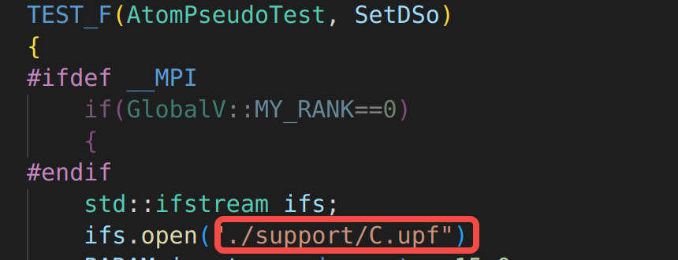
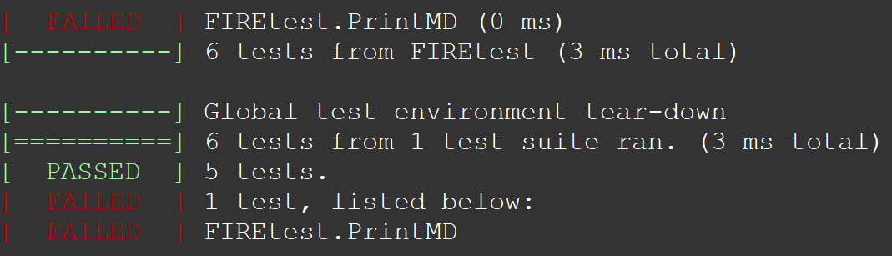
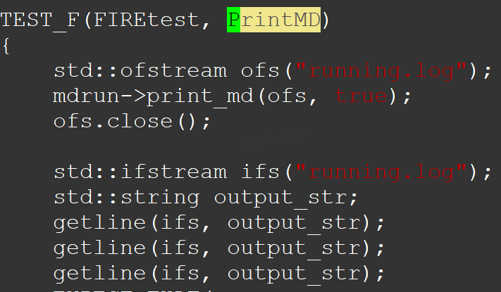
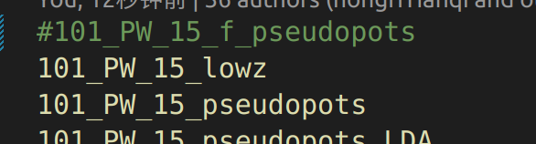

# ABACUS 中的测试（三）：测试方法

**作者：陈默涵，邮箱：mohanchen@pku.edu.cn**

**作者：刘千锐，邮箱：terry_liu@pku.edu.cn**

**最后更新时间：2025/03/28**

编写 ABACUS 代码常会遇到的问题：如何增加和修改目前程序已有的测试算例？本文档回答这个问题。

# 一、测试体系架构

## 1.1 单元测试分布

- 位置：`source/module_*/test` 系列目录

  - 并行测试：`test_parallel` 文件夹
  - 串行测试：`test_serial` 文件夹
- 覆盖范围：各基础模块（如 `module_base`、`module_md` 等）

## 1.2 集成测试分布

- 位置：`tests/integrate` 目录，里面包含数百个测试，注意测试的参数基本都是为了加快计算而设置的，不是真正用于应用所取的参数。
- 测试类型：

  - 完整端到端功能计算
  - 多模块协同测试

# 二、环境配置与编译

ABACUS 支持使用 `CMake` 中的 `Ctest` 工具进行代码的测试，详细使用方法可以搜索 Ctest 的教程，下面仅介绍常用、简单的使用方法。

## 2.1 编译配置

A. 首先需要使用 CMake 确定 abacus 的安装环境，在编译的时候加上 `-DBUILD_TESTING=ON` 指令，并将编译的缓存文件放入 `build` 文件中，进入 abacus 的代码文件夹，输入：

```
cmake --build build -DBUILD_TESTING=ON
```

Github 上的 CI 测试使用的是更详细的编译指令，如果需要进行全面测试需要执行：

```
cmake -B build -DBUILD_TESTING=ON \
-DENABLE_DEEPKS=ON -DENABLE_MLKEDF=ON \
-DENABLE_LIBXC=ON -DENABLE_LIBRI=ON \
-DENABLE_PAW=ON -DENABLE_GOOGLEBENCH=ON \
-DENABLE_RAPIDJSON=ON  -DCMAKE_EXPORT_COMPILE_COMMANDS=1
```

## 2.2 编译命令

编译 abacus 和所有测试文件（-j8 表示用 8 个线程编译，也可以选择更大）

```
cmake --build build -j8
```

该指令等价于

```
cd build; make -j8
```

安装 abacus 和测试所需支持文件，如 `test/support` 文件夹

```
cmake --install build
```

该指令等价于

```
cd build; make install
```

# 三、测试执行流程

## 3.1 完整测试套件

接下来，可以选择进行全面的测试，包括集成测试和单元测试：

```
cmake --build build --target test ARGS="-V"
```

该指令等价于

```
cd build; ctest -V
```

## 3.2 选择性测试

在修改 ABACUS 代码中，往往只需要进行特定几个单元测试的修改与测试，而不需要进行全部单元测试，此时可以进入对应的 `build/source/module_***/test` 文件夹下，

A. 使用 `make -j8` 编译测试文件，

B. 对于部分测试可能需要依赖准备好的测试材料，一般会放在 `support` 文件夹中，如下面的 `AtomPseudoTest` 测试需要打开 `support/C.upf` 文件：



此时需要将 support 复制过来才能进行测试，可以使用 `cp` 指令复制，或者直接输入：

```
make install
```

C. 若要测试该文件夹下所有的单元测试，可以使用

```
ctest
```

该指令等价于 `make test`，但推荐使用 `ctest`，因为其还可以使用 Ctest 特有的指令，例如想在测试运行的时候看到细节，可以用如下命令：

```
ctest -V
```

如果只需要测试特定的单元测试，可以直接运行改文件，例如测试 `md_fire` 文件：

```
./md_fire
```

如果测试失败了怎么办？首先在 `build/source` 的对应文件夹下运行测试程序，例如这是运行 `module_md` 下面的测试例子得到测试失败的算例：



上面这个截图说明 `FIREtest.PrintMD` 这个测试错了，找到这个错误信息源自测试程序中的函数 `TEST_F`：



把这个测试的最后一句话删掉 `remove("running.log");`，再编译和运行测试，得到“标准答案”。

常用的 Ctest 指令：

`ctest -V`：详细输出单元测试的每个小测试信息

`ctest -R <正则表达式>`：进行所有名称匹配该正则表达式的测试，例如：

`ctest -R base` 会进行所有名字包含 base 的单元测试，而在单元测试命名的时候推荐以 `模块名_测试名` 的方式命名，例如 `base_memory` 就是 `module_base` 下的 memory 测试，此时 `ctest -R base` 就能执行 module_base 所有的测试

`ctest -E <正则表达式>`：排除所有名称匹配该正则表达式的测试

# 四、如何进行集成测试

## 4.1 完整测试

ABACUS 的 Github CI 测试，默认使用 2 个 omp 线程

```
export OMP_NUM_THREADS=2
```

编译好 abacus 之后，可以进入 `build/tests/integrate`，执行 `ctest -V` 即可，其本质是执行 `abacus-develop/tests/integrate/Autotest.sh` 脚本，开发者也可以手动执行该脚本或者进入相应文件夹进行测试。`Autotest.sh` 默认会执行 `CASES_CPU.txt` 列出的所有文件，如果想取消某个测试，可以加 `#` 进行注释：



如果想指定 `CASES_GPU.txt`，可以使用 `Autotest.sh -f CASES_GPU.txt` 指定。

## 4.2 选择性测试

可以进入某个文件夹，例如

```
cd 109_PW_CR
```

每个文件夹会有一个 `jd` 文件，是 job description 的意思，用于描述这个测试的目的，如果有不完整的地方，也欢迎补充。result.ref 是用于参考的“标准答案”，`result.out` 是运行后输出的“答案”。此时如果运行

```
../Single_job.sh
```

即可执行这个测试。注意该脚本要执行需要在算例上一层存在一个文件叫 `general_info`，此文件包含三行，如果缺少信息则脚本不会顺利执行。

```
EXEC  /xxx/abacus （abacus可执行文件的地址）
CHECKACCURACY 2  （对比精度，此处取整数）
NUMBEROFPROCESS 4 （用的并行核数）
```

另外大家如果有兴趣了解测试的具体步骤，可以顺着 `Single_job.sh` 看脚本里写的内容，主要是用到了 `integrate` 文件夹下有一个 `tools` 文件夹，该文件夹规定了如何将当前运算结果和“标准答案”进行对比（主要是通过一个叫 `catch_properties.sh` 的脚本）

# 五、结语

本指南参考 CMake 官方文档和 Google Test 最佳实践编写，建议结合 [CMake 测试文档](https://cmake.org/cmake/help/latest/manual/ctest.1.html)和 [Google Test 指南](https://google.github.io/googletest/)

进行拓展学习。
