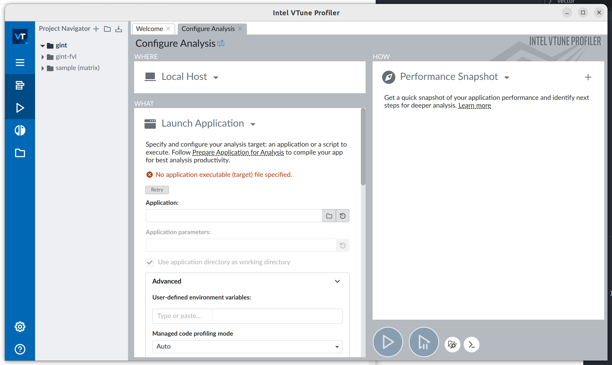
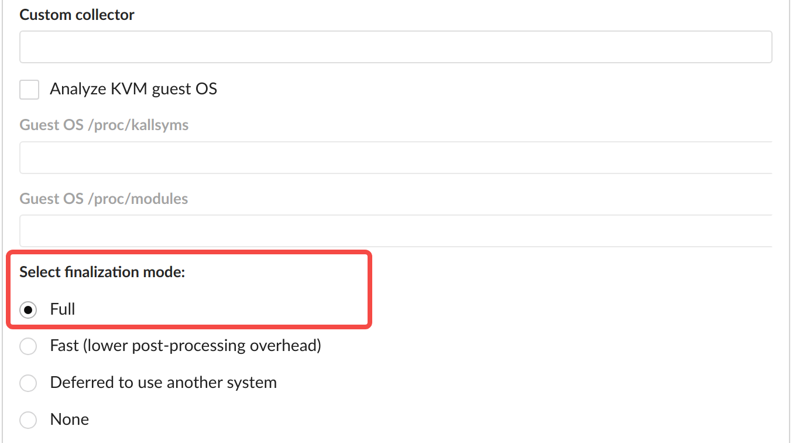
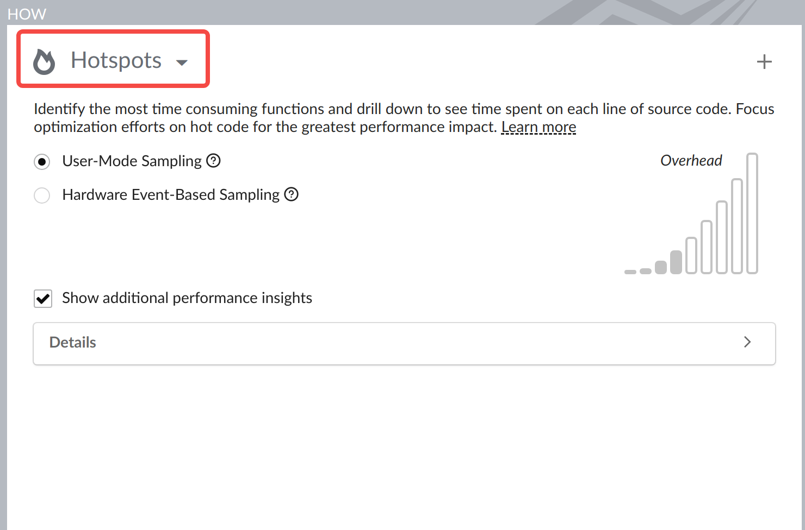
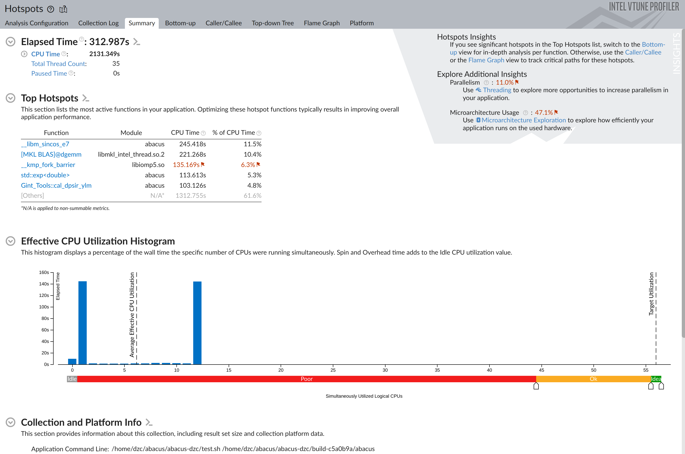
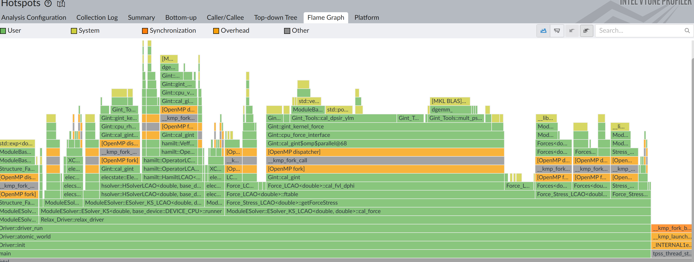
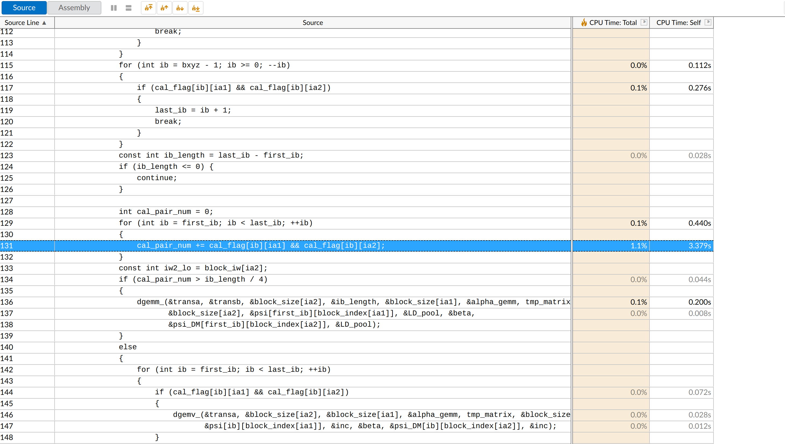
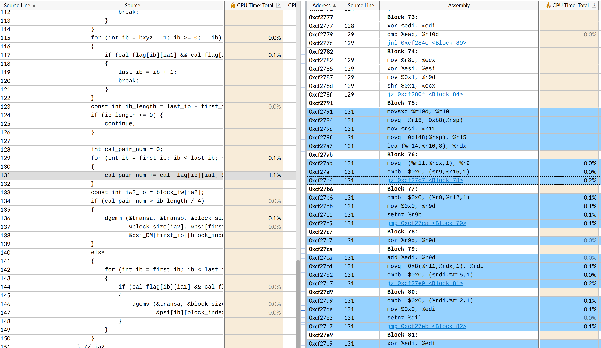

# 性能分析工具：vtune 快速上手教程

<strong>作者：邓子超，邮箱：2301213154@pku.edu.cn</strong>

<strong>最后更新时间：2024 年 7 月 13 日</strong>

# 前言

vtune 是 intel 开发的性能分析工具，可以帮助开发者很方便的找到程序中的热点函数，进而优化程序效率。虽然 ABACUS 自带统计函数运行时间的 timer，但是 ABACUS 的 timer 比较粗糙，它自身会带来很大的运行开销，所以 ABACUS 的 timer 只适合用来看程序中各部分耗时的大概比例，不适合用来对大量调用的单个函数进行细致调优。

# 安装

<strong>下面的介绍都是基于 linux 系统</strong>

intel 的 oneapi 中自带了 vtune，如果没有下载 oneapi，可以先到官网下载安装。安装之后在 oneapi 文件夹下可以找到 vtune 的可执行文件：

```bash
/opt/intel/oneapi/vtune/2024.2/bin64/vtune
/opt/intel/oneapi/vtune/2024.2/bin64/vtune-gui
```

# 使用

如果配置好了 oneapi 环境，可以直接在命令行输入 vtune-gui 启动 vtune 的图形界面：



## 创建 Project

进入 vtune 之后先点击左上角的 Project Navigator 右边的 + 号创建一个 project，比如我打算优化格点积分的 fvl 部分，就可以创建一个 project 命名为 gint_fvl。

## 配置 profile 参数

在右边 Configure Analysis 中配置运行参数，首先要在 Application:中填写可执行文件，这里可以输入 ABACUS 软件地址，也可以自己写一个 ABACUS 运行脚本（感觉这样比较方便配置 openmp 线程数以及 mpi 进程数），脚本记得 chmod +x 加上可执行权限，下面是我自己写的一个简单脚本：

```bash
#!/bin/bash
abacus="${1:-abacus}"
cd tests/performance/P102_si64_lcao
OMP_NUM_THREADS=12 mpirun -n 2 $abacus
cd ../../..
```

填完 Application 之后可以在下面的 Application parameter 中填写程序参数。

<strong>如果想要得到程序运行的火焰图，需要</strong>

1. <strong>在 Advanced 选项里面把”Select finalization mode“设置为”Full“，这里默认设置是”Fast“，默认设置下得不到火焰图</strong>



1. <strong>在右边 How 选项中选择"Hotspot"的 profile 方式</strong>



做完以上配置后，点击右下角的“start”按钮即可开始对程序进行 profile。

## 结果分析

profile 完成后 vtune 会输出一个程序报告：



报告中内容很多，大家可以自己慢慢探索，下面简单介绍两个比较实用的：

一个是火焰图:



点击其中某个具体函数，可以将更清楚看到这个函数里面每个自函数耗时占比：


第二是双击 Bottom-up 或者 Caller/callee 列出的函数，可以看到函数每行源代码耗时占比：



点击左上角的 Addembly，还可以看到源代码对应的汇编代码：



如果想知道 vtune 更深入用法，可以参考 intel 官方文档。
